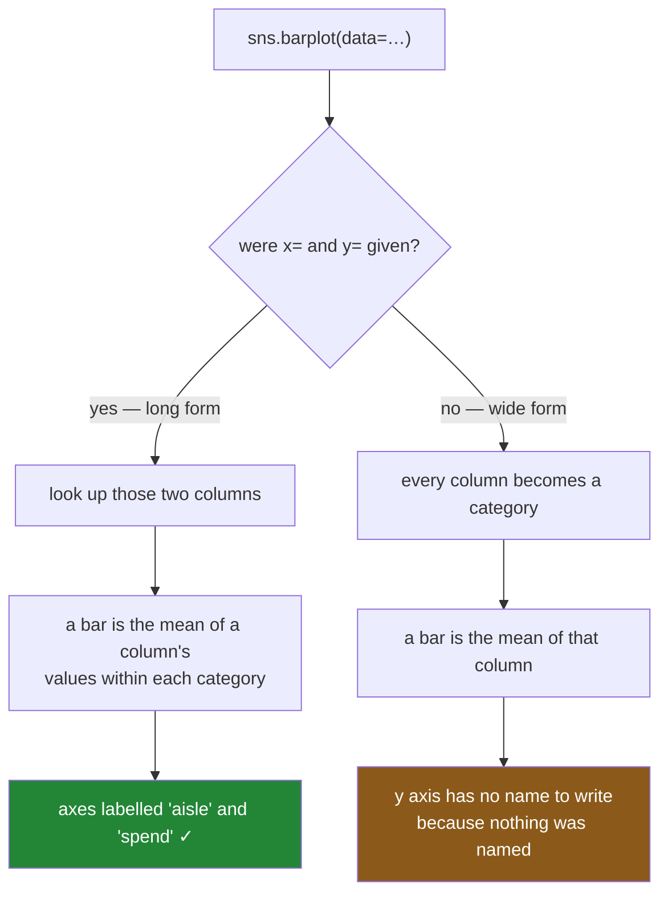

# 1.2 — The chart you did not ask for

## One-line answer

Handing seaborn a wide table does **not** raise — it quietly switches to wide-form mode, plots the
columns as categories, and gives you a chart that looks right, is labelled almost right, and answers a
different question from the one you asked.

---

## The story

Somebody in the flat wants a bar chart of the average spend per aisle. Nothing fancy — four bars, one
per aisle, tallest first, to settle whether produce or cleaning is the expensive one.

They have the fridge sheet already typed up, so they use that. Four lines of code, one chart, done.
Cleaning is the tallest bar. Produce is second. Everyone nods; the washing-up liquid is the problem.

A week later somebody else makes the same chart from the receipts instead, because that is the file
they happened to have open. Four bars again, same four aisles, same underlying trips.

**Produce is the tallest bar this time, and cleaning is second.**

Neither of them wrote a bug. Neither chart threw an error, and neither one has an obviously wrong
number on it. They asked the same question of the same shopping in two different ways, got two
different orderings, and had no reason to suspect a thing — because the first chart's y-axis had no
label on it and nobody looks at an axis that is empty.

---

## The idea in plain language

Seaborn accepts more than one shape of input. When you pass `data=` and then **name** columns with
`x=` and `y=`, it is in **long-form mode**: it looks up those names and plots what it finds.

When you pass `data=` and name nothing, it is in **wide-form mode**. There is no column to look up, so
it invents an interpretation: every column of your table becomes one category on the x-axis, and every
value inside that column is an observation of it. The seaborn data-structures page — *Data structures
accepted by seaborn* (2024, <https://seaborn.pydata.org/tutorial/data_structure.html>) — describes
this as the library "assigning" the columns to the categorical axis for you.

That is a genuinely useful convenience for a quick look at a matrix, and it is a trap for anybody who
arrived with a wide table by accident.

Here is why the two charts disagreed, in one sentence each.

**From the receipts, a bar is the average trip.** Fourteen cleaning trips happened; add their amounts
and divide by fourteen.

**From the fridge sheet, a bar is the average week's box.** Ten weeks have a cleaning number in them;
add those ten boxes and divide by ten. But a box is not a trip — it is however many trips that week
happened to hold, added up.

So one chart is averaging *trips* and the other is averaging *weekly totals*, and a busy week counts
once in the second and three times in the first. The aisle that people visit often in small amounts
looks cheap in one chart and expensive in the other, and neither label on either chart says which
you are looking at.

The word for what the second chart did is **aggregation**: replacing many numbers with one. It
happened back when the sheet was built ([1.1](1.1-one-row-per-observation.md)), and the chart was
just the first place anybody noticed.

---

## Why Setu needs it

- **[1.1](1.1-one-row-per-observation.md)** defined the two shapes. This is the reason the difference
  is not just tidiness: it changes the answer.
- **[1.3](1.3-melt-and-what-it-cannot-bring-back.md)** is the repair, and its limits.
- **[5.1](../05-the-statistics/5.1-the-bar-is-an-estimate.md)** takes this further: a bar is always an
  *estimate* of something, and the whole day turns on being able to say what.
- **Day 39** meets the one seaborn function that genuinely wants a wide table — `heatmap` — so the
  habit of asking "which mode am I in" earns its keep immediately.
- **Day 41**'s gate asks for eight charts that a stranger can read. A chart whose y-axis is blank fails
  that test on sight, and this part is where the blank axis comes from.

---

## The mechanism

The same question, asked twice. First from the fridge sheet:

```python
import matplotlib

matplotlib.use("Agg")
import matplotlib.pyplot as plt
import seaborn as sns

from spending import spending

trips = spending()
grid = trips.pivot_table(index="week", columns="aisle", values="spend", aggfunc="sum").round(2)

fig, ax = plt.subplots()
sns.barplot(data=grid, errorbar=None, ax=ax)
print("labels :", [t.get_text() for t in ax.get_xticklabels()])
print("heights:", [round(float(p.get_height()), 3) for c in ax.containers for p in c.patches])
print("x label:", repr(ax.get_xlabel()), " y label:", repr(ax.get_ylabel()))
plt.close(fig)
```

**Line by line:**

- `matplotlib.use("Agg")` **before** `import matplotlib.pyplot` — the Agg backend draws into memory
  instead of opening a window, which is what you want in a script, in a test and in CI. It must come
  first, because importing `pyplot` picks a backend and does not change its mind afterwards.
- `sns.barplot(data=grid, ...)` with **no `x=` and no `y=`** — this is the wide-form call. Seaborn has
  nothing to look up, so it treats each column as a category.
- `errorbar=None` — turn off the whiskers for now, so the only thing on screen is the bar heights.
  What those whiskers are is section 5, and turning them off until then is honest rather than tidy.
- `ax.containers` holds the drawn bars; `p.get_height()` is the number seaborn actually put on the
  chart. **Reading numbers back off the axes is how you check a chart**, and it is the same technique
  the tests in [6.2](../06-the-module/6.2-the-test-that-can-go-red.md) use.
- `plt.close(fig)` — a figure that is never closed stays alive in pyplot's registry, and a loop that
  makes twenty charts without closing them warns and then eats memory.

```text
labels : ['bakery', 'cleaning', 'dairy', 'produce']
heights: [4.584, 11.074, 6.388, 10.921]
x label: 'aisle'  y label: ''
```

Now the same question from the receipts:

```python
fig, ax = plt.subplots()
sns.barplot(data=trips, x="aisle", y="spend", errorbar=None, ax=ax)
print("labels :", [t.get_text() for t in ax.get_xticklabels()])
print("heights:", [round(float(p.get_height()), 3) for c in ax.containers for p in c.patches])
print("x label:", repr(ax.get_xlabel()), " y label:", repr(ax.get_ylabel()))
plt.close(fig)
```

**Line by line:**

- `x="aisle", y="spend"` — the long-form call. Now seaborn has two names to look up, and it knows what
  each axis is.
- Nothing else changed. Same function, same `errorbar=None`, same reading-back.
- The `y label` in the output is the tell: seaborn can only write `spend` on the axis because you told
  it the column is called `spend`. In the wide call there was no name, so it wrote nothing.

```text
labels : ['cleaning', 'dairy', 'produce', 'bakery']
heights: [7.91, 4.685, 9.829, 2.917]
x label: 'aisle'  y label: 'spend'
```

Put the two side by side:

| aisle | from the fridge sheet | from the receipts |
|---|---|---|
| bakery | 4.584 | 2.917 |
| cleaning | **11.074** | 7.910 |
| dairy | 6.388 | 4.685 |
| produce | 10.921 | **9.829** |

**Every number is different, and the ranking flips at the top.** The sheet says cleaning; the receipts
say produce. Both charts are drawn correctly from the frame they were given.

The arithmetic behind one of those pairs:

```python
cleaning = trips[trips["aisle"] == "cleaning"]
print("cleaning trips     :", len(cleaning), "-> mean per trip  :", round(cleaning["spend"].mean(), 3))
print("weeks with cleaning:", int(grid["cleaning"].notna().sum()), end="")
print(" -> mean per week  :", round(grid["cleaning"].mean(), 3))
```

**Line by line:**

- `len(cleaning)` is 14 — fourteen trips down that aisle across the year.
- `grid["cleaning"].notna().sum()` is 10 — ten *weeks* in which anybody went. Four of the fourteen
  trips were somebody's second or third visit in a week already counted.
- `grid["cleaning"].mean()` skips the `NaN` weeks by default, so the divisor really is 10 and not 12.
  That default is friendly and it is also the second thing hiding in the wide chart.
- **Fourteen numbers averaged one way, ten numbers averaged another way.** Neither divisor is written
  anywhere on either chart.

```text
cleaning trips     : 14 -> mean per trip  : 7.91
weeks with cleaning: 10 -> mean per week  : 11.074
```

What seaborn did with each input:



**The orange box is the only warning you get**, and it is a piece of missing text rather than a
message.

---

## When it breaks

**The wide call that succeeds and misleads** is above; it produces no error at all, which is the whole
problem. Here are the two that do produce one.

**Naming a column while in a wide frame:**

```text
$ uv run python -c "
import matplotlib
matplotlib.use('Agg')
import seaborn as sns
from spending import spending
grid = spending().pivot_table(index='week', columns='aisle', values='spend', aggfunc='sum')
sns.barplot(data=grid, x='aisle', y='spend')
"
```

```text
ValueError: Could not interpret value `aisle` for `x`. An entry with this name does not appear in `data`.
```

**What it means.** `aisle` is not a column of `grid`; it is the *name of the column index* — the word
printed above the headings. Seaborn looks in the columns and the named index levels, and a columns'
`.name` is neither.

**The smallest fix is to plot from `trips` instead.** The wide frame does not contain the variable
under any name it can reach.

**A mixed-up wide frame, where seaborn puts a text column on a numeric axis:**

```text
$ uv run python -c "
import matplotlib
matplotlib.use('Agg')
import seaborn as sns
from spending import spending
sns.barplot(data=spending(), x='week', y='aisle')
"
```

That one **does not raise either**. Seaborn sees a text column on `y`, decides the chart must be
horizontal, and draws four bars whose lengths are averages of the week numbers. The y tick labels come
back as `['cleaning', 'dairy', 'produce', 'bakery']`.

**What it means.** There is no such thing as an average aisle, but there is an average week number per
aisle, and that is the chart you got. Seaborn inferred an orientation from the dtypes and was, on its
own terms, right.

**The smallest fix is to look at the axis labels of every chart you make**, once, before you believe
it. It is a second of work and it catches this whole family of mistakes, because the label is always
either the name you gave or a blank.

---

## In production

**What a professional writes instead of the teaching version.** They never call a plotting function
without naming both axes, and they say so with a check rather than a habit:

```python
import pandas as pd
import seaborn as sns
from matplotlib.axes import Axes


def spend_per_aisle(trips: pd.DataFrame, ax: Axes) -> Axes:
    """Mean spend per trip, per aisle. Long form in; the caller owns the axes."""
    expected = {"aisle", "spend"}
    if not expected <= set(trips.columns):
        raise KeyError(f"need {sorted(expected)} as columns; got {list(trips.columns)}")
    sns.barplot(data=trips, x="aisle", y="spend", errorbar=None, ax=ax)
    ax.set_ylabel("mean spend per trip (GBP)")
    return ax
```

**Line by line:**

- `expected <= set(trips.columns)` — set containment, which reads as "is every name I need present".
  It turns the wide-form accident into a `KeyError` at the top of your own function.
- The type hints say `pd.DataFrame` in and `Axes` out, so a reader knows this is an axes-level function
  before reading the body — that distinction is [2.1](../02-the-two-kinds-of-function/2.1-a-chart-in-your-own-figure.md).
- `ax.set_ylabel("mean spend per trip (GBP)")` — seaborn would have written `spend`, which is the
  column name, not the quantity. **"Mean spend per trip" is the sentence that would have prevented the
  story at the top of this part**, because it says what the divisor was.
- The docstring says "long form in". Half the arguments in a plotting codebase are called `df`, and the
  shape is the thing you actually need to know.

**What changes at scale.** Wide-form mode gets *more* attractive as tables get bigger, because a
matrix — a correlation matrix, a confusion matrix, an embedding-similarity block — is genuinely wide
and genuinely wants to be plotted as one. The rule that survives is not "never plot wide"; it is
**"say out loud which mode you are in"**. A frame that is wide on purpose gets a name that says so
(`corr_matrix`, not `df`), and a frame that is wide by accident gets melted before it reaches a chart.

The other thing scale changes is who notices. On fifty rows you can print the frame and see the
problem. On ten million a wide table is often produced by an upstream query with a `GROUP BY` in it,
and the aggregation you are unaware of happened in the database. **Day 42**'s SQL day is where that
becomes concrete: the shape your chart receives is decided by the `SELECT`, not by the plotting code.

**The failure that only appears with real data.** A monitoring dashboard plotted average response time
per service from a table that was already grouped per five-minute bucket. Every service therefore
contributed one number per bucket, no matter whether it had served ten requests or ten thousand in
that bucket. The quiet service with three slow calls an hour dominated the chart, and the busy service
whose median was fine looked healthy while a tenth of its calls timed out. The chart was an
**unweighted mean of means**, which is not a mean of anything anybody cared about. Nobody spotted it
for months, because the chart had always looked like that.

**The review comment a senior engineer leaves.** *"`sns.barplot(data=summary)` with no `x=` or `y=` —
that is wide-form mode, so each bar is the mean of a column and the y-axis has no label. Is `summary`
already aggregated? If so this is a mean of means. Plot from the row-level frame, name both axes, and
put the divisor in the y-label."*

**The interview question.** *"Your teammate's bar chart and yours disagree, from the same data. Where
do you look first?"* At what one bar is the average **of**. A chart drawn from row-level data averages
observations; a chart drawn from an already-aggregated table averages summaries, and an unweighted
mean of means is not the mean unless every group is the same size. The giveaway is usually an
unlabelled axis, because a plotting library can only name an axis if you named the column — so a blank
y-axis is evidence that nobody told the library what the numbers were.

---

## Check yourself

```bash
uv run python -c "
import matplotlib
matplotlib.use('Agg')
import matplotlib.pyplot as plt
import seaborn as sns
from spending import spending
trips = spending()
grid = trips.pivot_table(index='week', columns='aisle', values='spend', aggfunc='sum')
for label, kwargs, frame in [
    ('wide', {}, grid),
    ('long', {'x': 'aisle', 'y': 'spend'}, trips),
]:
    fig, ax = plt.subplots()
    sns.barplot(data=frame, errorbar=None, ax=ax, **kwargs)
    heights = [round(float(p.get_height()), 2) for c in ax.containers for p in c.patches]
    print(label, dict(zip([t.get_text() for t in ax.get_xticklabels()], heights)),
          'ylabel=', repr(ax.get_ylabel()))
    plt.close(fig)
"
```

Two charts, four aisles each, eight numbers, none of them equal. Say which aisle each chart calls the
most expensive, and say what the divisor was in each case.

**Answer out loud, without scrolling up:**

> Seaborn did not raise when you handed it a wide table. Say what it did instead, and name the one
> thing on the finished chart that tells you it happened. Then say why the two charts disagree about
> which aisle costs the most, in a sentence that contains the word *divisor*.

---

**Next:** [1.3 — `melt`, and what it cannot bring back](1.3-melt-and-what-it-cannot-bring-back.md).
