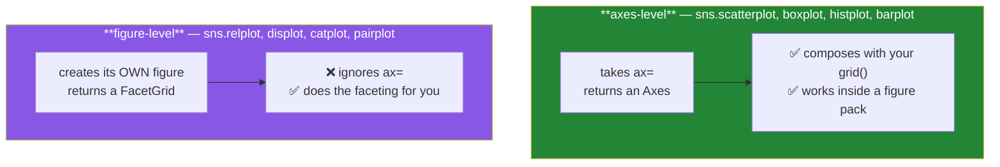

# Day 38 — Seaborn: statistical plots and faceting

**Phase 5 · Module 5** · ID: **VIZ-04** (Seaborn: statistical plots, `hue`/`col` faceting)

> **Yesterday:** the chart chooser, and `assert_honest_bar`.
> **Today:** the library that turns "one chart per group" from a loop into an argument — and the
> distinction between its two APIs that decides whether your charts compose with yesterday's.
> **Tomorrow:** distributions and the correlation heatmap.

```bash
./m start 38 && ./m scaffold 38
```

**Time:** 110 minutes. **Request budget:** 0 model calls.

---

## §1 The story

Seaborn is Matplotlib with statistics built in and sensible defaults on top. Two things it gives you
that are genuinely hard to hand-roll:

**Statistical transforms.** `sns.barplot` does not plot your values — it computes a mean per group
*and a bootstrapped 95% confidence interval*, then draws both. You wrote that bootstrap by hand on
Day 25; Seaborn does it per group, automatically. That error bar is the fix to yesterday's
bar-of-means problem, applied by default.

**Faceting.** "The same chart, once per group" is a loop, a grid, shared axis limits, consistent
colours, and a title per panel. Seaborn makes it `col="venue"`.

But there is a distinction you must get right on day one, because it determines whether Seaborn
composes with the `plots.py` you built yesterday:



**Axes-level functions take `ax=` and return an Axes.** They slot into Day 36's `grid()` and Day 41's
figure pack. **Figure-level functions create their own figure** and raise or ignore `ax=`. They are
excellent for exploring and wrong for a report you are assembling panel by panel.

The rule this project adopts: **axes-level everywhere in `plots.py`; figure-level only in notebooks.**
If you need faceting inside a composed figure, you build the grid yourself and call the axes-level
function once per panel — which is exactly what §5's helper does.

---

## §2 Setup — run this

```bash
uv add "seaborn==0.13.2"
mkdir -p days/day-38/lab
touch days/day-38/lab/seaborn_api.py
```

Pin whatever your Day-1 verify run reported.

---

## §3 VIZ-04 — the two APIs

`days/day-38/lab/seaborn_api.py`:

```python
"""VIZ-04: Seaborn's two APIs, statistical transforms, and faceting."""

from __future__ import annotations

import matplotlib

matplotlib.use("Agg")

import matplotlib.pyplot as plt  # noqa: E402
import numpy as np  # noqa: E402
import pandas as pd  # noqa: E402
import seaborn as sns  # noqa: E402

from setu.arrays import make_rng  # noqa: E402


def papers(n: int = 600) -> pd.DataFrame:
    rng = make_rng(0)
    venue = rng.choice(["NeurIPS", "ICML", "ACL"], size=n)
    year = rng.integers(2019, 2024, size=n)
    base = np.where(venue == "NeurIPS", 120, np.where(venue == "ICML", 90, 60))
    return pd.DataFrame(
        {
            "venue": venue,
            "year": year,
            "citations": rng.poisson(base + (year - 2019) * 15),
            "pages": rng.integers(4, 14, size=n),
            "open_access": rng.random(n) < 0.4,
        }
    )


def axes_level_composes() -> None:
    data = papers()
    fig, axes = plt.subplots(1, 2, figsize=(10, 4))

    returned = sns.boxplot(data=data, x="venue", y="citations", ax=axes[0])
    sns.scatterplot(data=data, x="pages", y="citations", hue="venue", ax=axes[1], s=12)

    print(f"\n{type(returned).__name__=}")
    print(f"{returned is axes[0]=}   <- it drew on YOUR axes and handed it back")
    print(f"{len(fig.axes)=}   <- still one figure, two panels")
    print("  ^ this is why plots.py uses axes-level functions only.")
    plt.close(fig)


def figure_level_does_not() -> None:
    data = papers()
    fig, ax = plt.subplots()

    grid_obj = sns.displot(data=data, x="citations", col="venue", height=3)
    print(f"\n{type(grid_obj).__name__=}   <- a FacetGrid, not an Axes")
    print(f"{type(grid_obj.figure).__name__=}   <- it made its own Figure")
    print(f"{grid_obj.axes.shape=}   <- an array of the panels it created")
    print("  Your `ax` was ignored entirely. Great for exploring; wrong for a figure pack.")

    plt.close(fig)
    plt.close(grid_obj.figure)


def the_statistical_transform() -> None:
    data = papers()
    fig, axes = plt.subplots(1, 2, figsize=(10, 4))

    sns.barplot(data=data, x="venue", y="citations", ax=axes[0], errorbar=("ci", 95))
    axes[0].set_title("barplot: mean + bootstrapped 95% CI")

    manual = data.groupby("venue", observed=True)["citations"].mean()
    axes[1].bar(manual.index, manual.to_numpy())
    axes[1].set_title("plain bar: the mean, and nothing else")

    print(f"\n{len(axes[0].lines)=}   <- the error bars are Line2D artists")
    print(f"{len(axes[1].lines)=}   <- none")
    print("\n  seaborn ran YOUR Day 25 bootstrap, per group, by default.")
    print("  errorbar=('ci', 95) | ('sd', 1) | ('se', 2) | None - state which you mean.")
    plt.close(fig)


def hue_dodge_and_order() -> None:
    data = papers()
    fig, axes = plt.subplots(1, 3, figsize=(14, 4))

    sns.boxplot(data=data, x="venue", y="citations", hue="open_access", ax=axes[0])
    axes[0].set_title("hue: a second categorical")

    sns.boxplot(
        data=data, x="venue", y="citations", ax=axes[1],
        order=["ACL", "ICML", "NeurIPS"],
    )
    axes[1].set_title("order=: explicit category order")

    sns.stripplot(data=data.sample(120, random_state=0), x="venue", y="citations",
                  ax=axes[2], size=3, alpha=0.5, jitter=0.25)
    axes[2].set_title("stripplot: the raw points")

    print(f"\n{[t.get_text() for t in axes[1].get_xticklabels()]=}")
    print("  order= is how you honour an ordered categorical (Day 34) in seaborn.")
    print("  Without it, seaborn sorts by first appearance - which is your row order.")
    plt.close(fig)


def long_form_is_required() -> None:
    wide = pd.DataFrame({"neurips": [1, 2, 3], "icml": [4, 5, 6]})
    print(f"\nwide:\n{wide}")

    long = wide.melt(var_name="venue", value_name="citations")
    print(f"\nlong:\n{long}")
    print("\n  Seaborn wants LONG form: one row per observation, one column per variable.")
    print("  That is Day 32's to_long(). x=, y=, hue=, col= are all COLUMN NAMES.")


def regression_and_smoothing() -> None:
    data = papers()
    fig, axes = plt.subplots(1, 2, figsize=(10, 4))

    sns.regplot(data=data, x="pages", y="citations", ax=axes[0],
                scatter_kws={"s": 8, "alpha": 0.3}, line_kws={"color": "firebrick"})
    axes[0].set_title("regplot: fit + CI band")

    sns.lineplot(data=data, x="year", y="citations", hue="venue", ax=axes[1], errorbar=("ci", 95))
    axes[1].set_title("lineplot: mean per x, with a CI band")

    print("\n  regplot FITS A MODEL and draws it. That is a claim, not a decoration:")
    print("  it assumes a linear relationship. Day 93 covers when that assumption fails.")
    plt.close(fig)


def faceting_by_hand() -> None:
    data = papers()
    venues = sorted(data["venue"].unique())
    fig, axes = plt.subplots(1, len(venues), figsize=(4 * len(venues), 3.5), sharey=True)

    for ax, venue in zip(axes, venues, strict=True):
        subset = data[data["venue"] == venue]
        sns.histplot(data=subset, x="citations", ax=ax, bins=20)
        ax.set_title(f"{venue} (n={len(subset)})")

    print(f"\n{[ax.get_ylim() for ax in axes]=}")
    print("  ^ sharey=True: IDENTICAL limits, so the panels are comparable.")
    print("  Without it each panel autoscales and a small group looks as tall as a big one.")
    print("  THAT is the trap in hand-rolled faceting, and why §5 wraps it.")
    plt.close(fig)


if __name__ == "__main__":
    axes_level_composes()
    figure_level_does_not()
    the_statistical_transform()
    hue_dodge_and_order()
    long_form_is_required()
    regression_and_smoothing()
    faceting_by_hand()
```

**Line by line:**

- `sns.boxplot(..., ax=axes[0])` returns **the same Axes you passed in**. `returned is axes[0]` is
  `True` — the identity check (Day 5) proving it composed rather than created.
- `sns.displot(...)` returns a **`FacetGrid`**, which owns its own `Figure`. Your `ax` was ignored.
  The tell is in the name: `displot` / `relplot` / `catplot` / `pairplot` are figure-level; `histplot`
  / `scatterplot` / `boxplot` / `barplot` are axes-level. **Learn which is which now.**
- `errorbar=("ci", 95)` — Seaborn bootstraps a 95% confidence interval per group. This is Day 25's
  `bootstrap_mean_ci`, run for you. The options are `("ci", 95)`, `("sd", 1)`, `("se", 2)` or `None`,
  and **they mean different things**: a standard deviation describes the spread of the data; a
  confidence interval describes the uncertainty of the *mean*. Say which you meant in the caption.
- `len(axes[0].lines)` versus `len(axes[1].lines)` — the error bars are real artists on the Axes,
  which is how §6 tests for them.
- `hue="open_access"` — splits each category by a second variable and dodges the boxes side by side.
  One argument, and the chart answers a two-dimensional question.
- `order=["ACL", "ICML", "NeurIPS"]` — **without it, Seaborn orders by first appearance in your
  dataframe**, which means the chart changes if the rows are shuffled. For an ordered categorical
  (Day 34), pass `order=` explicitly or the meaning of the order is lost.
- `long_form_is_required` — Seaborn's `x=`, `y=`, `hue=` and `col=` are all **column names**, so the
  data must be long: one row per observation. That is Day 32's `to_long`, and it is the single most
  common reason a Seaborn call fails.
- `sns.regplot` — **fits a linear model and draws it with a confidence band.** That is a statistical
  claim, not a decoration: it assumes the relationship is linear. On data where it is not, the line is
  confidently wrong. Day 93 covers the assumptions.
- `sharey=True` in `faceting_by_hand` — **the trap in hand-rolled faceting.** Without shared limits,
  each panel autoscales independently, so a group with 20 papers and a group with 400 both fill their
  panel and look equally large. Seaborn's figure-level faceting shares axes by default; when you
  build the grid yourself, you must remember. §5 wraps it so you cannot forget.
- `zip(axes, venues, strict=True)` — Day 6's rule, still enforced.

---

## §4 Build brief

Extend `src/setu/plots.py`:

```python
def facet(
    data,
    plot_fn,
    *,
    by: str,
    share_y: bool = True,
    share_x: bool = True,
    ncols: int = 3,
    max_panels: int = 12,
    **plot_kwargs,
) -> tuple:
    """TODO(me): small multiples - one panel per group - built on axes-level functions.

    - `plot_fn(data=subset, ax=ax, **plot_kwargs)` is called once per group
    - panels are laid out in a grid using grid() from Day 36
    - share_y/share_x default True: identical limits, so panels are COMPARABLE
    - each panel titled '<group> (n=<rows>)'
    - groups sorted by the ORDERED CATEGORICAL order if `by` is one, else alphabetically
    - raise DataError if the group count exceeds max_panels (name the count; a 40-panel
      figure is unreadable, and silently producing one helps nobody)
    - hide any unused axes in the final row
    - return (fig, list_of_axes)
    """
    raise NotImplementedError


def grouped_box(data, *, x: str, y: str, hue: str | None = None, ax=None, order=None):
    """TODO(me): a box plot with the raw points overlaid at low alpha.

    - box first, then a stripplot on the same axes (the box hides the sample size;
      the points restore it)
    - if `x` is an ordered categorical and `order` is None, derive order from the dtype
    - annotate n per category on the tick labels: 'ACL\\n(n=182)'
    - raise DataError if any category has fewer than 3 rows
    """
    raise NotImplementedError


def mean_with_ci(data, *, x: str, y: str, ax=None, error: str = "ci"):
    """TODO(me): the HONEST bar chart - mean plus a 95% CI per group.

    - error must be 'ci', 'sd' or 'se'; anything else raises DataError
    - the y-axis must include zero (call assert_honest_bar from Day 37 before returning)
    - the axis label must state which error measure was used - 'mean citations (95% CI)'
    - raise DataError if any group has fewer than 3 rows (a CI over 2 points is theatre)
    """
    raise NotImplementedError
```

- `facet` defaulting `share_y=True` and **raising** above 12 panels is the design opinion: comparable
  panels by default, and a refusal rather than an unreadable 40-panel wall.
- `grouped_box` overlaying points is the Day 37 lesson continued — a box plot also summarises, and the
  points restore what it hid.
- `mean_with_ci` calling `assert_honest_bar` before returning means the chart lint from yesterday runs
  automatically on the chart most likely to need it.

---

## §5 The eval that must be able to fail

Add to `tests/test_plots.py`:

```python
@pytest.fixture
def grouped():
    rng = make_rng(0)
    return pd.DataFrame(
        {
            "venue": ["a"] * 50 + ["b"] * 50 + ["c"] * 20,
            "citations": rng.poisson(100, 120).astype(float),
            "pages": rng.integers(4, 14, 120),
        }
    )


def test_facet_makes_one_panel_per_group(grouped):
    import seaborn as sns

    fig, axes = facet(grouped, sns.histplot, by="venue", x="citations")
    assert len(axes) >= 3
    titled = [a for a in axes if a.get_title()]
    assert len(titled) == 3
    plt.close(fig)


def test_facet_titles_include_n(grouped):
    import seaborn as sns

    fig, axes = facet(grouped, sns.histplot, by="venue", x="citations")
    titles = " ".join(a.get_title() for a in axes)
    assert "n=50" in titles and "n=20" in titles
    plt.close(fig)


def test_facet_shares_limits_by_default(grouped):
    import seaborn as sns

    fig, axes = facet(grouped, sns.histplot, by="venue", x="citations")
    used = [a for a in axes if a.get_title()]
    limits = {a.get_ylim() for a in used}
    assert len(limits) == 1, "panels autoscaled independently - they are not comparable"
    plt.close(fig)


def test_facet_can_unshare_when_asked(grouped):
    import seaborn as sns

    fig, axes = facet(grouped, sns.histplot, by="venue", x="citations", share_y=False)
    used = [a for a in axes if a.get_title()]
    assert len({a.get_ylim() for a in used}) > 1
    plt.close(fig)


def test_facet_refuses_too_many_panels():
    import seaborn as sns

    frame = pd.DataFrame({"g": [f"g{i}" for i in range(40)], "v": range(40)})
    with pytest.raises(DataError) as info:
        facet(frame, sns.histplot, by="g", x="v", max_panels=12)
    assert "40" in str(info.value)


def test_facet_hides_unused_panels(grouped):
    import seaborn as sns

    fig, axes = facet(grouped, sns.histplot, by="venue", x="citations", ncols=2)
    unused = [a for a in axes if not a.get_title()]
    assert all(not a.get_visible() for a in unused), "an empty panel was left visible"
    plt.close(fig)


def test_facet_respects_ordered_categorical():
    dtype = pd.CategoricalDtype(["low", "medium", "high"], ordered=True)
    frame = pd.DataFrame(
        {"q": pd.Series(["high", "low", "medium"] * 10, dtype=dtype), "v": range(30)}
    )
    import seaborn as sns

    fig, axes = facet(frame, sns.histplot, by="q", x="v")
    titles = [a.get_title().split(" ")[0] for a in axes if a.get_title()]
    assert titles == ["low", "medium", "high"]
    plt.close(fig)


def test_grouped_box_overlays_the_raw_points(grouped):
    ax = grouped_box(grouped, x="venue", y="citations")
    assert len(ax.collections) > 0, "no strip points - the box hides the sample size"
    plt.close(ax.figure)


def test_grouped_box_annotates_n(grouped):
    ax = grouped_box(grouped, x="venue", y="citations")
    labels = " ".join(t.get_text() for t in ax.get_xticklabels())
    assert "50" in labels and "20" in labels
    plt.close(ax.figure)


def test_grouped_box_rejects_a_tiny_category():
    frame = pd.DataFrame({"g": ["a", "a", "a", "b"], "v": [1.0, 2.0, 3.0, 4.0]})
    with pytest.raises(DataError):
        grouped_box(frame, x="g", y="v")


def test_mean_with_ci_draws_error_bars(grouped):
    ax = mean_with_ci(grouped, x="venue", y="citations")
    assert len(ax.lines) >= 3, "no error bars - this is a bar of means again"
    plt.close(ax.figure)


def test_mean_with_ci_axis_includes_zero(grouped):
    ax = mean_with_ci(grouped, x="venue", y="citations")
    assert ax.get_ylim()[0] <= 0
    plt.close(ax.figure)


def test_mean_with_ci_label_names_the_error_measure(grouped):
    ax = mean_with_ci(grouped, x="venue", y="citations", error="sd")
    assert "sd" in ax.get_ylabel().lower(), "the reader cannot tell what the bars mean"
    plt.close(ax.figure)


def test_mean_with_ci_rejects_an_unknown_error(grouped):
    with pytest.raises(DataError):
        mean_with_ci(grouped, x="venue", y="citations", error="vibes")


def test_no_figure_level_seaborn_in_src():
    """Figure-level functions ignore ax= and cannot compose."""
    from pathlib import Path

    banned = ("sns.relplot", "sns.displot", "sns.catplot", "sns.lmplot", "sns.pairplot")
    offenders = [
        f"{p.name}:{i}"
        for p in Path("src/setu").rglob("*.py")
        for i, line_ in enumerate(p.read_text(encoding="utf-8").splitlines(), 1)
        if any(b in line_ for b in banned) and "noqa" not in line_
    ]
    assert not offenders, f"figure-level seaborn in a library function: {offenders}"
```

**Line by line:**

- `test_facet_shares_limits_by_default` — **the day's real assessment.** It collects the y-limits of
  every used panel into a set and asserts there is exactly one. Independent autoscaling makes a
  20-row group look as tall as a 50-row group, which is a genuinely misleading chart produced by
  forgetting one argument.
- `test_facet_can_unshare_when_asked` — the opposite direction, so the flag is real rather than
  decorative.
- `test_facet_refuses_too_many_panels` — asserts the **count appears in the message**. "Too many
  groups" sends you counting; "40 groups exceeds max_panels=12" does not.
- `test_facet_hides_unused_panels` — a 3-group, 2-column grid has 4 slots. The empty one must be
  hidden, not left as a blank box with ticks.
- `test_facet_respects_ordered_categorical` — Day 34's ordered dtype honoured in the panel order.
  Alphabetical sorting would give `high, low, medium`, which destroys the meaning.
- `test_grouped_box_overlays_the_raw_points` — checks `ax.collections`, where the strip points live
  (lines and patches are separate artist groups). The failure message states *why*.
- `test_mean_with_ci_label_names_the_error_measure` — a CI and an SD look identical on the chart and
  mean different things. If the label does not say which, the reader cannot interpret it.
- `test_no_figure_level_seaborn_in_src` — the eighth repo-wide guard, encoding §1's rule.

```bash
uv run python -m pytest tests/test_plots.py -v
```

---

## §6 Request budget

| Resource | Spent today |
|---|---|
| LLM calls | **0** |
| Network | one `uv add` resolution |

---

## §7 Traps

- **Using a figure-level function inside a composed figure.** It ignores `ax=` and makes its own.
- **Passing wide data.** Seaborn needs long form: one row per observation.
- **Faceting without shared axes.** A small group looks as large as a big one.
- **Forgetting `order=`.** Seaborn orders by first appearance, so shuffling rows changes the chart.
- **Not saying which error bar you drew.** CI and SD look identical and mean different things.
- **Treating `regplot` as decoration.** It fits a model and asserts linearity.
- **A box plot with no `n`.** The box looks the same for 6 points and 6000.
- **Forty panels.** Unreadable. Aggregate, or pick the top groups deliberately.
- **`sns.set_theme()` inside a library function.** It mutates global rcParams (Day 40).

---

## §8 Verify before you code

Written **2026-08-21**:

- <https://seaborn.pydata.org/tutorial/function_overview.html> — the axes-level vs figure-level table.
  **Read this one properly.**
- <https://seaborn.pydata.org/tutorial/error_bars.html> — what `errorbar=` actually computes.
- <https://seaborn.pydata.org/tutorial/data_structure.html> — long-form vs wide-form input.
- <https://seaborn.pydata.org/api.html> — check which functions are which in your pinned version.

---

## §9 Say it in an interview

> "The distinction that matters in Seaborn is axes-level versus figure-level. Axes-level functions
> take `ax=` and hand it back, so they compose into a figure you're assembling; figure-level ones like
> `displot` create their own figure and silently ignore your axes. My library only uses axes-level,
> with a test that greps for the figure-level names. The other thing worth knowing is that
> `sns.barplot` isn't plotting your data — it computes a mean and a bootstrapped CI per group, which
> is the fix to the bar-of-means problem by default. And when I facet by hand I share the axis limits,
> because independent autoscaling makes a twenty-row group look the same height as a five-hundred-row
> one — there's a test that collects the y-limits into a set and asserts there's exactly one."

---

## §10 Done when

Tick [`CHECKLIST.md`](CHECKLIST.md), then `./m check && ./m done 38`.
