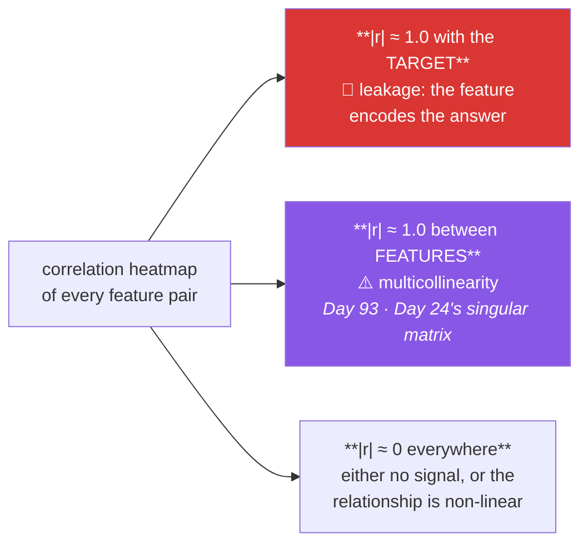

# Day 39 — Distributions and relationships

**Phase 5 · Module 5** · IDs: **VIZ-05** (histogram, KDE, box, violin), **VIZ-06** (scatter, pairplot, heatmap, correlation)

> **Yesterday:** Seaborn's two APIs and `facet`.
> **Today:** the two chart families that carry the most information per square inch — and the
> correlation heatmap, which is the chart that will find the leak on Day 84.
> **Tomorrow:** palettes, styling, and making all of it accessible.

```bash
./m start 39 && ./m scaffold 39
```

**Time:** 110 minutes. **Request budget:** 0 model calls.

---

## §1 The story

Two families, and both exist to answer questions a summary statistic cannot.

**Distributions.** Day 37 showed a bar of means hiding a bimodal group. Today you learn the four
charts that would have caught it, and what each hides in turn:

| Chart | Shows | Hides |
|---|---|---|
| **histogram** | the actual shape, including gaps and modes | depends heavily on bin width |
| **KDE** | a smooth shape, good for overlaying groups | invents density where there is none; bandwidth is a choice |
| **box** | median, quartiles, outliers — compact | **completely hides bimodality** |
| **violin** | shape *and* quartiles | needs enough data to be honest; also smoothed |
| **strip / swarm** | every single point | unusable beyond a few hundred rows |

There is no "best" one. The honest default for a report is **box + strip overlaid** (Day 38's
`grouped_box`) or **violin + quartiles**, because those pair a summary with the raw evidence.

**Relationships.** A scatter shows two variables. A **correlation heatmap** shows every pair at once —
and that is why it earns its own place in this plan:



The red box is the important one. On Day 84 you will build a model and a feature will correlate 0.98
with the target. That is almost never a brilliant feature — it is usually the target in disguise: a
column computed *from* the answer, or recorded *after* it. `days_until_churn` predicting `churned`.
`final_grade_letter` predicting `passed`. **The heatmap is a five-second leak detector**, and it is
worth running before any model, every time.

One caution that stops it becoming a superstition: **Pearson correlation measures linear association
only.** Anscombe's quartet (Day 62) is four datasets with identical `r` and four completely different
shapes. A correlation of 0 does not mean independence, and a heatmap is a screen, not a verdict.

---

## §2 Setup — run this

```bash
mkdir -p days/day-39/lab
touch days/day-39/lab/distributions.py
```

`src/setu/plots.py` and `tests/test_plots.py` grow today. No new packages.

---

## §3 VIZ-05 — distributions

`days/day-39/lab/distributions.py`:

```python
"""VIZ-05 / VIZ-06: distributions, relationships, and the leak detector."""

from __future__ import annotations

import matplotlib

matplotlib.use("Agg")

import matplotlib.pyplot as plt  # noqa: E402
import numpy as np  # noqa: E402
import pandas as pd  # noqa: E402
import seaborn as sns  # noqa: E402

from setu.arrays import make_rng  # noqa: E402


def bimodal_sample(n: int = 400) -> np.ndarray:
    rng = make_rng(0)
    return np.concatenate([rng.normal(35, 4, n // 2), rng.normal(69, 4, n // 2)])


def bin_width_changes_the_story() -> None:
    values = bimodal_sample()
    fig, axes = plt.subplots(1, 4, figsize=(16, 3.5), sharey=False)

    for ax, bins in zip(axes, [3, 12, 40, 200], strict=True):
        ax.hist(values, bins=bins)
        ax.set_title(f"bins={bins}")

    print("\n  bins=3   : one lump. The bimodality is invisible.")
    print("  bins=12  : two clear modes. This is the truth.")
    print("  bins=40  : still two modes, noisier.")
    print("  bins=200 : noise. Every bin holds 2 points.")
    print("\n  A histogram's message is a FUNCTION OF BIN WIDTH. Try several before you believe one.")
    print(f"  numpy's suggestion: {len(np.histogram_bin_edges(values, bins='fd')) - 1} bins (Freedman-Diaconis)")
    plt.close(fig)


def four_views_of_the_same_data() -> None:
    values = bimodal_sample()
    frame = pd.DataFrame({"v": values})

    fig, axes = plt.subplots(1, 4, figsize=(16, 3.5))
    sns.histplot(data=frame, x="v", bins=25, ax=axes[0]); axes[0].set_title("histogram ✅")
    sns.kdeplot(data=frame, x="v", ax=axes[1]); axes[1].set_title("KDE ✅")
    sns.boxplot(data=frame, y="v", ax=axes[2]); axes[2].set_title("box ❌ hides it")
    sns.violinplot(data=frame, y="v", ax=axes[3]); axes[3].set_title("violin ✅")

    print(f"\n  median = {np.median(values):.1f}, mean = {values.mean():.1f}")
    print("  The BOX PLOT shows a fat, symmetric box and looks unremarkable.")
    print("  It cannot represent two modes. That is its one serious blind spot.")
    plt.close(fig)


def kde_invents_density() -> None:
    counts = np.array([0, 0, 1, 1, 1, 2, 2, 3, 0, 1], dtype=float)
    fig, axes = plt.subplots(1, 2, figsize=(10, 3.5))

    axes[0].hist(counts, bins=np.arange(-0.5, 5, 1))
    axes[0].set_title("histogram: discrete counts")

    sns.kdeplot(x=counts, ax=axes[1])
    axes[1].set_title("KDE: smooth, and WRONG below zero")
    print(f"\n{axes[1].get_xlim()[0]:.2f}   <- the KDE extends below 0")
    print("  A count cannot be -0.8. KDE smooths across boundaries it does not know about.")
    print("  For bounded or discrete data, use a histogram.")
    plt.close(fig)


def log_scale_for_skew() -> None:
    rng = make_rng(1)
    citations = rng.lognormal(mean=3, sigma=1.6, size=2000)

    fig, axes = plt.subplots(1, 2, figsize=(10, 3.5))
    axes[0].hist(citations, bins=50)
    axes[0].set_title("linear: one spike, a long tail")

    axes[1].hist(citations, bins=np.logspace(0, np.log10(citations.max()), 50))
    axes[1].set_xscale("log")
    axes[1].set_title("log x: the shape appears")

    print(f"\n  skew = {pd.Series(citations).skew():.2f}   (Day 61)")
    print("  Citation counts, incomes, file sizes, response times: all heavy-tailed.")
    print("  On a linear axis they are one bar and some dust.")
    plt.close(fig)


def ecdf_has_no_bins() -> None:
    values = bimodal_sample()
    fig, ax = plt.subplots(figsize=(5, 3.5))
    sns.ecdfplot(x=values, ax=ax)
    ax.set_title("ECDF: no binning choice at all")
    print("\n  An ECDF plots every point's percentile. No bins, no bandwidth, no choices.")
    print("  Steep sections = dense regions. The two steep bits ARE the two modes.")
    print("  Underused, and the most honest distribution chart there is.")
    plt.close(fig)
```

**Line by line:**

- `bin_width_changes_the_story` — **run it and look at all four panels.** With three bins the
  bimodality vanishes entirely. This is the histogram's one real weakness: the message depends on a
  parameter you chose. Always try several.
- `np.histogram_bin_edges(values, bins="fd")` — the Freedman–Diaconis rule picks a bin width from the
  IQR and the sample size. It is a defensible default when you do not want to defend a number.
- `four_views_of_the_same_data` — the same 400 values, four charts. **The box plot's blind spot is the
  point.** It shows a fat symmetric box that looks like an ordinary wide distribution; nothing in it
  can express "two populations". If you only ever show box plots, you will miss this.
- `kde_invents_density` — the KDE extends **below zero** on count data. A kernel density estimate
  places a smooth bump on every point and sums them; it has no idea your variable is bounded at zero
  or takes only integer values. For bounded or discrete data, a histogram tells the truth.
- `log_scale_for_skew` — heavy-tailed data on a linear axis is one bar and some dust. Note the **log
  bins**, not just a log axis: `np.logspace` makes the bins evenly spaced in log space, which is what
  produces a readable shape. Citation counts, incomes, file sizes and latencies are all like this.
- `ecdfplot` — **the most honest distribution chart, and the least used.** It plots each value against
  its percentile. There is no bin width and no bandwidth, so there is nothing to tune and nothing to
  accidentally mislead with. Steep sections are dense regions; the two steep stretches are the two
  modes.

---

## §4 VIZ-06 — relationships and the heatmap

Add to the same file:

```python
def leaky_frame(n: int = 500) -> pd.DataFrame:
    rng = make_rng(2)
    pages = rng.integers(4, 16, n)
    quality = rng.normal(0, 1, n)
    citations = (pages * 3 + quality * 40 + rng.normal(0, 10, n)).clip(0)
    return pd.DataFrame(
        {
            "pages": pages,
            "figures": (pages * 0.8 + rng.normal(0, 0.4, n)).round(),  # collinear with pages
            "quality_score": quality,
            "citations": citations,
            "citations_per_page": citations / pages,                   # ⚠️ built FROM the target
            "reviewer_note_len": rng.integers(50, 400, n),             # noise
        }
    )


def scatter_and_overplotting() -> None:
    rng = make_rng(3)
    n = 30_000
    frame = pd.DataFrame({"x": rng.normal(size=n), "y": rng.normal(size=n)})

    fig, axes = plt.subplots(1, 3, figsize=(14, 4))
    axes[0].scatter(frame["x"], frame["y"], s=10)
    axes[0].set_title("30k points: a solid blob")

    axes[1].scatter(frame["x"], frame["y"], s=4, alpha=0.05)
    axes[1].set_title("alpha=0.05: density visible")

    axes[2].hexbin(frame["x"], frame["y"], gridsize=40, cmap="Blues")
    axes[2].set_title("hexbin: density, honestly")

    print("\n  Beyond ~5000 points a scatter saturates and every region looks equally dense.")
    print("  Fix with alpha, hexbin, or a 2-D histogram. Not by shrinking the markers.")
    plt.close(fig)


def the_correlation_heatmap() -> None:
    frame = leaky_frame()
    corr = frame.corr(numeric_only=True)

    fig, ax = plt.subplots(figsize=(6.5, 5.5))
    mask = np.triu(np.ones_like(corr, dtype=bool), k=1)
    sns.heatmap(
        corr, mask=mask, annot=True, fmt=".2f",
        cmap="RdBu_r", vmin=-1, vmax=1, center=0,
        square=True, linewidths=0.5, ax=ax,
    )
    ax.set_title("Feature correlations")

    print(f"\n{corr['citations'].sort_values(ascending=False).round(2).to_dict()=}")
    print("\n  citations_per_page correlates ~0.6-0.9 with citations. Look at how it is BUILT:")
    print("    citations_per_page = citations / pages")
    print("  It is the target, divided by a feature. In a model it is LEAKAGE.")
    print("\n  pages and figures correlate ~0.98 with each other: MULTICOLLINEARITY.")
    print("  Not a leak, but Day 24's singular matrix and Day 93's unstable coefficients.")
    plt.close(fig)


def why_the_mask_and_the_colormap_matter() -> None:
    print("\n  mask=np.triu(...)  : the matrix is symmetric; showing both halves doubles")
    print("                       the reading effort and adds no information.")
    print("  cmap='RdBu_r'      : DIVERGING, because 0 is a meaningful midpoint.")
    print("                       A sequential map ('viridis') makes -0.9 and +0.1 look similar.")
    print("  vmin/vmax=-1,1     : fixed, so two heatmaps are COMPARABLE. Without it the")
    print("                       scale adapts and a weak 0.3 gets the same colour as a 0.95.")
    print("  center=0           : anchors the neutral colour at zero.")
    print("  annot=True         : with under ~15 columns, print the numbers. Colour is a")
    print("                       ranking cue; the number is the value.")


def correlation_is_only_linear() -> None:
    rng = make_rng(4)
    x = rng.uniform(-3, 3, 500)
    y = x**2 + rng.normal(0, 0.5, 500)

    fig, ax = plt.subplots(figsize=(4.5, 3.5))
    ax.scatter(x, y, s=8, alpha=0.4)
    ax.set_title(f"r = {np.corrcoef(x, y)[0, 1]:.2f}, and yet")

    print(f"\n  Pearson r = {np.corrcoef(x, y)[0, 1]:.3f}   <- nearly zero")
    print(f"  Spearman  = {pd.Series(x).corr(pd.Series(y), method='spearman'):.3f}")
    print("  y is EXACTLY determined by x. Pearson measures LINEAR association only.")
    print("  Always look at the scatter too. Day 62 does Anscombe's quartet properly.")
    plt.close(fig)


def pairplot_is_for_exploring() -> None:
    frame = leaky_frame().drop(columns=["reviewer_note_len"])
    grid_obj = sns.pairplot(frame.sample(200, random_state=0), diag_kind="hist", height=1.6)
    print(f"\n{grid_obj.axes.shape=}   <- k x k panels; k=8 means 64 charts")
    print("  Figure-level (Day 38), so it cannot go in a composed figure.")
    print("  Excellent in a notebook, unusable in a report beyond ~6 columns.")
    plt.close(grid_obj.figure)


if __name__ == "__main__":
    bin_width_changes_the_story()
    four_views_of_the_same_data()
    kde_invents_density()
    log_scale_for_skew()
    ecdf_has_no_bins()
    scatter_and_overplotting()
    the_correlation_heatmap()
    why_the_mask_and_the_colormap_matter()
    correlation_is_only_linear()
    pairplot_is_for_exploring()
```

**Line by line:**

- `leaky_frame` plants **three** things deliberately: `citations_per_page` is computed from the target
  (leakage), `figures` is nearly a linear function of `pages` (multicollinearity), and
  `reviewer_note_len` is pure noise. Find all three in the heatmap before reading the printout.
- `alpha=0.05` and `hexbin` — beyond about five thousand points a scatter saturates and the densest
  region looks identical to a moderately dense one. `hexbin` bins the plane and colours by count,
  which is the honest answer at scale. **Shrinking the markers does not fix it.**
- `np.triu(np.ones_like(corr, dtype=bool), k=1)` — a mask for the upper triangle. The matrix is
  symmetric, so showing both halves doubles the reading effort for zero information. `k=1` keeps the
  diagonal visible.
- `cmap="RdBu_r"` with `vmin=-1, vmax=1, center=0` — **all three matter and are the most common
  heatmap mistake.** Correlation is diverging data: zero is a meaningful midpoint and the sign
  matters. A sequential colormap makes −0.9 and +0.1 look similar. Fixing the limits at ±1 means two
  heatmaps from different datasets are directly comparable; without it Seaborn scales to the data and
  a weak 0.3 gets the same intense colour as a 0.95.
- `annot=True, fmt=".2f"` — with fewer than about fifteen columns, print the numbers. Colour gives you
  the ranking at a glance; the number gives you the value.
- `correlation_is_only_linear` — `y = x²` with essentially **zero** Pearson correlation. The
  relationship is perfect and deterministic; Pearson simply cannot see it. This is the guard against
  treating the heatmap as a verdict. Spearman catches monotonic relationships but not this one either
  (the parabola is not monotonic).
- `sns.pairplot` — figure-level (Day 38's rule), so it cannot join a composed figure. With eight
  columns it draws 64 panels. Superb for a first look, unusable in a report.

---

## §5 Build brief

Extend `src/setu/plots.py`:

```python
def distribution(values, *, ax=None, kind: str = "hist", bins="fd", log_x: bool = False):
    """TODO(me): a single distribution, with the choices made visible.

    - kind: 'hist' | 'kde' | 'box' | 'violin' | 'ecdf'
    - bins='fd' uses np.histogram_bin_edges; an int is used directly
    - log_x=True uses np.logspace bins AND sets the x scale (both, or it looks wrong)
    - the title must state n and, for a histogram, the bin count -
      'n=400, 23 bins' - because the reader cannot otherwise judge the shape
    - raise DataError on an unknown kind, or fewer than 2 non-missing values
    - raise DataError if log_x is used with any value <= 0
    """
    raise NotImplementedError


def correlation_heatmap(
    data, *, ax=None, method: str = "pearson", target: str | None = None,
    leak_threshold: float = 0.95, collinear_threshold: float = 0.9,
):
    """TODO(me): the leak detector from §1.

    - lower triangle only; diverging cmap; vmin=-1, vmax=1, center=0
    - annotate values when there are fewer than 15 columns
    - numeric columns only; raise DataError if fewer than 2 remain
    - if `target` is given, put it LAST so its row is the readable bottom edge
    - return (ax, findings) where findings is a JSON-serialisable dict:
        {"leaks": [(col, r), ...],        # |r| with target >= leak_threshold
         "collinear": [(a, b, r), ...],   # |r| between features >= collinear_threshold
         "method": method}
    - findings must be computed even when target is None (collinear only)
    """
    raise NotImplementedError


def assert_no_leaky_features(data, *, target: str, threshold: float = 0.95) -> None:
    """TODO(me): raise DataError if any feature correlates >= threshold with the target.

    - the message must name EVERY offender with its r, sorted worst first
    - and must say what to check: 'is this column computed from, or recorded after, the target?'
    - Day 84's EDA and Day 91's first model both call this before doing anything else.
    """
    raise NotImplementedError


def scatter(data, *, x: str, y: str, ax=None, hue: str | None = None, trend: bool = False):
    """TODO(me): a scatter that survives large n.

    - above 5000 rows, switch to hexbin automatically and say so in the title
    - trend=True adds a linear fit; the title must then report r, because a line
      drawn on uncorrelated data is a lie of omission
    - raise DataError if x or y is non-numeric
    """
    raise NotImplementedError
```

- `assert_no_leaky_features` is the day's real artifact. It converts "look at the heatmap" from a
  habit you might forget into a gate that fails. Day 84 and Day 91 both call it.
- `distribution` putting `n` and the bin count **in the title** is the §3 lesson made permanent: the
  reader cannot judge a histogram without knowing what produced it.

---

## §6 The eval that must be able to fail

Add to `tests/test_plots.py`:

```python
@pytest.fixture
def leaky():
    rng = make_rng(2)
    n = 300
    pages = rng.integers(4, 16, n).astype(float)
    citations = pages * 3 + rng.normal(0, 5, n)
    return pd.DataFrame(
        {
            "pages": pages,
            "figures": pages * 0.8 + rng.normal(0, 0.2, n),
            "noise": rng.normal(0, 1, n),
            "citations": citations,
            "citations_per_page": citations / pages,
        }
    )


def test_distribution_title_reports_n_and_bins():
    rng = make_rng(0)
    ax = distribution(rng.normal(size=400), kind="hist")
    title = ax.get_title()
    assert "400" in title and "bin" in title.lower()
    plt.close(ax.figure)


@pytest.mark.parametrize("kind", ["hist", "kde", "box", "violin", "ecdf"])
def test_distribution_supports_every_kind(kind):
    rng = make_rng(0)
    ax = distribution(rng.normal(size=100), kind=kind)
    assert ax.has_data()
    plt.close(ax.figure)


def test_distribution_rejects_an_unknown_kind():
    with pytest.raises(DataError):
        distribution([1.0, 2.0], kind="pie")


def test_distribution_rejects_a_tiny_sample():
    with pytest.raises(DataError):
        distribution([1.0], kind="hist")


def test_log_x_sets_both_scale_and_bins():
    rng = make_rng(1)
    ax = distribution(rng.lognormal(size=500), kind="hist", log_x=True)
    assert ax.get_xscale() == "log"
    plt.close(ax.figure)


def test_log_x_rejects_non_positive_values():
    with pytest.raises(DataError):
        distribution([0.0, 1.0, 2.0], kind="hist", log_x=True)


def test_heatmap_uses_a_fixed_symmetric_scale(leaky):
    ax, _ = correlation_heatmap(leaky)
    mappable = ax.collections[0]
    assert mappable.get_clim() == (-1.0, 1.0), "the scale adapts to the data - not comparable"
    plt.close(ax.figure)


def test_heatmap_finds_the_leak(leaky):
    _, findings = correlation_heatmap(leaky, target="citations")
    leaked = [name for name, _ in findings["leaks"]]
    assert "citations_per_page" in leaked
    assert "noise" not in leaked
    plt.close(plt.gcf())


def test_heatmap_finds_collinear_features(leaky):
    _, findings = correlation_heatmap(leaky, target="citations")
    pairs = {frozenset((a, b)) for a, b, _ in findings["collinear"]}
    assert frozenset(("pages", "figures")) in pairs
    plt.close(plt.gcf())


def test_heatmap_findings_without_a_target(leaky):
    _, findings = correlation_heatmap(leaky)
    assert findings["leaks"] == []
    assert findings["collinear"], "collinearity must be reported even with no target"
    plt.close(plt.gcf())


def test_heatmap_findings_are_json_serialisable(leaky):
    import json

    _, findings = correlation_heatmap(leaky, target="citations")
    json.dumps(findings)
    plt.close(plt.gcf())


def test_heatmap_drops_non_numeric_columns(leaky):
    frame = leaky.assign(venue=["a"] * len(leaky))
    ax, _ = correlation_heatmap(frame)
    assert "venue" not in [t.get_text() for t in ax.get_xticklabels()]
    plt.close(ax.figure)


def test_heatmap_needs_two_numeric_columns():
    with pytest.raises(DataError):
        correlation_heatmap(pd.DataFrame({"a": [1.0, 2.0], "b": ["x", "y"]}))


def test_assert_no_leaky_features_raises_and_names_everything(leaky):
    with pytest.raises(DataError) as info:
        assert_no_leaky_features(leaky, target="citations", threshold=0.9)
    message = str(info.value)
    assert "citations_per_page" in message
    assert "computed from" in message.lower() or "recorded after" in message.lower()


def test_assert_no_leaky_features_passes_clean_data():
    rng = make_rng(0)
    frame = pd.DataFrame({"a": rng.normal(size=200), "b": rng.normal(size=200),
                          "y": rng.normal(size=200)})
    assert_no_leaky_features(frame, target="y")


def test_scatter_switches_to_hexbin_above_the_threshold():
    rng = make_rng(0)
    frame = pd.DataFrame({"x": rng.normal(size=8000), "y": rng.normal(size=8000)})
    ax = scatter(frame, x="x", y="y")
    assert "hex" in ax.get_title().lower(), "30k points as a scatter is a solid blob"
    plt.close(ax.figure)


def test_scatter_with_trend_reports_r():
    rng = make_rng(0)
    frame = pd.DataFrame({"x": rng.normal(size=200)})
    frame["y"] = frame["x"] * 2 + rng.normal(size=200)
    ax = scatter(frame, x="x", y="y", trend=True)
    assert "r" in ax.get_title().lower()
    plt.close(ax.figure)


def test_scatter_rejects_non_numeric():
    frame = pd.DataFrame({"x": ["a", "b"], "y": [1.0, 2.0]})
    with pytest.raises(DataError):
        scatter(frame, x="x", y="y")
```

**Line by line:**

- `test_heatmap_uses_a_fixed_symmetric_scale` — reads `get_clim()` off the `QuadMesh` in
  `ax.collections`. **Without fixed limits two heatmaps are not comparable**, and a dataset whose
  strongest correlation is 0.3 gets the same saturated colour as one at 0.98. This is the most common
  heatmap defect and it is invisible unless you look for it.
- `test_heatmap_finds_the_leak` — **the day's real assessment.** It asserts `citations_per_page` is
  flagged *and* `noise` is not, so a function that flags everything fails just as surely as one that
  flags nothing.
- `frozenset((a, b))` for the collinear pairs — order-independent comparison, since `(pages, figures)`
  and `(figures, pages)` are the same finding.
- `test_heatmap_findings_without_a_target` — collinearity is worth knowing even when you have not
  named a target, so `findings` must be populated either way.
- `test_assert_no_leaky_features_raises_and_names_everything` — asserts the message contains the
  **remedy question**, not just the offender. "citations_per_page: r=0.97" tells you what; "is this
  column computed from, or recorded after, the target?" tells you what to do next, and that sentence
  is what makes the error useful to someone who has not read this lesson.
- `test_scatter_switches_to_hexbin_above_the_threshold` — checks the title says so. A silent switch
  would be worse: the reader must know whether they are looking at points or bins.
- `test_scatter_with_trend_reports_r` — a fitted line on weakly correlated data is a lie of omission.
  Reporting `r` alongside it is the fix.

```bash
uv run python -m pytest tests/test_plots.py -v
```

---

## §7 Request budget

| Resource | Spent today |
|---|---|
| LLM calls | **0** |

---

## §8 Traps

- **Trusting one bin width.** Three bins hides bimodality; two hundred shows noise. Try several.
- **A box plot as your only distribution chart.** It cannot show two modes.
- **KDE on bounded or discrete data.** It invents density below zero and between integers.
- **A heavy-tailed variable on a linear axis.** One bar and some dust. Log the x-axis *and* the bins.
- **A scatter with 30 000 points.** Saturates. Use alpha or hexbin.
- **A sequential colormap for correlation.** Zero is a midpoint; use a diverging map.
- **Letting the heatmap scale adapt.** Fix `vmin=-1, vmax=1` or two heatmaps are incomparable.
- **Showing both triangles.** Symmetric; half is enough.
- **Treating `r ≈ 0` as independence.** `y = x²` gives r ≈ 0.
- **Treating `r ≈ 1` with the target as a great feature.** It is usually leakage.
- **`pairplot` in a report.** Figure-level, and 64 panels at eight columns.

---

## §9 Verify before you code

Written **2026-08-21**:

- <https://seaborn.pydata.org/tutorial/distributions.html> — hist, KDE, ECDF and their trade-offs.
- <https://seaborn.pydata.org/generated/seaborn.heatmap.html> — `mask`, `center`, `vmin`/`vmax`, `annot`.
- <https://numpy.org/doc/stable/reference/generated/numpy.histogram_bin_edges.html> — the `fd` rule.
- <https://pandas.pydata.org/docs/reference/api/pandas.DataFrame.corr.html> — `method` and
  `numeric_only`.

---

## §10 Say it in an interview

> "The correlation heatmap is a five-second leak detector and I run it before any model. A feature
> correlating 0.97 with the target is almost never a brilliant feature — it's usually the target in
> disguise, a column computed from the answer or recorded after it. So that's not a habit in my
> workflow, it's an assertion: `assert_no_leaky_features` raises and names every offender, and the
> message asks the diagnostic question rather than just reporting the number. Two details on the
> heatmap itself: a diverging colormap, because zero is a meaningful midpoint and a sequential map
> makes minus-nine-tenths look like plus-one-tenth; and fixed limits at plus and minus one, or the
> scale adapts to the data and two heatmaps stop being comparable. And it's a screen, not a verdict —
> Pearson only sees linear association, so `y = x²` comes back at roughly zero."

---

## §11 Done when

Tick [`CHECKLIST.md`](CHECKLIST.md), then `./m check && ./m done 39`.
