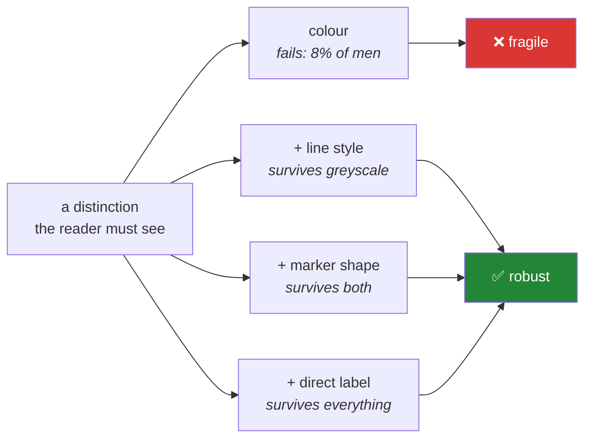

# Day 40 — Styling, palettes, and charts everyone can read

**Phase 5 · Module 5** · ID: **VIZ-07** (styling, palettes, colour-blind-safe defaults)

> **Yesterday:** distributions and the leak-detecting heatmap.
> **Today:** the house style — and the two accessibility constraints that are not decoration.
> Roughly **1 in 12 men** cannot distinguish red from green, and a printed or photocopied chart is
> greyscale whether you planned for it or not.
> **Tomorrow:** Plotly, and Phase 5 closes with the eight-chart figure pack.

```bash
./m start 40 && ./m scaffold 40
```

**Time:** 110 minutes. **Request budget:** 0 model calls.

---

## §1 The story

Everything you have drawn so far used Matplotlib's defaults. They are fine. They are also decisions
someone else made, and Principle 4 says nothing floats — including style.

Two of those decisions are not cosmetic:

**Colour vision.** Red–green colour blindness affects roughly 8% of men and 0.5% of women. A
red-versus-green chart is unreadable to one in twelve of the men who see it. This is not an edge case
you can decide is someone else's problem — it is a routine failure to communicate, and it is free to
avoid.

**Greyscale.** Reports get printed. Slides get photocopied. Charts get pasted into documents that
strip colour. **If your chart only works in colour, it works only sometimes.**

The fix for both is the same principle: **never encode information in colour alone.**



Then there is the **colormap** question, which is the same problem in continuous form. `jet` and
`rainbow` are still the default in a lot of older code and they are actively bad: they are not
perceptually uniform, so equal steps in your data become unequal steps in apparent brightness, and
they invent boundaries where the data is smooth. `viridis` and its relatives were designed to fix
exactly this, and they degrade to a clean monotonic ramp in greyscale.

And the mechanism: **rcParams**. Matplotlib's global settings dictionary. It is genuinely global,
which means a library function that calls `sns.set_theme()` mutates the style of every chart in the
process, including ones drawn by code that never asked. This project sets style **once, explicitly,
in one function**, and nothing else touches it.

---

## §2 Setup — run this

```bash
mkdir -p days/day-40/lab
touch days/day-40/lab/styling.py
touch src/setu/style.py
touch tests/test_style.py
```

No new packages. Matplotlib ships the colormaps.

---

## §3 VIZ-07 — colour, and the alternatives to it

`days/day-40/lab/styling.py`:

```python
"""VIZ-07: palettes, colormaps, rcParams - and charts that survive greyscale."""

from __future__ import annotations

import matplotlib

matplotlib.use("Agg")

import matplotlib.pyplot as plt  # noqa: E402
import numpy as np  # noqa: E402
import seaborn as sns  # noqa: E402
from matplotlib.colors import to_rgb  # noqa: E402


def rcparams_are_global() -> None:
    original = plt.rcParams["axes.grid"]
    print(f"\n{original=}")

    plt.rcParams["axes.grid"] = True
    fig, ax = plt.subplots()
    print(f"{ax.xaxis._major_tick_kw.get('gridOn', ax.get_xgridlines()[0].get_visible())=}")
    print("  ^ every chart drawn from now on has a grid. Including ones you did not write.")
    plt.close(fig)

    plt.rcParams["axes.grid"] = original

    with plt.rc_context({"axes.grid": True, "font.size": 14}):
        print(f"  inside rc_context: {plt.rcParams['font.size']=}")
    print(f"  outside:            {plt.rcParams['font.size']=}")
    print("  ^ rc_context is scoped. A library that must change style uses THIS.")


def the_three_palette_kinds() -> None:
    print("\n  QUALITATIVE  - unordered categories. No category is 'more' than another.")
    print("                 tab10, colorblind, Set2")
    print("  SEQUENTIAL   - one direction, low to high. Zero is not special.")
    print("                 viridis, magma, Blues")
    print("  DIVERGING    - a meaningful midpoint, two directions.")
    print("                 RdBu_r, coolwarm  (Day 39's heatmap)")
    print("\n  Using a sequential map for categories implies an order that does not exist.")
    print("  Using a qualitative map for a continuous variable throws away the ordering.")


def greyscale_test() -> None:
    def luminance(colour) -> float:
        r, g, b = to_rgb(colour)
        return 0.2126 * r + 0.7152 * g + 0.0722 * b

    for name in ("tab10", "colorblind", "viridis"):
        palette = sns.color_palette(name, 5)
        lums = sorted(round(luminance(c), 3) for c in palette)
        gaps = [round(b - a, 3) for a, b in zip(lums, lums[1:], strict=True)]
        print(f"\n  {name:<12} luminances {lums}")
        print(f"  {'':<12} smallest gap {min(gaps):.3f}")
    print("\n  Two colours with the same luminance are INDISTINGUISHABLE in greyscale.")
    print("  A gap below ~0.05 means the print version loses that distinction.")


def colour_alone_is_not_enough() -> None:
    x = np.linspace(0, 10, 100)
    fig, axes = plt.subplots(1, 2, figsize=(11, 4))

    for i in range(4):
        axes[0].plot(x, np.sin(x + i), label=f"series {i}")
    axes[0].set_title("colour only ❌")
    axes[0].legend()

    styles = ["-", "--", "-.", ":"]
    markers = ["o", "s", "^", "D"]
    for i in range(4):
        axes[1].plot(
            x, np.sin(x + i), linestyle=styles[i], marker=markers[i],
            markevery=15, label=f"series {i}",
        )
    axes[1].set_title("colour + linestyle + marker ✅")
    axes[1].legend()

    print(f"\n{[l.get_linestyle() for l in axes[1].lines]=}")
    print("  markevery=15: markers as identifiers, not one per data point.")
    print("  Photocopy the left panel and it becomes four identical grey lines.")
    plt.close(fig)


def perceptually_uniform_colormaps() -> None:
    data = np.random.default_rng(0).normal(size=(30, 30)).cumsum(axis=1)
    fig, axes = plt.subplots(1, 3, figsize=(13, 3.5))

    for ax, cmap in zip(axes, ["jet", "viridis", "Greys"], strict=True):
        im = ax.imshow(data, cmap=cmap, aspect="auto")
        ax.set_title(cmap)
        fig.colorbar(im, ax=ax, fraction=0.046)

    print("\n  jet     : bright yellow band invents a boundary; dark at BOTH ends")
    print("  viridis : brightness increases monotonically - equal data steps look equal")
    print("  Greys   : what viridis becomes when printed. Still readable.")
    print("\n  jet and rainbow are in a lot of old code. They are not a style preference;")
    print("  they distort the data. viridis exists because of that.")
    plt.close(fig)


def emphasis_by_desaturation() -> None:
    rng = np.random.default_rng(1)
    fig, ax = plt.subplots(figsize=(6, 4))

    for i in range(8):
        series = rng.normal(size=40).cumsum()
        if i == 3:
            ax.plot(series, color="firebrick", linewidth=2.2, zorder=3, label="ours")
        else:
            ax.plot(series, color="0.75", linewidth=0.9, zorder=1)

    ax.legend()
    ax.set_title("One series matters. The rest are context.")
    print("\n  Grey for context, one accent for the subject. This reads instantly,")
    print("  and an 8-colour palette does not. Colour is a scarce resource.")
    plt.close(fig)


def text_sizes_that_survive_a_slide() -> None:
    print("\n  A chart at 7x4.5in on a projector: 8pt tick labels are unreadable.")
    print("  Floor: ticks >= 9pt, labels >= 11pt, title >= 12pt.")
    print("  Set it once in rcParams, not per chart.")
    print(f"  current default font.size = {plt.rcParams['font.size']}")
```

**Line by line:**

- `plt.rcParams["axes.grid"] = True` — **genuinely global.** Every figure created afterwards in the
  process inherits it. This is why a library function must never set it: it changes charts drawn by
  code that never asked, including in a Streamlit app on Day 55 and a notebook on Day 84.
- `plt.rc_context({...})` — a **context manager** (Day 16) that scopes the change and restores it on
  exit, including on an exception. If a library function genuinely must change style, this is the only
  acceptable mechanism.
- **Three palette kinds.** The mismatch is the mistake: a sequential map on unordered categories tells
  the reader that "ACL" is more than "ICML"; a qualitative map on a continuous variable discards the
  ordering that was the whole point.
- `luminance` — the standard relative-luminance formula, weighted because human eyes are far more
  sensitive to green than to blue. **Two colours with the same luminance are the same grey.** Printing
  the smallest gap per palette turns "is this greyscale-safe" from a guess into a number, and §5's
  test uses exactly this.
- `colour_alone_is_not_enough` — four series distinguished by colour, and the same four distinguished
  by colour **plus** line style **plus** marker. The left panel is four identical grey lines in a
  photocopy. `markevery=15` draws a marker every fifteenth point so it acts as an identifier rather
  than obscuring the line.
- `jet` versus `viridis` — `jet` has a bright yellow band in the middle that reads as a boundary in
  smooth data, and it is dark at *both* ends, so high and low values look similar. `viridis` increases
  in brightness monotonically, so equal steps in the data are equal steps in perceived lightness, and
  it degrades to a clean ramp in greyscale. **This is a correctness issue, not a taste one.**
- `emphasis_by_desaturation` — grey for the seven context series, one accent for the subject. This
  reads instantly; eight distinct colours do not. **Colour is a scarce resource**, and spending it on
  everything spends it on nothing.
- Text sizes — a 7-inch chart on a projector needs 9pt ticks minimum. Set the floor once in rcParams.

---

## §4 Build brief — `src/setu/style.py`

Layer 1. The one place the house style lives.

```python
"""The Setu chart style. Set ONCE, explicitly. Layer 1: imports errors only."""

from __future__ import annotations

from setu.errors import DataError

# Wong's colour-blind-safe qualitative palette (8 colours, distinct under all
# common forms of colour vision deficiency).
PALETTE = [
    "#000000", "#E69F00", "#56B4E9", "#009E73",
    "#F0E442", "#0072B2", "#D55E00", "#CC79A7",
]

SEQUENTIAL = "viridis"
DIVERGING = "RdBu_r"

BANNED_COLORMAPS = ("jet", "rainbow", "hsv", "gist_rainbow", "nipy_spectral")

LINESTYLES = ("-", "--", "-.", ":", (0, (3, 1, 1, 1)))
MARKERS = ("o", "s", "^", "D", "v", "P", "X", "*")


def apply_house_style() -> None:
    """TODO(me): set the project rcParams. Called ONCE, from the app entry point.

    Minimums: font.size 11, xtick/ytick.labelsize 9, axes.titlesize 12
    Also set: axes.prop_cycle to PALETTE, axes.grid True with alpha, axes.axisbelow True,
    figure.dpi, savefig.bbox 'tight', axes.spines.top/right False.
    Never call this from inside a plotting function.
    """
    raise NotImplementedError


def style_context():
    """TODO(me): return a plt.rc_context with the house style, for scoped use.

    This is what a library function uses when it genuinely must change style.
    """
    raise NotImplementedError


def luminance(colour) -> float:
    """TODO(me): relative luminance, 0.2126R + 0.7152G + 0.0722B, on 0..1 RGB."""
    raise NotImplementedError


def assert_greyscale_legible(colours, *, min_gap: float = 0.05) -> None:
    """TODO(me): raise DataError if any two colours are too close in luminance.

    - sort by luminance, check consecutive gaps
    - the message must name the two offending colours and the gap
    - this is what makes 'it prints fine' a test rather than a hope
    """
    raise NotImplementedError


def assert_accessible_axes(ax) -> None:
    """TODO(me): raise DataError if an Axes distinguishes series by COLOUR ALONE.

    - if ax has 2+ Line2D artists with labels, they must differ in linestyle OR marker,
      not only in colour
    - if a colormap is in use, it must not be one of BANNED_COLORMAPS
    - collect EVERY problem and report them together
    - a single unlabelled line is fine; this is about distinguishing series
    """
    raise NotImplementedError


def distinct_styles(n: int) -> list[dict]:
    """TODO(me): n dicts of {'color', 'linestyle', 'marker'}, all mutually distinguishable.

    - cycle PALETTE, LINESTYLES and MARKERS so no two entries share ALL THREE
    - raise DataError if n > len(PALETTE) * len(LINESTYLES) (say the limit)
    - raise DataError if n > 8 without an explicit allow_many=True... actually: warn in
      the returned dicts is not possible, so instead raise if n > 12: beyond that no
      palette is readable and the chart needs rethinking (facet it - Day 38)
    """
    raise NotImplementedError
```

- The **Wong palette** is the standard colour-blind-safe qualitative set from Bang Wong's 2011 *Nature
  Methods* note. It is eight colours chosen to stay distinct under deuteranopia, protanopia and
  tritanopia. Using a published, tested palette beats inventing one.
- `assert_accessible_axes` is Day 37's chart-lint idea extended to accessibility. Day 41's figure pack
  runs it over every panel.
- `distinct_styles` raising above 12 is the same refusal as Day 38's `facet`: beyond that, no palette
  is readable and the answer is to facet, not to find more colours.

---

## §5 The eval that must be able to fail

`tests/test_style.py`:

```python
import matplotlib

matplotlib.use("Agg")

import matplotlib.pyplot as plt  # noqa: E402
import numpy as np  # noqa: E402
import pytest  # noqa: E402

from setu.errors import DataError  # noqa: E402
from setu.style import (  # noqa: E402
    BANNED_COLORMAPS,
    PALETTE,
    assert_accessible_axes,
    assert_greyscale_legible,
    distinct_styles,
    luminance,
    style_context,
)


@pytest.fixture(autouse=True)
def _no_leaked_figures():
    yield
    assert not plt.get_fignums(), "a test left a figure open"


def test_luminance_matches_known_values():
    assert luminance("#000000") == pytest.approx(0.0)
    assert luminance("#FFFFFF") == pytest.approx(1.0)
    assert luminance("#00FF00") > luminance("#0000FF"), "green must outweigh blue"


def test_palette_is_greyscale_legible():
    assert_greyscale_legible(PALETTE)


def test_greyscale_check_rejects_two_similar_colours():
    with pytest.raises(DataError) as info:
        assert_greyscale_legible(["#FF0000", "#00A000"])
    message = str(info.value)
    assert "#FF0000" in message.upper() and "gap" in message.lower()


def test_greyscale_check_names_the_gap():
    with pytest.raises(DataError) as info:
        assert_greyscale_legible(["#777777", "#787878"])
    assert any(ch.isdigit() for ch in str(info.value))


def test_palette_has_at_least_eight_colours():
    assert len(PALETTE) >= 8


def test_style_context_is_scoped():
    before = plt.rcParams["font.size"]
    with style_context():
        pass
    assert plt.rcParams["font.size"] == before, "style_context leaked into global rcParams"


def test_style_context_restores_on_exception():
    before = plt.rcParams["font.size"]
    with pytest.raises(RuntimeError):
        with style_context():
            raise RuntimeError("boom")
    assert plt.rcParams["font.size"] == before


def test_distinct_styles_are_mutually_distinguishable():
    styles = distinct_styles(6)
    assert len(styles) == 6
    triples = {(s["color"], s["linestyle"], s["marker"]) for s in styles}
    assert len(triples) == 6


def test_distinct_styles_vary_more_than_colour():
    styles = distinct_styles(4)
    assert len({s["linestyle"] for s in styles}) > 1 or len({s["marker"] for s in styles}) > 1, (
        "series differ only by colour - unreadable in greyscale"
    )


def test_distinct_styles_refuses_an_unreadable_count():
    with pytest.raises(DataError) as info:
        distinct_styles(40)
    assert "12" in str(info.value) or "facet" in str(info.value).lower()


def test_accessible_axes_passes_a_styled_chart():
    fig, ax = plt.subplots()
    x = np.linspace(0, 10, 20)
    for i, style in enumerate(distinct_styles(3)):
        ax.plot(x, np.sin(x + i), label=f"s{i}", **style)
    assert_accessible_axes(ax)
    plt.close(fig)


def test_accessible_axes_rejects_colour_only():
    fig, ax = plt.subplots()
    x = np.linspace(0, 10, 20)
    for i in range(3):
        ax.plot(x, np.sin(x + i), label=f"s{i}")
    with pytest.raises(DataError) as info:
        assert_accessible_axes(ax)
    assert "linestyle" in str(info.value).lower() or "marker" in str(info.value).lower()
    plt.close(fig)


def test_accessible_axes_allows_a_single_series():
    fig, ax = plt.subplots()
    ax.plot([1, 2, 3], label="only")
    assert_accessible_axes(ax)
    plt.close(fig)


@pytest.mark.parametrize("cmap", BANNED_COLORMAPS)
def test_accessible_axes_rejects_banned_colormaps(cmap):
    fig, ax = plt.subplots()
    ax.imshow(np.random.default_rng(0).normal(size=(5, 5)), cmap=cmap)
    with pytest.raises(DataError) as info:
        assert_accessible_axes(ax)
    assert cmap in str(info.value)
    plt.close(fig)


def test_accessible_axes_accepts_viridis():
    fig, ax = plt.subplots()
    ax.imshow(np.random.default_rng(0).normal(size=(5, 5)), cmap="viridis")
    assert_accessible_axes(ax)
    plt.close(fig)


def test_accessible_axes_reports_every_problem():
    fig, ax = plt.subplots()
    for i in range(3):
        ax.plot([1, 2, 3], label=f"s{i}")
    ax.imshow(np.random.default_rng(0).normal(size=(5, 5)), cmap="jet")
    with pytest.raises(DataError) as info:
        assert_accessible_axes(ax)
    message = str(info.value).lower()
    assert "jet" in message and ("linestyle" in message or "marker" in message)
    plt.close(fig)


def test_no_global_style_calls_in_src():
    """A library function must not mutate global rcParams."""
    from pathlib import Path

    banned = ("sns.set_theme", "sns.set(", "plt.style.use", "plt.rcParams[")
    offenders = [
        f"{p.name}:{i}"
        for p in Path("src/setu").rglob("*.py")
        if p.name != "style.py"
        for i, line in enumerate(p.read_text(encoding="utf-8").splitlines(), 1)
        if any(b in line for b in banned) and "noqa" not in line
    ]
    assert not offenders, f"global style mutation outside style.py: {offenders}"
```

**Line by line:**

- `test_luminance_matches_known_values` — black is 0, white is 1, and green must outweigh blue. Those
  three anchor the formula; getting the coefficients backwards fails the third.
- `test_palette_is_greyscale_legible` — **the Wong palette, verified rather than trusted.** If a
  future edit adds a ninth colour that collides in luminance with an existing one, this catches it.
- `test_greyscale_check_rejects_two_similar_colours` — pure red and a medium green have very close
  luminance, which is why the classic red/green pairing fails twice over: unreadable to colour-blind
  readers *and* identical in print.
- `test_style_context_restores_on_exception` — the `rc_context` guarantee under failure. A scoped
  helper that leaks on the error path is worse than no helper, because you would trust it.
- `test_distinct_styles_vary_more_than_colour` — the §1 rule, asserted. A function returning eight
  colours with identical line styles passes the uniqueness test and fails this one.
- `test_accessible_axes_rejects_colour_only` — **the day's real assessment.** Three labelled lines with
  no style variation. The message must name the remedy (`linestyle` or `marker`), not just refuse.
- `test_accessible_axes_reports_every_problem` — two defects, both named in one message. Same rule as
  Days 19, 27 and 34.
- `test_no_global_style_calls_in_src` — the ninth repo-wide guard, and the one that keeps §3's rcParams
  lesson true after fifty more days of edits.

```bash
uv run python -m pytest tests/test_style.py -v
```

---

## §6 Request budget

| Resource | Spent today |
|---|---|
| LLM calls | **0** |

---

## §7 Traps

- **Encoding information in colour alone.** Fails for 8% of men and for every printed copy.
- **Red versus green.** The worst possible pairing: fails both tests at once.
- **`jet` or `rainbow`.** Not perceptually uniform; invents boundaries; dark at both ends.
- **A sequential colormap for unordered categories.** Implies an order that does not exist.
- **A qualitative palette for a continuous variable.** Discards the ordering.
- **`sns.set_theme()` inside a library function.** Mutates global state for everyone.
- **Eight distinct colours in one chart.** Grey the context, accent the subject.
- **8pt tick labels.** Unreadable on a projector.
- **Assuming the default palette is safe.** `tab10` has luminance collisions; check.
- **Trusting "it looks fine to me".** You are not the constraint. Measure the luminance gap.

---

## §8 Verify before you code

Written **2026-08-21**:

- <https://matplotlib.org/stable/users/explain/colors/colormaps.html> — the perceptual-uniformity
  section and why `jet` was retired as a default.
- <https://matplotlib.org/stable/users/explain/customizing.html> — rcParams, `rc_context`, style sheets.
- <https://seaborn.pydata.org/tutorial/color_palettes.html> — qualitative / sequential / diverging,
  and the `colorblind` palette.
- <https://www.nature.com/articles/nmeth.1618> — Wong, *Points of view: Color blindness* (the source
  of the palette).

---

## §9 Say it in an interview

> "Two constraints that aren't decoration: roughly one in twelve men can't distinguish red from green,
> and any chart that gets printed or photocopied is greyscale. Both are solved by the same rule —
> never encode information in colour alone — so my style module hands out colour plus line style plus
> marker together, and there's an `assert_accessible_axes` that fails a chart whose series differ only
> by colour. Greyscale legibility is testable rather than a hope: I compute relative luminance and
> assert a minimum gap between palette entries, because two colours with the same luminance are the
> same grey. And `jet` is banned outright — it isn't a taste preference, it's not perceptually uniform,
> so equal steps in the data become unequal steps in apparent brightness and it invents boundaries in
> smooth data. All the style lives in one module with a test that greps the package for anyone else
> mutating global rcParams."

---

## §10 Done when

Tick [`CHECKLIST.md`](CHECKLIST.md), then `./m check && ./m done 40`.
