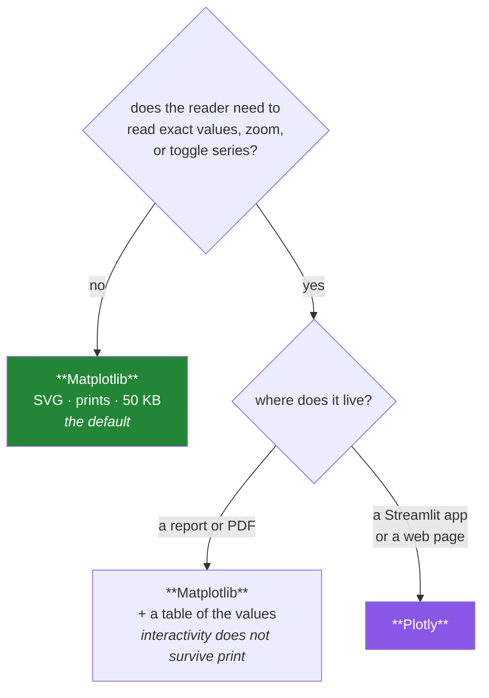

# Day 41 — Plotly, and the eight-chart figure pack

**Phase 5 gate** · ID: **VIZ-08** (Plotly for interactive charts) · Artifact: **the figure pack**

> **Yesterday:** the house style, and charts that survive greyscale.
> **Today:** when interactivity earns its weight — and then the phase gate: **eight charts, one
> figure pack, every panel passing the lint rules you wrote.** Phase 5 closes.
> **Tomorrow:** Phase 6, SQL and NoSQL.

```bash
./m start 41 && ./m scaffold 41
```

**Time:** 2 hours (gate day). **Request budget:** 0 model calls.

---

## §1 The story

Plotly renders to HTML and JavaScript instead of pixels. That buys hover tooltips, zoom, pan, and
click-to-toggle-series — and it costs things that matter:

| | Matplotlib | Plotly |
|---|---|---|
| Output | PNG / SVG / PDF | HTML + JS (or a static export) |
| In a PDF or a printout | ✅ native | ✗ needs a static export step |
| File size | ~50 KB SVG | ~3 MB standalone HTML (bundles the JS) |
| Large n | fine at 100 k points | the browser struggles past ~50 k |
| Accessibility | your Day 40 rules apply | tooltips are not screen-reader friendly |
| Streamlit (Day 55) | works | works, and is the better fit |

**The rule this project uses:** interactivity must answer a question a static chart cannot. Three
cases genuinely qualify —

1. **Reading exact values off many points.** A 200-point scatter where the identity of an outlier
   matters. Hover beats a chart with 200 labels.
2. **Exploring a range.** Zooming into three days of a two-year time series.
3. **Comparing series on demand.** Twelve venues where the reader wants two of them — click-to-toggle
   beats twelve panels.

Everything else is a static chart with extra bytes. A bar chart of five categories does not become
more informative because you can hover over it; it becomes 3 MB.



Then the gate. Phase 5's artifact is **an eight-chart figure pack**: one script, one command, eight
panels, saved as SVG and PNG, in which every panel is legible in greyscale, colour-blind-safe, and
passes `assert_honest_bar` (Day 37) and `assert_accessible_axes` (Day 40). It is the deliverable that
proves the phase: not "I can call `sns.boxplot`" but "I can produce a figure someone would put in a
report and defend".

---

## §2 Setup — run this

```bash
uv add "plotly==6.9.0"
mkdir -p days/day-41/lab
touch days/day-41/lab/interactive.py
touch scripts/figure_pack.py
```

Pin whatever your Day-1 verify run reported.

**Note on `kaleido`:** exporting a Plotly figure to a static image needs it, and it downloads a
browser binary. This project does **not** install it — Plotly output stays HTML, and anything needing
a static image is drawn with Matplotlib. That is a deliberate zero-budget, small-dependency choice
(Principle 5), and it is worth stating in your `engine_note`.

---

## §3 VIZ-08 — Plotly, and when it is worth it

`days/day-41/lab/interactive.py`:

```python
"""VIZ-08: Plotly's two APIs, the three cases for interactivity, and the costs."""

from __future__ import annotations

from pathlib import Path

import numpy as np
import pandas as pd
import plotly.express as px
import plotly.graph_objects as go

from setu.arrays import make_rng


def papers(n: int = 400) -> pd.DataFrame:
    rng = make_rng(0)
    venue = rng.choice(["NeurIPS", "ICML", "ACL"], size=n)
    return pd.DataFrame(
        {
            "paper_id": [f"p{i:04d}" for i in range(n)],
            "venue": venue,
            "year": rng.integers(2019, 2025, n),
            "pages": rng.integers(4, 16, n),
            "citations": rng.poisson(np.where(venue == "NeurIPS", 140, 80)),
        }
    )


def the_two_apis() -> None:
    data = papers()

    express = px.scatter(data, x="pages", y="citations", color="venue", hover_name="paper_id")
    print(f"\n{type(express).__name__=}   <- px returns a graph_objects.Figure")
    print(f"{len(express.data)=}   <- one TRACE per colour group")

    manual = go.Figure()
    for venue, group in data.groupby("venue", observed=True):
        manual.add_trace(
            go.Scatter(x=group["pages"], y=group["citations"], mode="markers", name=venue)
        )
    print(f"{len(manual.data)=}   <- the same thing, built by hand")
    print("\n  plotly.express = seaborn's ergonomics. graph_objects = full control.")
    print("  px covers ~90% of cases; both produce the SAME Figure object.")


def hover_is_the_feature() -> None:
    data = papers()
    fig = px.scatter(
        data, x="pages", y="citations", color="venue",
        hover_data={"paper_id": True, "year": True, "pages": False},
    )
    print(f"\n{fig.data[0].hovertemplate is not None=}")
    print("  Case 1: 400 points, and the reader wants to know WHICH one is the outlier.")
    print("  A static chart would need 400 labels. Hover carries the identity for free.")


def range_selection() -> None:
    rng = make_rng(1)
    index = pd.date_range("2023-01-01", periods=730, freq="D")
    series = pd.DataFrame({"date": index, "latency": rng.normal(120, 9, 730).cumsum() / 30 + 100})

    fig = px.line(series, x="date", y="latency")
    fig.update_xaxes(rangeslider_visible=True)
    print("\n  Case 2: two years of daily data. The interesting event lasted three days.")
    print("  A static chart shows either the whole range or the three days, not both.")


def toggling_series() -> None:
    rng = make_rng(2)
    frame = pd.DataFrame(
        {
            "year": np.tile(np.arange(2015, 2025), 12),
            "venue": np.repeat([f"venue-{i}" for i in range(12)], 10),
            "citations": rng.integers(20, 200, 120),
        }
    )
    fig = px.line(frame, x="year", y="citations", color="venue")
    print(f"\n{len(fig.data)=} traces")
    print("  Case 3: 12 series. Static, it is spaghetti; faceted, it is 12 panels.")
    print("  Click-to-toggle lets the reader compare any two. THAT is worth the bytes.")


def the_costs(tmp: Path) -> None:
    data = papers()
    fig = px.scatter(data, x="pages", y="citations", color="venue")

    standalone = tmp / "full.html"
    fig.write_html(standalone, include_plotlyjs=True)

    cdn = tmp / "cdn.html"
    fig.write_html(cdn, include_plotlyjs="cdn")

    print(f"\n  standalone HTML : {standalone.stat().st_size / 1024:8.0f} KiB (bundles plotly.js)")
    print(f"  CDN HTML        : {cdn.stat().st_size / 1024:8.0f} KiB (needs the internet)")
    print("  a comparable Matplotlib SVG: ~30-80 KiB, prints, and works offline")
    print("\n  Neither HTML goes in a PDF. Interactivity does not survive print.")


def accessibility_still_applies() -> None:
    from setu.style import PALETTE

    data = papers()
    fig = px.scatter(
        data, x="pages", y="citations", color="venue",
        symbol="venue",                      # <- shape as well as colour
        color_discrete_sequence=PALETTE,
    )
    print(f"\n{[trace.marker.symbol for trace in fig.data]=}")
    print("  Day 40's rule does not stop applying because the chart is interactive:")
    print("  symbol= alongside color=, and the same colour-blind-safe palette.")
    print("  Note also: hover tooltips are not screen-reader accessible. Ship the table too.")


def when_not_to_use_it() -> None:
    print("\n  A 5-category bar chart does not become more informative when hoverable.")
    print("  It becomes 3 MB.")
    print("\n  Default to Matplotlib. Reach for Plotly when the reader needs to:")
    print("    1. read exact values off many points")
    print("    2. zoom into a range")
    print("    3. toggle series on and off")
    print("  ...and the chart lives somewhere a browser can render it.")


if __name__ == "__main__":
    import tempfile

    the_two_apis()
    hover_is_the_feature()
    range_selection()
    toggling_series()
    the_costs(Path(tempfile.mkdtemp()))
    accessibility_still_applies()
    when_not_to_use_it()
```

**Line by line:**

- `px.scatter(...)` returns a `plotly.graph_objects.Figure` — **the two APIs produce the same object.**
  `express` is the concise entry point (Seaborn's ergonomics); `graph_objects` is the explicit one.
  Start with `px` and drop to `go` when you need control it does not expose.
- `len(fig.data)` — Plotly calls each series a **trace**. `color="venue"` creates one trace per venue,
  which is what makes click-to-toggle work: the legend toggles traces.
- `hover_data={"paper_id": True, "pages": False}` — controls the tooltip explicitly. Note you can
  *remove* a field that is already on an axis; repeating it in the tooltip is noise.
- `rangeslider_visible=True` — one line for case 2. This is the clearest example of interactivity
  earning its weight: two years of daily data where the event lasted three days cannot be shown
  statically at both scales.
- `include_plotlyjs=True` versus `"cdn"` — **run this and look at the sizes.** Standalone HTML bundles
  the entire Plotly JavaScript library, typically ~3 MB. The CDN version is small but needs the
  internet at view time. A comparable Matplotlib SVG is tens of kilobytes, prints, and works offline.
- `symbol="venue"` with `color_discrete_sequence=PALETTE` — **Day 40's rule still applies.**
  Interactivity does not exempt a chart from being readable by someone with colour vision deficiency,
  and a tooltip is not screen-reader accessible, so ship the underlying table alongside.
- `when_not_to_use_it` — the summary. Default to Matplotlib; reach for Plotly for one of three
  reasons.

---

## §4 The gate artifact — the figure pack

`scripts/figure_pack.py`. **This is the Phase 5 deliverable.** One command, eight panels, all lints
passing.

```python
"""Build the Phase 5 figure pack. Run: uv run python scripts/figure_pack.py

Eight panels, saved as SVG and PNG, every one of them:
  - legible in greyscale
  - colour-blind safe
  - passing assert_honest_bar and assert_accessible_axes
"""

from __future__ import annotations

# TODO(me): build the eight panels below from setu.plots and setu.style.
#
#  1. distribution   - citations, histogram, log-x, n and bin count in the title (Day 39)
#  2. distribution   - the same variable as an ECDF, for comparison (Day 39)
#  3. grouped_box    - citations by venue, points overlaid, n on the ticks (Day 38)
#  4. mean_with_ci   - mean citations by venue, zero-based, error measure labelled (Day 38)
#  5. line           - citations by year, one line per venue, distinct_styles (Days 36, 40)
#  6. scatter        - pages vs citations, trend=True, r reported (Day 39)
#  7. correlation_heatmap - masked, diverging, fixed limits, findings printed (Day 39)
#  8. dumbbell       - before/after by venue, sorted by change (Day 37)
#
# Requirements:
#  - apply_house_style() ONCE, at the top of main() - nowhere else
#  - build ONE figure with grid(4, 2); every panel drawn onto its supplied ax
#  - run assert_accessible_axes on every panel, and assert_honest_bar on panels 4 and 8
#  - print the heatmap findings; FAIL LOUDLY (non-zero exit) if any leak is detected
#  - save via plots.save() to reports/figures/phase5_pack.{svg,png}
#  - print the two output paths and the total wall time
#  - the whole script must run in under 30 seconds


def main() -> int:
    raise NotImplementedError


if __name__ == "__main__":
    import sys

    sys.exit(main())
```

Every panel is a function you already wrote. **If a panel needs new plotting code, something in
Phase 5 was left incomplete** — go back and finish it rather than special-casing here. That is what
makes this a gate rather than an exercise.

---

## §5 Build brief

Extend `src/setu/plots.py`:

```python
def interactive_scatter(data, *, x: str, y: str, color: str | None = None,
                        hover: list[str] | None = None):
    """TODO(me): a Plotly scatter that obeys the Day 40 rules.

    - use setu.style.PALETTE via color_discrete_sequence
    - when `color` is given, ALSO set symbol= to the same column (shape, not colour alone)
    - raise DataError if the row count exceeds 50_000 (the browser will not cope;
      say so, and suggest scatter() with hexbin instead)
    - return the plotly Figure; do NOT write it anywhere
    """
    raise NotImplementedError


def write_interactive(fig, path, *, standalone: bool = False):
    """TODO(me): write a Plotly figure to HTML.

    - default include_plotlyjs='cdn' (small file); standalone=True bundles the JS
    - create parent directories
    - raise DataError if the suffix is not .html
    - return the path, and its size in KiB, so the caller can see the cost
    """
    raise NotImplementedError


def assert_pack_is_publishable(axes: list) -> None:
    """TODO(me): the gate check. Run every Phase 5 lint over a list of Axes.

    For each axes: assert_accessible_axes; and if it has bar patches, assert_honest_bar.
    Collect EVERY failure across all panels and raise one DataError listing them
    with their panel index. One run, one complete list of what to fix.
    """
    raise NotImplementedError
```

---

## §6 The eval that must be able to fail

Add to `tests/test_plots.py`:

```python
def test_interactive_scatter_uses_shape_as_well_as_colour():
    frame = pd.DataFrame({"x": [1.0, 2, 3], "y": [1.0, 2, 3], "g": ["a", "b", "a"]})
    fig = interactive_scatter(frame, x="x", y="y", color="g")
    symbols = {trace.marker.symbol for trace in fig.data}
    assert len(symbols) > 1, "traces differ only by colour - Day 40's rule applies here too"


def test_interactive_scatter_uses_the_house_palette():
    from setu.style import PALETTE

    frame = pd.DataFrame({"x": [1.0, 2], "y": [1.0, 2], "g": ["a", "b"]})
    fig = interactive_scatter(frame, x="x", y="y", color="g")
    used = {trace.marker.color for trace in fig.data}
    assert used <= set(PALETTE), f"colours outside the house palette: {used - set(PALETTE)}"


def test_interactive_scatter_refuses_too_many_points():
    frame = pd.DataFrame({"x": range(60_000), "y": range(60_000)})
    with pytest.raises(DataError) as info:
        interactive_scatter(frame, x="x", y="y")
    assert "hexbin" in str(info.value).lower() or "scatter" in str(info.value).lower()


def test_write_interactive_defaults_to_the_small_file(tmp_path):
    frame = pd.DataFrame({"x": [1.0, 2], "y": [1.0, 2]})
    fig = interactive_scatter(frame, x="x", y="y")
    _, small = write_interactive(fig, tmp_path / "a.html")
    _, big = write_interactive(fig, tmp_path / "b.html", standalone=True)
    assert small < big / 5, "the default should not bundle plotly.js"


def test_write_interactive_rejects_a_bad_suffix(tmp_path):
    frame = pd.DataFrame({"x": [1.0], "y": [1.0]})
    fig = interactive_scatter(frame, x="x", y="y")
    with pytest.raises(DataError):
        write_interactive(fig, tmp_path / "a.png")


def test_pack_check_passes_compliant_panels():
    fig, axes = grid(1, 2)
    x = np.linspace(0, 10, 20)
    for i, style in enumerate(distinct_styles(2)):
        axes[0].plot(x, np.sin(x + i), label=f"s{i}", **style)
    axes[1].bar(["a", "b"], [3, 5])
    axes[1].set_ylim(0, 6)
    assert_pack_is_publishable(axes)
    plt.close(fig)


def test_pack_check_reports_every_failing_panel():
    fig, axes = grid(1, 3)
    for i in range(3):
        axes[0].plot([1, 2, 3], label=f"s{i}")        # colour only
    axes[1].bar(["a", "b"], [98, 99])
    axes[1].set_ylim(97, 100)                          # truncated
    axes[2].plot([1, 2, 3], label="fine")              # ok
    with pytest.raises(DataError) as info:
        assert_pack_is_publishable(axes)
    message = str(info.value)
    assert "0" in message and "1" in message, "panel indices were not reported"
    plt.close(fig)


def test_figure_pack_script_exists_and_runs():
    """The Phase 5 gate artifact."""
    import subprocess
    import sys
    from pathlib import Path

    script = Path("scripts/figure_pack.py")
    assert script.exists(), "the figure pack script was not written"
    result = subprocess.run(
        [sys.executable, str(script)], capture_output=True, text=True, timeout=120
    )
    assert result.returncode == 0, f"figure_pack.py failed:\n{result.stderr}"


def test_figure_pack_produced_both_formats():
    from pathlib import Path

    for suffix in ("svg", "png"):
        path = Path(f"reports/figures/phase5_pack.{suffix}")
        assert path.exists(), f"{path} was not produced"
        assert path.stat().st_size > 5_000, f"{path} is suspiciously small"


def test_figure_pack_has_eight_panels():
    from pathlib import Path

    svg = Path("reports/figures/phase5_pack.svg").read_text(encoding="utf-8")
    assert svg.count("<g id=\"axes_") >= 8, "the pack does not contain eight panels"
```

**Line by line:**

- `test_interactive_scatter_uses_shape_as_well_as_colour` — Day 40's rule, carried into Plotly. It is
  easy to assume accessibility is a Matplotlib concern; it is not.
- `used <= set(PALETTE)` — a **subset check**. Plotly's default `px` sequence is not colour-blind safe,
  so this asserts the house palette actually got through.
- `test_write_interactive_defaults_to_the_small_file` — `small < big / 5`. The standalone file bundles
  megabytes of JavaScript; the assertion makes the default choice visible and permanent.
- `test_pack_check_reports_every_failing_panel` — two different defects in two different panels, and
  **both panel indices must appear in one message.** Fixing a figure pack one error at a time is
  eight runs; fixing it from one list is one.
- `test_figure_pack_script_exists_and_runs` — runs the gate artifact **as a subprocess** with a
  timeout, and attaches stderr on failure. Same technique as Day 17's fresh-interpreter import test:
  a script that only works when someone runs it by hand is not a deliverable.
- `test_figure_pack_has_eight_panels` — parses the SVG for axes groups. Crude, and it catches the
  failure that matters: a pack that silently drew six.

```bash
uv run python scripts/figure_pack.py
uv run python -m pytest tests/test_plots.py -v
uv run python -m pytest -q
```

---

## §7 Request budget

| Resource | Spent today |
|---|---|
| LLM calls | **0** |
| Network | one `uv add` resolution |
| Disk | ~1 MiB of figures in `reports/figures/` |

---

## §8 Traps

- **Plotly for a chart that does not need interaction.** 3 MB instead of 50 KB.
- **`include_plotlyjs=True` by default.** Bundles the whole library into every file.
- **Assuming an HTML chart goes in a PDF.** It does not, and `kaleido` is a browser download.
- **A Plotly scatter with 100 k points.** The browser will not cope.
- **Dropping the accessibility rules because it is interactive.** They still apply.
- **Relying on tooltips for the values.** Not screen-reader accessible. Ship the table.
- **Plotly's default `px` colour sequence.** Not colour-blind safe. Pass the house palette.
- **Calling `apply_house_style()` per panel.** Once, at the entry point.
- **Writing new plotting code inside `figure_pack.py`.** That means the phase is incomplete.
- **A figure pack that only runs by hand.** Make it a script with an exit code and test it.

---

## §9 Verify before you code

Written **2026-08-21**:

- <https://plotly.com/python/plotly-express/> — the `px` surface.
- <https://plotly.com/python/interactive-html-export/> — `include_plotlyjs` options and file sizes.
- <https://plotly.com/python/static-image-export/> — what `kaleido` requires, and why this project skips it.
- <https://plotly.com/python/discrete-color/> — `color_discrete_sequence`.

---

## §10 Say it in an interview

> "I default to Matplotlib and reach for Plotly only when the reader needs to do one of three things:
> read exact values off many points, zoom into a range, or toggle series. Otherwise it's a static
> chart with extra bytes — a standalone Plotly HTML bundles the whole JS library and runs to megabytes
> against tens of kilobytes for an SVG, and none of it survives a PDF. The accessibility rules carry
> over: I pass the colour-blind-safe palette explicitly, because Plotly's default sequence isn't one,
> and set symbol alongside colour. The phase deliverable is a figure-pack script — one command, eight
> panels, and a check that runs the honest-bar and accessible-axes lints over every panel and reports
> all failures at once. There's a test that runs the script as a subprocess and checks the outputs
> exist, because a build step that only works when I run it by hand isn't a deliverable."

---

## §11 Done when — **Phase 5 gate**

Tick [`CHECKLIST.md`](CHECKLIST.md), then:

```bash
./m check
./m done 41
./m status
```

**Gate criteria:** `scripts/figure_pack.py` runs clean in one command · eight panels, SVG and PNG ·
every panel passes `assert_accessible_axes` · every bar panel passes `assert_honest_bar` · the
heatmap findings are printed and no leak is present · the pack is legible when you actually open the
PNG in greyscale · no new plotting code was needed inside the script.

Tomorrow: Phase 6, and data that lives somewhere other than a file.
