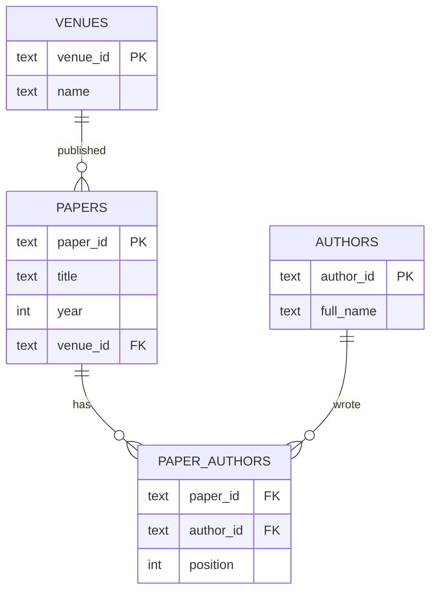

# Day 42 — Relational thinking, and a database that goes to sleep

**Phase 6 · Module 6 · SQL and NoSQL** · IDs: **DB-01** (relational concepts, normalisation), **DB-02** (Supabase Postgres from Python)

> **Yesterday:** Phase 5 closed with the figure pack.
> **Today:** data stops living in files. You design a schema, connect to the free Postgres you
> provisioned on Day 3 — and handle the fact that it **pauses when idle**, which is where Day 6's
> capped retry finally earns its keep.
> **Tomorrow:** `SELECT`, and the query clauses in the order the database actually runs them.

```bash
./m start 42 && ./m scaffold 42
```

**Time:** 2 hours. **Request budget:** 0 model calls. **Live DB calls:** a handful, once.

---

## §1 The story

A CSV has one shape. A database has as many as you design, and the design decides which questions are
cheap and which are impossible.

Setu's data is not one table. A paper has many authors; an author writes many papers. Put authors in
a column and you get this:

| paper_id | title | authors |
|---|---|---|
| p1 | Attention Is All You Need | Vaswani, Shazeer, Parmar |

Now answer: *how many papers has Shazeer written?* You are doing string matching. *Did "Shazeer" and
"N. Shazeer" get merged?* Nobody knows. *Fix a misspelling* and you edit every row it appears in.

**Normalisation** is the fix, and it is one idea repeated: *store each fact once, in the place it
belongs.*



`paper_authors` is a **junction table**: many-to-many relationships need one. Its primary key is the
*pair* `(paper_id, author_id)`, and `position` records author order — a fact about the *relationship*,
not about either side, which is exactly why it lives here.

The rules, in the form worth remembering:

- **1NF** — one value per cell. No comma-separated lists.
- **2NF** — every non-key column depends on the *whole* key. (`position` depends on both ids.)
- **3NF** — no column depends on another non-key column. Storing `venue_name` on `papers` alongside
  `venue_id` breaks this: rename the venue and you update thousands of rows, or you do not, and now
  two rows disagree.

**And the day's second half: your database sleeps.** A free Supabase project pauses after a period of
inactivity. The first connection after that fails, or hangs, then succeeds a few seconds later. That
is not a bug to work around silently — it is the shape of a free tier, and Day 6's `with_retry` plus
Day 18's `TransientError` are exactly the tools for it (Principle 5).

---

## §2 Setup — run this

```bash
uv add "psycopg[binary]==3.3.4" "sqlalchemy==2.0.52"
mkdir -p days/day-42/lab
touch days/day-42/lab/connect.py
touch src/setu/db.py
touch tests/test_db.py
mkdir -p sql
touch sql/001_schema.sql
```

- `psycopg[binary]` — **psycopg 3**, not `psycopg2`. The `[binary]` extra ships a prebuilt wheel so
  you do not need a C compiler or `libpq` installed.
- Pin what **your** Day-1 verify run reported.

Check your `.env` still has the Day 3 values:

```bash
grep -c '^POSTGRES_DSN=.\+' .env || echo "STOP - fill POSTGRES_DSN from your Supabase project"
```

- `.\+` means "at least one character after the `=`". An empty variable is not a set variable
  (Day 2's `_require`).

**Where to find the DSN:** Supabase → your project → Connect → *Session pooler* or *Direct
connection*. It looks like
`postgresql://postgres.<ref>:<password>@<host>:5432/postgres`. Use the pooler string if offered — free
projects limit direct connections.

---

## §3 DB-01 — designing the schema

`sql/001_schema.sql`:

```sql
-- Setu schema, v1. Run once. Idempotent: safe to re-run.

CREATE TABLE IF NOT EXISTS venues (
    venue_id    TEXT PRIMARY KEY,
    name        TEXT NOT NULL UNIQUE,
    kind        TEXT NOT NULL CHECK (kind IN ('conference', 'journal', 'preprint'))
);

CREATE TABLE IF NOT EXISTS authors (
    author_id   TEXT PRIMARY KEY,
    full_name   TEXT NOT NULL,
    created_at  TIMESTAMPTZ NOT NULL DEFAULT now()
);

CREATE TABLE IF NOT EXISTS papers (
    paper_id    TEXT PRIMARY KEY,
    title       TEXT NOT NULL CHECK (length(trim(title)) > 0),
    year        INTEGER NOT NULL CHECK (year BETWEEN 1900 AND 2100),
    citations   INTEGER NOT NULL DEFAULT 0 CHECK (citations >= 0),
    venue_id    TEXT REFERENCES venues(venue_id) ON DELETE SET NULL,
    created_at  TIMESTAMPTZ NOT NULL DEFAULT now()
);

CREATE TABLE IF NOT EXISTS paper_authors (
    paper_id    TEXT NOT NULL REFERENCES papers(paper_id) ON DELETE CASCADE,
    author_id   TEXT NOT NULL REFERENCES authors(author_id) ON DELETE CASCADE,
    position    INTEGER NOT NULL CHECK (position >= 1),
    PRIMARY KEY (paper_id, author_id)
);

CREATE INDEX IF NOT EXISTS idx_papers_year   ON papers(year);
CREATE INDEX IF NOT EXISTS idx_papers_venue  ON papers(venue_id);
CREATE INDEX IF NOT EXISTS idx_pa_author     ON paper_authors(author_id);
```

**Line by line:**

- `CREATE TABLE IF NOT EXISTS` — idempotent, so the migration is safe to re-run. Same rule as Day 0's
  `mkdir -p` and Day 1's `ensure_dirs`.
- `TEXT PRIMARY KEY` — a primary key is **unique and not null**, and it creates an index for free.
  Postgres's `TEXT` has no length penalty; `VARCHAR(50)` is a constraint, not an optimisation.
- `NOT NULL UNIQUE` on `venues.name` — two constraints. `UNIQUE` allows multiple `NULL`s in SQL, so
  when you mean "exactly one row per name" you need both.
- `CHECK (kind IN (...))` — an enumerated constraint enforced by the **database**, so no application
  bug can insert a fourth kind. Day 19's Pydantic `Literal` validates at the boundary; this validates
  at the store. **Both**, because there is more than one way in.
- `CHECK (length(trim(title)) > 0)` — a blank title is not a valid title. Day 12's `InvalidPaper`
  in SQL form.
- `REFERENCES venues(venue_id)` — a **foreign key**. The database now refuses a paper pointing at a
  venue that does not exist. This is the constraint that catches the bug before it reaches production.
- `ON DELETE SET NULL` versus `ON DELETE CASCADE` — **a real decision, not a default.** Deleting a
  venue should not delete its papers, so the reference becomes `NULL`. Deleting a paper *should*
  remove its author links, since a link to a deleted paper is meaningless. Choose per relationship and
  be able to defend it (Principle 11: know the blast radius).
- `PRIMARY KEY (paper_id, author_id)` — a **composite** key. It says "one row per paper-author pair"
  and makes a duplicate link impossible.
- `TIMESTAMPTZ ... DEFAULT now()` — timezone-aware, always (Day 33's rule: store UTC).
- The indexes — one per column you will filter or join on. Day 50 covers what they cost.

---

## §4 DB-02 — connecting to a database that sleeps

`days/day-42/lab/connect.py`:

```python
"""DB-02: connecting to a free-tier Postgres, including the part where it is asleep."""

from __future__ import annotations

import time

import psycopg

from setu.config import require_env
from setu.errors import TransientError
from setu.retry import with_retry


def a_bare_connection() -> None:
    dsn = require_env("POSTGRES_DSN")
    start = time.perf_counter()
    with psycopg.connect(dsn, connect_timeout=10) as conn:
        with conn.cursor() as cur:
            cur.execute("SELECT version(), current_database(), now()")
            version, database, when = cur.fetchone()
    print(f"\n  connected in {time.perf_counter() - start:.2f}s")
    print(f"  {version.split(',')[0]=}")
    print(f"  {database=} {when=}")
    print("  ^ both `with` blocks matter: the inner closes the cursor, the outer")
    print("    COMMITS and closes the connection. Day 16's context managers.")


def the_wake_up_problem() -> None:
    dsn = require_env("POSTGRES_DSN")

    def probe() -> str:
        try:
            with psycopg.connect(dsn, connect_timeout=8) as conn:
                with conn.cursor() as cur:
                    cur.execute("SELECT 1")
                    return "awake"
        except psycopg.OperationalError as exc:
            raise TransientError(f"database not reachable: {exc}") from exc

    start = time.perf_counter()
    result = with_retry(probe, attempts=5)
    print(f"\n  {result} after {time.perf_counter() - start:.2f}s")
    print("  A paused free project refuses the first connection and accepts the third.")
    print("  Day 6's capped retry with jittered backoff, unmodified. That is the point:")
    print("  you built the tool 36 days ago and today you just USE it.")


def parameters_not_formatting() -> None:
    dsn = require_env("POSTGRES_DSN")
    with psycopg.connect(dsn) as conn, conn.cursor() as cur:
        cur.execute("SELECT %s::int + %s::int AS total", (2, 3))
        print(f"\n  {cur.fetchone()=}")

        year = "2017; DROP TABLE papers; --"
        cur.execute("SELECT %s AS untrusted", (year,))
        print(f"  {cur.fetchone()[0]!r}")
        print("  ^ passed as a VALUE, never as SQL text. Day 47 does this properly.")


def transactions_are_the_default() -> None:
    dsn = require_env("POSTGRES_DSN")

    with psycopg.connect(dsn) as conn:
        with conn.cursor() as cur:
            cur.execute("CREATE TEMP TABLE t (n int)")
            cur.execute("INSERT INTO t VALUES (1)")
            cur.execute("SELECT count(*) FROM t")
            print(f"\n  inside the transaction: {cur.fetchone()[0]}")

    with psycopg.connect(dsn) as conn:
        with conn.cursor() as cur:
            try:
                cur.execute("INSERT INTO t VALUES (2)")
            except psycopg.errors.UndefinedTable:
                print("  TEMP table gone with the session, as designed")

    print("\n  psycopg 3 opens a transaction implicitly. Leaving the `with` block")
    print("  COMMITS on success and ROLLS BACK on an exception. Never half-applied.")


def rows_as_dicts_and_frames() -> None:
    dsn = require_env("POSTGRES_DSN")
    with psycopg.connect(dsn, row_factory=psycopg.rows.dict_row) as conn:
        with conn.cursor() as cur:
            cur.execute("SELECT 1 AS a, 'x' AS b")
            print(f"\n  {cur.fetchone()=}   <- a dict, not a tuple")

    print("  row_factory=dict_row is worth setting always: positional row tuples")
    print("  break silently when someone adds a column to the SELECT.")


def what_not_to_do() -> None:
    print("\n  ❌ conn = psycopg.connect(...) at module level")
    print("     -> a connection opened at import time, held forever, dead after a pause")
    print("  ❌ one connection shared across threads")
    print("  ❌ SELECT * in application code (breaks when a column is added)")
    print("  ❌ storing the DSN anywhere but .env")
    print("  ✅ open a connection per unit of work, inside a `with`, via a pool (§5)")


if __name__ == "__main__":
    a_bare_connection()
    the_wake_up_problem()
    parameters_not_formatting()
    transactions_are_the_default()
    rows_as_dicts_and_frames()
    what_not_to_do()
```

**Line by line:**

- `psycopg.connect(dsn, connect_timeout=10)` — **always a timeout.** Without one, a paused project can
  hang your script indefinitely with nothing to read. Day 1's rule about network calls, applied.
- The **two nested `with` blocks** — the inner closes the cursor; the outer commits and closes the
  connection. Both are context managers (Day 16), and the outer one's `__exit__` is what turns an
  exception into a rollback.
- `raise TransientError(...) from exc` — wrapping `OperationalError` in your own transient type
  (Day 18) is what lets `with_retry`'s default filter catch it while leaving a `ProgrammingError`
  (your broken SQL) to propagate immediately. Retrying a syntax error five times is pointless.
- `with_retry(probe, attempts=5)` — **Day 6's function, unmodified.** This is the payoff of building
  primitives early: the free-tier wake-up problem needs no new code.
- `cur.execute("SELECT %s::int + %s::int", (2, 3))` — `%s` is a **placeholder**, and the tuple is the
  parameters. The driver sends them separately from the SQL text, so the injection string in the next
  example arrives as a *value*. Never build SQL with an f-string. Day 47 goes deeper.
- `psycopg.errors.UndefinedTable` — psycopg maps Postgres error codes to specific exception classes.
  Catch the precise one (Day 18's narrow-except rule), not `Exception`.
- `row_factory=psycopg.rows.dict_row` — rows arrive as dicts instead of tuples. **Worth setting
  always:** positional unpacking breaks silently the day someone adds a column to the `SELECT`.
- `what_not_to_do` — a module-level connection is the most common mistake here, and it is Day 17's
  no-work-at-import-time rule in a new costume.

---

## §5 Build brief — `src/setu/db.py`

Layer 2.

```python
"""Postgres access for Setu. Layer 2: imports config, errors, retry.

Every function opens its own connection from the pool. Nothing at module level
touches the network (Day 17).
"""

from __future__ import annotations

from pathlib import Path
from typing import Any

from setu.errors import DataError, TransientError

_POOL = None  # created lazily; never at import time


def get_pool():
    """TODO(me): create (once) and return a psycopg_pool.ConnectionPool.

    - read POSTGRES_DSN via setu.config
    - min_size=0 so an idle process holds no connections (free tier limits them)
    - max_size=4, timeout=10
    - lazily created on first call; NEVER at import time
    - raise ConfigError (not KeyError) if the DSN is unset
    """
    raise NotImplementedError


def connect():
    """TODO(me): a context manager yielding a connection from the pool, with dict rows.

    - wrap psycopg.OperationalError in TransientError so with_retry can see it
    - do NOT wrap ProgrammingError or IntegrityError - those are bugs, not blips
    """
    raise NotImplementedError


def wake(*, attempts: int = 5) -> float:
    """TODO(me): ensure the database is awake. Return the seconds it took.

    Uses with_retry around a `SELECT 1`. Called once at the start of any script
    that touches Postgres. Raise TransientError if it never wakes.
    """
    raise NotImplementedError


def query(sql: str, params: tuple | dict | None = None) -> list[dict]:
    """TODO(me): run a read-only query, return a list of dicts.

    - raise DataError if `sql` contains a semicolon followed by more statements
      (one statement per call - it makes injection and accidents harder)
    - raise DataError if the first keyword is not SELECT or WITH: this function
      is READ-ONLY by name and must be read-only in fact (Principle 11)
    """
    raise NotImplementedError


def execute(sql: str, params: tuple | dict | None = None) -> int:
    """TODO(me): run a write, return the affected row count. Commits on success."""
    raise NotImplementedError


def query_frame(sql: str, params=None):
    """TODO(me): query() as a pandas DataFrame, with dtypes preserved where possible.

    Reuse setu.frames conventions; do not re-infer types that the database knows.
    """
    raise NotImplementedError


def apply_migrations(directory: Path = Path("sql")) -> list[str]:
    """TODO(me): run every .sql file in sorted order, inside ONE transaction.

    - record applied filenames in a `schema_migrations` table (create it if absent)
    - skip files already recorded
    - a failure must roll back EVERYTHING and leave schema_migrations unchanged
    - return the list of filenames applied this run
    """
    raise NotImplementedError
```

- `query` refusing anything that is not a `SELECT`/`WITH` is Principle 11 in a function signature. A
  read-only helper that can write is not read-only, and on Day 213 an agent will be calling something
  built on this.
- `min_size=0` is a free-tier detail with teeth: a pool holding connections open against a project
  with a low connection cap will lock you out of your own database.
- `apply_migrations` in one transaction means a half-applied schema is impossible — the Day 16 atomic
  write idea, at database scale.

---

## §6 The eval that must be able to fail

`tests/test_db.py`:

```python
import sqlite3
from pathlib import Path

import pytest

from setu.db import apply_migrations, execute, query, wake
from setu.errors import DataError


# ---- offline: schema semantics, checked on SQLite -------------------------------

@pytest.fixture
def sqlite_db(tmp_path):
    """SQLite speaks enough SQL to test the SCHEMA's logic without a network."""
    conn = sqlite3.connect(tmp_path / "t.db")
    conn.execute("PRAGMA foreign_keys = ON")
    conn.executescript(
        """
        CREATE TABLE venues (venue_id TEXT PRIMARY KEY, name TEXT NOT NULL UNIQUE);
        CREATE TABLE papers (
            paper_id TEXT PRIMARY KEY,
            title TEXT NOT NULL CHECK (length(trim(title)) > 0),
            year INTEGER NOT NULL CHECK (year BETWEEN 1900 AND 2100),
            venue_id TEXT REFERENCES venues(venue_id) ON DELETE SET NULL
        );
        CREATE TABLE paper_authors (
            paper_id TEXT NOT NULL REFERENCES papers(paper_id) ON DELETE CASCADE,
            author_id TEXT NOT NULL,
            position INTEGER NOT NULL CHECK (position >= 1),
            PRIMARY KEY (paper_id, author_id)
        );
        INSERT INTO venues VALUES ('v1', 'NeurIPS');
        INSERT INTO papers VALUES ('p1', 'Attention', 2017, 'v1');
        """
    )
    yield conn
    conn.close()


def test_foreign_key_rejects_an_orphan(sqlite_db):
    with pytest.raises(sqlite3.IntegrityError):
        sqlite_db.execute("INSERT INTO papers VALUES ('p2', 'X', 2020, 'nope')")


def test_check_constraint_rejects_a_blank_title(sqlite_db):
    with pytest.raises(sqlite3.IntegrityError):
        sqlite_db.execute("INSERT INTO papers VALUES ('p2', '   ', 2020, 'v1')")


def test_check_constraint_rejects_an_impossible_year(sqlite_db):
    with pytest.raises(sqlite3.IntegrityError):
        sqlite_db.execute("INSERT INTO papers VALUES ('p2', 'X', 1899, 'v1')")


def test_composite_key_rejects_a_duplicate_link(sqlite_db):
    sqlite_db.execute("INSERT INTO paper_authors VALUES ('p1', 'a1', 1)")
    with pytest.raises(sqlite3.IntegrityError):
        sqlite_db.execute("INSERT INTO paper_authors VALUES ('p1', 'a1', 2)")


def test_cascade_removes_the_links_but_set_null_keeps_the_paper(sqlite_db):
    sqlite_db.execute("INSERT INTO paper_authors VALUES ('p1', 'a1', 1)")
    sqlite_db.execute("DELETE FROM venues WHERE venue_id = 'v1'")
    row = sqlite_db.execute("SELECT venue_id FROM papers WHERE paper_id = 'p1'").fetchone()
    assert row is not None and row[0] is None, "deleting a venue must not delete its papers"

    sqlite_db.execute("DELETE FROM papers WHERE paper_id = 'p1'")
    links = sqlite_db.execute("SELECT count(*) FROM paper_authors").fetchone()[0]
    assert links == 0, "deleting a paper must remove its author links"


def test_schema_file_is_idempotent():
    text = Path("sql/001_schema.sql").read_text(encoding="utf-8")
    creates = text.upper().count("CREATE TABLE")
    guarded = text.upper().count("CREATE TABLE IF NOT EXISTS")
    assert creates == guarded, "a CREATE TABLE without IF NOT EXISTS - re-running will fail"


def test_every_foreign_key_states_its_delete_behaviour():
    text = Path("sql/001_schema.sql").read_text(encoding="utf-8").upper()
    assert text.count("REFERENCES") == text.count("ON DELETE"), (
        "a foreign key with no ON DELETE - the blast radius was not decided"
    )


# ---- offline: the guard rails on query() ----------------------------------------

@pytest.mark.parametrize(
    "sql",
    ["DELETE FROM papers", "UPDATE papers SET year = 1", "DROP TABLE papers", "INSERT INTO x VALUES (1)"],
)
def test_query_refuses_to_write(sql):
    with pytest.raises(DataError):
        query(sql)


def test_query_refuses_multiple_statements():
    with pytest.raises(DataError):
        query("SELECT 1; DROP TABLE papers")


def test_query_allows_a_cte():
    """WITH ... SELECT is read-only and must be permitted (Day 46 needs it)."""
    try:
        query("WITH x AS (SELECT 1 AS n) SELECT n FROM x LIMIT 0")
    except DataError as exc:
        pytest.fail(f"a CTE was rejected as a write: {exc}")
    except Exception:
        pass  # a connection failure offline is fine; we are testing the GUARD


def test_no_module_level_connection():
    """Importing setu.db must not touch the network (Day 17)."""
    import subprocess
    import sys

    result = subprocess.run(
        [sys.executable, "-c", "import setu.db"], capture_output=True, text=True, timeout=30
    )
    assert result.returncode == 0, result.stderr


def test_no_fstring_sql_in_src():
    offenders = [
        f"{p.name}:{i}"
        for p in Path("src/setu").rglob("*.py")
        for i, line in enumerate(p.read_text(encoding="utf-8").splitlines(), 1)
        if ('f"' in line or "f'" in line)
        and any(k in line.upper() for k in ("SELECT ", "INSERT ", "UPDATE ", "DELETE "))
        and "noqa" not in line
    ]
    assert not offenders, f"SQL built with an f-string: {offenders}"


# ---- live: the real database ----------------------------------------------------

@pytest.mark.live
def test_wake_returns_quickly_enough():
    elapsed = wake()
    assert elapsed < 60, f"the database took {elapsed:.0f}s to wake"


@pytest.mark.live
def test_migrations_are_idempotent():
    first = apply_migrations()
    second = apply_migrations()
    assert second == [], f"re-running applied {second} again"


@pytest.mark.live
def test_round_trip_through_postgres():
    execute("DELETE FROM papers WHERE paper_id = %s", ("test-p1",))
    execute(
        "INSERT INTO papers (paper_id, title, year) VALUES (%s, %s, %s)",
        ("test-p1", "  A Test Paper ", 2020),
    )
    rows = query("SELECT title, year FROM papers WHERE paper_id = %s", ("test-p1",))
    assert rows[0]["year"] == 2020
    execute("DELETE FROM papers WHERE paper_id = %s", ("test-p1",))
```

**Line by line:**

- **The SQLite fixture is the day's design idea.** SQLite speaks enough standard SQL to verify that
  your *schema logic* is right — foreign keys, check constraints, composite keys, cascade behaviour —
  with no network, no credentials, and no quota. Those tests run on every commit and in CI. The `live`
  tests exercise the real Postgres and are skipped by default (Day 2's split, finally load-bearing).
- `PRAGMA foreign_keys = ON` — **SQLite does not enforce foreign keys by default.** Without this line
  the orphan test passes for the wrong reason. This is exactly the kind of dialect difference that
  makes "test on SQLite, ship on Postgres" require care.
- `test_cascade_removes_the_links_but_set_null_keeps_the_paper` — **both halves of the §3 decision, in
  one test.** Swap `SET NULL` and `CASCADE` and it goes red in a way that tells you which one you got
  backwards.
- `test_every_foreign_key_states_its_delete_behaviour` — counts `REFERENCES` against `ON DELETE`. A
  foreign key with no delete rule means nobody decided the blast radius; Postgres's default is
  `NO ACTION`, which is a decision by omission.
- `test_query_refuses_to_write` — four parametrised cases. **The read-only guarantee, asserted.**
- `test_query_allows_a_cte` — the counter-test. A naive "must start with SELECT" check passes the four
  above and blocks Day 46's CTEs; this catches that on the day you write the guard rather than four
  days later.
- `test_no_fstring_sql_in_src` — the tenth repo-wide guard, and the one that matters most in this
  phase.

```bash
uv run python -m pytest tests/test_db.py -v            # offline only
SETU_LIVE=1 uv run python -m pytest tests/test_db.py -v -m live   # against Supabase
```

---

## §7 Request budget

| Resource | Spent today |
|---|---|
| LLM calls | **0** |
| Postgres connections | a handful, once. The pool holds none when idle. |

---

## §8 Traps

- **Comma-separated values in a cell.** 1NF. You will be string-matching forever.
- **Storing `venue_name` next to `venue_id`.** 3NF. The two will disagree.
- **A foreign key with no `ON DELETE`.** Nobody decided the blast radius.
- **`ON DELETE CASCADE` everywhere.** Deleting a venue should not delete its papers.
- **`UNIQUE` without `NOT NULL`.** SQL permits many `NULL`s in a unique column.
- **A connection opened at module level.** Held forever, dead after a pause.
- **No `connect_timeout`.** A paused project hangs your script silently.
- **f-string SQL.** Injection, and quoting bugs long before that.
- **Retrying every exception.** A syntax error will not fix itself on attempt four.
- **A pool with `min_size > 0` on a free tier.** You can lock yourself out.
- **Positional row tuples.** Break silently when a column is added. Use `dict_row`.
- **Assuming SQLite enforces foreign keys.** It does not, unless you ask.

---

## §9 Verify before you code

Written **2026-08-21**:

- <https://www.psycopg.org/psycopg3/docs/basic/usage.html> — connections, cursors, and the
  transaction semantics of the `with` block.
- <https://www.psycopg.org/psycopg3/docs/advanced/pool.html> — `ConnectionPool` sizing.
- <https://supabase.com/docs/guides/database/connecting-to-postgres> — pooler versus direct, and the
  current free-tier pause behaviour.
- <https://www.postgresql.org/docs/current/ddl-constraints.html> — `CHECK`, `UNIQUE`, foreign-key
  actions.

---

## §10 Say it in an interview

> "The schema does the validating that the application would otherwise forget — check constraints on
> ranges, a composite primary key on the junction table so a duplicate author link is impossible, and
> an explicit `ON DELETE` on every foreign key. There's a test that counts `REFERENCES` against
> `ON DELETE` and fails if they differ, because a missing delete rule means nobody decided what a
> deletion destroys. The other thing worth mentioning is that it runs on a free tier that pauses when
> idle, so the first connection after a quiet period fails — I wrap the driver's `OperationalError` in
> my own transient type and reuse the capped retry with jittered backoff I'd already built, while
> letting a `ProgrammingError` propagate immediately, because broken SQL doesn't fix itself on attempt
> four. And most of the schema tests run offline against SQLite, so CI verifies the constraint logic
> on every commit without credentials or quota."

---

## §11 Done when

Tick [`CHECKLIST.md`](CHECKLIST.md), then `./m check && ./m done 42`.
