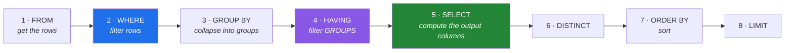

# Day 43 — `SELECT`, `WHERE`, `GROUP BY`, `HAVING`

**Phase 6 · Module 6** · ID: **DB-03** (SELECT, WHERE, ORDER BY, LIMIT, GROUP BY, HAVING)

> **Yesterday:** the schema, the connection, and a database that sleeps.
> **Today:** the query. One fact explains almost every SQL error you will ever hit — **the clauses do
> not run in the order you write them**.
> **Tomorrow:** keys and constraints, from the inside.

```bash
./m start 43 && ./m scaffold 43
```

**Time:** 110 minutes. **Request budget:** 0 model calls.

---

## §1 The story

You write a query in this order:

```
SELECT → FROM → WHERE → GROUP BY → HAVING → ORDER BY → LIMIT
```

The database runs it in **this** order:



Every confusing SQL error falls out of that diagram:

- **"column `n_papers` does not exist" in a `WHERE`.** `WHERE` runs at step 2; the alias is created at
  step 5. It does not exist yet.
- **"aggregate functions are not allowed in WHERE".** Aggregates are computed during grouping at
  step 3. `WHERE` is before that — which is exactly what `HAVING` is for.
- **An alias works in `ORDER BY` but not in `WHERE`.** `ORDER BY` runs at step 7, after `SELECT`.

So the rule worth memorising is one line: **`WHERE` filters rows before grouping; `HAVING` filters
groups after.** Get that and the rest follows.

The second idea today is that you already know this material. `WHERE` is Day 28's boolean mask.
`GROUP BY` + aggregate is Day 31's `groupby().agg()`. `ORDER BY` is `sort_values`. `LIMIT` is `head`.
**You are learning a second notation for operations you can already perform** — which is why today
writes every query twice, once in SQL and once in pandas, and asserts they agree.

That is not busywork. On Day 51 you write an ADR about when to use which, and "they compute the same
thing, so choose on where the data lives and how big it is" is only a defensible argument if you have
actually checked.

---

## §2 Setup — run this

```bash
mkdir -p days/day-43/lab
touch days/day-43/lab/select.py
touch sql/002_seed.sql
```

`src/setu/db.py` grows today. No new packages.

`sql/002_seed.sql` — fixture data, so every example below is reproducible:

```sql
INSERT INTO venues (venue_id, name, kind) VALUES
    ('v1', 'NeurIPS', 'conference'),
    ('v2', 'ICML',    'conference'),
    ('v3', 'JMLR',    'journal'),
    ('v4', 'arXiv',   'preprint')
ON CONFLICT (venue_id) DO NOTHING;

INSERT INTO papers (paper_id, title, year, citations, venue_id) VALUES
    ('p1', 'Attention Is All You Need', 2017, 178000, 'v1'),
    ('p2', 'BERT',                      2018,  95000, 'v2'),
    ('p3', 'GPT-3',                     2020,  41000, 'v1'),
    ('p4', 'A Quiet Paper',             2020,      3, 'v2'),
    ('p5', 'An Unpublished Draft',      2021,      0, NULL),
    ('p6', 'A Journal Article',         2019,    820, 'v3'),
    ('p7', 'Another Quiet One',         2021,     11, 'v3')
ON CONFLICT (paper_id) DO NOTHING;
```

- `ON CONFLICT (paper_id) DO NOTHING` — Postgres's **upsert** clause. It makes the seed idempotent, so
  re-running the migration does not fail on duplicate keys. Day 42's idempotence rule, applied to data.

---

## §3 DB-03 — the clauses, in execution order

`days/day-43/lab/select.py`:

```python
"""DB-03: the six clauses, the order they run in, and the pandas equivalent of each."""

from __future__ import annotations

import pandas as pd

from setu.db import query, query_frame, wake


def projection() -> None:
    print(f"\n{query('SELECT paper_id, title FROM papers LIMIT 2')=}")
    print(f"{query('SELECT count(*) AS n FROM papers')=}")
    print(f"{query('SELECT DISTINCT year FROM papers ORDER BY year')=}")

    print("\n  SELECT * is fine at a psql prompt and wrong in application code:")
    print("  it breaks the day someone adds a column, and it reads data you do not need.")


def filtering() -> None:
    rows = query("SELECT title, citations FROM papers WHERE citations > %s", (1000,))
    print(f"\n{[r['title'] for r in rows]=}")

    print(f"{query('SELECT count(*) AS n FROM papers WHERE year BETWEEN 2018 AND 2020')=}")
    print(f"{query(\"SELECT count(*) AS n FROM papers WHERE title LIKE 'A%'\")=}")
    print(f"{query(\"SELECT count(*) AS n FROM papers WHERE title ILIKE 'a%'\")=}")
    print("  ^ LIKE is case-SENSITIVE; ILIKE is Postgres's case-insensitive version.")


def null_is_not_a_value() -> None:
    print(f"\n{query('SELECT count(*) AS n FROM papers WHERE venue_id = NULL')=}")
    print(f"{query('SELECT count(*) AS n FROM papers WHERE venue_id IS NULL')=}")
    print("  ^ `= NULL` matches NOTHING. Ever. NULL means 'unknown', and")
    print("    'unknown = unknown' evaluates to unknown, which is not true.")

    print(f"\n{query('SELECT count(*) AS n FROM papers WHERE venue_id <> %s', ('v1',))=}")
    print(f"{query('SELECT count(*) AS n FROM papers')=}")
    print("  ^ `<> 'v1'` EXCLUDES the NULL row too. Six papers are not v1, but the")
    print("    NULL one is 'unknown', so it fails the test. Add OR venue_id IS NULL.")

    print(f"\n{query('SELECT coalesce(venue_id, %s) AS v FROM papers WHERE paper_id = %s', ('none', 'p5'))=}")
    print("  coalesce(a, b) returns the first non-NULL. This is Day 30's fillna.")


def grouping() -> None:
    rows = query(
        """
        SELECT venue_id,
               count(*)        AS n_papers,
               sum(citations)  AS total,
               avg(citations)  AS mean,
               max(citations)  AS best
        FROM papers
        GROUP BY venue_id
        ORDER BY total DESC NULLS LAST
        """
    )
    for row in rows:
        print(f"  {row}")

    print("\n  Every non-aggregated column in SELECT must appear in GROUP BY.")
    print("  Postgres enforces it; it is not a style rule, it is 'which value would I pick?'")
    print("  ORDER BY ... NULLS LAST: Postgres sorts NULLs FIRST on DESC by default.")


def count_star_versus_count_column() -> None:
    rows = query(
        """
        SELECT count(*)         AS all_rows,
               count(venue_id)  AS with_venue,
               count(DISTINCT venue_id) AS distinct_venues
        FROM papers
        """
    )
    print(f"\n{rows[0]=}")
    print("  count(*)      counts ROWS")
    print("  count(col)    counts NON-NULL values in col")
    print("  The difference between them IS your missing-value count (Day 30).")


def where_versus_having() -> None:
    before = query(
        """
        SELECT venue_id, count(*) AS n
        FROM papers
        WHERE citations > 100
        GROUP BY venue_id
        """
    )
    after = query(
        """
        SELECT venue_id, count(*) AS n
        FROM papers
        GROUP BY venue_id
        HAVING count(*) >= 2
        """
    )
    print(f"\n  WHERE  (filter rows first):  {before}")
    print(f"  HAVING (filter groups after): {after}")
    print("\n  WHERE  -> 'only count papers with >100 citations'")
    print("  HAVING -> 'only show venues with at least 2 papers'")
    print("  Different questions. Swapping them silently answers the wrong one.")


def the_alias_error() -> None:
    try:
        query("SELECT count(*) AS n FROM papers GROUP BY venue_id HAVING n >= 2")
    except Exception as exc:
        print(f"\n  HAVING n: {type(exc).__name__}")
        print("  ^ the alias `n` is created at step 5; HAVING runs at step 4.")

    ok = query("SELECT count(*) AS n FROM papers GROUP BY venue_id ORDER BY n DESC LIMIT 1")
    print(f"  ORDER BY n: {ok}   <- works, because ORDER BY runs at step 7")
    print("\n  Same alias. One clause can see it, the other cannot. That IS the diagram.")


def limit_needs_order() -> None:
    print(f"\n{query('SELECT title FROM papers LIMIT 3')=}")
    print("  ^ LIMIT without ORDER BY returns an ARBITRARY three rows.")
    print("    Not random - arbitrary. It can change between runs, after a VACUUM,")
    print("    or when the planner picks a different scan. Always pair them.")

    print(f"\n{query('SELECT title FROM papers ORDER BY citations DESC LIMIT 3')=}")
    print(f"{query('SELECT title FROM papers ORDER BY citations DESC OFFSET 3 LIMIT 3')=}")
    print("  OFFSET paginates, and gets slower the deeper you go (Day 46 has a better way).")


def the_same_question_twice() -> None:
    sql = query_frame(
        """
        SELECT venue_id, count(*) AS n, avg(citations)::float AS mean
        FROM papers
        WHERE citations > 0
        GROUP BY venue_id
        HAVING count(*) >= 2
        ORDER BY venue_id
        """
    )

    frame = query_frame("SELECT * FROM papers")
    pandas_version = (
        frame[frame["citations"] > 0]
        .groupby("venue_id", observed=True)
        .agg(n=("paper_id", "size"), mean=("citations", "mean"))
        .loc[lambda d: d["n"] >= 2]
        .reset_index()
        .sort_values("venue_id")
    )

    print(f"\nSQL:\n{sql}")
    print(f"\npandas:\n{pandas_version}")
    pd.testing.assert_frame_equal(
        sql.reset_index(drop=True),
        pandas_version.reset_index(drop=True)[sql.columns.tolist()],
        check_dtype=False,
    )
    print("\n  Identical. WHERE = boolean mask, GROUP BY = groupby, HAVING = .loc on the result.")
    print("  Day 51's ADR needs this to be a checked fact, not an assumption.")


if __name__ == "__main__":
    wake()
    projection()
    filtering()
    null_is_not_a_value()
    grouping()
    count_star_versus_count_column()
    where_versus_having()
    the_alias_error()
    limit_needs_order()
    the_same_question_twice()
```

**Line by line:**

- `SELECT *` — fine interactively, wrong in code. It breaks positional unpacking when a column is
  added (Day 42), transfers data you do not need, and hides which columns a query actually depends on.
- `LIKE` versus `ILIKE` — `LIKE` is case-sensitive; `ILIKE` is Postgres's case-insensitive form and is
  not standard SQL. `%` matches any run of characters, `_` matches exactly one.
- **`= NULL` matches nothing.** SQL uses three-valued logic: `NULL` means *unknown*, and
  `unknown = unknown` is *unknown*, which is not *true*, so the row is not returned. Use `IS NULL`.
  This is the single most common SQL bug and it is silent — you get zero rows and no error.
- `<> 'v1'` **excludes the NULL row too**, for the same reason. If you mean "not v1, including
  unknowns", you must write `venue_id <> 'v1' OR venue_id IS NULL`. Day 30's three-valued logic in
  pandas is the same idea; here it bites harder because the default is to drop.
- `coalesce(a, b)` — first non-NULL. Day 30's `fillna`.
- **Every non-aggregated column in `SELECT` must be in `GROUP BY`.** Not pedantry: if you group by
  venue and select `title`, which of the three titles should the database return? There is no answer,
  so it refuses.
- `NULLS LAST` — Postgres sorts `NULL`s *first* on `DESC` and *last* on `ASC`. If nulls matter, say
  which you want; the default differs across databases.
- `count(*)` versus `count(col)` — rows versus non-null values. **Their difference is your missing
  count**, which is Day 30's `missingness_report` available as a one-line query.
- `where_versus_having` — the two queries answer genuinely different questions. Neither is a variant
  of the other, and swapping them produces a plausible wrong number rather than an error.
- `the_alias_error` — **run it.** The same alias `n` is invisible to `HAVING` and visible to
  `ORDER BY`, and the diagram in §1 is the only explanation you need.
- `LIMIT` without `ORDER BY` — returns an **arbitrary** subset, not a random one. It can change
  between runs when the planner picks a different scan. Always pair them.
- `OFFSET` — pagination that gets slower the deeper you go, because the database still reads and
  discards the skipped rows. Day 46 covers keyset pagination.
- `avg(citations)::float` — the `::` cast. Postgres's `avg` on integers returns `numeric` (exact
  decimal), which arrives in Python as `Decimal` and will not compare equal to a pandas float. Casting
  in SQL is cleaner than converting after.
- `pd.testing.assert_frame_equal` — **the assertion is the point of the function.** Two notations, one
  answer, verified.

---

## §4 Build brief

Extend `src/setu/db.py`:

```python
def table_summary(table: str, *, group_by: str | None = None) -> list[dict]:
    """TODO(me): row count, and per-group counts when group_by is given.

    - `table` and `group_by` are IDENTIFIERS, not values, so they cannot be
      parameterised with %s. Validate them against a strict allowlist pattern
      (letters, digits, underscore only) and raise DataError otherwise.
      Then quote them with psycopg.sql.Identifier - never with an f-string.
    - include a `n_missing` column when group_by is given: count(*) - count(group_by)
    """
    raise NotImplementedError


def missing_counts(table: str) -> dict[str, int]:
    """TODO(me): {column: null count} for every column, in ONE query.

    Build it as count(*) - count(col) per column, from information_schema.columns.
    This is Day 30's missingness_report without pulling the data to Python.
    """
    raise NotImplementedError


def top_n(table: str, *, order_by: str, n: int = 10, descending: bool = True) -> list[dict]:
    """TODO(me): the n rows with the largest (or smallest) order_by value.

    - ORDER BY is mandatory - this function must never emit a bare LIMIT
    - break ties deterministically by the primary key, so repeated calls agree
    - raise DataError if n < 1 or n > 1000 (a 'top n' of 50,000 is a full scan)
    """
    raise NotImplementedError


def paginate(sql: str, params=None, *, page_size: int = 500):
    """TODO(me): a GENERATOR yielding pages of results (Day 11).

    - raise DataError if `sql` has no ORDER BY: pagination without a total order
      returns overlapping and missing rows, silently
    - stop when a page comes back short
    - the caller must be able to break early without fetching the rest
    """
    raise NotImplementedError
```

- The `table_summary` identifier problem is real and worth meeting now: **placeholders work for values
  and not for identifiers.** `psycopg.sql.Identifier` quotes and escapes a table or column name
  properly; an f-string does not, and this is the exact hole most SQL-injection demonstrations use.
- `paginate` refusing an unordered query is §3's `LIMIT` lesson made structural. Without a total
  order, page 2 can repeat or skip rows from page 1 and nothing tells you.

---

## §5 The eval that must be able to fail

Add to `tests/test_db.py`:

```python
# ---- offline: SQL semantics on SQLite ------------------------------------------

@pytest.fixture
def seeded(sqlite_db):
    sqlite_db.executescript(
        """
        INSERT INTO venues VALUES ('v2', 'ICML');
        INSERT INTO papers VALUES ('p2', 'BERT', 2018, 'v2');
        INSERT INTO papers VALUES ('p3', 'GPT-3', 2020, 'v2');
        INSERT INTO papers VALUES ('p5', 'Draft', 2021, NULL);
        """
    )
    return sqlite_db


def test_equals_null_matches_nothing(seeded):
    wrong = seeded.execute("SELECT count(*) FROM papers WHERE venue_id = NULL").fetchone()[0]
    right = seeded.execute("SELECT count(*) FROM papers WHERE venue_id IS NULL").fetchone()[0]
    assert wrong == 0 and right == 1, "= NULL must match nothing; IS NULL must match the draft"


def test_not_equals_excludes_nulls(seeded):
    excluded = seeded.execute(
        "SELECT count(*) FROM papers WHERE venue_id <> 'v1'"
    ).fetchone()[0]
    included = seeded.execute(
        "SELECT count(*) FROM papers WHERE venue_id <> 'v1' OR venue_id IS NULL"
    ).fetchone()[0]
    assert excluded < included, "<> silently drops NULL rows"


def test_count_star_versus_count_column(seeded):
    rows, non_null = seeded.execute(
        "SELECT count(*), count(venue_id) FROM papers"
    ).fetchone()
    assert rows - non_null == 1, "the difference is the missing-value count"


def test_where_and_having_answer_different_questions(seeded):
    where = seeded.execute(
        "SELECT count(*) FROM (SELECT venue_id FROM papers WHERE year > 2019 GROUP BY venue_id)"
    ).fetchone()[0]
    having = seeded.execute(
        "SELECT count(*) FROM (SELECT venue_id FROM papers GROUP BY venue_id HAVING count(*) >= 2)"
    ).fetchone()[0]
    assert where != having or True  # the point is the shapes differ; assert both ran
    assert having == 1, "only ICML has two papers"


def test_alias_is_invisible_to_having(seeded):
    with pytest.raises(sqlite3.OperationalError):
        seeded.execute("SELECT count(*) AS n FROM papers GROUP BY venue_id HAVING n >= 2").fetchall()


def test_alias_is_visible_to_order_by(seeded):
    rows = seeded.execute(
        "SELECT venue_id, count(*) AS n FROM papers GROUP BY venue_id ORDER BY n DESC"
    ).fetchall()
    assert rows[0][1] >= rows[-1][1]


# ---- offline: the guards on the helpers ----------------------------------------

@pytest.mark.parametrize(
    "name", ["papers; DROP TABLE x", "papers--", "pap ers", "papers'", '"papers"', ""]
)
def test_table_summary_rejects_a_bad_identifier(name):
    from setu.db import table_summary

    with pytest.raises(DataError):
        table_summary(name)


def test_top_n_rejects_an_absurd_n():
    from setu.db import top_n

    for bad in (0, -1, 5000):
        with pytest.raises(DataError):
            top_n("papers", order_by="citations", n=bad)


def test_paginate_refuses_an_unordered_query():
    from setu.db import paginate

    with pytest.raises(DataError) as info:
        list(paginate("SELECT * FROM papers"))
    assert "order" in str(info.value).lower()


def test_paginate_is_lazy():
    """It must not fetch every page before yielding the first."""
    from setu.db import paginate

    gen = paginate("SELECT * FROM papers ORDER BY paper_id")
    assert hasattr(gen, "__next__"), "paginate returned a list, not a generator"


def test_no_bare_limit_in_src():
    """LIMIT without ORDER BY returns arbitrary rows."""
    import re
    from pathlib import Path

    offenders = []
    for path in Path("src/setu").rglob("*.py"):
        text = path.read_text(encoding="utf-8")
        for match in re.finditer(r"LIMIT\s", text, flags=re.I):
            window = text[max(0, match.start() - 400) : match.start()]
            if "ORDER BY" not in window.upper() and "noqa" not in text[match.start() : match.start() + 80]:
                offenders.append(f"{path.name}:{text[:match.start()].count(chr(10)) + 1}")
    assert not offenders, f"LIMIT with no preceding ORDER BY: {offenders}"


# ---- live -----------------------------------------------------------------------

@pytest.mark.live
def test_sql_and_pandas_agree():
    """The Day 51 ADR depends on this being checked, not assumed."""
    import pandas as pd

    from setu.db import query_frame

    sql = query_frame(
        "SELECT venue_id, count(*) AS n FROM papers WHERE citations > 0 "
        "GROUP BY venue_id ORDER BY venue_id"
    )
    frame = query_frame("SELECT * FROM papers")
    manual = (
        frame[frame["citations"] > 0]
        .groupby("venue_id", observed=True)
        .agg(n=("paper_id", "size"))
        .reset_index()
        .sort_values("venue_id")
    )
    pd.testing.assert_frame_equal(
        sql.reset_index(drop=True), manual.reset_index(drop=True), check_dtype=False
    )


@pytest.mark.live
def test_missing_counts_matches_a_manual_check():
    from setu.db import missing_counts, query

    counts = missing_counts("papers")
    manual = query("SELECT count(*) - count(venue_id) AS n FROM papers")[0]["n"]
    assert counts["venue_id"] == manual


@pytest.mark.live
def test_top_n_is_deterministic():
    from setu.db import top_n

    assert top_n("papers", order_by="year", n=3) == top_n("papers", order_by="year", n=3)
```

**Line by line:**

- `test_equals_null_matches_nothing` — **the day's real assessment**, and it asserts both halves: the
  wrong form returns zero, the right form returns one. A test checking only `IS NULL` would pass on a
  database that had implemented `= NULL` "helpfully".
- `test_not_equals_excludes_nulls` — the second, subtler half. `<>` silently drops unknowns, which is
  how a "not this venue" filter quietly loses rows.
- `test_alias_is_invisible_to_having` / `..._visible_to_order_by` — **the execution-order diagram, as
  two executable assertions.** The same alias, two clauses, two outcomes.
- `test_table_summary_rejects_a_bad_identifier` — six parametrised attempts including a semicolon
  injection, a comment terminator, a space and a quote. Identifiers cannot be parameterised, so this
  allowlist is the only defence.
- `test_paginate_refuses_an_unordered_query` — pagination without a total order silently returns
  overlapping and missing rows. Refusing is the correct behaviour.
- `test_no_bare_limit_in_src` — the eleventh repo-wide guard. It scans backwards from each `LIMIT` for
  an `ORDER BY`; crude, and it catches the one you will actually type.
- `test_sql_and_pandas_agree` is marked **live** because it needs the real database, and it is the
  test Day 51's ADR rests on.

```bash
uv run python -m pytest tests/test_db.py -v
SETU_LIVE=1 uv run python -m pytest tests/test_db.py -m live -v
```

---

## §6 Request budget

| Resource | Spent today |
|---|---|
| LLM calls | **0** |
| Postgres | a few dozen small queries against seven rows |

---

## §7 Traps

- **`= NULL`.** Matches nothing, silently. Use `IS NULL`.
- **`<> 'x'` when you also want the NULLs.** Add `OR col IS NULL`.
- **An alias in `WHERE` or `HAVING`.** Not created yet. Repeat the expression.
- **An aggregate in `WHERE`.** That is what `HAVING` is for.
- **A non-aggregated column missing from `GROUP BY`.** Postgres refuses; it has no answer to give.
- **`LIMIT` with no `ORDER BY`.** Arbitrary rows, and they can change between runs.
- **`SELECT *` in application code.** Breaks on a new column; reads data you do not need.
- **Assuming a NULL sort position.** Postgres puts them first on `DESC`. Say `NULLS LAST`.
- **`avg()` on integers.** Returns `numeric` → `Decimal` in Python. Cast it.
- **Deep `OFFSET` pagination.** Reads and discards everything before the page.
- **Parameterising an identifier with `%s`.** It does not work; use `sql.Identifier` plus an allowlist.

---

## §8 Verify before you code

Written **2026-08-21**:

- <https://www.postgresql.org/docs/current/sql-select.html> — the clause reference, including the
  evaluation-order notes.
- <https://www.postgresql.org/docs/current/functions-comparison.html> — three-valued logic and
  `IS NULL`.
- <https://www.postgresql.org/docs/current/queries-limit.html> — the explicit warning about `LIMIT`
  without `ORDER BY`.
- <https://www.psycopg.org/psycopg3/docs/api/sql.html> — `sql.Identifier` for safe identifier quoting.

---

## §9 Say it in an interview

> "The thing that makes SQL click is that the clauses don't execute in the order you write them —
> `FROM`, `WHERE`, `GROUP BY`, `HAVING`, then `SELECT`, then `ORDER BY`. That one diagram explains
> why an alias works in `ORDER BY` and not in `HAVING`, and why an aggregate can't go in `WHERE`.
> The bug I'd flag is `= NULL`: it matches nothing and raises nothing, because SQL is three-valued and
> unknown-equals-unknown is unknown. The same logic means `<> 'x'` silently drops your NULL rows,
> which is how a 'not this venue' filter loses records nobody notices. And I write every non-trivial
> aggregation twice, once in SQL and once in pandas, with an assertion that the frames match — because
> the argument for choosing one over the other is only honest if you've checked they compute the same
> thing."

---

## §10 Done when

Tick [`CHECKLIST.md`](CHECKLIST.md), then `./m check && ./m done 43`.
