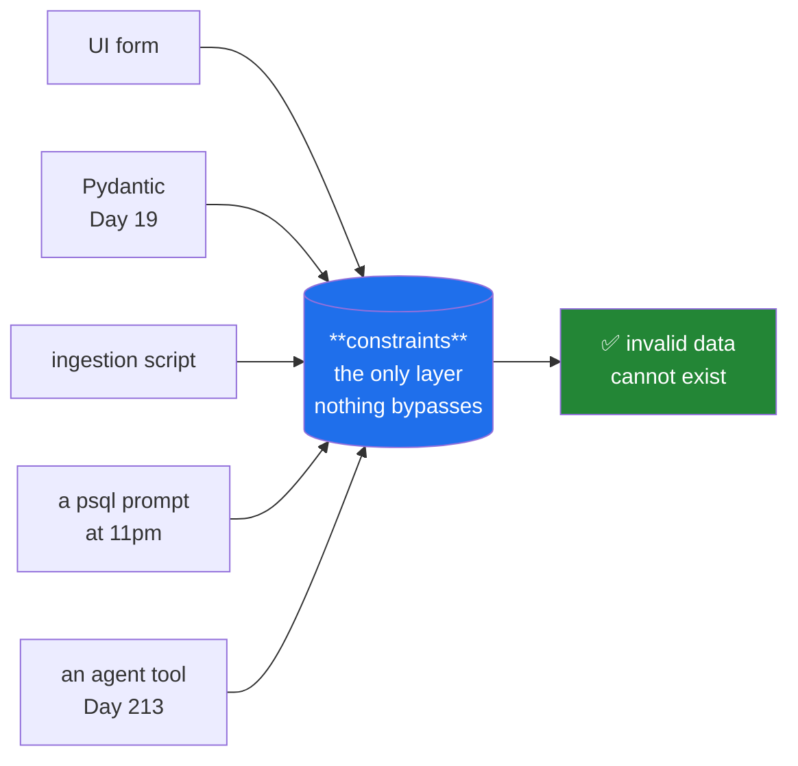

# Day 44 — Keys and constraints

**Phase 6 · Module 6** · ID: **DB-04** (primary keys, foreign keys, constraints)

> **Yesterday:** the six clauses and the order they run in.
> **Today:** the constraints you declared on Day 42, from the inside — what each one actually
> prevents, what it costs, and why a bug caught by the database is worth ten caught by a test.
> **Tomorrow:** joins.

```bash
./m start 44 && ./m scaffold 44
```

**Time:** 110 minutes. **Request budget:** 0 model calls.

---

## §1 The story

You have four places to validate a paper's year: the UI, the Pydantic model (Day 19), the ingestion
script, and the database. Three of them can be bypassed.

Someone runs a one-off backfill in a psql prompt. A colleague writes a second ingestion path. An
agent on Day 213 calls a tool you did not anticipate. Every one of those routes around your Python.

**The database is the only layer that everything goes through.** A constraint there is not
belt-and-braces — it is the *only* guarantee. Everything else is a courtesy that catches the problem
earlier and with a nicer message.



The second idea is about **which key**. A primary key is either something the data already has (a
*natural* key, like an arXiv id) or something you invented (a *surrogate*, like a serial integer or a
UUID). That choice has consequences that surface months later:

| | Natural (`arxiv_id`) | Surrogate (`bigserial` / UUID) |
|---|---|---|
| Meaningful to a human | ✅ | ✗ |
| Stable if the source changes it | ✗ **it will** | ✅ |
| Joins readable without a lookup | ✅ | ✗ |
| Safe to expose in a URL | usually | UUID yes, serial **no** (enumerable) |
| Storage in child tables | bigger | small |

There is no universal answer, and Setu uses both — natural keys where the identifier is genuinely
external and immutable, surrogates where it is not. Day 51's ADR records why.

And a leakage note that belongs here, because it is the one people miss: **a `UNIQUE` constraint is
also a deduplication guarantee.** Day 79 splits data into train and test; if the same paper appears
twice under two ids, one copy can land in each half and your test score is inflated. A unique
constraint on the natural key makes that impossible at the source rather than something you hope the
split handles.

---

## §2 Setup — run this

```bash
mkdir -p days/day-44/lab
touch days/day-44/lab/constraints.py
touch sql/003_constraints.sql
```

`src/setu/db.py` and `tests/test_db.py` grow today. No new packages.

---

## §3 DB-04 — every constraint, and what it costs

`sql/003_constraints.sql`:

```sql
-- Day 44: the constraints that were not in the first schema pass.

ALTER TABLE papers
    ADD COLUMN IF NOT EXISTS arxiv_id TEXT;

CREATE UNIQUE INDEX IF NOT EXISTS uq_papers_arxiv
    ON papers (arxiv_id) WHERE arxiv_id IS NOT NULL;

ALTER TABLE papers
    ADD CONSTRAINT ck_papers_title_not_blank
    CHECK (length(trim(title)) > 0) NOT VALID;

ALTER TABLE papers VALIDATE CONSTRAINT ck_papers_title_not_blank;

CREATE UNIQUE INDEX IF NOT EXISTS uq_paper_authors_position
    ON paper_authors (paper_id, position);

ALTER TABLE authors
    ADD CONSTRAINT ck_authors_name_not_blank
    CHECK (length(trim(full_name)) > 0);
```

**Line by line:**

- `CREATE UNIQUE INDEX ... WHERE arxiv_id IS NOT NULL` — a **partial unique index**. Plain `UNIQUE`
  permits many `NULL`s (Day 42), which is usually what you want; this says "at most one row per
  arXiv id, and unlimited rows with no arXiv id". That is exactly the rule for an optional external
  identifier, and it is the deduplication guarantee from §1.
- `ADD CONSTRAINT ... NOT VALID` then `VALIDATE CONSTRAINT` — **the two-step pattern for a live
  table.** `NOT VALID` adds the constraint for *new* rows immediately and cheaply, without scanning
  the existing millions. `VALIDATE` then checks the existing rows with a weaker lock that does not
  block writes. Adding a constraint in one step takes an `ACCESS EXCLUSIVE` lock and stops your
  application. On seven rows it makes no difference; the habit is the point.
- `uq_paper_authors_position` — "no two authors share position 2 on the same paper". The composite
  primary key already prevents a duplicate *pair*; this prevents a duplicate *ordering*. Two different
  facts, two constraints.

Now `days/day-44/lab/constraints.py`:

```python
"""DB-04: what each constraint prevents, what it costs, and how the error arrives."""

from __future__ import annotations

import psycopg

from setu.db import connect, execute, query, wake


def show(label: str, sql: str, params=None) -> None:
    try:
        execute(sql, params)
        print(f"  {label:<34} accepted")
    except psycopg.errors.IntegrityError as exc:
        name = type(exc).__name__
        detail = (exc.diag.constraint_name or "").strip()
        print(f"  {label:<34} REFUSED  {name}  constraint={detail!r}")


def the_five_constraints() -> None:
    print("\n-- what the database refuses --")
    show("duplicate primary key", "INSERT INTO papers (paper_id, title, year) VALUES (%s,%s,%s)",
         ("p1", "Duplicate", 2020))
    show("null in a NOT NULL column", "INSERT INTO papers (paper_id, title, year) VALUES (%s,%s,%s)",
         ("p90", None, 2020))
    show("blank title (CHECK)", "INSERT INTO papers (paper_id, title, year) VALUES (%s,%s,%s)",
         ("p91", "   ", 2020))
    show("year out of range (CHECK)", "INSERT INTO papers (paper_id, title, year) VALUES (%s,%s,%s)",
         ("p92", "Time Traveller", 3000))
    show("orphan foreign key", "INSERT INTO papers (paper_id, title, year, venue_id) VALUES (%s,%s,%s,%s)",
         ("p93", "Ghost Venue", 2020, "does-not-exist"))
    show("negative citations (CHECK)", "INSERT INTO papers (paper_id, title, year, citations) VALUES (%s,%s,%s,%s)",
         ("p94", "Negative", 2020, -5))

    print("\n  Six bugs, none of which needed a Python test to catch.")
    print("  exc.diag.constraint_name tells you WHICH rule fired - that is what you")
    print("  translate into a user-facing message.")


def unique_and_null() -> None:
    execute("UPDATE papers SET arxiv_id = %s WHERE paper_id = %s", ("1706.03762", "p1"))
    show("duplicate arxiv_id", "UPDATE papers SET arxiv_id = %s WHERE paper_id = %s",
         ("1706.03762", "p2"))

    rows = query("SELECT count(*) AS n FROM papers WHERE arxiv_id IS NULL")
    print(f"\n  {rows[0]['n']} papers have no arxiv_id, and that is allowed.")
    print("  A partial unique index: one row per VALUE, unlimited rows with none.")


def the_error_arrives_late() -> None:
    print("\n-- deferrable constraints --")
    print("  By default a foreign key is checked at STATEMENT time. If you must insert")
    print("  two rows that reference each other, declare the constraint DEFERRABLE")
    print("  INITIALLY DEFERRED and it is checked at COMMIT instead.")
    print("  Use sparingly: a deferred error surfaces far from the statement that caused it.")


def transactions_and_partial_failure() -> None:
    print("\n-- a failed statement poisons the whole transaction --")
    with connect() as conn:
        with conn.cursor() as cur:
            cur.execute("INSERT INTO authors (author_id, full_name) VALUES (%s,%s)",
                        ("a90", "Valid Author"))
            try:
                cur.execute("INSERT INTO authors (author_id, full_name) VALUES (%s,%s)",
                            ("a90", "Duplicate"))
            except psycopg.errors.UniqueViolation:
                print("  second insert refused")

            try:
                cur.execute("SELECT 1")
            except psycopg.errors.InFailedSqlTransaction:
                print("  ...and the transaction is now ABORTED: even SELECT fails")

    print("\n  Postgres does not let you continue after an error inside a transaction.")
    print("  Either roll back, or use a SAVEPOINT to isolate the risky statement.")

    with connect() as conn:
        with conn.cursor() as cur:
            cur.execute("SAVEPOINT sp")
            try:
                cur.execute("INSERT INTO authors (author_id, full_name) VALUES (%s,%s)",
                            ("a90", "Duplicate again"))
            except psycopg.errors.UniqueViolation:
                cur.execute("ROLLBACK TO SAVEPOINT sp")
            cur.execute("SELECT count(*) AS n FROM authors")
            print(f"  after ROLLBACK TO SAVEPOINT, the transaction continues: {cur.fetchone()}")


def upsert() -> None:
    execute(
        """
        INSERT INTO papers (paper_id, title, year, citations)
        VALUES (%s, %s, %s, %s)
        ON CONFLICT (paper_id) DO UPDATE
            SET citations = EXCLUDED.citations,
                title     = EXCLUDED.title
        """,
        ("p1", "Attention Is All You Need", 2017, 179000),
    )
    print(f"\n  {query('SELECT citations FROM papers WHERE paper_id = %s', ('p1',))=}")
    print("  ON CONFLICT ... DO UPDATE is an UPSERT. EXCLUDED is the row you tried to insert.")
    print("  This is how Day 227's ingestion re-runs safely: idempotent by construction.")


def what_constraints_cost() -> None:
    print("\n-- the honest cost --")
    print("  Every UNIQUE and PRIMARY KEY constraint is backed by an INDEX:")
    print("    - writes get slower (the index must be updated)")
    print("    - the index takes disk space")
    print("    - on a bulk load, dropping and rebuilding indexes is often faster")
    print("  CHECK constraints are cheap: one expression per row on write.")
    print("  FOREIGN KEYS cost a lookup per write, and REQUIRE an index on the")
    print("  referencing column or every parent delete becomes a full scan (Day 50).")


def cleanup() -> None:
    execute("DELETE FROM authors WHERE author_id LIKE %s", ("a9%",))
    execute("DELETE FROM papers WHERE paper_id LIKE %s", ("p9%",))
    execute("UPDATE papers SET arxiv_id = NULL WHERE paper_id IN (%s, %s)", ("p1", "p2"))


if __name__ == "__main__":
    wake()
    the_five_constraints()
    unique_and_null()
    the_error_arrives_late()
    transactions_and_partial_failure()
    upsert()
    what_constraints_cost()
    cleanup()
```

**Line by line:**

- `exc.diag.constraint_name` — psycopg exposes the Postgres error diagnostics, including **which named
  constraint fired**. This is why constraints get explicit names (`ck_papers_title_not_blank`): a
  generated name like `papers_check1` tells a user nothing, whereas a named one maps cleanly to
  "Title cannot be blank".
- `psycopg.errors.IntegrityError` — the parent class of `UniqueViolation`, `ForeignKeyViolation`,
  `CheckViolation` and `NotNullViolation`. Day 18's hierarchy lesson, in someone else's library:
  catch the parent when the response is the same, the child when it differs.
- `transactions_and_partial_failure` — **the behaviour that surprises people coming from other
  databases.** After any error inside a transaction, Postgres marks it aborted and every subsequent
  statement fails with `InFailedSqlTransaction`, *including a `SELECT`*. There is no "carry on".
- `SAVEPOINT` / `ROLLBACK TO SAVEPOINT` — a nested transaction marker. Roll back to it and the outer
  transaction continues. This is how a bulk loader skips a bad row without abandoning the batch.
- `ON CONFLICT (paper_id) DO UPDATE SET ... = EXCLUDED....` — the **upsert**. `EXCLUDED` is the
  pseudo-table holding the row you *tried* to insert. This is what makes Day 227's ingestion re-runnable:
  running it twice produces the same state as running it once (Day 0's idempotence rule, again).
- `what_constraints_cost` — **be able to say this out loud.** Constraints are not free: every unique
  constraint is an index, and every index slows writes and consumes disk. A foreign key without an
  index on the *referencing* column turns every parent delete into a full table scan, which is a real
  production incident and Day 50's material.

---

## §4 Build brief

Extend `src/setu/db.py`:

```python
CONSTRAINT_MESSAGES = {
    "papers_pkey": "A paper with that id already exists.",
    "uq_papers_arxiv": "That arXiv id is already recorded against another paper.",
    "ck_papers_title_not_blank": "Title cannot be blank.",
    "papers_year_check": "Year must be between 1900 and 2100.",
    "papers_venue_id_fkey": "That venue does not exist.",
}


def friendly_integrity_error(exc) -> str:
    """TODO(me): turn a psycopg IntegrityError into a message a human can act on.

    - read exc.diag.constraint_name and look it up in CONSTRAINT_MESSAGES
    - fall back to a generic message that still names the constraint, so an
      unmapped constraint is diagnosable rather than opaque
    - never include the raw SQL or the parameter values (they may contain secrets)
    """
    raise NotImplementedError


def upsert(table: str, rows: list[dict], *, conflict_on: list[str], update: list[str]) -> int:
    """TODO(me): a batched INSERT ... ON CONFLICT DO UPDATE. Return rows affected.

    - identifiers validated and quoted with sql.Identifier (Day 43)
    - all rows in ONE statement (executemany is slower; use a multi-row VALUES)
    - `update` lists the columns to overwrite; anything not listed is left alone
    - raise DataError if rows is empty, if the dicts have inconsistent keys, or if
      any name in conflict_on/update is not among those keys
    - must be IDEMPOTENT: calling it twice with the same rows changes nothing the
      second time
    """
    raise NotImplementedError


def insert_many_skipping_bad(table: str, rows: list[dict]) -> tuple[int, list[dict]]:
    """TODO(me): insert rows, skipping ones that violate a constraint. Return (inserted, rejected).

    - use a SAVEPOINT per row so one bad row does not abort the batch
    - each rejected entry is {'row': ..., 'reason': friendly_integrity_error(exc)}
    - a NON-integrity error (a bug, a lost connection) must still propagate
    """
    raise NotImplementedError


def assert_no_duplicate_natural_keys(table: str, *, key: str) -> None:
    """TODO(me): raise DataError if any value of `key` appears more than once.

    - the message must name up to 5 offending values and the total count
    - Day 79's split depends on this: a duplicated record can land in both halves
      and inflate a test score (Principle 8)
    """
    raise NotImplementedError
```

- `friendly_integrity_error` refusing to include SQL or parameters is Principle 11: an error message
  is a surface, and echoing user input back into a log or a UI is how secrets and injection payloads
  travel.
- `insert_many_skipping_bad` distinguishing an integrity error (skip the row) from any other exception
  (stop everything) is Day 18's narrow-catch rule at batch scale.

---

## §5 The eval that must be able to fail

Add to `tests/test_db.py`:

```python
# ---- offline: constraint semantics on SQLite ------------------------------------

def test_partial_unique_allows_many_nulls(sqlite_db):
    sqlite_db.executescript(
        """
        ALTER TABLE papers ADD COLUMN arxiv_id TEXT;
        CREATE UNIQUE INDEX uq_arxiv ON papers(arxiv_id) WHERE arxiv_id IS NOT NULL;
        INSERT INTO papers VALUES ('p2', 'B', 2020, 'v1', NULL);
        INSERT INTO papers VALUES ('p3', 'C', 2020, 'v1', NULL);
        """
    )
    n = sqlite_db.execute("SELECT count(*) FROM papers WHERE arxiv_id IS NULL").fetchone()[0]
    assert n == 3, "a partial unique index must allow unlimited NULLs"


def test_partial_unique_rejects_a_duplicate_value(sqlite_db):
    sqlite_db.executescript(
        """
        ALTER TABLE papers ADD COLUMN arxiv_id TEXT;
        CREATE UNIQUE INDEX uq_arxiv ON papers(arxiv_id) WHERE arxiv_id IS NOT NULL;
        UPDATE papers SET arxiv_id = '1706.03762' WHERE paper_id = 'p1';
        """
    )
    with pytest.raises(sqlite3.IntegrityError):
        sqlite_db.execute("INSERT INTO papers VALUES ('p2', 'B', 2020, 'v1', '1706.03762')")


def test_composite_unique_prevents_a_duplicate_position(sqlite_db):
    sqlite_db.executescript(
        """
        CREATE UNIQUE INDEX uq_pos ON paper_authors(paper_id, position);
        INSERT INTO paper_authors VALUES ('p1', 'a1', 1);
        """
    )
    with pytest.raises(sqlite3.IntegrityError):
        sqlite_db.execute("INSERT INTO paper_authors VALUES ('p1', 'a2', 1)")


def test_composite_unique_still_allows_a_second_author(sqlite_db):
    sqlite_db.executescript(
        """
        CREATE UNIQUE INDEX uq_pos ON paper_authors(paper_id, position);
        INSERT INTO paper_authors VALUES ('p1', 'a1', 1);
        INSERT INTO paper_authors VALUES ('p1', 'a2', 2);
        """
    )
    n = sqlite_db.execute("SELECT count(*) FROM paper_authors").fetchone()[0]
    assert n == 2, "the index must constrain the ORDER, not the number of authors"


def test_constraints_file_names_every_constraint():
    """A generated name like papers_check1 cannot be mapped to a user message."""
    import re
    from pathlib import Path

    text = Path("sql/003_constraints.sql").read_text(encoding="utf-8")
    unnamed = re.findall(r"ADD\s+CHECK", text, flags=re.I)
    assert not unnamed, "an unnamed CHECK constraint - use ADD CONSTRAINT <name> CHECK"


def test_constraint_messages_cover_the_schema():
    """Every named constraint in the SQL has a human message."""
    import re
    from pathlib import Path

    from setu.db import CONSTRAINT_MESSAGES

    text = "\n".join(
        p.read_text(encoding="utf-8") for p in sorted(Path("sql").glob("*.sql"))
    )
    named = set(re.findall(r"ADD\s+CONSTRAINT\s+(\w+)", text, flags=re.I))
    named |= set(re.findall(r"CREATE\s+UNIQUE\s+INDEX\s+(?:IF NOT EXISTS\s+)?(\w+)", text, flags=re.I))
    missing = named - set(CONSTRAINT_MESSAGES)
    assert not missing, f"constraints with no friendly message: {sorted(missing)}"


def test_friendly_error_never_leaks_sql():
    from setu.db import friendly_integrity_error

    class FakeDiag:
        constraint_name = "papers_pkey"

    class FakeExc(Exception):
        diag = FakeDiag()

    message = friendly_integrity_error(FakeExc("INSERT INTO papers ... 'secret-token'"))
    assert "INSERT" not in message and "secret-token" not in message


def test_friendly_error_names_an_unmapped_constraint():
    from setu.db import friendly_integrity_error

    class FakeDiag:
        constraint_name = "some_new_constraint"

    class FakeExc(Exception):
        diag = FakeDiag()

    assert "some_new_constraint" in friendly_integrity_error(FakeExc("x"))


# ---- live -----------------------------------------------------------------------

@pytest.mark.live
@pytest.mark.parametrize(
    ("params", "expect"),
    [
        (("p1", "Duplicate", 2020), "already exists"),
        (("p95", "   ", 2020), "blank"),
        (("p96", "Time Traveller", 3000), "1900"),
    ],
)
def test_every_constraint_produces_a_useful_message(params, expect):
    import psycopg

    from setu.db import execute, friendly_integrity_error

    with pytest.raises(psycopg.errors.IntegrityError) as info:
        execute("INSERT INTO papers (paper_id, title, year) VALUES (%s,%s,%s)", params)
    assert expect.lower() in friendly_integrity_error(info.value).lower()


@pytest.mark.live
def test_upsert_is_idempotent():
    from setu.db import query, upsert

    rows = [{"paper_id": "test-u1", "title": "Upsert Me", "year": 2020, "citations": 5}]
    upsert("papers", rows, conflict_on=["paper_id"], update=["citations", "title"])
    upsert("papers", rows, conflict_on=["paper_id"], update=["citations", "title"])
    found = query("SELECT count(*) AS n FROM papers WHERE paper_id = %s", ("test-u1",))
    assert found[0]["n"] == 1, "the second upsert inserted a duplicate"


@pytest.mark.live
def test_upsert_updates_only_the_listed_columns():
    from setu.db import execute, query, upsert

    upsert("papers", [{"paper_id": "test-u2", "title": "Original", "year": 2020, "citations": 1}],
           conflict_on=["paper_id"], update=["citations"])
    upsert("papers", [{"paper_id": "test-u2", "title": "Changed", "year": 2020, "citations": 9}],
           conflict_on=["paper_id"], update=["citations"])
    row = query("SELECT title, citations FROM papers WHERE paper_id = %s", ("test-u2",))[0]
    assert row["citations"] == 9
    assert row["title"] == "Original", "a column not listed in `update` was overwritten"
    execute("DELETE FROM papers WHERE paper_id LIKE %s", ("test-u%",))


@pytest.mark.live
def test_bad_rows_are_skipped_not_fatal():
    from setu.db import execute, insert_many_skipping_bad

    rows = [
        {"paper_id": "test-s1", "title": "Fine", "year": 2020},
        {"paper_id": "test-s2", "title": "   ", "year": 2020},      # blank title
        {"paper_id": "test-s3", "title": "Also fine", "year": 2020},
    ]
    inserted, rejected = insert_many_skipping_bad("papers", rows)
    assert inserted == 2 and len(rejected) == 1
    assert "blank" in rejected[0]["reason"].lower()
    execute("DELETE FROM papers WHERE paper_id LIKE %s", ("test-s%",))


@pytest.mark.live
def test_no_duplicate_natural_keys():
    from setu.db import assert_no_duplicate_natural_keys

    assert_no_duplicate_natural_keys("papers", key="paper_id")
```

**Line by line:**

- `test_partial_unique_allows_many_nulls` **and** `..._rejects_a_duplicate_value` — both halves. A
  plain `UNIQUE` would fail the first on some databases; no constraint at all passes the first and
  fails the second. Together they pin the exact behaviour.
- `test_composite_unique_still_allows_a_second_author` — the counter-test. An over-tight index that
  constrained `paper_id` alone would pass the "rejects duplicate position" test and break the schema.
  **Every constraint test needs its "and this must still be allowed" twin.**
- `test_constraint_messages_cover_the_schema` — **the day's real assessment.** It parses the SQL files
  for named constraints and asserts each has an entry in `CONSTRAINT_MESSAGES`. Add a constraint on
  Day 227 and forget the message, and this goes red immediately rather than surfacing as an opaque
  error in front of a user.
- `test_friendly_error_never_leaks_sql` — the error message is a surface. Echoing the statement or the
  parameters into a log or a UI leaks whatever was in them.
- `test_upsert_updates_only_the_listed_columns` — `title` must survive. An upsert that overwrites
  everything passes the idempotence test and silently reverts fields the caller meant to preserve.
- `test_bad_rows_are_skipped_not_fatal` — two good rows in, one bad row rejected with a readable
  reason. Without savepoints, the first error aborts the transaction and you insert nothing.

```bash
uv run python -m pytest tests/test_db.py -v
SETU_LIVE=1 uv run python -m pytest tests/test_db.py -m live -v
```

---

## §6 Request budget

| Resource | Spent today |
|---|---|
| LLM calls | **0** |
| Postgres | a few dozen statements, all cleaned up afterwards |

---

## §7 Traps

- **Validating only in Python.** Every other path into the database bypasses it.
- **Unnamed `CHECK` constraints.** `papers_check1` cannot become a user-facing message.
- **Plain `UNIQUE` on an optional column.** Allows many NULLs — sometimes right, sometimes not.
  Say which you mean with a partial index.
- **Adding a constraint to a large table in one step.** Takes an exclusive lock. `NOT VALID`, then
  `VALIDATE`.
- **Expecting to continue after an error in a transaction.** Postgres aborts it entirely. Use a
  `SAVEPOINT`.
- **Catching `IntegrityError` when you meant `UniqueViolation`.** Different responses, different classes.
- **An upsert that overwrites every column.** Silently reverts fields the caller kept deliberately.
- **A foreign key with no index on the referencing column.** Every parent delete becomes a full scan.
- **Echoing SQL or parameters into an error message.** They may contain secrets.
- **Assuming constraints are free.** Each unique constraint is an index; writes pay for it.
- **No unique constraint on a natural key.** Duplicates can land on both sides of a train/test split.

---

## §8 Verify before you code

Written **2026-08-21**:

- <https://www.postgresql.org/docs/current/ddl-constraints.html> — every constraint type.
- <https://www.postgresql.org/docs/current/indexes-partial.html> — partial unique indexes.
- <https://www.postgresql.org/docs/current/sql-insert.html#SQL-ON-CONFLICT> — `ON CONFLICT` and
  `EXCLUDED`.
- <https://www.psycopg.org/psycopg3/docs/api/errors.html> — the exception hierarchy and `exc.diag`.

---

## §9 Say it in an interview

> "Validation lives in the database because that's the only layer nothing bypasses — a backfill in a
> psql prompt, a second ingestion path, or an agent tool all route around your Pydantic model. So
> every constraint is explicitly *named*, and there's a test that parses the migration files and fails
> if a named constraint has no corresponding human-readable message, which means an unmapped
> constraint can't reach a user as an opaque error. The Postgres behaviour worth knowing is that any
> error inside a transaction aborts the whole thing — even a subsequent `SELECT` fails — so a bulk
> loader that wants to skip bad rows needs a savepoint per row. And a unique constraint on the natural
> key is a leakage control as much as a data-quality one: without it the same record can appear twice
> under two ids and land on both sides of a train/test split."

---

## §10 Done when

Tick [`CHECKLIST.md`](CHECKLIST.md), then `./m check && ./m done 44`.
