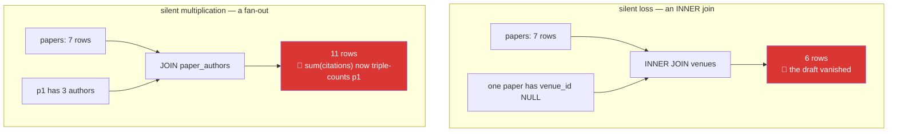

# Day 45 — Joins and unions

**Phase 6 · Module 6** · ID: **DB-05** (inner, left, right, full joins; unions)

> **Yesterday:** constraints, and letting the database refuse bad data.
> **Today:** putting the normalised tables back together — and the two failure modes that are silent
> in both SQL and pandas: **rows quietly disappearing, and rows quietly multiplying.**
> **Tomorrow:** subqueries, CTEs and window functions.

```bash
./m start 45 && ./m scaffold 45
```

**Time:** 110 minutes. **Request budget:** 0 model calls.

---

## §1 The story

Day 42 split one wide table into four narrow ones. A join puts them back together for a specific
question. The mechanism is simple; the failure modes are not, because **neither of them raises**.



**Silent loss.** An inner join keeps only rows that matched. Your unpublished draft has
`venue_id IS NULL`, so it matches nothing and disappears. You then report "average citations per
paper" over six papers and call it seven.

**Silent multiplication.** Joining to a one-to-many table duplicates the parent row once per child.
That is correct behaviour — and it means any aggregate over the parent's columns is now wrong.
`sum(citations)` after joining to authors counts a three-author paper's citations three times. This
one is worse than loss, because the number looks plausible.

The defence is not cleverness. It is **arithmetic you do every time**: know the row count before,
know it after, and be able to explain the difference. Day 32's `safe_merge` did exactly this in
pandas; today the same discipline in SQL, and the same helper extended.

Then **unions**, which stack rows rather than widening them:

- `UNION` — stack **and deduplicate** (a sort, so it costs).
- `UNION ALL` — stack, keep everything, much cheaper. **This is usually what you want**, and using
  `UNION` by habit both hides duplicates you should know about and costs a sort you did not need.

---

## §2 Setup — run this

```bash
mkdir -p days/day-45/lab
touch days/day-45/lab/joins.py
touch sql/004_seed_authors.sql
```

`sql/004_seed_authors.sql`:

```sql
INSERT INTO authors (author_id, full_name) VALUES
    ('a1', 'Ashish Vaswani'), ('a2', 'Noam Shazeer'),
    ('a3', 'Jacob Devlin'),   ('a4', 'Nobody Cited')
ON CONFLICT (author_id) DO NOTHING;

INSERT INTO paper_authors (paper_id, author_id, position) VALUES
    ('p1', 'a1', 1), ('p1', 'a2', 2), ('p1', 'a3', 3),
    ('p2', 'a3', 1),
    ('p3', 'a2', 1)
ON CONFLICT (paper_id, author_id) DO NOTHING;
```

`a4` has no papers, and `p4`–`p7` have no authors. Those gaps are what make the join types visible.

---

## §3 DB-05 — the four joins, and the accounting

`days/day-45/lab/joins.py`:

```python
"""DB-05: join types, the two silent failures, and the arithmetic that catches them."""

from __future__ import annotations

import pandas as pd

from setu.db import query, query_frame, wake


def n(sql: str, params=None) -> int:
    return query(sql, params)[0]["n"]


def the_four_joins() -> None:
    print("\n  papers                     ", n("SELECT count(*) AS n FROM papers"))
    print("  venues                     ", n("SELECT count(*) AS n FROM venues"))

    inner = n("SELECT count(*) AS n FROM papers p JOIN venues v ON p.venue_id = v.venue_id")
    left = n("SELECT count(*) AS n FROM papers p LEFT JOIN venues v ON p.venue_id = v.venue_id")
    right = n("SELECT count(*) AS n FROM papers p RIGHT JOIN venues v ON p.venue_id = v.venue_id")
    full = n("SELECT count(*) AS n FROM papers p FULL JOIN venues v ON p.venue_id = v.venue_id")

    print(f"\n  INNER  {inner}   only rows that matched on BOTH sides")
    print(f"  LEFT   {left}   every paper, venue columns NULL where none matched")
    print(f"  RIGHT  {right}   every venue, paper columns NULL where none matched")
    print(f"  FULL   {full}   everything from both, NULLs on either side")
    print("\n  LEFT - INNER = the papers with no venue. That difference is the DIAGNOSIS.")


def the_silent_loss() -> None:
    rows = query(
        """
        SELECT p.paper_id, p.title, v.name AS venue
        FROM papers p
        LEFT JOIN venues v ON p.venue_id = v.venue_id
        WHERE v.venue_id IS NULL
        """
    )
    print(f"\n  papers an INNER join would have dropped: {[r['title'] for r in rows]}")
    print("  LEFT JOIN ... WHERE right.key IS NULL is the ANTI-JOIN idiom.")
    print("  It answers 'which rows on the left had no match?' - always run it once.")


def the_where_that_undoes_a_left_join() -> None:
    kept = n(
        """
        SELECT count(*) AS n FROM papers p
        LEFT JOIN venues v ON p.venue_id = v.venue_id
        WHERE v.kind = 'conference'
        """
    )
    correct = n(
        """
        SELECT count(*) AS n FROM papers p
        LEFT JOIN venues v ON p.venue_id = v.venue_id AND v.kind = 'conference'
        """
    )
    print(f"\n  condition in WHERE: {kept}   <- the NULL rows were filtered out again")
    print(f"  condition in ON:    {correct}   <- LEFT JOIN preserved")
    print("\n  A condition on the RIGHT table in WHERE turns a LEFT JOIN into an INNER one,")
    print("  because NULL fails every comparison (Day 43). Put it in ON, or add OR IS NULL.")


def the_fan_out() -> None:
    before = n("SELECT count(*) AS n FROM papers")
    after = n(
        "SELECT count(*) AS n FROM papers p JOIN paper_authors pa ON p.paper_id = pa.paper_id"
    )
    print(f"\n  papers before: {before}")
    print(f"  after joining authors: {after}   <- rows MULTIPLIED, correctly")

    wrong = query("""
        SELECT sum(p.citations) AS total
        FROM papers p JOIN paper_authors pa ON p.paper_id = pa.paper_id
    """)[0]["total"]
    right = query("SELECT sum(citations) AS total FROM papers")[0]["total"]
    print(f"\n  sum(citations) after the join: {wrong}")
    print(f"  sum(citations) before:         {right}")
    print(f"  inflated by {wrong - right:,} - p1's citations counted once PER AUTHOR")
    print("\n  This is the dangerous one: no error, and a plausible number.")


def two_fixes_for_the_fan_out() -> None:
    distinct = query("""
        SELECT sum(citations) AS total FROM (
            SELECT DISTINCT p.paper_id, p.citations
            FROM papers p JOIN paper_authors pa ON p.paper_id = pa.paper_id
        ) AS unique_papers
    """)[0]["total"]

    aggregate_first = query("""
        SELECT sum(p.citations) AS total
        FROM papers p
        WHERE EXISTS (SELECT 1 FROM paper_authors pa WHERE pa.paper_id = p.paper_id)
    """)[0]["total"]

    print(f"\n  de-duplicate then sum: {distinct}")
    print(f"  EXISTS instead of JOIN: {aggregate_first}")
    print("\n  EXISTS is the better habit: it asks 'is there at least one match?'")
    print("  without producing a row per match, so no fan-out can occur.")


def aggregate_across_the_join() -> None:
    rows = query(
        """
        SELECT p.paper_id, p.title, count(pa.author_id) AS n_authors
        FROM papers p
        LEFT JOIN paper_authors pa ON p.paper_id = pa.paper_id
        GROUP BY p.paper_id, p.title
        ORDER BY n_authors DESC, p.paper_id
        """
    )
    for row in rows[:4]:
        print(f"  {row}")
    print("\n  count(pa.author_id) counts NON-NULL, so a paper with no authors gets 0.")
    print("  count(*) would give 1 - the LEFT JOIN's single NULL row. Day 43's distinction,")
    print("  and this is the case where it actually decides the answer.")


def self_join_and_aliases() -> None:
    rows = query(
        """
        SELECT a.paper_id, a.author_id AS first_author, b.author_id AS second_author
        FROM paper_authors a
        JOIN paper_authors b ON a.paper_id = b.paper_id AND a.position < b.position
        ORDER BY a.paper_id, a.position
        LIMIT 5
        """
    )
    print(f"\n  co-author pairs: {[(r['first_author'], r['second_author']) for r in rows]}")
    print("  A SELF join needs aliases (a, b) to distinguish the two copies.")
    print("  `a.position < b.position` gives each pair ONCE; `<>` would give both orders.")


def unions() -> None:
    both = n("""
        SELECT count(*) AS n FROM (
            SELECT venue_id FROM papers WHERE year = 2020
            UNION
            SELECT venue_id FROM papers WHERE citations > 1000
        ) AS u
    """)
    all_rows = n("""
        SELECT count(*) AS n FROM (
            SELECT venue_id FROM papers WHERE year = 2020
            UNION ALL
            SELECT venue_id FROM papers WHERE citations > 1000
        ) AS u
    """)
    print(f"\n  UNION      {both}   deduplicated (costs a sort)")
    print(f"  UNION ALL  {all_rows}   everything kept (cheap)")
    print("\n  UNION ALL is usually what you want. Reaching for UNION by habit both")
    print("  hides duplicates you should know about and pays for a sort you did not need.")
    print("  Both require the same column COUNT and compatible TYPES in each branch.")


def sql_and_pandas_agree() -> None:
    sql = query_frame(
        """
        SELECT p.paper_id, count(pa.author_id) AS n_authors
        FROM papers p
        LEFT JOIN paper_authors pa ON p.paper_id = pa.paper_id
        GROUP BY p.paper_id
        ORDER BY p.paper_id
        """
    )
    papers = query_frame("SELECT paper_id FROM papers")
    links = query_frame("SELECT paper_id, author_id FROM paper_authors")
    merged = (
        papers.merge(links, on="paper_id", how="left", validate="one_to_many")
        .groupby("paper_id", as_index=False)
        .agg(n_authors=("author_id", "count"))
        .sort_values("paper_id")
    )
    pd.testing.assert_frame_equal(
        sql.reset_index(drop=True), merged.reset_index(drop=True), check_dtype=False
    )
    print("\n  SQL LEFT JOIN == pandas how='left'. validate='one_to_many' is the")
    print("  pandas equivalent of knowing your fan-out before it happens.")


if __name__ == "__main__":
    wake()
    the_four_joins()
    the_silent_loss()
    the_where_that_undoes_a_left_join()
    the_fan_out()
    two_fixes_for_the_fan_out()
    aggregate_across_the_join()
    self_join_and_aliases()
    unions()
    sql_and_pandas_agree()
```

**Line by line:**

- `LEFT - INNER = the unmatched left rows`. **That subtraction is the diagnosis**, and it takes two
  seconds. Run it before trusting any inner join.
- `LEFT JOIN ... WHERE v.venue_id IS NULL` — the **anti-join** idiom: "which left rows had no match?"
  Worth committing to memory; it answers a question people usually solve by exporting to a spreadsheet.
- `the_where_that_undoes_a_left_join` — **the subtlest bug in the day.** Putting a condition on the
  right table in `WHERE` filters *after* the join, and the unmatched rows have `NULL` in that column,
  so they fail the comparison (Day 43's three-valued logic) and vanish. Your `LEFT JOIN` is now an
  inner join and nothing said so. Put the condition in `ON`, where it filters *what may match*.
- `the_fan_out` — `sum(citations)` after joining to a one-to-many table triple-counts a three-author
  paper. **Run it and look at the difference.** No error, and a number that looks like a number.
- `EXISTS (SELECT 1 FROM ...)` — asks whether at least one match exists **without producing a row per
  match**. It is the better habit whenever you need a filter rather than the child's columns, because
  fan-out becomes structurally impossible.
- `count(pa.author_id)` versus `count(*)` — Day 43's distinction, now deciding an answer. After a
  `LEFT JOIN`, a paper with no authors still produces one row with `NULL` in the author columns.
  `count(*)` counts that row and says 1; `count(pa.author_id)` counts non-nulls and says 0. **Only one
  of those is the number of authors.**
- The self-join with `a.position < b.position` — aliases distinguish the two copies of the table, and
  the strict inequality yields each pair once. `<>` would give you both `(a1, a2)` and `(a2, a1)`.
- `UNION` versus `UNION ALL` — dedup plus a sort, versus straight concatenation. Both require matching
  column counts and compatible types across branches.
- `validate="one_to_many"` in the pandas merge — pandas will **raise** if the relationship is not what
  you declared. It is the closest thing to a fan-out guard the library offers, and Day 32's
  `safe_merge` requires it.

---

## §4 Build brief

Extend `src/setu/db.py`:

```python
def join_report(left: str, right: str, *, on: str) -> dict:
    """TODO(me): the arithmetic from §1, before you trust a join. JSON-serialisable.

    Return {'left_rows', 'right_rows', 'inner_rows', 'left_only', 'right_only',
            'max_fan_out', 'inner_is_lossy', 'inner_fans_out'}
    - max_fan_out: the largest number of right rows matching one left row
    - inner_is_lossy: True when left_only > 0
    - inner_fans_out: True when max_fan_out > 1
    - identifiers allowlisted and quoted (Day 43)
    - ONE round trip: compute it all in a single query, not five
    """
    raise NotImplementedError


def safe_join_query(sql: str, *, expect_rows: int | None = None, tolerance: int = 0) -> list[dict]:
    """TODO(me): run a join and refuse a surprising row count.

    - raise DataError if the result differs from expect_rows by more than tolerance
    - the message must state expected, actual, and the difference, and suggest
      running join_report()
    - expect_rows=None skips the check but must LOG the count at INFO level, so a
      surprise is at least visible
    """
    raise NotImplementedError


def anti_join(left: str, right: str, *, on: str, limit: int = 100) -> list[dict]:
    """TODO(me): the left rows with no match on the right - the §3 idiom, as a function.

    Uses NOT EXISTS rather than LEFT JOIN ... IS NULL: it is clearer and the planner
    handles it at least as well. Bounded by `limit` so it cannot return a million rows.
    """
    raise NotImplementedError


def aggregate_without_fan_out(
    table: str, *, value: str, agg: str = "sum", must_have_child: str | None = None
) -> float:
    """TODO(me): aggregate a parent column safely even when a child table is involved.

    - `must_have_child` names a child table to filter on with EXISTS, never a JOIN
    - `agg` must be one of sum/avg/min/max/count; anything else raises DataError
    - this function must make the triple-counting bug from §3 impossible to write
    """
    raise NotImplementedError
```

- `join_report` in **one** round trip matters: five separate counts against a paused free-tier database
  is five wake-ups and five latencies. Build it as one query with subqueries or a CTE (tomorrow's
  material, used a day early).
- `aggregate_without_fan_out` using `EXISTS` rather than a join is the §3 fix made structural: the
  dangerous form is not available through this door.

---

## §5 The eval that must be able to fail

Add to `tests/test_db.py`:

```python
# ---- offline: join semantics on SQLite ------------------------------------------

@pytest.fixture
def joinable(sqlite_db):
    sqlite_db.executescript(
        """
        INSERT INTO venues VALUES ('v2', 'ICML');
        INSERT INTO papers VALUES ('p2', 'BERT', 2018, 'v2');
        INSERT INTO papers VALUES ('p5', 'Draft', 2021, NULL);
        INSERT INTO paper_authors VALUES ('p1', 'a1', 1);
        INSERT INTO paper_authors VALUES ('p1', 'a2', 2);
        INSERT INTO paper_authors VALUES ('p1', 'a3', 3);
        INSERT INTO paper_authors VALUES ('p2', 'a3', 1);
        """
    )
    return sqlite_db


def test_inner_join_silently_drops_unmatched_rows(joinable):
    total = joinable.execute("SELECT count(*) FROM papers").fetchone()[0]
    inner = joinable.execute(
        "SELECT count(*) FROM papers p JOIN venues v ON p.venue_id = v.venue_id"
    ).fetchone()[0]
    assert inner == total - 1, "the NULL-venue paper must be dropped by an INNER join"


def test_left_join_keeps_them(joinable):
    total = joinable.execute("SELECT count(*) FROM papers").fetchone()[0]
    left = joinable.execute(
        "SELECT count(*) FROM papers p LEFT JOIN venues v ON p.venue_id = v.venue_id"
    ).fetchone()[0]
    assert left == total


def test_a_where_condition_undoes_a_left_join(joinable):
    in_where = joinable.execute(
        "SELECT count(*) FROM papers p LEFT JOIN venues v ON p.venue_id = v.venue_id "
        "WHERE v.name LIKE '%%'"
    ).fetchone()[0]
    in_on = joinable.execute(
        "SELECT count(*) FROM papers p LEFT JOIN venues v "
        "ON p.venue_id = v.venue_id AND v.name LIKE '%%'"
    ).fetchone()[0]
    assert in_where < in_on, "a right-table condition in WHERE silently drops the NULL rows"


def test_fan_out_inflates_an_aggregate(joinable):
    before = joinable.execute("SELECT count(*) FROM papers").fetchone()[0]
    after = joinable.execute(
        "SELECT count(*) FROM papers p JOIN paper_authors pa ON p.paper_id = pa.paper_id"
    ).fetchone()[0]
    assert after > before, "joining to a one-to-many table must multiply rows"


def test_exists_does_not_fan_out(joinable):
    joined = joinable.execute(
        "SELECT count(*) FROM papers p JOIN paper_authors pa ON p.paper_id = pa.paper_id"
    ).fetchone()[0]
    exists = joinable.execute(
        "SELECT count(*) FROM papers p "
        "WHERE EXISTS (SELECT 1 FROM paper_authors pa WHERE pa.paper_id = p.paper_id)"
    ).fetchone()[0]
    assert exists < joined, "EXISTS must return one row per parent, not one per match"


def test_count_column_versus_count_star_after_a_left_join(joinable):
    rows = dict(
        joinable.execute(
            "SELECT p.paper_id, count(pa.author_id) FROM papers p "
            "LEFT JOIN paper_authors pa ON p.paper_id = pa.paper_id GROUP BY p.paper_id"
        ).fetchall()
    )
    stars = dict(
        joinable.execute(
            "SELECT p.paper_id, count(*) FROM papers p "
            "LEFT JOIN paper_authors pa ON p.paper_id = pa.paper_id GROUP BY p.paper_id"
        ).fetchall()
    )
    assert rows["p5"] == 0, "a paper with no authors must count 0"
    assert stars["p5"] == 1, "count(*) counts the LEFT JOIN's NULL row"


def test_union_deduplicates_and_union_all_does_not(joinable):
    both = joinable.execute(
        "SELECT count(*) FROM (SELECT venue_id FROM papers UNION SELECT venue_id FROM papers)"
    ).fetchone()[0]
    everything = joinable.execute(
        "SELECT count(*) FROM (SELECT venue_id FROM papers UNION ALL SELECT venue_id FROM papers)"
    ).fetchone()[0]
    assert both < everything


# ---- offline: the guards ---------------------------------------------------------

def test_safe_join_query_rejects_a_surprising_count(monkeypatch):
    from setu import db

    monkeypatch.setattr(db, "query", lambda *a, **k: [{"x": 1}] * 12)
    with pytest.raises(DataError) as info:
        db.safe_join_query("SELECT 1", expect_rows=7)
    message = str(info.value)
    assert "7" in message and "12" in message and "join_report" in message


def test_safe_join_query_allows_a_tolerance(monkeypatch):
    from setu import db

    monkeypatch.setattr(db, "query", lambda *a, **k: [{"x": 1}] * 8)
    db.safe_join_query("SELECT 1", expect_rows=7, tolerance=2)


def test_aggregate_rejects_an_unknown_function():
    from setu.db import aggregate_without_fan_out

    with pytest.raises(DataError):
        aggregate_without_fan_out("papers", value="citations", agg="median-ish")


def test_no_join_to_a_child_inside_an_aggregate_in_src():
    """sum(parent.col) after joining a one-to-many child is the §3 bug."""
    import re
    from pathlib import Path

    offenders = []
    for path in Path("src/setu").rglob("*.py"):
        text = path.read_text(encoding="utf-8")
        for match in re.finditer(r"SUM\s*\(|AVG\s*\(", text, flags=re.I):
            window = text[match.start() : match.start() + 500].upper()
            if " JOIN " in window and "DISTINCT" not in window and "NOQA" not in window:
                offenders.append(path.name)
    assert not offenders, f"aggregate over a join without DISTINCT: {set(offenders)}"


# ---- live -------------------------------------------------------------------------

@pytest.mark.live
def test_join_report_detects_loss_and_fan_out():
    from setu.db import join_report

    venues = join_report("papers", "venues", on="venue_id")
    assert venues["inner_is_lossy"] is True, "the NULL-venue paper should be reported as lost"
    assert venues["left_only"] >= 1

    authors = join_report("papers", "paper_authors", on="paper_id")
    assert authors["inner_fans_out"] is True
    assert authors["max_fan_out"] >= 3


@pytest.mark.live
def test_join_report_is_one_round_trip(monkeypatch):
    from setu import db

    calls = []
    original = db.query
    monkeypatch.setattr(db, "query", lambda *a, **k: calls.append(1) or original(*a, **k))
    db.join_report("papers", "venues", on="venue_id")
    assert len(calls) == 1, f"join_report made {len(calls)} round trips - make it one query"


@pytest.mark.live
def test_anti_join_finds_the_unmatched_rows():
    from setu.db import anti_join

    rows = anti_join("papers", "venues", on="venue_id")
    assert any(r["paper_id"] == "p5" for r in rows)


@pytest.mark.live
def test_aggregate_without_fan_out_matches_the_unjoined_total():
    from setu.db import aggregate_without_fan_out, query

    safe = aggregate_without_fan_out("papers", value="citations", agg="sum")
    plain = query("SELECT sum(citations) AS t FROM papers")[0]["t"]
    assert float(safe) == float(plain)
```

**Line by line:**

- `test_a_where_condition_undoes_a_left_join` — **the day's real assessment.** Two queries differing
  only in whether the condition sits in `WHERE` or `ON`, and the row counts differ. This is the bug
  most likely to survive review, because both queries look correct.
- `test_count_column_versus_count_star_after_a_left_join` — asserts `0` and `1` for the same paper.
  Only one is the number of authors, and the difference is one word in the query.
- `test_exists_does_not_fan_out` — `EXISTS` returns fewer rows than the join, because it returns one
  per parent. That is the whole reason to prefer it as a filter.
- `test_safe_join_query_rejects_a_surprising_count` — asserts the message contains **both numbers and
  the remedy**. "Unexpected row count" sends you guessing; "expected 7, got 12 — run join_report()"
  does not.
- `test_join_report_is_one_round_trip` — monkeypatches `query` with a counting wrapper. **An
  architecture test** (same technique as Day 34's shared-summary check): five separate counts against
  a sleepy free-tier database is five latencies for one answer.
- `test_no_join_to_a_child_inside_an_aggregate_in_src` — the twelfth repo-wide guard. Crude regex,
  and it catches the shape you will actually type at 11pm.

```bash
uv run python -m pytest tests/test_db.py -v
SETU_LIVE=1 uv run python -m pytest tests/test_db.py -m live -v
```

---

## §6 Request budget

| Resource | Spent today |
|---|---|
| LLM calls | **0** |
| Postgres | a few dozen small queries |

---

## §7 Traps

- **An inner join where a left join was meant.** Unmatched rows vanish silently.
- **A right-table condition in `WHERE` after a `LEFT JOIN`.** Turns it into an inner join.
- **`sum()` over a fanned-out join.** Multiplies by the child count. No error, plausible number.
- **`count(*)` after a `LEFT JOIN`.** Counts the NULL row as one. Use `count(child.column)`.
- **Not checking the row count before and after.** The arithmetic takes two seconds.
- **`UNION` by habit.** Hides duplicates and pays for a sort.
- **Mismatched column counts or types in a union branch.** Raises, at least.
- **A self-join with `<>` instead of `<`.** Every pair twice.
- **Joining when you only need existence.** `EXISTS` cannot fan out.
- **`RIGHT JOIN` in general.** Legal, and harder to read; flip the tables and use `LEFT`.
- **pandas `merge` without `validate=`.** The same fan-out, in the other notation.

---

## §8 Verify before you code

Written **2026-08-21**:

- <https://www.postgresql.org/docs/current/queries-table-expressions.html#QUERIES-JOIN> — join types
  and the `ON`-versus-`WHERE` distinction.
- <https://www.postgresql.org/docs/current/functions-subquery.html> — `EXISTS`, `IN`, `ANY`.
- <https://www.postgresql.org/docs/current/queries-union.html> — `UNION` / `UNION ALL` and the type
  rules.
- <https://pandas.pydata.org/docs/reference/api/pandas.DataFrame.merge.html> — the `validate` argument.

---

## §9 Say it in an interview

> "Joins have two failure modes and neither of them raises. An inner join silently drops unmatched
> rows, and a join to a one-to-many table silently multiplies them — so any sum over the parent's
> columns is now counting a three-author paper three times, and the number still looks like a number.
> So I never trust a join without the arithmetic: rows before, rows after, and an explanation for the
> difference. I have a `join_report` that returns the left-only count and the maximum fan-out in a
> single round trip. The subtle one worth knowing is that a condition on the right table in `WHERE`
> quietly converts a `LEFT JOIN` into an inner one, because the unmatched rows have NULL there and
> NULL fails every comparison — it belongs in the `ON` clause. And when I only need a filter rather
> than the child's columns, I use `EXISTS`, because it returns one row per parent and fan-out becomes
> structurally impossible."

---

## §10 Done when

Tick [`CHECKLIST.md`](CHECKLIST.md), then `./m check && ./m done 45`.
