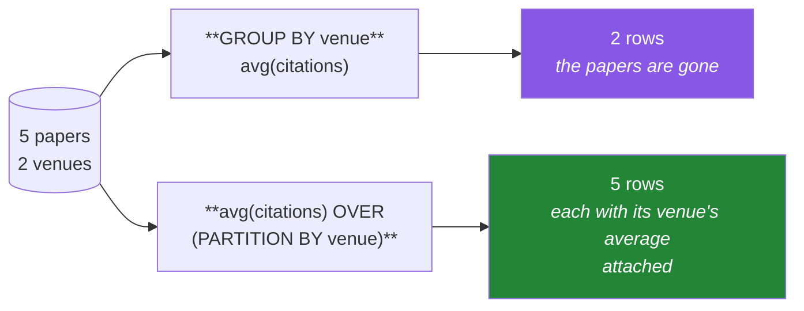

# Day 46 — Subqueries, CTEs, and window functions

**Phase 6 · Module 6** · ID: **DB-06** (subqueries, CTEs, window functions)

> **Yesterday:** joins, and the two ways rows silently disappear or multiply.
> **Today:** the three tools that turn SQL from "filter and aggregate" into something that can answer
> *"rank papers within their venue"* in one pass. Window functions are the payoff — and the same
> operation is Day 31's `transform` and Day 33's `causal_rolling`.
> **Tomorrow:** parameterised queries and SQLAlchemy Core.

```bash
./m start 46 && ./m scaffold 46
```

**Time:** 2 hours. **Request budget:** 0 model calls.

---

## §1 The story

`GROUP BY` collapses. Five papers in a venue become one row with an average, and the five original
rows are gone. That is right for a report and wrong for a feature, because a feature needs one value
*per row*.

**A window function computes an aggregate without collapsing anything.**



That is Day 31's table, exactly: `agg` collapses, `transform` broadcasts back. SQL spells the second
one `OVER (PARTITION BY ...)`.

Once you have that, a whole class of question becomes one query:

- *rank papers within each venue* — `rank() OVER (PARTITION BY venue ORDER BY citations DESC)`
- *each paper's citations minus its venue's mean* — one expression, no self-join
- *a running total by year* — `sum(...) OVER (ORDER BY year)`
- *the previous year's value on the same row* — `lag(citations) OVER (ORDER BY year)`

And **CTEs** (`WITH ... AS`) are how you keep that readable: name each step, then use it. A five-level
nested subquery and a five-step CTE compute the same thing; only one of them can be read by the person
who inherits it.

**The leakage warning, and it is the important part of today.** A window function is the easiest way
to build a feature that has seen the future:

> `avg(citations) OVER (PARTITION BY venue)` computed over your whole table includes the test rows.
> `sum(...) OVER (ORDER BY year)` with the default frame includes the **current** row.

Day 33 taught the same rule for `rolling`. Today it has a `ROWS BETWEEN` clause attached, and you
will write the safe form explicitly rather than accepting a default.

---

## §2 Setup — run this

```bash
mkdir -p days/day-46/lab
touch days/day-46/lab/windows.py
```

`src/setu/db.py` grows today. No new packages.

---

## §3 DB-06 — subqueries, then CTEs, then windows

`days/day-46/lab/windows.py`:

```python
"""DB-06: subqueries, CTEs, window functions - and the frame clause that stops a leak."""

from __future__ import annotations

import pandas as pd

from setu.db import query, query_frame, wake


def show(label: str, sql: str, params=None, limit: int = 5) -> None:
    rows = query(sql, params)
    print(f"\n-- {label}")
    for row in rows[:limit]:
        print(f"  {row}")


def subquery_kinds() -> None:
    show(
        "scalar subquery: one value, usable anywhere",
        """
        SELECT title, citations,
               (SELECT avg(citations) FROM papers)::int AS overall_mean
        FROM papers ORDER BY citations DESC
        """,
    )
    show(
        "IN: a set of values",
        "SELECT title FROM papers WHERE venue_id IN (SELECT venue_id FROM venues WHERE kind = %s)",
        ("conference",),
    )
    show(
        "EXISTS: correlated, and cannot fan out (Day 45)",
        """
        SELECT p.title FROM papers p
        WHERE EXISTS (SELECT 1 FROM paper_authors pa WHERE pa.paper_id = p.paper_id)
        """,
    )
    show(
        "derived table: a subquery in FROM, must be aliased",
        """
        SELECT venue_id, n FROM (
            SELECT venue_id, count(*) AS n FROM papers GROUP BY venue_id
        ) AS counts
        WHERE n >= 2
        """,
    )


def in_versus_not_in_and_null() -> None:
    inside = query(
        "SELECT count(*) AS n FROM papers WHERE venue_id IN (SELECT venue_id FROM papers)"
    )[0]["n"]
    outside = query(
        "SELECT count(*) AS n FROM papers WHERE venue_id NOT IN (SELECT venue_id FROM papers)"
    )[0]["n"]
    safe = query(
        """
        SELECT count(*) AS n FROM papers p
        WHERE NOT EXISTS (SELECT 1 FROM papers q WHERE q.venue_id = p.venue_id AND q.paper_id <> p.paper_id)
        """
    )[0]["n"]
    print(f"\n  IN     -> {inside}")
    print(f"  NOT IN -> {outside}   <- ZERO, and that is almost certainly wrong")
    print(f"  NOT EXISTS -> {safe}")
    print("\n  NOT IN against a list containing NULL returns NOTHING, ever.")
    print("  `x NOT IN (1, NULL)` is `x<>1 AND x<>NULL` -> unknown -> not true (Day 43).")
    print("  Rule: NEVER use NOT IN with a subquery. Use NOT EXISTS.")


def ctes_are_named_steps() -> None:
    nested = query(
        """
        SELECT venue_id, n FROM (
            SELECT venue_id, count(*) AS n FROM (
                SELECT * FROM papers WHERE citations > 0
            ) AS active GROUP BY venue_id
        ) AS counts WHERE n >= 2 ORDER BY venue_id
        """
    )
    readable = query(
        """
        WITH active AS (
            SELECT * FROM papers WHERE citations > 0
        ),
        counts AS (
            SELECT venue_id, count(*) AS n FROM active GROUP BY venue_id
        )
        SELECT venue_id, n FROM counts WHERE n >= 2 ORDER BY venue_id
        """
    )
    print(f"\n  nested: {nested}")
    print(f"  CTE:    {readable}")
    print("  Same plan, same result. One reads top-to-bottom; the other inside-out.")
    print("\n  A CTE can be referenced MORE THAN ONCE, which a derived table cannot.")
    print("  In modern Postgres a CTE is inlined by default; add MATERIALIZED to force")
    print("  it to be computed once when you reference it several times.")


def window_versus_group_by() -> None:
    grouped = query("SELECT venue_id, avg(citations)::int AS mean FROM papers GROUP BY venue_id")
    windowed = query(
        """
        SELECT paper_id, venue_id, citations,
               avg(citations) OVER (PARTITION BY venue_id)::int AS venue_mean
        FROM papers ORDER BY venue_id, paper_id
        """
    )
    print(f"\n  GROUP BY -> {len(grouped)} rows (collapsed)")
    print(f"  OVER     -> {len(windowed)} rows (every paper kept)")
    for row in windowed[:4]:
        print(f"    {row}")
    print("\n  This IS Day 31's agg-vs-transform, in SQL.")


def ranking() -> None:
    show(
        "rank / dense_rank / row_number within a venue",
        """
        SELECT venue_id, title, citations,
               row_number() OVER w AS rn,
               rank()       OVER w AS rnk,
               dense_rank() OVER w AS dense
        FROM papers
        WINDOW w AS (PARTITION BY venue_id ORDER BY citations DESC)
        ORDER BY venue_id, rn
        """,
        limit=8,
    )
    print("  row_number : 1,2,3,4  - always distinct, ties broken arbitrarily")
    print("  rank       : 1,2,2,4  - ties share, then a GAP")
    print("  dense_rank : 1,2,2,3  - ties share, no gap")
    print("\n  A named WINDOW clause avoids repeating the OVER spec three times.")
    print("  row_number with an ambiguous ORDER BY is NON-DETERMINISTIC: add a tiebreak.")


def top_n_per_group() -> None:
    show(
        "the most-cited paper in each venue",
        """
        WITH ranked AS (
            SELECT paper_id, venue_id, title, citations,
                   row_number() OVER (PARTITION BY venue_id
                                      ORDER BY citations DESC, paper_id) AS rn
            FROM papers
        )
        SELECT venue_id, title, citations FROM ranked WHERE rn = 1 ORDER BY venue_id
        """,
    )
    print("  Top-N-per-group is THE canonical window-function problem.")
    print("  `, paper_id` in the ORDER BY makes it deterministic (Day 31's rule).")


def lag_lead_and_running_totals() -> None:
    show(
        "year-on-year change, and a running total",
        """
        WITH by_year AS (
            SELECT year, sum(citations) AS total FROM papers GROUP BY year
        )
        SELECT year, total,
               lag(total)  OVER (ORDER BY year) AS prev,
               total - lag(total) OVER (ORDER BY year) AS delta,
               sum(total)  OVER (ORDER BY year
                                 ROWS BETWEEN UNBOUNDED PRECEDING AND CURRENT ROW) AS running
        FROM by_year ORDER BY year
        """,
        limit=8,
    )
    print("  lag(x) is the previous row's value; lead(x) the next. NULL at the edges,")
    print("  which is correct - there is nothing before the first row (Day 33's .shift).")


def the_frame_clause_and_the_leak() -> None:
    rows = query(
        """
        WITH by_year AS (
            SELECT year, sum(citations)::float AS total FROM papers GROUP BY year
        )
        SELECT year, total,
               avg(total) OVER (ORDER BY year
                    ROWS BETWEEN 2 PRECEDING AND CURRENT ROW)::int AS includes_now,
               avg(total) OVER (ORDER BY year
                    ROWS BETWEEN 3 PRECEDING AND 1 PRECEDING)::int AS strictly_past
        FROM by_year ORDER BY year
        """
    )
    for row in rows:
        print(f"  {row}")
    print("\n  includes_now  : the window contains the CURRENT row -> LEAKAGE as a feature")
    print("  strictly_past : ends at 1 PRECEDING -> safe (Day 33's rolling().shift(1))")
    print("\n  The DEFAULT frame when you write ORDER BY with no ROWS clause is")
    print("  RANGE BETWEEN UNBOUNDED PRECEDING AND CURRENT ROW - it includes the")
    print("  current row AND every peer with an equal ORDER BY value. Always be explicit.")


def partition_leaks_across_a_split() -> None:
    print("\n-- the other leak, and it is quieter --")
    print("  avg(citations) OVER (PARTITION BY venue_id)")
    print("  computed over the WHOLE table includes the test rows in the average")
    print("  that becomes a training feature. Same shape as Day 31's warning.")
    print("  Fix: compute the statistic on TRAIN only, then join it on (Day 81).")


def sql_and_pandas_agree() -> None:
    sql = query_frame(
        """
        SELECT paper_id, venue_id,
               row_number() OVER (PARTITION BY venue_id
                                  ORDER BY citations DESC, paper_id) AS rn
        FROM papers WHERE venue_id IS NOT NULL ORDER BY venue_id, rn
        """
    )
    frame = query_frame("SELECT paper_id, venue_id, citations FROM papers WHERE venue_id IS NOT NULL")
    manual = (
        frame.sort_values(["venue_id", "citations", "paper_id"], ascending=[True, False, True])
        .assign(rn=lambda d: d.groupby("venue_id").cumcount() + 1)
        .loc[:, ["paper_id", "venue_id", "rn"]]
        .sort_values(["venue_id", "rn"])
    )
    pd.testing.assert_frame_equal(
        sql.reset_index(drop=True), manual.reset_index(drop=True), check_dtype=False
    )
    print("\n  row_number() OVER (PARTITION BY ...) == groupby().cumcount() + 1")


if __name__ == "__main__":
    wake()
    subquery_kinds()
    in_versus_not_in_and_null()
    ctes_are_named_steps()
    window_versus_group_by()
    ranking()
    top_n_per_group()
    lag_lead_and_running_totals()
    the_frame_clause_and_the_leak()
    partition_leaks_across_a_split()
    sql_and_pandas_agree()
```

**Line by line:**

- **Scalar subquery** — returns exactly one value and can appear anywhere a value can. If it returns
  more than one row, Postgres raises.
- **Derived table** — a subquery in `FROM`. Postgres **requires an alias** (`AS counts`), which is a
  small mercy: it forces you to name the intermediate.
- `NOT IN` against a subquery that can contain `NULL` returns **nothing, ever**. `x NOT IN (1, NULL)`
  expands to `x <> 1 AND x <> NULL`, and the second conjunct is *unknown*, so the whole thing is never
  true (Day 43's three-valued logic, in its most expensive form). **The rule is simple: never use
  `NOT IN` with a subquery. Use `NOT EXISTS`,** which handles NULLs correctly and usually plans better.
- **CTE versus nested subquery** — the same plan and the same answer. The CTE reads top to bottom; the
  nested version reads inside out. A CTE can also be referenced more than once, which a derived table
  cannot. In modern Postgres a CTE is **inlined** by default (it used to be an optimisation fence);
  `MATERIALIZED` forces single evaluation when you reference it several times or when inlining would
  repeat expensive work.
- `avg(...) OVER (PARTITION BY venue_id)` — **the whole idea.** Same aggregate, no collapse. Compare
  the row counts printed.
- `row_number` / `rank` / `dense_rank` — `1,2,3,4` / `1,2,2,4` / `1,2,2,3`. Pick by what you mean about
  ties. **`row_number` with an ambiguous `ORDER BY` is non-deterministic**: add a tiebreaking column
  or two runs disagree (Day 31's rule, third appearance).
- `WINDOW w AS (...)` — a named window, so the spec is written once. Underused and worth the habit.
- **Top-N-per-group** — rank in a CTE, filter on the rank. This is the canonical window-function
  problem and the answer to a large fraction of real analytical questions.
- `lag` / `lead` — the previous and next row's value, `NULL` at the edges. Day 33's `.shift()`.
- `the_frame_clause_and_the_leak` — **the most important function today.** Two moving averages side by
  side: one ending at `CURRENT ROW`, one ending at `1 PRECEDING`. As a model feature the first has
  seen the present, the second has not. And note the default: `ORDER BY` with no `ROWS` clause gives
  you `RANGE BETWEEN UNBOUNDED PRECEDING AND CURRENT ROW`, which includes the current row *and every
  peer with an equal ordering value*. **Be explicit, always.**
- `partition_leaks_across_a_split` — the quieter leak. A partition-wide average computed over the full
  table bakes the test rows into a training feature. Day 81's cross-fitted encoder is the proper fix.

---

## §4 Build brief

Extend `src/setu/db.py`:

```python
WINDOW_FUNCTIONS = {"row_number", "rank", "dense_rank", "avg", "sum", "min", "max", "count"}


def rank_within(
    table: str, *, partition_by: str, order_by: str, tiebreak: str,
    method: str = "row_number", descending: bool = True,
) -> list[dict]:
    """TODO(me): rank rows within groups, deterministically.

    - `tiebreak` is REQUIRED, not optional: without it row_number is non-deterministic
    - method must be in WINDOW_FUNCTIONS's ranking subset; else DataError
    - identifiers allowlisted and quoted (Day 43)
    """
    raise NotImplementedError


def top_per_group(table: str, *, partition_by: str, order_by: str, tiebreak: str, n: int = 1):
    """TODO(me): the canonical top-N-per-group query, built on rank_within.

    Raise DataError if n < 1. Must be a CTE + filter, not a correlated subquery
    (which re-scans the table once per group).
    """
    raise NotImplementedError


def causal_window(
    table: str, *, value: str, order_by: str, window: int,
    partition_by: str | None = None, stat: str = "avg",
) -> list[dict]:
    """TODO(me): a LEAK-FREE moving statistic - the SQL twin of Day 33's causal_rolling.

    - the frame MUST end at `1 PRECEDING`: the current row may never contribute
    - emit an explicit ROWS BETWEEN clause; never rely on the default frame
    - the first `window` rows of each partition are NULL - correct, not a gap to fill
    - as on Day 33, this function offers NO way to include the current row
    - raise DataError if window < 1, or if stat is not in WINDOW_FUNCTIONS
    """
    raise NotImplementedError


def assert_no_current_row_in_frame(sql: str) -> None:
    """TODO(me): raise DataError if a window in `sql` can see the current row.

    Flag: an OVER (...) containing ORDER BY but NO explicit ROWS/RANGE clause
    (the default includes the current row), or a frame ending in CURRENT ROW /
    FOLLOWING / UNBOUNDED FOLLOWING.
    The message must name the offending fragment and state the safe form.
    Day 81 and Day 227 call this on every feature query.
    """
    raise NotImplementedError
```

- `tiebreak` being a **required** parameter rather than an option is the design decision. Day 31 and
  Day 45 both hit non-determinism; making it impossible to omit ends the class of bug.
- `assert_no_current_row_in_frame` is Day 33's `causal_rolling` guarantee extended to arbitrary SQL —
  which matters because on Day 227 a feature query will be written by hand, not through a helper.

---

## §5 The eval that must be able to fail

Add to `tests/test_db.py`:

```python
# ---- offline: window semantics on SQLite (3.25+ supports window functions) --------

@pytest.fixture
def windowed(sqlite_db):
    sqlite_db.executescript(
        """
        INSERT INTO venues VALUES ('v2', 'ICML');
        INSERT INTO papers VALUES ('p2', 'B', 2018, 'v1');
        INSERT INTO papers VALUES ('p3', 'C', 2020, 'v2');
        INSERT INTO papers VALUES ('p4', 'D', 2020, 'v2');
        """
    )
    sqlite_db.executescript("ALTER TABLE papers ADD COLUMN citations INTEGER DEFAULT 0;")
    sqlite_db.executescript(
        """
        UPDATE papers SET citations = 100 WHERE paper_id = 'p1';
        UPDATE papers SET citations = 100 WHERE paper_id = 'p2';
        UPDATE papers SET citations =  50 WHERE paper_id = 'p3';
        UPDATE papers SET citations =  10 WHERE paper_id = 'p4';
        """
    )
    return sqlite_db


def test_window_does_not_collapse_rows(windowed):
    grouped = windowed.execute(
        "SELECT count(*) FROM (SELECT venue_id FROM papers GROUP BY venue_id)"
    ).fetchone()[0]
    total = windowed.execute("SELECT count(*) FROM papers").fetchone()[0]
    over = windowed.execute(
        "SELECT count(*) FROM (SELECT avg(citations) OVER (PARTITION BY venue_id) FROM papers)"
    ).fetchone()[0]
    assert grouped < total and over == total


def test_rank_variants_differ_on_ties(windowed):
    rows = windowed.execute(
        """
        SELECT rank() OVER (ORDER BY citations DESC),
               dense_rank() OVER (ORDER BY citations DESC),
               row_number() OVER (ORDER BY citations DESC, paper_id)
        FROM papers ORDER BY citations DESC, paper_id
        """
    ).fetchall()
    ranks = [r[0] for r in rows]
    dense = [r[1] for r in rows]
    numbers = [r[2] for r in rows]
    assert ranks == [1, 1, 3, 4], "rank must share ties and then GAP"
    assert dense == [1, 1, 2, 3], "dense_rank must share ties with no gap"
    assert numbers == [1, 2, 3, 4], "row_number must always be distinct"


def test_row_number_needs_a_tiebreak_to_be_deterministic(windowed):
    """Two papers share 100 citations; without a tiebreak the order is undefined."""
    with_break = [
        windowed.execute(
            "SELECT paper_id FROM papers ORDER BY citations DESC, paper_id"
        ).fetchall()
        for _ in range(2)
    ]
    assert with_break[0] == with_break[1], "a tiebreak must make the order stable"


def test_not_in_with_a_null_returns_nothing(windowed):
    windowed.execute("INSERT INTO papers VALUES ('p9', 'E', 2021, NULL, 1)")
    wrong = windowed.execute(
        "SELECT count(*) FROM papers WHERE venue_id NOT IN (SELECT venue_id FROM papers)"
    ).fetchone()[0]
    right = windowed.execute(
        "SELECT count(*) FROM papers p WHERE NOT EXISTS "
        "(SELECT 1 FROM papers q WHERE q.venue_id = p.venue_id AND q.paper_id <> p.paper_id)"
    ).fetchone()[0]
    assert wrong == 0, "NOT IN against a NULL-containing subquery must return nothing"
    assert right >= 1, "NOT EXISTS handles NULLs correctly"


def test_causal_frame_excludes_the_current_row(windowed):
    rows = windowed.execute(
        """
        SELECT paper_id,
               avg(citations) OVER (ORDER BY paper_id
                    ROWS BETWEEN 2 PRECEDING AND 1 PRECEDING) AS past_only
        FROM papers ORDER BY paper_id
        """
    ).fetchall()
    assert rows[0][1] is None, "the first row has no history - it must be NULL, not its own value"


def test_default_frame_includes_the_current_row(windowed):
    rows = windowed.execute(
        "SELECT paper_id, avg(citations) OVER (ORDER BY paper_id) FROM papers ORDER BY paper_id"
    ).fetchall()
    assert rows[0][1] is not None, "the default frame includes the current row - this is the leak"


# ---- offline: the guards ----------------------------------------------------------

def test_assert_no_current_row_flags_the_default_frame():
    from setu.db import assert_no_current_row_in_frame

    with pytest.raises(DataError) as info:
        assert_no_current_row_in_frame("SELECT avg(x) OVER (ORDER BY y) FROM t")
    assert "1 PRECEDING" in str(info.value) or "preceding" in str(info.value).lower()


@pytest.mark.parametrize(
    "frame",
    [
        "ROWS BETWEEN 2 PRECEDING AND CURRENT ROW",
        "ROWS BETWEEN UNBOUNDED PRECEDING AND CURRENT ROW",
        "ROWS BETWEEN 1 PRECEDING AND 1 FOLLOWING",
        "ROWS BETWEEN CURRENT ROW AND UNBOUNDED FOLLOWING",
    ],
)
def test_assert_no_current_row_flags_unsafe_frames(frame):
    from setu.db import assert_no_current_row_in_frame

    with pytest.raises(DataError):
        assert_no_current_row_in_frame(f"SELECT avg(x) OVER (ORDER BY y {frame}) FROM t")


def test_assert_no_current_row_allows_a_safe_frame():
    from setu.db import assert_no_current_row_in_frame

    assert_no_current_row_in_frame(
        "SELECT avg(x) OVER (ORDER BY y ROWS BETWEEN 3 PRECEDING AND 1 PRECEDING) FROM t"
    )


def test_assert_no_current_row_allows_a_query_with_no_window():
    from setu.db import assert_no_current_row_in_frame

    assert_no_current_row_in_frame("SELECT sum(x) FROM t GROUP BY y")


def test_rank_within_requires_a_tiebreak():
    import inspect

    from setu.db import rank_within

    params = inspect.signature(rank_within).parameters
    assert params["tiebreak"].default is inspect.Parameter.empty, (
        "tiebreak must be required - an optional one will be omitted"
    )


def test_causal_window_has_no_include_current_option():
    import inspect

    from setu.db import causal_window

    names = set(inspect.signature(causal_window).parameters)
    assert not names & {"include_current", "center", "closed"}, (
        "the leaky form must not be expressible"
    )


# ---- live ---------------------------------------------------------------------------

@pytest.mark.live
def test_top_per_group_is_deterministic():
    from setu.db import top_per_group

    a = top_per_group("papers", partition_by="venue_id", order_by="citations", tiebreak="paper_id")
    b = top_per_group("papers", partition_by="venue_id", order_by="citations", tiebreak="paper_id")
    assert a == b


@pytest.mark.live
def test_causal_window_first_rows_are_null():
    from setu.db import causal_window

    rows = causal_window("papers", value="citations", order_by="paper_id", window=2)
    assert rows[0]["value"] is None, "the first row has no history"


@pytest.mark.live
def test_window_matches_pandas_cumcount():
    import pandas as pd

    from setu.db import query_frame

    sql = query_frame(
        "SELECT paper_id, venue_id, row_number() OVER "
        "(PARTITION BY venue_id ORDER BY citations DESC, paper_id) AS rn "
        "FROM papers WHERE venue_id IS NOT NULL ORDER BY venue_id, rn"
    )
    frame = query_frame(
        "SELECT paper_id, venue_id, citations FROM papers WHERE venue_id IS NOT NULL"
    )
    manual = (
        frame.sort_values(["venue_id", "citations", "paper_id"], ascending=[True, False, True])
        .assign(rn=lambda d: d.groupby("venue_id").cumcount() + 1)
        .loc[:, ["paper_id", "venue_id", "rn"]]
        .sort_values(["venue_id", "rn"])
    )
    pd.testing.assert_frame_equal(
        sql.reset_index(drop=True), manual.reset_index(drop=True), check_dtype=False
    )
```

**Line by line:**

- `test_rank_variants_differ_on_ties` — asserts all three sequences exactly: `[1,1,3,4]`, `[1,1,2,3]`,
  `[1,2,3,4]`. Confusing `rank` with `dense_rank` gives a plausible-looking wrong answer, and this
  pins the difference.
- `test_not_in_with_a_null_returns_nothing` — **asserts the wrong answer is zero.** That is an unusual
  shape for a test and it is deliberate: it documents the trap executably, and it will start failing
  the day a database changes this behaviour, which is exactly when you want to know.
- `test_causal_frame_excludes_the_current_row` and `test_default_frame_includes_the_current_row` —
  **the pair is the day's real assessment.** The first row is `NULL` under the safe frame and non-null
  under the default. That difference is one clause and an entire class of leaked feature.
- `test_assert_no_current_row_flags_unsafe_frames` — four parametrised frames, including one that
  looks safe (`2 PRECEDING AND CURRENT ROW`) and one that peeks forward. Plus two counter-tests: a
  safe frame and a query with no window at all must both pass, so the guard is not simply "raise
  always".
- `test_rank_within_requires_a_tiebreak` and `test_causal_window_has_no_include_current_option` —
  **API-shape tests** using `inspect.signature`, the same technique as Day 33. They assert design
  decisions: the non-deterministic form cannot be reached by omission, and the leaky form cannot be
  reached at all.

```bash
uv run python -m pytest tests/test_db.py -v
SETU_LIVE=1 uv run python -m pytest tests/test_db.py -m live -v
```

---

## §6 Request budget

| Resource | Spent today |
|---|---|
| LLM calls | **0** |
| Postgres | a few dozen small queries |

---

## §7 Traps

- **`NOT IN` with a subquery.** One NULL and it returns nothing, silently. Use `NOT EXISTS`.
- **`GROUP BY` when you needed a window.** Collapses the rows you wanted to keep.
- **`row_number()` without a tiebreak.** Non-deterministic; two runs disagree.
- **Confusing `rank` and `dense_rank`.** Ties gap or they do not; know which you mean.
- **Relying on the default window frame.** It includes the current row *and its peers*.
- **A frame ending at `CURRENT ROW` in a feature.** Leakage.
- **`PARTITION BY` statistics computed over train and test together.** The quieter leak.
- **Deeply nested subqueries.** Same plan as a CTE, far worse to read.
- **Assuming a CTE is materialised.** Modern Postgres inlines by default; say `MATERIALIZED` if you
  need it computed once.
- **A correlated subquery for top-N-per-group.** Re-scans per group; use a ranked CTE.
- **Forgetting to alias a derived table.** Postgres refuses, at least.

---

## §8 Verify before you code

Written **2026-08-21**:

- <https://www.postgresql.org/docs/current/tutorial-window.html> — the concept.
- <https://www.postgresql.org/docs/current/sql-expressions.html#SYNTAX-WINDOW-FUNCTIONS> — the frame
  clause and **the default frame**. Read this one carefully.
- <https://www.postgresql.org/docs/current/queries-with.html> — CTEs, `MATERIALIZED`, recursion.
- <https://www.postgresql.org/docs/current/functions-subquery.html> — `NOT IN` versus `NOT EXISTS`.

---

## §9 Say it in an interview

> "Window functions are the aggregate that doesn't collapse — same numbers as a `GROUP BY`, but
> attached to every original row, which is exactly what you need for a feature rather than a report.
> It's the SQL spelling of pandas' `transform`. Two things I'm careful about. `NOT IN` against a
> subquery that can contain NULL returns nothing at all, silently, because of three-valued logic — so
> `NOT EXISTS`, always. And the default window frame includes the current row, which makes a moving
> average a leaked feature; my helper emits an explicit `ROWS BETWEEN n PRECEDING AND 1 PRECEDING` and
> offers no way to include the present, plus there's a check that scans a query for windows that can
> see the current row. Same rule I enforce on pandas' `rolling`, just with a frame clause attached."

---

## §10 Done when

Tick [`CHECKLIST.md`](CHECKLIST.md), then `./m check && ./m done 46`.
