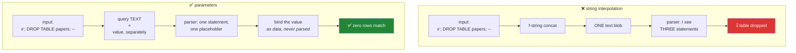

# Day 47 — Parameterised queries, and SQLAlchemy Core

**Phase 6 · Module 6** · ID: **DB-07** (Python ↔ Postgres, parameterisation, SQLAlchemy Core)

> **Yesterday:** window functions, and the frame clause that keeps a feature causal.
> **Today:** the demo you run once and never forget — an f-string in a query, and a table gone. Then
> SQLAlchemy Core, which composes SQL as objects so the mistake becomes hard to make.
> **Tomorrow:** MongoDB, and documents.

```bash
./m start 47 && ./m scaffold 47
```

**Time:** 110 minutes. **Request budget:** 0 model calls · a few local SQLite round trips.

---

## §1 The story

Every query so far has passed values as parameters, and Day 42's test greps the package for
f-string SQL. Today you find out why, by building the thing the test forbids.

The mechanism is simple and it is worth stating precisely. When you write:

```python
cur.execute(f"SELECT * FROM papers WHERE title = '{user_input}'")
```

you are **building a program by concatenating strings**, and one of those strings came from outside.
The database receives one blob of text and parses it into a program. It cannot tell which characters
you meant as *code* and which you meant as *data* — that distinction was destroyed when you joined
them.



**Parameters are not escaping.** The value never goes through the SQL parser at all — the query is
parsed first, then the value is bound to a slot in the already-compiled plan. There is no quoting to
get wrong, no character set edge case, no clever escape sequence. It is a different mechanism, and it
is why "I escape my inputs" is a worse answer than "I parameterise".

Two consequences beyond safety, both practical:

- **Speed.** The database can cache the plan for a parameterised query and reuse it. A thousand
  distinct interpolated strings are a thousand distinct plans.
- **Types.** `%(year)s` with an `int` binds an integer. Interpolation gives the database `'2017'` and
  hopes.

Then the second half: **identifiers cannot be parameterised.** You can bind a *value*, never a table
or column name — `SELECT * FROM %(table)s` is not valid SQL. So when a table name genuinely must be
dynamic, the only safe route is an **allowlist**: check it against a known set, then quote it. Day 43
introduced this; today it becomes a tested function.

---

## §2 Setup — run this

```bash
mkdir -p days/day-47/lab
touch days/day-47/lab/injection.py
```

`src/setu/db.py` and `tests/test_db.py` grow today. SQLAlchemy came in on Day 42; `sqlite3` is
standard library and is what today's demo uses — **the injection demo runs against a throwaway local
file, never your Supabase project.**

---

## §3 DB-07 — the demo, then the fix

`days/day-47/lab/injection.py`:

```python
"""DB-07: injection, parameterisation, and identifiers. SQLite only - never a real database."""

from __future__ import annotations

import sqlite3
import time
from pathlib import Path


def fixture() -> sqlite3.Connection:
    conn = sqlite3.connect(":memory:")
    conn.execute("CREATE TABLE papers (paper_id TEXT PRIMARY KEY, title TEXT, year INT)")
    conn.executemany(
        "INSERT INTO papers VALUES (?, ?, ?)",
        [("p1", "Attention", 2017), ("p2", "BERT", 2018), ("p3", "GPT-3", 2020)],
    )
    conn.commit()
    return conn


def the_ordinary_case() -> None:
    conn = fixture()
    user_input = "BERT"

    interpolated = f"SELECT * FROM papers WHERE title = '{user_input}'"
    print(f"\n  built query: {interpolated}")
    print(f"  result: {conn.execute(interpolated).fetchall()}")
    print("  ^ works perfectly. This is why the bug survives code review.")
    conn.close()


def the_attack() -> None:
    conn = fixture()
    user_input = "x' OR '1'='1"

    interpolated = f"SELECT * FROM papers WHERE title = '{user_input}'"
    print(f"\n  built query: {interpolated}")
    rows = conn.execute(interpolated).fetchall()
    print(f"  rows returned: {len(rows)}   <- ALL of them. The WHERE clause was neutralised.")
    print("  Read the built query: OR '1'='1' is now part of the PROGRAM, not the data.")
    conn.close()


def the_destructive_one() -> None:
    conn = fixture()
    user_input = "x'; DROP TABLE papers; --"

    interpolated = f"SELECT * FROM papers WHERE title = '{user_input}'"
    print(f"\n  built query: {interpolated}")
    try:
        conn.executescript(interpolated)
    except sqlite3.Error as exc:
        print(f"  {exc}")

    remaining = conn.execute(
        "SELECT count(*) FROM sqlite_master WHERE type='table' AND name='papers'"
    ).fetchone()[0]
    print(f"\n  tables named 'papers' remaining: {remaining}")
    print("  ^ zero. The `--` comments out the rest of your query so it still parses.")
    print("  Note this needed executescript (multi-statement). Day 42's query() BANS that;")
    print("  the one-statement rule is a second layer of defence, not the primary one.")
    conn.close()


def parameters_are_not_escaping() -> None:
    conn = fixture()

    for hostile in ("x' OR '1'='1", "x'; DROP TABLE papers; --", "O'Brien"):
        rows = conn.execute("SELECT * FROM papers WHERE title = ?", (hostile,)).fetchall()
        print(f"\n  input {hostile!r:32} -> {len(rows)} rows")

    still_there = conn.execute("SELECT count(*) FROM papers").fetchone()[0]
    print(f"\n  papers table still has {still_there} rows")
    print("  Note O'Brien: an apostrophe in ordinary data. Escaping has to get that right;")
    print("  parameterisation never sees it as syntax in the first place.")
    conn.close()


def placeholder_styles() -> None:
    conn = fixture()

    print(f"\n  sqlite3 qmark : {conn.execute('SELECT title FROM papers WHERE year > ?', (2017,)).fetchall()=}")
    print(f"  sqlite3 named : {conn.execute('SELECT title FROM papers WHERE year > :y', {'y': 2017}).fetchall()=}")
    print("\n  psycopg3 uses %s and %(name)s. SQLAlchemy uses :name.")
    print("  ALWAYS prefer NAMED placeholders: positional ones break silently when")
    print("  someone inserts a condition in the middle and the order shifts.")
    conn.close()


def identifiers_cannot_be_parameterised() -> None:
    conn = fixture()

    try:
        conn.execute("SELECT * FROM ?", ("papers",))
    except sqlite3.OperationalError as exc:
        print(f"\n  SELECT * FROM ? -> {exc}")
        print("  ^ a placeholder is a VALUE slot. A table name is part of the grammar.")

    allowed = {"papers", "authors", "claims"}
    requested = "papers"
    if requested not in allowed:
        raise ValueError(f"unknown table: {requested}")
    print(f'  allowlisted: SELECT count(*) FROM "{requested}" -> '
          f'{conn.execute(f"SELECT count(*) FROM \\"{requested}\\"").fetchone()[0]}')
    print("  Allowlist FIRST, then quote. Quoting alone is not enough:")
    print('  a name containing a quote character can still break out.')
    conn.close()


def plan_caching(tmp: Path) -> None:
    conn = sqlite3.connect(tmp / "bench.db")
    conn.execute("CREATE TABLE t (id INT PRIMARY KEY, v INT)")
    conn.executemany("INSERT INTO t VALUES (?, ?)", [(i, i * 2) for i in range(20_000)])
    conn.commit()

    start = time.perf_counter()
    for i in range(2000):
        conn.execute(f"SELECT v FROM t WHERE id = {i}").fetchone()
    interpolated = time.perf_counter() - start

    start = time.perf_counter()
    for i in range(2000):
        conn.execute("SELECT v FROM t WHERE id = ?", (i,)).fetchone()
    parameterised = time.perf_counter() - start

    print(f"\n  2000 lookups")
    print(f"    interpolated  : {interpolated:.3f}s  (2000 distinct query strings to parse)")
    print(f"    parameterised : {parameterised:.3f}s  (one plan, reused)")
    print(f"    ~{interpolated / parameterised:.1f}x")
    print("  Safety is the reason. Speed is a bonus you get for free.")
    conn.close()


if __name__ == "__main__":
    import tempfile

    the_ordinary_case()
    the_attack()
    the_destructive_one()
    parameters_are_not_escaping()
    placeholder_styles()
    identifiers_cannot_be_parameterised()
    plan_caching(Path(tempfile.mkdtemp()))
```

**Line by line:**

- `the_ordinary_case` — **run this first.** The interpolated query works, returns the right row, and
  would pass any review that only checked the output. That is precisely why the bug survives: it is
  correct for every input except the ones you did not think of.
- `"x' OR '1'='1"` — the closing quote ends your string literal, and `OR '1'='1'` becomes part of the
  **program**. Every row now matches. **Read the printed query**; the injected fragment is visibly
  syntax, not data.
- `"x'; DROP TABLE papers; --"` — the `;` starts a second statement and the `--` comments out the
  trailing quote so the whole thing still parses. Note it needed `executescript`: Day 42's `query()`
  rejects multi-statement SQL, which is a genuine second layer — but **defence in depth is not a
  substitute for the first layer.** A single-statement injection (`OR '1'='1'`) walks straight past it.
- `"O'Brien"` — an apostrophe in perfectly ordinary data. Any escaping scheme has to handle it
  correctly, in every encoding, forever. Parameterisation never treats it as syntax, so there is
  nothing to get right.
- `?` versus `:name` — **prefer named placeholders.** With positional ones, inserting a condition in
  the middle of a query shifts every subsequent index, and the failure is silent when the types happen
  to line up.
- `SELECT * FROM ?` raises — a placeholder occupies a **value** slot in the grammar. A table name is
  part of the grammar itself, so it can never be bound. The allowlist is the only safe answer, and
  **quoting alone is not enough**: a name containing a quote character escapes the quotes.
- `plan_caching` — **run it and read the ratio.** Two thousand distinct query strings are two thousand
  parses; one parameterised query is one plan reused. Safety first, speed free.

---

## §4 SQLAlchemy Core

Add to the same file:

```python
def sqlalchemy_core_basics() -> None:
    import sqlalchemy as sa

    engine = sa.create_engine("sqlite:///:memory:")
    metadata = sa.MetaData()

    papers = sa.Table(
        "papers", metadata,
        sa.Column("paper_id", sa.Text, primary_key=True),
        sa.Column("title", sa.Text, nullable=False),
        sa.Column("year", sa.Integer, nullable=False),
    )
    metadata.create_all(engine)

    with engine.begin() as conn:
        conn.execute(
            sa.insert(papers),
            [
                {"paper_id": "p1", "title": "Attention", "year": 2017},
                {"paper_id": "p2", "title": "BERT", "year": 2018},
            ],
        )

    stmt = sa.select(papers.c.title).where(papers.c.year > 2017).order_by(papers.c.title)
    print(f"\n  compiled: {stmt}")
    with engine.connect() as conn:
        print(f"  result:   {[row.title for row in conn.execute(stmt)]}")

    print("\n  The WHERE value never appears in the compiled SQL - it is a bind parameter.")
    print("  Injection is not 'avoided' here; it is structurally unavailable.")


def core_is_not_the_orm() -> None:
    print("\n  SQLAlchemy Core : you build SQL as Python objects. Tables, columns, expressions.")
    print("  SQLAlchemy ORM  : you map classes to tables and manipulate objects; it emits SQL.")
    print("\n  This project uses CORE only. Reasons:")
    print("    - you are learning SQL; an ORM hides exactly what you came to learn")
    print("    - the queries here are analytical (windows, CTEs), which ORMs do awkwardly")
    print("    - one less layer between a query and its EXPLAIN plan")
    print("  The ORM is a good tool. It is the wrong tool for a data-science codebase.")


def composability_is_the_real_win() -> None:
    import sqlalchemy as sa

    metadata = sa.MetaData()
    papers = sa.Table(
        "papers", metadata,
        sa.Column("paper_id", sa.Text), sa.Column("title", sa.Text),
        sa.Column("year", sa.Integer), sa.Column("venue", sa.Text),
    )

    stmt = sa.select(papers)
    filters = {"year": 2018, "venue": "NeurIPS"}
    for column, value in filters.items():
        stmt = stmt.where(papers.c[column] == value)

    print(f"\n  {stmt}")
    print("\n  Building that as a string means tracking whether you need WHERE or AND,")
    print("  and whether to add a comma. Every dynamic-filter string builder has that bug.")
    print("  Here it is method chaining, and the column name came from a KNOWN Table object -")
    print("  papers.c['nope'] raises immediately rather than producing broken SQL.")
```

**Line by line:**

- `sa.create_engine(...)` — the engine holds the connection pool. Create it **once** per process, not
  per query (Day 42's pooling lesson, in SQLAlchemy form).
- `sa.Table(...)` with `sa.Column(...)` — the schema as Python objects. This is Core: you are
  describing tables, not mapping classes.
- `engine.begin()` versus `engine.connect()` — `begin()` opens a transaction and **commits on clean
  exit**; `connect()` does not commit. Using `connect()` for an insert and wondering where the data
  went is a rite of passage. Use `begin()` for writes.
- `sa.select(papers.c.title).where(papers.c.year > 2017)` — `papers.c.year > 2017` builds an
  *expression object*, not a string. **Print `stmt`** and note the value is a `:year_1` bind
  parameter, not the literal `2017`.
- `papers.c[column]` — a column name looked up on a known `Table`. An unknown name raises immediately,
  which is the allowlist from §3 arriving for free because the table definition *is* the allowlist.
- `composability_is_the_real_win` — the practical argument. Building a dynamic filter as a string means
  tracking `WHERE` versus `AND` and comma placement; every hand-rolled query builder has that bug.
  Method chaining does not.
- `core_is_not_the_orm` — **read the three reasons out loud.** This is a real decision. The ORM is
  good software; it hides the SQL you are here to learn, handles analytical queries awkwardly, and adds
  a layer between your code and its `EXPLAIN` plan.

---

## §5 Build brief

Extend `src/setu/db.py`:

```python
ALLOWED_TABLES = frozenset({"papers", "authors", "paper_authors", "claims"})


def quote_identifier(name: str, *, allowed: frozenset[str] = ALLOWED_TABLES) -> str:
    """TODO(me): allowlist-check an identifier, then return it double-quoted.

    - raise DataError if `name` is not in `allowed`; the message must list what IS allowed
    - the allowlist check comes FIRST; quoting is belt-and-braces, not the defence
    - reject any name containing a double quote outright, even if allowlisted
      (defence against a future caller widening the allowlist carelessly)
    """
    raise NotImplementedError


def assert_parameterised(sql: str) -> None:
    """TODO(me): raise DataError if `sql` looks like it embeds a literal where a
    parameter belongs.

    Flag: a quoted string literal or a bare number immediately after =, <, >, LIKE or IN(
    in a WHERE clause, when no placeholder appears in the statement at all.
    - must NOT flag legitimate literals: `WHERE deleted_at IS NULL`, `LIMIT 10`,
      `WHERE status = 'active'` in a migration file
    - so: only flag when the statement has ZERO placeholders AND has a WHERE with a literal
    - the message must show the fragment and the parameterised form
    """
    raise NotImplementedError


def build_select(
    table: str, *, columns: list[str] | None = None, filters: dict | None = None,
    order_by: str | None = None, descending: bool = False, limit: int | None = None,
):
    """TODO(me): compose a SELECT with SQLAlchemy Core. Return (sql_text, params).

    - `table` and every column/order key go through quote_identifier
    - every FILTER VALUE becomes a bind parameter, never text
    - raise DataError if limit is not None and < 1
    - raise DataError on an empty `columns` list (pass None for all columns)
    - the returned sql_text must contain NO filter value
    """
    raise NotImplementedError


def insert_many(table: str, rows: list[dict], *, conn=None) -> int:
    """TODO(me): parameterised bulk insert. Return the row count.

    - every row must have identical keys; raise DataError naming the mismatch otherwise
    - use executemany / a single multi-row INSERT, not a loop of single inserts
    - an empty list inserts nothing and returns 0, without touching the database
    """
    raise NotImplementedError
```

- `assert_parameterised` is deliberately **narrow**: it fires only when a statement has no placeholders
  at all *and* has a literal in a `WHERE`. A broader rule would flag every migration and be turned off
  within a week, which is worse than no rule.
- `build_select` returning `(sql_text, params)` rather than executing keeps it testable offline — no
  database needed to assert that a value never reached the SQL.

---

## §6 The eval that must be able to fail

Add to `tests/test_db.py`:

```python
from setu.db import ALLOWED_TABLES, assert_parameterised, build_select, insert_many, quote_identifier


def test_quote_identifier_allows_known_tables():
    assert quote_identifier("papers") == '"papers"'


def test_quote_identifier_rejects_unknown():
    with pytest.raises(DataError) as info:
        quote_identifier("users; DROP TABLE papers")
    assert "papers" in str(info.value), "the message should list what IS allowed"


def test_quote_identifier_rejects_an_embedded_quote():
    with pytest.raises(DataError):
        quote_identifier('pa"pers', allowed=frozenset({'pa"pers'}))


@pytest.mark.parametrize(
    "hostile",
    ["x' OR '1'='1", "x'; DROP TABLE papers; --", "1; DELETE FROM claims", "' UNION SELECT 1 --"],
)
def test_build_select_never_puts_a_value_in_the_sql(hostile):
    sql, params = build_select("papers", filters={"title": hostile})
    assert hostile not in sql, "a filter value reached the SQL text"
    assert hostile in params.values()


def test_build_select_binds_every_filter():
    sql, params = build_select("papers", filters={"year": 2018, "venue": "NeurIPS"})
    assert "2018" not in sql and "NeurIPS" not in sql
    assert set(params.values()) == {2018, "NeurIPS"}


def test_build_select_quotes_the_table():
    sql, _ = build_select("papers")
    assert '"papers"' in sql


def test_build_select_rejects_an_unknown_table():
    with pytest.raises(DataError):
        build_select("secrets")


def test_build_select_rejects_an_unknown_order_column():
    with pytest.raises(DataError):
        build_select("papers", order_by="year; DROP TABLE papers")


def test_build_select_rejects_a_bad_limit():
    with pytest.raises(DataError):
        build_select("papers", limit=0)


def test_build_select_rejects_empty_columns():
    with pytest.raises(DataError):
        build_select("papers", columns=[])


def test_assert_parameterised_flags_an_embedded_literal():
    with pytest.raises(DataError) as info:
        assert_parameterised("SELECT * FROM papers WHERE title = 'BERT'")
    assert "BERT" in str(info.value) or "%" in str(info.value)


def test_assert_parameterised_flags_a_numeric_literal():
    with pytest.raises(DataError):
        assert_parameterised("SELECT * FROM papers WHERE year = 2018")


def test_assert_parameterised_allows_a_parameterised_query():
    assert_parameterised("SELECT * FROM papers WHERE year = %(year)s")


def test_assert_parameterised_allows_is_null():
    assert_parameterised("SELECT * FROM papers WHERE deleted_at IS NULL")


def test_assert_parameterised_allows_limit():
    assert_parameterised("SELECT * FROM papers ORDER BY year LIMIT 10")


def test_assert_parameterised_allows_a_mixed_query():
    """A query with placeholders may also contain a legitimate literal."""
    assert_parameterised("SELECT * FROM papers WHERE year = %(y)s AND deleted_at IS NULL LIMIT 5")


def test_insert_many_rejects_mismatched_keys():
    with pytest.raises(DataError) as info:
        insert_many("papers", [{"paper_id": "p1", "title": "a"}, {"paper_id": "p2"}])
    assert "title" in str(info.value)


def test_insert_many_on_empty_does_nothing():
    assert insert_many("papers", []) == 0


def test_insert_many_rejects_an_unknown_table():
    with pytest.raises(DataError):
        insert_many("secrets", [{"a": 1}])


@pytest.mark.live
def test_hostile_input_matches_nothing_and_harms_nothing():
    """The §3 attack, against the real database, through the real helper."""
    before = query("SELECT count(*) AS n FROM papers")[0]["n"]
    sql, params = build_select("papers", filters={"title": "x'; DROP TABLE papers; --"})
    rows = query(sql, params)
    after = query("SELECT count(*) AS n FROM papers")[0]["n"]
    assert rows == []
    assert after == before, "the papers table changed"


@pytest.mark.live
def test_insert_many_round_trips():
    rows = [{"paper_id": f"t-{i}", "title": f"test {i}", "year": 2020} for i in range(5)]
    try:
        assert insert_many("papers", rows) == 5
        got = query("SELECT count(*) AS n FROM papers WHERE paper_id LIKE 't-%'")
        assert got[0]["n"] == 5
    finally:
        execute("DELETE FROM papers WHERE paper_id LIKE 't-%'")
```

**Line by line:**

- `test_build_select_never_puts_a_value_in_the_sql` — **the day's real assessment**, and it is
  testable entirely offline because `build_select` returns the SQL rather than executing it. Four
  hostile payloads, and each must appear in `params` and **not** in the SQL text.
- `test_assert_parameterised_allows_is_null` / `..._allows_limit` / `..._allows_a_mixed_query` —
  three tests that exist to keep the guard **narrow**. A rule that flags `IS NULL` and `LIMIT 10` gets
  disabled within a week, at which point it protects nothing. The false-positive tests are as important
  as the true-positive ones, and there are more of them on purpose.
- `test_quote_identifier_rejects_an_embedded_quote` — the allowlist itself contains the hostile name,
  so the test proves the **second** check fires. It guards against a future caller widening the
  allowlist from user input.
- `test_insert_many_rejects_mismatched_keys` — a bulk insert where row 2 is missing a key would
  otherwise produce a confusing driver error or, worse, insert a NULL.
- `test_hostile_input_matches_nothing_and_harms_nothing` — the live version: row count before, hostile
  query, row count after. It asserts the table is still there, which is the assertion the whole day is
  about.
- `try/finally` in the live insert test — cleanup runs even if an assertion fails, so a red test does
  not leave rows behind for the next run. Day 16's `finally`, applied to test hygiene.

```bash
uv run python -m pytest tests/test_db.py -q
SETU_LIVE=1 uv run python -m pytest tests/test_db.py -v
```

---

## §7 Request budget

| Resource | Spent today |
|---|---|
| LLM calls | **0** |
| Postgres round trips | ~10 (live tests only) |
| SQLite | in-memory and a temp file; nothing persistent |

---

## §8 Traps

- **An f-string in a query.** The demo exists so this is never a theoretical concern.
- **"I escape my inputs."** Escaping is a worse mechanism than not parsing the value at all.
- **Relying on the no-multi-statement rule.** `OR '1'='1'` is a single statement and walks past it.
- **Positional placeholders in a long query.** Inserting a condition shifts every index silently.
- **Trying to parameterise a table name.** Not possible. Allowlist, then quote.
- **Quoting without an allowlist.** A name containing a quote character breaks out.
- **`engine.connect()` for a write.** No commit. Use `engine.begin()`.
- **Creating an engine per query.** It holds the pool. One per process.
- **A loop of single inserts.** One round trip each. Use `executemany`.
- **A too-broad injection linter.** It will be disabled, and then it protects nothing.
- **Reaching for the ORM.** Wrong layer for analytical SQL, and it hides what you came to learn.

---

## §9 Verify before you code

Written **2026-08-21**:

- <https://www.psycopg.org/psycopg3/docs/basic/params.html> — placeholder styles, and the explicit
  warning against string composition.
- <https://docs.sqlalchemy.org/en/20/tutorial/data_select.html> — Core `select()` construction.
- <https://docs.sqlalchemy.org/en/20/core/connections.html> — `begin()` vs `connect()`.
- <https://cheatsheetseries.owasp.org/cheatsheets/SQL_Injection_Prevention_Cheat_Sheet.html> — the
  canonical reference, including why allowlisting is the answer for identifiers.

---

## §10 Say it in an interview

> "Parameters aren't escaping — that's the distinction people miss. The query is parsed first, then
> the value is bound into the compiled plan, so the value never passes through the SQL parser at all.
> There's nothing to quote correctly and no encoding edge case. I built the injection demo once
> against a throwaway SQLite file: the ordinary input works fine, which is exactly why the bug
> survives review, and then `x'; DROP TABLE papers; --` removes the table. Identifiers are the part
> that can't be parameterised, so a dynamic table name goes through an allowlist and then gets quoted
> — allowlist first, quoting as backup. And the query builder returns the SQL and the params
> separately rather than executing, which means I can assert offline that a hostile value appears in
> the parameters and never in the SQL text."

---

## §11 Done when

Tick [`CHECKLIST.md`](CHECKLIST.md), then `./m check && ./m done 47`.
