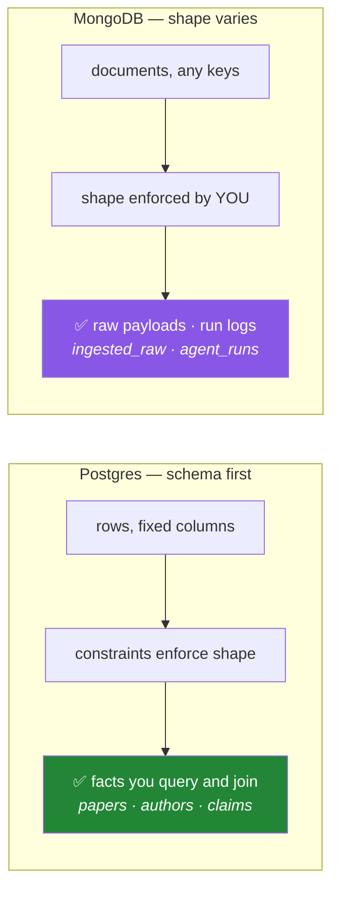

# Day 48 — MongoDB: documents, collections, and when a row is the wrong shape

**Phase 6 · Module 6** · ID: **DB-08** (MongoDB, databases, collections, documents)

> **Yesterday:** parameterisation, and SQL composed as objects.
> **Today:** the other database you provisioned on Day 3. Not "NoSQL is the new SQL" — a specific
> claim about which of Setu's data belongs in rows and which does not, tested against both.
> **Tomorrow:** CRUD and query operators.

```bash
./m start 48 && ./m scaffold 48
```

**Time:** 110 minutes. **Request budget:** 0 model calls · a few dozen Atlas round trips.

---

## §1 The story

You have spent six days making Postgres refuse bad data. Constraints, foreign keys, a schema. That
was the right thing to do — for the data it was right for.

Now consider what Day 227's ingestion actually collects. A scraped arXiv record has an abstract, a
list of categories, a PDF URL, and then whatever else that particular source happened to include:
a DOI sometimes, an ORCID sometimes, a nested list of grant numbers occasionally. The next source has
a different set. In six months a third source adds two fields nobody anticipated.

In Postgres that is either forty mostly-NULL columns, or a migration every time a source changes.
In MongoDB it is a document that holds what it holds.



**The claim this phase will defend in ADR-004 (Day 51):** Setu uses both, and the split is by *shape*,
not by preference.

- **Postgres** holds the extracted, structured facts — `papers`, `authors`, `claims`. These have a
  fixed shape, they are joined constantly, and a wrong one must be *refused*.
- **MongoDB** holds the raw ingested payloads and the agent run logs. These have a shape that varies
  by source, are written once and read whole, and are almost never joined.

The vocabulary maps almost directly, which is worth having straight:

| SQL | MongoDB |
|---|---|
| database | database |
| table | **collection** |
| row | **document** |
| column | **field** |
| primary key | `_id` (auto-created if you do not supply one) |
| `JOIN` | `$lookup` (exists, and is the thing you should mostly avoid) |
| schema | ...your problem |

That last row is the trade, stated honestly. **MongoDB is not schemaless — it is schema-on-read.**
The shape still exists; it has just moved from the database to your code, which means a typo'd field
name is now a silent missing value instead of an error. That is a real cost, and Day 19's Pydantic
models are how this project pays it: **every document is validated before it is written.**

---

## §2 Setup — run this

```bash
uv add "pymongo==4.17.0"
mkdir -p days/day-48/lab
touch days/day-48/lab/documents.py
touch src/setu/mongo.py
touch tests/test_mongo.py
```

Confirm your Day-3 credentials:

```bash
uv run python -c "from setu.config import _require; print('MONGODB_URI set:', bool(_require('MONGODB_URI')))"
```

If that raises `MissingKey`, go back to Day 3 §7 — you need the Atlas connection string, a database
user, and your IP on the access list.

---

## §3 DB-08 — documents

`days/day-48/lab/documents.py`:

```python
"""DB-08: documents, collections, and the shape question."""

from __future__ import annotations

import time
from datetime import UTC, datetime

from bson import ObjectId
from pymongo import MongoClient
from pymongo.errors import ServerSelectionTimeoutError

from setu.config import _require


def client() -> MongoClient:
    return MongoClient(
        _require("MONGODB_URI"),
        serverSelectionTimeoutMS=8000,
        connectTimeoutMS=8000,
        appname="setu-day-48",
    )


def connecting() -> None:
    conn = client()
    try:
        start = time.perf_counter()
        info = conn.admin.command("ping")
        print(f"\n  ping ok={info['ok']} in {(time.perf_counter() - start) * 1000:.0f} ms")
        print(f"  databases: {conn.list_database_names()}")
    except ServerSelectionTimeoutError as exc:
        print(f"  cannot reach Atlas: {exc}")
        print("  ^ almost always the IP access list. Check it before debugging anything else.")
    finally:
        conn.close()


def lazy_creation() -> None:
    conn = client()
    db = conn["setu_demo"]
    collection = db["nothing_here"]

    print(f"\n  {'nothing_here' in db.list_collection_names()=}   <- referencing it created nothing")
    collection.insert_one({"x": 1})
    print(f"  {'nothing_here' in db.list_collection_names()=}   <- the first WRITE created it")
    print("\n  Databases and collections spring into existence on first write.")
    print("  Convenient, and it means a typo'd collection name is a NEW empty collection,")
    print("  not an error. That is the schema-on-read cost, in its smallest form.")

    collection.drop()
    conn.close()


def the_id_field() -> None:
    conn = client()
    collection = conn["setu_demo"]["ids"]
    collection.delete_many({})

    result = collection.insert_one({"title": "Attention"})
    print(f"\n  {result.inserted_id=}")
    print(f"  {type(result.inserted_id).__name__=}")

    oid = result.inserted_id
    print(f"  {oid.generation_time=}   <- an ObjectId embeds its creation TIME")
    print("  ^ so sorting by _id is roughly chronological, for free")

    collection.insert_one({"_id": "p1", "title": "BERT"})
    print(f"  {collection.find_one({'_id': 'p1'})=}")
    print("  ^ you may supply your own _id. Use the natural key when you have one:")
    print("    paper_id as _id makes duplicate ingestion impossible (Day 49).")

    collection.drop()
    conn.close()


def documents_hold_structure() -> None:
    conn = client()
    collection = conn["setu_demo"]["raw"]
    collection.delete_many({})

    collection.insert_one(
        {
            "_id": "arxiv:1706.03762",
            "source": "arxiv",
            "fetched_at": datetime.now(UTC),
            "payload": {
                "title": "Attention Is All You Need",
                "categories": ["cs.CL", "cs.LG"],
                "authors": [
                    {"name": "Ashish Vaswani", "affiliation": "Google Brain"},
                    {"name": "Noam Shazeer", "affiliation": "Google Brain"},
                ],
                "links": {"pdf": "https://arxiv.org/pdf/1706.03762", "doi": None},
            },
        }
    )

    doc = collection.find_one({"_id": "arxiv:1706.03762"})
    print(f"\n  {doc['payload']['authors'][0]['name']=}")
    print(f"  {doc['payload']['categories']=}")
    print(f"  {type(doc['fetched_at']).__name__=}   <- a real datetime, not a string")

    print("\n  In Postgres that document is four tables and three joins, OR a jsonb column")
    print("  (which is Postgres agreeing with the point). Here it is one insert and one read.")

    collection.drop()
    conn.close()


def the_cost_of_no_schema() -> None:
    conn = client()
    collection = conn["setu_demo"]["typos"]
    collection.delete_many({})

    collection.insert_one({"paper_id": "p1", "year": 2017})
    collection.insert_one({"paper_id": "p2", "yaer": 2018})     # typo
    collection.insert_one({"paper_id": "p3", "year": "2019"})   # wrong type

    print(f"\n  inserted: {collection.count_documents({})} documents, zero complaints")
    print(f"  find year=2018: {collection.count_documents({'year': 2018})}   <- the typo'd doc is invisible")
    print(f"  find year=2019: {collection.count_documents({'year': 2019})}   <- the string does not match the int")

    types = collection.aggregate([{"$group": {"_id": {"$type": "$year"}, "n": {"$sum": 1}}}])
    print(f"  actual types stored: {list(types)}")

    print("\n  Postgres would have refused all three problems. Mongo stored them happily.")
    print("  THIS is why every document in this project is validated by a Pydantic model")
    print("  before it is written. The schema did not disappear; it moved into your code.")

    collection.drop()
    conn.close()


def bson_is_not_json() -> None:
    conn = client()
    collection = conn["setu_demo"]["bson"]
    collection.delete_many({})

    collection.insert_one(
        {"when": datetime.now(UTC), "count": 42, "ratio": 0.5, "raw": b"bytes", "missing": None}
    )
    doc = collection.find_one({})
    print(f"\n  {[(k, type(v).__name__) for k, v in doc.items()]}")
    print("\n  BSON preserves types JSON cannot: datetime, binary, int32/int64, Decimal128.")
    print("  Two consequences:")
    print("    - a datetime round-trips as a datetime (unlike a JSON column)")
    print("    - json.dumps(doc) FAILS on ObjectId and datetime; convert at the boundary")

    collection.drop()
    conn.close()


def when_to_use_which() -> None:
    print("\n  Postgres, when:")
    print("    - the shape is fixed and a wrong row must be REFUSED")
    print("    - you join it constantly")
    print("    - you need transactions across several tables")
    print("    - you aggregate it analytically (window functions, Day 46)")
    print("\n  MongoDB, when:")
    print("    - the shape varies by source and will keep changing")
    print("    - a document is written once and read WHOLE")
    print("    - you are not joining it")
    print("    - the natural unit really is a nested object, not a row")
    print("\n  For Setu: papers/authors/claims -> Postgres. ingested_raw/agent_runs -> Mongo.")
    print("  Day 51 writes that up as ADR-004, with your own numbers.")


if __name__ == "__main__":
    connecting()
    lazy_creation()
    the_id_field()
    documents_hold_structure()
    the_cost_of_no_schema()
    bson_is_not_json()
    when_to_use_which()
```

**Line by line:**

- `serverSelectionTimeoutMS=8000` — **set it.** The default is 30 seconds, and a wrong IP access list
  means a half-minute hang with an unhelpful error. Same rule as Day 42's `connect_timeout`.
- `appname="setu-day-48"` — shows up in Atlas's monitoring. On a free tier with a shared cluster, being
  able to see which of your own scripts is generating load is worth one keyword argument.
- `ServerSelectionTimeoutError` — **almost always the IP access list**, not your code. Check that
  before debugging anything else; it is the single most common Atlas setup failure.
- `lazy_creation` — referencing `db["nothing_here"]` creates nothing; the first **write** creates both
  the collection and the database. Convenient, and it means a typo'd collection name silently becomes a
  new empty collection rather than an error. That is schema-on-read in its smallest form.
- `ObjectId` — 12 bytes: a 4-byte timestamp, a 5-byte random value, and a 3-byte counter. Because the
  timestamp leads, **sorting by `_id` is roughly chronological for free**, and `oid.generation_time`
  gives you the creation time without storing one.
- `{"_id": "p1"}` — you may supply your own. **Use the natural key when you have one:** setting
  `_id = paper_id` makes duplicate ingestion structurally impossible, because a second insert with the
  same `_id` is rejected. Day 49 uses this.
- `documents_hold_structure` — nested objects, arrays, arrays of objects, all in one document, read
  back with plain Python indexing. In Postgres this is four tables and three joins, *or* a `jsonb`
  column — and reaching for `jsonb` is Postgres agreeing that the document shape was right.
- `the_cost_of_no_schema` — **the most important function today.** Three documents: one correct, one
  with a typo'd field, one with a string where an integer belongs. Mongo accepts all three without
  complaint. Then `year=2018` finds nothing (the typo made it invisible) and `year=2019` finds nothing
  (`"2019"` is not `2019`). **Postgres would have refused all three.** Run it and sit with the output;
  it is the entire argument for validating with Pydantic before writing.
- `{"$type": "$year"}` — the aggregation showing what types actually got stored. A useful audit query
  on any collection you did not write yourself.
- `bson_is_not_json` — BSON preserves `datetime`, binary, `int32`/`int64` and `Decimal128`. Two
  consequences: datetimes round-trip properly, **and** `json.dumps(doc)` raises on `ObjectId` and
  `datetime`, so you must convert at the API boundary. Day 234's FastAPI layer needs this.
- `when_to_use_which` — read both lists aloud. They are Day 51's ADR in draft.

---

## §4 Build brief — `src/setu/mongo.py`

Layer 2. Mirrors `db.py` so the two feel the same.

```python
"""MongoDB access for Setu. Validated writes only. Layer 2.

Imports: config, errors, schema.
"""

from __future__ import annotations

import contextlib

from setu.errors import ConfigError, DataError, TransientError

DATABASE = "setu"
COLLECTIONS = frozenset({"ingested_raw", "agent_runs", "eval_results"})


class MongoUnavailable(TransientError):
    """Raised when Atlas could not be reached within the timeout."""


@contextlib.contextmanager
def client(*, timeout_ms: int = 8000):
    """TODO(me): yield a MongoClient, closed on every exit path.

    - read MONGODB_URI via setu.config; raise ConfigError if absent
    - set serverSelectionTimeoutMS and connectTimeoutMS from `timeout_ms`
    - set appname='setu'
    - convert ServerSelectionTimeoutError to MongoUnavailable, chained (Day 18)
    - a context manager (Day 16)
    """
    raise NotImplementedError


def collection(name: str, *, conn=None):
    """TODO(me): return a collection handle, allowlisted.

    - raise DataError if `name` is not in COLLECTIONS, listing what is
    - this is Day 47's allowlist idea: a typo'd name must not silently create
      an empty collection
    """
    raise NotImplementedError


def insert_document(name: str, model, *, conn=None) -> str:
    """TODO(me): validate with Pydantic, then insert. Return the _id as a string.

    - `model` must be a pydantic BaseModel instance; raise DataError if it is a plain dict
      (that is the whole point - a dict skips validation)
    - serialise with model_dump(mode='python') so datetimes stay datetimes for BSON
    - raise DataError on a duplicate _id, naming it
    """
    raise NotImplementedError


def find_documents(name: str, filter_: dict | None = None, *, limit: int = 100,
                   projection: list[str] | None = None, conn=None) -> list[dict]:
    """TODO(me): query, with a MANDATORY limit.

    - raise DataError if limit < 1 or > 1000 (an unbounded find on a free tier is
      how you exhaust the 512 MB transfer allowance)
    - convert every ObjectId and datetime to a JSON-safe form before returning
    - return plain dicts, ready for json.dumps
    """
    raise NotImplementedError


def healthcheck() -> dict:
    """TODO(me): {'reachable': bool, 'latency_ms': float, 'collections': [...]}. Never raises.

    Same contract as db.healthcheck (Day 42) so a status page can call both.
    """
    raise NotImplementedError
```

- `insert_document` **refusing a plain dict** is the day's design decision. Accepting a dict "just this
  once" is how the §3 typo gets into the collection. The type of the argument is the guard.
- `find_documents` requiring a bounded limit is Principle 5 in code: the free tier has a transfer
  allowance, and an unbounded `find()` on a growing collection is how you spend it without noticing.
- `healthcheck` matching `db.healthcheck`'s shape means Day 55's Streamlit status panel calls both
  identically.

---

## §5 The eval that must be able to fail

`tests/test_mongo.py`:

```python
import pytest

from setu.errors import ConfigError, DataError, TransientError
from setu.mongo import COLLECTIONS, MongoUnavailable, collection, find_documents, healthcheck


# ---------- offline ----------

def test_mongo_unavailable_is_transient():
    assert issubclass(MongoUnavailable, TransientError)


def test_collection_allowlist_rejects_a_typo():
    with pytest.raises(DataError) as info:
        collection("ingested_raws")
    message = str(info.value)
    assert "ingested_raw" in message, "the message should list what IS allowed"


def test_collection_allowlist_accepts_known_names():
    for name in COLLECTIONS:
        assert name in COLLECTIONS


def test_missing_uri_raises_config_error(monkeypatch):
    import setu.mongo as mongo

    monkeypatch.delenv("MONGODB_URI", raising=False)
    monkeypatch.setattr("setu.config.load_dotenv", lambda **_: None)
    with pytest.raises(ConfigError):
        with mongo.client():
            pass


def test_client_converts_a_timeout_to_mongo_unavailable(monkeypatch):
    import pymongo
    from pymongo.errors import ServerSelectionTimeoutError

    import setu.mongo as mongo

    class FakeClient:
        def __init__(self, *a, **kw):
            pass

        @property
        def admin(self):
            raise ServerSelectionTimeoutError("no server")

        def close(self):
            pass

    monkeypatch.setattr(pymongo, "MongoClient", FakeClient)
    monkeypatch.setattr(mongo, "MongoClient", FakeClient, raising=False)
    monkeypatch.setenv("MONGODB_URI", "mongodb://x")
    with pytest.raises(MongoUnavailable) as info:
        with mongo.client() as conn:
            conn.admin.command("ping")
    assert isinstance(info.value.__cause__, ServerSelectionTimeoutError), "cause not chained"


@pytest.mark.parametrize("limit", [0, -1, 1001, 50_000])
def test_find_rejects_an_unbounded_limit(limit):
    with pytest.raises(DataError):
        find_documents("ingested_raw", limit=limit)


def test_insert_refuses_a_plain_dict():
    from setu.mongo import insert_document

    with pytest.raises(DataError) as info:
        insert_document("ingested_raw", {"_id": "p1", "source": "arxiv"})
    assert "model" in str(info.value).lower() or "dict" in str(info.value).lower()


def test_healthcheck_never_raises(monkeypatch):
    monkeypatch.delenv("MONGODB_URI", raising=False)
    assert healthcheck()["reachable"] is False


def test_healthcheck_matches_the_postgres_contract():
    """A status page calls both identically."""
    from setu.db import healthcheck as pg_health

    assert set(healthcheck()) >= {"reachable", "latency_ms"}
    assert set(pg_health()) >= {"reachable", "latency_ms"}


def test_no_raw_mongo_client_in_src():
    from pathlib import Path

    offenders = [
        f"{p.name}:{i}"
        for p in Path("src/setu").rglob("*.py")
        if p.name != "mongo.py"
        for i, line in enumerate(p.read_text(encoding="utf-8").splitlines(), 1)
        if "MongoClient(" in line and "noqa" not in line
    ]
    assert not offenders, f"raw MongoClient outside mongo.py: {offenders}"


# ---------- live ----------

@pytest.mark.live
def test_ping_and_latency():
    result = healthcheck()
    assert result["reachable"] is True
    assert 0 < result["latency_ms"] < 10_000


@pytest.mark.live
def test_insert_and_find_round_trip():
    from datetime import UTC, datetime

    from pydantic import BaseModel

    class RawDoc(BaseModel):
        model_config = {"extra": "forbid"}
        id: str
        source: str
        fetched_at: datetime

    from setu.mongo import client, insert_document

    doc = RawDoc(id="test-48", source="pytest", fetched_at=datetime.now(UTC))
    try:
        inserted = insert_document("ingested_raw", doc)
        assert inserted
        rows = find_documents("ingested_raw", {"source": "pytest"}, limit=10)
        assert len(rows) == 1
        assert isinstance(rows[0]["fetched_at"], str), "datetime not made JSON-safe"
    finally:
        with client() as conn:
            conn["setu"]["ingested_raw"].delete_many({"source": "pytest"})


@pytest.mark.live
def test_results_are_json_serialisable():
    import json

    from datetime import UTC, datetime

    from pydantic import BaseModel

    from setu.mongo import client, insert_document

    class RawDoc(BaseModel):
        id: str
        source: str
        fetched_at: datetime

    try:
        insert_document("ingested_raw", RawDoc(id="json-48", source="pytest-json",
                                               fetched_at=datetime.now(UTC)))
        rows = find_documents("ingested_raw", {"source": "pytest-json"}, limit=5)
        json.dumps(rows)  # must not raise on ObjectId or datetime
    finally:
        with client() as conn:
            conn["setu"]["ingested_raw"].delete_many({"source": "pytest-json"})


@pytest.mark.live
def test_duplicate_id_is_rejected_with_a_useful_message():
    from datetime import UTC, datetime

    from pydantic import BaseModel

    from setu.mongo import client, insert_document

    class RawDoc(BaseModel):
        id: str
        source: str
        fetched_at: datetime

    doc = RawDoc(id="dup-48", source="pytest-dup", fetched_at=datetime.now(UTC))
    try:
        insert_document("ingested_raw", doc)
        with pytest.raises(DataError) as info:
            insert_document("ingested_raw", doc)
        assert "dup-48" in str(info.value)
    finally:
        with client() as conn:
            conn["setu"]["ingested_raw"].delete_many({"source": "pytest-dup"})
```

**Line by line:**

- `test_insert_refuses_a_plain_dict` — **the day's real assessment.** The §3 demo showed Mongo happily
  storing a typo'd field and a wrong type; this test is the fix, enforced. A helper that accepts a dict
  "for convenience" reopens the exact hole the lesson is about.
- `test_find_rejects_an_unbounded_limit` — four cases including a plausible-looking `50_000`. Principle
  5: the free tier has a transfer allowance and an unbounded `find()` on a growing collection spends it
  silently.
- `test_client_converts_a_timeout_to_mongo_unavailable` — asserts both the translation **and** the
  chained `__cause__` (Day 18). A helper that swallows the original leaves you with "MongoUnavailable"
  and no idea whether it was the network, the credentials or the IP list.
- `test_healthcheck_matches_the_postgres_contract` — a **cross-module** contract test. It imports both
  health checks and asserts they share a key set, so Day 55's status panel can call them identically.
  This is the kind of consistency that decays silently without a test.
- `assert isinstance(rows[0]["fetched_at"], str)` — the BSON-to-JSON boundary from §3. A datetime that
  reaches FastAPI unconverted is a 500 on Day 234.
- `try/finally` cleanup in every live test — the free tier is 512 MB and shared across all 240 days.
  Tests that leave rows behind fill it. Day 47 established the pattern.
- `test_no_raw_mongo_client_in_src` — the tenth repo-wide guard, matching Day 42's rule for Postgres.

```bash
uv run python -m pytest tests/test_mongo.py -q
SETU_LIVE=1 uv run python -m pytest tests/test_mongo.py -v
```

---

## §6 Request budget

| Resource | Spent today |
|---|---|
| LLM calls | **0** |
| Atlas round trips | ~40 (lab + live tests) |
| Storage used | a few KB, all cleaned up |

---

## §7 Traps

- **The default 30-second server-selection timeout.** Set it to 8 seconds and fail fast.
- **Debugging your code when Atlas is unreachable.** It is the IP access list. Check first.
- **A typo'd collection name.** Creates a new empty collection, silently. Allowlist it.
- **Writing an unvalidated dict.** The §3 demo is what that looks like three months later.
- **Assuming `"2019"` matches `2019`.** BSON types are strict in queries even though writes are not.
- **`json.dumps` on a raw document.** `ObjectId` and `datetime` are not JSON. Convert at the boundary.
- **An unbounded `find()`.** Spends the free-tier transfer allowance.
- **Using `$lookup` because you miss joins.** If you are joining, the data wanted Postgres.
- **Letting Mongo generate `_id` when you have a natural key.** Set `_id` and duplicates become impossible.
- **Leaving test documents behind.** 512 MB, shared across the whole project.
- **Storing structured facts you will aggregate.** Window functions (Day 46) live in Postgres.

---

## §8 Verify before you code

Written **2026-08-21**:

- <https://pymongo.readthedocs.io/en/stable/tutorial.html> — client, database, collection basics.
- <https://pymongo.readthedocs.io/en/stable/faq.html#how-does-connection-pooling-work-in-pymongo> —
  why one `MongoClient` per process, not per call.
- <https://www.mongodb.com/docs/manual/reference/bson-types/> — what BSON preserves that JSON does not.
- <https://www.mongodb.com/docs/atlas/security/ip-access-list/> — the setting that causes most
  connection failures.

---

## §9 Say it in an interview

> "The split isn't 'SQL versus NoSQL', it's by shape. Structured facts that get joined and must be
> refused when wrong live in Postgres with constraints; raw ingested payloads whose fields vary by
> source and get read whole live in Mongo. The thing I'd stress is that Mongo isn't schemaless, it's
> schema-on-read — I ran a demo inserting a document with a typo'd field name and one with a string
> where an integer belonged, and Mongo accepted both without complaint, after which querying for the
> integer found nothing. The schema didn't disappear, it moved into my code. So the write helper takes
> a Pydantic model and explicitly *refuses* a plain dict, because accepting a dict once is how that
> demo becomes production."

---

## §10 Done when

Tick [`CHECKLIST.md`](CHECKLIST.md), then `./m check && ./m done 48`.
