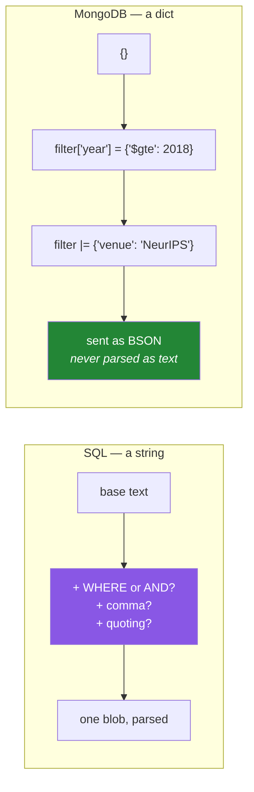

# Day 49 — CRUD: insert, find, query operators, sort, projection

**Phase 6 · Module 6** · ID: **DB-09** (CRUD operations, query operators, sorting, projection)

> **Yesterday:** documents, and the demo where Mongo cheerfully stored a typo.
> **Today:** the query language — which is **data, not text**, and that single fact is why it composes
> in a way SQL strings never do. Plus three cheap habits that keep a free tier free.
> **Tomorrow:** updates, deletes, indexes and the aggregation pipeline.

```bash
./m start 49 && ./m scaffold 49
```

**Time:** 110 minutes. **Request budget:** 0 model calls · a few dozen Atlas round trips.

---

## §1 The story

A SQL query is a **string**. Building one dynamically means concatenating text, which is why Day 47
needed a whole lesson on what goes wrong and why SQLAlchemy Core exists to compose it as objects
instead.

A MongoDB query is **a dict**.

```python
{"year": {"$gte": 2018}, "venue": "NeurIPS"}
```

That is the entire query. It composes with `|`, you can build it in a loop, you can store it in a
config file, and there is no parser to trick — a value that happens to contain `"; DROP"` is just a
string that matches nothing.



**This does not make Mongo injection-proof.** It makes *classic* SQL injection structurally
impossible, and introduces a different hole: if you take user input and drop it in as a **value**
without checking its type, a JSON body containing `{"$ne": null}` becomes an operator rather than a
string. `find_one({"password": user_supplied})` where `user_supplied` is `{"$ne": null}` matches
every document. The fix is the same discipline as everywhere else in this project — validate the
type before it reaches the query — and §5 makes it a function.

Three habits today that are specifically about the free tier (Principle 5):

1. **Project.** `find()` returns whole documents. If you need two fields out of forty, say so — the
   difference is bytes over the wire, and your allowance is 512 MB.
2. **Limit.** Always. Day 48 made it mandatory in the helper.
3. **Sort on an indexed field.** An unindexed sort loads and sorts in memory, and Atlas will refuse
   above 32 MB. Day 50 covers indexes; today you learn to notice.

---

## §2 Setup — run this

```bash
mkdir -p days/day-49/lab
touch days/day-49/lab/crud.py
```

`src/setu/mongo.py` and `tests/test_mongo.py` grow today. No new packages.

---

## §3 DB-09 — the query language

`days/day-49/lab/crud.py`:

```python
"""DB-09: CRUD and the query language that is a dict."""

from __future__ import annotations

from datetime import UTC, datetime, timedelta

from pymongo import ASCENDING, DESCENDING
from pymongo.errors import BulkWriteError, DuplicateKeyError

from setu.mongo import client

COLL = "ingested_raw"


def seed(conn) -> None:
    collection = conn["setu"][COLL]
    collection.delete_many({"source": "day49"})
    now = datetime.now(UTC)
    collection.insert_many(
        [
            {
                "_id": f"day49-{i}",
                "source": "day49",
                "fetched_at": now - timedelta(days=i),
                "payload": {
                    "title": title,
                    "year": year,
                    "categories": cats,
                    "citations": cites,
                },
            }
            for i, (title, year, cats, cites) in enumerate(
                [
                    ("Attention Is All You Need", 2017, ["cs.CL", "cs.LG"], 178000),
                    ("BERT", 2018, ["cs.CL"], 120000),
                    ("GPT-3", 2020, ["cs.CL", "cs.AI"], 40000),
                    ("ResNet", 2015, ["cs.CV"], 210000),
                    ("Adam", 2014, ["cs.LG"], 190000),
                ]
            )
        ]
    )


def insert_variants(conn) -> None:
    collection = conn["setu"][COLL]

    one = collection.insert_one({"_id": "day49-x", "source": "day49", "payload": {}})
    print(f"\n  insert_one -> {one.inserted_id}")

    try:
        collection.insert_one({"_id": "day49-x", "source": "day49"})
    except DuplicateKeyError as exc:
        print(f"  duplicate _id rejected: {type(exc).__name__}")
        print("  ^ _id is the natural key (Day 48), so re-ingesting the same paper CANNOT duplicate it")

    try:
        collection.insert_many(
            [
                {"_id": "day49-y", "source": "day49"},
                {"_id": "day49-x", "source": "day49"},   # duplicate, in the middle
                {"_id": "day49-z", "source": "day49"},
            ],
            ordered=True,
        )
    except BulkWriteError:
        remaining = collection.count_documents({"_id": {"$in": ["day49-y", "day49-z"]}})
        print(f"\n  ordered=True after a failure: {remaining} of 2 later docs inserted")
        print("  ^ ordered=True STOPS at the first error. day49-z never got written.")

    collection.delete_many({"_id": {"$in": ["day49-x", "day49-y", "day49-z"]}})

    result = collection.insert_many(
        [{"_id": "day49-y", "source": "day49"}, {"_id": "day49-z", "source": "day49"}],
        ordered=False,
    )
    print(f"  ordered=False inserted {len(result.inserted_ids)} - it continues past failures")
    collection.delete_many({"_id": {"$in": ["day49-y", "day49-z"]}})


def the_query_is_a_dict(conn) -> None:
    collection = conn["setu"][COLL]

    filters = {"source": "day49"}
    print(f"\n  {collection.count_documents(filters)=}")

    filters = filters | {"payload.year": {"$gte": 2018}}
    print(f"  built up with |: {collection.count_documents(filters)=}")

    dynamic = {"source": "day49"}
    for field, value in [("payload.year", {"$lt": 2019}), ("payload.categories", "cs.CL")]:
        dynamic[field] = value
    print(f"  built in a loop:  {collection.count_documents(dynamic)=}")

    print("\n  No WHERE-or-AND bookkeeping, no comma placement, no quoting.")
    print("  Compare Day 47's composability section: same win, different mechanism.")


def dotted_paths_and_arrays(conn) -> None:
    collection = conn["setu"][COLL]

    print(f"\n  {collection.count_documents({'payload.year': 2017})=}   <- dotted path into a nested object")
    print(f"  {collection.count_documents({'payload.categories': 'cs.CL'})=}   <- matches if the ARRAY CONTAINS it")
    print("  ^ no $contains operator: equality against an array field means 'contains'")

    print(f"  {collection.count_documents({'payload.categories': ['cs.CL']})=}   <- exact array match, order matters")
    print(f"  {collection.count_documents({'payload.categories': {'$all': ['cs.CL', 'cs.LG']}})=}   <- contains ALL")
    print(f"  {collection.count_documents({'payload.categories.0': 'cs.CL'})=}   <- by POSITION")
    print(f"  {collection.count_documents({'payload.categories': {'$size': 2}})=}   <- by length")


def comparison_and_logic(conn) -> None:
    collection = conn["setu"][COLL]
    base = {"source": "day49"}

    print(f"\n  $gte/$lte : {collection.count_documents(base | {'payload.year': {'$gte': 2015, '$lte': 2018}})=}")
    print(f"  $ne       : {collection.count_documents(base | {'payload.year': {'$ne': 2017}})=}")
    print(f"  $in       : {collection.count_documents(base | {'payload.year': {'$in': [2014, 2020]}})=}")
    print(f"  $nin      : {collection.count_documents(base | {'payload.year': {'$nin': [2014, 2020]}})=}")

    either = {"$and": [base, {"$or": [{"payload.year": 2017}, {"payload.citations": {"$gt": 200000}}]}]}
    print(f"  $or       : {collection.count_documents(either)=}")

    print(f"\n  $exists   : {collection.count_documents(base | {'payload.doi': {'$exists': True}})=}")
    print(f"  $type     : {collection.count_documents(base | {'payload.year': {'$type': 'int'}})=}")
    print("  ^ $exists and $type are the schema-on-read audit tools (Day 48).")
    print("    In Postgres these questions cannot arise; here you must ask them.")

    print(f"\n  regex     : {collection.count_documents(base | {'payload.title': {'$regex': '^B', '$options': 'i'}})=}")
    print("  ⚠️ an UNANCHORED regex cannot use an index. ^B can; 'ERT' cannot.")


def null_versus_missing(conn) -> None:
    collection = conn["setu"][COLL]
    collection.insert_many(
        [
            {"_id": "day49-null", "source": "day49", "payload": {"doi": None}},
            {"_id": "day49-absent", "source": "day49", "payload": {}},
        ]
    )

    print(f"\n  {{'payload.doi': None}}            -> {collection.count_documents({'payload.doi': None, 'source': 'day49'})} docs")
    print(f"  {{'payload.doi': {{'$exists': False}}}} -> {collection.count_documents({'payload.doi': {'$exists': False}, 'source': 'day49'})} docs")
    print("\n  `field: None` matches BOTH an explicit null AND a missing field.")
    print("  Only $exists distinguishes them. This trips everyone once, and it matters:")
    print("  'we tried and found nothing' is not 'we never looked'.")

    collection.delete_many({"_id": {"$in": ["day49-null", "day49-absent"]}})


def projection_saves_bytes(conn) -> None:
    collection = conn["setu"][COLL]
    import bson

    full = collection.find_one({"_id": "day49-0"})
    slim = collection.find_one({"_id": "day49-0"}, {"payload.title": 1, "_id": 0})

    print(f"\n  full document : {len(bson.encode(full)):5d} bytes")
    print(f"  projected     : {len(bson.encode(slim)):5d} bytes")
    print(f"  ~{len(bson.encode(full)) / len(bson.encode(slim)):.1f}x smaller")
    print(f"  {slim=}")

    print("\n  1 = include, 0 = exclude. You cannot mix them, EXCEPT _id which you may")
    print("  always exclude. _id comes back unless you explicitly say {'_id': 0}.")
    print("  On a 512 MB free-tier allowance this is not a micro-optimisation.")


def sort_limit_skip(conn) -> None:
    collection = conn["setu"][COLL]

    top = list(
        collection.find({"source": "day49"}, {"payload.title": 1, "payload.citations": 1, "_id": 0})
        .sort([("payload.citations", DESCENDING), ("_id", ASCENDING)])
        .limit(3)
    )
    print(f"\n  top 3 by citations:")
    for doc in top:
        print(f"    {doc['payload']['citations']:>7,}  {doc['payload']['title']}")

    print("\n  Note the SECOND sort key: without a tiebreak the order of equal values")
    print("  is unspecified, exactly as on Days 31, 45 and 46. Same rule, third database.")

    page2 = list(collection.find({"source": "day49"}).sort("_id", ASCENDING).skip(2).limit(2))
    print(f"\n  skip(2).limit(2) -> {[d['_id'] for d in page2]}")
    print("  ⚠️ skip() re-scans every skipped document. Fine at page 2, terrible at page 2000.")
    print("     Real pagination uses a range on the last seen _id. Day 50 revisits this.")


def cursors_are_lazy(conn) -> None:
    collection = conn["setu"][COLL]

    cursor = collection.find({"source": "day49"})
    print(f"\n  {type(cursor).__name__=}   <- nothing has been fetched yet")
    first = next(cursor)
    print(f"  first _id: {first['_id']}")
    print(f"  remaining: {len(list(cursor))}   <- consumed once, like Day 11's generators")

    print("\n  A cursor fetches in BATCHES, so `for doc in collection.find(...)` streams")
    print("  rather than loading everything. list(cursor) defeats that - only do it")
    print("  when you have already limited the result.")


if __name__ == "__main__":
    with client() as conn:
        seed(conn)
        insert_variants(conn)
        the_query_is_a_dict(conn)
        dotted_paths_and_arrays(conn)
        comparison_and_logic(conn)
        null_versus_missing(conn)
        projection_saves_bytes(conn)
        sort_limit_skip(conn)
        cursors_are_lazy(conn)
        conn["setu"][COLL].delete_many({"source": "day49"})
        print("\n  cleaned up.")
```

**Line by line:**

- `insert_many(..., ordered=True)` — the **default**. It stops at the first error, so a duplicate in
  the middle of a batch means every later document is silently not written. `ordered=False` continues
  past failures and reports them all at the end. For ingestion, `ordered=False` is almost always what
  you want; the important thing is knowing which you chose.
- `filters | {...}` — dict union (Day 8), building a query incrementally. **This is the composability
  win**: no `WHERE`-versus-`AND` bookkeeping, no comma placement, no quoting.
- `"payload.year"` — a **dotted path** into a nested object. It works at any depth and is how you query
  the document structure from Day 48.
- `{"payload.categories": "cs.CL"}` — against an **array** field, equality means *contains*. There is
  no `$contains` operator because equality already does it. Then `["cs.CL"]` is an exact whole-array
  match, `$all` is contains-all, `categories.0` is by position, and `$size` is by length. Five
  different questions, and confusing the first two is a classic.
- `$exists` versus `$type` — these are the **schema-on-read audit tools**. In Postgres, "does this
  column exist" and "what type is it" cannot vary per row. Here they can, so you need operators to ask.
- `$regex` with `^B` versus `ERT` — an **unanchored** regex cannot use an index and degrades to a
  collection scan. Day 50 covers indexes; the anchoring rule is worth knowing now.
- `null_versus_missing` — **`{"field": None}` matches both an explicit `null` and a missing field.**
  Only `$exists` tells them apart. This matters semantically: "we looked up the DOI and there isn't
  one" is a different fact from "we never looked", and if your pipeline needs to retry the second but
  not the first, this distinction is the whole feature.
- `projection_saves_bytes` — **run it and read the ratio.** `{"payload.title": 1, "_id": 0}` returns
  one field instead of the whole document. You cannot mix inclusion and exclusion in one projection,
  **except** `_id`, which you may always exclude — and which comes back by default unless you do.
- `.sort([("payload.citations", DESCENDING), ("_id", ASCENDING)])` — **note the second key.** Without a
  tiebreak, the order of equal values is unspecified and can vary between runs. Days 31, 45 and 46 made
  the same point about pandas and SQL; this is the third database and the rule has not changed.
- `.skip(2)` — skip **re-scans** every skipped document. It is fine on page 2 and unusable on page
  2000. Real pagination filters on the last seen `_id` instead.
- `cursors_are_lazy` — a cursor is Day 11's iterator protocol against a database. It fetches in batches,
  so `for doc in collection.find(...)` streams; `list(cursor)` materialises everything and should only
  follow a `limit`. And like every iterator, it is **consumed once**.

---

## §4 Build brief

Extend `src/setu/mongo.py`:

```python
SAFE_VALUE_TYPES = (str, int, float, bool, type(None))


def assert_safe_filter(filter_: dict) -> None:
    """TODO(me): raise DataError if a user-supplied VALUE is an operator dict.

    - walk the filter recursively
    - a key starting with '$' is fine (you wrote it); a VALUE that is a dict whose
      keys start with '$' is only fine if YOU built it - so the rule is:
      raise if any value is a dict containing '$'-prefixed keys AND that value did not
      come from a known operator position
    - simplest defensible rule: raise if a value is a dict at all, unless the caller
      passes trusted=True. Document that choice.
    - the message must show the offending path and explain the {'$ne': null} attack
    """
    raise NotImplementedError


def find_page(
    name: str, filter_: dict | None = None, *, fields: list[str] | None = None,
    sort_by: str | None = None, descending: bool = False, after_id: str | None = None,
    limit: int = 50, conn=None,
) -> tuple[list[dict], str | None]:
    """TODO(me): keyset pagination - no skip(). Return (docs, next_after_id).

    - `fields` becomes a projection; ALWAYS exclude _id from the projection unless
      it is requested, but keep it internally so you can return next_after_id
    - sorting is always (sort_by, _id) so ties are deterministic; _id alone if sort_by is None
    - `after_id` filters _id > after_id (or < when descending), which is why this
      does not re-scan (§3)
    - next_after_id is None when fewer than `limit` documents came back
    - call assert_safe_filter on the filter
    - reuse Day 48's limit bounds
    """
    raise NotImplementedError


def count(name: str, filter_: dict | None = None, *, conn=None) -> int:
    """TODO(me): count matching documents.

    Use count_documents, NOT estimated_document_count: the estimate ignores the filter
    entirely and returns the collection total, which silently answers a different question.
    """
    raise NotImplementedError


def field_report(name: str, *, sample: int = 1000, conn=None) -> dict:
    """TODO(me): the schema-on-read audit - which fields exist, and with which types.

    Return {field_path: {"present": int, "types": {"int": n, "string": m}}}.
    - use an aggregation with $type (§3)
    - top-level and one level of nesting is enough
    - this is what Day 34's quality_report is for a DataFrame; a collection needs one too
    - raise DataError if sample < 1
    """
    raise NotImplementedError
```

- `assert_safe_filter` is the day's security function, and the docstring deliberately steers toward
  the **simple defensible rule** (reject dict values unless `trusted=True`). A clever rule that tries
  to distinguish "operator you wrote" from "operator they sent" will be wrong eventually; a blunt one
  with an explicit escape hatch will not.
- `find_page` using keyset pagination rather than `skip` is §3's performance lesson made permanent —
  and it is the only pagination that stays correct when documents are inserted between page requests.
- `field_report` is the collection-level twin of Day 34's `quality_report`. Postgres tells you its
  schema; a Mongo collection has to be asked.

---

## §5 The eval that must be able to fail

Add to `tests/test_mongo.py`:

```python
from setu.mongo import assert_safe_filter, count, field_report, find_page


# ---------- offline ----------

def test_safe_filter_allows_plain_values():
    assert_safe_filter({"source": "arxiv", "year": 2018, "ok": True, "missing": None})


def test_safe_filter_rejects_an_operator_value():
    with pytest.raises(DataError) as info:
        assert_safe_filter({"password": {"$ne": None}})
    message = str(info.value)
    assert "password" in message
    assert "$ne" in message or "operator" in message.lower()


def test_safe_filter_rejects_a_nested_operator_value():
    with pytest.raises(DataError) as info:
        assert_safe_filter({"payload": {"doi": {"$gt": ""}}})
    assert "payload" in str(info.value), "the path to the offender was not reported"


def test_safe_filter_allows_trusted_operators():
    assert_safe_filter({"year": {"$gte": 2018}}, trusted=True)


def test_find_page_rejects_an_unsafe_filter():
    with pytest.raises(DataError):
        find_page("ingested_raw", {"source": {"$ne": None}})


@pytest.mark.parametrize("limit", [0, -5, 1001])
def test_find_page_enforces_limit_bounds(limit):
    with pytest.raises(DataError):
        find_page("ingested_raw", limit=limit)


def test_find_page_rejects_an_unknown_collection():
    with pytest.raises(DataError):
        find_page("not_a_collection")


def test_field_report_rejects_a_bad_sample():
    with pytest.raises(DataError):
        field_report("ingested_raw", sample=0)


def test_no_skip_in_src():
    """skip() re-scans; keyset pagination does not."""
    from pathlib import Path

    offenders = [
        f"{p.name}:{i}"
        for p in Path("src/setu").rglob("*.py")
        for i, line in enumerate(p.read_text(encoding="utf-8").splitlines(), 1)
        if ".skip(" in line and "noqa" not in line
    ]
    assert not offenders, f"skip() used: {offenders} - use keyset pagination"


def test_no_estimated_document_count_in_src():
    """It ignores the filter and answers a different question."""
    from pathlib import Path

    offenders = [
        str(p)
        for p in Path("src/setu").rglob("*.py")
        if "estimated_document_count" in p.read_text(encoding="utf-8")
    ]
    assert not offenders, f"estimated_document_count used: {offenders}"


# ---------- live ----------

@pytest.fixture
def seeded():
    """Five documents, cleaned up afterwards."""
    from datetime import UTC, datetime

    from setu.mongo import client

    with client() as conn:
        collection = conn["setu"]["ingested_raw"]
        collection.delete_many({"source": "pytest49"})
        collection.insert_many(
            [
                {
                    "_id": f"pt49-{i}",
                    "source": "pytest49",
                    "fetched_at": datetime.now(UTC),
                    "payload": {"year": 2015 + i, "cites": 100, "cats": ["a", "b"][: 1 + i % 2]},
                }
                for i in range(5)
            ]
        )
        yield collection
        collection.delete_many({"source": "pytest49"})


@pytest.mark.live
def test_count_respects_the_filter(seeded):
    assert count("ingested_raw", {"source": "pytest49"}) == 5
    assert count("ingested_raw", {"source": "pytest49", "payload.year": {"$gte": 2018}}) == 2


@pytest.mark.live
def test_find_page_paginates_without_skip(seeded):
    first, cursor = find_page("ingested_raw", {"source": "pytest49"}, limit=2)
    assert len(first) == 2
    assert cursor is not None

    second, _ = find_page("ingested_raw", {"source": "pytest49"}, limit=2, after_id=cursor)
    assert len(second) == 2
    assert {d["_id"] for d in first}.isdisjoint({d["_id"] for d in second}), "pages overlap"


@pytest.mark.live
def test_find_page_signals_the_last_page(seeded):
    docs, cursor = find_page("ingested_raw", {"source": "pytest49"}, limit=50)
    assert len(docs) == 5
    assert cursor is None, "a short page must report no more results"


@pytest.mark.live
def test_find_page_projection_reduces_the_payload(seeded):
    full, _ = find_page("ingested_raw", {"source": "pytest49"}, limit=5)
    slim, _ = find_page("ingested_raw", {"source": "pytest49"}, fields=["payload.year"], limit=5)
    assert "fetched_at" in full[0]
    assert "fetched_at" not in slim[0], "the projection was not applied"


@pytest.mark.live
def test_find_page_is_deterministic_with_ties(seeded):
    """Every document has cites=100; the order must still be stable."""
    a, _ = find_page("ingested_raw", {"source": "pytest49"}, sort_by="payload.cites", limit=5)
    b, _ = find_page("ingested_raw", {"source": "pytest49"}, sort_by="payload.cites", limit=5)
    assert [d["_id"] for d in a] == [d["_id"] for d in b], "no tiebreak - order varies between runs"


@pytest.mark.live
def test_array_equality_means_contains(seeded):
    assert count("ingested_raw", {"source": "pytest49", "payload.cats": "a"}) == 5
    assert count("ingested_raw", {"source": "pytest49", "payload.cats": ["a"]}) < 5


@pytest.mark.live
def test_null_and_missing_are_distinguishable(seeded):
    seeded.insert_many(
        [
            {"_id": "pt49-null", "source": "pytest49", "payload": {"doi": None}},
            {"_id": "pt49-absent", "source": "pytest49", "payload": {}},
        ]
    )
    both = count("ingested_raw", {"source": "pytest49", "payload.doi": None})
    absent = count("ingested_raw", {"source": "pytest49", "payload.doi": {"$exists": False}})
    assert both > absent, "field: None must match BOTH null and missing"
    assert absent >= 1


@pytest.mark.live
def test_field_report_finds_a_type_inconsistency(seeded):
    seeded.insert_one({"_id": "pt49-bad", "source": "pytest49", "payload": {"year": "2019"}})
    report = field_report("ingested_raw")
    types = report["payload.year"]["types"]
    assert len(types) > 1, "a string year among int years was not detected"
```

**Line by line:**

- `test_safe_filter_rejects_an_operator_value` — **the day's real assessment.** `{"password": {"$ne":
  None}}` is the canonical NoSQL injection: it matches every document. The test also asserts the
  message explains it, because a bare `DataError` teaches nobody.
- `test_safe_filter_allows_trusted_operators` — the escape hatch, tested. A guard with no legitimate
  way past it gets bypassed rather than used.
- `test_find_page_paginates_without_skip` — `isdisjoint` on the two page's `_id` sets. Overlapping
  pages are the classic `skip`-based bug when documents are inserted between requests.
- `test_find_page_is_deterministic_with_ties` — **all five documents have the same sort value.** Two
  identical calls must return the same order. Without the `_id` tiebreak this fails intermittently,
  which is the worst kind of failure. Fourth appearance of this rule (Days 31, 45, 46, now 49).
- `test_array_equality_means_contains` — `"a"` matches all five; `["a"]` matches fewer. Two lines that
  pin down §3's most confusable pair.
- `test_null_and_missing_are_distinguishable` — `both > absent` proves `field: None` matched the
  explicit null *as well as* the missing field.
- `test_field_report_finds_a_type_inconsistency` — inserts a string `"2019"` among integer years and
  asserts the report notices. This is Day 48's demo, now with a detector attached.
- `test_no_skip_in_src` and `test_no_estimated_document_count_in_src` — guards eleven and twelve. The
  second is subtle and worth the line: `estimated_document_count` **ignores your filter** and returns
  the collection total, so it silently answers a different question.

```bash
uv run python -m pytest tests/test_mongo.py -q
SETU_LIVE=1 uv run python -m pytest tests/test_mongo.py -v
```

---

## §6 Request budget

| Resource | Spent today |
|---|---|
| LLM calls | **0** |
| Atlas round trips | ~60 (lab + live tests) |
| Documents left behind | **0** — every fixture cleans up |

---

## §7 Traps

- **A dict value from user input.** `{"$ne": null}` matches everything. Validate the type.
- **`insert_many` default `ordered=True`.** Stops at the first failure; later documents vanish.
- **Confusing `{"cats": "a"}` with `{"cats": ["a"]}`.** Contains versus exact match.
- **Expecting a `$contains` operator.** Equality against an array already means contains.
- **`{"field": None}` to find missing fields.** It matches explicit nulls too. Use `$exists`.
- **Forgetting `_id` in a projection.** It comes back unless you exclude it.
- **Mixing 1 and 0 in one projection.** Not allowed, except for `_id`.
- **Sorting without a tiebreak.** Order of equal values is unspecified.
- **`skip()` for pagination.** Re-scans everything skipped.
- **`estimated_document_count` with a filter.** It ignores the filter.
- **An unanchored `$regex`.** Cannot use an index.
- **`list(cursor)` without a limit.** Materialises the whole result set.

---

## §8 Verify before you code

Written **2026-08-21**:

- <https://www.mongodb.com/docs/manual/reference/operator/query/> — the full operator list.
- <https://www.mongodb.com/docs/manual/tutorial/query-arrays/> — array matching, including `$all` and `$size`.
- <https://www.mongodb.com/docs/manual/tutorial/project-fields-from-query-results/> — projection rules.
- <https://www.mongodb.com/docs/manual/reference/method/cursor.skip/> — the official note on why
  `skip` scales badly.

---

## §9 Say it in an interview

> "A Mongo query is a dict, not a string, so it composes — you build it in a loop with no
> WHERE-versus-AND bookkeeping and no quoting, which is the same win SQLAlchemy Core gives you for SQL
> but for free. It also means classic SQL injection is structurally impossible, and it introduces a
> different hole: if user input lands in a value position without a type check, a JSON body containing
> `{'$ne': null}` becomes an operator and matches every document. So filters go through a guard that
> rejects dict values unless the caller explicitly marks them trusted. The other two things I'd flag
> are that `{'field': null}` matches both an explicit null and a missing field — only `$exists`
> distinguishes them, and 'we looked and found nothing' is a different fact from 'we never looked' —
> and that pagination uses a keyset on `_id` rather than `skip`, because `skip` re-scans everything it
> skips and pages can overlap when documents are inserted between requests."

---

## §10 Done when

Tick [`CHECKLIST.md`](CHECKLIST.md), then `./m check && ./m done 49`.
