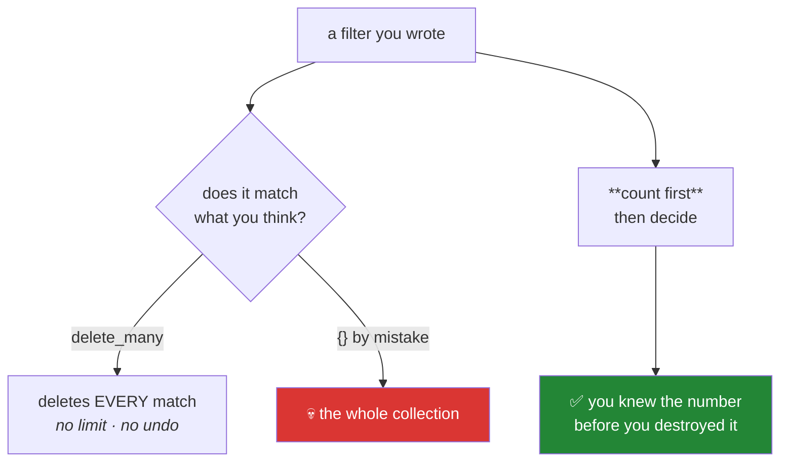

# Day 50 — Updates, deletes, indexes, and the aggregation pipeline

**Phase 6 · Module 6** · IDs: **DB-10** (update, delete, drop, indexes), **DB-11** (aggregation pipeline)

> **Yesterday:** the query language, and keyset pagination.
> **Today:** the operations that **destroy** things — where Principle 11 stops being a slogan — plus
> the one index that turns four seconds into six milliseconds, and the aggregation pipeline, which is
> `groupby` with a different spelling.
> **Tomorrow:** ADR-004, and Phase 6 closes.

```bash
./m start 50 && ./m scaffold 50
```

**Time:** 2 hours. **Request budget:** 0 model calls · a few hundred Atlas round trips.

---

## §1 The story

Three things today, and the first is the one that matters most.

**Destructive operations have a default that is wrong for you.** In Mongo, `update_one` and
`delete_one` affect one document; `update_many` and `delete_many` affect every match. That is
reasonable API design and it means **a filter typo is the difference between changing one row and
changing all of them.** There is no `LIMIT` on a `delete_many`, no confirmation, and no undo.



**The house rule from today:** every destructive operation in `src/setu/` counts its matches first,
refuses an empty filter outright, and refuses to exceed a stated maximum unless the caller passes it
explicitly. That is Principle 11 (blast radius) and Principle 12 (humans gate writes) as a function
signature — and it is the same shape as Day 232's approval gate, in miniature.

**Indexes** are the second thing. Without one, finding a document means reading every document in the
collection. With one, it is a tree lookup. You will measure this today and the number is not subtle.
The cost: indexes take disk (a real constraint at 512 MB), and every write must update every index on
that collection. So they are a trade, not a free win.

**The aggregation pipeline** is the third. It is Mongo's answer to `GROUP BY`, and it is a *list of
stages* where each stage transforms the stream:

`$match` → `$group` → `$sort` → `$limit`

You already know it. That is Day 31's split–apply–combine and Day 43's `WHERE`/`GROUP BY`/`HAVING`,
spelled as data instead of SQL. **`$match` goes first**, always, for the same reason `WHERE` is
evaluated before `GROUP BY`: filter before you aggregate, or you aggregate rows you were going to
throw away.

---

## §2 Setup — run this

```bash
mkdir -p days/day-50/lab
touch days/day-50/lab/writes.py
```

`src/setu/mongo.py` and `tests/test_mongo.py` grow today. No new packages.

---

## §3 DB-10 — updates, deletes, and blast radius

`days/day-50/lab/writes.py`:

```python
"""DB-10 / DB-11: destructive operations, indexes, and the aggregation pipeline."""

from __future__ import annotations

import time
from datetime import UTC, datetime

from pymongo import ASCENDING, DESCENDING

from setu.mongo import client

COLL = "ingested_raw"
TAG = "day50"


def seed(conn, n: int = 20_000) -> None:
    collection = conn["setu"][COLL]
    collection.delete_many({"source": TAG})
    rng = __import__("random").Random(0)
    venues = ["NeurIPS", "ICML", "ACL", "EMNLP"]
    collection.insert_many(
        [
            {
                "_id": f"{TAG}-{i}",
                "source": TAG,
                "fetched_at": datetime.now(UTC),
                "payload": {
                    "venue": venues[i % 4],
                    "year": 2015 + (i % 10),
                    "citations": rng.randint(0, 5000),
                    "status": "new",
                },
            }
            for i in range(n)
        ],
        ordered=False,
    )
    print(f"\n  seeded {collection.count_documents({'source': TAG}):,} documents")


def update_operators(conn) -> None:
    collection = conn["setu"][COLL]

    result = collection.update_one(
        {"_id": f"{TAG}-0"}, {"$set": {"payload.status": "reviewed"}}
    )
    print(f"\n  update_one: matched={result.matched_count} modified={result.modified_count}")

    again = collection.update_one({"_id": f"{TAG}-0"}, {"$set": {"payload.status": "reviewed"}})
    print(f"  same update again: matched={again.matched_count} modified={again.modified_count}")
    print("  ^ matched but NOT modified: the value was already that. Check modified_count,")
    print("    not matched_count, when you need to know whether anything changed.")

    collection.update_one({"_id": f"{TAG}-1"}, {"$inc": {"payload.citations": 10}})
    collection.update_one({"_id": f"{TAG}-1"}, {"$push": {"payload.tags": "seen"}})
    collection.update_one({"_id": f"{TAG}-1"}, {"$addToSet": {"payload.tags": "seen"}})
    collection.update_one({"_id": f"{TAG}-1"}, {"$unset": {"payload.status": ""}})
    doc = collection.find_one({"_id": f"{TAG}-1"})
    print(f"\n  after $inc/$push/$addToSet/$unset: {doc['payload']=}")
    print("  ^ $push appends always; $addToSet only if absent. 'seen' appears ONCE.")


def the_missing_dollar_set(conn) -> None:
    collection = conn["setu"][COLL]
    before = collection.find_one({"_id": f"{TAG}-2"})

    collection.replace_one({"_id": f"{TAG}-2"}, {"payload": {"status": "oops"}})
    after = collection.find_one({"_id": f"{TAG}-2"})

    print(f"\n  before: keys={sorted(before)}")
    print(f"  after : keys={sorted(after)}")
    print("  ^ replace_one REPLACED the whole document. source and fetched_at are GONE.")
    print("    In older drivers, update_one({...}, {'no_dollar': 1}) did this silently.")
    print("    pymongo 4 raises instead - but replace_one still does exactly what it says.")

    collection.replace_one({"_id": f"{TAG}-2"}, before)


def upsert(conn) -> None:
    collection = conn["setu"][COLL]

    result = collection.update_one(
        {"_id": f"{TAG}-new"},
        {"$set": {"source": TAG, "payload": {"status": "new"}},
         "$setOnInsert": {"fetched_at": datetime.now(UTC)}},
        upsert=True,
    )
    print(f"\n  upsert (first time): upserted_id={result.upserted_id}")

    result = collection.update_one(
        {"_id": f"{TAG}-new"},
        {"$set": {"payload.status": "seen-again"},
         "$setOnInsert": {"fetched_at": datetime(1999, 1, 1, tzinfo=UTC)}},
        upsert=True,
    )
    print(f"  upsert (second time): upserted_id={result.upserted_id} modified={result.modified_count}")
    doc = collection.find_one({"_id": f"{TAG}-new"})
    print(f"  fetched_at unchanged: {doc['fetched_at'].year}")
    print("\n  $setOnInsert applies ONLY when creating. That is how Day 227's ingestion")
    print("  re-runs safely: update what changed, never overwrite when-we-first-saw-it.")

    collection.delete_one({"_id": f"{TAG}-new"})


def delete_blast_radius(conn) -> None:
    collection = conn["setu"][COLL]

    intended = {"source": TAG, "payload.status": "reviewed"}
    print(f"\n  count first: {collection.count_documents(intended)} documents match")

    typo = {"source": TAG, "payload.staus": "reviewed"}     # typo'd field
    print(f"  the typo'd filter matches: {collection.count_documents(typo)} documents")
    print("  ^ ZERO. A typo'd FIELD matches nothing - annoying but harmless.")

    dangerous = {"source": TAG}
    print(f"  a filter missing one clause matches: {collection.count_documents(dangerous):,}")
    print("  ^ THAT is the dangerous shape: a filter that is too BROAD, not wrong.")
    print("    delete_many would remove all of them, with no limit and no undo.")

    print("\n  House rule from today: count first, refuse {}, cap the damage.")


def indexes_are_not_subtle(conn) -> None:
    collection = conn["setu"][COLL]
    collection.drop_indexes()

    query = {"source": TAG, "payload.citations": {"$gte": 4900}}

    start = time.perf_counter()
    n = collection.count_documents(query)
    unindexed = time.perf_counter() - start

    plan = collection.find(query).explain()["queryPlanner"]["winningPlan"]
    print(f"\n  without an index: {unindexed * 1000:7.1f} ms for {n} results")
    print(f"  plan stage: {str(plan)[:80]}...   <- look for COLLSCAN")

    collection.create_index([("source", ASCENDING), ("payload.citations", DESCENDING)])

    start = time.perf_counter()
    collection.count_documents(query)
    indexed = time.perf_counter() - start

    plan = collection.find(query).explain()["queryPlanner"]["winningPlan"]
    print(f"\n  with an index   : {indexed * 1000:7.1f} ms")
    print(f"  plan stage: {str(plan)[:80]}...   <- look for IXSCAN")
    print(f"  ~{unindexed / indexed:.0f}x")

    stats = conn["setu"].command("collstats", COLL)
    print(f"\n  index size: {stats.get('totalIndexSize', 0) / 1024:.0f} KiB")
    print("  ^ the cost: disk (512 MB free tier) and a write penalty on every insert.")


def compound_index_order_matters(conn) -> None:
    collection = conn["setu"][COLL]
    collection.drop_indexes()
    collection.create_index([("payload.venue", ASCENDING), ("payload.year", ASCENDING)])

    for query, label in [
        ({"payload.venue": "ICML"}, "venue only          (prefix)"),
        ({"payload.venue": "ICML", "payload.year": 2018}, "venue + year        (full)"),
        ({"payload.year": 2018}, "year only           (NOT a prefix)"),
    ]:
        stage = str(collection.find(query).explain()["queryPlanner"]["winningPlan"])
        used = "IXSCAN" if "IXSCAN" in stage else "COLLSCAN"
        print(f"  {label}: {used}")

    print("\n  A compound index serves a LEFT PREFIX of its fields. (venue) and")
    print("  (venue, year) use it; (year) alone does not. Order the fields by how you query,")
    print("  not alphabetically.")


def aggregation_pipeline(conn) -> None:
    collection = conn["setu"][COLL]

    pipeline = [
        {"$match": {"source": TAG, "payload.year": {"$gte": 2018}}},
        {"$group": {
            "_id": "$payload.venue",
            "n": {"$sum": 1},
            "mean_citations": {"$avg": "$payload.citations"},
            "max_citations": {"$max": "$payload.citations"},
        }},
        {"$match": {"n": {"$gte": 100}}},
        {"$sort": {"mean_citations": DESCENDING}},
        {"$limit": 5},
    ]

    print("\n  venue          n    mean   max")
    for row in collection.aggregate(pipeline):
        print(f"  {row['_id']:<12} {row['n']:>4} {row['mean_citations']:>7.0f} {row['max_citations']:>6}")

    print("\n  Read the stages against SQL (Day 43):")
    print("    $match (before $group) = WHERE")
    print("    $group                 = GROUP BY")
    print("    $match (after $group)  = HAVING")
    print("    $sort / $limit         = ORDER BY / LIMIT")
    print("  Same five operations. Day 31's split-apply-combine, spelled as a list.")


def match_first_is_not_optional(conn) -> None:
    collection = conn["setu"][COLL]

    good = [
        {"$match": {"source": TAG, "payload.venue": "ICML"}},
        {"$group": {"_id": "$payload.year", "n": {"$sum": 1}}},
    ]
    bad = [
        {"$group": {"_id": {"y": "$payload.year", "v": "$payload.venue"}, "n": {"$sum": 1}}},
        {"$match": {"_id.v": "ICML"}},
    ]

    for pipeline, label in [(good, "$match first"), (bad, "$match last ")]:
        start = time.perf_counter()
        list(collection.aggregate(pipeline))
        print(f"  {label}: {(time.perf_counter() - start) * 1000:7.1f} ms")

    print("\n  Filtering last means grouping documents you then discard.")
    print("  $match first can also use an index; after a $group it cannot.")


def unwind_and_lookup(conn) -> None:
    collection = conn["setu"][COLL]
    collection.update_many(
        {"_id": {"$in": [f"{TAG}-{i}" for i in range(3)]}},
        {"$set": {"payload.cats": ["cs.CL", "cs.LG"]}},
    )

    rows = list(collection.aggregate([
        {"$match": {"source": TAG, "payload.cats": {"$exists": True}}},
        {"$unwind": "$payload.cats"},
        {"$group": {"_id": "$payload.cats", "n": {"$sum": 1}}},
        {"$sort": {"n": DESCENDING}},
    ]))
    print(f"\n  $unwind then $group: {rows}")
    print("  ^ $unwind turns one document with a 3-element array into 3 documents.")
    print("    It is Day 32's melt: wide to long, so you can group by the array element.")
    print("\n  $lookup exists and is a left outer join. If you need it often, the data")
    print("  wanted Postgres (Day 48). Day 51 argues that properly.")


def cleanup(conn) -> None:
    collection = conn["setu"][COLL]
    matched = collection.count_documents({"source": TAG})
    removed = collection.delete_many({"source": TAG}).deleted_count
    collection.drop_indexes()
    print(f"\n  counted {matched:,} then deleted {removed:,} - the house rule, applied")


if __name__ == "__main__":
    with client() as conn:
        seed(conn)
        update_operators(conn)
        the_missing_dollar_set(conn)
        upsert(conn)
        delete_blast_radius(conn)
        indexes_are_not_subtle(conn)
        compound_index_order_matters(conn)
        aggregation_pipeline(conn)
        match_first_is_not_optional(conn)
        unwind_and_lookup(conn)
        cleanup(conn)
```

**Line by line:**

- `matched_count` versus `modified_count` — an update that sets a field to the value it already has
  **matches but does not modify**. If you need to know whether anything actually changed (to decide
  whether to log, or to notify), check `modified_count`.
- `$set` / `$inc` / `$push` / `$addToSet` / `$unset` — the update operators. **`$push` appends
  unconditionally; `$addToSet` only if absent**, which is why `"seen"` appears once after both calls.
- `the_missing_dollar_set` — `replace_one` replaces the **entire document**, so `source` and
  `fetched_at` vanish. In older drivers, `update_one` with an operator-less document did the same
  thing silently; pymongo 4 raises instead. **`replace_one` still does exactly what its name says**,
  and it is chosen far more often by accident than on purpose.
- `$setOnInsert` — applies **only when the upsert creates the document**. This is the operator that
  makes Day 227's re-runnable ingestion correct: update what changed, never overwrite
  when-we-first-saw-it. Note the second upsert's `fetched_at` stays 2026, not 1999.
- `delete_blast_radius` — **read the three counts.** A typo'd *field* matches zero documents: annoying,
  harmless. **The dangerous shape is a filter that is too broad** — one missing clause and you match
  twenty thousand instead of a handful. There is no `LIMIT` on `delete_many` and no undo.
- `.explain()["queryPlanner"]["winningPlan"]` — **COLLSCAN** means every document was read; **IXSCAN**
  means the index was used. This is the single most useful diagnostic in either database, and the
  equivalent of `EXPLAIN` in Postgres.
- `indexes_are_not_subtle` — run it and record the ratio. Then note the printed **index size**: that
  is the cost, in a 512 MB budget, plus a write penalty on every insert. An index on every field is
  not free.
- `compound_index_order_matters` — a compound index on `(venue, year)` serves queries on `venue` and
  on `(venue, year)`, but **not on `year` alone**. That is the *left prefix* rule, and it is why field
  order is a design decision rather than alphabetical.
- `aggregation_pipeline` — map the five stages onto SQL. `$match` before `$group` is `WHERE`;
  `$match` **after** `$group` is `HAVING`. Same operations, same order, different spelling — Day 43's
  logical evaluation order, in a list.
- `match_first_is_not_optional` — two pipelines computing the same answer. Filtering last means
  grouping documents you then discard, and **after a `$group` no index can help**. Day 43 made the
  same point about `WHERE` versus `HAVING`.
- `$unwind` — turns one document with a 3-element array into three documents. **It is Day 32's
  `melt`**: wide to long, so the array element can become a grouping key.
- `$lookup` — a left outer join. It exists. **If you reach for it often, the data wanted Postgres**,
  which is exactly the argument Day 51 has to make with numbers.

---

## §4 Build brief

Extend `src/setu/mongo.py`:

```python
MAX_DESTRUCTIVE = 100


def update_documents(
    name: str, filter_: dict, update: dict, *,
    many: bool = False, max_affected: int = MAX_DESTRUCTIVE, conn=None,
) -> dict:
    """TODO(me): a guarded update. Return {'matched', 'modified', 'counted'}.

    - refuse an EMPTY filter outright, always (DataError) - no override
    - refuse an update document whose top-level keys are not all $-operators
      (that is the replace_one accident, §3)
    - COUNT first; raise DataError if the count exceeds max_affected, naming the
      count and the cap, so the caller must widen it deliberately
    - many=False uses update_one; True uses update_many
    - call assert_safe_filter (Day 49)
    """
    raise NotImplementedError


def delete_documents(
    name: str, filter_: dict, *, max_affected: int = MAX_DESTRUCTIVE,
    dry_run: bool = True, conn=None,
) -> dict:
    """TODO(me): a guarded delete. Return {'counted', 'deleted', 'dry_run'}.

    - dry_run defaults to TRUE: the caller must ASK to destroy something
    - refuse an empty filter, always
    - count first; raise if over max_affected
    - on a dry run, return the count with deleted=0 and touch nothing
    - this is Principle 12 in miniature: the default is 'show me what would happen'
    """
    raise NotImplementedError


def ensure_indexes(name: str, *, conn=None) -> list[str]:
    """TODO(me): create the collection's declared indexes, idempotently.

    Declare them as a module-level dict INDEXES[collection] = [ [(field, direction), ...], ... ].
    - return the names of indexes created THIS call (empty on a second run)
    - raise DataError if a collection has more than 6 indexes declared (each one
      costs disk on a 512 MB tier and slows every write)
    """
    raise NotImplementedError


def aggregate(name: str, pipeline: list[dict], *, limit: int = 1000, conn=None) -> list[dict]:
    """TODO(me): run a pipeline, with guards.

    - raise DataError if the FIRST stage is not $match (§3: filter before you aggregate)
    - raise DataError if the pipeline contains $out or $merge (those WRITE, and a
      read helper must not)
    - append a $limit if the pipeline has none
    - make every result JSON-safe, as in Day 48's find_documents
    """
    raise NotImplementedError


def explain(name: str, filter_: dict, *, conn=None) -> dict:
    """TODO(me): return {'stage': 'IXSCAN'|'COLLSCAN', 'index': name|None, 'docs_examined': int}.

    Flatten the explain output to the three things you actually look at.
    Day 227 calls this in CI to assert its hot queries stay indexed.
    """
    raise NotImplementedError
```

- `delete_documents` defaulting to **`dry_run=True`** is the day's design decision, and it is the whole
  lesson as a signature: the default behaviour of a destructive function is to tell you what it *would*
  do. Day 232's human approval gate is this idea with a person in the loop instead of a keyword
  argument.
- `aggregate` rejecting `$out` and `$merge` is Principle 11: those stages **write**, and a function
  named `aggregate` that can silently overwrite a collection is a trap.
- `explain` flattened to three fields is what makes it usable in a test rather than a debugging session.

---

## §5 The eval that must be able to fail

Add to `tests/test_mongo.py`:

```python
from setu.mongo import MAX_DESTRUCTIVE, aggregate, delete_documents, ensure_indexes, explain, update_documents


# ---------- offline ----------

def test_update_refuses_an_empty_filter():
    with pytest.raises(DataError) as info:
        update_documents("ingested_raw", {}, {"$set": {"x": 1}})
    assert "empty" in str(info.value).lower() or "filter" in str(info.value).lower()


def test_delete_refuses_an_empty_filter():
    with pytest.raises(DataError):
        delete_documents("ingested_raw", {}, dry_run=False)


def test_empty_filter_cannot_be_overridden():
    """There is no max_affected large enough to make {} acceptable."""
    with pytest.raises(DataError):
        delete_documents("ingested_raw", {}, max_affected=10**9, dry_run=False)


def test_update_rejects_a_replacement_document():
    """{'status': 'x'} without $set is the replace_one accident."""
    with pytest.raises(DataError) as info:
        update_documents("ingested_raw", {"_id": "p1"}, {"status": "x"})
    assert "$" in str(info.value)


def test_update_accepts_operator_documents():
    """A guard that rejects legitimate updates would be turned off."""
    import inspect

    source = inspect.getsource(update_documents)
    assert "$set" in source or "startswith" in source


def test_aggregate_requires_match_first():
    with pytest.raises(DataError) as info:
        aggregate("ingested_raw", [{"$group": {"_id": "$venue", "n": {"$sum": 1}}}])
    assert "$match" in str(info.value)


@pytest.mark.parametrize("stage", [{"$out": "other"}, {"$merge": {"into": "other"}}])
def test_aggregate_rejects_writing_stages(stage):
    with pytest.raises(DataError) as info:
        aggregate("ingested_raw", [{"$match": {"source": "x"}}, stage])
    assert "$out" in str(info.value) or "$merge" in str(info.value)


def test_aggregate_rejects_an_unknown_collection():
    with pytest.raises(DataError):
        aggregate("nope", [{"$match": {}}])


def test_index_declaration_is_capped():
    import setu.mongo as mongo

    for name, indexes in mongo.INDEXES.items():
        assert len(indexes) <= 6, f"{name} declares {len(indexes)} indexes"


def test_destructive_default_is_conservative():
    assert MAX_DESTRUCTIVE <= 1000, "the default cap is too high to be a guard"


def test_delete_dry_run_is_the_default():
    import inspect

    signature = inspect.signature(delete_documents)
    assert signature.parameters["dry_run"].default is True, (
        "a destructive function must default to showing what it WOULD do"
    )


# ---------- live ----------

@pytest.fixture
def bulk():
    from datetime import UTC, datetime

    from setu.mongo import client

    with client() as conn:
        collection = conn["setu"]["ingested_raw"]
        collection.delete_many({"source": "pytest50"})
        collection.insert_many(
            [
                {
                    "_id": f"pt50-{i}",
                    "source": "pytest50",
                    "fetched_at": datetime.now(UTC),
                    "payload": {"venue": ["a", "b"][i % 2], "year": 2015 + i % 5, "n": i},
                }
                for i in range(200)
            ],
            ordered=False,
        )
        yield collection
        collection.delete_many({"source": "pytest50"})
        collection.drop_indexes()


@pytest.mark.live
def test_update_counts_before_it_writes(bulk):
    result = update_documents(
        "ingested_raw", {"source": "pytest50", "payload.venue": "a"},
        {"$set": {"payload.seen": True}}, many=True, max_affected=200,
    )
    assert result["counted"] == 100
    assert result["modified"] == 100


@pytest.mark.live
def test_update_refuses_to_exceed_the_cap(bulk):
    with pytest.raises(DataError) as info:
        update_documents(
            "ingested_raw", {"source": "pytest50"},
            {"$set": {"payload.seen": True}}, many=True, max_affected=10,
        )
    message = str(info.value)
    assert "200" in message and "10" in message, "the count and the cap must both be named"


@pytest.mark.live
def test_update_wrote_nothing_when_it_refused(bulk):
    with pytest.raises(DataError):
        update_documents(
            "ingested_raw", {"source": "pytest50"},
            {"$set": {"payload.seen": True}}, many=True, max_affected=10,
        )
    from setu.mongo import count

    assert count("ingested_raw", {"source": "pytest50", "payload.seen": True}) == 0, (
        "the update partially applied before refusing"
    )


@pytest.mark.live
def test_delete_dry_run_destroys_nothing(bulk):
    result = delete_documents("ingested_raw", {"source": "pytest50"}, max_affected=500)
    assert result["counted"] == 200
    assert result["deleted"] == 0
    assert result["dry_run"] is True
    assert bulk.count_documents({"source": "pytest50"}) == 200


@pytest.mark.live
def test_delete_actually_deletes_when_asked(bulk):
    result = delete_documents(
        "ingested_raw", {"source": "pytest50", "payload.venue": "a"},
        max_affected=500, dry_run=False,
    )
    assert result["deleted"] == 100
    assert bulk.count_documents({"source": "pytest50"}) == 100


@pytest.mark.live
def test_ensure_indexes_is_idempotent(bulk):
    first = ensure_indexes("ingested_raw")
    second = ensure_indexes("ingested_raw")
    assert second == [], f"indexes re-created: {second}"
    assert isinstance(first, list)


@pytest.mark.live
def test_an_index_turns_a_collscan_into_an_ixscan(bulk):
    from setu.mongo import client

    with client() as conn:
        conn["setu"]["ingested_raw"].drop_indexes()
    before = explain("ingested_raw", {"source": "pytest50", "payload.n": {"$gte": 190}})
    assert before["stage"] == "COLLSCAN"

    ensure_indexes("ingested_raw")
    after = explain("ingested_raw", {"source": "pytest50", "payload.n": {"$gte": 190}})
    assert after["stage"] == "IXSCAN", "the declared index did not serve the query"
    assert after["docs_examined"] < before["docs_examined"]


@pytest.mark.live
def test_aggregate_matches_a_hand_computed_answer(bulk):
    rows = aggregate("ingested_raw", [
        {"$match": {"source": "pytest50"}},
        {"$group": {"_id": "$payload.venue", "n": {"$sum": 1}}},
        {"$sort": {"_id": 1}},
    ])
    assert [(r["_id"], r["n"]) for r in rows] == [("a", 100), ("b", 100)]


@pytest.mark.live
def test_aggregate_results_are_json_safe(bulk):
    import json

    rows = aggregate("ingested_raw", [
        {"$match": {"source": "pytest50"}},
        {"$group": {"_id": "$payload.year", "n": {"$sum": 1}}},
    ])
    json.dumps(rows)


@pytest.mark.live
def test_aggregate_applies_a_default_limit(bulk):
    rows = aggregate("ingested_raw", [{"$match": {"source": "pytest50"}}], limit=5)
    assert len(rows) == 5
```

**Line by line:**

- `test_empty_filter_cannot_be_overridden` — **the day's real assessment.** `max_affected=10**9` is
  the caller trying to be clever, and an empty filter must still be refused. A guard with a bypass for
  the most dangerous case is not a guard.
- `test_delete_dry_run_is_the_default` — an **API-shape test** using `inspect.signature`, the same
  technique as Day 33's `causal_rolling` and Day 46's `causal_window`. It asserts a design decision:
  the safe behaviour is the default, so forgetting an argument fails safe rather than destructively.
- `test_update_rejects_a_replacement_document` paired with `test_update_accepts_operator_documents` —
  the guard must fire on the accident **and** allow legitimate updates. A rule that blocks real work
  gets deleted within a week.
- `test_update_wrote_nothing_when_it_refused` — subtle and important. It is not enough to raise; the
  count must happen **before** any write, so a refusal leaves the data untouched. An implementation
  that updates and *then* checks passes the refusal test and fails this one, having already done the
  damage.
- `test_update_refuses_to_exceed_the_cap` asserting **both** numbers appear — "too many documents"
  sends you counting; "200 matched, cap is 10" tells you whether to widen the cap or fix the filter.
- `test_an_index_turns_a_collscan_into_an_ixscan` — drops indexes, asserts `COLLSCAN`, creates them,
  asserts `IXSCAN` **and** fewer documents examined. Day 227 runs this shape in CI so a schema change
  cannot silently un-index a hot query.
- `test_aggregate_matches_a_hand_computed_answer` — 100 and 100, computable on paper. Every aggregation
  needs one test against a number you worked out yourself, not against the pipeline's own output.

```bash
uv run python -m pytest tests/test_mongo.py -q
SETU_LIVE=1 uv run python -m pytest tests/test_mongo.py -v
```

---

## §6 Request budget

| Resource | Spent today |
|---|---|
| LLM calls | **0** |
| Atlas round trips | ~300 (20 k seeded documents, then removed) |
| Storage peak | ~10 MB, all cleaned up |

---

## §7 Traps

- **`delete_many` with a filter that is too broad.** No limit, no undo. Count first.
- **A typo'd field in a filter.** Matches zero — harmless. The *broad* filter is the danger.
- **`replace_one` when you meant `update_one` with `$set`.** Replaces the whole document.
- **Reading `matched_count` when you meant `modified_count`.** They differ on a no-op update.
- **`$push` when you meant `$addToSet`.** Duplicates accumulate.
- **Upsert without `$setOnInsert`.** Overwrites "when we first saw it" on every re-run.
- **No index on a field you filter by.** COLLSCAN. Check `.explain()`.
- **An index per field.** Disk on a 512 MB tier, plus a write penalty each.
- **Compound index fields in the wrong order.** Only a left prefix is served.
- **`$match` after `$group`.** Aggregates rows you discard, and no index can help.
- **`$out` or `$merge` in a "read" helper.** Those write.
- **Reaching for `$lookup` repeatedly.** The data wanted Postgres.

---

## §8 Verify before you code

Written **2026-08-21**:

- <https://www.mongodb.com/docs/manual/reference/operator/update/> — the update operators.
- <https://www.mongodb.com/docs/manual/core/indexes/index-properties/> — compound indexes and the
  prefix rule.
- <https://www.mongodb.com/docs/manual/reference/explain-results/> — reading `winningPlan`.
- <https://www.mongodb.com/docs/manual/core/aggregation-pipeline-optimization/> — why `$match` first.

---

## §9 Say it in an interview

> "Destructive operations are where I put the most guard rails, because `delete_many` has no limit and
> no undo — and the dangerous mistake isn't a typo'd field, which matches nothing, it's a filter
> that's *too broad*, which matches everything. So my helpers count before they write, refuse an empty
> filter with no override, and raise if the count exceeds a cap, naming both numbers so you know
> whether to widen the cap or fix the filter. Delete defaults to `dry_run=True` — the default
> behaviour of a destructive function should be to tell you what it *would* do — and there's a test
> using `inspect.signature` asserting that default, plus one asserting that a refused update wrote
> nothing, because counting *after* writing passes the refusal test and has already done the damage.
> On indexes: I flatten `explain` to the stage and the documents examined, and CI asserts the hot
> queries are still IXSCAN, so a schema change can't silently un-index them."

---

## §10 Done when

Tick [`CHECKLIST.md`](CHECKLIST.md), then `./m check && ./m done 50`.
