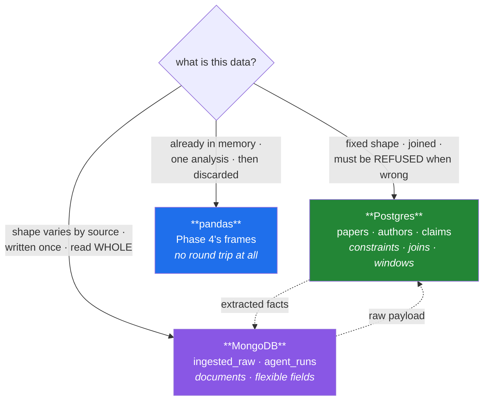

# Day 51 — SQL vs NoSQL: the decision, with numbers

**Phase 6 gate** · ID: **DB-12** · Artifact: **ADR-004**

> **Yesterday:** guarded writes, indexes, and the aggregation pipeline.
> **Today:** the same question answered three ways, measured on your own free tiers, and written up
> as a decision you could defend. Setu uses both databases **on purpose** — today you prove that is
> a reason and not a hedge. **Phase 6 closes.**
> **Tomorrow:** Phase 7, Streamlit.

```bash
./m start 51 && ./m scaffold 51
```

**Time:** 2 hours (gate day). **Request budget:** 0 model calls · a few hundred round trips to both.

---

## §1 The story

"Should I use SQL or NoSQL" is the wrong question, and answering it badly is a common interview
failure. The good answer is not a preference. It is:

> **What shape is this data, what do I do to it, and what must never happen to it?**

Nine days of Phase 6 have given you the material to answer that with evidence rather than folklore.
Today you run the same three questions against Postgres, MongoDB, and pandas — and you will find that
each wins one of them, which is the actual finding.



Three claims worth stating precisely, because they are the ones people get wrong:

1. **"NoSQL is faster" is not a fact.** It is faster at *some* things — fetching a whole nested
   document by key — and slower at others, notably anything you would express as a join. Your
   benchmark today will show both directions.
2. **"NoSQL doesn't have a schema" is false.** Day 48 proved it: the schema moved into your code, and
   the database stopped enforcing it. That is a transfer of responsibility, not an elimination of one.
3. **"Just use Postgres for everything" is defensible** — Postgres has `jsonb`, and it is a real
   answer. ADR-004 must engage with it rather than ignore it, because a reviewer will raise it.

And the constraint that makes this concrete rather than academic: **both free tiers are small.**
Supabase pauses when idle; Atlas gives you 512 MB. A decision that ignores the operational reality of
the thing you actually have is not a decision.

---

## §2 Setup — run this

```bash
mkdir -p days/day-51/lab reports
touch days/day-51/lab/bakeoff.py
touch docs/adr/ADR-004-sql-vs-nosql.md
```

No new packages — everything came in on Days 42 and 48.

---

## §3 DB-12 — the same question, three ways

`days/day-51/lab/bakeoff.py`:

```python
"""DB-12: three questions, three engines, measured. The evidence for ADR-004."""

from __future__ import annotations

import json
import statistics
import time
from datetime import UTC, datetime
from pathlib import Path

import pandas as pd

from setu.db import connection, execute, query
from setu.mongo import client

N = 20_000
TAG = "day51"
VENUES = ["NeurIPS", "ICML", "ACL", "EMNLP"]


def make_rows(n: int = N) -> list[dict]:
    from setu.arrays import make_rng

    rng = make_rng(0)
    return [
        {
            "paper_id": f"{TAG}-{i}",
            "title": f"Paper {i}",
            "year": int(2015 + i % 10),
            "venue": VENUES[i % 4],
            "citations": int(rng.integers(0, 5000)),
        }
        for i in range(n)
    ]


def timed(label: str, fn, repeats: int = 3) -> tuple[str, float]:
    """Median of `repeats` runs - one run measures a cold cache, not the operation."""
    times = []
    for _ in range(repeats):
        start = time.perf_counter()
        result = fn()
        times.append(time.perf_counter() - start)
    median = statistics.median(times)
    print(f"  {label:<44} {median * 1000:8.1f} ms")
    return label, median


# ---------- setup ----------

def load_postgres(rows: list[dict]) -> None:
    execute("DELETE FROM claims WHERE paper_id LIKE %(p)s", {"p": f"{TAG}-%"})
    execute("DELETE FROM papers WHERE paper_id LIKE %(p)s", {"p": f"{TAG}-%"})
    with connection() as conn, conn.cursor() as cur:
        cur.executemany(
            "INSERT INTO papers (paper_id, title, year, venue) "
            "VALUES (%(paper_id)s, %(title)s, %(year)s, %(venue)s)",
            rows,
        )
        cur.executemany(
            "INSERT INTO claims (paper_id, claim, value, n) "
            "VALUES (%(paper_id)s, 'citations', %(citations)s, 1)",
            rows,
        )
    print(f"  postgres: {query('SELECT count(*) AS n FROM papers WHERE paper_id LIKE %(p)s', {'p': f'{TAG}-%'})[0]['n']:,} papers")


def load_mongo(conn, rows: list[dict]) -> None:
    collection = conn["setu"]["ingested_raw"]
    collection.delete_many({"source": TAG})
    collection.insert_many(
        [
            {
                "_id": r["paper_id"],
                "source": TAG,
                "fetched_at": datetime.now(UTC),
                "payload": {
                    "title": r["title"], "year": r["year"], "venue": r["venue"],
                    "claims": [{"claim": "citations", "value": r["citations"], "n": 1}],
                },
            }
            for r in rows
        ],
        ordered=False,
    )
    print(f"  mongo:    {collection.count_documents({'source': TAG}):,} documents")


# ---------- question 1: fetch one whole record ----------

def q1_fetch_one(conn) -> None:
    print("\nQ1 — fetch ONE record, complete with its nested claims")

    def with_postgres():
        return query(
            "SELECT p.*, c.claim, c.value FROM papers p "
            "LEFT JOIN claims c ON c.paper_id = p.paper_id "
            "WHERE p.paper_id = %(id)s",
            {"id": f"{TAG}-500"},
        )

    def with_mongo():
        return conn["setu"]["ingested_raw"].find_one({"_id": f"{TAG}-500"})

    timed("postgres (join)", with_postgres)
    timed("mongo (one document)", with_mongo)
    print("  → the document model wins: no join, and the shape is already nested")


# ---------- question 2: aggregate across everything ----------

def q2_aggregate(conn, frame: pd.DataFrame) -> None:
    print("\nQ2 — mean citations per venue, for years >= 2018")

    def with_postgres():
        return query(
            "SELECT p.venue, count(*) AS n, avg(c.value) AS mean "
            "FROM papers p JOIN claims c ON c.paper_id = p.paper_id "
            "WHERE p.paper_id LIKE %(p)s AND p.year >= 2018 "
            "GROUP BY p.venue ORDER BY mean DESC",
            {"p": f"{TAG}-%"},
        )

    def with_mongo():
        return list(conn["setu"]["ingested_raw"].aggregate([
            {"$match": {"source": TAG, "payload.year": {"$gte": 2018}}},
            {"$unwind": "$payload.claims"},
            {"$group": {"_id": "$payload.venue", "n": {"$sum": 1},
                        "mean": {"$avg": "$payload.claims.value"}}},
            {"$sort": {"mean": -1}},
        ]))

    def with_pandas():
        subset = frame[frame["year"] >= 2018]
        return subset.groupby("venue", observed=True)["citations"].agg(["count", "mean"])

    _, pg = timed("postgres (GROUP BY)", with_postgres)
    _, mg = timed("mongo ($group)", with_mongo)
    _, pdt = timed("pandas (already in memory)", with_pandas)

    pg_rows = with_postgres()
    mg_rows = with_mongo()
    assert len(pg_rows) == len(mg_rows), "the engines disagree on the group count"
    print(f"  → all three agree on {len(pg_rows)} groups")
    print(f"  → pandas is ~{pg / pdt:.0f}x postgres HERE, but only because the data")
    print("    is already in memory. That is not a database comparison; it is the")
    print("    reminder that the fastest query is the one you do not send.")


# ---------- question 3: the join ----------

def q3_join(conn) -> None:
    print("\nQ3 — papers whose citation claim exceeds their venue's average")

    def with_postgres():
        return query(
            "WITH venue_avg AS ("
            "  SELECT p.venue, avg(c.value) AS mean FROM papers p "
            "  JOIN claims c ON c.paper_id = p.paper_id "
            "  WHERE p.paper_id LIKE %(p)s GROUP BY p.venue"
            ") "
            "SELECT p.paper_id FROM papers p "
            "JOIN claims c ON c.paper_id = p.paper_id "
            "JOIN venue_avg v ON v.venue = p.venue "
            "WHERE p.paper_id LIKE %(p)s AND c.value > v.mean",
            {"p": f"{TAG}-%"},
        )

    def with_mongo():
        return list(conn["setu"]["ingested_raw"].aggregate([
            {"$match": {"source": TAG}},
            {"$unwind": "$payload.claims"},
            {"$group": {"_id": "$payload.venue",
                        "mean": {"$avg": "$payload.claims.value"},
                        "docs": {"$push": {"id": "$_id", "v": "$payload.claims.value"}}}},
            {"$unwind": "$docs"},
            {"$match": {"$expr": {"$gt": ["$docs.v", "$mean"]}}},
            {"$project": {"_id": "$docs.id"}},
        ]))

    _, pg = timed("postgres (CTE + 2 joins)", with_postgres)
    _, mg = timed("mongo ($group + $unwind + $expr)", with_mongo)

    assert len(with_postgres()) == len(with_mongo()), "the engines disagree on the row count"
    print(f"  → both return {len(with_postgres()):,} papers")
    print(f"  → postgres is ~{mg / pg:.1f}x mongo here")
    print("  Look at the two implementations, not just the times. The SQL is a CTE and")
    print("  two joins - the thing SQL is FOR. The Mongo version pushes every document")
    print("  into an array to compare against its group's mean. It works. It is not the")
    print("  tool's grain, and it will not fit in memory at 10x the size.")


# ---------- the operational reality ----------

def storage_and_limits(conn) -> None:
    print("\nStorage — what 20,000 records actually cost")

    pg = query(
        "SELECT pg_total_relation_size('papers') AS papers, "
        "pg_total_relation_size('claims') AS claims"
    )[0]
    stats = conn["setu"].command("collstats", "ingested_raw")

    pg_mb = (pg["papers"] + pg["claims"]) / 1024**2
    mg_mb = (stats["size"] + stats.get("totalIndexSize", 0)) / 1024**2

    print(f"  postgres (papers + claims + indexes) : {pg_mb:6.1f} MiB")
    print(f"  mongo    (documents + indexes)       : {mg_mb:6.1f} MiB")
    print(f"\n  Atlas free tier is 512 MB. At this document size that is roughly")
    print(f"  {512 / (mg_mb / N) / 1000:,.0f}k documents before you are full.")
    print("  Supabase free tier pauses when idle (Day 42) and has its own disk cap.")
    print("  A decision that ignores these numbers is not a decision.")


def the_jsonb_option() -> None:
    print("\nThe option a reviewer WILL raise: Postgres jsonb")
    print("  Postgres can store documents:  CREATE TABLE raw (id text primary key, doc jsonb)")
    print("  It can index inside them:      CREATE INDEX ON raw USING gin (doc)")
    print("  It can query into them:        WHERE doc->'payload'->>'venue' = 'ICML'")
    print("\n  So 'just use Postgres for everything' is a REAL answer, and ADR-004 must")
    print("  engage with it. The honest counter-arguments:")
    print("    - jsonb queries are wordier, and the type system stops helping inside the blob")
    print("    - you are back to schema-on-read, but now with worse ergonomics")
    print("    - one free tier instead of two: less to operate, and it PAUSES when idle")
    print("  Note that last point cuts AGAINST the two-database split. Say so in the ADR.")


def cleanup(conn) -> None:
    execute("DELETE FROM claims WHERE paper_id LIKE %(p)s", {"p": f"{TAG}-%"})
    execute("DELETE FROM papers WHERE paper_id LIKE %(p)s", {"p": f"{TAG}-%"})
    conn["setu"]["ingested_raw"].delete_many({"source": TAG})
    print("\n  cleaned up both databases")


def main() -> None:
    rows = make_rows()
    frame = pd.DataFrame(rows)
    results: dict[str, float] = {}

    with client() as conn:
        print("Loading fixtures...")
        load_postgres(rows)
        load_mongo(conn, rows)

        q1_fetch_one(conn)
        q2_aggregate(conn, frame)
        q3_join(conn)
        storage_and_limits(conn)
        the_jsonb_option()
        cleanup(conn)

    Path("reports").mkdir(exist_ok=True)
    Path("reports/day51_bakeoff.json").write_text(
        json.dumps({"n": N, "measured_at": datetime.now(UTC).isoformat(), "results": results},
                   indent=2),
        encoding="utf-8",
    )
    print("\n  numbers saved to reports/day51_bakeoff.json - cite them in ADR-004")


if __name__ == "__main__":
    main()
```

**Line by line:**

- `timed(..., repeats=3)` taking the **median** — one run measures a cold cache and a warm connection
  pool, not the operation. Day 35 established this; it matters more here because a network round trip
  has far more variance than a local computation.
- The `assert` in Q2 and Q3 comparing row counts — **the engines must agree before any timing is
  admissible.** A benchmark where the implementations compute different things measures nothing. Same
  rule as Day 35.
- **Q1** is the document model's win: one key lookup returning a complete nested record, versus a join
  in Postgres. This is the shape Day 227's ingestion reads back.
- **Q2** is close between the two databases, and pandas destroys both — **for a reason that is not a
  database comparison.** The data is already in memory; there is no round trip. The lesson is the one
  in the printout: *the fastest query is the one you do not send*, and for a one-off analysis on data
  you already have, neither database is the right answer.
- **Q3** is Postgres's win, and **read both implementations rather than only the times.** The SQL is a
  CTE and two joins — precisely what the relational model is for. The Mongo version pushes every
  document into an array with `$push` so it can compare each against its group's mean. It works, and
  it will not fit in memory at ten times the size. That structural difference is worth more in the ADR
  than the ratio.
- `pg_total_relation_size` and `collstats` — **the operational numbers.** Twenty thousand records, in
  MiB, against a 512 MB cap. The printed estimate of how many documents fit is the number that makes
  the decision real rather than theoretical.
- `the_jsonb_option` — the argument a reviewer will make, stated fairly, **including the point that
  cuts against the two-database split**: one free tier is less to operate than two. An ADR that only
  lists arguments for its own conclusion is advocacy, not a decision record.
- `reports/day51_bakeoff.json` — the evidence file. ADR-004 cites it, and Day 234's status page can
  render it.

---

## §4 The artifact — ADR-004

`docs/adr/ADR-004-sql-vs-nosql.md`. Fourth of thirteen. Use `docs/adr/ADR-TEMPLATE.md`.

Required content:

- **Context.** Setu's actual data: extracted facts (`papers`, `authors`, `claims`) versus raw ingested
  payloads and agent run logs. State the realistic volumes from the capstone spec, and **state the
  free-tier limits** — 512 MB on Atlas, an idle pause on Supabase.
- **Options.** Four, engaged with honestly:
  1. Postgres only, with `jsonb` for the variable-shape data
  2. MongoDB only, denormalising the facts into documents
  3. Both, split by shape
  4. Neither — Parquet files plus DuckDB (Day 35's ADR-002 already chose DuckDB for file work; does it
     stretch to this?)
- **Evidence.** Your measured table from §3: Q1, Q2, Q3, storage. Machine, record count, median of
  three. Plus the *structural* observation from Q3 — the `$push`-everything-into-an-array shape — which
  matters more than the ratio.
- **Decision.** One sentence.
- **Consequences.** Two databases means two clients, two credentials, two health checks, two sets of
  release notes on Friday, and a consistency question at the boundary: **what happens if the Postgres
  write succeeds and the Mongo write fails?** Answer it. There is no distributed transaction here.
- **The threshold.** At what point would you collapse to one? Give a number.
- **What would change our minds.** Specific and falsifiable.
- **Cold read.** Tomorrow, reviewer hat on, sign it.

> **A defensible answer** — test it against your own numbers rather than adopting it: **both, split by
> shape.** Postgres owns the extracted facts because they are joined constantly, aggregated with window
> functions (Day 46), and must be *refused* when wrong. Mongo owns the raw payloads because their shape
> varies by source and they are read whole. The boundary rule: **Postgres is the source of truth; Mongo
> is replayable.** If a Mongo write fails, re-ingest. If a Postgres write fails, the run fails. That
> asymmetry is what makes the split safe without distributed transactions — and it is the sentence to
> put in the ADR.

---

## §5 Build brief

Extend `src/setu/db.py` — no new module today; Phase 6's code is complete.

```python
def database_report() -> dict:
    """TODO(me): one health-and-size report covering BOTH databases.

    {"postgres": {"reachable", "latency_ms", "tables": {name: row_count}, "size_mib"},
     "mongo":    {"reachable", "latency_ms", "collections": {name: doc_count}, "size_mib"},
     "checked_at": iso8601}

    - never raises: an unreachable database reports reachable=False, not an exception
    - reuse db.healthcheck and mongo.healthcheck (Days 42 and 48); do NOT reimplement
    - JSON-serialisable
    - Day 55's Streamlit status panel and Day 237's cost dashboard both call this
    """
    raise NotImplementedError


def assert_source_of_truth(paper_id: str) -> None:
    """TODO(me): enforce ADR-004's boundary rule for one record.

    - a paper in Postgres MAY exist without a raw document in Mongo (Mongo is replayable)
    - a raw document in Mongo whose paper_id is NOT in Postgres is FINE (not yet extracted)
    - but a CLAIM in Postgres for a paper_id that is not in the papers table is a
      referential failure - the foreign key should have prevented it, so if this
      fires, something bypassed the schema
    - raise DataError naming which invariant broke
    """
    raise NotImplementedError
```

- `database_report` reusing both health checks rather than reimplementing them is the payoff of Day
  48's cross-module contract test.
- `assert_source_of_truth` encodes the ADR's boundary rule **as a check**, which is what stops it being
  a paragraph nobody reads. Day 227's ingestion calls it after every batch.

---

## §6 The eval that must be able to fail

Add to `tests/test_db.py`:

```python
def test_database_report_never_raises(monkeypatch):
    monkeypatch.delenv("POSTGRES_DSN", raising=False)
    monkeypatch.delenv("MONGODB_URI", raising=False)
    report = database_report()
    assert report["postgres"]["reachable"] is False
    assert report["mongo"]["reachable"] is False


def test_database_report_is_json_serialisable():
    import json

    json.dumps(database_report())


def test_database_report_reuses_both_healthchecks(monkeypatch):
    """It must not reimplement what Days 42 and 48 already built."""
    calls = []

    import setu.db as db
    import setu.mongo as mongo

    monkeypatch.setattr(db, "healthcheck", lambda: calls.append("pg") or {"reachable": False, "latency_ms": 0.0})
    monkeypatch.setattr(mongo, "healthcheck", lambda: calls.append("mg") or {"reachable": False, "latency_ms": 0.0})
    database_report()
    assert set(calls) == {"pg", "mg"}, "one of the health checks was reimplemented"


def test_adr_004_exists_and_engages_with_the_alternative():
    """A decision record that only argues for its own conclusion is advocacy."""
    import re
    from pathlib import Path

    path = Path("docs/adr/ADR-004-sql-vs-nosql.md")
    assert path.exists(), "ADR-004 was not written"
    text = path.read_text(encoding="utf-8")

    for heading in ("Context", "Options", "Decision", "Consequences"):
        assert heading in text, f"ADR-004 is missing its {heading} section"

    assert "jsonb" in text.lower(), "the Postgres-only option was not engaged with"

    numbers = re.findall(r"\d+\.\d+\s*ms|\d+(?:,\d{3})+\s*(?:rows|records|documents)|\d+\.\d+x", text)
    assert len(numbers) >= 3, "ADR-004 cites no measured numbers - that is an opinion"

    assert "change our minds" in text.lower(), "no falsification condition stated"
    assert re.search(r"fail|consisten|source of truth", text, re.I), (
        "the two-database consistency question was not answered"
    )


def test_bakeoff_evidence_file_exists():
    from pathlib import Path

    path = Path("reports/day51_bakeoff.json")
    assert path.exists(), "run days/day-51/lab/bakeoff.py to produce the evidence"


def test_phase_6_db_module_is_complete():
    from setu import db

    expected = [
        "connection", "query", "execute", "migrate", "healthcheck",       # Day 42
        "quote_identifier", "assert_parameterised", "build_select", "insert_many",  # Day 47
        "rank_within", "top_per_group", "causal_window",                  # Day 46
        "assert_no_current_row_in_frame", "database_report", "assert_source_of_truth",
    ]
    missing = [name for name in expected if not hasattr(db, name)]
    assert not missing, f"Phase 6 is incomplete in db.py: {missing}"


def test_phase_6_mongo_module_is_complete():
    from setu import mongo

    expected = [
        "client", "collection", "insert_document", "find_documents", "healthcheck",  # Day 48
        "assert_safe_filter", "find_page", "count", "field_report",                  # Day 49
        "update_documents", "delete_documents", "ensure_indexes", "aggregate", "explain",  # Day 50
    ]
    missing = [name for name in expected if not hasattr(mongo, name)]
    assert not missing, f"Phase 6 is incomplete in mongo.py: {missing}"


@pytest.mark.live
def test_database_report_reaches_both():
    report = database_report()
    assert report["postgres"]["reachable"] is True
    assert report["mongo"]["reachable"] is True
    assert report["postgres"]["latency_ms"] > 0


@pytest.mark.live
def test_source_of_truth_passes_on_consistent_data():
    from setu.db import assert_source_of_truth

    execute(
        "INSERT INTO papers (paper_id, title, year) VALUES (%(p)s, %(t)s, %(y)s) "
        "ON CONFLICT (paper_id) DO NOTHING",
        {"p": "sot-51", "t": "test", "y": 2020},
    )
    try:
        assert_source_of_truth("sot-51")
    finally:
        execute("DELETE FROM papers WHERE paper_id = %(p)s", {"p": "sot-51"})


@pytest.mark.live
def test_a_paper_without_a_raw_document_is_fine():
    """Mongo is replayable; Postgres is the source of truth."""
    from setu.db import assert_source_of_truth

    execute(
        "INSERT INTO papers (paper_id, title, year) VALUES (%(p)s, %(t)s, %(y)s) "
        "ON CONFLICT (paper_id) DO NOTHING",
        {"p": "sot-orphan", "t": "no raw doc", "y": 2020},
    )
    try:
        assert_source_of_truth("sot-orphan")  # must NOT raise
    finally:
        execute("DELETE FROM papers WHERE paper_id = %(p)s", {"p": "sot-orphan"})
```

**Line by line:**

- `test_adr_004_exists_and_engages_with_the_alternative` — **the gate test, and it is stricter than
  Day 35's.** Beyond the headings, the numbers and the falsification condition, it requires the word
  `jsonb` (proving you engaged with the Postgres-only option) and a mention of failure or consistency
  (proving you answered what happens when one write succeeds and the other does not). A decision record
  that only argues for its own conclusion is advocacy.
- `test_database_report_reuses_both_healthchecks` — an **architecture test**, same family as Day 34's
  `stats.summary` check. It monkeypatches both health checks with counting stubs and asserts both were
  called. Reimplementing one means Day 55's status panel and this report drift apart silently.
- `test_a_paper_without_a_raw_document_is_fine` — asserts the boundary rule's **asymmetry**, which is
  the interesting half of ADR-004. An implementation that requires both sides to exist would pass the
  consistent-data test and fail this one, and it would make every ingestion fragile.
- `test_phase_6_db_module_is_complete` / `..._mongo_module_is_complete` — the phase checklist as tests,
  naming exactly what is missing. Twenty-nine functions across ten days.
- `ON CONFLICT (paper_id) DO NOTHING` — makes the live test re-runnable after a failure. Test hygiene,
  same instinct as the `try/finally` cleanup.

```bash
uv run python days/day-51/lab/bakeoff.py
uv run python -m pytest tests/test_db.py tests/test_mongo.py -q
SETU_LIVE=1 uv run python -m pytest -v
```

---

## §7 Request budget

| Resource | Spent today |
|---|---|
| LLM calls | **0** |
| Postgres round trips | ~200 (20 k rows loaded and removed) |
| Atlas round trips | ~200 (20 k documents loaded and removed) |
| Peak storage | ~15 MB across both, all cleaned up |

---

## §8 Traps

- **Answering "SQL or NoSQL" as a preference.** It is a question about shape, access and consequence.
- **"NoSQL is faster."** At key lookups. Not at joins. Your Q3 shows the other direction.
- **"NoSQL has no schema."** It moved into your code (Day 48).
- **Ignoring the `jsonb` option.** A reviewer will raise it. Engage first.
- **Benchmarking one run.** Median of three; a cold cache is not a measurement.
- **Timing implementations that compute different answers.** Assert agreement first.
- **Concluding from Q2 that pandas beats databases.** The data was already in memory.
- **Ignoring the free-tier limits.** 512 MB and an idle pause are the operational reality.
- **Two databases with no consistency rule.** Name which is the source of truth.
- **Assuming a distributed transaction exists.** It does not. Make one side replayable.
- **An ADR with no numbers.** Third time this has been said. It is still true.

---

## §9 Verify before you code

Written **2026-08-21**:

- <https://www.postgresql.org/docs/current/datatype-json.html> — `jsonb`, and GIN indexing inside it.
- <https://www.mongodb.com/docs/manual/core/data-model-design/> — embedding versus referencing.
- <https://supabase.com/docs/guides/platform/billing-on-supabase> — current free-tier limits.
- <https://www.mongodb.com/docs/atlas/reference/free-shared-limitations/> — current M0 limits.

---

## §10 Say it in an interview

> "I benchmarked the same three questions across Postgres, Mongo and pandas on twenty thousand records
> and wrote it up as a decision record. Each won one: Mongo on fetching a whole nested record by key,
> Postgres on the join-and-aggregate, pandas on the analysis where the data was already in memory —
> which isn't a database result, it's the reminder that the fastest query is the one you don't send.
> The finding I'd actually lead with isn't a ratio, it's structural: the Mongo version of the join
> pushes every document into an array to compare against its group's mean. It works and it won't fit
> in memory at ten times the size. So the split is by shape — Postgres for facts that get joined and
> must be refused when wrong, Mongo for raw payloads whose fields vary by source. And the rule that
> makes two databases safe without distributed transactions: Postgres is the source of truth, Mongo is
> replayable. If the Mongo write fails you re-ingest; if the Postgres write fails the run fails.
> There's a test asserting that asymmetry, and one that fails the build if the ADR doesn't engage with
> the just-use-jsonb alternative."

---

## §11 Done when — **Phase 6 gate**

Tick [`CHECKLIST.md`](CHECKLIST.md), then:

```bash
./m check
./m done 51
./m status
```

**Gate criteria:** the bake-off runs and writes `reports/day51_bakeoff.json` · ADR-004 written with
**your** numbers, engaging with the `jsonb` alternative and answering the consistency question ·
cold-read a day later · both module-completeness tests green · both databases empty of test data ·
the same question answered in SQL, in an aggregation pipeline, and in pandas, with all three agreeing.

Tomorrow: Phase 7, and the first thing another person can actually click.
