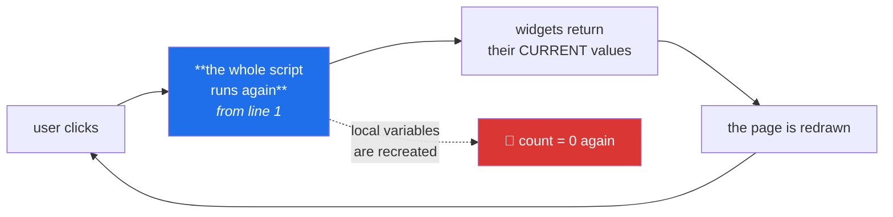

# Day 52 — Streamlit's execution model: why your counter resets

**Phase 7 · Module 7 · Streamlit** · ID: **APP-01** (basics and the script-rerun model)

> **Yesterday:** Phase 6 closed with ADR-004. Both databases are wired and guarded.
> **Today:** the first thing another person can click. Streamlit has exactly one surprising idea, and
> everything confusing about it follows from that idea — so you meet it head-on, on day one, with a
> counter that refuses to count.
> **Tomorrow:** widgets and layout.

```bash
./m start 52 && ./m scaffold 52
```

**Time:** 100 minutes. **Request budget:** 0 model calls.

---

## §1 The story

Here is a Streamlit app that does not work:

```python
count = 0
if st.button("increment"):
    count += 1
st.write(count)
```

Click the button. It shows `1`. Click again. It shows `1`. Click ten more times. Still `1`.

Nothing is broken. You have just met the one idea:

> **Every interaction re-runs your entire script, top to bottom, in a fresh Python scope.**

Not a callback. Not a partial update. The whole file, from line one, every single time. `count = 0`
executes again on every click, so the increment is always applied to zero.



Once that lands, the rest of Streamlit is obvious rather than mysterious:

- **Why is my app slow?** Because every click re-runs everything, including that `read_parquet`.
  → caching (Day 55).
- **Why did my variable reset?** Because it is a fresh scope.
  → `st.session_state` (Day 54).
- **Why did my widget's value change before my code ran?** Because a widget *returns* its current
  value during the rerun; it does not fire an event.
  → that is the model, and it is why the code reads top-to-bottom like a script.

**The mental model to hold:** a Streamlit script is not an event-driven UI. It is **a function from
(widget values) to (a page)**, run again whenever an input changes. That is a genuinely nice model —
your app has no hidden state machine, and the rendering code reads in the order it appears — and it
costs you exactly two things, which Days 54 and 55 fix.

One more piece of the model, because it explains the other class of confusion: **each browser session
gets its own script run and its own state.** Two tabs are two independent sessions. What they share is
whatever you put in a cache or a database.

---

## §2 Setup — run this

```bash
uv add "streamlit==1.62.0"
mkdir -p days/day-52/lab app
touch days/day-52/lab/rerun.py
touch app/Home.py
touch src/setu/app.py
touch tests/test_app.py
```

Pin whatever **your** Day-1 verify run reported.

- `app/` — the Streamlit application, separate from `src/setu/` (the library) and `scripts/` (batch
  jobs). Day 57 deploys this directory.
- `src/setu/app.py` — the **testable** logic behind the app. §5 explains why this split is the whole
  point.

Run the lab app with:

```bash
uv run streamlit run days/day-52/lab/rerun.py
```

It opens a browser tab. `Ctrl-C` in the terminal stops it.

---

## §3 APP-01 — the model, demonstrated

`days/day-52/lab/rerun.py`:

```python
"""APP-01: the rerun model, met head-on."""

from __future__ import annotations

import time
from datetime import datetime

import streamlit as st

st.set_page_config(page_title="Day 52 — the rerun model", layout="wide")

# --- module scope: this runs on EVERY interaction -------------------------
SCRIPT_STARTED = datetime.now().strftime("%H:%M:%S.%f")[:-3]
st.session_state.setdefault("runs", 0)
st.session_state["runs"] += 1

st.title("Why your counter resets")
st.caption(
    f"This script has run **{st.session_state['runs']}** times this session. "
    f"Most recent start: `{SCRIPT_STARTED}`"
)

# --- 1. the broken counter -------------------------------------------------
st.header("1. The counter that will not count")

count = 0                       # recreated from scratch on every rerun
if st.button("increment (broken)"):
    count += 1
st.write(f"count = **{count}**")
st.caption("Click it repeatedly. It never exceeds 1 — `count = 0` runs again every time.")

# --- 2. proof the whole script re-runs -------------------------------------
st.header("2. Proof")

st.write(f"Module-scope timestamp: `{SCRIPT_STARTED}`")
st.caption(
    "That timestamp is computed at the top of the file. Interact with anything below "
    "and watch it change — the whole file ran again."
)

st.selectbox("changing this re-runs everything", ["a", "b", "c"], key="demo_select")
st.slider("so does this", 0, 10, key="demo_slider")

# --- 3. widgets return values; they do not fire events ---------------------
st.header("3. A widget returns a value")

name = st.text_input("your name", value="")
st.write(f"`st.text_input` returned: `{name!r}`")
st.caption(
    "There is no onChange handler. During this rerun the widget simply *returned* "
    "its current value, and the code below it used that value. Top to bottom."
)

if st.button("press me"):
    st.write("`st.button` returned **True** — for this rerun only.")
else:
    st.write("`st.button` returned **False**.")
st.caption(
    "A button is True on the rerun caused by its own click, and False on every "
    "other rerun. It is not a flag you can read later."
)

# --- 4. the cost: everything re-runs, including the slow parts -------------
st.header("4. The cost")

slow_placeholder = st.empty()
start = time.perf_counter()
_ = sum(i * i for i in range(3_000_000))          # stands in for read_parquet
elapsed = time.perf_counter() - start
slow_placeholder.write(f"A 'slow computation' took **{elapsed * 1000:.0f} ms** — again.")
st.caption("Every click pays this. Day 55 makes it free with a cache.")

# --- 5. execution order is source order ------------------------------------
st.header("5. Order is source order")

placeholder = st.empty()
st.write("this line appears SECOND in the source…")
placeholder.write("…but this was written into a slot reserved FIRST.")
st.caption(
    "`st.empty()` reserves a slot you can fill later. It is the only way to write "
    "out of order, and it is how a progress area updates while work continues."
)

# --- 6. stopping early -----------------------------------------------------
st.header("6. st.stop()")

if st.checkbox("halt the script here"):
    st.warning("Everything below this line is not rendered. The rerun ended.")
    st.stop()

st.success("You only see this because the checkbox is unticked.")

# --- 7. sessions are isolated ---------------------------------------------
st.header("7. Sessions are isolated")
st.write(
    "Open this page in a second browser tab. Its run counter starts at 1: "
    "a separate session, separate state, separate script run."
)
```

**Line by line:**

- `st.set_page_config(...)` — **must be the first Streamlit call in the script**, and only called once.
  Anything else first raises. It is the one ordering rule Streamlit enforces.
- `SCRIPT_STARTED` at module scope — this is the proof. Module-level code is **not** run-once-at-import;
  it runs on every rerun. Watch the timestamp change when you move the slider.
- `st.session_state.setdefault("runs", 0)` — a preview of Day 54. `session_state` is the one place that
  survives a rerun, which is why the run counter works and the broken counter does not.
- `count = 0` then `if st.button(...): count += 1` — **the whole lesson in three lines.** The
  assignment re-executes every rerun, so the increment always applies to zero.
- `st.button` returns `True` **only on the rerun its own click caused**, and `False` on every rerun
  after. It is not a persistent flag. Trying to use one as a mode switch is the most common Streamlit
  bug after the counter, and Day 54 shows the correct pattern.
- `st.text_input` returning a value rather than firing a handler — this is why the script reads
  top-to-bottom. There is no hidden state machine and no callback ordering to reason about; the trade
  is that everything below re-executes.
- The slow computation — every click pays it. **Feel this now**; Day 55's `@st.cache_data` is much more
  persuasive after you have sat through a 300 ms delay on every interaction.
- `st.empty()` — reserves a slot in the output that you can fill later. Streamlit renders in **source
  order**, so this is the only way to write out of order, and it is how a progress area updates in
  place while work continues below it.
- `st.stop()` — ends the rerun immediately. Nothing below renders. This is how you guard an app on a
  missing input or a failed health check rather than letting it crash halfway down.
- The isolated-sessions note — two tabs are two sessions with independent state. Anything genuinely
  shared must live in a cache or a database.

---

## §4 The app skeleton

`app/Home.py` — small on purpose:

```python
"""Setu — the app entry point. Deployed on Day 57."""

from __future__ import annotations

import streamlit as st

from setu.app import render_health, render_intro
from setu.style import apply_house_style

st.set_page_config(page_title="Setu", page_icon="🌉", layout="wide")

apply_house_style()          # ONCE, at the entry point (Day 40)

render_intro()
render_health()
```

**Line by line:**

- `apply_house_style()` here and **nowhere else** — Day 40's rule. The entry point is the one place a
  global style change is legitimate, and a Streamlit script re-running means calling it per-component
  would reset rcParams on every interaction.
- `render_intro()` / `render_health()` — the app file **wires things together and nothing else.** All
  the logic lives in `src/setu/app.py`, which is the point of §5.

---

## §5 Build brief — `src/setu/app.py`

Layer 3. The rule that makes a Streamlit app testable at all.

> **You cannot unit-test a Streamlit page.** There is no DOM, no click, no assertion target. So the
> discipline is: **the app file only renders; every decision lives in a pure function you can test.**

```python
"""App-facing logic for Setu. Layer 3: imports db, mongo, plots, frames.

RULE: nothing in this module calls st.* except the render_* functions, which are
thin. Every DECISION is a pure function, tested in tests/test_app.py.
"""

from __future__ import annotations

from setu.errors import DataError

STATUS_COLOURS = {"ok": "🟢", "degraded": "🟡", "down": "🔴"}


def summarise_health(report: dict) -> dict:
    """TODO(me): turn database_report() (Day 51) into what the UI needs. PURE - no st.*

    Return {"status": "ok"|"degraded"|"down", "lines": [str, ...], "detail": {...}}
    - "ok"       both reachable
    - "degraded" exactly one reachable  (Mongo is replayable - ADR-004 - so Postgres
                 down is worse than Mongo down; say which in the lines)
    - "down"     neither reachable
    - each line is human-readable and includes the latency when known
    - must not raise, whatever shape the report is in
    """
    raise NotImplementedError


def format_latency(ms: float | None) -> str:
    """TODO(me): '42 ms', '1.3 s', or 'unknown' for None. Raise DataError if negative."""
    raise NotImplementedError


def paginate(total: int, *, page: int, per_page: int) -> dict:
    """TODO(me): pure pagination arithmetic for the UI.

    Return {"page", "pages", "start", "end", "has_prev", "has_next"} using 1-based
    pages and a 0-based `start` offset.
    - clamp `page` into range rather than raising (a stale URL should not 500)
    - total=0 gives pages=1, start=0, end=0, both has_* False
    - raise DataError if per_page < 1
    This is the arithmetic that Day 53's page controls and Day 49's find_page share.
    """
    raise NotImplementedError


def render_intro() -> None:
    """TODO(me): title, one-paragraph description, link to the plan. Thin: st.* only."""
    raise NotImplementedError


def render_health() -> None:
    """TODO(me): call database_report(), pass it through summarise_health, render it.

    - the ONLY logic here is choosing st.success / st.warning / st.error
    - if status is 'down', st.stop() after rendering: do not let the rest of a page
      run queries against a database that is not there (§3.6)
    """
    raise NotImplementedError
```

- `summarise_health` being pure — it takes a dict and returns a dict. **That is the testable seam.**
  `render_health` is three lines of `st.*` around it, and those three lines are not worth testing.
- `paginate` clamping rather than raising is a UI decision with a reason: a stale bookmark pointing at
  page 40 of a 3-page list should show page 3, not an error.
- The ADR-004 asymmetry appearing in `summarise_health` is the point of having written the ADR.
  Postgres down and Mongo down are **not** the same severity, and the UI should say so.

---

## §6 The eval that must be able to fail

`tests/test_app.py`:

```python
import pytest

from setu.app import format_latency, paginate, summarise_health
from setu.errors import DataError


def report(pg: bool, mg: bool, pg_ms: float = 12.0, mg_ms: float = 30.0) -> dict:
    return {
        "postgres": {"reachable": pg, "latency_ms": pg_ms if pg else None},
        "mongo": {"reachable": mg, "latency_ms": mg_ms if mg else None},
        "checked_at": "2026-08-21T00:00:00Z",
    }


def test_both_up_is_ok():
    assert summarise_health(report(True, True))["status"] == "ok"


@pytest.mark.parametrize(("pg", "mg"), [(True, False), (False, True)])
def test_one_down_is_degraded(pg, mg):
    assert summarise_health(report(pg, mg))["status"] == "degraded"


def test_both_down_is_down():
    assert summarise_health(report(False, False))["status"] == "down"


def test_postgres_down_is_described_as_worse_than_mongo_down():
    """ADR-004: Postgres is the source of truth; Mongo is replayable."""
    pg_down = " ".join(summarise_health(report(False, True))["lines"]).lower()
    mg_down = " ".join(summarise_health(report(True, False))["lines"]).lower()
    assert "source of truth" in pg_down or "postgres" in pg_down
    assert pg_down != mg_down, "both single-failure cases produced identical text"


def test_health_lines_include_latency():
    lines = " ".join(summarise_health(report(True, True))["lines"])
    assert "12" in lines


def test_summarise_health_never_raises_on_a_malformed_report():
    for bad in ({}, {"postgres": {}}, {"postgres": None, "mongo": None}, {"x": 1}):
        result = summarise_health(bad)
        assert result["status"] in {"ok", "degraded", "down"}


def test_summarise_health_is_pure():
    """No st.* in the decision layer."""
    import inspect

    source = inspect.getsource(summarise_health)
    assert "st." not in source, "the decision function touches Streamlit"


@pytest.mark.parametrize(
    ("ms", "expected"),
    [(42.0, "42 ms"), (999.0, "999 ms"), (1300.0, "1.3 s"), (None, "unknown")],
)
def test_format_latency(ms, expected):
    assert format_latency(ms) == expected


def test_format_latency_rejects_negative():
    with pytest.raises(DataError):
        format_latency(-1.0)


def test_paginate_middle_page():
    out = paginate(100, page=3, per_page=10)
    assert out == {"page": 3, "pages": 10, "start": 20, "end": 30,
                   "has_prev": True, "has_next": True}


def test_paginate_first_and_last():
    first = paginate(100, page=1, per_page=10)
    assert first["has_prev"] is False and first["has_next"] is True
    last = paginate(100, page=10, per_page=10)
    assert last["has_prev"] is True and last["has_next"] is False


def test_paginate_partial_last_page():
    out = paginate(95, page=10, per_page=10)
    assert out["pages"] == 10 and out["start"] == 90 and out["end"] == 95


def test_paginate_clamps_a_stale_page():
    """A bookmark pointing at page 40 of a 3-page list must not 500."""
    assert paginate(25, page=40, per_page=10)["page"] == 3
    assert paginate(25, page=0, per_page=10)["page"] == 1
    assert paginate(25, page=-5, per_page=10)["page"] == 1


def test_paginate_empty():
    out = paginate(0, page=1, per_page=10)
    assert out == {"page": 1, "pages": 1, "start": 0, "end": 0,
                   "has_prev": False, "has_next": False}


def test_paginate_rejects_a_bad_page_size():
    with pytest.raises(DataError):
        paginate(10, page=1, per_page=0)


def test_app_entry_point_is_thin():
    """app/Home.py wires things together; it must not contain logic."""
    from pathlib import Path

    source = Path("app/Home.py").read_text(encoding="utf-8")
    code = [
        line for line in source.splitlines()
        if line.strip() and not line.strip().startswith(("#", '"', "'"))
    ]
    assert len(code) < 20, f"app/Home.py has {len(code)} code lines - move logic to setu.app"
    for banned in ("def ", "for ", "while ", "try:"):
        assert banned not in source, f"'{banned.strip()}' in the entry point - move it to setu.app"


def test_style_is_applied_once_at_the_entry_point():
    from pathlib import Path

    assert "apply_house_style()" in Path("app/Home.py").read_text(encoding="utf-8")
    offenders = [
        str(p) for p in Path("src/setu").rglob("*.py")
        if p.name != "style.py" and "apply_house_style()" in p.read_text(encoding="utf-8")
    ]
    assert not offenders, f"house style applied outside the entry point: {offenders}"


def test_no_module_level_work_in_the_app_package():
    """Module scope re-runs on every interaction (§3). Nothing expensive there."""
    from pathlib import Path

    banned = ("read_parquet(", "read_csv(", "connection()", "MongoClient(")
    offenders = [
        f"{p.name}:{i}"
        for p in Path("app").rglob("*.py")
        for i, line in enumerate(p.read_text(encoding="utf-8").splitlines(), 1)
        if any(b in line for b in banned) and "noqa" not in line
    ]
    assert not offenders, f"expensive work at module scope: {offenders}"
```

**Line by line:**

- `test_summarise_health_is_pure` — **the day's real assessment**, and it is an architecture test. It
  reads the function's own source and asserts no `st.` appears. The moment a decision function calls
  `st.error`, it stops being testable, and every test in this file becomes impossible to write. This
  guard is what keeps the seam intact for the next five days.
- `test_postgres_down_is_described_as_worse_than_mongo_down` — the ADR-004 asymmetry, surfaced in the
  UI. An implementation returning the same text for both single-failure cases passes the status tests
  and fails this one, and it would be actively misleading during an incident.
- `test_summarise_health_never_raises_on_a_malformed_report` — four differently-broken inputs. A status
  panel that throws when the thing it monitors is broken is worse than no status panel.
- `test_paginate_clamps_a_stale_page` — three cases including page `0` and `-5`. Clamping is a
  deliberate UI decision (a bookmark should not 500), and it needs testing in both directions.
- `test_app_entry_point_is_thin` — counts non-comment lines and bans `def`, `for`, `while`, `try`.
  **This is the rule that makes the whole phase testable**, enforced mechanically rather than by good
  intentions. Days 53–57 all add to `setu.app` rather than to `Home.py` because of this test.
- `test_no_module_level_work_in_the_app_package` — §3's lesson as a guard. A `read_parquet` at module
  scope in a Streamlit file runs on **every single interaction**.
- `test_style_is_applied_once_at_the_entry_point` — Day 40's rule, now with a Streamlit-specific edge:
  calling it per-component would reset rcParams on every rerun.

```bash
uv run python -m pytest tests/test_app.py -v
```

---

## §7 Request budget

| Resource | Spent today |
|---|---|
| LLM calls | **0** |
| Network | one `uv add` resolution |
| Databases | one health check per page load |

---

## §8 Traps

- **Expecting a local variable to persist.** Fresh scope every rerun. That is Day 54.
- **Treating `st.button` as a flag.** `True` only on its own rerun, `False` after.
- **Expensive work at module scope.** Runs on every interaction. That is Day 55.
- **`st.set_page_config` not first.** It raises.
- **Expecting an onChange callback.** Widgets return values; the script re-runs.
- **Assuming module-level code runs once.** It does not.
- **Logic in the app file.** Untestable. Put decisions in `setu.app`.
- **Assuming two tabs share state.** Separate sessions entirely.
- **Rendering out of order without `st.empty()`.** Source order is render order.
- **Letting a page continue when a database is down.** `st.stop()` and say so.
- **Calling `apply_house_style()` inside a component.** Re-applied on every rerun.

---

## §9 Verify before you code

Written **2026-08-21**:

- <https://docs.streamlit.io/develop/concepts/architecture/run-your-app> — the rerun model, from the
  maintainers.
- <https://docs.streamlit.io/develop/concepts/architecture/session-state> — session isolation
  (Day 54 in full).
- <https://docs.streamlit.io/develop/api-reference/control-flow/st.stop> — early exit.
- <https://docs.streamlit.io/develop/api-reference/configuration/st.set_page_config> — the
  must-be-first rule.

---

## §10 Say it in an interview

> "Streamlit has one surprising idea and everything else follows from it: every interaction re-runs
> the whole script top to bottom in a fresh scope. So a local counter never increments — the
> assignment re-executes — and a button returns True only on the rerun its own click caused, which is
> why treating it as a flag is the second bug everyone hits. Once you have that, the app is a pure
> function from widget values to a page, with no hidden state machine. The discipline I put on top is
> that the Streamlit file only renders and every decision lives in a pure function I can test —
> there's an architecture test that reads the decision function's source and fails if it contains
> `st.`, plus one that caps the entry point at twenty lines and bans `def` and `for` in it. Without
> that seam there is nothing to assert against, because you can't unit-test a page."

---

## §11 Done when

Tick [`CHECKLIST.md`](CHECKLIST.md), then `./m check && ./m done 52`.
