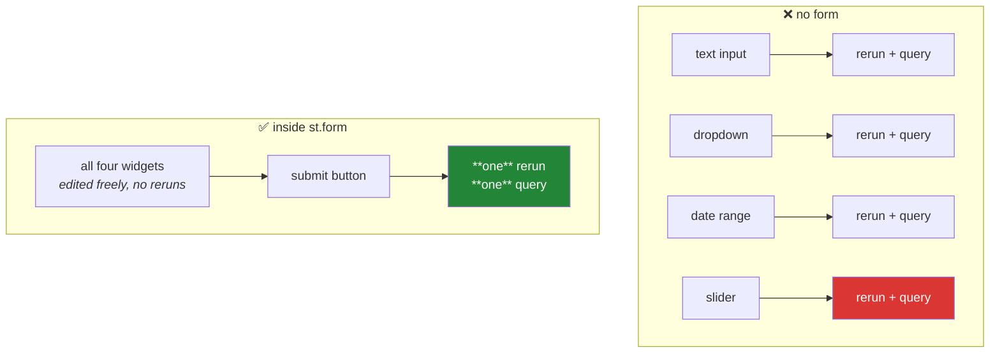

# Day 53 — Widgets, forms, and layout

**Phase 7 · Module 7** · IDs: **APP-02** (input widgets, upload, forms), **APP-03** (columns, tabs, sidebar, containers, fragments)

> **Yesterday:** the rerun model, and the counter that would not count.
> **Today:** the inputs — and the one widget that changes the rerun model rather than living inside
> it. `st.form` is not a layout container; it is a **batching** mechanism, and knowing that is the
> difference between an app that fires eight queries and one that fires one.
> **Tomorrow:** `session_state`.

```bash
./m start 53 && ./m scaffold 53
```

**Time:** 110 minutes. **Request budget:** 0 model calls.

---

## §1 The story

Every widget triggers a rerun. That is Day 52, and for a single dropdown it is fine.

Now build a search panel: a text box, two dropdowns, a date range and a slider. The user fills them
in one at a time — and **each keystroke and each selection re-runs your whole script**, which means
your database query runs six times to answer one question. On a free tier that is six round trips per
search, and it is visibly laggy.

`st.form` solves exactly this:



**Inside a form, widgets do not trigger reruns.** They hold their values locally until the submit
button is pressed, and then everything arrives at once. That is a change to the execution model, not
a box with a border — and it is why a form is the right answer whenever the *result* of the inputs is
expensive.

The layout half is simpler but has one thing worth stating: **layout containers are just places to
put things, and they do not affect execution.** Everything in every tab renders on every rerun, even
the tabs you cannot see. A tab is not lazy. If you put an expensive query behind a tab expecting it
to run only when opened, it runs every time.

`st.fragment` is the exception, and it is the second real idea today: a fragment re-runs **on its own**
without re-running the rest of the script. That is the fix for a widget that must be responsive
sitting next to a section that is slow.

---

## §2 Setup — run this

```bash
mkdir -p days/day-53/lab
touch days/day-53/lab/widgets.py
```

`src/setu/app.py` and `tests/test_app.py` grow today. No new packages.

---

## §3 APP-02 — widgets and forms

`days/day-53/lab/widgets.py`:

```python
"""APP-02 / APP-03: widgets, forms, layout, fragments."""

from __future__ import annotations

import time
from datetime import date

import pandas as pd
import streamlit as st

st.set_page_config(page_title="Day 53 — widgets & layout", layout="wide")
st.session_state.setdefault("query_count", 0)


def fake_query(label: str) -> int:
    """Stands in for a database round trip, so you can COUNT them."""
    st.session_state["query_count"] += 1
    time.sleep(0.15)
    return st.session_state["query_count"]


# --- 1. the widget catalogue ----------------------------------------------
st.header("1. Widgets return values")

left, right = st.columns(2)
with left:
    text = st.text_input("title contains", placeholder="attention")
    number = st.number_input("minimum citations", min_value=0, max_value=100_000, value=0, step=100)
    picked = st.selectbox("venue", ["any", "NeurIPS", "ICML", "ACL"])
    multi = st.multiselect("categories", ["cs.CL", "cs.LG", "cs.CV"], default=["cs.CL"])
with right:
    years = st.slider("year range", 2010, 2026, (2018, 2024))
    when = st.date_input("published after", value=date(2020, 1, 1))
    open_only = st.checkbox("open access only")
    mode = st.radio("sort by", ["citations", "year", "title"], horizontal=True)

st.write(
    {"text": text, "number": number, "venue": picked, "categories": multi,
     "years": years, "after": str(when), "open_only": open_only, "sort": mode}
)
st.caption("Change any one of these. The whole dict re-renders — one rerun per change.")


# --- 2. the cost, counted -------------------------------------------------
st.header("2. Every widget is a rerun")

st.metric("simulated queries this session", st.session_state["query_count"])
if st.button("run a query outside a form"):
    fake_query("loose")
st.caption(
    "Now imagine that query running unconditionally below eight widgets. "
    "Eight edits, eight queries, one question."
)


# --- 3. the form ----------------------------------------------------------
st.header("3. st.form batches them")

with st.form("search"):
    st.text_input("title contains", key="f_title")
    st.selectbox("venue", ["any", "NeurIPS", "ICML"], key="f_venue")
    st.slider("year range", 2010, 2026, (2018, 2024), key="f_years")
    st.number_input("minimum citations", 0, 100_000, 0, key="f_min")
    submitted = st.form_submit_button("search")

if submitted:
    fake_query("form")
    st.success(f"one query fired. total: {st.session_state['query_count']}")
else:
    st.info("Edit the fields above — nothing reruns until you press search.")

st.caption(
    "Inside a form, widgets do NOT trigger reruns. Four inputs, one round trip. "
    "This is an execution-model change, not a border."
)


# --- 4. what a form cannot do --------------------------------------------
st.header("4. The form's trade-off")

st.write(
    "Because nothing reruns until submit, a form **cannot** react to its own inputs — "
    "no 'show this field only when that dropdown says X'. If you need that, you need "
    "reruns, which means no form."
)
st.caption("st.form_submit_button is the only button allowed inside a form.")


# --- 5. file upload -------------------------------------------------------
st.header("5. File upload")

uploaded = st.file_uploader("a CSV of papers", type=["csv"], accept_multiple_files=False)
if uploaded is not None:
    st.write(f"name={uploaded.name} size={uploaded.size:,} bytes type={uploaded.type}")
    frame = pd.read_csv(uploaded, dtype={"paper_id": "str"}, nrows=100)
    st.dataframe(frame.head(), use_container_width=True)
    st.caption(
        "Note dtype= and nrows= — Day 27's rules do not stop applying because a "
        "human chose the file. An uploaded file is UNTRUSTED input."
    )
else:
    st.caption("Uploads live in memory. Streamlit Community Cloud has a size cap; check Day 57.")


# --- 6. layout ------------------------------------------------------------
st.header("6. Layout containers")

with st.sidebar:
    st.subheader("filters")
    st.slider("sidebar slider", 0, 10, 5)
    st.caption("The sidebar is for controls that apply to the WHOLE page.")

a, b, c = st.columns([2, 1, 1])
a.metric("papers", "20,431")
b.metric("venues", "4")
c.metric("mean citations", "1,204", delta="+3.2%")

tab1, tab2, tab3 = st.tabs(["overview", "detail", "expensive"])
with tab1:
    st.write("Tab content renders on every rerun…")
with tab2:
    st.write("…including this one, which you cannot see.")
with tab3:
    st.write(f"and this: fake_query would run here too. count={st.session_state['query_count']}")

st.caption(
    "⚠️ Tabs are NOT lazy. Everything in every tab executes on every rerun. "
    "Putting an expensive query behind a tab does not defer it."
)

with st.expander("an expander (also not lazy)"):
    st.write("Same rule. The content runs whether or not it is open.")

with st.container(border=True):
    st.write("A container groups things visually and changes nothing about execution.")


# --- 7. fragments ---------------------------------------------------------
st.header("7. st.fragment — the exception")


@st.fragment
def live_filter() -> None:
    value = st.slider("this slider reruns ONLY this fragment", 0, 100, 50, key="frag")
    st.write(f"value = {value}")
    st.caption(f"page-level query count is still {st.session_state['query_count']}")


live_filter()
st.caption(
    "Move the fragment slider: the query count does not change, because the rest of "
    "the script did not re-run. That is how you keep one control responsive next to "
    "a slow section."
)
```

**Line by line:**

- `fake_query` incrementing a counter — **this is the instrument.** You cannot feel the difference
  between six queries and one; you can read a number. Everything today is measured against it.
- `st.slider("year range", 2010, 2026, (2018, 2024))` — a **tuple** default makes it a range slider
  returning a tuple. One argument, two handles.
- `st.radio(..., horizontal=True)` — for three or fewer options, a horizontal radio reads better than a
  dropdown because every option is visible without a click.
- `with st.form("search"):` — **the execution-model change.** Widgets inside hold their values locally
  and fire nothing. `st.form_submit_button` returns `True` on the rerun its press caused, exactly like
  a normal button (Day 52).
- `key="f_title"` on form widgets — the key is how you reach the value from `session_state` (Day 54).
  Inside a form the return values are also available directly; keys become essential tomorrow.
- **§4, the trade-off** — a form cannot react to its own inputs. "Show the sub-category dropdown only
  when a category is chosen" requires a rerun per change, which is precisely what a form suppresses.
  This is the reason forms are not simply always correct, and it is the thing people discover after
  building one.
- `st.file_uploader` returning `None` until something is uploaded — always guard with
  `if uploaded is not None`.
- `pd.read_csv(uploaded, dtype=..., nrows=100)` — **Day 27's rules still apply.** A human choosing the
  file does not make it trustworthy; an uploaded CSV is untrusted input, and `nrows` caps what a
  hostile or accidental 2 GB file can do to your memory.
- `st.columns([2, 1, 1])` — relative widths. Note `a.metric(...)` works as well as `with a:` — every
  container is both a context manager and an object with the same methods.
- **The tabs caption is the important one.** Tabs are not lazy. Every tab's body executes on every
  rerun, including tabs nobody has clicked. The same is true of `st.expander`. Putting a slow query
  behind a collapsed expander defers nothing.
- `@st.fragment` — the decorator (Day 14!) that makes a function re-run **independently**. Move the
  fragment's slider and the page-level query count stays put, because the outer script did not run.
  This is the tool for a responsive control next to an expensive section, and it is the only way to
  get partial reruns.

---

## §4 Build brief

Extend `src/setu/app.py`:

```python
from dataclasses import dataclass

VENUES = ("any", "NeurIPS", "ICML", "ACL", "EMNLP")
SORT_FIELDS = ("citations", "year", "title")
MAX_UPLOAD_MB = 5


@dataclass(frozen=True)
class SearchSpec:
    """What the search form produces. Frozen: a spec is a value, not a mutable form."""
    title: str = ""
    venue: str = "any"
    year_from: int = 2010
    year_to: int = 2026
    min_citations: int = 0
    sort_by: str = "citations"
    descending: bool = True


def validate_spec(spec: SearchSpec) -> SearchSpec:
    """TODO(me): validate and NORMALISE. PURE - no st.*

    - strip the title; collapse whitespace (reuse setu.text)
    - raise DataError if venue not in VENUES, or sort_by not in SORT_FIELDS
    - raise DataError if year_from > year_to, naming both
    - raise DataError if min_citations < 0
    - clamp years into 1900..2100 rather than raising (a slider cannot exceed its range,
      but a URL parameter can)
    - return a NEW SearchSpec; the input is frozen
    """
    raise NotImplementedError


def spec_to_filters(spec: SearchSpec) -> tuple[dict, dict]:
    """TODO(me): turn a validated spec into (sql_filters, mongo_filter). PURE.

    - sql_filters feeds Day 47's build_select: every value a bind parameter
    - mongo_filter is a plain dict (Day 49), and must pass assert_safe_filter
    - venue='any' means NO venue clause at all, not venue='any'
    - an empty title means no title clause
    - this is the seam that makes the search panel testable without a database
    """
    raise NotImplementedError


def describe_spec(spec: SearchSpec) -> str:
    """TODO(me): a one-line human summary: 'NeurIPS papers 2018-2024 with 100+ citations'.

    - omit clauses that are at their default ('any venue', 0 citations)
    - this is what the results header shows, so a user can see what they asked for
    """
    raise NotImplementedError


def check_upload(name: str, size_bytes: int, *, max_mb: int = MAX_UPLOAD_MB) -> None:
    """TODO(me): raise DataError on an unacceptable upload. PURE - takes facts, not a file.

    - suffix must be .csv or .parquet
    - size must be under max_mb, with the actual size in the message
    - reject a name containing a path separator or '..' (an uploaded filename is
      attacker-controlled; never build a path from it without checking)
    - taking (name, size) rather than the file object is what makes this testable
    """
    raise NotImplementedError


def render_search_form() -> SearchSpec | None:
    """TODO(me): the form from §3. Returns a validated spec on submit, else None.

    - all inputs inside ONE st.form so a search is one rerun
    - on a DataError, st.error the message and return None
    - thin: st.* plus a call to validate_spec
    """
    raise NotImplementedError
```

- `SearchSpec` being a **frozen dataclass** (Day 19) rather than a dict is what lets `validate_spec`
  and `spec_to_filters` be tested without Streamlit, without a browser and without a database.
- `check_upload` taking `(name, size)` rather than a file object is the same trick: the decision is
  pure, the file handling is three lines in the renderer.
- The path-separator check is not paranoia — **an uploaded filename is attacker-controlled**, and
  `../../etc/something` is the oldest trick there is.

---

## §5 The eval that must be able to fail

Add to `tests/test_app.py`:

```python
from setu.app import (
    MAX_UPLOAD_MB,
    SearchSpec,
    check_upload,
    describe_spec,
    spec_to_filters,
    validate_spec,
)


def test_validate_normalises_the_title():
    spec = validate_spec(SearchSpec(title="  attention   is  "))
    assert spec.title == "attention is"


def test_validate_returns_a_new_spec():
    original = SearchSpec(title=" x ")
    result = validate_spec(original)
    assert result is not original
    assert original.title == " x ", "the input spec was mutated"


def test_validate_rejects_an_unknown_venue():
    with pytest.raises(DataError):
        validate_spec(SearchSpec(venue="Nature"))


def test_validate_rejects_an_unknown_sort_field():
    with pytest.raises(DataError):
        validate_spec(SearchSpec(sort_by="relevance"))


def test_validate_rejects_reversed_years():
    with pytest.raises(DataError) as info:
        validate_spec(SearchSpec(year_from=2024, year_to=2018))
    message = str(info.value)
    assert "2024" in message and "2018" in message


def test_validate_rejects_negative_citations():
    with pytest.raises(DataError):
        validate_spec(SearchSpec(min_citations=-1))


def test_validate_clamps_out_of_range_years():
    """A slider cannot exceed its range; a URL parameter can."""
    spec = validate_spec(SearchSpec(year_from=1200, year_to=3000))
    assert spec.year_from == 1900 and spec.year_to == 2100


def test_any_venue_produces_no_clause():
    sql_filters, mongo_filter = spec_to_filters(validate_spec(SearchSpec(venue="any")))
    assert "venue" not in sql_filters
    assert not any("venue" in key for key in mongo_filter)


def test_a_named_venue_produces_a_clause():
    sql_filters, mongo_filter = spec_to_filters(validate_spec(SearchSpec(venue="ICML")))
    assert sql_filters.get("venue") == "ICML"
    assert "ICML" in str(mongo_filter)


def test_an_empty_title_produces_no_clause():
    sql_filters, _ = spec_to_filters(validate_spec(SearchSpec(title="")))
    assert "title" not in sql_filters


def test_mongo_filter_passes_the_safety_check():
    from setu.mongo import assert_safe_filter

    _, mongo_filter = spec_to_filters(validate_spec(SearchSpec(venue="ICML", min_citations=10)))
    assert_safe_filter(mongo_filter, trusted=True)


def test_filters_never_contain_raw_sql():
    """Day 47: values are parameters, never text."""
    spec = validate_spec(SearchSpec(title="x' OR '1'='1"))
    sql_filters, _ = spec_to_filters(spec)
    assert sql_filters["title"] == "x' OR '1'='1", "the value was mangled instead of bound"


def test_describe_omits_defaults():
    text = describe_spec(validate_spec(SearchSpec()))
    assert "any" not in text.lower()
    assert "0 " not in text


def test_describe_includes_what_was_set():
    text = describe_spec(
        validate_spec(SearchSpec(venue="ICML", year_from=2018, year_to=2024, min_citations=100))
    )
    for fragment in ("ICML", "2018", "2024", "100"):
        assert fragment in text


@pytest.mark.parametrize("name", ["papers.csv", "papers.parquet", "UPPER.CSV"])
def test_upload_accepts_valid_names(name):
    check_upload(name, 1024)


@pytest.mark.parametrize("name", ["papers.txt", "papers.exe", "papers", "papers.csv.exe"])
def test_upload_rejects_bad_suffixes(name):
    with pytest.raises(DataError):
        check_upload(name, 1024)


def test_upload_rejects_an_oversized_file():
    with pytest.raises(DataError) as info:
        check_upload("papers.csv", (MAX_UPLOAD_MB + 1) * 1024 * 1024)
    assert str(MAX_UPLOAD_MB) in str(info.value)


@pytest.mark.parametrize(
    "name", ["../../etc/passwd.csv", "a/b.csv", "a\\b.csv", "..\\..\\x.csv"]
)
def test_upload_rejects_a_path_in_the_filename(name):
    with pytest.raises(DataError):
        check_upload(name, 1024)


def test_search_functions_are_pure():
    import inspect

    for fn in (validate_spec, spec_to_filters, describe_spec, check_upload):
        assert "st." not in inspect.getsource(fn), f"{fn.__name__} touches Streamlit"


def test_the_search_form_is_a_single_form():
    """Eight widgets outside a form is eight reruns and eight queries."""
    import inspect

    from setu.app import render_search_form

    source = inspect.getsource(render_search_form)
    assert source.count("st.form(") == 1, "the inputs are not batched into one form"
    assert "form_submit_button" in source


def test_no_expensive_work_behind_tabs():
    """Tabs are not lazy (§3.6)."""
    from pathlib import Path

    for path in list(Path("app").rglob("*.py")) + [Path("src/setu/app.py")]:
        source = path.read_text(encoding="utf-8")
        if "st.tabs(" not in source:
            continue
        after = source.split("st.tabs(", 1)[1]
        for banned in ("query(", "aggregate(", "read_parquet("):
            assert banned not in after or "cache" in after, (
                f"{path.name}: expensive call after st.tabs and no cache in sight"
            )
```

**Line by line:**

- `test_validate_clamps_out_of_range_years` — a slider **cannot** produce 3000, so why validate? Because
  the spec will eventually arrive from a URL query parameter or a saved bookmark, and defensive
  validation at the boundary is cheaper than discovering it later. Clamping rather than raising is the
  same UI decision as Day 52's `paginate`.
- `test_any_venue_produces_no_clause` — **the day's real assessment.** The sentinel `"any"` must become
  *the absence of a clause*, not `venue = 'any'`. An implementation that passes the sentinel through
  returns zero rows and looks like an empty database, which is a genuinely confusing bug to chase.
- `test_filters_never_contain_raw_sql` — asserts the hostile string is passed **through unchanged** as
  a value. This is subtle and deliberate: the fix is not to sanitise it, it is to bind it (Day 47). A
  helper that strips quotes is doing the wrong thing correctly.
- `test_upload_rejects_a_path_in_the_filename` — four cases including Windows separators. An uploaded
  filename is attacker-controlled and `papers.csv.exe` in the suffix test covers the double-extension
  trick.
- `test_search_functions_are_pure` — the architecture guard from Day 52, extended to today's four
  functions. It is what keeps this entire test file possible.
- `test_the_search_form_is_a_single_form` — reads the renderer's source and asserts exactly **one**
  `st.form(`. Two forms means two submits and two round trips; zero forms means one per widget. This
  is §1's whole argument, enforced.
- `test_no_expensive_work_behind_tabs` — crude, and it catches the real mistake: someone putting a
  query inside a tab body believing it will only run when the tab is opened.

```bash
uv run python -m pytest tests/test_app.py -v
```

---

## §6 Request budget

| Resource | Spent today |
|---|---|
| LLM calls | **0** |
| Simulated queries | counted on screen — the point of the lab |

---

## §7 Traps

- **Eight loose widgets above an expensive call.** Eight reruns, eight round trips. Use a form.
- **Expecting a form to react to its own inputs.** It cannot; that is the trade.
- **A normal `st.button` inside a form.** Only `st.form_submit_button` is allowed.
- **Believing tabs are lazy.** Every tab body runs on every rerun.
- **Believing an expander is lazy.** Same.
- **`pd.read_csv(uploaded)` with no `dtype` or `nrows`.** Untrusted input; Day 27 still applies.
- **Building a path from an uploaded filename.** Attacker-controlled.
- **Passing a `"any"` sentinel into a query.** It must mean *no clause*.
- **Sanitising a value instead of binding it.** Bind it (Day 47).
- **Logic inside the renderer.** Untestable. Day 52's rule.
- **Reaching for a fragment before a form.** A form removes the reruns; a fragment only narrows them.

---

## §8 Verify before you code

Written **2026-08-21**:

- <https://docs.streamlit.io/develop/concepts/architecture/forms> — the batching semantics and the
  submit-button rule.
- <https://docs.streamlit.io/develop/concepts/architecture/fragments> — what re-runs and what does not.
- <https://docs.streamlit.io/develop/api-reference/layout> — columns, tabs, containers.
- <https://docs.streamlit.io/develop/api-reference/widgets/st.file_uploader> — size limits and the
  `UploadedFile` object.

---

## §9 Say it in an interview

> "The thing worth knowing is that `st.form` isn't a layout container, it's a change to the execution
> model: widgets inside it don't trigger reruns, so a six-field search panel is one round trip instead
> of six. On a free-tier database that's the difference between usable and laggy. The trade is that a
> form can't react to its own inputs — no conditional fields — so it's the right answer when the
> *result* is expensive and the wrong one when the *form* is dynamic. The other thing people get wrong
> is assuming tabs are lazy; every tab body executes on every rerun whether or not it's visible, so
> hiding a slow query behind a tab defers nothing. And all the search logic is pure functions over a
> frozen spec dataclass — validation, filter construction, the human-readable summary — so I can test
> the whole search panel with no browser and no database."

---

## §10 Done when

Tick [`CHECKLIST.md`](CHECKLIST.md), then `./m check && ./m done 53`.
