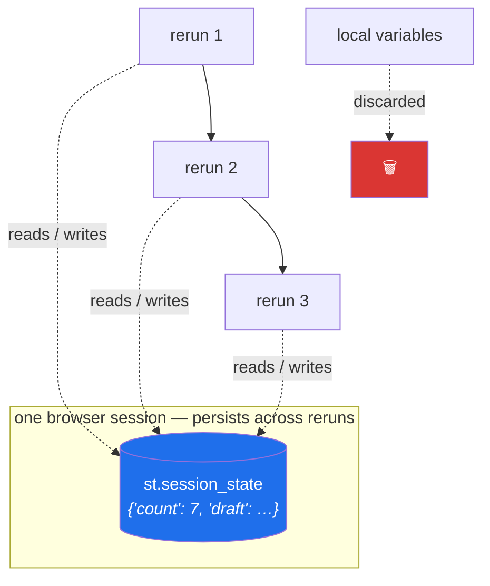

# Day 54 — `st.session_state`: the thing that survives a rerun

**Phase 7 · Module 7** · ID: **APP-04** (session state and multi-step flows)

> **Yesterday:** widgets, forms, and the query counter.
> **Today:** the fix for Day 52's counter — and the pattern behind it, because on **Day 199** you will
> build a human approval gate on exactly this shape: show a draft, hold it across reruns, act only
> when a person says so.
> **Tomorrow:** caching.

```bash
./m start 54 && ./m scaffold 54
```

**Time:** 110 minutes. **Request budget:** 0 model calls.

---

## §1 The story

Day 52's counter fails because `count = 0` re-executes on every rerun. `st.session_state` is a dict
that **does not** re-execute — it lives outside your script, keyed to one browser session, and
survives until the tab closes.

```python
st.session_state.setdefault("count", 0)
if st.button("increment"):
    st.session_state["count"] += 1
st.write(st.session_state["count"])
```

Now it counts.



Three things about it that are not obvious:

**1. Widget keys write into it automatically.** `st.slider("x", key="threshold")` puts the slider's
value in `st.session_state["threshold"]`. You do not have to store it yourself, and you can read it
anywhere in the script — including *above* the widget, which is occasionally exactly what you need.

**2. It is per-session, not global.** Two tabs are two dictionaries. Nothing here is shared, and
nothing here survives a page refresh in some browsers or a server restart. **It is not storage.** If
it must outlive the session, it goes in Postgres.

**3. The callback pattern.** `on_click=` runs a function **before** the rerun that follows the click.
That ordering matters and it is the fix for the most common `session_state` bug — reading a value on
the same rerun in which you set it, and getting the old one.

The reason this day matters more than "here is a dict": **a multi-step flow is the shape of a human
approval gate.** Draft → review → approve is exactly Day 199's `interrupt()` and Day 232's publish
gate, at a smaller scale and with no LangGraph involved. Build it here, recognise it there.

---

## §2 Setup — run this

```bash
mkdir -p days/day-54/lab
touch days/day-54/lab/state.py
```

`src/setu/app.py` and `tests/test_app.py` grow today. No new packages.

---

## §3 APP-04 — session state

`days/day-54/lab/state.py`:

```python
"""APP-04: session_state, widget keys, callbacks, and a multi-step flow."""

from __future__ import annotations

from datetime import datetime

import streamlit as st

st.set_page_config(page_title="Day 54 — session state", layout="wide")

# --- 1. the counter, fixed ------------------------------------------------
st.header("1. The counter, fixed")

st.session_state.setdefault("count", 0)
if st.button("increment"):
    st.session_state["count"] += 1
st.write(f"count = **{st.session_state['count']}**")
st.caption("`setdefault` initialises once; the value survives every rerun after.")

col_a, col_b = st.columns(2)
col_a.code("count = 0\nif st.button(...):\n    count += 1", language="python")
col_b.code(
    "st.session_state.setdefault('count', 0)\n"
    "if st.button(...):\n    st.session_state['count'] += 1",
    language="python",
)


# --- 2. what is in there --------------------------------------------------
st.header("2. Inspecting it")

st.slider("a slider with a key", 0, 100, 50, key="threshold")
st.text_input("a text box with a key", key="note")

st.write("Every widget with a `key=` writes into session_state automatically:")
st.json({k: str(v) for k, v in st.session_state.items()}, expanded=False)
st.caption(
    "Note `threshold` and `note` appeared without you assigning them. "
    "You can read them anywhere in the script — including above the widget."
)


# --- 3. the ordering trap -------------------------------------------------
st.header("3. The ordering trap")


def _bump_wrong() -> None:
    st.session_state["wrong_log"] = f"set at {datetime.now():%H:%M:%S.%f}"[:-3]


st.session_state.setdefault("wrong_log", "not set yet")

st.write(f"read BEFORE the button: `{st.session_state['wrong_log']}`")
if st.button("set the value (no callback)"):
    _bump_wrong()
    st.write(f"read AFTER setting: `{st.session_state['wrong_log']}`")
st.caption(
    "The 'before' line shows the value from the PREVIOUS rerun, because it executed "
    "before the button did. On the next rerun it catches up. This is the most common "
    "session_state confusion, and it is just source order."
)

st.button("set it with on_click", on_click=_bump_wrong, key="cb_button")
st.caption(
    "`on_click` runs BEFORE the rerun, so by the time line 1 of the script executes, "
    "the value is already updated. That is the fix."
)


# --- 4. widget key vs stored value ---------------------------------------
st.header("4. A widget key IS the stored value")

if st.button("set the slider to 90 programmatically"):
    st.session_state["threshold"] = 90
    st.rerun()

st.write(f"threshold is currently **{st.session_state['threshold']}**")
st.caption(
    "Assigning to a widget's key changes the widget. `st.rerun()` forces an immediate "
    "rerun so the new value is drawn. Careful: you cannot assign to a key AND pass "
    "`value=` to the same widget — Streamlit raises."
)


# --- 5. the multi-step flow: draft -> review -> approve -------------------
st.header("5. Draft → review → approve")
st.caption("This is Day 199's human-in-the-loop gate, without LangGraph.")

st.session_state.setdefault("stage", "compose")
st.session_state.setdefault("draft", "")
st.session_state.setdefault("published", [])

stage = st.session_state["stage"]
st.write(f"stage: **{stage}**")

if stage == "compose":
    with st.form("compose"):
        text = st.text_area("draft a claim about a paper", height=100)
        if st.form_submit_button("propose"):
            if not text.strip():
                st.error("a draft cannot be empty")
            else:
                st.session_state["draft"] = text.strip()
                st.session_state["stage"] = "review"
                st.rerun()

elif stage == "review":
    st.info(st.session_state["draft"])
    approve, edit, reject = st.columns(3)
    if approve.button("✅ approve", use_container_width=True):
        st.session_state["published"].append(st.session_state["draft"])
        st.session_state["draft"] = ""
        st.session_state["stage"] = "compose"
        st.rerun()
    if edit.button("✏️ edit", use_container_width=True):
        st.session_state["stage"] = "compose"
        st.rerun()
    if reject.button("🚫 reject", use_container_width=True):
        st.session_state["draft"] = ""
        st.session_state["stage"] = "compose"
        st.rerun()

st.write(f"published ({len(st.session_state['published'])}):")
for item in st.session_state["published"]:
    st.success(item)

st.caption(
    "Nothing reaches `published` without a click on approve. That is Principle 12 in "
    "twenty lines — and it is the same shape as Day 232's publish gate."
)


# --- 6. what session_state is NOT ----------------------------------------
st.header("6. What it is not")

st.write(
    "- **not shared** — open a second tab; its counter starts at 0\n"
    "- **not storage** — it dies with the session; anything durable goes to Postgres\n"
    "- **not a cache** — it is per-session, so ten users hold ten copies (Day 55)\n"
    "- **not secure** — it lives server-side, but it is not an authorisation boundary"
)


# --- 7. cleaning up -------------------------------------------------------
st.header("7. Resetting")

if st.button("reset this session"):
    for key in ("count", "stage", "draft", "published", "wrong_log"):
        st.session_state.pop(key, None)
    st.rerun()
st.caption(
    "`pop(key, None)` — never `del` a key that might not exist. Note we do NOT clear "
    "widget keys here: deleting a widget's key while the widget is on screen makes it "
    "reappear with its default, which looks like a bug."
)
```

**Line by line:**

- `st.session_state.setdefault("count", 0)` — initialise **once**. `if "count" not in st.session_state`
  works identically; `setdefault` is one line and reads as what it does.
- `st.session_state.items()` — it behaves like a dict, and dumping it is the fastest way to debug a
  state problem. **Widget keys appear in it without you assigning them**, which surprises people.
- **§3 is the ordering trap.** The line that reads `wrong_log` executes *above* the button, so during
  the rerun caused by the click, it still shows the previous value. Nothing is broken — it is source
  order (Day 52). `on_click=` runs the callback **before** the rerun begins, so by the time line 1
  executes the value is already current. That is the whole reason callbacks exist here.
- `st.session_state["threshold"] = 90` — assigning to a **widget's key changes the widget**. Then
  `st.rerun()` forces an immediate rerun so the new value is drawn. ⚠️ You **cannot** assign to a
  widget's key and also pass `value=` to that widget; Streamlit raises. Pick one.
- **§5 is the day's real content.** A `stage` key plus `st.rerun()` gives you a state machine in
  twenty lines: compose → review → approve/edit/reject. Note that **nothing reaches `published`
  without a click on approve** — that is Principle 12, and it is structurally the same as Day 199's
  `interrupt()` and Day 232's publish gate. The difference there is durability (a checkpointer instead
  of a session dict), not shape.
- `st.rerun()` after every transition — without it, the rest of the current rerun continues with the
  *old* stage and renders the wrong branch. **Always `st.rerun()` immediately after a stage change.**
- **§6, what it is not.** Per-session means ten users hold ten copies, which is why it is not a cache
  (Day 55 is). It dies with the session, so it is not storage. And it is server-side but **not an
  authorisation boundary** — never put "is_admin" in it and treat that as security.
- `pop(key, None)` — never `del` a key that may not exist. And note the deliberate omission: clearing
  a **widget's** key while that widget is on screen makes it snap back to its default, which looks
  exactly like a bug.

---

## §4 Build brief

Extend `src/setu/app.py`:

```python
from typing import Literal

Stage = Literal["compose", "review", "done"]
STAGES: tuple[Stage, ...] = ("compose", "review", "done")

TRANSITIONS: dict[Stage, dict[str, Stage]] = {
    "compose": {"propose": "review"},
    "review": {"approve": "done", "edit": "compose", "reject": "compose"},
    "done": {"restart": "compose"},
}


def next_stage(stage: Stage, action: str) -> Stage:
    """TODO(me): the state machine as a PURE function. No st.*

    - raise DataError if `stage` is not a known stage
    - raise DataError if `action` is not legal FROM that stage, listing what is
      ('approve' from 'compose' must fail: you cannot approve what was never drafted)
    - this is the whole flow, testable without a browser
    """
    raise NotImplementedError


def apply_action(state: dict, action: str) -> dict:
    """TODO(me): pure transition over a plain dict. Returns a NEW dict.

    state = {"stage": Stage, "draft": str, "published": list[str]}
    - 'propose' requires a non-blank draft; raise DataError otherwise
    - 'approve' appends the draft to published and CLEARS the draft
    - 'reject' clears the draft without publishing
    - 'edit' keeps the draft and returns to compose
    - must not mutate the input dict (ADR-001, Day 25)
    - nothing may be appended to `published` except via 'approve' (Principle 12)
    """
    raise NotImplementedError


def state_summary(state: dict) -> str:
    """TODO(me): one line for the UI: 'reviewing a 42-character draft; 3 published'."""
    raise NotImplementedError


def session_keys_to_clear(state_keys: list[str], *, widget_keys: set[str]) -> list[str]:
    """TODO(me): which keys a reset should remove.

    - never return a key that is in `widget_keys` (§3.7: clearing a live widget's key
      makes it snap to its default, which looks like a bug)
    - order does not matter, but the result must be deterministic (sorted)
    """
    raise NotImplementedError


def render_flow() -> None:
    """TODO(me): the §5 flow, wired to apply_action. Thin.

    - read state from st.session_state, pass it to apply_action, write the result back
    - st.rerun() after every stage change
    - the ONLY logic here is which widgets to draw for the current stage
    """
    raise NotImplementedError
```

- Splitting the state machine into `next_stage` (which stage) and `apply_action` (what happens to the
  data) is what makes both testable. `render_flow` becomes a `match` on the stage and some widgets.
- **`apply_action` refusing to append except via `approve`** is Principle 12 expressed as a pure
  function — and it means the guarantee is testable without clicking anything.
- `session_keys_to_clear` encodes §3.7's subtlety so nobody rediscovers it.

---

## §5 The eval that must be able to fail

Add to `tests/test_app.py`:

```python
from setu.app import apply_action, next_stage, session_keys_to_clear, state_summary


def fresh(stage="compose", draft="", published=None) -> dict:
    return {"stage": stage, "draft": draft, "published": list(published or [])}


def test_the_happy_path():
    state = fresh()
    state = apply_action(state | {"draft": "a claim"}, "propose")
    assert state["stage"] == "review"
    state = apply_action(state, "approve")
    assert state["stage"] == "done"
    assert state["published"] == ["a claim"]
    assert state["draft"] == "", "the draft was not cleared after publishing"


def test_reject_publishes_nothing():
    state = apply_action(fresh(stage="review", draft="a claim"), "reject")
    assert state["published"] == []
    assert state["draft"] == ""
    assert state["stage"] == "compose"


def test_edit_keeps_the_draft():
    state = apply_action(fresh(stage="review", draft="a claim"), "edit")
    assert state["stage"] == "compose"
    assert state["draft"] == "a claim", "editing lost the user's text"


def test_nothing_publishes_without_approve():
    """Principle 12, as a pure test."""
    for action in ("propose", "edit", "reject", "restart"):
        state = fresh(stage="review", draft="a claim")
        try:
            result = apply_action(state, action)
        except DataError:
            continue
        assert result["published"] == [], f"'{action}' published something"


def test_apply_action_does_not_mutate_its_input():
    state = fresh(stage="review", draft="a claim")
    before = {"stage": state["stage"], "draft": state["draft"],
              "published": list(state["published"])}
    apply_action(state, "approve")
    assert state == before, "ADR-001 violated: the input state was mutated"


def test_published_list_is_not_aliased():
    state = fresh(stage="review", draft="x")
    result = apply_action(state, "approve")
    assert result["published"] is not state["published"], "the list was shared, not copied"


def test_propose_requires_a_draft():
    with pytest.raises(DataError):
        apply_action(fresh(draft="   "), "propose")


def test_cannot_approve_from_compose():
    """You cannot approve what was never drafted."""
    with pytest.raises(DataError) as info:
        next_stage("compose", "approve")
    message = str(info.value)
    assert "propose" in message, "the error should list the legal actions"


@pytest.mark.parametrize(
    ("stage", "action", "expected"),
    [
        ("compose", "propose", "review"),
        ("review", "approve", "done"),
        ("review", "edit", "compose"),
        ("review", "reject", "compose"),
        ("done", "restart", "compose"),
    ],
)
def test_every_legal_transition(stage, action, expected):
    assert next_stage(stage, action) == expected


def test_unknown_stage_raises():
    with pytest.raises(DataError):
        next_stage("nonsense", "propose")


def test_unknown_action_raises():
    with pytest.raises(DataError):
        next_stage("review", "delete_everything")


def test_every_stage_is_reachable():
    """A stage nobody can get to is dead code."""
    from setu.app import STAGES, TRANSITIONS

    reachable = {"compose"}
    changed = True
    while changed:
        changed = False
        for stage in list(reachable):
            for target in TRANSITIONS.get(stage, {}).values():
                if target not in reachable:
                    reachable.add(target)
                    changed = True
    assert reachable == set(STAGES), f"unreachable stages: {set(STAGES) - reachable}"


def test_every_stage_can_be_left():
    """A stage with no exit is a dead end the user cannot escape."""
    from setu.app import STAGES, TRANSITIONS

    stuck = [stage for stage in STAGES if not TRANSITIONS.get(stage)]
    assert not stuck, f"dead-end stages: {stuck}"


def test_state_summary_mentions_the_counts():
    text = state_summary(fresh(stage="review", draft="x" * 42, published=["a", "b", "c"]))
    assert "42" in text and "3" in text


def test_reset_never_clears_a_live_widget_key():
    keys = ["count", "stage", "draft", "threshold", "note"]
    result = session_keys_to_clear(keys, widget_keys={"threshold", "note"})
    assert "threshold" not in result and "note" not in result
    assert set(result) == {"count", "stage", "draft"}


def test_reset_is_deterministic():
    keys = ["b", "a", "c"]
    assert session_keys_to_clear(keys, widget_keys=set()) == sorted(keys)


def test_flow_functions_are_pure():
    import inspect

    for fn in (next_stage, apply_action, state_summary, session_keys_to_clear):
        assert "st." not in inspect.getsource(fn), f"{fn.__name__} touches Streamlit"


def test_renderer_reruns_after_every_stage_change():
    """Without st.rerun() the rest of the rerun renders the OLD stage."""
    import inspect

    from setu.app import render_flow

    source = inspect.getsource(render_flow)
    assert source.count("apply_action(") >= 1
    assert "st.rerun()" in source, "no st.rerun() after a transition"


def test_no_secrets_in_session_state():
    """session_state is server-side but is not an authorisation boundary."""
    from pathlib import Path

    banned = ("session_state['is_admin']", 'session_state["is_admin"]',
              "session_state['api_key']", 'session_state["api_key"]')
    offenders = [
        f"{p.name}"
        for p in list(Path("app").rglob("*.py")) + list(Path("src/setu").rglob("*.py"))
        if any(b in p.read_text(encoding="utf-8") for b in banned)
    ]
    assert not offenders, f"authorisation or secrets in session_state: {offenders}"
```

**Line by line:**

- `test_nothing_publishes_without_approve` — **the day's real assessment**, and it is Principle 12 as a
  pure test. It tries every other action from `review` and asserts none of them publishes. Because
  `apply_action` is a pure function, this guarantee is testable with **no browser, no clicking and no
  Streamlit**, which is the entire argument for the seam.
- `test_published_list_is_not_aliased` — `is not`. A transition that returns a new dict but shares the
  same list object passes the mutation test on `stage` and `draft` and still lets a caller mutate the
  published record. Day 4's aliasing rule, still earning its keep on Day 54.
- `test_cannot_approve_from_compose` — the illegal transition, **and** the message must list what is
  legal. An error that says "invalid action" makes the caller go read the source.
- `test_every_stage_is_reachable` — a graph traversal from `compose`. A stage nobody can reach is dead
  code that will confuse the next reader.
- `test_every_stage_can_be_left` — the twin. A stage with no outgoing transitions traps the user with
  no way out, and it is the kind of bug that only shows up when someone reaches that state. Together
  these two tests validate the state machine's **shape** rather than any single path — and they will
  keep working as you add stages on Day 199.
- `test_reset_never_clears_a_live_widget_key` — §3.7's subtlety, encoded so it survives.
- `test_renderer_reruns_after_every_stage_change` — reads the renderer's source. Forgetting
  `st.rerun()` renders the old stage for the rest of that rerun, which produces a UI that lags one
  click behind and is maddening to debug.
- `test_no_secrets_in_session_state` — the twelfth repo-wide guard. `session_state` is server-side,
  which makes it *feel* safe, but it is not an authorisation boundary.

```bash
uv run python -m pytest tests/test_app.py -v
```

---

## §6 Request budget

| Resource | Spent today |
|---|---|
| LLM calls | **0** |

---

## §7 Traps

- **A local variable expected to persist.** Day 52. Use `session_state`.
- **Reading a value above the code that sets it.** Source order; you get the previous rerun's value.
- **Forgetting `on_click`.** It runs *before* the rerun, which is the fix for the above.
- **Assigning a widget's key and passing `value=`.** Streamlit raises.
- **Forgetting `st.rerun()` after a stage change.** The rest of the rerun renders the old stage.
- **Clearing a live widget's key.** It snaps back to its default and looks broken.
- **`del` on a key that may not exist.** `pop(key, None)`.
- **Treating `session_state` as storage.** It dies with the session.
- **Treating it as a cache.** Per-session; ten users, ten copies. Day 55.
- **Treating it as an authorisation boundary.** It is not.
- **A state machine with an unreachable stage, or a stage with no exit.** Both are tested here.
- **Logic in the renderer.** Then none of today's tests are writable.

---

## §8 Verify before you code

Written **2026-08-21**:

- <https://docs.streamlit.io/develop/concepts/architecture/session-state> — lifetime, widget keys,
  and the callback ordering.
- <https://docs.streamlit.io/develop/api-reference/caching-and-state/st.session_state> — the API,
  including the assign-and-`value=` restriction.
- <https://docs.streamlit.io/develop/api-reference/execution-flow/st.rerun> — when it is needed.

---

## §9 Say it in an interview

> "`session_state` is the one thing that survives a rerun, and the subtlety is ordering: reading a
> key above the code that sets it gives you the previous rerun's value, which is just source order but
> it's the bug everyone hits. `on_click` fixes it because the callback runs before the rerun begins.
> The pattern I'd point at is the multi-step flow — compose, review, approve — because that's a human
> approval gate in about twenty lines, and it's structurally the same as the interrupt-and-approve step
> in the agent system later; the difference is durability, not shape. I kept the state machine as pure
> functions over a plain dict, so the guarantee that nothing gets published except via an explicit
> approve is a unit test with no browser in it. And there are two tests on the machine's shape rather
> than its paths: every stage is reachable, and every stage can be left."

---

## §10 Done when

Tick [`CHECKLIST.md`](CHECKLIST.md), then `./m check && ./m done 54`.
