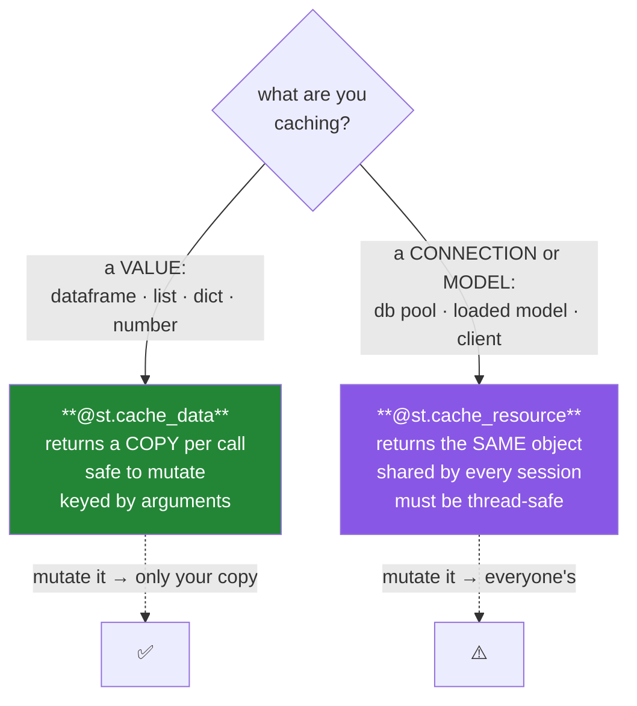

# Day 55 — Caching, charts, and dataframes

**Phase 7 · Module 7** · IDs: **APP-05** (`@st.cache_data` vs `@st.cache_resource`), **APP-06** (charts and dataframes)

> **Yesterday:** `session_state`, and the approval flow.
> **Today:** the fix for Day 52's cost — 12 seconds down to 40 milliseconds — and, honestly, the bug
> it introduces. A cache is a **promise that stale data is acceptable for N seconds**, and you have to
> mean it.
> **Tomorrow:** streaming.

```bash
./m start 55 && ./m scaffold 55
```

**Time:** 110 minutes. **Request budget:** 0 model calls · a handful of database round trips.

---

## §1 The story

Day 52 left you clicking a widget and waiting 300 ms for a computation that had not changed. Day 53
counted the queries. Today both get fixed by one decorator — and Streamlit has **two**, for two
genuinely different things:



**`@st.cache_data` returns a copy.** Two sessions calling it get two independent dataframes, so one
session mutating its result cannot corrupt another's. That copy costs something, and it is why the
decorator is for *data*.

**`@st.cache_resource` returns the object itself**, shared by every session in the process. That is
exactly what you want for a database connection pool (Day 42: never one connection per query) and
exactly what you must not do for a dataframe.

Getting this backwards produces two distinct failures. `cache_resource` on a dataframe means one
user's edit changes what everyone sees. `cache_data` on a connection pool means every session gets a
deserialised copy of an object that cannot be meaningfully copied — usually an error, sometimes worse.

**And the honest half.** A cache is not free correctness. It is a statement: *"showing data up to N
seconds old is acceptable here."* Sometimes that is obviously true (a venue list). Sometimes it is
obviously false (the approval queue from Day 54, where a stale entry means two people approve the same
draft). Most of the time it needs a decision, and `ttl=` is where you record it.

---

## §2 Setup — run this

```bash
mkdir -p days/day-55/lab
touch days/day-55/lab/caching.py
```

`src/setu/app.py` and `tests/test_app.py` grow today. No new packages.

---

## §3 APP-05 — the two caches

`days/day-55/lab/caching.py`:

```python
"""APP-05 / APP-06: caching, its cost, its bug, and rendering data."""

from __future__ import annotations

import time
from datetime import datetime

import numpy as np
import pandas as pd
import streamlit as st

from setu.arrays import make_rng

st.set_page_config(page_title="Day 55 — caching", layout="wide")
st.session_state.setdefault("calls", {"uncached": 0, "cached": 0})


# --- 1. the cost, measured ------------------------------------------------
st.header("1. The cost of no cache")


def load_uncached(rows: int) -> pd.DataFrame:
    st.session_state["calls"]["uncached"] += 1
    time.sleep(0.8)                       # stands in for read_parquet / a query
    rng = make_rng(0)
    return pd.DataFrame(
        {"venue": rng.choice(["NeurIPS", "ICML", "ACL"], rows),
         "year": rng.integers(2015, 2026, rows),
         "citations": rng.integers(0, 5000, rows)}
    )


@st.cache_data(ttl=300, show_spinner="loading…")
def load_cached(rows: int) -> pd.DataFrame:
    st.session_state["calls"]["cached"] += 1
    time.sleep(0.8)
    rng = make_rng(0)
    return pd.DataFrame(
        {"venue": rng.choice(["NeurIPS", "ICML", "ACL"], rows),
         "year": rng.integers(2015, 2026, rows),
         "citations": rng.integers(0, 5000, rows)}
    )


rows = st.select_slider("rows", options=[1_000, 5_000, 20_000], value=5_000)

left, right = st.columns(2)
with left:
    start = time.perf_counter()
    load_uncached(rows)
    st.metric("uncached", f"{(time.perf_counter() - start) * 1000:.0f} ms")
    st.caption(f"function bodies run: {st.session_state['calls']['uncached']}")
with right:
    start = time.perf_counter()
    load_cached(rows)
    st.metric("cached", f"{(time.perf_counter() - start) * 1000:.0f} ms")
    st.caption(f"function bodies run: {st.session_state['calls']['cached']}")

st.caption(
    "Move the slider back and forth. The uncached counter climbs every time; the "
    "cached one climbs once per distinct `rows` value, then stops."
)


# --- 2. keyed by arguments ------------------------------------------------
st.header("2. The cache key is the arguments")

st.write(
    "`load_cached(1000)` and `load_cached(5000)` are separate entries. The key is "
    "the function plus its arguments — which is why arguments must be **hashable**."
)


@st.cache_data
def summarise(frame: pd.DataFrame, group: str) -> pd.DataFrame:
    return frame.groupby(group, observed=True)["citations"].agg(["count", "mean"]).round(1)


st.dataframe(summarise(load_cached(rows), "venue"), use_container_width=True)
st.caption(
    "A DataFrame argument IS hashable to Streamlit — it hashes the contents, which "
    "costs time proportional to size. For a big frame, pass an ID and load inside "
    "instead of passing the frame in."
)


# --- 3. cache_data returns a COPY ----------------------------------------
st.header("3. cache_data hands you a copy")

first = load_cached(rows)
first_id = id(first)
second = load_cached(rows)
st.write(f"same object? **{first_id == id(second)}**")

first["citations"] = -1
third = load_cached(rows)
st.write(f"after mutating the first copy, the cache still holds: "
         f"**{third['citations'].max():,}**")
st.caption(
    "You mutated your copy; the cached value is untouched. That copy is the cost of "
    "`cache_data`, and it is what makes it safe across sessions."
)


# --- 4. cache_resource shares the object ---------------------------------
st.header("4. cache_resource shares one object")


@st.cache_resource
def shared_registry() -> dict:
    return {"created": datetime.now().strftime("%H:%M:%S"), "hits": 0}


registry = shared_registry()
registry["hits"] += 1
st.write(registry)
st.caption(
    "Reload the page. `created` does NOT change and `hits` keeps climbing — it is the "
    "same dict, shared by every session in this process. Correct for a connection pool. "
    "Catastrophic for a dataframe, because one user's edit becomes everyone's."
)


# --- 5. the stale-cache bug ----------------------------------------------
st.header("5. The bug caching introduces")

st.session_state.setdefault("approvals", ["draft A"])


@st.cache_data(ttl=30)
def pending_stale() -> list[str]:
    return list(st.session_state["approvals"])


def pending_fresh() -> list[str]:
    return list(st.session_state["approvals"])


if st.button("add a draft"):
    st.session_state["approvals"].append(f"draft {len(st.session_state['approvals']) + 1}")

st.write(f"cached (ttl=30s): {pending_stale()}")
st.write(f"uncached:         {pending_fresh()}")
st.warning(
    "Add a draft and compare. The cached list lags for up to 30 seconds.\n\n"
    "For a **venue list** that is fine. For an **approval queue** it means two people "
    "approve the same draft. A cache is a promise that stale data is acceptable — "
    "so decide, per function, whether you actually mean it."
)

if st.button("clear this cache"):
    pending_stale.clear()
    st.rerun()
st.caption("`fn.clear()` drops one function's entries. `st.cache_data.clear()` drops all of them.")


# --- 6. what must not be cached ------------------------------------------
st.header("6. What must not be cached")

st.write(
    "- anything **non-deterministic** you want fresh — `datetime.now()`, a random draw\n"
    "- anything with a **side effect** — writes, emails, an LLM call you are billing for\n"
    "- anything **per-user** unless the user id is an argument (else you serve A's data to B)\n"
    "- the **approval queue**, and anything else where staleness is a correctness bug"
)
st.error(
    "The per-user one is a security bug, not a performance bug: a cache key that omits "
    "the user id will happily serve one person's rows to another."
)


# --- 7. APP-06: rendering data -------------------------------------------
st.header("7. Charts and dataframes")

frame = load_cached(rows)

st.subheader("st.dataframe — interactive")
st.dataframe(
    frame.head(200),
    use_container_width=True,
    hide_index=True,
    column_config={
        "citations": st.column_config.NumberColumn("citations", format="%,d"),
        "year": st.column_config.NumberColumn("year", format="%d"),
    },
)
st.caption("`st.dataframe` is sortable and scrollable. `st.table` is static. Prefer the former.")

st.subheader("built-in charts vs your own")
chart_data = frame.groupby("year", observed=True)["citations"].mean()
c1, c2 = st.columns(2)
with c1:
    st.line_chart(chart_data)
    st.caption("st.line_chart: two seconds of work, no control")
with c2:
    from setu.plots import line, new_axes

    fig, ax = new_axes()
    line(chart_data.reset_index(), x="year", y="citations", ax=ax)
    ax.set_title("Mean citations by year")
    st.pyplot(fig)
    st.caption("setu.plots: house style, tested, Day 40's accessibility rules")

st.subheader("st.metric")
m1, m2, m3 = st.columns(3)
m1.metric("papers", f"{len(frame):,}")
m2.metric("mean citations", f"{frame['citations'].mean():,.0f}", delta="+3.2%")
m3.metric("venues", frame["venue"].nunique())
st.caption("`delta` colours itself: green up, red down. Use `delta_color='inverse'` for latency.")
```

**Line by line:**

- `st.session_state["calls"]` — the instrument again (Day 53). **Watch the two counters diverge**: the
  uncached one climbs on every rerun, the cached one climbs once per distinct argument value.
- `@st.cache_data(ttl=300, show_spinner="loading…")` — `ttl` in seconds is **the decision**, written
  down. `show_spinner` replaces the default message; setting it to `False` hides it entirely for a fast
  function.
- **The cache key is the function plus its arguments**, which is why arguments must be hashable.
  Streamlit hashes a DataFrame by its **contents**, so passing a large frame in costs time proportional
  to its size — for a big one, pass an id and load inside the cached function instead.
- **§3: `cache_data` hands you a copy.** `id(first) != id(second)`, and mutating your copy leaves the
  cached value untouched. That copy is the cost, and it is precisely what makes the decorator safe when
  two sessions call it at once.
- **§4: `cache_resource` shares the object.** Reload the page — `created` does not change and `hits`
  keeps climbing. This is right for a connection pool (Day 42: never one connection per query) and
  catastrophic for a dataframe.
- **§5 is the honest half of the day.** The same data, cached and uncached, side by side. For a venue
  list a 30-second lag is nothing; for an approval queue it means two people approve the same draft.
  **A cache is a promise that stale data is acceptable for `ttl` seconds** — so make it deliberately.
- `pending_stale.clear()` — drops **one function's** entries. `st.cache_data.clear()` drops everything.
  After a write, clearing the one function you invalidated is right; clearing everything is a blunt
  instrument that throws away work you did not invalidate.
- **§6, the per-user point deserves its red box.** A cached function whose key omits the user id will
  serve one person's rows to another. That is not a performance bug; it is a data-leak bug, and it is
  the most serious mistake available in this lesson.
- `st.dataframe(..., column_config=...)` — sortable, scrollable, and formattable without touching the
  data (Day 37's rule: format the display, not the values). `st.table` is static; prefer `dataframe`.
- `st.line_chart` versus `setu.plots.line` — the built-in is two seconds of work with no control. Your
  own is house-styled, tested, and passes Day 40's accessibility lints. **Built-in for a glance,
  `setu.plots` for anything a person will read.** Note `st.pyplot(fig)` takes the Figure — Day 36's
  return-the-Axes discipline means you have one.
- `delta_color='inverse'` — for a metric where up is bad, like latency. The default colours up as green.

---

## §4 Build brief

Extend `src/setu/app.py`:

```python
CACHE_POLICY: dict[str, int | None] = {
    "venues": 3600,          # changes rarely
    "paper_counts": 300,     # a dashboard number; 5 minutes of lag is fine
    "search_results": 60,
    "approval_queue": None,  # NEVER cache: staleness here is a correctness bug
    "health": 10,
}


def cache_ttl(name: str) -> int | None:
    """TODO(me): return the declared ttl, or raise DataError if `name` is undeclared.

    Forcing every cached function to be NAMED here means a new cache is a decision
    someone made, not a decorator someone typed. Return None for 'do not cache'.
    """
    raise NotImplementedError


def assert_cacheable(name: str) -> None:
    """TODO(me): raise DataError if `name` has a None ttl.

    The message must say WHY that function is uncacheable, so the next person does
    not simply add a ttl. Keep the reasons in a dict beside CACHE_POLICY.
    """
    raise NotImplementedError


def cache_key_parts(name: str, *, user: str | None = None, **params) -> tuple:
    """TODO(me): build a deterministic cache key. PURE.

    - always include `name`
    - include `user` when given - a per-user cache that omits it LEAKS DATA (§6)
    - sort the params so {'a':1,'b':2} and {'b':2,'a':1} give the same key
    - raise DataError if any param value is unhashable (a list would silently
      break the cache; say so loudly instead)
    - return a tuple, so it is hashable
    """
    raise NotImplementedError


def format_table(frame, *, max_rows: int = 200) -> tuple:
    """TODO(me): return (frame_to_show, column_config, truncated_message | None). PURE-ish.

    - never render more than max_rows; return a message saying how many were hidden
    - build column_config for numeric columns from the DTYPES, not by guessing names
    - do NOT modify the caller's frame (ADR-001)
    - returning the config rather than calling st.dataframe is what makes it testable
    """
    raise NotImplementedError


def render_dashboard() -> None:
    """TODO(me): metrics + a chart + a table. Thin.

    - every cached call goes through a function whose ttl came from cache_ttl
    - use setu.plots for the chart, not st.line_chart
    - use format_table for the table
    """
    raise NotImplementedError
```

- `CACHE_POLICY` as a **declared table** is the day's design decision. A cache added by typing a
  decorator is a decision nobody reviewed; a cache added by naming it in a table beside its ttl is one
  someone had to think about. And `approval_queue: None` puts §5's warning in the code.
- `cache_key_parts` including `user` is the §6 security point, made structural.
- `format_table` returning the config instead of calling `st.dataframe` is Day 52's seam, applied again.

---

## §5 The eval that must be able to fail

Add to `tests/test_app.py`:

```python
from setu.app import CACHE_POLICY, assert_cacheable, cache_key_parts, cache_ttl, format_table


def test_declared_ttls_are_returned():
    assert cache_ttl("venues") == 3600
    assert cache_ttl("approval_queue") is None


def test_undeclared_cache_raises():
    with pytest.raises(DataError) as info:
        cache_ttl("something_new")
    assert "something_new" in str(info.value)


def test_approval_queue_is_not_cacheable():
    """§5: staleness in an approval queue is a correctness bug."""
    with pytest.raises(DataError) as info:
        assert_cacheable("approval_queue")
    message = str(info.value).lower()
    assert "stale" in message or "correctness" in message or "approve" in message, (
        "the message must explain WHY, or someone will just add a ttl"
    )


def test_cacheable_names_pass():
    for name in ("venues", "paper_counts", "search_results", "health"):
        assert_cacheable(name)


def test_every_policy_entry_has_a_sane_ttl():
    for name, ttl in CACHE_POLICY.items():
        assert ttl is None or (isinstance(ttl, int) and 0 < ttl <= 86_400), (
            f"{name} has an implausible ttl: {ttl}"
        )


def test_cache_key_is_order_independent():
    a = cache_key_parts("search", venue="ICML", year=2020)
    b = cache_key_parts("search", year=2020, venue="ICML")
    assert a == b, "param order changed the key - two entries for one query"


def test_cache_key_includes_the_name():
    assert cache_key_parts("a", x=1) != cache_key_parts("b", x=1)


def test_cache_key_separates_users():
    """A per-user cache that omits the user id serves A's data to B."""
    assert cache_key_parts("q", user="alice", x=1) != cache_key_parts("q", user="bob", x=1)


def test_cache_key_without_a_user_differs_from_one_with():
    assert cache_key_parts("q", x=1) != cache_key_parts("q", user="alice", x=1)


def test_cache_key_is_hashable():
    hash(cache_key_parts("q", user="alice", venue="ICML", year=2020))


def test_cache_key_rejects_an_unhashable_param():
    with pytest.raises(DataError) as info:
        cache_key_parts("q", venues=["ICML", "ACL"])
    assert "venues" in str(info.value)


def test_format_table_truncates_and_says_so():
    frame = pd.DataFrame({"a": range(500)})
    shown, _, message = format_table(frame, max_rows=200)
    assert len(shown) == 200
    assert message is not None and "300" in message


def test_format_table_no_message_when_it_fits():
    frame = pd.DataFrame({"a": range(10)})
    shown, _, message = format_table(frame, max_rows=200)
    assert len(shown) == 10 and message is None


def test_format_table_does_not_mutate():
    frame = pd.DataFrame({"a": range(10), "b": list("abcdefghij")})
    before = frame.copy()
    format_table(frame)
    pd.testing.assert_frame_equal(frame, before)


def test_format_table_configures_numeric_columns_by_dtype():
    frame = pd.DataFrame({"citations": [1, 2], "title": ["a", "b"], "score": [0.1, 0.2]})
    _, config, _ = format_table(frame)
    assert "citations" in config and "score" in config
    assert "title" not in config, "a text column was given a numeric format"


def test_format_table_is_pure():
    import inspect

    assert "st.dataframe" not in inspect.getsource(format_table)


def test_every_cached_function_declares_its_ttl():
    """A cache added by typing a decorator is a decision nobody reviewed."""
    import re
    from pathlib import Path

    for path in list(Path("app").rglob("*.py")) + [Path("src/setu/app.py")]:
        source = path.read_text(encoding="utf-8")
        for match in re.finditer(r"@st\.cache_data(\([^)]*\))?", source):
            args = match.group(1) or ""
            assert "ttl" in args, (
                f"{path.name}: @st.cache_data without an explicit ttl — "
                "declare it in CACHE_POLICY and pass cache_ttl(name)"
            )


def test_cache_resource_is_only_used_for_connections():
    """cache_resource shares one object; a shared dataframe is one user's edit for everyone."""
    import re
    from pathlib import Path

    allowed = ("client", "connection", "engine", "pool", "model", "registry")
    for path in list(Path("app").rglob("*.py")) + list(Path("src/setu").rglob("*.py")):
        source = path.read_text(encoding="utf-8")
        for match in re.finditer(r"@st\.cache_resource[^\n]*\ndef (\w+)", source):
            name = match.group(1)
            assert any(word in name.lower() for word in allowed), (
                f"{path.name}: @st.cache_resource on '{name}' — is it really a "
                "connection or a model? A shared value is one user's edit for everyone."
            )


def test_no_builtin_charts_in_the_app():
    """setu.plots is house-styled, tested and accessibility-linted (Days 36-41)."""
    from pathlib import Path

    banned = ("st.line_chart(", "st.bar_chart(", "st.area_chart(", "st.scatter_chart(")
    offenders = [
        f"{p.name}:{i}"
        for p in list(Path("app").rglob("*.py")) + [Path("src/setu/app.py")]
        for i, line_ in enumerate(p.read_text(encoding="utf-8").splitlines(), 1)
        if any(b in line_ for b in banned) and "noqa" not in line_
    ]
    assert not offenders, f"built-in chart in a rendered page: {offenders}"
```

**Line by line:**

- `test_approval_queue_is_not_cacheable` — **the day's real assessment**, and it asserts the *message*
  explains why. A bare "cannot cache approval_queue" invites the next person to add a ttl; a message
  saying *staleness here means two people approve the same draft* does not.
- `test_cache_key_separates_users` and its companion — §6's data-leak bug as two assertions. A key
  builder that ignores `user` passes every other test in this file and silently serves one person's
  rows to another.
- `test_cache_key_is_order_independent` — `{'a':1,'b':2}` and `{'b':2,'a':1}` must produce one key.
  Otherwise you get two cache entries for one query and half the hit rate, invisibly.
- `test_cache_key_rejects_an_unhashable_param` — a list argument would break the cache silently.
  Raising is better than a mysterious `TypeError` from inside Streamlit.
- `test_every_cached_function_declares_its_ttl` — a **regex over the source** for `@st.cache_data`
  without a `ttl`. Streamlit's default is no expiry, which means "cached forever", which is almost
  never what anyone actually decided.
- `test_cache_resource_is_only_used_for_connections` — checks the **decorated function's name** against
  a small allowlist. Crude, and it catches the specific mistake that matters: `@st.cache_resource` on
  something that returns data, where one user's mutation becomes everyone's.
- `test_format_table_configures_numeric_columns_by_dtype` — asserts `title` is **not** configured.
  Guessing from column names ("anything with 'count' in it") breaks on real data; dtypes do not.
- `test_no_builtin_charts_in_the_app` — the thirteenth repo-wide guard. Phase 5 built a tested,
  accessible plotting layer; `st.line_chart` bypasses all of it.

```bash
uv run python -m pytest tests/test_app.py -v
```

---

## §6 Request budget

| Resource | Spent today |
|---|---|
| LLM calls | **0** |
| Database round trips | reduced by roughly the cache hit rate — that is the point |

---

## §7 Traps

- **`cache_resource` on a dataframe.** One user's edit becomes everyone's.
- **`cache_data` on a connection pool.** It tries to copy something uncopyable.
- **No `ttl`.** The default is forever, which nobody decided.
- **A per-user cache without the user in the key.** A data leak, not a slow page.
- **Caching anything non-deterministic you wanted fresh.** `datetime.now()` freezes.
- **Caching a function with side effects.** The write happens once and then never.
- **Caching the approval queue.** Staleness there is a correctness bug.
- **Passing a huge dataframe as a cached argument.** Hashing it costs time; pass an id.
- **`st.cache_data.clear()` after every write.** Clear the one function you invalidated.
- **An unhashable argument.** Breaks the cache; raise instead.
- **`st.table` for a large frame.** Static. Use `st.dataframe`.
- **`st.line_chart` in a page someone reads.** Bypasses Phase 5 entirely.

---

## §8 Verify before you code

Written **2026-08-21**:

- <https://docs.streamlit.io/develop/concepts/architecture/caching> — the two decorators, compared by
  the maintainers.
- <https://docs.streamlit.io/develop/api-reference/caching-and-state/st.cache_data> — `ttl`,
  `max_entries`, `.clear()`, and the hashing rules.
- <https://docs.streamlit.io/develop/api-reference/data/st.dataframe> — `column_config`.
- <https://docs.streamlit.io/develop/api-reference/charts/st.pyplot> — passing a Matplotlib Figure.

---

## §9 Say it in an interview

> "There are two cache decorators and the distinction is what they return. `cache_data` hands each
> caller a copy, so it's safe for values across sessions; `cache_resource` returns the same object, so
> it's right for a connection pool and catastrophic for a dataframe — one user's edit becomes
> everyone's. The part I'd stress is that a cache isn't free correctness, it's a promise that stale
> data is acceptable for the ttl. For a venue list that's obviously fine; for an approval queue it
> means two people approve the same draft. So caches are declared in a policy table with their ttl and
> a reason, the approval queue is explicitly marked uncacheable, and there's a test asserting the error
> message *explains why* — otherwise the next person just adds a ttl. The other one I'd flag is a
> per-user cache whose key omits the user id: that's not a performance bug, it serves one person's
> rows to another."

---

## §10 Done when

Tick [`CHECKLIST.md`](CHECKLIST.md), then `./m check && ./m done 55`.
