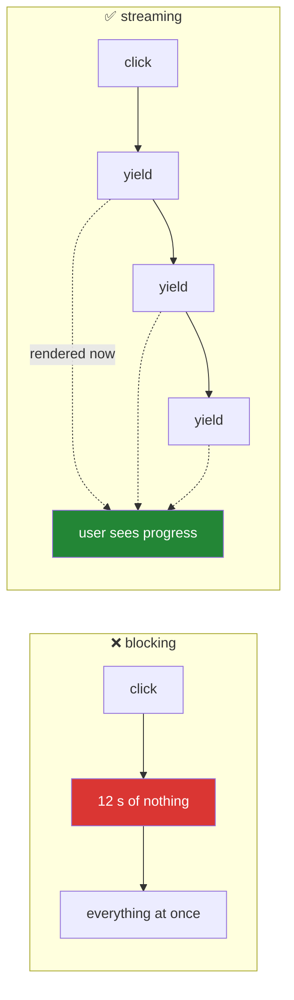

# Day 56 — Async, generators, and `st.write_stream`

**Phase 7 · Module 7** · ID: **APP-07** (async, generators, streaming output)

> **Yesterday:** caching, and the promise it makes about staleness.
> **Today:** long-running work in a UI that re-runs. The shape you build — a generator yielding
> pieces, rendered as they arrive — is **exactly** what Day 197 uses to stream tokens from a model and
> Day 234 uses to stream an agent's progress. Same function, different producer.
> **Tomorrow:** deployment, and Phase 7 closes.

```bash
./m start 56 && ./m scaffold 56
```

**Time:** 110 minutes. **Request budget:** 0 model calls.

---

## §1 The story

A Streamlit script is synchronous and it blocks. If a step takes twelve seconds, the page shows
nothing for twelve seconds and the user assumes it is broken.

The fix is not threads and it is not `asyncio` — it is Day 11's generator:

```python
def work():
    for step in steps:
        yield do(step)          # pause here, hand a piece back

st.write_stream(work())
```

`st.write_stream` consumes the generator and renders each piece **as it arrives**. The user sees
progress from the first yield rather than nothing until the last.



Three things to get straight, because two of them are traps.

**1. `asyncio` and Streamlit do not mix the way you expect.** The script runs in a worker thread with
no running event loop, so `await` at the top level is a syntax error and `asyncio.run()` inside a
rerun works but blocks anyway — you have gained nothing over a synchronous call. **Async is worth it
only when you have several independent I/O waits to overlap**, and even then you wrap the whole batch
in one `asyncio.run()` and yield the results. Day 19 measured why: threads and async help when you are
*waiting*, and the win only appears with concurrency.

**2. Streamlit reruns are cooperative, not preemptive.** While your generator is running, the script
is busy. A user clicking another widget queues a rerun that starts when yours finishes — or, if they
click the same button again, Streamlit may cancel and restart your script mid-generator. Your
generator must therefore be **safe to abandon partway**, which is Day 16's `try/finally` all over again.

**3. Progress belongs in `st.status`, not in prints.** It gives you a collapsible container that shows
"running", then "complete" or "error" — the honest shape for something that can fail.

---

## §2 Setup — run this

```bash
mkdir -p days/day-56/lab
touch days/day-56/lab/streaming.py
```

`src/setu/app.py` and `tests/test_app.py` grow today. No new packages.

---

## §3 APP-07 — streaming

`days/day-56/lab/streaming.py`:

```python
"""APP-07: blocking vs streaming, progress, cancellation, and where async fits."""

from __future__ import annotations

import asyncio
import random
import time
from collections.abc import Iterator

import streamlit as st

st.set_page_config(page_title="Day 56 — streaming", layout="wide")
STEPS = ["fetching", "parsing", "embedding", "ranking", "summarising"]


# --- 1. blocking ----------------------------------------------------------
st.header("1. Blocking")

if st.button("run blocking (5 s)"):
    start = time.perf_counter()
    results = []
    for step in STEPS:
        time.sleep(1.0)
        results.append(f"{step} done")
    st.write(results)
    st.caption(f"{time.perf_counter() - start:.1f} s of nothing, then everything at once.")


# --- 2. streaming ---------------------------------------------------------
st.header("2. Streaming")


def run_steps() -> Iterator[str]:
    for step in STEPS:
        time.sleep(1.0)
        yield f"- {step} done\n"


if st.button("run streaming (5 s)"):
    start = time.perf_counter()
    text = st.write_stream(run_steps())
    st.caption(f"{time.perf_counter() - start:.1f} s — same total, but visible from second one.")
    st.caption(f"`st.write_stream` also RETURNS the joined result: {len(text)} characters.")


# --- 3. token-by-token ----------------------------------------------------
st.header("3. Token by token")


def fake_tokens(sentence: str) -> Iterator[str]:
    for word in sentence.split():
        time.sleep(0.06)
        yield word + " "


if st.button("stream a sentence"):
    st.write_stream(
        fake_tokens(
            "This is what a model response looks like when it is streamed "
            "one token at a time instead of arriving as a single block."
        )
    )
    st.caption(
        "Day 197 replaces `fake_tokens` with a real model stream. The rendering code "
        "does not change — that is the point of building the shape now."
    )


# --- 4. progress and status ----------------------------------------------
st.header("4. Progress that can fail")

if st.button("run with status"):
    with st.status("working…", expanded=True) as status:
        try:
            for index, step in enumerate(STEPS, 1):
                st.write(f"{index}/{len(STEPS)} {step}")
                time.sleep(0.6)
                if step == "embedding" and random.random() < 0.35:
                    raise RuntimeError("embedding service unavailable")
            status.update(label="complete", state="complete", expanded=False)
        except RuntimeError as exc:
            status.update(label=f"failed: {exc}", state="error", expanded=True)

    st.caption(
        "Run it a few times — it fails about a third of the time on purpose. "
        "`st.status` has a state for that; a progress bar does not."
    )

bar = st.progress(0, text="a plain progress bar")
if st.button("fill the bar"):
    for i in range(101):
        bar.progress(i, text=f"{i}%")
        time.sleep(0.005)
    bar.empty()
st.caption("`st.progress` is for a known number of steps. `st.status` is for narration.")


# --- 5. abandonment -------------------------------------------------------
st.header("5. Your generator can be abandoned")

st.session_state.setdefault("cleanups", 0)


def cleanly_abandonable() -> Iterator[str]:
    acquired = "a database connection"
    try:
        for step in STEPS:
            time.sleep(0.8)
            yield f"- {step}\n"
    finally:
        st.session_state["cleanups"] += 1
        _ = acquired          # released here, on EVERY exit path


if st.button("start, then click something else mid-run"):
    st.write_stream(cleanly_abandonable())

st.metric("finally blocks executed", st.session_state["cleanups"])
st.caption(
    "Start it, then click another widget before it finishes. Streamlit may cancel the "
    "script; the generator is closed and `finally` still runs. That is Day 16's rule — "
    "and it is why a generator holding a connection must use `try/finally`."
)


# --- 6. where async actually helps ---------------------------------------
st.header("6. Where async helps (and where it does not)")


async def fetch(n: float = 0.5) -> str:
    await asyncio.sleep(n)
    return "ok"


async def gather_all(count: int) -> list[str]:
    return await asyncio.gather(*(fetch() for _ in range(count)))


if st.button("8 waits: sequential vs gathered"):
    start = time.perf_counter()
    for _ in range(8):
        time.sleep(0.5)
    sequential = time.perf_counter() - start

    start = time.perf_counter()
    asyncio.run(gather_all(8))
    gathered = time.perf_counter() - start

    st.write(f"sequential: **{sequential:.1f} s** · gathered: **{gathered:.1f} s** "
             f"(~{sequential / gathered:.0f}x)")

st.info(
    "**The rules for async here.**\n\n"
    "- You cannot `await` at the top level of a Streamlit script — there is no running loop.\n"
    "- `asyncio.run(...)` inside a rerun works, and still **blocks** that rerun.\n"
    "- So async buys you nothing for ONE wait. It buys a lot for eight overlapping ones.\n"
    "- Wrap the whole batch in one `asyncio.run` and yield the results — do not call "
    "`asyncio.run` in a loop, which pays loop setup every time."
)
st.caption("Day 19 measured this: threads and async help when you are waiting, not computing.")


# --- 7. chat ---------------------------------------------------------------
st.header("7. The chat shape (Day 234 uses this)")

st.session_state.setdefault("messages", [])

for message in st.session_state["messages"]:
    with st.chat_message(message["role"]):
        st.markdown(message["content"])

if prompt := st.chat_input("ask something"):
    st.session_state["messages"].append({"role": "user", "content": prompt})
    with st.chat_message("user"):
        st.markdown(prompt)
    with st.chat_message("assistant"):
        reply = st.write_stream(fake_tokens(f"You said: {prompt}. Here is a streamed reply."))
    st.session_state["messages"].append({"role": "assistant", "content": reply})

st.caption(
    "History lives in session_state (Day 54) and is REPLAYED on every rerun; only the "
    "new reply streams. That replay-then-stream shape is the whole of a chat UI."
)
```

**Line by line:**

- **§1 versus §2 is the day.** Same five seconds of work; one shows nothing, the other shows progress
  from the first second. Run both back to back and notice how differently they *feel* at identical
  total duration.
- `st.write_stream(...)` also **returns** the joined result, which is what you store in history. On
  Day 197 that return value is the assistant's full message.
- `yield word + " "` — token streaming, faked. **Day 197 swaps `fake_tokens` for a real model stream
  and the rendering code does not change.** That is why this shape is worth building now against a
  generator you control, rather than debugging it against a network for the first time.
- `with st.status(...) as status:` plus `status.update(state="error")` — **the honest shape for work
  that can fail.** The demo fails about a third of the time on purpose; a progress bar has no way to
  say "this went wrong", and a spinner that simply disappears is worse than an error.
- `st.progress` versus `st.status` — a bar for a **known** number of steps, status for **narration**.
  Using a bar for something with an unknown length means faking the percentage, which is a small lie.
- **§5 is the trap that costs an afternoon.** Start the generator, then click another widget.
  Streamlit may cancel and restart the script, which **closes the generator mid-flight**. Python's
  generator close raises `GeneratorExit` at the `yield`, so the `finally` block runs — but only if you
  wrote one. A generator holding a database connection without `try/finally` leaks it on every
  cancellation. Day 16's rule, in a place you would not have predicted.
- **§6, the async rules.** You cannot `await` at the top level (no running loop). `asyncio.run()`
  inside a rerun works and **still blocks that rerun**. So async buys nothing for one wait and a lot
  for eight overlapping ones — Day 19's measurement, confirmed here. Note the last bullet: wrap the
  **whole batch** in one `asyncio.run`, never call it in a loop, which pays event-loop setup each time.
- `if prompt := st.chat_input(...)` — the walrus operator assigns and tests in one expression.
  `st.chat_input` returns `None` until submitted.
- **§7's caption is the important part.** The history is replayed from `session_state` on every rerun
  and only the *new* reply streams. That replay-then-stream shape is the entire architecture of a chat
  UI, and Day 234 builds the capstone's interface on it.

---

## §4 Build brief

Extend `src/setu/app.py`:

```python
from collections.abc import Iterable, Iterator

MAX_STREAM_SECONDS = 120


def step_stream(steps: list[str], work, *, on_error: str = "raise") -> Iterator[str]:
    """TODO(me): run `work(step)` for each step, yielding a progress line each time.

    - yield '- {step}: {result}\\n' after each step completes
    - on_error='raise' propagates; on_error='continue' yields '- {step}: FAILED ({exc})\\n'
      and carries on; anything else is a DataError
    - MUST use try/finally so a cancelled generator still cleans up (§5)
    - raise DataError on an empty `steps` list
    """
    raise NotImplementedError


def throttle(stream: Iterable[str], *, min_chars: int = 12) -> Iterator[str]:
    """TODO(me): batch tiny chunks so the UI is not re-rendered per character. PURE.

    - accumulate until at least min_chars, then yield
    - ALWAYS yield the remainder at the end, even if short
    - must be lazy: it takes an iterable and returns a generator (Day 11)
    - must work on an infinite input, so no list() anywhere
    - raise DataError if min_chars < 1
    A real token stream emits 2-3 characters at a time; rendering per token is wasteful.
    """
    raise NotImplementedError


def collect_stream(stream: Iterable[str], *, limit_seconds: float = MAX_STREAM_SECONDS) -> str:
    """TODO(me): consume a stream into a string, with a wall-clock cap. PURE-ish.

    - raise TransientError if the cap is exceeded, INCLUDING what was collected so far
      in the exception (a partial answer beats none)
    - this is what a test uses instead of a browser
    """
    raise NotImplementedError


def chat_history_to_messages(history: list[dict]) -> list[dict]:
    """TODO(me): validate and normalise a chat history. PURE.

    - every entry needs 'role' in {'user','assistant'} and a non-empty 'content'
    - raise DataError naming the INDEX of the first bad entry
    - strip content; drop entries that are blank after stripping
    - roles must alternate starting with 'user'; raise DataError if not
      (a history that does not alternate means a message was lost)
    """
    raise NotImplementedError


def render_stream(steps: list[str], work) -> str:
    """TODO(me): st.status + st.write_stream around step_stream. Thin.

    - status becomes 'complete' on success and 'error' on failure
    - return the joined text
    """
    raise NotImplementedError
```

- `step_stream` requiring `try/finally` is §5 made permanent. §5's test asserts it.
- `throttle` staying **lazy** is Day 11's rule: it must work on an infinite stream, so no `list()`.
- `collect_stream` including the partial result in the exception is a small kindness that matters — on
  Day 197 a model stream that stalls at 80% should still show you the 80%.
- The alternation check in `chat_history_to_messages` catches a real bug: two consecutive `user`
  messages means an assistant reply was dropped, and every downstream model call will be malformed.

---

## §5 The eval that must be able to fail

Add to `tests/test_app.py`:

```python
from setu.app import chat_history_to_messages, collect_stream, step_stream, throttle
from setu.errors import TransientError


def test_step_stream_yields_one_line_per_step():
    lines = list(step_stream(["a", "b", "c"], lambda s: s.upper()))
    assert len(lines) == 3
    assert "A" in lines[0] and "C" in lines[2]


def test_step_stream_is_lazy():
    """Nothing runs until the first next()."""
    calls = []
    stream = step_stream(["a", "b"], lambda s: calls.append(s))
    assert calls == [], "work started before the generator was consumed"
    next(stream)
    assert len(calls) == 1


def test_step_stream_cleans_up_when_abandoned():
    """Streamlit may cancel a script mid-generator (§5)."""
    cleaned = []

    def work(step):
        return step

    def instrumented():
        try:
            yield from step_stream(["a", "b", "c"], work)
        finally:
            cleaned.append(True)

    stream = instrumented()
    next(stream)
    stream.close()          # what Streamlit does on cancellation
    assert cleaned == [True], "the finally block did not run on abandonment"


def test_step_stream_source_has_a_finally():
    import inspect

    assert "finally" in inspect.getsource(step_stream), (
        "a generator holding a resource must clean up on cancellation"
    )


def test_step_stream_raises_by_default():
    def work(step):
        raise RuntimeError("boom")

    with pytest.raises(RuntimeError):
        list(step_stream(["a"], work))


def test_step_stream_can_continue_past_a_failure():
    def work(step):
        if step == "b":
            raise RuntimeError("boom")
        return "ok"

    lines = list(step_stream(["a", "b", "c"], work, on_error="continue"))
    assert len(lines) == 3
    assert "FAILED" in lines[1]
    assert "ok" in lines[2], "the stream stopped after the failure"


def test_step_stream_rejects_a_bad_error_mode():
    with pytest.raises(DataError):
        list(step_stream(["a"], lambda s: s, on_error="ignore"))


def test_step_stream_rejects_empty_steps():
    with pytest.raises(DataError):
        list(step_stream([], lambda s: s))


def test_throttle_batches_small_chunks():
    out = list(throttle(["a", "b", "c", "d", "e"] * 4, min_chars=5))
    assert all(len(chunk) >= 5 for chunk in out[:-1])
    assert "".join(out) == "abcde" * 4, "throttling changed the content"


def test_throttle_yields_the_remainder():
    out = list(throttle(["ab", "cd"], min_chars=100))
    assert "".join(out) == "abcd", "the short remainder was dropped"


def test_throttle_is_lazy_on_an_infinite_stream():
    def forever():
        while True:
            yield "xy"

    from itertools import islice

    first = list(islice(throttle(forever(), min_chars=6), 3))
    assert len(first) == 3, "throttle materialised its input"


def test_throttle_rejects_a_bad_size():
    with pytest.raises(DataError):
        list(throttle(["a"], min_chars=0))


def test_collect_stream_joins():
    assert collect_stream(iter(["a", "b", "c"])) == "abc"


def test_collect_stream_enforces_a_time_cap():
    import time as _time

    def slow():
        for _ in range(10):
            _time.sleep(0.05)
            yield "x"

    with pytest.raises(TransientError):
        collect_stream(slow(), limit_seconds=0.1)


def test_collect_stream_includes_the_partial_result():
    """A partial answer beats none."""
    import time as _time

    def slow():
        yield "partial "
        for _ in range(10):
            _time.sleep(0.05)
            yield "x"

    with pytest.raises(TransientError) as info:
        collect_stream(slow(), limit_seconds=0.1)
    assert "partial" in str(info.value)


def test_history_requires_alternating_roles():
    """Two user messages in a row means an assistant reply was lost."""
    with pytest.raises(DataError):
        chat_history_to_messages(
            [{"role": "user", "content": "a"}, {"role": "user", "content": "b"}]
        )


def test_history_must_start_with_the_user():
    with pytest.raises(DataError):
        chat_history_to_messages([{"role": "assistant", "content": "a"}])


def test_history_accepts_a_valid_conversation():
    out = chat_history_to_messages([
        {"role": "user", "content": " hello "},
        {"role": "assistant", "content": "hi"},
        {"role": "user", "content": "more"},
    ])
    assert [m["content"] for m in out] == ["hello", "hi", "more"]


def test_history_names_the_bad_index():
    with pytest.raises(DataError) as info:
        chat_history_to_messages([
            {"role": "user", "content": "a"},
            {"role": "assistant", "content": "b"},
            {"role": "wizard", "content": "c"},
        ])
    assert "2" in str(info.value), "the index of the bad entry was not reported"


def test_history_does_not_mutate_the_input():
    history = [{"role": "user", "content": " a "}]
    before = [dict(m) for m in history]
    chat_history_to_messages(history)
    assert history == before


def test_stream_functions_are_pure():
    import inspect

    for fn in (throttle, collect_stream, chat_history_to_messages):
        assert "st." not in inspect.getsource(fn), f"{fn.__name__} touches Streamlit"


def test_no_asyncio_run_in_a_loop():
    """Loop setup per call; wrap the whole batch instead (§6)."""
    from pathlib import Path

    for path in list(Path("app").rglob("*.py")) + [Path("src/setu/app.py")]:
        lines = path.read_text(encoding="utf-8").splitlines()
        for i, line in enumerate(lines):
            if "asyncio.run(" not in line:
                continue
            context = "\n".join(lines[max(0, i - 4):i])
            assert not any(k in context for k in ("for ", "while ")), (
                f"{path.name}:{i + 1}: asyncio.run inside a loop"
            )


def test_no_top_level_await_in_the_app():
    from pathlib import Path

    for path in Path("app").rglob("*.py"):
        for i, line in enumerate(path.read_text(encoding="utf-8").splitlines(), 1):
            assert not line.startswith("await "), f"{path.name}:{i}: top-level await"
```

**Line by line:**

- `test_step_stream_cleans_up_when_abandoned` — **the day's real assessment.** `stream.close()` is
  exactly what Streamlit does when it cancels a script mid-generator: it raises `GeneratorExit` at the
  `yield`, and only a `try/finally` catches it. A generator holding a database connection without one
  leaks it on **every** cancellation, and cancellations are routine because users click things.
- `test_step_stream_source_has_a_finally` — the belt-and-braces source check, because the behavioural
  test above passes for a generator that happens to hold nothing.
- `test_step_stream_is_lazy` — nothing runs until the first `next()`. Day 11's rule, and it matters
  here because eager work would block *before* `st.write_stream` had a chance to render anything.
- `test_throttle_is_lazy_on_an_infinite_stream` — `islice` over `forever()`. Day 11's technique: if the
  implementation is secretly eager, **the test hangs rather than failing**, which is an unmistakable
  signal.
- `test_throttle_yields_the_remainder` — `min_chars=100` with only 4 characters of input. Dropping the
  short remainder is the classic batching bug, and in a token stream it silently truncates the last few
  words of every answer.
- `test_collect_stream_includes_the_partial_result` — asserts `"partial"` is in the **exception**. On
  Day 197 a model stream that stalls at 80% should still surface the 80%, and that only happens if the
  exception carries it.
- `test_history_requires_alternating_roles` — two consecutive `user` entries means an assistant reply
  was dropped. Every downstream model call built from that history will be malformed, and the failure
  will surface far from the cause.
- `test_no_asyncio_run_in_a_loop` — looks at the four lines above each `asyncio.run(`. Calling it in a
  loop pays event-loop setup per iteration and defeats the point.

```bash
uv run python -m pytest tests/test_app.py -v
```

---

## §6 Request budget

| Resource | Spent today |
|---|---|
| LLM calls | **0** — every stream is faked on purpose |

---

## §7 Traps

- **Blocking for twelve seconds.** The user assumes it broke. Yield.
- **A generator without `try/finally`.** Cancellation leaks whatever it held.
- **Eager work before the first yield.** Nothing renders until it finishes.
- **`await` at the top level of a Streamlit script.** There is no running loop.
- **`asyncio.run()` expecting non-blocking.** It blocks the rerun.
- **`asyncio.run()` in a loop.** Event-loop setup every iteration.
- **Async for a single wait.** No concurrency, no win (Day 19).
- **A progress bar for something that can fail.** Use `st.status`.
- **Faking a percentage for unknown-length work.** Narrate instead.
- **Rendering per token.** Throttle to a dozen characters.
- **Dropping the remainder when batching.** Truncates the end of every answer.
- **A chat history that does not alternate.** A message was lost.

---

## §8 Verify before you code

Written **2026-08-21**:

- <https://docs.streamlit.io/develop/api-reference/write-magic/st.write_stream> — what it accepts and
  what it returns.
- <https://docs.streamlit.io/develop/api-reference/status/st.status> — the `state` values.
- <https://docs.streamlit.io/develop/api-reference/chat> — `chat_message` and `chat_input`.
- <https://docs.python.org/3/reference/expressions.html#generator.close> — `GeneratorExit` and why
  `finally` runs.

---

## §9 Say it in an interview

> "Long work in a Streamlit app is a generator, not a thread — you yield pieces and `st.write_stream`
> renders them as they arrive, so the user sees progress from the first second instead of nothing for
> twelve. I built that against a fake token stream deliberately, because the rendering code is
> identical when it's a real model later; only the producer changes. The trap worth knowing is
> cancellation: Streamlit can restart the script while your generator is suspended, which closes it and
> raises `GeneratorExit` at the yield — so anything holding a connection needs `try/finally`, and
> there's a test that calls `.close()` on a half-consumed generator to prove the cleanup runs. On
> async: you can't await at the top level because there's no running loop, and `asyncio.run` inside a
> rerun still blocks it, so async buys nothing for one wait and a lot for eight overlapping ones."

---

## §10 Done when

Tick [`CHECKLIST.md`](CHECKLIST.md), then `./m check && ./m done 56`.
