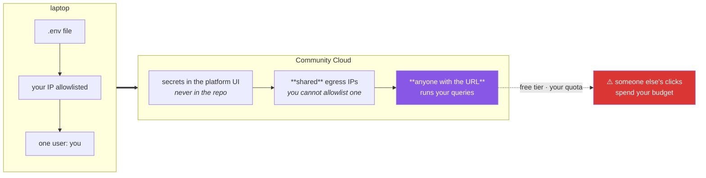

# Day 57 — Deploy: secrets, and the first URL you can send someone

**Phase 7 gate** · ID: **APP-08** (deployment and secrets management) · Artifact: **a live URL + ADR-003**

> **Yesterday:** streaming, and the generator that survives cancellation.
> **Today:** the app leaves your laptop. That changes three things — secrets stop being a `.env` file,
> your database access list stops containing your IP, and **anyone with the URL can run your queries.**
> The last one is the interesting one. **Phase 7 closes.**
> **Tomorrow:** Phase 8, statistics.

```bash
./m start 57 && ./m scaffold 57
```

**Time:** 2 hours (gate day). **Request budget:** 0 model calls · a real deployment.

---

## §1 The story

Fifty-six days of work has run on one machine, behind your own firewall, using a `.env` file that git
ignores. Deployment breaks all three assumptions at once:



**Secrets.** Community Cloud has a secrets UI that populates `st.secrets`, a TOML-backed mapping. Your
`.env` never leaves your machine. This means `setu.config` needs one more source — and it must not
break locally.

**Network.** Community Cloud egresses from shared, changing IP addresses. You cannot allowlist "the
app". For Atlas that means either allowing all IPs — with a **strong** database user password, because
that password becomes the only thing standing between the internet and your data — or accepting that
this app cannot reach Mongo. Make that a decision, not an accident.

**Access.** This is the part people skip. A public Streamlit URL means **anyone can run your queries
against your free-tier databases.** Not malice — a crawler, a link shared onward, a bot. Principle 5
says the budget is requests per day; Principle 11 says name the blast radius. So today the app gets
rate limits and a read-only posture, and the answer to "what can a stranger do with this URL?" goes in
ADR-003.

That ADR is the phase gate's written half. The Day-51 index reserved **ADR-003** for exactly this
question: *what belongs in a Streamlit app, and what belongs behind an API?*

---

## §2 Setup — run this

```bash
mkdir -p days/day-57/lab .streamlit
touch days/day-57/lab/deploy_check.py
touch .streamlit/config.toml
touch .streamlit/secrets.toml.example
touch docs/adr/ADR-003-app-boundary.md
```

⚠️ **Before you write anything into `.streamlit/`:**

```bash
grep -qxF '.streamlit/secrets.toml' .gitignore || echo '.streamlit/secrets.toml' >> .gitignore
grep -n 'secrets' .gitignore
```

Day 3's rule: the ignore comes **before** the file exists. `secrets.toml.example` holds names only and
is committed; `secrets.toml` holds values and never is.

---

## §3 APP-08 — configuration, secrets, and what a stranger can do

`.streamlit/config.toml` — committed, no secrets:

```toml
[server]
headless = true
maxUploadSize = 5

[browser]
gatherUsageStats = false

[theme]
base = "light"
primaryColor = "#1f6feb"
```

**Line by line:**

- `headless = true` — do not try to open a browser. Required on a server; harmless locally.
- `maxUploadSize = 5` — megabytes, matching Day 53's `MAX_UPLOAD_MB`. **Enforce a limit in two places:**
  the platform rejects the upload, your code rejects the file. Neither alone is enough.
- `gatherUsageStats = false` — opt out of telemetry.
- `[theme]` — cosmetic, and it must not fight Day 40's chart palette.

`.streamlit/secrets.toml.example` — committed, **names only**:

```toml
# Copy to secrets.toml locally, or paste into the Community Cloud secrets UI.
# NAMES ONLY in this file. Never a value.
POSTGRES_DSN = ""
MONGODB_URI = ""
GEMINI_API_KEY = ""
```

`days/day-57/lab/deploy_check.py`:

```python
"""APP-08: a pre-flight check you run BEFORE deploying, and again after."""

from __future__ import annotations

import subprocess
from pathlib import Path

import streamlit as st

st.set_page_config(page_title="Day 57 — deploy check", layout="wide")
st.title("Pre-flight")


# --- 1. where secrets come from -------------------------------------------
st.header("1. Secrets")

st.write(
    "Locally: `.env`, read by `python-dotenv` (Day 2).\n\n"
    "Deployed: the platform's secrets UI, exposed as `st.secrets`.\n\n"
    "`setu.config` must read **both**, preferring the real environment."
)

available = []
for name in ("POSTGRES_DSN", "MONGODB_URI", "GEMINI_API_KEY"):
    in_secrets = name in st.secrets if hasattr(st, "secrets") else False
    import os

    in_env = bool(os.environ.get(name))
    available.append({"name": name, "in st.secrets": in_secrets, "in environ": in_env})

st.dataframe(available, hide_index=True, use_container_width=True)
st.caption(
    "Never `st.write(st.secrets)` — it renders the values into the page. This table "
    "shows PRESENCE only, which is all you ever need to debug."
)


# --- 2. the repo must be clean --------------------------------------------
st.header("2. Nothing secret is committed")

tracked = subprocess.run(
    ["git", "ls-files"], capture_output=True, text=True, check=False
).stdout.split()

bad = [f for f in tracked if f.endswith((".env", "secrets.toml"))]
if bad:
    st.error(f"SECRETS ARE COMMITTED: {bad}")
    st.write("Rotate every credential in them. Removing the file does not remove the history.")
else:
    st.success("no .env or secrets.toml is tracked by git")

st.caption(
    "Community Cloud deploys from your **public** GitHub repo. Anything committed is "
    "world-readable, and git history outlives the commit that deleted it."
)


# --- 3. what a stranger can do -------------------------------------------
st.header("3. What can someone with the URL do?")

st.warning(
    "A public Streamlit URL means **anyone** can run whatever this app runs — against "
    "your free-tier databases, on your quota. Not necessarily malice: a crawler, a "
    "forwarded link, a bot."
)

st.write(
    "**The posture this project takes:**\n"
    "- every query is read-only; the app has no write path (Principle 11)\n"
    "- every query has a `LIMIT` (Days 47 and 49)\n"
    "- a per-session request budget, enforced in the app\n"
    "- no secret is ever rendered\n"
    "- destructive helpers (Day 50) are not imported here **at all**"
)

st.info(
    "The alternative posture — a login — is a real option and ADR-003 must consider it. "
    "Community Cloud can restrict an app to named Google accounts on the free tier. "
    "That is the right answer for anything with a write path."
)


# --- 4. the network changes ----------------------------------------------
st.header("4. Your IP allowlist stops working")

st.write(
    "Community Cloud egresses from **shared, changing** addresses. You cannot allowlist it.\n\n"
    "For MongoDB Atlas that leaves three choices, and you must pick one deliberately:"
)
st.write(
    "1. **Allow 0.0.0.0/0** with a long random database password. The password becomes "
    "the only control — so it must be one you generated, not one you typed.\n"
    "2. **Do not use Mongo from the deployed app.** Postgres only; the Mongo panel shows "
    "'unavailable in this environment'.\n"
    "3. **Use a paid tier with private networking.** Out of scope (Principle 5)."
)
st.caption("Whichever you choose, write it in ADR-003 with the reason. Silence here is a decision too.")


# --- 5. resources --------------------------------------------------------
st.header("5. What the free tier gives you")

st.write(
    "- limited RAM per app — a big `read_parquet` at module scope will kill it (Day 52)\n"
    "- the app **sleeps** when idle and cold-starts on the next visit\n"
    "- CPU is shared; a heavy computation makes the whole app unresponsive\n"
    "- one process serving every visitor: `@st.cache_resource` is shared across them (Day 55)"
)
st.caption("Cold start is why the health panel must render before anything slow (Day 52's st.stop).")


# --- 6. the checklist ----------------------------------------------------
st.header("6. Deploy checklist")

for item in [
    ".streamlit/secrets.toml is gitignored (and was, before it existed)",
    "secrets.toml.example is committed with names only",
    "requirements are pinned — uv.lock committed, or a generated requirements.txt",
    "the entry point is app/Home.py",
    "every secret is read through setu.config, never os.environ directly",
    "no write path is reachable from the UI",
    "every query has a LIMIT",
    "a per-session request budget is enforced",
    "the Atlas access decision is made and written in ADR-003",
    "the health panel renders before anything slow",
]:
    st.checkbox(item, key=f"chk_{hash(item)}")

st.caption("Tick these here, then again in CHECKLIST.md. The second pass catches the first pass.")
```

**Line by line:**

- The presence table rather than the values — **never `st.write(st.secrets)`.** It renders your
  credentials into the page, and a screenshot in a bug report is then a credential leak. Presence is
  all you ever need to debug a missing secret.
- `git ls-files` filtered for `.env` and `secrets.toml` — **the most important check on this page.**
  Community Cloud deploys from a **public** GitHub repo, so anything committed is world-readable. And
  removing the file does not remove it from history: if this ever fires, **rotate the credentials**,
  do not just delete the file.
- **§3 is the part people skip.** A public URL means anyone can run your queries on your quota. The
  posture — read-only, limited, budgeted, no destructive imports — is Principle 11 applied to a URL.
  Note the alternative is named honestly: Community Cloud can restrict an app to specific Google
  accounts, and **that is the right answer once there is a write path.**
- **§4, the network change.** Shared egress IPs mean the Day-3 access list cannot work. Three options,
  and option 1's caveat is the real content: with `0.0.0.0/0`, the database password is the *only*
  control, so it must be generated rather than chosen.
- **§5's cold start** is why Day 52's `st.stop()` guard matters: the first visitor after an idle period
  waits for a container to start, and if the health panel is below a slow query they see nothing.
- The checkbox list — tick it here, then again in `CHECKLIST.md`. Two passes catch what one misses.

---

## §4 Build brief

Extend `src/setu/config.py` and `src/setu/app.py`:

```python
# --- config.py -------------------------------------------------------------

def get_secret(name: str, *, required: bool = True) -> str | None:
    """TODO(me): read from the environment, then st.secrets, then .env.

    Precedence, highest first:
      1. os.environ            (a real env var always wins)
      2. st.secrets            (the deployed platform)
      3. .env via load_dotenv  (local development)

    - importing streamlit must be OPTIONAL: this module is imported by scripts and
      tests that have no Streamlit. Guard the import; a missing streamlit is not an error.
    - strip the value (Day 2)
    - raise MissingKey when required and absent, naming the variable AND the three
      places it was looked for
    - never log or return the value in an exception message
    """
    raise NotImplementedError


def running_deployed() -> bool:
    """TODO(me): True when running on a hosted platform rather than a laptop.

    Detect via st.secrets being populated, or a platform env var. Must not raise
    when Streamlit is absent. Used to decide whether the Mongo panel renders at all.
    """
    raise NotImplementedError


# --- app.py ----------------------------------------------------------------

SESSION_REQUEST_BUDGET = 50


def check_budget(state: dict, *, cost: int = 1, budget: int = SESSION_REQUEST_BUDGET) -> dict:
    """TODO(me): a per-session request budget. PURE - takes and returns a dict.

    state = {"spent": int}
    - raise DataError if this request would exceed `budget`, naming spent and budget
    - return a NEW dict with spent increased (ADR-001)
    - raise DataError if cost < 1
    - this is Principle 5 for a PUBLIC url: a stranger's clicks spend your quota
    """
    raise NotImplementedError


def deployment_report() -> dict:
    """TODO(me): what the pre-flight page shows. PURE-ish; never raises.

    {"secrets": {name: bool}, "deployed": bool, "committed_secrets": [str],
     "writes_reachable": bool}

    - `secrets` reports PRESENCE only, never values
    - `committed_secrets` lists any tracked .env / secrets.toml (empty is the good case)
    - `writes_reachable` is True if any destructive helper is importable from setu.app
    """
    raise NotImplementedError


def assert_read_only() -> None:
    """TODO(me): raise DataError if the app module can reach a destructive function.

    Check that setu.app does not import delete_documents, update_documents, execute,
    or insert_many (Days 47 and 50).
    The message must name what it found. This is Principle 11 for a public URL.
    """
    raise NotImplementedError
```

- `get_secret` guarding the Streamlit import is the detail that makes this work: `scripts/tracker.py`,
  `pytest` and `scripts/figure_pack.py` all import `setu.config` and none of them has Streamlit
  running. A hard `import streamlit` here breaks all three.
- `check_budget` being **pure** means the whole "a stranger cannot burn your quota" guarantee is a unit
  test rather than something you hope about.
- `assert_read_only` inspecting imports is Principle 11 made mechanical. It is a stricter version of
  the layering test from Day 17.

---

## §5 The artifact — ADR-003

`docs/adr/ADR-003-app-boundary.md`. Third of thirteen.

> *What belongs in a Streamlit app, and what belongs behind an API?*

Required content:

- **Context.** The app is public. Free-tier databases, a shared quota, no login by default. State what
  the app currently does and what Day 234's FastAPI service will do instead.
- **Options.** At least four:
  1. Public read-only Streamlit, no login (what today ships)
  2. Streamlit with Google-account restriction
  3. Streamlit as a *client* of the Day-234 FastAPI service, holding no credentials itself
  4. No public app; run it locally only
- **The three questions the boundary answers.** *Who can reach it? What can it do? Whose quota does it
  spend?* Answer each explicitly.
- **The Atlas decision from §4** — which of the three options, and why.
- **Decision.** One sentence.
- **Consequences.** Including: what has to change the first time the app needs a write path. (Answer:
  it stops being option 1.)
- **What would change our minds.** Specific.
- **Cold read.** Tomorrow, reviewer hat on, sign it.

> **A defensible answer**, to test against your own situation: **ship option 1 now and option 3 later.**
> The app is a read-only window with a per-session budget and no credentials that can write. When
> Day 234's FastAPI service exists, the app becomes its client, holds no database credentials at all,
> and every rule about who may do what lives in one place instead of two. The trigger to move is the
> first write path — and Day 232's approval gate **is** a write path, which is why this ADR gets
> revisited then rather than never.

---

## §6 The eval that must be able to fail

Add to `tests/test_app.py`:

```python
from setu.app import (
    SESSION_REQUEST_BUDGET,
    assert_read_only,
    check_budget,
    deployment_report,
)


def test_budget_allows_a_request_under_the_cap():
    assert check_budget({"spent": 0})["spent"] == 1


def test_budget_refuses_over_the_cap():
    with pytest.raises(DataError) as info:
        check_budget({"spent": SESSION_REQUEST_BUDGET}, budget=SESSION_REQUEST_BUDGET)
    message = str(info.value)
    assert str(SESSION_REQUEST_BUDGET) in message


def test_budget_refuses_the_request_that_would_exceed():
    """The 51st request must be refused, not the 52nd."""
    with pytest.raises(DataError):
        check_budget({"spent": 9}, cost=2, budget=10)


def test_budget_does_not_mutate_its_input():
    state = {"spent": 3}
    check_budget(state)
    assert state["spent"] == 3, "ADR-001 violated"


def test_budget_rejects_a_zero_cost():
    with pytest.raises(DataError):
        check_budget({"spent": 0}, cost=0)


def test_budget_is_pure():
    import inspect

    assert "st." not in inspect.getsource(check_budget)


def test_no_secrets_are_committed():
    """The single most important test in this file."""
    import subprocess

    tracked = subprocess.run(
        ["git", "ls-files"], capture_output=True, text=True, check=False
    ).stdout.split()
    bad = [f for f in tracked if f.endswith((".env", "secrets.toml"))]
    assert not bad, f"secrets are committed: {bad} — ROTATE them, do not just delete"


def test_secrets_example_has_no_values():
    from pathlib import Path

    path = Path(".streamlit/secrets.toml.example")
    assert path.exists()
    for line in path.read_text(encoding="utf-8").splitlines():
        if "=" in line and not line.strip().startswith("#"):
            _, _, value = line.partition("=")
            assert value.strip().strip('"') == "", f"a value leaked into the example: {line}"


def test_gitignore_covers_streamlit_secrets():
    from pathlib import Path

    ignored = Path(".gitignore").read_text(encoding="utf-8").splitlines()
    assert any(line.strip() == ".streamlit/secrets.toml" for line in ignored)


def test_config_does_not_hard_import_streamlit():
    """scripts and tests import setu.config with no Streamlit running."""
    import subprocess
    import sys

    result = subprocess.run(
        [sys.executable, "-c", "import setu.config; print('ok')"],
        capture_output=True, text=True,
    )
    assert result.returncode == 0, result.stderr
    source = __import__("pathlib").Path("src/setu/config.py").read_text(encoding="utf-8")
    for line in source.splitlines():
        assert not line.startswith("import streamlit"), "top-level streamlit import in config"


def test_the_app_is_read_only():
    """Principle 11: what can a stranger with the URL do?"""
    assert_read_only()


def test_read_only_check_detects_a_destructive_import(monkeypatch):
    import setu.app as app

    monkeypatch.setattr(app, "delete_documents", lambda *a, **k: None, raising=False)
    with pytest.raises(DataError) as info:
        assert_read_only()
    assert "delete_documents" in str(info.value)


def test_deployment_report_never_leaks_values():
    report = deployment_report()
    flat = str(report)
    for marker in ("postgresql://", "mongodb+srv://", "AIza", "sk-"):
        assert marker not in flat, f"a secret value appeared in the report: {marker}"


def test_deployment_report_is_json_serialisable():
    import json

    json.dumps(deployment_report())


def test_deployment_report_never_raises(monkeypatch):
    monkeypatch.delenv("POSTGRES_DSN", raising=False)
    monkeypatch.delenv("MONGODB_URI", raising=False)
    assert deployment_report()["deployed"] in (True, False)


def test_upload_limit_matches_the_platform_config():
    """Two places must agree, or the app rejects what the platform accepted."""
    import tomllib
    from pathlib import Path

    from setu.app import MAX_UPLOAD_MB

    config = tomllib.loads(Path(".streamlit/config.toml").read_text(encoding="utf-8"))
    assert config["server"]["maxUploadSize"] == MAX_UPLOAD_MB


def test_adr_003_answers_the_three_questions():
    from pathlib import Path

    path = Path("docs/adr/ADR-003-app-boundary.md")
    assert path.exists(), "ADR-003 was not written"
    text = path.read_text(encoding="utf-8").lower()

    for heading in ("context", "options", "decision", "consequences"):
        assert heading in text, f"ADR-003 is missing its {heading} section"

    assert "login" in text or "authenticat" in text, "the login option was not considered"
    assert "quota" in text or "budget" in text, "whose quota it spends was not answered"
    assert "0.0.0.0" in text or "access list" in text or "atlas" in text, (
        "the Atlas network decision was not recorded"
    )
    assert "change our minds" in text, "no falsification condition stated"


def test_phase_7_app_module_is_complete():
    from setu import app

    expected = [
        "summarise_health", "format_latency", "paginate",                    # Day 52
        "SearchSpec", "validate_spec", "spec_to_filters", "check_upload",    # Day 53
        "next_stage", "apply_action", "session_keys_to_clear",               # Day 54
        "cache_ttl", "assert_cacheable", "cache_key_parts", "format_table",  # Day 55
        "step_stream", "throttle", "collect_stream", "chat_history_to_messages",  # Day 56
        "check_budget", "deployment_report", "assert_read_only",             # Day 57
    ]
    missing = [name for name in expected if not hasattr(app, name)]
    assert not missing, f"Phase 7 is incomplete: {missing}"
```

**Line by line:**

- `test_no_secrets_are_committed` — **the single most important test in the file**, and its failure
  message says *rotate*, not *delete*. Git history outlives the commit that removed a file, and the
  repo is public.
- `test_secrets_example_has_no_values` — parses the example file and asserts every value is empty. A
  real DSN pasted into `.example` "to show the format" is a leak that looks like documentation.
- `test_config_does_not_hard_import_streamlit` — imports `setu.config` in a **fresh subprocess** (Day
  17's technique) and greps for a top-level import. `scripts/tracker.py` and every test run through
  this module; a hard import breaks the whole toolchain outside a Streamlit process.
- `test_read_only_check_detects_a_destructive_import` — **the day's real assessment.** It monkeypatches
  a destructive function onto the module and asserts the guard fires. Without this, `assert_read_only`
  could be a function that always passes and nobody would know.
- `test_deployment_report_never_leaks_values` — checks the stringified report for DSN and API-key
  prefixes. A "helpful" debug field containing the connection string is exactly how a screenshot
  becomes an incident.
- `test_budget_refuses_the_request_that_would_exceed` — `spent=9, cost=2, budget=10`. Off by one here
  means the cap is one request too generous, which is a small bug with a real cost on a free tier.
- `test_upload_limit_matches_the_platform_config` — parses `config.toml` and compares to
  `MAX_UPLOAD_MB`. Two limits that disagree means the app rejects files the platform accepted, and the
  user sees a confusing error after a long upload.
- `test_adr_003_answers_the_three_questions` — the gate test, requiring the login option, the quota
  answer and the Atlas decision to all appear. Same escalating strictness as Days 35 and 51.

```bash
uv run python -m pytest tests/test_app.py -v
```

---

## §7 Deploy

1. **Push a clean repo.** `git status --porcelain` empty; `test_no_secrets_are_committed` green.
2. **Generate a requirements file** if the platform needs one:
   `uv export --no-hashes --format requirements-txt > requirements.txt` — then commit it. Principle 4:
   the deployed app runs the versions you pinned.
3. **Deploy** at <https://share.streamlit.io>: your repo, your branch, `app/Home.py`.
4. **Paste your secrets** into the app's secrets UI. Names from `secrets.toml.example`, values from
   your `.env`.
5. **Make the Atlas decision** from §4 and apply it.
6. **Open the URL in a private window** — no cookies, no session. That is what a stranger sees.
7. **Click everything**, then check your database dashboards for the load you just generated.

---

## §8 Request budget

| Resource | Spent today |
|---|---|
| LLM calls | **0** |
| Deployment | one app, free tier |
| Database round trips | whatever your own clicking generates — watch it |

---

## §9 Traps

- **Committing `.env` or `secrets.toml`.** Public repo. Rotate, do not just delete.
- **A real value in `secrets.toml.example`.** A leak dressed as documentation.
- **`st.write(st.secrets)`.** Renders credentials into the page.
- **A hard `import streamlit` in `config.py`.** Breaks every script and test.
- **Assuming your IP allowlist still works.** Shared, changing egress.
- **`0.0.0.0/0` with a weak database password.** The password is now the only control.
- **Unpinned dependencies at deploy time.** Principle 4 does not stop at the laptop.
- **A public app with a write path.** Add the login first.
- **No per-session budget.** A crawler spends your daily quota.
- **A slow call above the health panel.** Cold start plus nothing to look at.
- **`@st.cache_resource` holding per-user data.** One process, every visitor (Day 55).
- **Testing only in your logged-in browser.** Use a private window.

---

## §10 Verify before you code

Written **2026-08-21**:

- <https://docs.streamlit.io/deploy/streamlit-community-cloud/deploy-your-app/secrets-management> —
  the secrets UI and `st.secrets`.
- <https://docs.streamlit.io/deploy/streamlit-community-cloud/share-your-app> — viewer restriction on
  the free tier.
- <https://docs.streamlit.io/deploy/streamlit-community-cloud/manage-your-app> — resource limits and
  sleeping.
- <https://www.mongodb.com/docs/atlas/security/ip-access-list/> — the access-list options.

---

## §11 Say it in an interview

> "Deploying changed three assumptions at once. Secrets moved from a gitignored `.env` to the
> platform's secrets store, so the config layer reads environment first, then `st.secrets`, then
> `.env` — with the Streamlit import guarded, because scripts and tests import that module with no
> Streamlit running. The network changed, because Community Cloud egresses from shared addresses, so
> the Atlas IP allowlist stops being a control and the database password becomes the only one; that's
> a decision I wrote down rather than defaulted into. And the one people skip: a public URL means
> anyone can run your queries against your free-tier quota. So the app is read-only with a per-session
> request budget, and there's a test that monkeypatches a destructive function onto the app module and
> asserts the read-only check actually fires — otherwise it's a guard that always passes."

---

## §12 Done when — **Phase 7 gate**

Tick [`CHECKLIST.md`](CHECKLIST.md), then:

```bash
./m check
./m done 57
./m status
```

**Gate criteria:** a **live URL** you can send someone · it renders the health panel, a search form,
a chart from `setu.plots` and a table · no secret is committed and none is rendered · the app is
read-only with an enforced per-session budget · the Atlas decision is made and recorded · **ADR-003**
written with your reasoning and cold-read · `test_phase_7_app_module_is_complete` green · you opened
it in a private window and clicked everything.

Tomorrow: Phase 8, and the statistics that make Day 90's report defensible.
