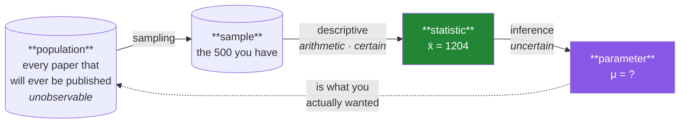

# Day 58 — Descriptive vs inferential, and levels of measurement

**Phase 8 · Module 8 · Statistics** · IDs: **ST-01** (descriptive vs inferential, population vs sample), **ST-02** (data types and levels of measurement)

> **Yesterday:** Phase 7 closed with a live URL and ADR-003.
> **Today:** the two distinctions that decide whether a number you compute means anything — and the
> one that decides whether a computation is *legal at all*. You have been computing means since Day
> 25; today you learn when a mean is nonsense.
> **Tomorrow:** central tendency.

```bash
./m start 58 && ./m scaffold 58
```

**Time:** 100 minutes. **Request budget:** 0 model calls.

---

## §1 The story

Two questions, and almost every statistical mistake is answering one while thinking about the other.

**Question 1: is this a fact or an estimate?**

- **Descriptive statistics** describe the data you have. "The mean citation count of these 500 papers
  is 1,204." That is a **fact**. It has no error bar, no p-value, no uncertainty. It is arithmetic.
- **Inferential statistics** use the data you have to say something about data you do **not** have.
  "Papers at this venue average about 1,204 citations, ±80." That is a **claim about a population**,
  and it can be wrong.

The same number, `1204`, is a fact in one sentence and an estimate in the other. What changed is the
**scope of the claim** — and only the second one needs the rest of Phase 8.



Two words worth being strict about, because the whole phase uses them:

- A **statistic** is computed from a sample. `x̄`, `s`. You can always compute it.
- A **parameter** is the population's true value. `μ`, `σ`. You can essentially never observe it.

**Inference is the business of estimating a parameter from a statistic, and quantifying how wrong you
might be.** That is all Phase 8 is doing.

**Question 2: is this computation legal?**

Not every number supports every operation. `venue_id = 3` is a number in your dataframe and averaging
it is meaningless. The four **levels of measurement** tell you what is permitted:

| Level | Example | Can you… | Legal statistics |
|---|---|---|---|
| **Nominal** | venue, category, `is_open_access` | only tell things apart | mode, counts, χ² (Day 73) |
| **Ordinal** | quality low/medium/high, star rating | rank them, but gaps are not equal | + median, percentiles, Spearman |
| **Interval** | temperature °C, calendar year | subtract, but there is no true zero | + mean, standard deviation |
| **Ratio** | citations, page count, duration | everything; zero means *none* | + ratios ("twice as many") |

The two that catch people: **a mean of an ordinal variable is not meaningful** (the distance from
"low" to "medium" is not the distance from "medium" to "high"), and **a ratio of an interval variable
is not meaningful** (20 °C is not "twice as warm" as 10 °C, because 0 °C is not "no temperature").

This is not pedantry. It is Day 81's encoding decision, Day 73's test choice, and Day 88's wine-quality
target all resting on the same question.

---

## §2 Setup — run this

```bash
uv add "scipy==1.18.0"
mkdir -p days/day-58/lab
touch days/day-58/lab/levels.py
```

Pin whatever **your** Day-1 verify run reported. `src/setu/stats.py` (Day 25) grows through this whole
phase.

---

## §3 ST-01 — sample and population

`days/day-58/lab/levels.py`:

```python
"""ST-01 / ST-02: statistic vs parameter, and what each level of measurement permits."""

from __future__ import annotations

import numpy as np
import pandas as pd

from setu.arrays import make_rng


def population() -> np.ndarray:
    """The thing you can never actually see. Simulated so we can cheat and look."""
    rng = make_rng(0)
    return rng.lognormal(mean=6.5, sigma=1.1, size=200_000)


def a_statistic_is_not_a_parameter() -> None:
    pop = population()
    mu, sigma = pop.mean(), pop.std(ddof=0)

    rng = make_rng(1)
    print(f"\n  μ (population mean, unobservable in reality) = {mu:,.1f}")
    print(f"  σ (population sd)                            = {sigma:,.1f}\n")

    for n in (10, 50, 500, 5_000):
        sample = rng.choice(pop, size=n, replace=False)
        print(f"  n={n:>5}  x̄ = {sample.mean():>10,.1f}   error = {sample.mean() - mu:>+9,.1f}")

    print("\n  Every x̄ is a FACT about its sample and an ESTIMATE of μ.")
    print("  The error shrinks with n — that is Day 67's Central Limit Theorem,")
    print("  and Day 68 turns it into an interval.")


def the_same_sample_twice() -> None:
    pop = population()
    rng = make_rng(2)
    a, b = rng.choice(pop, 200), rng.choice(pop, 200)

    print(f"\n  two samples of 200 from the SAME population:")
    print(f"    x̄₁ = {a.mean():,.1f}")
    print(f"    x̄₂ = {b.mean():,.1f}")
    print(f"    difference = {abs(a.mean() - b.mean()):,.1f}")
    print("\n  Nothing changed but the draw. Any two groups differ; the question")
    print("  Day 69 answers is whether a difference is BIGGER than this.")


def sampling_bias_beats_sample_size() -> None:
    pop = population()
    rng = make_rng(3)

    fair = rng.choice(pop, 500)
    biased = rng.choice(pop[pop > np.percentile(pop, 70)], 50_000)

    print(f"\n  fair sample,   n=   500: x̄ = {fair.mean():>10,.1f}")
    print(f"  biased sample, n=50,000: x̄ = {biased.mean():>10,.1f}")
    print(f"  true μ                 : {pop.mean():>10,.1f}")
    print("\n  The biased sample is 100x larger and far more wrong. A bigger sample")
    print("  shrinks VARIANCE, not BIAS. No amount of n fixes 'we only surveyed")
    print("  the papers people already cite'.")


def descriptive_claims_need_no_error_bar() -> None:
    frame = pd.DataFrame({"paper": ["a", "b", "c"], "citations": [10, 20, 300]})
    print(f"\n  'These three papers have a mean of {frame['citations'].mean():.1f} citations.'")
    print("    -> DESCRIPTIVE. A fact about these three. No uncertainty.")
    print("\n  'Papers like these average about 110 citations.'")
    print("    -> INFERENTIAL. A claim about papers you have not seen. Needs an interval.")
    print("\n  Same arithmetic. Different sentence. Only the second can be WRONG.")
```

**Line by line:**

- `population()` — simulated so you can **cheat and look at `μ`**, which is the only way to build
  intuition. In reality the population is unobservable, which is the entire reason inference exists.
- `pop.std(ddof=0)` — `ddof=0` here is **correct and deliberate**: this is the whole population, so
  there is no sample correction to make. Day 60 explains why sample standard deviation uses `ddof=1`,
  and note that this project's helpers default to `1` (Day 20) because we are almost always sampling.
- The `n` loop — the error shrinks as `n` grows, and **not smoothly**. Run it a few times with
  different seeds and watch a small sample occasionally land closer than a large one. That is chance,
  and it is why a single sample tells you nothing about its own accuracy.
- `the_same_sample_twice` — **two samples from an identical population differ.** This is the most
  important intuition in Phase 9: any two groups you compare will differ, so "they differ" is never
  the finding. The question is whether they differ *more than this*.
- `sampling_bias_beats_sample_size` — **the biased sample is 100× larger and far more wrong.** A
  bigger sample shrinks variance; it does nothing to bias. Every "we surveyed 50,000 users" headline
  is worth this check, and on Day 87 the movie-review dataset has exactly this problem.
- `descriptive_claims_need_no_error_bar` — the same arithmetic, two sentences. **Only the second can
  be wrong**, and knowing which one you are making is what tells you whether the rest of this phase
  applies.

---

## §4 ST-02 — levels of measurement

Add to the same file:

```python
def the_four_levels() -> None:
    frame = pd.DataFrame(
        {
            "venue_id": [1, 2, 3, 1],
            "venue": ["NeurIPS", "ICML", "ACL", "NeurIPS"],
            "quality": pd.Categorical(
                ["high", "low", "medium", "high"],
                categories=["low", "medium", "high"], ordered=True,
            ),
            "year": [2017, 2018, 2020, 2021],
            "citations": [178_000, 120_000, 40_000, 5_000],
        }
    )

    print(f"\n{frame.dtypes.to_dict()=}\n")
    print("  venue_id   NOMINAL  — an integer, but averaging it is meaningless")
    print("  venue      NOMINAL  — pandas str dtype (Day 26)")
    print("  quality    ORDINAL  — ordered categorical (Day 34) — order is real, gaps are not")
    print("  year       INTERVAL — differences mean something; year 0 is a convention")
    print("  citations  RATIO    — zero means none; 'twice as many' is meaningful")

    print(f"\n  mean venue_id = {frame['venue_id'].mean():.2f}   <- ARITHMETICALLY fine, MEANINGLESS")
    print("  ^ this is the number that gets into a model as a feature and quietly")
    print("    tells it NeurIPS < ICML < ACL. Day 81's one-hot encoding exists for this.")


def ordinal_means_are_a_lie() -> None:
    ratings = pd.Categorical(
        ["low", "low", "high", "high"], categories=["low", "medium", "high"], ordered=True
    )
    codes = ratings.codes

    print(f"\n  codes = {codes.tolist()}  mean = {codes.mean():.2f}")
    print("  A mean of 1.0 says 'medium'. NOT ONE observation was medium.")
    print("\n  The mean assumes low→medium is the same distance as medium→high.")
    print("  Nothing guarantees that. Use the MEDIAN (Day 59) for ordinal data.")
    print(f"  median code = {np.median(codes):.1f}")

    print("\n  ⚠️ Day 88's wine-quality target is ordinal. Treating it as ratio makes")
    print("     'predicted 5.3' meaningful-looking and meaningless.")


def interval_has_no_true_zero() -> None:
    print("\n  Celsius is INTERVAL:")
    print("    20°C - 10°C = 10°C          ✅ differences are meaningful")
    print("    20°C / 10°C = 'twice as hot' ❌ 0°C is not 'no temperature'")
    print("\n  Kelvin is RATIO: 0 K really is no thermal energy, so 200K IS twice 100K.")
    print("\n  Years are interval. 'Papers from 2020 are 1.001x as old as 2018' is nonsense.")
    print("  Convert to a RATIO first: age_years = 2026 - year. Then ratios work.")


def what_each_level_permits() -> None:
    rows = [
        ("nominal",  "mode, counts, proportions", "χ² (Day 73), Cramér's V", "one-hot (Day 81)"),
        ("ordinal",  "+ median, percentiles",     "Spearman (Day 62), Mann-Whitney", "ordinal encode"),
        ("interval", "+ mean, sd, Pearson",       "t-test (Day 71), ANOVA", "scale (Day 80)"),
        ("ratio",    "+ geometric mean, CV",      "everything above", "log transform (Day 61)"),
    ]
    print(f"\n  {'level':<10} {'statistics':<28} {'tests':<34} {'encoding'}")
    for level, stats, tests, enc in rows:
        print(f"  {level:<10} {stats:<28} {tests:<34} {enc}")
    print("\n  Read down the 'tests' column: your level of measurement CHOOSES your test.")
    print("  That is why Day 73 does not begin with 'pick a test'.")


def the_dtype_does_not_tell_you() -> None:
    frame = pd.DataFrame({"venue_id": [1, 2, 3], "citations": [10, 20, 30]})
    print(f"\n  {frame.dtypes.to_dict()}")
    print("  Both int64. One is nominal, one is ratio. pandas cannot tell them apart,")
    print("  and neither can scikit-learn. YOU have to declare it — which is why §5")
    print("  builds a schema rather than inferring one.")


if __name__ == "__main__":
    a_statistic_is_not_a_parameter()
    the_same_sample_twice()
    sampling_bias_beats_sample_size()
    descriptive_claims_need_no_error_bar()
    the_four_levels()
    ordinal_means_are_a_lie()
    interval_has_no_true_zero()
    what_each_level_permits()
    the_dtype_does_not_tell_you()
```

**Line by line:**

- `mean venue_id = 1.75` — **arithmetically fine, semantically meaningless.** And this is not a toy
  concern: an integer category id passed to a model as a feature tells it that NeurIPS < ICML < ACL,
  and the model will happily learn a slope on it. Day 81's one-hot encoding exists for exactly this.
- `ordinal_means_are_a_lie` — the mean of `[low, low, high, high]` codes is 1.0, which reads as
  "medium", and **not one observation was medium.** The mean assumes equal spacing between levels, and
  nothing guarantees it. For ordinal data the median is the right summary (Day 59).
- The Day-88 warning is real: wine quality is a 3–9 ordinal score. Predicting `5.3` looks meaningful
  and is not, and it changes whether that project is a regression or an ordinal classification.
- `interval_has_no_true_zero` — Celsius differences are meaningful; Celsius **ratios** are not. The
  practical version: **years are interval, age is ratio.** Convert `year` to `age = 2026 - year` and
  ratios become legal. That conversion appears in Day 82's feature construction.
- `what_each_level_permits` — **read down the "tests" column.** Your level of measurement chooses your
  statistical test. That is why Day 73 does not open with "pick a test": the choice was made earlier,
  by the data.
- `the_dtype_does_not_tell_you` — `venue_id` and `citations` are both `int64`. **pandas cannot
  distinguish them and neither can scikit-learn.** The level of measurement is knowledge you have and
  the machine does not, which is why §5 builds a declared schema instead of inferring one.

---

## §5 Build brief

Extend `src/setu/stats.py`:

```python
from typing import Literal

Level = Literal["nominal", "ordinal", "interval", "ratio"]
LEVELS: tuple[Level, ...] = ("nominal", "ordinal", "interval", "ratio")

PERMITTED: dict[Level, frozenset[str]] = {
    "nominal": frozenset({"mode", "count", "proportion"}),
    "ordinal": frozenset({"mode", "count", "proportion", "median", "percentile", "min", "max"}),
    "interval": frozenset({"mode", "count", "proportion", "median", "percentile",
                           "min", "max", "mean", "std", "pearson"}),
    "ratio": frozenset({"mode", "count", "proportion", "median", "percentile", "min", "max",
                        "mean", "std", "pearson", "geometric_mean", "cv", "ratio"}),
}


def assert_permitted(level: Level, statistic: str) -> None:
    """TODO(me): raise DataError if `statistic` is not legal for `level`.

    - raise DataError for an unknown level or an unknown statistic (naming what IS known)
    - the message must say WHY, not just refuse: 'a mean of an ordinal variable assumes
      equal spacing between levels'
    - keep the reasons in a dict beside PERMITTED
    """
    raise NotImplementedError


def describe_by_level(values, *, level: Level) -> dict:
    """TODO(me): compute only the statistics that `level` permits. PURE.

    - always: n, n_missing, n_unique, mode
    - ordinal and up: + median, q25, q75
    - interval and up: + mean, std (ddof=1, Day 20)
    - ratio only: + geometric_mean, cv (std/mean)
    - NEVER return a mean for nominal or ordinal data - that is the point
    - reuse summary() from Day 25 for the numeric part; do not reimplement it
    - all-missing input returns nan values, never raises
    """
    raise NotImplementedError


def infer_level(series) -> Level:
    """TODO(me): a BEST GUESS at the level, for a first look only.

    - an ordered categorical (Day 34) -> 'ordinal'
    - an unordered categorical, str dtype, or bool -> 'nominal'
    - a numeric column whose name ends in _id, or with <= 10 distinct integer values
      that look like codes -> 'nominal' (flag it)
    - other numeric with any value <= 0 -> 'interval'; all positive -> 'ratio'
    - return the guess; the caller must confirm it. Add a docstring line saying so.
    """
    raise NotImplementedError


def measurement_schema(frame, *, declared: dict[str, Level] | None = None) -> dict[str, Level]:
    """TODO(me): the DECLARED level for every column, with inference as a fallback.

    - `declared` always wins; a declared level for a missing column raises DataError
    - inferred levels are returned but the function must also record which were guessed
      (return {"levels": {...}, "guessed": [...]})
    - Day 84's audit and Day 91's first model both read this
    """
    raise NotImplementedError


def claim_type(scope: str) -> Literal["descriptive", "inferential"]:
    """TODO(me): 'these' / 'this sample' -> descriptive; anything generalising -> inferential.

    Deliberately simple: it exists so Day 75's report has to STATE which kind of claim
    each sentence makes. Raise DataError on an empty scope.
    """
    raise NotImplementedError
```

- `assert_permitted` carrying a **reason** rather than a bare refusal is the pattern from Day 55's
  cache policy: an error that only says "no" gets worked around.
- `infer_level` being explicitly a **guess** that must be confirmed is the honest design. The
  information genuinely is not in the data — `venue_id` and `citations` are both `int64`.
- `measurement_schema` returning `guessed` separately means Day 84's audit can show a reviewer which
  levels nobody confirmed.

---

## §6 The eval that must be able to fail

Add to `tests/test_stats.py`:

```python
from setu.stats import (
    LEVELS,
    assert_permitted,
    claim_type,
    describe_by_level,
    infer_level,
    measurement_schema,
)


@pytest.mark.parametrize("level", LEVELS)
def test_every_level_permits_the_mode(level):
    assert_permitted(level, "mode")


def test_mean_is_permitted_for_interval_and_ratio():
    assert_permitted("interval", "mean")
    assert_permitted("ratio", "mean")


@pytest.mark.parametrize("level", ["nominal", "ordinal"])
def test_mean_is_refused_for_nominal_and_ordinal(level):
    with pytest.raises(DataError) as info:
        assert_permitted(level, "mean")
    message = str(info.value).lower()
    assert "spacing" in message or "distance" in message or "interval" in message, (
        "the message must say WHY, or someone will just call it anyway"
    )


def test_median_is_refused_for_nominal():
    with pytest.raises(DataError):
        assert_permitted("nominal", "median")


def test_ratio_only_statistics_are_refused_for_interval():
    for statistic in ("geometric_mean", "cv", "ratio"):
        with pytest.raises(DataError):
            assert_permitted("interval", statistic)


def test_unknown_level_and_statistic_raise():
    with pytest.raises(DataError):
        assert_permitted("nonsense", "mean")
    with pytest.raises(DataError) as info:
        assert_permitted("ratio", "vibe")
    assert "mean" in str(info.value), "the message should list known statistics"


def test_permitted_sets_are_nested():
    """Each level permits everything the level below it does."""
    from setu.stats import PERMITTED

    for lower, higher in zip(LEVELS, LEVELS[1:], strict=False):
        assert PERMITTED[lower] <= PERMITTED[higher], f"{higher} lost something {lower} allowed"


def test_describe_omits_the_mean_for_ordinal():
    values = pd.Series(
        pd.Categorical(["low", "high", "high"], categories=["low", "medium", "high"], ordered=True)
    )
    out = describe_by_level(values, level="ordinal")
    assert "median" in out
    assert "mean" not in out, "an ordinal mean was reported"


def test_describe_includes_the_mean_for_ratio():
    out = describe_by_level([1.0, 2.0, 3.0], level="ratio")
    assert out["mean"] == pytest.approx(2.0)
    assert "geometric_mean" in out and "cv" in out


def test_describe_uses_sample_std():
    out = describe_by_level([2.0, 4.0, 4.0, 4.0, 5.0, 5.0, 7.0, 9.0], level="ratio")
    assert out["std"] == pytest.approx(2.13809, rel=1e-4), "ddof=0 gives 2.0"


def test_describe_reuses_the_shared_summary(monkeypatch):
    """Do not reimplement Day 25's summary()."""
    import setu.stats as stats

    calls = []
    original = stats.summary
    monkeypatch.setattr(stats, "summary", lambda v: calls.append(1) or original(v))
    describe_by_level([1.0, 2.0, 3.0], level="ratio")
    assert calls, "describe_by_level reimplemented the numeric summary"


def test_describe_all_missing_does_not_raise():
    out = describe_by_level([np.nan, np.nan], level="ratio")
    assert out["n_missing"] == 2


def test_infer_ordered_categorical_is_ordinal():
    series = pd.Series(
        pd.Categorical(["low", "high"], categories=["low", "medium", "high"], ordered=True)
    )
    assert infer_level(series) == "ordinal"


def test_infer_unordered_categorical_and_text_are_nominal():
    assert infer_level(pd.Series(pd.Categorical(["a", "b"]))) == "nominal"
    assert infer_level(pd.Series(["a", "b"], dtype="str")) == "nominal"
    assert infer_level(pd.Series([True, False])) == "nominal"


def test_infer_treats_an_id_column_as_nominal():
    """The bug this whole day exists to prevent."""
    assert infer_level(pd.Series([1, 2, 3, 1], name="venue_id")) == "nominal"


def test_infer_positive_numeric_is_ratio():
    assert infer_level(pd.Series([10.0, 20.0, 300.0], name="citations")) == "ratio"


def test_infer_numeric_with_negatives_is_interval():
    assert infer_level(pd.Series([-3.0, 0.0, 5.0], name="delta")) == "interval"


def test_declared_levels_beat_inferred():
    frame = pd.DataFrame({"venue_id": [1, 2, 3], "citations": [10, 20, 30]})
    schema = measurement_schema(frame, declared={"citations": "interval"})
    assert schema["levels"]["citations"] == "interval", "the declaration was ignored"


def test_guessed_columns_are_reported():
    frame = pd.DataFrame({"venue_id": [1, 2, 3], "citations": [10, 20, 30]})
    schema = measurement_schema(frame, declared={"citations": "ratio"})
    assert "venue_id" in schema["guessed"]
    assert "citations" not in schema["guessed"], "a declared column was marked as guessed"


def test_declaring_a_missing_column_raises():
    with pytest.raises(DataError) as info:
        measurement_schema(pd.DataFrame({"a": [1]}), declared={"nope": "ratio"})
    assert "nope" in str(info.value)


def test_schema_is_json_serialisable():
    import json

    json.dumps(measurement_schema(pd.DataFrame({"a": [1.0, 2.0]})))


@pytest.mark.parametrize(
    ("scope", "expected"),
    [
        ("these 500 papers", "descriptive"),
        ("this sample", "descriptive"),
        ("papers at this venue", "inferential"),
        ("all NeurIPS papers", "inferential"),
    ],
)
def test_claim_type(scope, expected):
    assert claim_type(scope) == expected


def test_claim_type_rejects_empty():
    with pytest.raises(DataError):
        claim_type("  ")
```

**Line by line:**

- `test_mean_is_refused_for_nominal_and_ordinal` — **the day's real assessment**, and it asserts the
  *message explains why*. A bare refusal invites `# type: ignore`; "assumes equal spacing between
  levels" does not.
- `test_permitted_sets_are_nested` — a **structural** property rather than a case: each level must
  permit everything the level below does. Adding a statistic to `interval` and forgetting `ratio`
  fails here rather than surprising someone in Phase 11.
- `test_describe_omits_the_mean_for_ordinal` — asserts an **absence**. A function that computes
  everything and lets the caller ignore what it should not use is doing nothing at all.
- `test_infer_treats_an_id_column_as_nominal` — **the bug this whole day exists to prevent.** A
  `venue_id` averaged, or fed to a model as a continuous feature, teaches it a false ordering.
- `test_describe_reuses_the_shared_summary` — the architecture test from Day 34, applied again. Two
  implementations of "mean and standard deviation" drift, and then two parts of a report disagree.
- `test_guessed_columns_are_reported` — the honest half of `infer_level`. A reviewer on Day 90 needs to
  know which levels nobody confirmed.

```bash
uv run python -m pytest tests/test_stats.py -v
```

---

## §7 Request budget

| Resource | Spent today |
|---|---|
| LLM calls | **0** |
| Network | one `uv add` resolution |

---

## §8 Traps

- **Confusing a fact with an estimate.** Same number, different sentence, different obligations.
- **Confusing a statistic with a parameter.** `x̄` is not `μ`.
- **Thinking a bigger sample fixes bias.** It shrinks variance only.
- **Concluding from "the groups differ".** Two samples from one population differ.
- **Averaging an id column.** Arithmetically fine, semantically nonsense.
- **Averaging an ordinal variable.** Assumes equal spacing you have not got.
- **A ratio of an interval variable.** 20 °C is not twice 10 °C.
- **Predicting a decimal for an ordinal target.** "5.3 stars" looks meaningful and is not.
- **Trusting the dtype.** `int64` covers nominal and ratio alike.
- **Inferring a level and never confirming it.** Report the guesses.
- **`ddof=0` on a sample.** Day 60, and this project defaults to `1`.

---

## §9 Verify before you code

Written **2026-08-21**:

- <https://docs.scipy.org/doc/scipy/reference/stats.html> — the `scipy.stats` surface you will use for
  the rest of the phase.
- <https://pandas.pydata.org/docs/user_guide/categorical.html> — ordered categoricals (Day 34) as the
  representation of an ordinal level.
- <https://numpy.org/doc/stable/reference/generated/numpy.std.html> — confirm `ddof` still defaults to 0.

---

## §10 Say it in an interview

> "Two distinctions do most of the work. First, descriptive versus inferential — the same number is a
> fact about the sample and an estimate of the population, and only the second one can be wrong, so
> only the second one needs an interval. Second, the level of measurement, which decides what
> computations are even legal. The one I'd point at is that a dataframe can't tell you: `venue_id` and
> `citations` are both int64, and a mean of the first is arithmetically fine and semantically
> meaningless — worse, fed to a model as a feature it teaches an ordering that doesn't exist. So the
> schema is declared rather than inferred, with the guesses reported separately, and there's a
> permission table where asking for an ordinal mean raises an error that explains *why* — because a
> refusal without a reason just gets worked around."

---

## §11 Done when

Tick [`CHECKLIST.md`](CHECKLIST.md), then `./m check && ./m done 58`.
