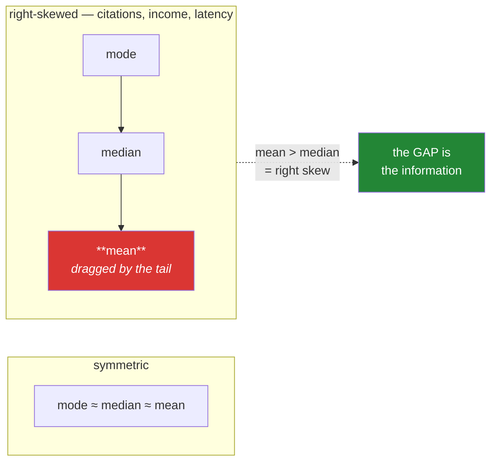

# Day 59 — Central tendency: mean, median, mode

**Phase 8 · Module 8** · ID: **ST-03** (measures of central tendency)

> **Yesterday:** statistic versus parameter, and what each level of measurement permits.
> **Today:** three ways to say "typical", and the demonstration that decides between them — one
> billionaire in a salary column. The gap between mean and median is not a nuisance; it is
> **information**, and Day 61 turns it into a number.
> **Tomorrow:** dispersion.

```bash
./m start 59 && ./m scaffold 59
```

**Time:** 100 minutes. **Request budget:** 0 model calls.

---

## §1 The story

"What is a typical value?" has three answers, and they disagree exactly when it matters most.

- **Mean** — the balance point. Every value pulls on it in proportion to its distance.
- **Median** — the middle. Half the values are below it, half above. It does not care *how far* below.
- **Mode** — the most common value. The only one that works on nominal data (Day 58).

For a symmetric distribution all three land in roughly the same place and the choice is uninteresting.
For a **skewed** one they separate, and the separation is the whole point:



The rule that follows: **the mean is not robust.** One extreme value moves it without limit. The
median barely notices. That is not a flaw in the mean — it is what "balance point" means — but it
decides which one belongs in a report.

Two things people get wrong beyond that.

**"Use the median for skewed data" is too simple.** If you want a **total**, only the mean works:
mean × n = sum, and the median has no such property. Payroll cares about the mean; "what does a
typical employee earn" cares about the median. Ask what the number is *for*.

**The mode is not a curiosity.** For nominal data it is the only measure available at all (Day 58's
table), and for a bimodal distribution "the mode" is a warning that your data is two populations —
which is Day 37's bar-of-means demo arriving from the other direction.

---

## §2 Setup — run this

```bash
mkdir -p days/day-59/lab
touch days/day-59/lab/central.py
```

`src/setu/stats.py` grows today. No new packages.

---

## §3 ST-03 — three answers

`days/day-59/lab/central.py`:

```python
"""ST-03: mean, median, mode - and when each is the honest one."""

from __future__ import annotations

import numpy as np
import pandas as pd
from scipy import stats as sp

from setu.arrays import make_rng


def from_scratch() -> None:
    values = np.array([4.0, 1.0, 7.0, 3.0, 3.0])

    mean = values.sum() / len(values)
    ordered = np.sort(values)
    n = len(ordered)
    median = ordered[n // 2] if n % 2 else (ordered[n // 2 - 1] + ordered[n // 2]) / 2
    counts = {v: int((values == v).sum()) for v in np.unique(values)}
    mode = max(counts, key=counts.get)

    print(f"\n  by hand : mean={mean} median={median} mode={mode}")
    print(f"  numpy   : mean={values.mean()} median={np.median(values)}")
    print(f"  scipy   : mode={sp.mode(values, keepdims=False).mode}")
    print("\n  Note the median's EVEN case: the average of the two middle values.")
    print("  That is why a median can be a value that appears nowhere in the data.")


def one_billionaire() -> None:
    salaries = np.array([32, 35, 38, 41, 44, 47, 52, 58, 61, 70], dtype=float) * 1000
    print(f"\n  ten salaries: mean = {salaries.mean():>10,.0f}  median = {np.median(salaries):>10,.0f}")

    with_boss = np.append(salaries, 50_000_000.0)
    print(f"  plus one CEO: mean = {with_boss.mean():>10,.0f}  median = {np.median(with_boss):>10,.0f}")

    print(f"\n  the mean moved by {with_boss.mean() - salaries.mean():>12,.0f}")
    print(f"  the median moved by {np.median(with_boss) - np.median(salaries):>10,.0f}")
    print("\n  'Average salary here is 4.5 million' is TRUE and useless.")
    print("  Ten of the eleven people earn less than 2% of it.")


def the_breakdown_point() -> None:
    rng = make_rng(0)
    clean = rng.normal(100, 10, 999)

    print(f"\n  contaminating 999 clean values with extreme outliers:")
    print(f"  {'added':<8} {'mean':>10} {'median':>10}")
    for k in (0, 1, 10, 100, 400, 499, 500):
        contaminated = np.append(clean, np.full(k, 1e6))
        print(f"  {k:<8} {contaminated.mean():>10,.0f} {np.median(contaminated):>10,.1f}")

    print("\n  ONE outlier moves the mean. The median holds until nearly HALF the data")
    print("  is contaminated — its 'breakdown point' is 50%; the mean's is 0%.")
    print("  That is the precise sense in which the median is robust.")


def which_one_is_the_question() -> None:
    salaries = np.append(np.array([32, 35, 38, 41, 44]) * 1000.0, 50_000_000.0)

    print(f"\n  'What does the payroll cost?'        -> mean × n = {salaries.mean() * len(salaries):,.0f}")
    print(f"     (and sum = {salaries.sum():,.0f} — identical, because that IS the mean's definition)")
    print(f"  'What does a typical person earn?'   -> median = {np.median(salaries):,.0f}")
    print("\n  The median has NO totalling property. median × n means nothing.")
    print("  So 'use the median for skewed data' is too simple: ask what the number is FOR.")


def mode_on_nominal_data() -> None:
    venues = pd.Series(["NeurIPS", "ICML", "NeurIPS", "ACL", "NeurIPS"], dtype="str")
    print(f"\n  {venues.mode().tolist()=}   <- the only measure legal here (Day 58)")

    tied = pd.Series(["a", "a", "b", "b", "c"], dtype="str")
    print(f"  {tied.mode().tolist()=}   <- pandas returns EVERY tied mode, as a Series")
    print("  ^ so `.mode()[0]` silently picks one of several. Handle ties explicitly.")

    continuous = pd.Series([1.1, 2.2, 3.3])
    print(f"  {continuous.mode().tolist()=}   <- every value appears once: all of them")
    print("  ^ the mode is near-useless on continuous data. Bin it first, or use a KDE peak.")


def bimodal_is_a_warning() -> None:
    rng = make_rng(1)
    two_groups = np.concatenate([rng.normal(35, 4, 200), rng.normal(69, 4, 200)])

    print(f"\n  mean   = {two_groups.mean():.1f}")
    print(f"  median = {np.median(two_groups):.1f}")
    print(f"  ...and almost NO observation is near 52:")
    near = ((two_groups > 48) & (two_groups < 56)).sum()
    print(f"  values between 48 and 56: {near} of {len(two_groups)}")
    print("\n  Both 'central' measures point at a gap. That is Day 37's bar-of-means demo")
    print("  from the other side: a single number cannot describe two populations.")
    print("  Day 39's histogram is what reveals it.")


def trimmed_and_weighted() -> None:
    rng = make_rng(2)
    values = np.append(rng.normal(100, 10, 100), [5000.0, 6000.0])

    print(f"\n  mean          = {values.mean():>8.1f}")
    print(f"  10% trimmed   = {sp.trim_mean(values, 0.1):>8.1f}   <- drops the extreme 10% each end")
    print(f"  median        = {np.median(values):>8.1f}")
    print("  ^ a trimmed mean is the compromise: more robust than the mean, still uses")
    print("    more information than the median. State the trim fraction if you use it.")

    counts = np.array([10, 20, 70])
    means = np.array([1.0, 2.0, 3.0])
    print(f"\n  naive mean of group means = {means.mean():.2f}")
    print(f"  weighted by group size    = {np.average(means, weights=counts):.2f}")
    print("  ^ averaging averages IGNORES group size. This is Simpson's-paradox territory,")
    print("    and it is a real bug in any per-group summary you then summarise again.")


def missing_values() -> None:
    values = np.array([1.0, 2.0, np.nan, 4.0])
    print(f"\n  {values.mean()=}       <- poisoned (Day 20)")
    print(f"  {np.nanmean(values)=}   <- ignores it")
    print("\n  But 'ignore' is a DECISION: it assumes the missing values are like the")
    print("  present ones. Day 76 covers when that assumption is wrong; today, just")
    print("  report n and n_missing beside every mean so a reader can judge.")


if __name__ == "__main__":
    from_scratch()
    one_billionaire()
    the_breakdown_point()
    which_one_is_the_question()
    mode_on_nominal_data()
    bimodal_is_a_warning()
    trimmed_and_weighted()
    missing_values()
```

**Line by line:**

- `from_scratch` — Principle 2. The median's **even case** is the average of the two middle values,
  which is why a median can be a number that appears nowhere in your data. That surprises people when
  a median rating comes out as 3.5 stars.
- `sp.mode(values, keepdims=False)` — SciPy's mode returns a small object; `keepdims=False` gives you
  the scalar. Check the signature for your pinned version, it has changed.
- `one_billionaire` — **the demonstration.** The mean moves by over four million; the median moves by
  three thousand. "Average salary here is 4.5 million" is *true* and useless, and ten of the eleven
  people earn under 2% of it.
- `the_breakdown_point` — **run this and read the table.** One outlier in a thousand moves the mean
  visibly. The median holds until nearly **half** the data is contaminated. That is the technical
  meaning of robustness: the median's breakdown point is 50%, the mean's is 0%.
- `which_one_is_the_question` — the mean's totalling property. `mean × n = sum`, exactly, because that
  is its definition. **The median has no such property**, so if you want a total, the median cannot
  give you one. "Use the median for skewed data" is too simple; ask what the number is *for*.
- `mode_on_nominal_data` — three separate traps. `.mode()` returns **every tied mode**, so `.mode()[0]`
  silently picks one. On continuous data every value is its own mode, making it useless without binning.
  And for nominal data it is the **only** legal measure (Day 58).
- `bimodal_is_a_warning` — both central measures point at a value almost nothing is near. **This is
  Day 37's bar-of-means demo from the other direction**, and Day 39's histogram is what reveals it.
  A "typical" value for two populations is not typical of either.
- `trim_mean(values, 0.1)` — drops the extreme 10% from each end. The honest compromise: more robust
  than the mean, uses more information than the median. **State the trim fraction**, or the number is
  unreproducible.
- `np.average(means, weights=counts)` — **averaging averages ignores group size.** The naive mean of
  group means gives 2.00; weighting by size gives 2.60. This is a real bug in any pipeline that
  summarises per-group results, and it is the doorway to Simpson's paradox.
- `missing_values` — `nanmean` "ignoring" NaN is a **decision**: it assumes the missing values resemble
  the present ones. Day 76 covers when that fails. Today's obligation is smaller: report `n` and
  `n_missing` beside every mean.

---

## §4 Build brief

Extend `src/setu/stats.py`:

```python
def central_tendency(values, *, level: Level = "ratio", trim: float = 0.0) -> dict:
    """TODO(me): every LEGAL measure of centre for this level, and no others.

    {"n", "n_missing", "mode", "median"?, "mean"?, "trimmed_mean"?, "skew_direction"?}
    - call assert_permitted (Day 58) before computing each one
    - nominal: mode only. ordinal: + median. interval/ratio: + mean and trimmed_mean
    - `mode` must be a LIST (ties are real) and empty when every value is unique
    - skew_direction is 'right' when mean > median, 'left' when <, 'none' when within
      1% of the median - and only for interval/ratio
    - trim must be in [0, 0.5); raise DataError otherwise
    - nan-aware throughout; all-missing returns nan values, never raises
    """
    raise NotImplementedError


def modes(values) -> list:
    """TODO(me): EVERY most-frequent value, sorted, as plain Python types.

    - ties all returned (§3: .mode()[0] silently picks one)
    - an empty list when every value occurs exactly once
    - NaN is never a mode
    - raise DataError on an empty input
    """
    raise NotImplementedError


def weighted_mean(values, weights) -> float:
    """TODO(me): the size-aware average of group means (§3).

    - raise DataError on a length mismatch, naming both lengths
    - raise DataError if any weight is negative, or if they sum to zero
    - zero weights are allowed (a group with no rows contributes nothing)
    - nan values with non-zero weight raise; you cannot average around a hole
    """
    raise NotImplementedError


def robustness_report(values) -> dict:
    """TODO(me): how much would ONE new extreme value move each measure?

    {"mean_shift_per_outlier": float, "median_shift_per_outlier": float,
     "breakdown_point": {"mean": 0.0, "median": 0.5}}
    - compute the shift empirically: append max*100 and measure
    - this is what a report shows to justify choosing the median
    """
    raise NotImplementedError


def choose_centre(level: Level, *, purpose: str) -> str:
    """TODO(me): recommend a measure and say why. PURE.

    purpose is 'typical' or 'total'.
    - 'total' with a non-interval/ratio level raises DataError (you cannot total ordinals)
    - 'total' -> 'mean' ALWAYS, even when skewed: only the mean totals
    - 'typical' -> 'mode' for nominal, 'median' for ordinal and for skewed ratio data
    - return f"{measure}: {reason}" so the reason reaches the report
    """
    raise NotImplementedError
```

- `modes` returning a **list** is the §3 tie trap fixed by the return type. A function returning one
  value cannot express "there are three modes".
- `choose_centre` returning `"measure: reason"` means Day 75's report gets the justification for free
  rather than the author inventing one afterwards.
- `robustness_report` exists so the choice of median is **shown** rather than asserted.

---

## §5 The eval that must be able to fail

Add to `tests/test_stats.py`:

```python
from setu.stats import central_tendency, choose_centre, modes, robustness_report, weighted_mean


def test_mean_matches_a_hand_computation():
    out = central_tendency([4.0, 1.0, 7.0, 3.0, 3.0])
    assert out["mean"] == pytest.approx(3.6)
    assert out["median"] == pytest.approx(3.0)
    assert out["mode"] == [3.0]


def test_median_of_an_even_sample_averages_the_middle_two():
    """A median can be a value that appears nowhere in the data."""
    assert central_tendency([1.0, 2.0, 3.0, 4.0])["median"] == pytest.approx(2.5)


def test_nominal_gets_a_mode_and_nothing_else():
    out = central_tendency(["a", "b", "a"], level="nominal")
    assert out["mode"] == ["a"]
    assert "mean" not in out and "median" not in out


def test_ordinal_gets_a_median_but_no_mean():
    values = pd.Series(
        pd.Categorical(["low", "high", "high"], categories=["low", "medium", "high"], ordered=True)
    )
    out = central_tendency(values, level="ordinal")
    assert "median" in out
    assert "mean" not in out, "an ordinal mean was computed (Day 58)"


def test_skew_direction_is_detected():
    assert central_tendency([1.0, 2.0, 3.0, 4.0, 100.0])["skew_direction"] == "right"
    assert central_tendency([-100.0, 1.0, 2.0, 3.0, 4.0])["skew_direction"] == "left"
    assert central_tendency([1.0, 2.0, 3.0, 4.0, 5.0])["skew_direction"] == "none"


def test_skew_direction_is_absent_for_ordinal():
    values = pd.Series(pd.Categorical(["a", "b"], categories=["a", "b"], ordered=True))
    assert "skew_direction" not in central_tendency(values, level="ordinal")


def test_trimmed_mean_is_between_mean_and_median():
    values = list(np.append(make_rng(0).normal(100, 10, 100), [5000.0, 6000.0]))
    out = central_tendency(values, trim=0.1)
    assert out["median"] < out["trimmed_mean"] < out["mean"]


@pytest.mark.parametrize("trim", [-0.1, 0.5, 0.9])
def test_trim_must_be_a_valid_fraction(trim):
    with pytest.raises(DataError):
        central_tendency([1.0, 2.0, 3.0], trim=trim)


def test_all_missing_does_not_raise():
    out = central_tendency([np.nan, np.nan])
    assert out["n_missing"] == 2 and np.isnan(out["mean"])


def test_modes_returns_every_tie():
    """`.mode()[0]` silently picks one of several."""
    assert modes(["a", "a", "b", "b", "c"]) == ["a", "b"]


def test_modes_is_empty_when_everything_is_unique():
    assert modes([1.1, 2.2, 3.3]) == []


def test_modes_ignores_nan():
    assert modes([np.nan, np.nan, 1.0, 1.0, 2.0]) == [1.0]


def test_modes_returns_plain_python_types():
    import json

    json.dumps(modes([1, 1, 2]))


def test_modes_rejects_empty_input():
    with pytest.raises(DataError):
        modes([])


def test_weighted_mean_accounts_for_group_size():
    """Averaging averages ignores how many rows each came from."""
    means, counts = [1.0, 2.0, 3.0], [10, 20, 70]
    assert np.mean(means) == pytest.approx(2.0)
    assert weighted_mean(means, counts) == pytest.approx(2.6)


def test_weighted_mean_rejects_a_length_mismatch():
    with pytest.raises(DataError) as info:
        weighted_mean([1.0, 2.0], [1])
    message = str(info.value)
    assert "2" in message and "1" in message, "both lengths should be named"


def test_weighted_mean_rejects_negative_weights():
    with pytest.raises(DataError):
        weighted_mean([1.0, 2.0], [1, -1])


def test_weighted_mean_rejects_zero_total_weight():
    with pytest.raises(DataError):
        weighted_mean([1.0, 2.0], [0, 0])


def test_weighted_mean_allows_an_empty_group():
    assert weighted_mean([1.0, 2.0], [0, 5]) == pytest.approx(2.0)


def test_weighted_mean_refuses_nan_with_weight():
    with pytest.raises(DataError):
        weighted_mean([1.0, np.nan], [1, 1])


def test_robustness_shows_the_mean_moves_more():
    report = robustness_report(list(make_rng(0).normal(100, 10, 500)))
    assert report["mean_shift_per_outlier"] > report["median_shift_per_outlier"] * 10
    assert report["breakdown_point"]["mean"] == 0.0
    assert report["breakdown_point"]["median"] == 0.5


def test_total_always_recommends_the_mean():
    """Only the mean totals — even on skewed data."""
    assert choose_centre("ratio", purpose="total").startswith("mean")


def test_total_is_illegal_for_ordinal():
    with pytest.raises(DataError):
        choose_centre("ordinal", purpose="total")


def test_typical_recommends_the_mode_for_nominal():
    assert choose_centre("nominal", purpose="typical").startswith("mode")


def test_typical_recommends_the_median_for_ordinal():
    assert choose_centre("ordinal", purpose="typical").startswith("median")


def test_choose_centre_always_gives_a_reason():
    for level in ("nominal", "ordinal", "interval", "ratio"):
        result = choose_centre(level, purpose="typical")
        assert ":" in result and len(result.split(":", 1)[1].strip()) > 10, (
            f"{level} got a recommendation with no reason"
        )
```

**Line by line:**

- `test_modes_returns_every_tie` — **the day's real assessment.** A function returning a single value
  cannot express a tie, and `.mode()[0]` picks one arbitrarily. Returning a list makes the ambiguity
  visible to the caller instead of hiding it.
- `test_total_always_recommends_the_mean` — **the counter-intuitive one**, and it is the point of
  §3's fourth demo. Skew does not change the answer when you want a total, because only the mean has
  the totalling property. A recommender that says "skewed → median" unconditionally fails here.
- `test_total_is_illegal_for_ordinal` — you cannot total ordinal codes. Day 58's permission table,
  enforced from a different direction.
- `test_median_of_an_even_sample_averages_the_middle_two` — 2.5, a value not in the data. It is the
  even-case rule, and it is why a "median rating" can be half a star.
- `test_weighted_mean_accounts_for_group_size` — the naive answer is 2.0 and the correct one is 2.6,
  from the same three numbers. Both are computed in the test so the difference is visible.
- `test_weighted_mean_refuses_nan_with_weight` — you cannot average around a hole. Silently dropping
  it changes the weights, which is a different calculation from the one the caller asked for.
- `test_choose_centre_always_gives_a_reason` — asserts the reason is **more than ten characters**. A
  recommender that returns `"median: skewed"` is not giving Day 75's report anything to say.
- `test_skew_direction_is_absent_for_ordinal` — skew requires a mean, so it must not appear where a
  mean is illegal. Consistency with Day 58, tested rather than assumed.

```bash
uv run python -m pytest tests/test_stats.py -v
```

---

## §6 Request budget

| Resource | Spent today |
|---|---|
| LLM calls | **0** |

---

## §7 Traps

- **Reporting a mean for skewed data without the median.** The gap is information; show both.
- **"Use the median for skewed data" as a rule.** Not when you want a total.
- **`.mode()[0]`.** Silently picks one of several ties.
- **A mode on continuous data.** Every value is its own mode. Bin first.
- **Averaging group means.** Ignores group size; the doorway to Simpson's paradox.
- **A mean of ordinal codes.** Day 58. Still illegal today.
- **Forgetting the median's even case.** It can be a value that appears nowhere.
- **A trimmed mean with an unstated trim fraction.** Unreproducible.
- **A single centre for bimodal data.** It points at a gap. Show the histogram.
- **`nanmean` without reporting `n_missing`.** "Ignore" is a decision the reader should see.
- **Assuming the median is always safer.** It discards information the mean uses.

---

## §8 Verify before you code

Written **2026-08-21**:

- <https://docs.scipy.org/doc/scipy/reference/generated/scipy.stats.mode.html> — confirm the
  `keepdims` signature for your pinned SciPy.
- <https://docs.scipy.org/doc/scipy/reference/generated/scipy.stats.trim_mean.html> — the
  proportiontocut semantics.
- <https://pandas.pydata.org/docs/reference/api/pandas.Series.mode.html> — confirm it returns a Series
  of all ties.
- <https://numpy.org/doc/stable/reference/generated/numpy.average.html> — `weights`.

---

## §9 Say it in an interview

> "Three measures, and they only disagree when it matters. The demonstration I'd use is a salary
> column with one very high earner: the mean moves by millions, the median by a few thousand, and
> 'the average salary here is four and a half million' is true and useless. Technically the median's
> breakdown point is fifty per cent and the mean's is zero — one bad value moves the mean without
> limit. But 'use the median for skewed data' is too simple, because only the mean totals: mean times
> n is the sum, and the median has no such property, so payroll wants the mean and 'what does a
> typical person earn' wants the median. My helper takes the *purpose* as an argument and returns the
> measure with a reason attached, and it returns every tied mode as a list rather than picking one —
> because `.mode()[0]` hides the ambiguity instead of surfacing it."

---

## §10 Done when

Tick [`CHECKLIST.md`](CHECKLIST.md), then `./m check && ./m done 59`.
