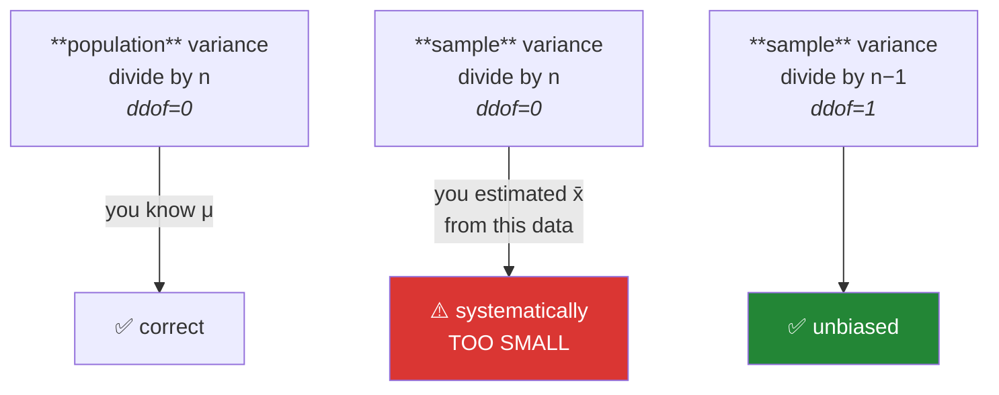

# Day 60 — Dispersion: variance, standard deviation, IQR, and `ddof`

**Phase 8 · Module 8** · ID: **ST-04** (range, variance, standard deviation, IQR)

> **Yesterday:** three measures of centre, and one billionaire.
> **Today:** the other half of every summary. A centre without a spread is half a description — and
> `ddof`, which you have been passing as `1` since Day 20 without being told why, gets its
> demonstration: **simulated, not asserted.**
> **Tomorrow:** skewness and kurtosis.

```bash
./m start 60 && ./m scaffold 60
```

**Time:** 110 minutes. **Request budget:** 0 model calls.

---

## §1 The story

`[50, 50, 50]` and `[0, 50, 100]` have the same mean. They are not the same data, and any summary that
cannot tell them apart is not a summary.

Four measures of spread, in increasing order of usefulness:

- **Range** — max minus min. Uses exactly two values and ignores everything between them. One outlier
  defines it entirely.
- **Variance** — the mean squared distance from the centre. Squaring is what makes it mathematically
  tractable (Day 95's gradient descent needs a differentiable loss), and it is also why its **units are
  squared** — "citations²" means nothing to a reader.
- **Standard deviation** — the square root of the variance, back in the original units. This is the
  one that goes in a report.
- **IQR** — the middle 50%. Robust, in the same sense the median was robust yesterday.

And then `ddof`, which is the day's real content.



Here is the intuition, and it is worth having properly rather than as a rule you obey.

Variance measures distance from the mean. When you have the **population**, you know the true mean μ,
and you measure distances from it. When you have a **sample**, you do not know μ — so you measure
distances from `x̄`, which was computed **from the same data**.

`x̄` is, by construction, the point that **minimises** the sum of squared distances for that sample.
So distances measured from it are the smallest they could possibly be, and the resulting variance is
systematically too small. Dividing by `n − 1` instead of `n` corrects for it exactly.

**You will simulate this in §3 rather than take it on faith** — ten thousand samples, both formulas,
and watch one converge on the truth while the other sits stubbornly below it.

NumPy defaults to `ddof=0`. pandas defaults to `ddof=1`. **They disagree**, which is a genuine source
of two-numbers-that-should-match bugs, and it is why this project made the choice once on Day 20.

---

## §2 Setup — run this

```bash
mkdir -p days/day-60/lab
touch days/day-60/lab/spread.py
```

`src/setu/stats.py` grows today. No new packages.

---

## §3 ST-04 — spread, and the ddof demonstration

`days/day-60/lab/spread.py`:

```python
"""ST-04: dispersion measures, and why sample variance divides by n-1."""

from __future__ import annotations

import numpy as np
import pandas as pd

from setu.arrays import make_rng


def a_centre_is_half_a_description() -> None:
    tight = np.array([50.0, 50.0, 50.0])
    wide = np.array([0.0, 50.0, 100.0])

    print(f"\n  {'':<8} {'mean':>6} {'sd':>8} {'range':>8} {'IQR':>8}")
    for name, values in (("tight", tight), ("wide", wide)):
        iqr = np.percentile(values, 75) - np.percentile(values, 25)
        print(f"  {name:<8} {values.mean():>6.1f} {values.std(ddof=1):>8.1f} "
              f"{values.ptp():>8.1f} {iqr:>8.1f}")
    print("\n  Identical means. A summary that reports only the centre cannot")
    print("  distinguish these, and 'the mean is 50' is true of both.")


def from_scratch() -> None:
    values = np.array([2.0, 4.0, 4.0, 4.0, 5.0, 5.0, 7.0, 9.0])
    n = len(values)
    mean = values.sum() / n
    squared = ((values - mean) ** 2).sum()

    print(f"\n  mean = {mean}")
    print(f"  sum of squared deviations = {squared}")
    print(f"  ÷ n     (ddof=0) = {squared / n:.4f}   sd = {np.sqrt(squared / n):.4f}")
    print(f"  ÷ (n-1) (ddof=1) = {squared / (n - 1):.4f}   sd = {np.sqrt(squared / (n - 1)):.4f}")
    print(f"\n  numpy default : {values.std():.4f}   <- ddof=0")
    print(f"  pandas default: {pd.Series(values).std():.4f}   <- ddof=1")
    print("  ^ THE TWO LIBRARIES DISAGREE. That is a real source of mismatched numbers.")


def why_squared() -> None:
    values = np.array([10.0, 20.0, 30.0])
    deviations = values - values.mean()

    print(f"\n  deviations from the mean: {deviations}")
    print(f"  their sum               : {deviations.sum():.1f}   <- ALWAYS zero, by definition")
    print("  ^ so 'mean deviation' is useless: it is zero for every dataset.")
    print(f"\n  mean ABSOLUTE deviation : {np.abs(deviations).mean():.2f}")
    print(f"  mean SQUARED deviation  : {(deviations ** 2).mean():.2f}")
    print("\n  Both fix the cancellation. Squaring wins because it is differentiable")
    print("  everywhere — which is what Day 95's gradient descent needs. |x| is not")
    print("  differentiable at zero. The cost: squared units, and outlier sensitivity.")


def the_ddof_simulation() -> None:
    rng = make_rng(0)
    mu, sigma = 100.0, 15.0
    true_variance = sigma**2

    print(f"\n  true population variance σ² = {true_variance:.1f}")
    print(f"\n  {'n':>4} {'mean of ddof=0':>16} {'mean of ddof=1':>16} {'ddof=0 error':>14}")

    for n in (2, 3, 5, 10, 30, 100):
        samples = rng.normal(mu, sigma, size=(10_000, n))
        biased = samples.var(axis=1, ddof=0).mean()
        unbiased = samples.var(axis=1, ddof=1).mean()
        print(f"  {n:>4} {biased:>16.1f} {unbiased:>16.1f} {biased - true_variance:>+14.1f}")

    print("\n  Read the last column. ddof=0 is ALWAYS too small, and predictably so:")
    print("  its expected value is σ²·(n-1)/n. At n=2 that is HALF the truth.")
    print("  ddof=1 hovers around the true value at every n. That is what 'unbiased' means.")
    print("\n  This is a fact about averages over many samples, not about your one sample.")


def why_n_minus_one_intuitively() -> None:
    sample = np.array([8.0, 12.0, 16.0])
    mu = 100.0

    from_mu = ((sample - mu) ** 2).sum()
    from_xbar = ((sample - sample.mean()) ** 2).sum()

    print(f"\n  sample = {sample.tolist()}, x̄ = {sample.mean():.1f}")
    print(f"  Σ(x - x̄)² = {from_xbar:.1f}   <- distances from the SAMPLE mean")
    print(f"  Σ(x - 100)² = {from_mu:.1f}   <- distances from any other point")

    for candidate in (10.0, 11.0, 12.0, 13.0, 14.0):
        total = ((sample - candidate) ** 2).sum()
        marker = "  <- the minimum, and it IS x̄" if candidate == sample.mean() else ""
        print(f"    Σ(x - {candidate:.0f})² = {total:>6.1f}{marker}")

    print("\n  x̄ MINIMISES the sum of squared deviations for its own sample. So measuring")
    print("  spread from it always understates it. n-1 is exactly the right correction —")
    print("  one degree of freedom was spent estimating the mean.")


def degrees_of_freedom() -> None:
    print("\n  'Degrees of freedom' concretely:")
    print("    3 values with a KNOWN mean of 10: pick any two freely, the third is forced.")
    print("    e.g. 8 and 12 -> the third MUST be 10. Two degrees of freedom, not three.")
    print("\n  You spent one on estimating x̄. n-1 is what is left.")
    print("  Day 71's t-test and Day 73's chi-square both take a df parameter for this reason.")


def robust_spread() -> None:
    rng = make_rng(1)
    clean = rng.normal(100, 10, 500)
    dirty = np.append(clean, [10_000.0])

    print(f"\n  {'':<10} {'sd':>10} {'IQR':>10} {'MAD':>10}")
    for name, values in (("clean", clean), ("+1 outlier", dirty)):
        iqr = np.percentile(values, 75) - np.percentile(values, 25)
        mad = np.median(np.abs(values - np.median(values)))
        print(f"  {name:<10} {values.std(ddof=1):>10.2f} {iqr:>10.2f} {mad:>10.2f}")

    print("\n  One outlier in 501 values inflates the sd by a large factor.")
    print("  IQR and MAD barely move — same robustness story as yesterday's median.")
    print("  MAD × 1.4826 estimates σ for normal data; that constant is why it is comparable.")


def units_and_comparability() -> None:
    citations = np.array([100.0, 200.0, 300.0])
    pages = np.array([8.0, 10.0, 12.0])

    print(f"\n  citations: sd = {citations.std(ddof=1):.1f} citations")
    print(f"  pages    : sd = {pages.std(ddof=1):.1f} pages")
    print("  ^ NOT comparable: different units, different scales.")

    for name, values in (("citations", citations), ("pages", pages)):
        print(f"  CV({name}) = {values.std(ddof=1) / values.mean():.3f}")
    print("\n  The coefficient of variation (sd / mean) is unitless, so it compares.")
    print("  ⚠️ It is meaningless when the mean is near zero or the data is INTERVAL")
    print("     (Day 58: a CV of a Celsius column is nonsense — no true zero).")


def range_uses_two_values() -> None:
    rng = make_rng(2)
    for n in (10, 100, 1_000, 10_000):
        values = rng.normal(100, 10, n)
        print(f"  n={n:>6}  range = {values.ptp():>6.1f}  sd = {values.std(ddof=1):>5.2f}")
    print("\n  The sd is stable as n grows. The RANGE keeps growing, because a bigger")
    print("  sample has more chances to contain an extreme. Range is not a summary;")
    print("  it is a statement about two observations.")


if __name__ == "__main__":
    a_centre_is_half_a_description()
    from_scratch()
    why_squared()
    the_ddof_simulation()
    why_n_minus_one_intuitively()
    degrees_of_freedom()
    robust_spread()
    units_and_comparability()
    range_uses_two_values()
```

**Line by line:**

- `values.ptp()` — "peak to peak", NumPy's range. Note it is a method, not `np.range` (which would
  collide with the builtin).
- `numpy default` versus `pandas default` — **the libraries disagree.** `np.std` is `ddof=0`;
  `Series.std` is `ddof=1`. Computing "the standard deviation" in two places and getting two answers
  traces back here every time, and it is why Day 20 fixed the choice project-wide.
- `deviations.sum()` is **always zero**, by the definition of the mean. That is why you cannot simply
  average the deviations, and why some function of them — absolute or squared — is required.
- **Squaring versus absolute value**: both fix the cancellation. Squaring wins because it is
  differentiable everywhere, which is what Day 95's gradient descent needs; `|x|` has a corner at
  zero. The costs are squared units and outlier sensitivity, and both are real.
- `the_ddof_simulation` — **the demonstration.** Ten thousand samples at each `n`, both formulas,
  compared to the truth. **Read the last column**: `ddof=0` is always too small, and its expected value
  is exactly `σ²·(n−1)/n` — at `n=2` that is *half* the true variance. `ddof=1` hovers around the truth
  at every `n`. Note the caveat in the printout: this is a property of the average over many samples,
  not a promise about your one sample.
- `why_n_minus_one_intuitively` — the candidate loop is the argument. **`x̄` minimises the sum of
  squared deviations for its own sample**, which you can see by trying values either side of it. So
  measuring spread from it always understates, and `n−1` is exactly the right correction.
- `degrees_of_freedom` — the concrete version: with a known mean, two of three values are free and the
  third is forced. You spent one degree of freedom estimating `x̄`. Day 71's t-test and Day 73's
  chi-square both take a `df` parameter for this reason, so it is worth having now.
- `robust_spread` — one outlier in 501 inflates the sd substantially; IQR and MAD barely move. **The
  `1.4826` constant** rescales MAD so that for normal data it estimates the same σ the standard
  deviation does, which is what makes them comparable.
- `units_and_comparability` — the **coefficient of variation** is unitless and therefore comparable
  across variables. Two caveats matter: it breaks down when the mean approaches zero, and it is
  meaningless for **interval** data (Day 58 — a CV of a Celsius column is nonsense because 0 °C is not
  "no temperature").
- `range_uses_two_values` — **run this and read the trend.** The sd stabilises as `n` grows; the range
  keeps climbing, because a bigger sample has more chances to contain an extreme. The range is not a
  summary of your data; it is a statement about two observations.

---

## §4 Build brief

Extend `src/setu/stats.py`:

```python
MAD_TO_SIGMA = 1.4826


def dispersion(values, *, level: Level = "ratio", ddof: int = 1) -> dict:
    """TODO(me): every LEGAL spread measure for this level.

    {"n", "n_missing", "iqr", "q25", "q75", "range"?, "variance"?, "std"?, "mad"?, "cv"?}
    - nominal: raise DataError (spread is undefined without an ordering)
    - ordinal: iqr, q25, q75, range ONLY - no variance or sd (Day 58)
    - interval: + variance, std, mad - but NOT cv (no true zero)
    - ratio: + cv
    - ddof must be 0 or 1; raise DataError otherwise, and say what each means
    - nan-aware; all-missing returns nan values without raising
    """
    raise NotImplementedError


def mad(values, *, scaled: bool = True) -> float:
    """TODO(me): median absolute deviation from the median.

    - scaled=True multiplies by MAD_TO_SIGMA so it estimates σ for normal data
    - scaled=False returns the raw MAD
    - nan-aware; raise DataError on fewer than 2 non-missing values
    """
    raise NotImplementedError


def coefficient_of_variation(values, *, level: Level = "ratio") -> float:
    """TODO(me): std / mean, unitless.

    - raise DataError for any level below 'ratio', explaining the true-zero requirement
    - raise DataError if the mean is within 1e-9 of zero (the ratio explodes)
    - raise DataError if the mean is NEGATIVE (a negative CV is uninterpretable)
    """
    raise NotImplementedError


def ddof_bias_demo(*, n: int, sigma: float = 15.0, trials: int = 5000, seed: int = 42) -> dict:
    """TODO(me): the §3 simulation as a function, so a TEST can assert the bias.

    Return {"n", "true_variance", "mean_ddof0", "mean_ddof1", "expected_ddof0"}
    where expected_ddof0 = sigma**2 * (n-1)/n.
    - use make_rng(seed) so it is reproducible
    - vectorised: one (trials, n) draw, not a Python loop
    - raise DataError if n < 2
    """
    raise NotImplementedError


def compare_spread(values) -> dict:
    """TODO(me): sd, IQR and scaled MAD side by side, plus how each responds to one outlier.

    {"clean": {...}, "with_outlier": {...}, "inflation": {"std": x, "iqr": y, "mad": z}}
    - the outlier is max(values) * 100
    - inflation is the ratio after/before
    - this is what a report shows to justify a robust measure
    """
    raise NotImplementedError
```

- `dispersion` **raising** for nominal is the right call: spread requires an ordering, and returning
  `None` invites the caller to plot it anyway.
- `ddof_bias_demo` returning `expected_ddof0` is what makes §3 a **test** rather than a printout —
  the simulation must land on the analytically predicted value, not merely "look smaller".
- `coefficient_of_variation` refusing a negative mean matters: a negative CV has no interpretation, and
  it appears whenever someone applies it to a centred variable.

---

## §5 The eval that must be able to fail

Add to `tests/test_stats.py`:

```python
from setu.stats import (
    MAD_TO_SIGMA,
    coefficient_of_variation,
    compare_spread,
    ddof_bias_demo,
    dispersion,
    mad,
)


def test_std_matches_a_hand_computation():
    out = dispersion([2.0, 4.0, 4.0, 4.0, 5.0, 5.0, 7.0, 9.0])
    assert out["std"] == pytest.approx(2.13809, rel=1e-4)
    assert out["variance"] == pytest.approx(out["std"] ** 2)


def test_ddof_zero_gives_the_other_answer():
    out = dispersion([2.0, 4.0, 4.0, 4.0, 5.0, 5.0, 7.0, 9.0], ddof=0)
    assert out["std"] == pytest.approx(2.0)


@pytest.mark.parametrize("ddof", [-1, 2, 5])
def test_ddof_must_be_zero_or_one(ddof):
    with pytest.raises(DataError) as info:
        dispersion([1.0, 2.0, 3.0], ddof=ddof)
    assert "0" in str(info.value) and "1" in str(info.value)


def test_nominal_has_no_dispersion():
    with pytest.raises(DataError) as info:
        dispersion(["a", "b", "a"], level="nominal")
    assert "order" in str(info.value).lower()


def test_ordinal_gets_iqr_but_no_std():
    values = pd.Series(
        pd.Categorical(["low", "medium", "high"], categories=["low", "medium", "high"], ordered=True)
    )
    out = dispersion(values, level="ordinal")
    assert "iqr" in out
    assert "std" not in out and "variance" not in out


def test_interval_gets_std_but_no_cv():
    """A CV needs a true zero (Day 58)."""
    out = dispersion([-3.0, 0.0, 5.0], level="interval")
    assert "std" in out
    assert "cv" not in out


def test_ratio_gets_everything():
    out = dispersion([1.0, 2.0, 3.0], level="ratio")
    for key in ("std", "variance", "iqr", "mad", "cv", "range"):
        assert key in out


def test_dispersion_all_missing_does_not_raise():
    out = dispersion([np.nan, np.nan])
    assert out["n_missing"] == 2 and np.isnan(out["std"])


def test_ddof_zero_is_biased_low():
    """The §3 simulation, asserted rather than printed."""
    result = ddof_bias_demo(n=5)
    assert result["mean_ddof0"] < result["true_variance"]
    assert result["mean_ddof0"] == pytest.approx(result["expected_ddof0"], rel=0.05)


def test_ddof_one_is_unbiased():
    result = ddof_bias_demo(n=5)
    assert result["mean_ddof1"] == pytest.approx(result["true_variance"], rel=0.05)


@pytest.mark.parametrize("n", [2, 3, 10, 50])
def test_the_bias_shrinks_with_n(n):
    """Expected bias is exactly sigma^2 / n."""
    result = ddof_bias_demo(n=n)
    shortfall = result["true_variance"] - result["mean_ddof0"]
    assert shortfall == pytest.approx(result["true_variance"] / n, rel=0.15)


def test_at_n_two_ddof_zero_halves_the_variance():
    result = ddof_bias_demo(n=2)
    assert result["mean_ddof0"] == pytest.approx(result["true_variance"] / 2, rel=0.05)


def test_ddof_demo_is_reproducible():
    assert ddof_bias_demo(n=5, seed=7) == ddof_bias_demo(n=5, seed=7)


def test_ddof_demo_rejects_n_below_two():
    with pytest.raises(DataError):
        ddof_bias_demo(n=1)


def test_mad_is_scaled_to_estimate_sigma():
    """For normal data, scaled MAD should land near the standard deviation."""
    values = make_rng(0).normal(100, 15, 20_000)
    assert mad(values) == pytest.approx(15.0, rel=0.05)


def test_unscaled_mad_is_smaller():
    values = make_rng(0).normal(100, 15, 5_000)
    assert mad(values, scaled=False) == pytest.approx(mad(values) / MAD_TO_SIGMA, rel=1e-9)


def test_mad_is_robust_where_std_is_not():
    clean = list(make_rng(1).normal(100, 10, 500))
    dirty = clean + [10_000.0]
    std_inflation = np.std(dirty, ddof=1) / np.std(clean, ddof=1)
    mad_inflation = mad(dirty) / mad(clean)
    assert std_inflation > 10 * mad_inflation


def test_mad_rejects_a_tiny_sample():
    with pytest.raises(DataError):
        mad([1.0])


def test_cv_is_unitless_and_scale_invariant():
    values = [100.0, 200.0, 300.0]
    scaled = [v * 1000 for v in values]
    assert coefficient_of_variation(values) == pytest.approx(coefficient_of_variation(scaled))


def test_cv_is_refused_for_interval():
    with pytest.raises(DataError) as info:
        coefficient_of_variation([1.0, 2.0], level="interval")
    assert "zero" in str(info.value).lower()


def test_cv_refuses_a_near_zero_mean():
    with pytest.raises(DataError):
        coefficient_of_variation([-1.0, 1.0])


def test_cv_refuses_a_negative_mean():
    with pytest.raises(DataError):
        coefficient_of_variation([-5.0, -3.0])


def test_compare_spread_shows_std_inflating_most():
    result = compare_spread(list(make_rng(2).normal(100, 10, 300)))
    assert result["inflation"]["std"] > result["inflation"]["iqr"]
    assert result["inflation"]["std"] > result["inflation"]["mad"]


def test_compare_spread_is_json_serialisable():
    import json

    json.dumps(compare_spread([1.0, 2.0, 3.0, 4.0, 5.0]))


def test_project_default_ddof_is_one():
    """Day 20's decision, still true."""
    import inspect

    signature = inspect.signature(dispersion)
    assert signature.parameters["ddof"].default == 1
```

**Line by line:**

- `test_the_bias_shrinks_with_n` — **the day's real assessment.** It does not merely check that
  `ddof=0` is too small; it asserts the shortfall equals `σ²/n`, the analytically predicted amount, at
  four different sample sizes. A simulation that is "roughly smaller" would pass a vaguer test and
  tell you nothing.
- `test_at_n_two_ddof_zero_halves_the_variance` — the most dramatic case, checked exactly. At `n=2`,
  `ddof=0` returns half the true variance.
- `test_mad_is_scaled_to_estimate_sigma` — 20,000 normal draws with σ=15, and scaled MAD must land near
  15. **That is what the 1.4826 constant is for**, and without the test it is a magic number.
- `test_unscaled_mad_is_smaller` — asserts the exact relationship between the two, so the flag is real
  rather than decorative.
- `test_cv_is_unitless_and_scale_invariant` — multiplying every value by 1000 must not change the CV.
  That is the property that makes it comparable across variables, tested directly.
- `test_cv_refuses_a_negative_mean` — a negative CV is uninterpretable, and it appears the moment
  someone applies it to a centred variable. Better to refuse than to return a number nobody can read.
- `test_nominal_has_no_dispersion` — asserts the message mentions ordering. Day 58's pattern: a refusal
  with a reason.
- `test_project_default_ddof_is_one` — an **API-shape test** pinning Day 20's project-wide decision.
  If someone changes the default, every statistic in the codebase shifts silently.

```bash
uv run python -m pytest tests/test_stats.py -v
```

---

## §6 Request budget

| Resource | Spent today |
|---|---|
| LLM calls | **0** |

---

## §7 Traps

- **Reporting a centre with no spread.** Half a description.
- **`np.std` versus `Series.std`.** They disagree on `ddof`. Fix it once.
- **`ddof=0` on a sample.** Systematically too small; at `n=2`, by half.
- **Reporting variance in a report.** Squared units. Report the sd.
- **Treating the range as a summary.** It uses two values and grows with `n`.
- **A CV on interval data.** No true zero (Day 58).
- **A CV when the mean is near zero.** It explodes.
- **A CV on a centred variable.** Negative and uninterpretable.
- **Unscaled MAD compared to an sd.** Multiply by 1.4826 or they are not comparable.
- **Assuming the sd is robust.** One outlier in 500 inflates it substantially.
- **Comparing sds across different units.** Use the CV, if the level permits it.

---

## §8 Verify before you code

Written **2026-08-21**:

- <https://numpy.org/doc/stable/reference/generated/numpy.std.html> — confirm `ddof` defaults to 0.
- <https://pandas.pydata.org/docs/reference/api/pandas.Series.std.html> — confirm it defaults to 1.
- <https://docs.scipy.org/doc/scipy/reference/generated/scipy.stats.median_abs_deviation.html> — the
  `scale` parameter and the normal-consistency constant.
- <https://numpy.org/doc/stable/reference/generated/numpy.percentile.html> — the interpolation methods,
  which is why two IQR implementations can differ slightly.

---

## §9 Say it in an interview

> "A centre without a spread is half a description — same mean, completely different data. The part
> worth understanding rather than memorising is `ddof`. Sample variance divides by n−1 because you
> measured distances from `x̄`, which was computed from that same sample and is precisely the point
> that minimises the sum of squared deviations — so the spread you measure is always too small.
> Dividing by n−1 corrects it exactly. I simulated it rather than asserting it: ten thousand samples
> at each n, and the shortfall is σ²/n, which at n=2 is half the true variance. There's a test that
> checks the simulation lands on that analytic value at four sample sizes, not just that it's smaller.
> And it matters practically because NumPy defaults to ddof=0 while pandas defaults to ddof=1 — so
> 'the standard deviation' computed in two places gives two answers unless you fix it once."

---

## §10 Done when

Tick [`CHECKLIST.md`](CHECKLIST.md), then `./m check && ./m done 60`.
