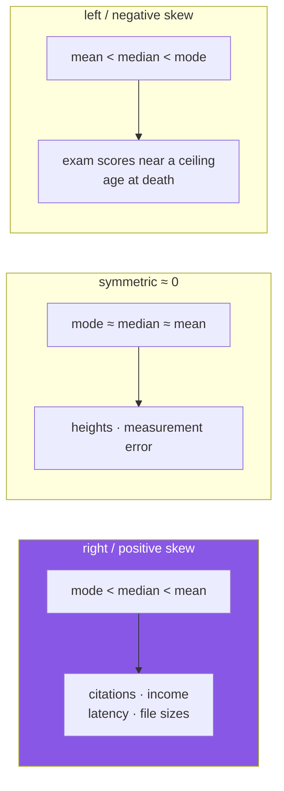

# Day 61 — Skewness and kurtosis

**Phase 8 · Module 8** · ID: **ST-05** (skewness and kurtosis)

> **Yesterday:** dispersion, and the `ddof` simulation.
> **Today:** the two numbers that describe a distribution's **shape** — and the log transform that
> fixes the first one, which is the same transform that will rescue a model on **Day 96**.
> **Tomorrow:** covariance, correlation, and Anscombe's quartet.

```bash
./m start 61 && ./m scaffold 61
```

**Time:** 100 minutes. **Request budget:** 0 model calls.

---

## §1 The story

Centre and spread do not pin down a distribution. Two datasets can share both and look nothing alike:
one symmetric, one with a long tail to the right; one with gentle shoulders, one with a sharp peak and
heavy extremes.

**Skewness** measures asymmetry. **Kurtosis** measures tail weight. Together with mean and standard
deviation they are the first four *moments*, and each one is the mean of a higher power of the
standardised deviations:

| Moment | Formula (on `z = (x − x̄)/s`) | Answers |
|---|---|---|
| 1st | mean of `z` — always 0 | where |
| 2nd | mean of `z²` — always 1 | how wide |
| 3rd | mean of `z³` | **which way it leans** |
| 4th | mean of `z⁴` | **how heavy the tails are** |

The odd power is what makes skewness signed: cubing preserves the sign, so values far above the mean
contribute positively and values far below contribute negatively. The fourth power is always positive,
so kurtosis only measures *magnitude* of extremes — which is exactly what "tail weight" means.



Day 59 showed the mean and median separating on skewed data. **Skewness is that gap, standardised** —
which means it is comparable across variables with different units and scales, and the mean−median gap
is not.

Two things worth stating up front, because both are commonly misused.

**Kurtosis is about tails, not peakedness.** The old textbook description — "peakedness" — is
misleading. A high-kurtosis distribution has more of its variance coming from **rare extreme values**.
That matters for risk: two return series with identical mean and sd behave very differently if one has
fat tails.

**"Excess" kurtosis subtracts 3.** A normal distribution has raw kurtosis 3, so `scipy` and pandas
report `kurtosis − 3` by default, making normal = 0. **Check which convention a number came from**
before comparing it to anything.

---

## §2 Setup — run this

```bash
mkdir -p days/day-61/lab
touch days/day-61/lab/shape.py
```

`src/setu/stats.py` grows today. No new packages.

---

## §3 ST-05 — shape

`days/day-61/lab/shape.py`:

```python
"""ST-05: skewness, kurtosis, and the transform that fixes the first one."""

from __future__ import annotations

import numpy as np
import pandas as pd
from scipy import stats as sp

from setu.arrays import make_rng


def same_centre_same_spread_different_shape() -> None:
    rng = make_rng(0)
    normal = rng.normal(0, 1, 20_000)
    heavy = rng.standard_t(df=3, size=20_000)
    heavy = (heavy - heavy.mean()) / heavy.std(ddof=1)

    print(f"\n  {'':<10} {'mean':>7} {'sd':>7} {'skew':>8} {'kurtosis':>10} {'|z|>4':>8}")
    for name, values in (("normal", normal), ("heavy-tail", heavy)):
        extreme = (np.abs(values) > 4).sum()
        print(f"  {name:<10} {values.mean():>7.2f} {values.std(ddof=1):>7.2f} "
              f"{sp.skew(values):>8.2f} {sp.kurtosis(values):>10.2f} {extreme:>8}")

    print("\n  Identical centre and spread. The last column is the difference:")
    print("  one has a handful of values beyond 4 sd, the other has many.")
    print("  Kurtosis is the number that saw it.")


def from_scratch() -> None:
    values = np.array([1.0, 2.0, 2.0, 3.0, 12.0])
    n = len(values)
    z = (values - values.mean()) / values.std(ddof=0)

    print(f"\n  z = {np.round(z, 3).tolist()}")
    print(f"  mean of z   = {z.mean():.6f}   <- always 0")
    print(f"  mean of z²  = {(z ** 2).mean():.6f}   <- always 1")
    print(f"  mean of z³  = {(z ** 3).mean():.4f}   <- SKEWNESS")
    print(f"  mean of z⁴  = {(z ** 4).mean():.4f}   <- raw kurtosis")
    print(f"  excess      = {(z ** 4).mean() - 3:.4f}")

    print(f"\n  scipy skew     = {sp.skew(values):.4f}   <- matches (population form)")
    print(f"  scipy kurtosis = {sp.kurtosis(values):.4f}   <- EXCESS by default")
    print(f"  pandas skew    = {pd.Series(values).skew():.4f}   <- SAMPLE-corrected, differs!")
    print("\n  ⚠️ scipy uses the population formula by default; pandas applies a sample")
    print("     correction. On small n they differ noticeably. Pick one and state it.")


def what_the_sign_means() -> None:
    rng = make_rng(1)
    right = rng.lognormal(0, 1, 20_000)
    left = -rng.lognormal(0, 1, 20_000)
    symmetric = rng.normal(0, 1, 20_000)

    print(f"\n  {'':<12} {'skew':>7} {'mean':>9} {'median':>9} {'mean−median':>13}")
    for name, values in (("right", right), ("symmetric", symmetric), ("left", left)):
        gap = values.mean() - np.median(values)
        print(f"  {name:<12} {sp.skew(values):>7.2f} {values.mean():>9.2f} "
              f"{np.median(values):>9.2f} {gap:>+13.2f}")

    print("\n  The sign of the skew and the sign of (mean − median) agree.")
    print("  Skewness is that gap STANDARDISED, so it compares across variables")
    print("  with different units. The raw gap does not.")


def rules_of_thumb_are_rough() -> None:
    print("\n  Commonly quoted:")
    print("    |skew| < 0.5        roughly symmetric")
    print("    0.5 to 1            moderately skewed")
    print("    > 1                 highly skewed")
    print("\n  These are HABITS, not tests. And they are sample-size dependent:")

    rng = make_rng(2)
    print(f"\n  skew of samples from a TRULY symmetric normal:")
    for n in (20, 100, 1_000, 10_000):
        skews = [sp.skew(rng.normal(0, 1, n)) for _ in range(200)]
        print(f"    n={n:>6}  mean |skew| = {np.mean(np.abs(skews)):.3f}  "
              f"max |skew| = {np.max(np.abs(skews)):.3f}")

    print("\n  At n=20 a symmetric population routinely produces |skew| near 0.5.")
    print("  So 'skew = 0.6, therefore skewed' is not a conclusion at small n.")


def the_log_transform() -> None:
    rng = make_rng(3)
    citations = rng.lognormal(mean=5, sigma=1.4, size=10_000)

    print(f"\n  raw citations : skew = {sp.skew(citations):>7.2f}  "
          f"kurtosis = {sp.kurtosis(citations):>8.2f}")
    logged = np.log(citations)
    print(f"  log(citations): skew = {sp.skew(logged):>7.2f}  "
          f"kurtosis = {sp.kurtosis(logged):>8.2f}")

    print("\n  A lognormal is EXACTLY normal after a log — that is its definition.")
    print("  Real data is rarely that tidy, but the direction holds for anything")
    print("  multiplicative: citations, income, latency, file sizes, populations.")

    print(f"\n  ⚠️ log(0) = {np.log(np.array([1e-300]))[0]:.0f}-ish and log(negative) is nan.")
    with_zero = np.append(citations, 0.0)
    print(f"  {np.isneginf(np.log(with_zero)).sum()=} value became -inf")
    print(f"  log1p handles it: {np.log1p(0.0)=}   <- log(1+x), so 0 maps to 0")


def transform_choices() -> None:
    rng = make_rng(4)
    values = rng.lognormal(0, 1, 5_000)

    options = {
        "raw": values,
        "log": np.log(values),
        "sqrt": np.sqrt(values),
        "reciprocal": 1 / values,
        "box-cox": sp.boxcox(values)[0],
        "yeo-johnson": sp.yeojohnson(values)[0],
    }
    print(f"\n  {'transform':<14} {'skew':>8}")
    for name, transformed in options.items():
        print(f"  {name:<14} {sp.skew(transformed):>8.3f}")

    print("\n  box-cox FINDS the best power automatically — but requires strictly positive")
    print("  data. yeo-johnson is its cousin that tolerates zero and negatives.")
    print("\n  ⚠️ Fitting a transform is FITTING. Day 80's rule applies: fit on train,")
    print("     apply the fitted parameter to test. Refitting on test is leakage.")


def when_not_to_transform() -> None:
    print("\n  A transform changes what your model predicts and what a coefficient means:")
    print("    - predicting log(citations) then exponentiating gives a MEDIAN, not a mean")
    print("      (Jensen's inequality — exp(mean of logs) ≠ mean of values)")
    print("    - a coefficient on log(x) is a PERCENTAGE effect, not an absolute one")
    print("    - the residuals you must check (Day 93) are in log space, not original space")
    print("\n  Transform when it helps the METHOD's assumptions. Do not transform to make")
    print("  a histogram prettier, and always report which space a number lives in.")


def kurtosis_is_about_tails() -> None:
    rng = make_rng(5)
    normal = rng.normal(0, 1, 50_000)
    heavy = rng.standard_t(df=4, size=50_000)
    heavy = heavy / heavy.std(ddof=1)
    flat = rng.uniform(-np.sqrt(3), np.sqrt(3), 50_000)

    print(f"\n  {'':<12} {'excess kurt':>12} {'|z|>3':>8} {'|z|>4':>8} {'peak height':>13}")
    for name, values in (("normal", normal), ("heavy (t4)", heavy), ("uniform", flat)):
        z = (values - values.mean()) / values.std(ddof=1)
        density, edges = np.histogram(z, bins=100, range=(-0.5, 0.5), density=True)
        print(f"  {name:<12} {sp.kurtosis(values):>12.2f} {(np.abs(z) > 3).sum():>8} "
              f"{(np.abs(z) > 4).sum():>8} {density.max():>13.3f}")

    print("\n  The uniform has NEGATIVE excess kurtosis and a FLAT peak — it has no tails")
    print("  at all. The t-distribution has a similar peak height to the normal but far")
    print("  more extremes. Kurtosis tracks the |z|>4 column, not the peak column.")
    print("  'Peakedness' is the wrong mental model.")


if __name__ == "__main__":
    same_centre_same_spread_different_shape()
    from_scratch()
    what_the_sign_means()
    rules_of_thumb_are_rough()
    the_log_transform()
    transform_choices()
    when_not_to_transform()
    kurtosis_is_about_tails()
```

**Line by line:**

- `from_scratch` — Principle 2. **The first two moments are always 0 and 1** by construction, which is
  why they carry no information once you have standardised; the third and fourth are where the shape
  lives.
- `scipy` versus `pandas` skew — **they differ.** SciPy uses the population formula by default (`bias=True`);
  pandas applies a sample correction. On small `n` the gap is noticeable. Pick one, state it, and stay
  consistent — the same class of problem as Day 60's `ddof`.
- `sp.kurtosis` returns **excess** kurtosis (normal = 0) by default. Raw kurtosis for a normal is 3.
  A number quoted without its convention is unusable.
- `what_the_sign_means` — the sign of the skew and the sign of `mean − median` agree. **Skewness is
  that gap standardised**, which is what makes it comparable across variables; the raw gap is in the
  data's units and is not.
- `rules_of_thumb_are_rough` — **run this.** At `n=20`, samples from a *truly symmetric* normal
  routinely produce `|skew|` around 0.5, which is the "moderately skewed" threshold. So "skew = 0.6,
  therefore skewed" is not a conclusion at small `n`. The thresholds are habits, not tests.
- `the_log_transform` — a lognormal is exactly normal after a log, by definition. Real data is never
  that tidy, but the direction holds for anything **multiplicative**: citations, income, latency, file
  sizes. **This is the transform that rescues a model on Day 96.**
- `np.log1p` — computes `log(1 + x)`, so zero maps to zero instead of `-inf`. Essential for count data,
  where zero is a legitimate value rather than an error.
- `sp.boxcox` finds the best power automatically but **requires strictly positive** data;
  `sp.yeojohnson` tolerates zeros and negatives. Note the warning: **fitting a transform is fitting.**
  Day 80's rule applies — fit the parameter on train, apply it to test, and refitting on test is
  leakage.
- `when_not_to_transform` — three consequences worth knowing before you reach for it. Predicting
  `log(y)` and exponentiating gives a **median**, not a mean (Jensen's inequality). A coefficient on
  `log(x)` is a *percentage* effect. And the residuals you check on Day 93 live in log space.
- `kurtosis_is_about_tails` — **the table settles it.** The uniform distribution has a *flatter* peak
  and *negative* excess kurtosis; the t-distribution has a similar peak height to the normal and far
  more values beyond 4 sd. Kurtosis tracks the `|z|>4` column, not the peak column. "Peakedness" is
  the wrong mental model.

---

## §4 Build brief

Extend `src/setu/stats.py`:

```python
SKEW_THRESHOLDS = {"symmetric": 0.5, "moderate": 1.0}


def shape(values, *, level: Level = "ratio", bias: bool = False) -> dict:
    """TODO(me): skewness, kurtosis and a plain-language reading.

    {"n", "skew", "kurtosis_excess", "skew_label", "tail_label", "note"?}
    - raise DataError for nominal and ordinal (both need interval spacing)
    - `bias=False` uses the SAMPLE-corrected form; state the convention in the docstring
    - kurtosis is always EXCESS (normal = 0); say so in the key name, as above
    - skew_label from SKEW_THRESHOLDS; tail_label 'light'/'normal'/'heavy'
    - when n < 50, `note` must warn that these estimates are unstable at small n (§3)
    - nan-aware; fewer than 3 non-missing values raises DataError (skew needs 3)
    """
    raise NotImplementedError


def suggest_transform(values, *, level: Level = "ratio") -> dict:
    """TODO(me): recommend a transform and say what it would achieve. PURE - fits nothing.

    {"recommended": "none"|"log1p"|"sqrt"|"yeo-johnson", "current_skew": float,
     "reason": str, "requires_positive": bool}
    - |skew| < 0.5 -> 'none'
    - right-skewed and all values >= 0 -> 'log1p' (handles zeros, §3)
    - right-skewed with negatives -> 'yeo-johnson'
    - left-skewed -> 'yeo-johnson' (log makes left skew worse)
    - the reason must name the skew value AND what the transform is for
    - raise DataError for a non-interval/ratio level
    """
    raise NotImplementedError


def apply_transform(values, *, kind: str, fitted: dict | None = None) -> tuple:
    """TODO(me): apply a transform, returning (transformed, fitted_params).

    - kind in {'none','log1p','sqrt','yeo-johnson'}; else DataError
    - when `fitted` is given, APPLY those parameters rather than refitting
      (Day 80: fit on train, apply to test — refitting on test is leakage)
    - log1p and sqrt raise DataError on any value < 0, naming how many
    - must not modify the input (ADR-001)
    - fitted_params is JSON-serialisable so it can be stored beside a model
    """
    raise NotImplementedError


def skew_stability(*, n: int, trials: int = 300, seed: int = 42) -> dict:
    """TODO(me): §3's simulation as a function, so a test can assert the instability.

    Draw `trials` samples of size n from a TRULY symmetric normal.
    Return {"n", "mean_abs_skew", "p95_abs_skew", "exceeds_half": fraction}.
    - vectorised: one (trials, n) draw
    - raise DataError if n < 3
    """
    raise NotImplementedError
```

- `shape` naming the key `kurtosis_excess` rather than `kurtosis` removes the convention ambiguity at
  the point of use — a reader of the output cannot get it wrong.
- The `note` at small `n` is §3's simulation turned into a warning the caller sees, rather than a
  caveat they were supposed to remember.
- `apply_transform` taking `fitted` is Day 22's `standardise`/`apply_standardisation` split all over
  again, and for the same reason.

---

## §5 The eval that must be able to fail

Add to `tests/test_stats.py`:

```python
from setu.stats import apply_transform, shape, skew_stability, suggest_transform


def test_symmetric_data_has_near_zero_skew():
    out = shape(list(make_rng(0).normal(0, 1, 20_000)))
    assert abs(out["skew"]) < 0.1
    assert out["skew_label"] == "symmetric"


def test_right_skew_is_positive():
    out = shape(list(make_rng(1).lognormal(0, 1, 10_000)))
    assert out["skew"] > 1
    assert out["skew_label"] == "high"


def test_left_skew_is_negative():
    out = shape(list(-make_rng(2).lognormal(0, 1, 10_000)))
    assert out["skew"] < -1


def test_normal_has_near_zero_excess_kurtosis():
    """The key is named 'excess' — normal must be 0, not 3."""
    out = shape(list(make_rng(3).normal(0, 1, 50_000)))
    assert abs(out["kurtosis_excess"]) < 0.15


def test_heavy_tails_have_positive_excess_kurtosis():
    out = shape(list(make_rng(4).standard_t(df=4, size=50_000)))
    assert out["kurtosis_excess"] > 1
    assert out["tail_label"] == "heavy"


def test_uniform_has_negative_excess_kurtosis():
    """Flatter than normal, and it has no tails at all."""
    out = shape(list(make_rng(5).uniform(-1, 1, 50_000)))
    assert out["kurtosis_excess"] < -1
    assert out["tail_label"] == "light"


def test_small_samples_get_a_warning():
    out = shape([1.0, 2.0, 3.0, 10.0])
    assert out.get("note"), "no instability warning at n=4"


def test_large_samples_get_no_warning():
    assert not shape(list(make_rng(6).normal(0, 1, 500))).get("note")


@pytest.mark.parametrize("level", ["nominal", "ordinal"])
def test_shape_is_refused_below_interval(level):
    with pytest.raises(DataError):
        shape([1, 2, 3], level=level)


def test_shape_needs_three_values():
    with pytest.raises(DataError):
        shape([1.0, 2.0])


def test_skew_is_unstable_at_small_n():
    """§3's simulation, asserted: a symmetric population often looks skewed."""
    small = skew_stability(n=20)
    assert small["exceeds_half"] > 0.2, (
        "at n=20 a symmetric population should often exceed the 'symmetric' threshold"
    )


def test_skew_stabilises_as_n_grows():
    assert skew_stability(n=20)["mean_abs_skew"] > skew_stability(n=2000)["mean_abs_skew"] * 5


def test_skew_stability_is_reproducible():
    assert skew_stability(n=50, seed=7) == skew_stability(n=50, seed=7)


def test_log_transform_reduces_right_skew():
    values = list(make_rng(7).lognormal(0, 1.4, 10_000))
    before = shape(values)["skew"]
    transformed, _ = apply_transform(values, kind="log1p")
    assert abs(shape(list(transformed))["skew"]) < abs(before) / 3


def test_suggest_recommends_none_when_symmetric():
    out = suggest_transform(list(make_rng(8).normal(0, 1, 5_000)))
    assert out["recommended"] == "none"


def test_suggest_recommends_log1p_for_positive_right_skew():
    out = suggest_transform(list(make_rng(9).lognormal(0, 1, 5_000)))
    assert out["recommended"] == "log1p"
    assert "skew" in out["reason"].lower()


def test_suggest_avoids_log_when_negatives_are_present():
    values = list(make_rng(10).lognormal(0, 1, 5_000) - 5.0)
    out = suggest_transform(values)
    assert out["recommended"] != "log1p", "log cannot handle negative values"


def test_suggest_does_not_recommend_log_for_left_skew():
    """A log makes left skew worse, not better."""
    values = list(-make_rng(11).lognormal(0, 1, 5_000) + 100)
    assert suggest_transform(values)["recommended"] != "log1p"


def test_log1p_handles_zero():
    transformed, _ = apply_transform([0.0, 1.0, 2.0], kind="log1p")
    assert np.all(np.isfinite(transformed)), "a zero produced -inf — use log1p, not log"


def test_log1p_rejects_negatives_and_counts_them():
    with pytest.raises(DataError) as info:
        apply_transform([-1.0, -2.0, 1.0], kind="log1p")
    assert "2" in str(info.value), "the count of offending values was not reported"


def test_transform_does_not_mutate_its_input():
    values = np.array([1.0, 2.0, 3.0])
    before = values.copy()
    apply_transform(values, kind="log1p")
    assert np.array_equal(values, before)


def test_fitted_params_are_reused_not_refitted():
    """Day 80: refitting on test data is leakage."""
    train = list(make_rng(12).lognormal(0, 1, 2_000))
    test = [v * 50 for v in train[:500]]

    _, fitted = apply_transform(train, kind="yeo-johnson")
    applied, reused = apply_transform(test, kind="yeo-johnson", fitted=fitted)
    refitted, own = apply_transform(test, kind="yeo-johnson")

    assert reused == fitted, "the fitted parameters were not reused"
    assert own != fitted, "the test set would have fitted a different parameter"
    assert not np.allclose(applied, refitted), "refitting silently produced different values"


def test_fitted_params_are_json_serialisable():
    import json

    _, fitted = apply_transform([1.0, 2.0, 3.0, 8.0], kind="yeo-johnson")
    json.dumps(fitted)


def test_unknown_transform_raises():
    with pytest.raises(DataError):
        apply_transform([1.0, 2.0], kind="magic")


def test_none_transform_is_the_identity():
    transformed, fitted = apply_transform([1.0, 2.0, 3.0], kind="none")
    assert np.array_equal(transformed, [1.0, 2.0, 3.0])
    assert fitted == {}
```

**Line by line:**

- `test_fitted_params_are_reused_not_refitted` — **the day's real assessment**, and it has three
  assertions doing different jobs. The parameters must come back unchanged; the test set must genuinely
  *want* a different parameter (otherwise the test proves nothing); and the two results must differ, so
  refitting is visibly wrong rather than harmlessly redundant. This is Day 22's `apply_standardisation`
  lesson in a new place, and it is the leakage that Phase 10 formalises.
- `test_skew_is_unstable_at_small_n` — asserts that at `n=20`, more than 20% of samples from a
  **symmetric** population exceed the "symmetric" threshold. §3 printed it; this pins it, and it is why
  `shape` emits a warning below `n=50`.
- `test_uniform_has_negative_excess_kurtosis` — the case that breaks the "peakedness" mental model. A
  uniform distribution is flat and has *negative* excess kurtosis, because kurtosis is about tails.
- `test_normal_has_near_zero_excess_kurtosis` — pins the convention. If someone switches to raw
  kurtosis this returns 3 and the test goes red, which is the point of naming the key `kurtosis_excess`.
- `test_suggest_does_not_recommend_log_for_left_skew` — a log transform makes **left** skew worse. A
  recommender that maps "skewed → log" fails here.
- `test_log1p_rejects_negatives_and_counts_them` — the count in the message. "Some values were
  negative" sends you looking; "2 values were negative" does not.
- `test_log1p_handles_zero` — `np.log(0)` is `-inf`, which propagates silently through a model and
  surfaces as a NaN loss on Day 129. `log1p` maps zero to zero.

```bash
uv run python -m pytest tests/test_stats.py -v
```

---

## §6 Request budget

| Resource | Spent today |
|---|---|
| LLM calls | **0** |

---

## §7 Traps

- **Comparing kurtosis without knowing the convention.** Excess or raw? Normal is 0 or 3.
- **Thinking kurtosis measures peakedness.** It measures tail weight.
- **Comparing SciPy's skew with pandas'.** Different bias correction.
- **Treating |skew| > 0.5 as a finding at small n.** A symmetric population does that routinely.
- **`np.log` on data containing zero.** `-inf`. Use `log1p`.
- **A log transform on left-skewed data.** Makes it worse.
- **Box-Cox on non-positive data.** It requires strictly positive; use Yeo-Johnson.
- **Refitting a transform on the test set.** Leakage (Day 80).
- **Exponentiating a log prediction and calling it a mean.** It is a median.
- **Forgetting a coefficient on log(x) is a percentage effect.**
- **Transforming to make a histogram prettier.** Transform for the method's assumptions.

---

## §8 Verify before you code

Written **2026-08-21**:

- <https://docs.scipy.org/doc/scipy/reference/generated/scipy.stats.skew.html> — the `bias` parameter.
- <https://docs.scipy.org/doc/scipy/reference/generated/scipy.stats.kurtosis.html> — `fisher=True`
  gives excess; confirm the default for your pinned version.
- <https://docs.scipy.org/doc/scipy/reference/generated/scipy.stats.yeojohnson.html> — and `boxcox`,
  including the positivity requirement.
- <https://numpy.org/doc/stable/reference/generated/numpy.log1p.html> — why it beats `log(1+x)`
  numerically.

---

## §9 Say it in an interview

> "Skewness and kurtosis are the third and fourth moments — asymmetry and tail weight. The correction
> I'd make to most textbook descriptions is that kurtosis isn't peakedness: a uniform distribution has
> a flatter peak *and* negative excess kurtosis, because what it actually measures is how much of your
> variance comes from rare extreme values. Two things bite in practice. First, conventions — SciPy
> reports excess kurtosis and pandas applies a different bias correction to skew than SciPy does, so a
> number without its convention is unusable; I named the output key `kurtosis_excess` so a reader
> can't get it wrong. Second, the rules of thumb are sample-size dependent: at n equals twenty a truly
> symmetric population routinely produces a skew above 0.5, so my helper attaches a warning below
> n=50, and there's a simulation test asserting that instability rather than just printing it."

---

## §10 Done when

Tick [`CHECKLIST.md`](CHECKLIST.md), then `./m check && ./m done 61`.
