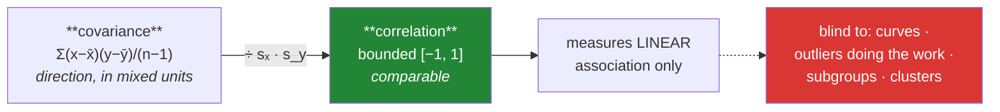

# Day 62 — Covariance and correlation: Anscombe's quartet

**Phase 8 · Module 8** · ID: **ST-06** (covariance, Pearson and Spearman correlation)

> **Yesterday:** skewness, kurtosis, and the transform.
> **Today:** the number you have been computing since Day 39 — and the four datasets that share it
> while looking nothing alike. Day 39 said *the heatmap is a screen, not a verdict*. Today you build
> the proof.
> **Tomorrow:** probability.

```bash
./m start 62 && ./m scaffold 62
```

**Time:** 110 minutes. **Request budget:** 0 model calls.

---

## §1 The story

Day 60 measured how one variable varies. **Covariance** measures how two vary *together*: multiply
each pair's deviations from their own means and average the products.

- Both above their means, or both below → positive product.
- One above, one below → negative product.

Sum them and you get the direction of the relationship. The problem is the **units**: covariance of
citations and pages is measured in "citation-pages", and its magnitude changes if you switch pages to
millimetres. You cannot tell a strong relationship from a differently-scaled one.

**Correlation is covariance with the units divided out** — by both standard deviations — which
confines it to `[-1, 1]` and makes it comparable across any pair of variables. That is the whole
derivation, and it is worth having because it explains what correlation *cannot* see.



**Anscombe's quartet** is the demonstration. Four datasets constructed in 1973 with — to two decimal
places — the same mean of x, mean of y, variance of both, correlation, and fitted regression line.
Plotted, they are: a genuine linear relationship, a perfect curve, a perfect line with one outlier,
and a vertical stripe where a single point creates the entire correlation.

**Four identical numbers. Four completely different stories. Only one of them is "these variables are
linearly related".**

That is why Day 39's heatmap is a screen and not a verdict, and today you make it a function that
*proves* it rather than a caution you remember.

Two companions worth knowing:

- **Spearman** correlates the **ranks** rather than the values. It catches any *monotonic*
  relationship, not just a straight one, and it is robust to outliers because a rank cannot run away.
  It is also the correct choice for **ordinal** data (Day 58's table).
- **`r²`** — squaring `r` gives the proportion of variance explained. `r = 0.7` sounds strong; `r² =
  0.49` says half the variation is still unaccounted for. Report both.

---

## §2 Setup — run this

```bash
mkdir -p days/day-62/lab
touch days/day-62/lab/association.py
```

`src/setu/stats.py` grows today. No new packages.

---

## §3 ST-06 — association

`days/day-62/lab/association.py`:

```python
"""ST-06: covariance, correlation, Spearman, and Anscombe's quartet."""

from __future__ import annotations

import numpy as np
import pandas as pd
from scipy import stats as sp

from setu.arrays import make_rng

ANSCOMBE = {
    "I":   ([10, 8, 13, 9, 11, 14, 6, 4, 12, 7, 5],
            [8.04, 6.95, 7.58, 8.81, 8.33, 9.96, 7.24, 4.26, 10.84, 4.82, 5.68]),
    "II":  ([10, 8, 13, 9, 11, 14, 6, 4, 12, 7, 5],
            [9.14, 8.14, 8.74, 8.77, 9.26, 8.10, 6.13, 3.10, 9.13, 7.26, 4.74]),
    "III": ([10, 8, 13, 9, 11, 14, 6, 4, 12, 7, 5],
            [7.46, 6.77, 12.74, 7.11, 7.81, 8.84, 6.08, 5.39, 8.15, 6.42, 5.73]),
    "IV":  ([8, 8, 8, 8, 8, 8, 8, 19, 8, 8, 8],
            [6.58, 5.76, 7.71, 8.84, 8.47, 7.04, 5.25, 12.50, 5.56, 7.91, 6.89]),
}


def from_scratch() -> None:
    x = np.array([1.0, 2.0, 3.0, 4.0, 5.0])
    y = np.array([2.0, 4.0, 5.0, 4.0, 5.0])

    dx, dy = x - x.mean(), y - y.mean()
    cov = (dx * dy).sum() / (len(x) - 1)
    r = cov / (x.std(ddof=1) * y.std(ddof=1))

    print(f"\n  deviations x: {dx.tolist()}")
    print(f"  deviations y: {dy.tolist()}")
    print(f"  products    : {np.round(dx * dy, 2).tolist()}")
    print(f"\n  covariance = {cov:.4f}   (ddof=1, as always here)")
    print(f"  r          = {r:.4f}")
    print(f"  numpy      = {np.cov(x, y, ddof=1)[0, 1]:.4f} / {np.corrcoef(x, y)[0, 1]:.4f}")
    print(f"  scipy      = {sp.pearsonr(x, y).statistic:.4f}")
    print("\n  Read the products: pairs where both deviate the SAME way contribute positively.")


def units_are_the_problem() -> None:
    rng = make_rng(0)
    pages = rng.integers(4, 16, 200).astype(float)
    citations = pages * 30 + rng.normal(0, 50, 200)

    print(f"\n  cov(pages, citations)      = {np.cov(pages, citations, ddof=1)[0, 1]:>10.1f}")
    print(f"  cov(pages_mm, citations)   = {np.cov(pages * 25.4, citations, ddof=1)[0, 1]:>10.1f}")
    print("  ^ same relationship, 25.4x the covariance. The number is meaningless alone.")

    print(f"\n  r(pages, citations)        = {np.corrcoef(pages, citations)[0, 1]:>10.4f}")
    print(f"  r(pages_mm, citations)     = {np.corrcoef(pages * 25.4, citations)[0, 1]:>10.4f}")
    print("  ^ identical. Dividing by both sds removed the units. That IS correlation.")


def anscombe() -> None:
    print(f"\n  {'set':<5} {'mean x':>8} {'mean y':>8} {'var x':>8} {'var y':>8} "
          f"{'r':>7} {'slope':>7} {'intercept':>10}")
    for name, (x, y) in ANSCOMBE.items():
        x, y = np.array(x, dtype=float), np.array(y, dtype=float)
        fit = sp.linregress(x, y)
        print(f"  {name:<5} {x.mean():>8.2f} {y.mean():>8.2f} {x.var(ddof=1):>8.2f} "
              f"{y.var(ddof=1):>8.2f} {np.corrcoef(x, y)[0, 1]:>7.3f} "
              f"{fit.slope:>7.3f} {fit.intercept:>10.3f}")

    print("\n  Seven summary statistics. Identical to two decimal places. Now the shapes:")
    print("    I   — a genuine noisy linear relationship")
    print("    II  — a PERFECT parabola; the linear fit is simply wrong")
    print("    III — a perfect line plus ONE outlier that drags the slope")
    print("    IV  — a vertical stripe at x=8 plus one point at x=19 that CREATES r entirely")

    print("\n  Only set I supports 'these variables are linearly related'.")
    print("  You cannot tell which set you have from the numbers. You have to LOOK.")


def what_removing_one_point_does() -> None:
    print(f"\n  {'set':<5} {'r (all)':>9} {'r (drop most extreme x)':>26}")
    for name, (x, y) in ANSCOMBE.items():
        x, y = np.array(x, dtype=float), np.array(y, dtype=float)
        keep = np.argsort(np.abs(x - x.mean()))[:-1]
        print(f"  {name:<5} {np.corrcoef(x, y)[0, 1]:>9.3f} "
              f"{np.corrcoef(x[keep], y[keep])[0, 1]:>26.3f}")

    print("\n  Set IV collapses to nan — every remaining x is 8, so there is no variance")
    print("  left to correlate. ONE point was the entire relationship.")
    print("  Set I barely moves. That difference is a diagnostic you can automate (§4).")


def spearman_sees_monotonic() -> None:
    rng = make_rng(1)
    x = np.linspace(1, 10, 200)
    curved = np.exp(x / 2) + rng.normal(0, 1, 200)
    parabola = (x - 5.5) ** 2 + rng.normal(0, 1, 200)

    print(f"\n  {'relationship':<18} {'pearson':>9} {'spearman':>10}")
    for name, y in (("linear", 3 * x + rng.normal(0, 2, 200)),
                    ("exponential", curved),
                    ("parabola", parabola)):
        print(f"  {name:<18} {sp.pearsonr(x, y).statistic:>9.3f} "
              f"{sp.spearmanr(x, y).statistic:>10.3f}")

    print("\n  Exponential: Pearson is high but Spearman is ~1.0 — the relationship is")
    print("  perfectly MONOTONIC, just not straight.")
    print("  Parabola: BOTH are near zero. It is not monotonic either, so neither sees it.")
    print("  ⚠️ r ≈ 0 does NOT mean independent. It means 'not linear' (and for Spearman,")
    print("     'not monotonic'). Only a scatter plot rules out a relationship.")


def spearman_is_robust() -> None:
    rng = make_rng(2)
    x = rng.normal(0, 1, 100)
    y = x + rng.normal(0, 0.3, 100)

    x_dirty = np.append(x, 50.0)
    y_dirty = np.append(y, -50.0)

    print(f"\n  {'':<12} {'pearson':>9} {'spearman':>10}")
    print(f"  {'clean':<12} {sp.pearsonr(x, y).statistic:>9.3f} "
          f"{sp.spearmanr(x, y).statistic:>10.3f}")
    print(f"  {'+1 outlier':<12} {sp.pearsonr(x_dirty, y_dirty).statistic:>9.3f} "
          f"{sp.spearmanr(x_dirty, y_dirty).statistic:>10.3f}")
    print("\n  One point flips Pearson's sign. Spearman barely notices, because a rank")
    print("  cannot run away — the outlier is just 'the largest', worth one place.")


def r_squared_is_the_honest_number() -> None:
    print(f"\n  {'r':>6} {'r²':>7}  interpretation")
    for r in (0.3, 0.5, 0.7, 0.9, 0.95):
        print(f"  {r:>6.2f} {r ** 2:>7.2f}  {r ** 2 * 100:.0f}% of variance explained")
    print("\n  r = 0.7 sounds strong. r² = 0.49 says HALF the variation is unexplained.")
    print("  Always report r² beside r; it is the number a reader can actually use.")


def correlation_is_not_causation() -> None:
    rng = make_rng(3)
    n = 500
    quality = rng.normal(0, 1, n)
    pages = 10 + quality * 2 + rng.normal(0, 1, n)
    citations = 100 + quality * 50 + rng.normal(0, 10, n)

    print(f"\n  r(pages, citations) = {np.corrcoef(pages, citations)[0, 1]:.3f}")
    print("  ^ 'longer papers get more citations!' — but pages does not CAUSE citations here.")
    print("    Both were generated from `quality`. It is a CONFOUNDER.")

    residual_p = pages - np.polyval(np.polyfit(quality, pages, 1), quality)
    residual_c = citations - np.polyval(np.polyfit(quality, citations, 1), quality)
    print(f"\n  r(pages, citations | quality) = {np.corrcoef(residual_p, residual_c)[0, 1]:.3f}")
    print("  ^ controlling for quality, the association vanishes. That is what a")
    print("    confounder does, and no correlation coefficient can detect one for you.")


if __name__ == "__main__":
    from_scratch()
    units_are_the_problem()
    anscombe()
    what_removing_one_point_does()
    spearman_sees_monotonic()
    spearman_is_robust()
    r_squared_is_the_honest_number()
    correlation_is_not_causation()
```

**Line by line:**

- `from_scratch` — Principle 2. **Read the products row**: pairs where both values deviate the same
  direction contribute positively, pairs that disagree contribute negatively. That is the entire
  mechanism, and everything else is normalisation.
- `units_are_the_problem` — the same relationship in millimetres has 25.4× the covariance and
  **identical** correlation. That comparison *is* the derivation: dividing by both standard deviations
  removes the units, which is why correlation is bounded and comparable and covariance is neither.
- `anscombe` — **run it and read the table before reading the descriptions.** Seven statistics,
  identical to two decimals, four completely different datasets. Only set I supports the sentence
  "these variables are linearly related", and **you cannot tell which set you have from the numbers.**
- `what_removing_one_point_does` — the automatable diagnostic. Dropping the single most extreme `x`
  barely moves set I and makes set IV's correlation **undefined**, because every remaining `x` is 8 and
  there is no variance left. §4 turns this into a leverage check.
- `spearman_sees_monotonic` — the exponential case has Pearson high but Spearman ≈ 1.0: the
  relationship is perfectly monotonic, merely not straight. The parabola defeats **both**, because it
  is not monotonic either. **`r ≈ 0` does not mean independent** — it means "not linear", and only a
  scatter plot rules a relationship out.
- `spearman_is_robust` — one outlier flips Pearson's **sign**. Spearman barely moves, because a rank
  cannot run away: an extreme value is just "the largest", worth exactly one place. Same robustness
  story as the median (Day 59) and the IQR (Day 60).
- `r_squared_is_the_honest_number` — `r = 0.7` sounds strong until you read `r² = 0.49`. Report both;
  `r²` is the number a reader can act on.
- `correlation_is_not_causation` — **not a slogan here, a construction.** Both variables were generated
  from `quality`, and controlling for it makes the association vanish. That is what a confounder does,
  and no correlation coefficient can detect one for you. Day 93 revisits this properly.

---

## §4 Build brief

Extend `src/setu/stats.py`:

```python
def association(x, y, *, method: str = "pearson", level_x: Level = "ratio",
                level_y: Level = "ratio") -> dict:
    """TODO(me): correlation with the caveats attached.

    {"method", "r", "r_squared", "n", "covariance"?, "spearman"?, "warnings": [...]}
    - method in {'pearson','spearman','both'}; else DataError
    - Pearson requires interval or ratio on BOTH sides; raise DataError otherwise,
      naming which side failed (Day 58) — Spearman is legal from ordinal upward
    - covariance only when method includes pearson
    - warnings must fire for: n < 30; |r| and |spearman| differing by more than 0.2
      (a sign of curvature or outliers); any single point with high leverage (below)
    - drop pairs where either value is missing, and report how many were dropped
    - raise DataError if fewer than 3 complete pairs remain
    """
    raise NotImplementedError


def leverage_check(x, y, *, threshold: float = 0.2) -> dict:
    """TODO(me): §3's diagnostic — how much does ONE point control the correlation?

    {"r_full", "max_abs_change", "influential_index", "is_fragile"}
    - recompute r with each point removed in turn (leave-one-out)
    - max_abs_change is the largest |r_full − r_without_i|
    - is_fragile when max_abs_change > threshold
    - when removing a point makes r undefined (Anscombe IV), treat the change as 1.0
    - vectorised or not, but it must handle n=1000 without being unusable
    - raise DataError on fewer than 4 points (leave-one-out needs something left)
    """
    raise NotImplementedError


def anscombe_frames() -> dict:
    """TODO(me): return the four datasets as DataFrames, for tests and for Day 90's report.

    {"I": DataFrame(x, y), ...}. The values are famous and fixed; hard-code them.
    """
    raise NotImplementedError


def association_matrix(frame, *, method: str = "pearson", levels: dict | None = None) -> dict:
    """TODO(me): pairwise association for a whole frame, level-aware.

    - reuse correlation_matrix from Day 25 for the pearson case; do NOT reimplement it
    - skip column pairs whose levels forbid the method, and LIST the skips
    - return {"matrix": ..., "skipped": [(a, b, reason), ...], "fragile_pairs": [...]}
    - fragile_pairs come from leverage_check on each pair; cap the work at 50 columns
      and raise DataError above that (n² leave-one-out gets expensive)
    """
    raise NotImplementedError
```

- `association` returning **warnings** rather than a bare `r` is the day's design decision: the
  caveats travel with the number instead of living in someone's memory.
- The Pearson-vs-Spearman divergence warning is a cheap, automatic curvature detector — it is what
  would have flagged Anscombe II without anyone plotting it.
- `leverage_check` makes §3's manual demonstration a function, which is what lets Day 90's report say
  *"this correlation is fragile"* with evidence.

---

## §5 The eval that must be able to fail

Add to `tests/test_stats.py`:

```python
from setu.stats import anscombe_frames, association, association_matrix, leverage_check


def test_correlation_matches_scipy():
    from scipy import stats as sp

    x = [1.0, 2.0, 3.0, 4.0, 5.0]
    y = [2.0, 4.0, 5.0, 4.0, 5.0]
    assert association(x, y)["r"] == pytest.approx(sp.pearsonr(x, y).statistic)


def test_correlation_is_scale_invariant():
    """Units divided out — that IS correlation."""
    x = list(make_rng(0).normal(0, 1, 200))
    y = [3 * v + 1 for v in x]
    assert association(x, y)["r"] == pytest.approx(
        association([v * 25.4 for v in x], y)["r"]
    )


def test_r_squared_is_reported():
    out = association(list(make_rng(1).normal(size=100)), list(make_rng(2).normal(size=100)))
    assert out["r_squared"] == pytest.approx(out["r"] ** 2)


def test_anscombe_sets_share_their_statistics():
    """The whole point: identical numbers, different data."""
    frames = anscombe_frames()
    stats_seen = []
    for name, frame in frames.items():
        out = association(frame["x"], frame["y"])
        stats_seen.append((round(frame["x"].mean(), 2), round(frame["y"].mean(), 2),
                           round(out["r"], 2)))
    assert len(set(stats_seen)) == 1, f"the four sets should agree to 2dp: {stats_seen}"


def test_anscombe_has_four_sets_of_eleven_points():
    frames = anscombe_frames()
    assert set(frames) == {"I", "II", "III", "IV"}
    assert all(len(f) == 11 for f in frames.values())


def test_leverage_finds_anscombe_four_fragile():
    """One point creates the entire correlation."""
    frame = anscombe_frames()["IV"]
    result = leverage_check(frame["x"], frame["y"])
    assert result["is_fragile"] is True
    assert result["max_abs_change"] > 0.5


def test_leverage_finds_anscombe_three_fragile():
    """A perfect line plus one outlier."""
    frame = anscombe_frames()["III"]
    assert leverage_check(frame["x"], frame["y"])["is_fragile"] is True


def test_leverage_says_anscombe_one_is_stable():
    frame = anscombe_frames()["I"]
    result = leverage_check(frame["x"], frame["y"])
    assert result["is_fragile"] is False


def test_leverage_names_the_influential_point():
    frame = anscombe_frames()["IV"]
    index = leverage_check(frame["x"], frame["y"])["influential_index"]
    assert frame["x"].iloc[index] == 19, "the x=19 point is the one doing the work"


def test_leverage_rejects_tiny_samples():
    with pytest.raises(DataError):
        leverage_check([1.0, 2.0, 3.0], [1.0, 2.0, 3.0])


def test_pearson_and_spearman_diverge_on_a_curve():
    """The automatic curvature detector."""
    x = list(np.linspace(1, 10, 200))
    y = [np.exp(v / 2) for v in x]
    out = association(x, y, method="both")
    assert out["spearman"] > 0.99
    assert out["r"] < out["spearman"] - 0.05
    assert any("curv" in w.lower() or "monotonic" in w.lower() for w in out["warnings"])


def test_spearman_is_robust_to_an_outlier():
    rng = make_rng(3)
    x = list(rng.normal(0, 1, 100))
    y = [v + rng.normal(0, 0.3) for v in x]
    clean = association(x, y, method="both")
    dirty = association(x + [50.0], y + [-50.0], method="both")
    assert abs(dirty["spearman"] - clean["spearman"]) < abs(dirty["r"] - clean["r"]) / 3


def test_near_zero_r_does_not_mean_independent():
    """A parabola: perfectly determined, r near zero."""
    x = np.linspace(-3, 3, 400)
    y = x**2
    out = association(list(x), list(y))
    assert abs(out["r"]) < 0.1, "a parabola should have near-zero Pearson r"


def test_pearson_is_refused_for_ordinal():
    with pytest.raises(DataError) as info:
        association([1, 2, 3], [1, 2, 3], level_x="ordinal")
    assert "x" in str(info.value).lower() or "level_x" in str(info.value)


def test_spearman_is_allowed_for_ordinal():
    out = association([1, 2, 3, 4], [1, 2, 3, 4], method="spearman",
                      level_x="ordinal", level_y="ordinal")
    assert out["spearman"] == pytest.approx(1.0)


def test_nominal_is_refused_for_both():
    for method in ("pearson", "spearman"):
        with pytest.raises(DataError):
            association(["a", "b"], ["c", "d"], method=method, level_x="nominal")


def test_small_n_gets_a_warning():
    out = association([1.0, 2.0, 3.0, 4.0], [2.0, 4.0, 5.0, 4.0])
    assert any("n" in w.lower() for w in out["warnings"])


def test_missing_pairs_are_dropped_and_counted():
    out = association([1.0, 2.0, np.nan, 4.0, 5.0], [2.0, 4.0, 5.0, np.nan, 6.0])
    assert out["n"] == 3, "incomplete pairs should be dropped"


def test_too_few_complete_pairs_raises():
    with pytest.raises(DataError):
        association([1.0, np.nan, np.nan], [1.0, 2.0, 3.0])


def test_unknown_method_raises():
    with pytest.raises(DataError):
        association([1.0, 2.0, 3.0], [1.0, 2.0, 3.0], method="kendall-ish")


def test_matrix_reuses_day_25_correlation(monkeypatch):
    import setu.stats as stats

    calls = []
    original = stats.correlation_matrix
    monkeypatch.setattr(stats, "correlation_matrix",
                        lambda m: calls.append(1) or original(m))
    association_matrix(pd.DataFrame({"a": [1.0, 2, 3, 4], "b": [2.0, 4, 5, 4]}))
    assert calls, "association_matrix reimplemented the correlation"


def test_matrix_lists_skipped_pairs():
    frame = pd.DataFrame({"a": [1.0, 2, 3, 4], "venue": ["x", "y", "x", "y"]})
    result = association_matrix(frame, levels={"a": "ratio", "venue": "nominal"})
    assert result["skipped"], "a nominal column should have been skipped, with a reason"
    assert any("venue" in str(entry) for entry in result["skipped"])


def test_matrix_refuses_too_many_columns():
    frame = pd.DataFrame({f"c{i}": [1.0, 2.0, 3.0, 4.0] for i in range(60)})
    with pytest.raises(DataError):
        association_matrix(frame)
```

**Line by line:**

- `test_anscombe_sets_share_their_statistics` — **the day's real assessment.** It computes the summary
  statistics for all four sets, rounds to two decimals, and asserts there is exactly **one** distinct
  result. That is Anscombe's construction, verified rather than described.
- `test_leverage_finds_anscombe_four_fragile` and its companions — the diagnostic must flag sets III
  and IV and **clear** set I. A check that flags everything is as useless as one that flags nothing,
  which is why the negative case is tested too.
- `test_leverage_names_the_influential_point` — asserts the identified point is the `x = 19` one. It
  is not enough to say "fragile"; a report needs to say *which observation*.
- `test_pearson_and_spearman_diverge_on_a_curve` — three assertions: Spearman ≈ 1, Pearson visibly
  lower, and **a warning fired**. This is the automatic curvature detector, and it is what would have
  caught Anscombe II without anyone plotting it.
- `test_near_zero_r_does_not_mean_independent` — a parabola, where `y` is *perfectly determined* by `x`
  and Pearson is near zero. Day 39 asserted this; today it is proved from the definition.
- `test_correlation_is_scale_invariant` — multiplying `x` by 25.4 must not change `r`. That property
  *is* what dividing by the standard deviations achieves.
- `test_matrix_reuses_day_25_correlation` — the architecture test, fourth appearance (Days 34, 51, 58).
  Two implementations of correlation in one codebase will disagree at the fourth decimal and cost
  someone an afternoon.
- `test_matrix_lists_skipped_pairs` — a nominal column must be **skipped with a reason**, not silently
  omitted. Silence looks like "there was no relationship".

```bash
uv run python -m pytest tests/test_stats.py -v
```

---

## §6 Request budget

| Resource | Spent today |
|---|---|
| LLM calls | **0** |

---

## §7 Traps

- **Reporting covariance.** Units are meaningless; report `r`.
- **Reading `r` without `r²`.** 0.7 sounds strong; 49% unexplained is the honest version.
- **Concluding from `r` without plotting.** Anscombe. Four identical numbers.
- **`r ≈ 0` read as independence.** It means "not linear".
- **Pearson on ordinal data.** Day 58. Use Spearman.
- **Pearson with an outlier present.** One point can flip the sign.
- **Ignoring a Pearson–Spearman gap.** It is a free curvature and outlier detector.
- **A correlation from three points.** Warn on small `n`.
- **Dropping incomplete pairs silently.** Report how many.
- **Correlation read as causation.** A confounder produces one for free.
- **A leave-one-out check on 500 columns.** Quadratic. Cap it.

---

## §8 Verify before you code

Written **2026-08-21**:

- <https://docs.scipy.org/doc/scipy/reference/generated/scipy.stats.pearsonr.html> — the returned
  object and its `.statistic` / `.pvalue` fields.
- <https://docs.scipy.org/doc/scipy/reference/generated/scipy.stats.spearmanr.html> — tie handling.
- <https://numpy.org/doc/stable/reference/generated/numpy.cov.html> — confirm the `ddof` default.
- <https://en.wikipedia.org/wiki/Anscombe%27s_quartet> — the original 1973 values.

---

## §9 Say it in an interview

> "Correlation is covariance with the units divided out — that's the whole derivation, and it's why
> it's bounded and comparable when covariance isn't. The thing I'd demonstrate is Anscombe's quartet:
> four datasets that agree on mean, variance, correlation and fitted line to two decimal places, where
> one is a genuine linear relationship, one is a perfect parabola, one is a line with a single
> outlier, and one is a vertical stripe where one point creates the entire correlation. You cannot
> tell which you have from the numbers. So my helper returns warnings alongside `r` — small n, a
> Pearson–Spearman divergence above 0.2, which is a free curvature detector, and a leave-one-out
> leverage check that flags when a single observation is doing the work. There's a test asserting all
> four Anscombe sets produce identical statistics, and that the leverage check flags sets three and
> four while clearing set one — because a check that flags everything is as useless as one that flags
> nothing."

---

## §10 Done when

Tick [`CHECKLIST.md`](CHECKLIST.md), then `./m check && ./m done 62`.
