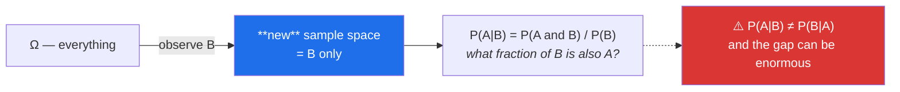

# Day 63 — Probability, conditional probability, and the base-rate fallacy

**Phase 8 · Module 8** · IDs: **ST-07** (sets, random variables, expectation), **ST-08** (probability, conditional probability)

> **Yesterday:** covariance, correlation and Anscombe's quartet closed the descriptive half.
> **Today:** the machinery behind every claim in the second half. And one demonstration you should
> carry for the rest of your career: **a 99%-accurate test for a rare disease is wrong most of the
> time it says yes.** That is not a trick — it is arithmetic, and it is Day 101's precision problem
> arriving thirty-eight days early.
> **Tomorrow:** PMF, PDF, CDF.

```bash
./m start 63 && ./m scaffold 63
```

**Time:** 110 minutes. **Request budget:** 0 model calls.

---

## §1 The story

Probability is set arithmetic on outcomes. Three definitions do most of the work:

- **Sample space** `Ω` — every outcome that could happen.
- **Event** — a subset of `Ω`. "The paper is from NeurIPS" is a set of outcomes.
- **P(A)** — how much of `Ω` the event covers, between 0 and 1.

From which: `P(A or B) = P(A) + P(B) − P(A and B)`. You subtract the overlap because adding the two
counts it twice — Day 49's set operations, now with a measure attached.

The idea that matters is **conditioning**. `P(A | B)` is "the probability of A, *given* that B
happened", and it is not a new concept so much as a **change of sample space**: you throw away
everything where B is false, and ask what fraction of what remains has A.



**`P(A|B)` and `P(B|A)` are different numbers.** Confusing them is the single most consequential
mistake in applied statistics, and it has a name — the **base-rate fallacy** — because what closes the
gap is how common A was to begin with.

The medical version is the classic: a test that is 99% accurate, for a disease affecting 1 in 1,000.
You test positive. What is the probability you have it?

Most people say 99%. **The answer is about 9%**, and the reason is that among 1,000 people there is
one true case and roughly ten false positives. You will compute this in §3 by literally counting
people, before touching a formula.

Two more pieces:

- **A random variable** is a function from outcomes to numbers. "Number of citations" maps a paper to
  an integer. It is the bridge from events to arithmetic, and it is what makes Day 64's distributions
  possible.
- **Expectation** `E[X]` is the probability-weighted average — the mean you would get from infinitely
  many draws. Day 59's `x̄` is its sample estimate, and Day 67's Central Limit Theorem is about how
  close they get.

---

## §2 Setup — run this

```bash
mkdir -p days/day-63/lab
touch days/day-63/lab/probability.py
```

`src/setu/stats.py` grows today. No new packages.

---

## §3 ST-07 / ST-08 — probability

`days/day-63/lab/probability.py`:

```python
"""ST-07 / ST-08: sample spaces, conditioning, and the base-rate fallacy."""

from __future__ import annotations

import itertools

import numpy as np
import pandas as pd

from setu.arrays import make_rng


def sample_spaces_are_sets() -> None:
    omega = set(itertools.product([1, 2, 3, 4, 5, 6], repeat=2))
    print(f"\n  |Ω| for two dice = {len(omega)}")

    sum_seven = {o for o in omega if sum(o) == 7}
    first_even = {o for o in omega if o[0] % 2 == 0}

    p = lambda event: len(event) / len(omega)  # noqa: E731
    print(f"  P(sum = 7)          = {p(sum_seven):.4f}  ({len(sum_seven)}/36)")
    print(f"  P(first is even)    = {p(first_even):.4f}")
    print(f"  P(both)             = {p(sum_seven & first_even):.4f}   <- set INTERSECTION")
    print(f"  P(either)           = {p(sum_seven | first_even):.4f}   <- set UNION")
    print(f"  P(A)+P(B)−P(A∩B)    = {p(sum_seven) + p(first_even) - p(sum_seven & first_even):.4f}")
    print("\n  Same set operations as Day 49, with a measure attached. Probability IS")
    print("  counting, when the outcomes are equally likely.")


def conditioning_shrinks_the_world() -> None:
    omega = set(itertools.product([1, 2, 3, 4, 5, 6], repeat=2))
    sum_seven = {o for o in omega if sum(o) == 7}
    first_even = {o for o in omega if o[0] % 2 == 0}

    print(f"\n  P(sum=7)              = {len(sum_seven) / len(omega):.4f}")
    print(f"  P(sum=7 | first even) = {len(sum_seven & first_even) / len(first_even):.4f}")
    print(f"\n  the denominator changed from {len(omega)} to {len(first_even)}")
    print("  ^ that IS conditioning: you discarded every outcome where B was false.")
    print("  Here the answer did not change — the events are INDEPENDENT.")

    sum_ten = {o for o in omega if sum(o) == 10}
    print(f"\n  P(sum=10)              = {len(sum_ten) / len(omega):.4f}")
    print(f"  P(sum=10 | first even) = {len(sum_ten & first_even) / len(first_even):.4f}")
    print("  ^ this one DID change. Not independent.")


def independence_is_a_test_not_an_assumption() -> None:
    rng = make_rng(0)
    n = 100_000
    open_access = rng.random(n) < 0.4
    highly_cited = rng.random(n) < 0.2                       # independent by construction

    quality = rng.normal(0, 1, n)
    oa2 = (quality + rng.normal(0, 1, n)) > 0.5
    cited2 = (quality + rng.normal(0, 1, n)) > 0.8            # share a cause

    print(f"\n  {'':<24} {'P(A)':>7} {'P(A|B)':>8} {'P(A)·P(B)':>11} {'P(A∩B)':>9}")
    for label, a, b in (("independent", highly_cited, open_access),
                        ("common cause", cited2, oa2)):
        pa, pb = a.mean(), b.mean()
        pab = (a & b).mean()
        print(f"  {label:<24} {pa:>7.4f} {pab / pb:>8.4f} {pa * pb:>11.4f} {pab:>9.4f}")

    print("\n  Independent means P(A|B) = P(A), equivalently P(A∩B) = P(A)·P(B).")
    print("  In the second row those disagree — the events share a hidden cause,")
    print("  which is Day 62's confounder wearing probability notation.")


def the_disease_test_by_counting() -> None:
    population = 1_000_000
    prevalence = 0.001
    sensitivity = 0.99        # P(positive | sick)
    specificity = 0.99        # P(negative | healthy)

    sick = int(population * prevalence)
    healthy = population - sick
    true_positives = int(sick * sensitivity)
    false_positives = int(healthy * (1 - specificity))

    print(f"\n  imagine {population:,} people, {prevalence:.1%} of them sick")
    print(f"    sick    : {sick:>8,}   of whom {true_positives:>7,} test positive")
    print(f"    healthy : {healthy:>8,}   of whom {false_positives:>7,} test positive")
    print(f"\n  total positives = {true_positives + false_positives:,}")
    print(f"  of those, actually sick = {true_positives:,}")
    print(f"\n  P(sick | positive) = {true_positives / (true_positives + false_positives):.1%}")

    print("\n  A 99%-accurate test, and a positive result means about a 9% chance.")
    print("  NO formula was used. Count people; the arithmetic does the work.")
    print("\n  P(positive | sick) = 99%   P(sick | positive) = 9%")
    print("  Those are the two numbers people confuse, and the gap is the BASE RATE:")
    print("  there are 1,000x more healthy people, so their 1% error swamps the 99%.")


def prevalence_drives_everything() -> None:
    print(f"\n  same 99%/99% test, varying how common the condition is:")
    print(f"  {'prevalence':>12} {'P(sick|positive)':>18}")
    for prevalence in (0.0001, 0.001, 0.01, 0.1, 0.5):
        tp = prevalence * 0.99
        fp = (1 - prevalence) * 0.01
        print(f"  {prevalence:>12.2%} {tp / (tp + fp):>18.1%}")

    print("\n  The test never changed. Only the world did.")
    print("  ⚠️ This is Day 101's PRECISION problem, exactly: on a rare positive class,")
    print("     a classifier with excellent recall still produces mostly false alarms.")
    print("     Same arithmetic, different vocabulary.")


def random_variables_and_expectation() -> None:
    outcomes = np.array([0, 1, 2, 3])
    probs = np.array([0.5, 0.3, 0.15, 0.05])

    expected = (outcomes * probs).sum()
    variance = (probs * (outcomes - expected) ** 2).sum()

    print(f"\n  X: revisions before acceptance")
    print(f"  P = {probs.tolist()}   (sums to {probs.sum():.2f})")
    print(f"  E[X] = Σ x·P(x) = {expected:.3f}")
    print(f"  Var[X] = Σ P(x)·(x−E[X])² = {variance:.3f}")
    print(f"  sd = {np.sqrt(variance):.3f}")

    rng = make_rng(1)
    draws = rng.choice(outcomes, size=200_000, p=probs)
    print(f"\n  mean of 200,000 draws = {draws.mean():.3f}")
    print("  ^ the sample mean approaches E[X]. That is the law of large numbers,")
    print("    and Day 67 quantifies HOW FAST.")
    print(f"\n  E[X] = {expected:.2f} — a value X can never actually take. An expectation")
    print("  is a long-run average, not a prediction of any single outcome.")


def expectation_is_linear() -> None:
    rng = make_rng(2)
    x = rng.normal(10, 3, 100_000)
    y = rng.normal(5, 2, 100_000)

    print(f"\n  E[X] = {x.mean():.3f}   E[Y] = {y.mean():.3f}")
    print(f"  E[X+Y]   = {(x + y).mean():.3f}   vs E[X]+E[Y] = {x.mean() + y.mean():.3f}  ✅ always")
    print(f"  E[3X+2]  = {(3 * x + 2).mean():.3f}   vs 3E[X]+2  = {3 * x.mean() + 2:.3f}  ✅ always")
    print(f"  E[X·Y]   = {(x * y).mean():.3f}   vs E[X]·E[Y] = {x.mean() * y.mean():.3f}  "
          f"⚠️ only when INDEPENDENT")
    print(f"  E[X²]    = {(x ** 2).mean():.3f}   vs E[X]²     = {x.mean() ** 2:.3f}  ❌ never equal")

    print("\n  E[X²] ≠ E[X]² is not a curiosity: their DIFFERENCE is the variance.")
    print("  It is also why exp(mean of logs) ≠ mean of values — Day 61's warning about")
    print("  back-transforming a log prediction.")


def joint_marginal_conditional() -> None:
    joint = pd.DataFrame(
        [[0.30, 0.10], [0.20, 0.40]],
        index=pd.Index(["NeurIPS", "other"], name="venue"),
        columns=pd.Index(["high", "low"], name="citations"),
    )
    print(f"\n  joint P(venue, citations), sums to {joint.to_numpy().sum():.2f}:\n{joint}")
    print(f"\n  marginal P(venue):\n{joint.sum(axis=1)}")
    print(f"\n  conditional P(citations | venue) — each ROW divided by its total:\n"
          f"{joint.div(joint.sum(axis=1), axis=0).round(3)}")
    print(f"\n  conditional P(venue | citations) — each COLUMN divided by its total:\n"
          f"{joint.div(joint.sum(axis=0), axis=1).round(3)}")
    print("\n  Read the two conditionals: P(high|NeurIPS)=0.75 but P(NeurIPS|high)=0.60.")
    print("  Same table. Different questions. Different answers. Divide by rows or columns")
    print("  and you have answered a different thing — which is the base-rate fallacy again.")


if __name__ == "__main__":
    sample_spaces_are_sets()
    conditioning_shrinks_the_world()
    independence_is_a_test_not_an_assumption()
    the_disease_test_by_counting()
    prevalence_drives_everything()
    random_variables_and_expectation()
    expectation_is_linear()
    joint_marginal_conditional()
```

**Line by line:**

- `itertools.product([1..6], repeat=2)` — the sample space built explicitly, so `P` really is
  "count the subset, divide by 36". Probability *is* counting when outcomes are equally likely, and
  starting there makes the abstractions later feel like shorthand rather than magic.
- `conditioning_shrinks_the_world` — **the denominator changed from 36 to 18.** That is conditioning:
  you discard every outcome where B is false and re-ask the question in what remains. Note that the
  first pair is independent (the answer did not move) and the second is not.
- `independence_is_a_test_not_an_assumption` — `P(A∩B) = P(A)·P(B)` is the definition, and in the
  second row it fails because both events share a hidden cause. **That is Day 62's confounder in
  probability notation**, and it is why "assume independence" is a claim you should check.
- `the_disease_test_by_counting` — **the demonstration, and note that no formula appears.** One million
  people, a thousand sick, 990 true positives, 9,990 false positives. About 9%. Counting people is the
  version that stays with you; Bayes' theorem on Day 72 is the same arithmetic compressed.
- The two numbers side by side — `P(positive | sick) = 99%` and `P(sick | positive) = 9%`. **The gap is
  the base rate**: there are a thousand times more healthy people, so their 1% error rate swamps the
  sick group's 99% success rate.
- `prevalence_drives_everything` — **run this and read the column.** The test never changes; only the
  world does. And the printed warning is the real payoff: **this is Day 101's precision problem
  exactly.** A fraud classifier with 99% recall on a 0.1% positive class produces mostly false alarms,
  and it is the same arithmetic with different vocabulary.
- `random_variables_and_expectation` — `E[X] = 0.75`, a value X can never take. **An expectation is a
  long-run average, not a prediction.** The 200,000-draw check is the law of large numbers; Day 67
  quantifies how fast it converges.
- `expectation_is_linear` — the four cases matter individually. `E[X+Y] = E[X]+E[Y]` **always**, even
  when dependent. `E[XY] = E[X]E[Y]` **only when independent**. `E[X²] ≠ E[X]²` **ever** — and their
  difference *is* the variance. That last one is also why `exp(mean of logs) ≠ mean of values`, which
  was Day 61's warning about back-transforming a log prediction.
- `joint_marginal_conditional` — **the whole day in one table.** Divide by rows and you get
  `P(citations | venue)`; divide by columns and you get `P(venue | citations)`. `P(high|NeurIPS)=0.75`
  and `P(NeurIPS|high)=0.60` come from the same four numbers, and picking the wrong axis answers a
  different question.

---

## §4 Build brief

Extend `src/setu/stats.py`:

```python
def conditional_probability(joint, *, given: str = "row") -> "pd.DataFrame":
    """TODO(me): normalise a joint probability table into conditionals.

    - given='row' divides each row by its total, giving P(column | row)
    - given='col' divides each column by its total, giving P(row | column)
    - raise DataError if the table does not sum to 1.0 within 1e-9, naming the total
    - raise DataError on any negative entry
    - a zero marginal gives NaN for that row/column, not an exception - but add it
      to a `.attrs['undefined']` list so the caller can see it
    - must not mutate the input (ADR-001)
    """
    raise NotImplementedError


def are_independent(joint, *, tolerance: float = 1e-9) -> dict:
    """TODO(me): test P(A∩B) == P(A)·P(B) for every cell. PURE.

    {"independent": bool, "max_deviation": float, "worst_cell": (row, col)}
    - compute the outer product of the marginals and compare
    - the worst cell is where |joint − expected| is largest
    - this is Day 73's chi-square test of independence, without the p-value
    """
    raise NotImplementedError


def diagnostic_probabilities(*, prevalence: float, sensitivity: float, specificity: float) -> dict:
    """TODO(me): the §3 calculation, as a function.

    {"ppv", "npv", "false_positive_rate", "false_negative_rate",
     "per_million": {"true_positive": int, "false_positive": int, ...}}
    - ppv = P(sick | positive); npv = P(healthy | negative)
    - include per_million so a caller can SHOW the counting version, not just the ratio
    - every input must be in [0, 1]; raise DataError naming which one failed
    - prevalence of 0 gives ppv = 0.0, not a division error
    - Day 101 calls this with 'precision' and 'recall' as the vocabulary
    """
    raise NotImplementedError


def expectation(outcomes, probabilities) -> dict:
    """TODO(me): E[X], Var[X] and sd from a discrete distribution.

    - raise DataError if the probabilities do not sum to 1 within 1e-9, naming the sum
    - raise DataError on any negative probability, or a length mismatch (name both lengths)
    - Var[X] = Σ p·(x − E[X])², computed directly rather than as E[X²] − E[X]²
      (the direct form is numerically stabler; note that in the docstring)
    """
    raise NotImplementedError


def law_of_large_numbers(outcomes, probabilities, *, sizes=(10, 100, 1_000, 10_000),
                         trials: int = 200, seed: int = 42) -> dict:
    """TODO(me): how far the sample mean sits from E[X], by sample size.

    {"expected": float, "by_size": {n: {"mean_abs_error": float, "p95_abs_error": float}}}
    - use make_rng(seed); vectorised draws, no Python loop over trials
    - Day 67 explains the 1/√n rate this will show
    """
    raise NotImplementedError
```

- `diagnostic_probabilities` returning **`per_million` counts** alongside the ratios is deliberate: the
  counting version is what convinces a reader, and a report that only shows `0.09` loses the argument.
- `expectation` computing variance directly rather than via `E[X²] − E[X]²` is a real numerical point —
  the shortcut subtracts two large nearly-equal numbers and loses precision.
- `are_independent` is Day 73's chi-square test without the inference layer, which makes that day a
  smaller step.

---

## §5 The eval that must be able to fail

Add to `tests/test_stats.py`:

```python
from setu.stats import (
    are_independent,
    conditional_probability,
    diagnostic_probabilities,
    expectation,
    law_of_large_numbers,
)


@pytest.fixture
def joint():
    return pd.DataFrame(
        [[0.30, 0.10], [0.20, 0.40]],
        index=["NeurIPS", "other"], columns=["high", "low"],
    )


def test_row_and_column_conditionals_differ(joint):
    """P(A|B) is not P(B|A) — the same table, two answers."""
    by_row = conditional_probability(joint, given="row")
    by_col = conditional_probability(joint, given="col")
    assert by_row.loc["NeurIPS", "high"] == pytest.approx(0.75)
    assert by_col.loc["NeurIPS", "high"] == pytest.approx(0.60)


def test_conditionals_sum_to_one_along_the_conditioning_axis(joint):
    assert np.allclose(conditional_probability(joint, given="row").sum(axis=1), 1.0)
    assert np.allclose(conditional_probability(joint, given="col").sum(axis=0), 1.0)


def test_conditional_rejects_a_table_that_is_not_a_distribution():
    bad = pd.DataFrame([[0.3, 0.1], [0.2, 0.2]], index=["a", "b"], columns=["x", "y"])
    with pytest.raises(DataError) as info:
        conditional_probability(bad)
    assert "0.8" in str(info.value), "the actual total should be named"


def test_conditional_rejects_negative_entries():
    bad = pd.DataFrame([[0.6, -0.1], [0.2, 0.3]], index=["a", "b"], columns=["x", "y"])
    with pytest.raises(DataError):
        conditional_probability(bad)


def test_conditional_does_not_mutate(joint):
    before = joint.copy()
    conditional_probability(joint)
    pd.testing.assert_frame_equal(joint, before)


def test_independent_table_is_detected():
    marginal_a, marginal_b = np.array([0.6, 0.4]), np.array([0.7, 0.3])
    table = pd.DataFrame(np.outer(marginal_a, marginal_b),
                         index=["a", "b"], columns=["x", "y"])
    result = are_independent(table)
    assert result["independent"] is True
    assert result["max_deviation"] < 1e-9


def test_dependent_table_is_detected(joint):
    result = are_independent(joint)
    assert result["independent"] is False
    assert result["worst_cell"] is not None


def test_the_famous_disease_result():
    """99% accurate, 1-in-1000 disease, and a positive means about 9%."""
    result = diagnostic_probabilities(prevalence=0.001, sensitivity=0.99, specificity=0.99)
    assert result["ppv"] == pytest.approx(0.090, abs=0.005)


def test_ppv_rises_with_prevalence():
    """The test never changes. Only the world does."""
    ppvs = [
        diagnostic_probabilities(prevalence=p, sensitivity=0.99, specificity=0.99)["ppv"]
        for p in (0.0001, 0.001, 0.01, 0.1, 0.5)
    ]
    assert ppvs == sorted(ppvs)
    assert ppvs[0] < 0.02 and ppvs[-1] > 0.98


def test_per_million_counts_reconstruct_the_ratio():
    result = diagnostic_probabilities(prevalence=0.001, sensitivity=0.99, specificity=0.99)
    counts = result["per_million"]
    reconstructed = counts["true_positive"] / (counts["true_positive"] + counts["false_positive"])
    assert reconstructed == pytest.approx(result["ppv"], abs=0.005)


def test_a_perfect_test_gives_ppv_one():
    result = diagnostic_probabilities(prevalence=0.001, sensitivity=1.0, specificity=1.0)
    assert result["ppv"] == pytest.approx(1.0)


def test_zero_prevalence_does_not_divide_by_zero():
    assert diagnostic_probabilities(prevalence=0.0, sensitivity=0.99, specificity=0.99)["ppv"] == 0.0


@pytest.mark.parametrize(
    ("prevalence", "sensitivity", "specificity"),
    [(-0.1, 0.9, 0.9), (0.5, 1.5, 0.9), (0.5, 0.9, -0.2)],
)
def test_diagnostic_rejects_out_of_range_inputs(prevalence, sensitivity, specificity):
    with pytest.raises(DataError):
        diagnostic_probabilities(prevalence=prevalence, sensitivity=sensitivity,
                                 specificity=specificity)


def test_expectation_matches_a_hand_computation():
    out = expectation([0, 1, 2, 3], [0.5, 0.3, 0.15, 0.05])
    assert out["expected"] == pytest.approx(0.75)
    assert out["variance"] == pytest.approx(0.7875)
    assert out["sd"] == pytest.approx(np.sqrt(0.7875))


def test_expectation_rejects_probabilities_that_do_not_sum_to_one():
    with pytest.raises(DataError) as info:
        expectation([0, 1], [0.3, 0.3])
    assert "0.6" in str(info.value)


def test_expectation_rejects_a_length_mismatch():
    with pytest.raises(DataError) as info:
        expectation([0, 1, 2], [0.5, 0.5])
    assert "3" in str(info.value) and "2" in str(info.value)


def test_expectation_rejects_negative_probabilities():
    with pytest.raises(DataError):
        expectation([0, 1, 2], [0.6, 0.6, -0.2])


def test_variance_is_computed_directly_not_by_subtraction():
    """E[X²] − E[X]² loses precision on large, tightly-clustered values."""
    outcomes = [1e8, 1e8 + 1, 1e8 + 2]
    out = expectation(outcomes, [1 / 3, 1 / 3, 1 / 3])
    assert out["variance"] == pytest.approx(2 / 3, rel=1e-6), (
        "catastrophic cancellation — compute Σp(x−E[X])² directly"
    )


def test_sample_mean_approaches_the_expectation():
    result = law_of_large_numbers([0, 1, 2, 3], [0.5, 0.3, 0.15, 0.05])
    errors = [result["by_size"][n]["mean_abs_error"] for n in sorted(result["by_size"])]
    assert errors == sorted(errors, reverse=True), "error should shrink as n grows"


def test_error_shrinks_roughly_as_one_over_root_n():
    """Day 67 explains this rate; today just observe it."""
    result = law_of_large_numbers([0, 1], [0.5, 0.5], sizes=(100, 10_000))
    small = result["by_size"][100]["mean_abs_error"]
    large = result["by_size"][10_000]["mean_abs_error"]
    assert large == pytest.approx(small / 10, rel=0.4), "100x the data should give ~10x less error"


def test_law_of_large_numbers_is_reproducible():
    a = law_of_large_numbers([0, 1], [0.5, 0.5], seed=7)
    b = law_of_large_numbers([0, 1], [0.5, 0.5], seed=7)
    assert a == b
```

**Line by line:**

- `test_row_and_column_conditionals_differ` — **the day's real assessment.** 0.75 and 0.60 from the
  *same four numbers*. If a function normalises along the wrong axis it still returns a valid-looking
  probability table, so this is the only test that catches it.
- `test_the_famous_disease_result` — the number pinned. If someone "simplifies" the calculation to
  `sensitivity`, this goes red at 0.99 instead of 0.09.
- `test_ppv_rises_with_prevalence` — asserts the list is **sorted**, which is a structural property
  rather than five separate magic numbers, plus the two extremes. It is §3's table as a test.
- `test_per_million_counts_reconstruct_the_ratio` — the counts and the ratio must agree. It would be
  easy to compute the ratio one way and the illustrative counts another, and then a report shows two
  numbers that do not reconcile.
- `test_variance_is_computed_directly_not_by_subtraction` — **the sharp one.** With values near 1e8,
  `E[X²] − E[X]²` subtracts two enormous nearly-equal numbers and catastrophic cancellation destroys
  the answer. The direct form is stable. This is a numerical-computing lesson hiding in a statistics
  day, and it will matter again on Day 95.
- `test_error_shrinks_roughly_as_one_over_root_n` — 100× the data gives about 10× less error. Day 67
  explains *why*; today the simulation shows *that*, which makes tomorrow's theory land on something
  observed.
- `test_zero_prevalence_does_not_divide_by_zero` — the degenerate case. A disease nobody has means a
  positive is always false, and the function must say `0.0` rather than raise.

```bash
uv run python -m pytest tests/test_stats.py -v
```

---

## §6 Request budget

| Resource | Spent today |
|---|---|
| LLM calls | **0** |

---

## §7 Traps

- **Confusing `P(A|B)` with `P(B|A)`.** The base-rate fallacy, and the gap can be 10×.
- **Assuming independence.** It is a testable claim: `P(A∩B) = P(A)·P(B)`.
- **Reading a 99% accurate test as 99% confidence.** Prevalence decides.
- **Normalising a joint table along the wrong axis.** Still looks valid; answers a different question.
- **Treating `E[X]` as a prediction.** It is a long-run average and may be unattainable.
- **`E[XY] = E[X]E[Y]` when dependent.** Only holds under independence.
- **`E[X²] = E[X]²`.** Never. The difference is the variance.
- **`E[X²] − E[X]²` for a variance computation.** Catastrophic cancellation on large values.
- **Forgetting to subtract the overlap in `P(A or B)`.** You counted it twice.
- **A probability table that does not sum to 1.** Validate before conditioning.

---

## §8 Verify before you code

Written **2026-08-21**:

- <https://docs.scipy.org/doc/scipy/reference/stats.html> — the distribution objects Day 64 uses.
- <https://numpy.org/doc/stable/reference/random/generated/numpy.random.Generator.choice.html> — the
  `p=` argument for weighted sampling.
- <https://en.wikipedia.org/wiki/Base_rate_fallacy> — the canonical framing, worth reading once.

---

## §9 Say it in an interview

> "The distinction that matters is that `P(A|B)` and `P(B|A)` are different numbers, and the gap is
> the base rate. The demonstration I'd use is a 99%-accurate test for a disease affecting one in a
> thousand: imagine a million people, you get about a thousand true positives and about ten thousand
> false ones, so a positive result means roughly a nine per cent chance. No formula — you count
> people. And that's not a medical curiosity, it's the precision problem on an imbalanced classifier:
> excellent recall on a rare positive class still gives you mostly false alarms, same arithmetic,
> different vocabulary. My helper returns the per-million counts alongside the ratio, because the
> counting version is what actually convinces a reader, and there's a test asserting the counts
> reconstruct the ratio so a report can't show two numbers that don't reconcile."

---

## §10 Done when

Tick [`CHECKLIST.md`](CHECKLIST.md), then `./m check && ./m done 63`.
