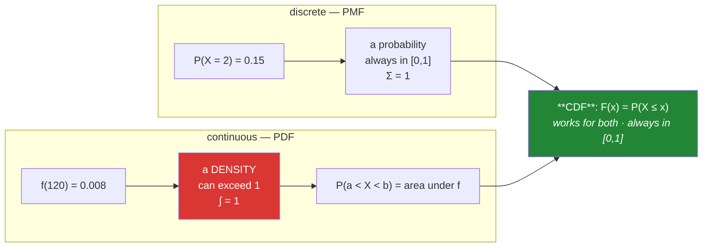

# Day 64 — PMF, PDF, CDF

**Phase 8 · Module 8** · ID: **ST-09** (probability mass, density and cumulative functions)

> **Yesterday:** conditioning, and the base-rate fallacy.
> **Today:** the three functions that describe a distribution — and the fact that trips everyone
> exactly once: **a probability density can exceed 1**, because a density is not a probability. The
> CDF is the one you will actually use, because every p-value in Phase 9 is a CDF lookup.
> **Tomorrow:** the named discrete distributions.

```bash
./m start 64 && ./m scaffold 64
```

**Time:** 100 minutes. **Request budget:** 0 model calls.

---

## §1 The story

Two kinds of random variable need two different tools.

**Discrete** — countable outcomes. The number of revisions before acceptance is 0, 1, 2, 3. Each has
a probability, and they sum to 1. That function is the **PMF**, the probability *mass* function, and
`PMF(2) = 0.15` means exactly what you think: a 15% chance of the value 2.

**Continuous** — uncountably many outcomes. Response latency could be 120 ms, or 120.0001 ms, or any
real number between. And here is the problem: `P(latency = exactly 120.000…) = 0`. Not "small" —
**zero**, because there are infinitely many values and they must sum to 1.

So a continuous distribution cannot assign probability to points. It assigns it to **intervals**, and
the function describing how densely probability is packed along the line is the **PDF**:



**A density is a rate, not a probability.** Its units are "probability per unit of x", so if x is
measured in something small, the density is large. A uniform distribution on `[0, 0.1]` has density
**10** everywhere — perfectly legal, because the *area* is `10 × 0.1 = 1`. You will see this in §3.

The **CDF** is `F(x) = P(X ≤ x)` and it is the one that behaves. It is always between 0 and 1, always
non-decreasing, and it works identically for discrete and continuous variables. Everything you want
comes from it:

- `P(X > x) = 1 − F(x)` — the **survival** function
- `P(a < X ≤ b) = F(b) − F(a)`
- The **quantile** function is its inverse: give it 0.95, get the value with 95% below it.

That last one is where Phase 9 lives. **A p-value is a CDF lookup.** A critical value is a quantile.
Getting comfortable with `cdf` and `ppf` today makes Days 69–71 mechanical rather than mysterious.

---

## §2 Setup — run this

```bash
mkdir -p days/day-64/lab
touch days/day-64/lab/distributions.py
```

`src/setu/stats.py` grows today. No new packages.

---

## §3 ST-09 — the three functions

`days/day-64/lab/distributions.py`:

```python
"""ST-09: PMF, PDF, CDF, and the quantile function."""

from __future__ import annotations

import numpy as np
from scipy import stats as sp

from setu.arrays import make_rng


def the_pmf_is_a_probability() -> None:
    outcomes = np.array([0, 1, 2, 3])
    pmf = np.array([0.5, 0.3, 0.15, 0.05])

    print(f"\n  {'x':>3} {'PMF':>7} {'CDF':>7}")
    for x, p, c in zip(outcomes, pmf, pmf.cumsum(), strict=True):
        print(f"  {x:>3} {p:>7.3f} {c:>7.3f}")

    print(f"\n  Σ PMF = {pmf.sum():.3f}   <- exactly 1")
    print(f"  P(X = 2)   = {pmf[2]:.3f}       <- a real probability")
    print(f"  P(X ≤ 2)   = {pmf[:3].sum():.3f}       <- the CDF")
    print(f"  P(X > 2)   = {1 - pmf[:3].sum():.3f}       <- survival = 1 − CDF")
    print("\n  For a discrete variable the CDF is a running total, and it STEPS.")


def the_pdf_is_not_a_probability() -> None:
    for width in (10.0, 1.0, 0.1, 0.01):
        dist = sp.uniform(loc=0, scale=width)
        density = dist.pdf(width / 2)
        print(f"  uniform on [0, {width:>5}]  density = {density:>8.2f}  "
              f"area = {density * width:.2f}")

    print("\n  ^ the density reaches 100 and the distribution is perfectly valid.")
    print("  A DENSITY IS A RATE: probability per unit of x. Narrow the support and")
    print("  the same total probability is packed into less room, so the height rises.")
    print("\n  The number that is always ≤ 1 is the AREA, never the height.")


def a_point_has_zero_probability() -> None:
    normal = sp.norm(loc=100, scale=15)

    print(f"\n  f(100)          = {normal.pdf(100):.6f}   <- a density")
    print(f"  P(X = 100)      = 0   exactly, always, for any continuous variable")

    for half_width in (10.0, 1.0, 0.1, 0.001, 0.0000001):
        area = normal.cdf(100 + half_width) - normal.cdf(100 - half_width)
        print(f"  P(100 ± {half_width:<9}) = {area:.10f}")

    print("\n  Shrink the interval and the probability goes to zero. That IS what")
    print("  'P(X = x) = 0' means — not 'impossible', but 'no width, no area'.")
    print("\n  Consequence: for a continuous variable, < and ≤ are interchangeable.")
    print(f"  P(X < 100) = {normal.cdf(100):.6f} = P(X ≤ 100). For DISCRETE they differ.")


def the_cdf_is_the_useful_one() -> None:
    normal = sp.norm(loc=100, scale=15)

    print(f"\n  P(X ≤ 85)        = {normal.cdf(85):.4f}")
    print(f"  P(X > 130)       = {normal.sf(130):.4f}   <- sf = 1 − cdf, but computed stably")
    print(f"  P(85 < X ≤ 115)  = {normal.cdf(115) - normal.cdf(85):.4f}")

    print(f"\n  1 - cdf  = {1 - normal.cdf(200):.6e}")
    print(f"  sf       = {normal.sf(200):.6e}")
    print("  ^ far into the tail, `1 - cdf` loses precision to floating point.")
    print("    `sf` computes the tail directly. Phase 9's p-values live out here.")


def the_quantile_function_is_the_inverse() -> None:
    normal = sp.norm(loc=100, scale=15)

    print(f"\n  {'p':>6} {'ppf(p)':>9}   meaning")
    for p in (0.025, 0.05, 0.5, 0.95, 0.975):
        print(f"  {p:>6.3f} {normal.ppf(p):>9.2f}   {p:.1%} of the distribution is below this")

    print(f"\n  round trip: cdf(ppf(0.9)) = {normal.cdf(normal.ppf(0.9)):.10f}")
    print("\n  ppf is where Phase 9's CRITICAL VALUES come from:")
    print(f"    two-sided 95% cutoffs = {sp.norm.ppf(0.025):.4f} and {sp.norm.ppf(0.975):.4f}")
    print("  Those are the ±1.96 you have seen quoted. It is just a quantile.")


def empirical_versus_theoretical() -> None:
    rng = make_rng(0)
    sample = rng.normal(100, 15, 2_000)
    theoretical = sp.norm(loc=100, scale=15)

    print(f"\n  {'x':>6} {'empirical CDF':>15} {'theoretical CDF':>17}")
    for x in (70, 85, 100, 115, 130):
        print(f"  {x:>6} {(sample <= x).mean():>15.4f} {theoretical.cdf(x):>17.4f}")

    print("\n  The empirical CDF is just 'what fraction of my data is ≤ x'. It needs no")
    print("  assumptions at all — which is why Day 39's ECDF plot was the honest one,")
    print("  and why Day 68's bootstrap can work without assuming a distribution.")

    ks = sp.kstest(sample, theoretical.cdf)
    print(f"\n  largest gap between them (KS statistic) = {ks.statistic:.4f}")


def histogram_to_density() -> None:
    rng = make_rng(1)
    sample = rng.normal(100, 15, 50_000)

    counts, edges = np.histogram(sample, bins=40)
    density, _ = np.histogram(sample, bins=40, density=True)
    width = edges[1] - edges[0]

    print(f"\n  bin width = {width:.3f}")
    print(f"  Σ counts          = {counts.sum():,}      <- the sample size")
    print(f"  Σ density         = {density.sum():.4f}   <- NOT 1")
    print(f"  Σ density × width = {(density * width).sum():.4f}   <- 1, because AREA")
    print(f"  peak density      = {density.max():.4f}")
    print(f"  theoretical peak  = {sp.norm(100, 15).pdf(100):.4f}")
    print("\n  `density=True` divides by (count × bin width), producing a rate that")
    print("  integrates to 1. Same lesson as §3.2, in Day 39's histogram.")


def discrete_versus_continuous_cdf() -> None:
    binomial = sp.binom(n=10, p=0.3)
    normal = sp.norm(loc=3, scale=1.45)

    print(f"\n  {'x':>5} {'binom cdf':>11} {'binom pmf':>11} {'normal cdf':>12}")
    for x in (2, 2.5, 3, 3.5):
        pmf = binomial.pmf(x) if float(x).is_integer() else 0.0
        print(f"  {x:>5} {binomial.cdf(x):>11.4f} {pmf:>11.4f} {normal.cdf(x):>12.4f}")

    print("\n  The binomial CDF is FLAT between integers and jumps at each one — the")
    print("  jump height is exactly the PMF. The normal CDF rises smoothly.")
    print(f"\n  ⚠️ discrete: P(X < 3) = {binomial.cdf(2):.4f} but P(X ≤ 3) = {binomial.cdf(3):.4f}")
    print("     Those differ by P(X=3). Off-by-one here is a real bug in Phase 9.")


def sampling_from_a_cdf() -> None:
    rng = make_rng(2)
    uniforms = rng.random(100_000)
    exponential = -np.log(1 - uniforms) / 0.5          # inverse CDF of Exp(rate=0.5)

    print(f"\n  inverse-transform sampling: feed U(0,1) through the inverse CDF")
    print(f"  mean of draws = {exponential.mean():.4f}   theoretical = {1 / 0.5:.4f}")
    print(f"  {'p':>6} {'empirical q':>13} {'theoretical q':>15}")
    for p in (0.25, 0.5, 0.75, 0.95):
        print(f"  {p:>6.2f} {np.quantile(exponential, p):>13.4f} "
              f"{sp.expon(scale=2).ppf(p):>15.4f}")

    print("\n  Any distribution can be sampled from uniform randomness plus its inverse")
    print("  CDF. That is how rng.normal() works underneath, and it is why the quantile")
    print("  function is not a curiosity.")


if __name__ == "__main__":
    the_pmf_is_a_probability()
    the_pdf_is_not_a_probability()
    a_point_has_zero_probability()
    the_cdf_is_the_useful_one()
    the_quantile_function_is_the_inverse()
    empirical_versus_theoretical()
    histogram_to_density()
    discrete_versus_continuous_cdf()
    sampling_from_a_cdf()
```

**Line by line:**

- `pmf.cumsum()` — the discrete CDF *is* the running total. It steps at each outcome, and the step
  height is the PMF.
- `the_pdf_is_not_a_probability` — **run this and look at the density column.** A uniform on
  `[0, 0.01]` has density **100**. That is legal and correct, because the *area* is
  `100 × 0.01 = 1`. **A density is probability per unit of x**, so narrowing the support raises the
  height. The number bounded by 1 is the area, never the height.
- `a_point_has_zero_probability` — shrink the interval and the probability goes to zero. That is what
  `P(X = x) = 0` means: not "impossible", but "no width, no area". The consequence matters — for a
  **continuous** variable `<` and `≤` are interchangeable, and for a **discrete** one they are not.
- `normal.sf(x)` versus `1 - normal.cdf(x)` — **at 200 the two disagree.** `1 - cdf` subtracts a
  number very close to 1 from 1 and loses most of its significant digits; `sf` computes the tail
  directly. Phase 9's p-values live in exactly that region, so this is not a micro-optimisation.
- `ppf` — the quantile function, the CDF's inverse. `ppf(0.975) = 1.96` for a standard normal, which
  is where the famous **±1.96** comes from. It is a quantile, not a magic constant, and Days 69–71
  use it constantly.
- `empirical_versus_theoretical` — the empirical CDF is just "what fraction of my data is ≤ x". **It
  assumes nothing**, which is why Day 39 called the ECDF the honest distribution plot and why Day 68's
  bootstrap works without assuming a shape.
- `histogram_to_density` — `Σ density` is **not** 1; `Σ density × width` is. Same lesson as the uniform
  demo, arriving inside a tool you have used since Day 39. `density=True` divides by
  `count × bin_width` to produce a rate.
- `discrete_versus_continuous_cdf` — **the binomial CDF is flat between integers and jumps at each
  one, by exactly the PMF.** And the warning is a genuine source of bugs: for discrete distributions
  `P(X < 3)` and `P(X ≤ 3)` differ by `P(X = 3)`, and picking the wrong one shifts a p-value.
- `sampling_from_a_cdf` — inverse-transform sampling. Feed uniform randomness through the inverse CDF
  and you get any distribution you like. That is how `rng.normal()` works underneath, and it is the
  reason the quantile function earns its place rather than being trivia.

---

## §4 Build brief

Extend `src/setu/stats.py`:

```python
def ecdf(values) -> dict:
    """TODO(me): the empirical CDF, assuming nothing about the distribution.

    {"x": sorted unique values, "p": P(X <= x) at each, "n": int}
    - p must reach exactly 1.0 at the largest value
    - handle ties: repeated values get ONE x entry with the cumulative p
    - nan-aware (drop and report); raise DataError on fewer than 1 value
    - JSON-serialisable
    """
    raise NotImplementedError


def ecdf_at(values, x) -> float:
    """TODO(me): P(X <= x) from the sample, for a scalar or array x.

    - below the minimum returns 0.0; at or above the maximum returns 1.0
    - must be <= semantics, not <
    - vectorised for an array x (use np.searchsorted, not a loop)
    """
    raise NotImplementedError


def tail_probability(dist, x, *, side: str = "upper") -> float:
    """TODO(me): a numerically stable tail probability from a scipy distribution.

    - side='upper' MUST use dist.sf(x), never 1 - dist.cdf(x)
    - side='lower' uses dist.cdf(x)
    - side='two' returns 2 * min(cdf, sf), clipped to at most 1.0
    - raise DataError on an unknown side
    Phase 9's p-values all come through here, which is why stability matters.
    """
    raise NotImplementedError


def critical_values(dist, *, alpha: float = 0.05, side: str = "two") -> dict:
    """TODO(me): the cutoffs for a given significance level.

    {"alpha", "side", "lower": float|None, "upper": float|None}
    - side='two': ppf(alpha/2) and ppf(1 - alpha/2)  -> ±1.96 for a standard normal
    - side='upper': lower is None, upper is ppf(1 - alpha)
    - side='lower': upper is None, lower is ppf(alpha)
    - alpha must be in (0, 1) exclusive; raise DataError otherwise
    Day 69 uses this; today it is just a quantile lookup.
    """
    raise NotImplementedError


def is_discrete(dist) -> bool:
    """TODO(me): True for a scipy discrete distribution (it has .pmf), False for continuous.

    This exists because the < versus <= distinction only matters for discrete
    distributions (§3), and Phase 9 needs to know which it is holding.
    """
    raise NotImplementedError


def density_check(values, *, bins: int = 40) -> dict:
    """TODO(me): confirm a histogram density integrates to 1 (§3).

    {"bin_width", "sum_density", "area", "peak_density"}
    - area = sum(density * bin_width) and must be 1.0 within 1e-9
    - raise DataError if it is not — that means the histogram was built without
      density=True, and the caller is about to plot counts as if they were a density
    """
    raise NotImplementedError
```

- `tail_probability` **mandating `sf`** for the upper tail is the day's numerical decision, and the
  docstring says why. Phase 9 computes p-values far into the tail, where `1 - cdf` has lost its digits.
- `ecdf_at` requiring `searchsorted` rather than a loop is Day 23's binary search finding a real use.
- `is_discrete` exists so Day 69 cannot silently apply continuous logic to a binomial.

---

## §5 The eval that must be able to fail

Add to `tests/test_stats.py`:

```python
from scipy import stats as sp

from setu.stats import (
    critical_values,
    density_check,
    ecdf,
    ecdf_at,
    is_discrete,
    tail_probability,
)


def test_ecdf_reaches_one():
    result = ecdf([3.0, 1.0, 2.0])
    assert result["p"][-1] == pytest.approx(1.0)
    assert result["x"] == [1.0, 2.0, 3.0]


def test_ecdf_collapses_ties():
    result = ecdf([1.0, 1.0, 1.0, 2.0])
    assert result["x"] == [1.0, 2.0]
    assert result["p"][0] == pytest.approx(0.75)


def test_ecdf_is_json_serialisable():
    import json

    json.dumps(ecdf([1.0, 2.0, 3.0]))


def test_ecdf_at_uses_less_than_or_equal():
    """<= semantics: the value itself counts."""
    assert ecdf_at([1.0, 2.0, 3.0, 4.0], 2.0) == pytest.approx(0.5)


def test_ecdf_at_outside_the_range():
    values = [1.0, 2.0, 3.0]
    assert ecdf_at(values, 0.0) == 0.0
    assert ecdf_at(values, 99.0) == 1.0


def test_ecdf_at_is_vectorised():
    values = list(make_rng(0).normal(size=1000))
    result = ecdf_at(values, np.array([-1.0, 0.0, 1.0]))
    assert len(result) == 3
    assert result[0] < result[1] < result[2]


def test_ecdf_approaches_the_true_cdf():
    sample = list(make_rng(1).normal(100, 15, 20_000))
    for x in (85, 100, 115):
        assert ecdf_at(sample, x) == pytest.approx(sp.norm(100, 15).cdf(x), abs=0.02)


def test_upper_tail_uses_sf_not_one_minus_cdf():
    """Far into the tail, 1 - cdf has lost its significant digits."""
    dist = sp.norm(loc=0, scale=1)
    stable = tail_probability(dist, 9.0, side="upper")
    naive = 1 - dist.cdf(9.0)
    assert stable > 0, "the tail probability underflowed to zero"
    assert stable == pytest.approx(dist.sf(9.0))
    assert naive == 0.0, "this is exactly the precision loss sf avoids"


def test_lower_tail():
    dist = sp.norm(loc=0, scale=1)
    assert tail_probability(dist, -1.96, side="lower") == pytest.approx(0.025, abs=1e-3)


def test_two_sided_doubles_the_smaller_tail():
    dist = sp.norm(loc=0, scale=1)
    assert tail_probability(dist, 1.96, side="two") == pytest.approx(0.05, abs=1e-3)


def test_two_sided_never_exceeds_one():
    dist = sp.norm(loc=0, scale=1)
    assert tail_probability(dist, 0.0, side="two") == pytest.approx(1.0)


def test_unknown_side_raises():
    with pytest.raises(DataError):
        tail_probability(sp.norm(), 1.0, side="sideways")


def test_critical_values_are_the_famous_ones():
    """±1.96 is a quantile, not a magic constant."""
    result = critical_values(sp.norm(loc=0, scale=1), alpha=0.05, side="two")
    assert result["lower"] == pytest.approx(-1.96, abs=0.01)
    assert result["upper"] == pytest.approx(1.96, abs=0.01)


def test_one_sided_critical_value():
    result = critical_values(sp.norm(loc=0, scale=1), alpha=0.05, side="upper")
    assert result["lower"] is None
    assert result["upper"] == pytest.approx(1.645, abs=0.01)


def test_critical_values_round_trip_through_the_cdf():
    dist = sp.norm(loc=100, scale=15)
    result = critical_values(dist, alpha=0.05, side="two")
    assert dist.cdf(result["upper"]) == pytest.approx(0.975)


@pytest.mark.parametrize("alpha", [0.0, 1.0, -0.1, 1.5])
def test_alpha_must_be_strictly_between_zero_and_one(alpha):
    with pytest.raises(DataError):
        critical_values(sp.norm(), alpha=alpha)


def test_is_discrete_distinguishes_the_two_kinds():
    assert is_discrete(sp.binom(n=10, p=0.3)) is True
    assert is_discrete(sp.poisson(mu=3)) is True
    assert is_discrete(sp.norm(loc=0, scale=1)) is False


def test_discrete_strict_and_non_strict_differ():
    """P(X < 3) and P(X <= 3) differ by P(X = 3) — an off-by-one bug in Phase 9."""
    binomial = sp.binom(n=10, p=0.3)
    assert binomial.cdf(3) - binomial.cdf(2) == pytest.approx(binomial.pmf(3))
    assert binomial.cdf(3) != binomial.cdf(2)


def test_continuous_strict_and_non_strict_agree():
    normal = sp.norm(loc=0, scale=1)
    assert normal.cdf(1.0) == pytest.approx(normal.cdf(1.0 - 1e-15))


def test_density_integrates_to_one():
    result = density_check(list(make_rng(2).normal(100, 15, 20_000)))
    assert result["area"] == pytest.approx(1.0, abs=1e-9)
    assert result["sum_density"] != pytest.approx(1.0), "density sums to 1/width, not 1"


def test_density_peak_matches_the_theoretical_pdf():
    result = density_check(list(make_rng(3).normal(100, 15, 200_000)), bins=60)
    assert result["peak_density"] == pytest.approx(sp.norm(100, 15).pdf(100), rel=0.1)


def test_a_pdf_may_exceed_one():
    """A density is a rate. The bound is on the area, not the height."""
    narrow = sp.uniform(loc=0, scale=0.01)
    assert narrow.pdf(0.005) == pytest.approx(100.0)
    assert narrow.cdf(0.01) == pytest.approx(1.0)
```

**Line by line:**

- `test_upper_tail_uses_sf_not_one_minus_cdf` — **the day's real assessment**, and its third assertion
  is the point: at `x = 9`, `1 - cdf` evaluates to **exactly 0.0** while `sf` returns a real number
  around 1e-19. A p-value computed the naive way in Phase 9 would be reported as zero, which is both
  wrong and unpublishable.
- `test_a_pdf_may_exceed_one` — a density of **100** with a CDF that still reaches exactly 1. This is
  the fact people meet once and misremember, and it is asserted rather than described.
- `test_density_integrates_to_one` — two assertions doing opposite jobs: the area *is* 1, and the sum
  is *not*. A test that only checked the area would pass on an implementation that confused the two.
- `test_discrete_strict_and_non_strict_differ` — proves the gap equals the PMF exactly. Off-by-one
  between `<` and `≤` on a discrete distribution is a real Phase 9 bug and it shifts p-values by a
  whole probability mass.
- `test_ecdf_collapses_ties` — three copies of 1.0 give **one** x entry at p = 0.75. An implementation
  that emits one point per observation produces a step function with zero-width steps, which breaks
  plotting and interpolation.
- `test_critical_values_are_the_famous_ones` — ±1.96 recovered from `ppf`, which demystifies it. And
  `test_critical_values_round_trip_through_the_cdf` proves the inverse relationship rather than
  trusting a remembered number.
- `test_ecdf_at_is_vectorised` — an array input returns an array. Day 23's `searchsorted` is what makes
  this O(log n) per query instead of a Python loop.

```bash
uv run python -m pytest tests/test_stats.py -v
```

---

## §6 Request budget

| Resource | Spent today |
|---|---|
| LLM calls | **0** |

---

## §7 Traps

- **Reading a PDF value as a probability.** It is a rate; it can exceed 1.
- **Expecting `Σ density = 1`.** The *area* is 1.
- **A histogram without `density=True` plotted against a PDF.** Different scales entirely.
- **`P(X = x)` for a continuous variable.** It is exactly zero.
- **`1 - cdf` in the tail.** Loses precision; can underflow to 0. Use `sf`.
- **`<` versus `≤` on a discrete distribution.** They differ by the PMF.
- **Treating ±1.96 as a constant.** It is `ppf(0.975)` for a standard normal, nothing more.
- **Using a normal quantile for a t-distribution.** Different distribution, different cutoff (Day 71).
- **An ECDF with one point per observation.** Collapse ties.
- **Forgetting the ECDF assumes nothing.** That is its whole advantage.

---

## §8 Verify before you code

Written **2026-08-21**:

- <https://docs.scipy.org/doc/scipy/tutorial/stats.html> — the frozen-distribution pattern
  (`sp.norm(loc=…, scale=…)`) used throughout this phase.
- <https://docs.scipy.org/doc/scipy/reference/generated/scipy.stats.rv_continuous.sf.html> — why `sf`
  exists rather than `1 - cdf`.
- <https://numpy.org/doc/stable/reference/generated/numpy.histogram.html> — what `density=True` divides by.
- <https://docs.scipy.org/doc/scipy/reference/generated/scipy.stats.ecdf.html> — SciPy's own ECDF,
  worth comparing against yours (Principle 2: build it first).

---

## §9 Say it in an interview

> "The one people meet once and misremember is that a probability density isn't a probability — it's
> probability per unit of x, so a uniform on a hundredth-wide interval has density one hundred, and
> that's perfectly valid because the *area* is one. What's bounded is the area, never the height. The
> function I actually reach for is the CDF, because everything comes from it: the survival function is
> one minus it, an interval is a difference of two, and a critical value is its inverse — ±1.96 is
> just `ppf(0.975)`, not a magic number. And there's a practical detail that matters in Phase 9: for
> upper-tail probabilities you use `sf` rather than `1 - cdf`, because far into the tail the
> subtraction loses every significant digit — at nine standard deviations `1 - cdf` returns exactly
> zero while `sf` gives you a real number. There's a test asserting both."

---

## §10 Done when

Tick [`CHECKLIST.md`](CHECKLIST.md), then `./m check && ./m done 64`.
