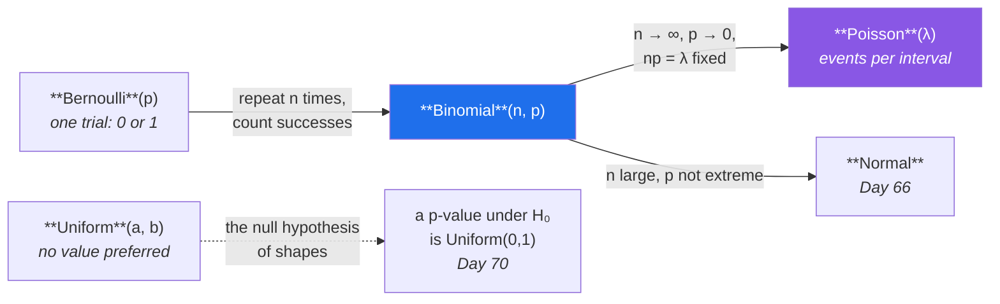

# Day 65 — Bernoulli, binomial, Poisson, uniform

**Phase 8 · Module 8** · IDs: **ST-10** (Bernoulli and binomial), **ST-11** (Poisson and uniform)

> **Yesterday:** PMF, PDF, CDF, and why `sf` beats `1 − cdf`.
> **Today:** four named distributions — but the useful skill is not memorising formulas, it is
> **recognising which generative story your data came from.** Each one is a description of a process,
> and picking the wrong one is picking the wrong model.
> **Tomorrow:** the normal distribution.

```bash
./m start 65 && ./m scaffold 65
```

**Time:** 110 minutes. **Request budget:** 0 model calls.

---

## §1 The story

A named distribution is a **generative story**. If your data was produced by that story, the
distribution describes it and you get its mathematics for free. If it was not, you are fitting the
wrong shape and every conclusion inherits the error.

Four stories, and they are related rather than separate:



- **Bernoulli** — one trial, two outcomes. Did this paper get accepted? Did this request fail? The
  atom everything else is built from, and `E[X] = p`.
- **Binomial** — `n` independent Bernoulli trials with the *same* `p`; count the successes. Out of 200
  submissions, how many were accepted? **The two assumptions are the whole risk**: independence, and
  constant `p`.
- **Poisson** — events arriving in a fixed interval when they are rare and independent. Papers per
  day, errors per hour, arrivals per minute. Its signature is `variance = mean`, which is a testable
  claim about real data and is usually **false**.
- **Uniform** — every value equally likely. Rarer in nature than people expect, but it is the shape of
  a p-value when the null hypothesis is true (Day 70), which makes it quietly central to Phase 9.

The practical skill today is **checking**, not fitting. Real count data is usually *overdispersed* —
variance well above the mean — because the arrival rate is not actually constant. Real binomial data
usually has *correlated* trials. Knowing that your data fails the assumption is worth more than
computing a parameter as if it did not.

---

## §2 Setup — run this

```bash
mkdir -p days/day-65/lab
touch days/day-65/lab/named.py
```

`src/setu/stats.py` grows today. No new packages.

---

## §3 ST-10 / ST-11 — four stories

`days/day-65/lab/named.py`:

```python
"""ST-10 / ST-11: four generative stories, and how to check them."""

from __future__ import annotations

import math

import numpy as np
from scipy import stats as sp

from setu.arrays import make_rng


def bernoulli_is_the_atom() -> None:
    p = 0.3
    dist = sp.bernoulli(p)

    print(f"\n  P(X=0) = {dist.pmf(0):.2f}   P(X=1) = {dist.pmf(1):.2f}")
    print(f"  E[X]   = {dist.mean():.2f}   <- just p")
    print(f"  Var[X] = {dist.var():.4f}   <- p(1−p), maximal at p=0.5")

    print(f"\n  {'p':>5} {'variance':>10}")
    for candidate in (0.01, 0.1, 0.3, 0.5, 0.7, 0.99):
        print(f"  {candidate:>5.2f} {candidate * (1 - candidate):>10.4f}")
    print("\n  A coin is most unpredictable at p=0.5 and nearly deterministic at the ends.")
    print("  That is why Day 78's imbalanced data is hard: at p=0.01 almost every draw")
    print("  is the same, so 'always predict 0' scores 99%.")


def binomial_from_scratch() -> None:
    n, p, k = 10, 0.3, 3

    combinations = math.comb(n, k)
    by_hand = combinations * p**k * (1 - p) ** (n - k)

    print(f"\n  P(exactly {k} of {n} successes), p={p}")
    print(f"    C({n},{k})       = {combinations}      <- how many orderings")
    print(f"    p^k             = {p ** k:.6f}")
    print(f"    (1-p)^(n-k)     = {(1 - p) ** (n - k):.6f}")
    print(f"    product         = {by_hand:.6f}")
    print(f"  scipy             = {sp.binom(n, p).pmf(k):.6f}")

    print("\n  The C(n,k) factor is the ONLY interesting part: any one specific sequence")
    print("  has probability p^k(1-p)^(n-k), and there are C(n,k) sequences with k successes.")

    dist = sp.binom(n, p)
    print(f"\n  E[X] = {dist.mean():.2f} = n·p")
    print(f"  Var  = {dist.var():.3f} = n·p(1−p)")


def the_two_assumptions() -> None:
    rng = make_rng(0)
    n, p, trials = 50, 0.3, 20_000

    independent = rng.binomial(n, p, trials)

    correlated = np.empty(trials)
    for i in range(trials):
        local_p = rng.beta(3, 7)              # p varies between batches
        correlated[i] = rng.binomial(n, local_p)

    print(f"\n  {'':<22} {'mean':>8} {'variance':>10} {'binomial var':>14}")
    for label, draws in (("independent, fixed p", independent), ("p varies by batch", correlated)):
        print(f"  {label:<22} {draws.mean():>8.2f} {draws.var(ddof=1):>10.2f} "
              f"{n * p * (1 - p):>14.2f}")

    print("\n  Same mean. The second has FAR more variance than a binomial allows,")
    print("  because p was not constant. Overdispersion is the fingerprint of a")
    print("  broken assumption, and it is visible without any test.")


def poisson_is_a_limit() -> None:
    lam = 3.0
    print(f"\n  Binomial(n, λ/n) converging to Poisson(λ={lam}) at k=2:")
    print(f"  {'n':>8} {'binomial P(X=2)':>18}")
    for n in (10, 100, 1_000, 100_000):
        print(f"  {n:>8} {sp.binom(n, lam / n).pmf(2):>18.8f}")
    print(f"  {'Poisson':>8} {sp.poisson(lam).pmf(2):>18.8f}")

    print("\n  Many trials, each very unlikely, expected count fixed. That is the story:")
    print("  'how many rare independent events landed in this interval'.")


def the_poisson_signature() -> None:
    rng = make_rng(1)
    lam = 4.0

    true_poisson = rng.poisson(lam, 50_000)
    bursty = rng.poisson(rng.gamma(2, lam / 2, 50_000))     # rate itself varies

    print(f"\n  {'':<20} {'mean':>8} {'variance':>10} {'var/mean':>10}")
    for label, draws in (("true Poisson", true_poisson), ("bursty (varying λ)", bursty)):
        print(f"  {label:<20} {draws.mean():>8.3f} {draws.var(ddof=1):>10.3f} "
              f"{draws.var(ddof=1) / draws.mean():>10.3f}")

    print("\n  A Poisson has variance = mean, so var/mean ≈ 1. That ratio is a FREE TEST.")
    print("  The bursty series has the same mean and roughly double the variance —")
    print("  it is overdispersed, and a Poisson model would understate its uncertainty.")
    print("\n  Real counts are usually overdispersed: web traffic, error rates, citations.")
    print("  Something makes the rate vary, and pretending otherwise is optimistic.")


def poisson_intervals_scale() -> None:
    per_day = 3.0
    print(f"\n  λ = {per_day} papers/day. Rescale the WINDOW and λ scales with it:")
    for hours, label in ((1, "1 hour"), (24, "1 day"), (24 * 7, "1 week")):
        lam = per_day * hours / 24
        dist = sp.poisson(lam)
        print(f"    {label:<8} λ={lam:>6.2f}  P(zero) = {dist.pmf(0):.4f}  "
              f"P(>2×λ) = {dist.sf(2 * lam):.4f}")

    print("\n  ⚠️ λ is tied to an INTERVAL. 'λ = 3' means nothing without 'per what'.")
    print("     Reporting a rate without its window is the most common Poisson error.")


def uniform_is_rarer_than_you_think() -> None:
    rng = make_rng(2)
    dist = sp.uniform(loc=10, scale=20)          # NOTE: loc and SCALE, not low and high

    print(f"\n  scipy uniform(loc=10, scale=20) covers [10, 30]")
    print(f"    mean = {dist.mean():.2f}   (a+b)/2 = {(10 + 30) / 2}")
    print(f"    var  = {dist.var():.3f}   (b−a)²/12 = {(30 - 10) ** 2 / 12:.3f}")
    print(f"    pdf  = {dist.pdf(20):.4f}   1/(b−a) = {1 / 20:.4f}  <- flat everywhere")

    print("\n  ⚠️ scipy uses loc/scale, NOT low/high. uniform(10, 20) is [10, 30], not [10, 20].")
    print("     numpy's rng.uniform(10, 20) IS [10, 20]. The two libraries disagree.")

    p_values = np.array([sp.ttest_ind(rng.normal(size=30), rng.normal(size=30)).pvalue
                         for _ in range(3_000)])
    print(f"\n  3,000 t-tests between samples from the SAME distribution:")
    print(f"    fraction p < 0.05 = {(p_values < 0.05).mean():.4f}   <- should be ≈ 0.05")
    print(f"    fraction p < 0.50 = {(p_values < 0.50).mean():.4f}   <- should be ≈ 0.50")
    print("\n  Under a true null hypothesis, p-values are UNIFORM(0,1). That is the")
    print("  foundation of Day 70 and the reason 5% of honest tests 'find' something.")


def choosing_by_the_story() -> None:
    rows = [
        ("did this one request fail?", "Bernoulli", "one trial, two outcomes"),
        ("how many of 200 submissions accepted?", "Binomial", "fixed n, same p, independent"),
        ("how many errors this hour?", "Poisson", "rare independent events per interval"),
        ("how many errors, but they cluster?", "Neg. binomial", "overdispersed — Poisson fails"),
        ("a randomly chosen timestamp in a day", "Uniform", "no moment preferred"),
        ("a p-value when H₀ is true", "Uniform(0,1)", "Day 70"),
    ]
    print(f"\n  {'question':<40} {'distribution':<15} {'because'}")
    for question, dist, reason in rows:
        print(f"  {question:<40} {dist:<15} {reason}")
    print("\n  Read the middle column as a claim about HOW THE DATA WAS MADE.")
    print("  If the story is wrong, the parameters are precise answers to the wrong question.")


def fitting_and_checking() -> None:
    rng = make_rng(3)
    counts = rng.poisson(rng.gamma(2, 2, 5_000))     # overdispersed on purpose

    lam_hat = counts.mean()
    print(f"\n  fitted λ = mean = {lam_hat:.3f}")
    print(f"  observed variance = {counts.var(ddof=1):.3f}")
    print(f"  dispersion ratio  = {counts.var(ddof=1) / lam_hat:.3f}")

    observed = np.bincount(counts, minlength=15)[:15]
    expected = sp.poisson(lam_hat).pmf(np.arange(15)) * len(counts)
    print(f"\n  {'k':>3} {'observed':>10} {'expected':>10}")
    for k in range(8):
        print(f"  {k:>3} {observed[k]:>10} {expected[k]:>10.1f}")

    print("\n  Too many zeros AND too many large values — the classic overdispersion")
    print("  signature. Fitting λ succeeded; the MODEL is still wrong.")
    print("  Day 73's chi-square goodness-of-fit turns this eyeball check into a test.")


if __name__ == "__main__":
    bernoulli_is_the_atom()
    binomial_from_scratch()
    the_two_assumptions()
    poisson_is_a_limit()
    the_poisson_signature()
    poisson_intervals_scale()
    uniform_is_rarer_than_you_think()
    choosing_by_the_story()
    fitting_and_checking()
```

**Line by line:**

- `p(1-p)` maximal at 0.5 — **and the connection matters.** At `p = 0.01` the variance is tiny because
  almost every draw is the same, which is exactly why Day 78's imbalanced classification is hard:
  "always predict 0" scores 99% and learns nothing.
- `math.comb(n, k)` — **the only interesting part of the binomial formula.** Any *specific* sequence of
  k successes has probability `p^k(1−p)^(n−k)`; the combination counts how many such sequences exist.
  Once you see that, the formula stops needing memorisation.
- `the_two_assumptions` — **run it and compare the variance columns.** Same mean, but the batch where
  `p` varied has far more variance than a binomial permits. **Overdispersion is the fingerprint of a
  broken assumption**, and you can see it without any test.
- `poisson_is_a_limit` — the binomial converges to the Poisson as `n` grows with `λ = np` held fixed.
  That is the derivation, and it tells you the story: many trials, each very unlikely, expected count
  fixed.
- `the_poisson_signature` — **`variance = mean` is a free test.** Compute `var/mean`; if it is not
  near 1, your data is not Poisson. The bursty series has the same mean and double the variance, and a
  Poisson model of it would **understate the uncertainty** — which is the dangerous direction to be
  wrong in.
- `poisson_intervals_scale` — **λ is tied to an interval.** "λ = 3" is meaningless without "per what",
  and rescaling the window rescales λ proportionally. Reporting a rate without its window is the most
  common Poisson mistake in practice.
- `uniform_is_rarer_than_you_think` — **note the API trap.** SciPy's `uniform(loc, scale)` covers
  `[loc, loc+scale]`, so `uniform(10, 20)` is `[10, 30]`. NumPy's `rng.uniform(10, 20)` is `[10, 20]`.
  **The two libraries disagree**, and mixing them silently produces the wrong range.
- The 3,000 t-tests — samples from the **same** distribution, and 5% of them return `p < 0.05`. **Under
  a true null, p-values are Uniform(0,1)**, which is why 5% of honest tests "find" something and why
  Day 74's multiple-comparisons problem exists at all.
- `choosing_by_the_story` — **read the middle column as a claim about how the data was made.** Fitting
  a parameter always succeeds; it does not tell you the story was right.
- `fitting_and_checking` — the fitted λ is fine and the model is still wrong: too many zeros *and* too
  many large values, the classic overdispersion signature. Day 73 turns this eyeball comparison into a
  chi-square goodness-of-fit test.

---

## §4 Build brief

Extend `src/setu/stats.py`:

```python
DISTRIBUTIONS = {"bernoulli", "binomial", "poisson", "uniform"}


def fit_distribution(values, *, kind: str) -> dict:
    """TODO(me): estimate parameters AND report whether the story holds.

    {"kind", "params": {...}, "n", "checks": {...}, "warnings": [...]}
    - bernoulli: p = mean; raise DataError unless every value is 0 or 1
    - binomial: requires an explicit `n_trials` in params — it CANNOT be estimated
      from counts alone; raise DataError telling the caller to supply it
    - poisson: lam = mean; raise DataError on any negative or non-integer value
    - uniform: low = min, high = max
    - `checks` must include dispersion_ratio for poisson/binomial (variance / mean)
    - `warnings` must fire when the dispersion ratio is outside [0.7, 1.3], naming the
      ratio and saying what it implies (over- or under-dispersed)
    - raise DataError on an unknown kind, listing DISTRIBUTIONS
    """
    raise NotImplementedError


def dispersion_ratio(counts) -> dict:
    """TODO(me): variance / mean, with a verdict. PURE.

    {"mean", "variance", "ratio", "verdict": "underdispersed"|"poisson-like"|"overdispersed"}
    - raise DataError on a mean of zero (the ratio is undefined)
    - raise DataError on any negative value (counts cannot be negative)
    - this is §3's free test, and Day 73 makes it formal
    """
    raise NotImplementedError


def goodness_of_fit_table(counts, *, kind: str = "poisson", max_k: int = 15) -> dict:
    """TODO(me): observed vs expected frequencies, for eyeballing before testing.

    {"k": [...], "observed": [...], "expected": [...], "largest_gap_at": int}
    - fit the parameter from the data, then compute expected = pmf(k) * n
    - largest_gap_at is the k with the biggest |observed − expected|
    - Day 73 feeds this straight into a chi-square test, so keep the shape stable
    - raise DataError if fewer than 5 expected counts exceed 5 (the chi-square
      assumption Day 73 will need) — warn rather than raise, in `warnings`
    """
    raise NotImplementedError


def binomial_interval(k: int, n: int, *, confidence: float = 0.95, method: str = "wilson") -> dict:
    """TODO(me): a confidence interval for a proportion.

    {"estimate", "low", "high", "method"}
    - method='wilson' is the DEFAULT and the right one: the naive normal approximation
      gives intervals outside [0,1] and collapses to zero width when k=0 or k=n
    - method='normal' is provided so a test can DEMONSTRATE that failure
    - raise DataError unless 0 <= k <= n and n >= 1
    - the interval must always lie within [0, 1]
    Day 68 generalises this; today it is the proportion case.
    """
    raise NotImplementedError
```

- `fit_distribution` **refusing to guess `n_trials`** for a binomial is a real correctness point: given
  only counts, `n` and `p` are not identifiable, and a library that silently picks `n = max(counts)` is
  inventing information.
- The dispersion warning turns §3's observation into something the caller sees rather than something
  they were supposed to remember.
- `binomial_interval` defaulting to **Wilson** is the day's design decision, and `method='normal'`
  exists precisely so a test can show why the default is not the textbook formula.

---

## §5 The eval that must be able to fail

Add to `tests/test_stats.py`:

```python
from setu.stats import (
    DISTRIBUTIONS,
    binomial_interval,
    dispersion_ratio,
    fit_distribution,
    goodness_of_fit_table,
)


def test_bernoulli_p_is_the_mean():
    result = fit_distribution([0, 1, 1, 0, 1], kind="bernoulli")
    assert result["params"]["p"] == pytest.approx(0.6)


def test_bernoulli_rejects_non_binary_values():
    with pytest.raises(DataError):
        fit_distribution([0, 1, 2], kind="bernoulli")


def test_binomial_refuses_to_invent_n():
    """Given only counts, n and p are not identifiable."""
    with pytest.raises(DataError) as info:
        fit_distribution([3, 5, 4], kind="binomial")
    assert "n_trials" in str(info.value)


def test_poisson_lambda_is_the_mean():
    counts = list(make_rng(0).poisson(4.0, 20_000))
    result = fit_distribution(counts, kind="poisson")
    assert result["params"]["lam"] == pytest.approx(4.0, abs=0.1)


def test_poisson_rejects_negative_counts():
    with pytest.raises(DataError):
        fit_distribution([1, 2, -1], kind="poisson")


def test_poisson_rejects_non_integers():
    with pytest.raises(DataError):
        fit_distribution([1.0, 2.5, 3.0], kind="poisson")


def test_a_true_poisson_gets_no_dispersion_warning():
    counts = list(make_rng(1).poisson(4.0, 20_000))
    assert not fit_distribution(counts, kind="poisson")["warnings"]


def test_overdispersed_counts_are_flagged():
    """Fitting succeeds; the model is still wrong."""
    rng = make_rng(2)
    counts = list(rng.poisson(rng.gamma(2, 2, 20_000)))
    result = fit_distribution(counts, kind="poisson")
    assert result["warnings"], "overdispersion was not reported"
    assert any("disper" in w.lower() for w in result["warnings"])


def test_the_dispersion_ratio_is_the_free_test():
    poisson_like = list(make_rng(3).poisson(5.0, 20_000))
    assert dispersion_ratio(poisson_like)["verdict"] == "poisson-like"


def test_bursty_counts_are_overdispersed():
    rng = make_rng(4)
    bursty = list(rng.poisson(rng.gamma(2, 2.5, 20_000)))
    result = dispersion_ratio(bursty)
    assert result["ratio"] > 1.3
    assert result["verdict"] == "overdispersed"


def test_underdispersed_counts_are_detected():
    """A near-constant count has variance well below its mean."""
    result = dispersion_ratio([5, 5, 5, 5, 6, 5, 5, 4, 5, 5])
    assert result["verdict"] == "underdispersed"


def test_dispersion_rejects_a_zero_mean():
    with pytest.raises(DataError):
        dispersion_ratio([0, 0, 0])


def test_dispersion_rejects_negative_counts():
    with pytest.raises(DataError):
        dispersion_ratio([1, 2, -3])


def test_unknown_distribution_lists_the_known_ones():
    with pytest.raises(DataError) as info:
        fit_distribution([1, 2, 3], kind="gaussian")
    message = str(info.value)
    assert any(name in message for name in DISTRIBUTIONS)


def test_goodness_of_fit_matches_on_real_poisson_data():
    counts = list(make_rng(5).poisson(4.0, 20_000))
    table = goodness_of_fit_table(counts)
    observed = np.array(table["observed"], dtype=float)
    expected = np.array(table["expected"], dtype=float)
    relative = np.abs(observed - expected) / np.maximum(expected, 1)
    assert relative[:6].max() < 0.15, "a true Poisson should match its own expectation"


def test_goodness_of_fit_diverges_on_overdispersed_data():
    rng = make_rng(6)
    counts = list(rng.poisson(rng.gamma(2, 2, 20_000)))
    table = goodness_of_fit_table(counts)
    observed = np.array(table["observed"], dtype=float)
    expected = np.array(table["expected"], dtype=float)
    assert observed[0] > expected[0] * 1.3, "overdispersion should show excess zeros"


def test_goodness_of_fit_is_json_serialisable():
    import json

    json.dumps(goodness_of_fit_table(list(make_rng(7).poisson(3.0, 500))))


def test_wilson_interval_contains_the_estimate():
    result = binomial_interval(30, 100)
    assert result["low"] < result["estimate"] < result["high"]
    assert result["estimate"] == pytest.approx(0.3)


def test_wilson_stays_inside_zero_and_one():
    for k, n in ((0, 10), (10, 10), (1, 1000), (999, 1000)):
        result = binomial_interval(k, n)
        assert 0.0 <= result["low"] <= result["high"] <= 1.0, f"escaped [0,1] at k={k}, n={n}"


def test_the_normal_approximation_fails_where_wilson_does_not():
    """This is why Wilson is the default."""
    naive = binomial_interval(0, 20, method="normal")
    wilson = binomial_interval(0, 20, method="wilson")
    assert naive["high"] == pytest.approx(0.0, abs=1e-9), (
        "the normal interval collapses to zero width at k=0"
    )
    assert wilson["high"] > 0.1, "Wilson gives a sensible upper bound with zero successes"


def test_the_interval_narrows_with_more_data():
    small = binomial_interval(30, 100)
    large = binomial_interval(3000, 10_000)
    assert (large["high"] - large["low"]) < (small["high"] - small["low"]) / 5


@pytest.mark.parametrize(("k", "n"), [(-1, 10), (11, 10), (5, 0)])
def test_binomial_interval_rejects_impossible_counts(k, n):
    with pytest.raises(DataError):
        binomial_interval(k, n)


def test_uniform_fit_uses_min_and_max():
    result = fit_distribution([2.0, 5.0, 3.0, 9.0], kind="uniform")
    assert result["params"]["low"] == 2.0
    assert result["params"]["high"] == 9.0
```

**Line by line:**

- `test_overdispersed_counts_are_flagged` — **the day's real assessment.** Fitting λ succeeds
  perfectly; the point is that the function must **say the model is wrong anyway**. A fitter that
  silently returns a parameter has given you a precise answer to a question your data does not support.
- `test_binomial_refuses_to_invent_n` — given only counts, `n` and `p` are not identifiable. A library
  that picks `n = max(counts)` is fabricating information, and the error message names the argument the
  caller must supply.
- `test_the_normal_approximation_fails_where_wilson_does_not` — **the demonstration that justifies the
  default.** With zero successes out of twenty, the textbook normal interval is `[0, 0]` — claiming
  certainty that the true rate is exactly zero. Wilson gives a sensible upper bound. Providing
  `method='normal'` purely so a test can show its failure is the honest way to make the case.
- `test_wilson_stays_inside_zero_and_one` — four boundary cases including both extremes. A proportion
  interval escaping `[0, 1]` is nonsense on its face and the normal approximation does it routinely.
- `test_underdispersed_counts_are_detected` — the *other* direction. A verdict function that only ever
  says "poisson-like" or "overdispersed" passes the two obvious tests and fails this one.
- `test_goodness_of_fit_diverges_on_overdispersed_data` — asserts specifically **excess zeros**, which
  is the recognisable signature rather than a vague mismatch.
- `test_poisson_rejects_non_integers` — counts are integers. Accepting `2.5` means someone has passed
  a rate or an average where a count belongs, and it is worth catching at the boundary.

```bash
uv run python -m pytest tests/test_stats.py -v
```

---

## §6 Request budget

| Resource | Spent today |
|---|---|
| LLM calls | **0** |

---

## §7 Traps

- **Fitting a distribution without checking the story.** Fitting always succeeds.
- **Assuming counts are Poisson.** Real counts are usually overdispersed.
- **Reporting λ without its interval.** "λ = 3" per what?
- **Binomial with non-constant `p`.** Overdispersion, and understated uncertainty.
- **Binomial with correlated trials.** Same failure.
- **Estimating `n` from counts.** Not identifiable. Ask the caller.
- **`sp.uniform(10, 20)` meaning `[10, 20]`.** It is `[10, 30]`. NumPy disagrees with SciPy.
- **The normal approximation for a proportion.** Escapes `[0,1]`; collapses at `k = 0`.
- **Forgetting p-values are uniform under H₀.** That is why 5% of honest tests "find" something.
- **Ignoring `variance/mean`.** It is a free model check that costs one line.

---

## §8 Verify before you code

Written **2026-08-21**:

- <https://docs.scipy.org/doc/scipy/reference/generated/scipy.stats.uniform.html> — confirm the
  `loc`/`scale` parameterisation, which differs from NumPy's.
- <https://docs.scipy.org/doc/scipy/reference/generated/scipy.stats.poisson.html> — `mu` is λ.
- <https://docs.scipy.org/doc/scipy/reference/generated/scipy.stats.binomtest.html> — SciPy's own
  proportion interval, worth comparing against yours.
- <https://numpy.org/doc/stable/reference/random/generated/numpy.random.Generator.binomial.html> —
  the sampling API.

---

## §9 Say it in an interview

> "A named distribution is a claim about how the data was generated, not a curve you fit. So the
> useful skill is checking the story rather than estimating the parameter — fitting always succeeds.
> For counts the free test is variance over mean: a Poisson has variance equal to its mean, so if that
> ratio isn't near one, your data isn't Poisson. And real counts almost never are, because something
> makes the arrival rate vary — which matters because a Poisson model of overdispersed data
> *understates* the uncertainty, and that's the dangerous direction. My fitter returns the parameter
> and a dispersion warning together. The other thing I'd flag is proportion intervals: the textbook
> normal approximation gives you `[0, 0]` for zero successes out of twenty, claiming certainty. I
> default to Wilson and keep the normal method available purely so a test can demonstrate that
> failure."

---

## §10 Done when

Tick [`CHECKLIST.md`](CHECKLIST.md), then `./m check && ./m done 65`.
