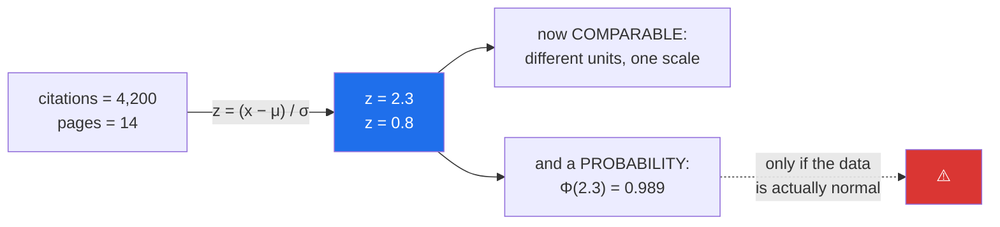

# Day 66 — The normal distribution, z-scores, and standardisation

**Phase 8 · Module 8** · IDs: **ST-12** (the normal distribution, the empirical rule), **ST-13** (z-statistic, standardisation)

> **Yesterday:** four named distributions, and checking the story rather than fitting a curve.
> **Today:** the one everyone assumes — and the honest account of when that assumption is earned.
> Then z-scores, which is Day 22's `standardise` meeting its statistical meaning, **including the
> leakage rule**.
> **Tomorrow:** the Central Limit Theorem, which explains why the normal turns up so often.

```bash
./m start 66 && ./m scaffold 66
```

**Time:** 110 minutes. **Request budget:** 0 model calls.

---

## §1 The story

The normal distribution is defined by exactly two numbers — a mean and a standard deviation — and from
those two everything follows. That is a strong claim, and it is the reason so much statistical
machinery assumes it.

The **empirical rule** is worth committing to memory because it turns a z-score into an instinct:

| Within | Contains |
|---|---|
| ±1σ | ~68% |
| ±2σ | ~95% |
| ±3σ | ~99.7% |
| ±4σ | ~99.994% |

So a value 3σ from the mean happens about 3 times in 1,000. A value at 5σ happens about once in 3.5
million — which is why "five sigma" is the physics standard for a discovery.

A **z-score** re-expresses a value as "how many standard deviations from the mean":



Two things worth separating carefully, because they get conflated.

**Standardising always works.** Subtracting the mean and dividing by the sd gives you mean 0 and sd 1
for *any* distribution. It makes different variables comparable, and Day 80's scaler and Day 103's
KNN both need it. It changes nothing about the shape.

**Reading a probability off a z-score only works if the data is normal.** `z = 3` means "1 in 740" for
a normal distribution and something very different for a heavy-tailed one. Day 61's kurtosis was
measuring exactly this, and §3 will show a z-score of 3 that is entirely unremarkable.

And the honest part: **most real data is not normal.** Citations, income, latency, file sizes are all
right-skewed (Day 61). What *is* often normal is the **sampling distribution of a mean** — and that is
tomorrow's theorem, and the reason the normal earns its central place despite raw data rarely
following it.

---

## §2 Setup — run this

```bash
mkdir -p days/day-66/lab
touch days/day-66/lab/normal.py
```

`src/setu/stats.py` grows today. No new packages.

---

## §3 ST-12 / ST-13 — the normal, and z

`days/day-66/lab/normal.py`:

```python
"""ST-12 / ST-13: the normal distribution, the empirical rule, and z-scores."""

from __future__ import annotations

import numpy as np
from scipy import stats as sp

from setu.arrays import make_rng


def the_empirical_rule() -> None:
    dist = sp.norm(loc=0, scale=1)

    print(f"\n  {'within':>8} {'exact':>10} {'1 in':>12}")
    for k in (1, 2, 3, 4, 5):
        inside = dist.cdf(k) - dist.cdf(-k)
        outside = 1 - inside
        print(f"  ±{k}σ{'':>4} {inside:>10.6f} {1 / outside:>12,.0f}")

    print("\n  Memorise 68 / 95 / 99.7. They convert a z-score into an instinct.")
    print("  And note the last row: 5σ is a 1-in-3.5-million event, which is why")
    print("  physics uses it as a discovery threshold.")

    rng = make_rng(0)
    sample = rng.normal(0, 1, 500_000)
    print(f"\n  empirical check on 500,000 draws:")
    for k in (1, 2, 3):
        print(f"    ±{k}σ: {(np.abs(sample) < k).mean():.4f}")


def two_numbers_determine_everything() -> None:
    print(f"\n  {'μ':>6} {'σ':>6} {'P(X<0)':>10} {'median':>8} {'P(X>μ+σ)':>10}")
    for mu, sigma in ((0, 1), (100, 15), (100, 30), (-5, 2)):
        dist = sp.norm(loc=mu, scale=sigma)
        print(f"  {mu:>6} {sigma:>6} {dist.cdf(0):>10.4f} {dist.median():>8.1f} "
              f"{dist.sf(mu + sigma):>10.4f}")

    print("\n  P(X > μ+σ) is 0.1587 in every row — the shape is IDENTICAL, only")
    print("  the location and scale differ. That is what 'two parameters' means.")
    print("  It is also why standardising loses nothing: z carries all the information.")


def z_scores_make_things_comparable() -> None:
    citations = {"mu": 1200.0, "sigma": 900.0, "value": 4200.0}
    pages = {"mu": 9.0, "sigma": 3.0, "value": 14.0}

    print(f"\n  {'variable':<12} {'value':>8} {'μ':>8} {'σ':>7} {'z':>7} {'percentile':>12}")
    for name, d in (("citations", citations), ("pages", pages)):
        z = (d["value"] - d["mu"]) / d["sigma"]
        print(f"  {name:<12} {d['value']:>8.0f} {d['mu']:>8.0f} {d['sigma']:>7.0f} "
              f"{z:>7.2f} {sp.norm.cdf(z):>12.4f}")

    print("\n  4,200 citations and 14 pages are not comparable. z = 3.33 and z = 1.67 are.")
    print("  The paper is far more unusual in citations than in length.")
    print("\n  ⚠️ The percentile column ASSUMES normality. §3.4 shows what that costs.")


def when_the_percentile_lies() -> None:
    rng = make_rng(1)
    n = 200_000
    normal = rng.normal(0, 1, n)
    heavy = rng.standard_t(df=3, size=n)
    heavy = heavy / heavy.std(ddof=1)
    skewed = rng.lognormal(0, 1, n)
    skewed = (skewed - skewed.mean()) / skewed.std(ddof=1)

    print(f"\n  all three standardised to mean 0, sd 1. Fraction beyond z = 3:")
    print(f"  {'':<12} {'P(z>3) actual':>16} {'normal says':>14} {'ratio':>8}")
    theoretical = sp.norm.sf(3)
    for name, values in (("normal", normal), ("heavy-tail", heavy), ("right-skew", skewed)):
        actual = (values > 3).mean()
        print(f"  {name:<12} {actual:>16.5f} {theoretical:>14.5f} "
              f"{actual / theoretical:>8.1f}x")

    print("\n  For the heavy-tailed and skewed data a z of 3 is FAR more common than")
    print("  the normal predicts. Calling it 'a 1-in-740 event' would be badly wrong.")
    print("\n  Standardising worked fine on all three. Only the PROBABILITY reading broke.")


def checking_normality() -> None:
    rng = make_rng(2)
    normal = rng.normal(100, 15, 5_000)
    skewed = rng.lognormal(4, 0.6, 5_000)

    print(f"\n  {'':<10} {'skew':>7} {'kurtosis':>10} {'shapiro p':>11} {'KS p':>9}")
    for name, values in (("normal", normal), ("lognormal", skewed)):
        standardised = (values - values.mean()) / values.std(ddof=1)
        shapiro = sp.shapiro(values[:5000])
        ks = sp.kstest(standardised, "norm")
        print(f"  {name:<10} {sp.skew(values):>7.2f} {sp.kurtosis(values):>10.2f} "
              f"{shapiro.pvalue:>11.2e} {ks.pvalue:>9.2e}")

    print("\n  ⚠️ Normality TESTS are nearly useless at large n: with enough data they")
    print("     reject everything, because no real data is exactly normal.")
    print("  Better tools, in order:")
    print("    1. a Q-Q plot — shows you WHERE it deviates")
    print("    2. skew and kurtosis (Day 61) — a magnitude, not a yes/no")
    print("    3. asking whether your METHOD actually needs normality")


def the_qq_plot() -> None:
    rng = make_rng(3)
    for name, values in (("normal", rng.normal(0, 1, 2_000)),
                         ("heavy-tail", rng.standard_t(df=3, size=2_000)),
                         ("right-skew", rng.lognormal(0, 1, 2_000))):
        sample_q = np.quantile(values, [0.01, 0.25, 0.5, 0.75, 0.99])
        sample_q = (sample_q - np.mean(values)) / np.std(values, ddof=1)
        theory_q = sp.norm.ppf([0.01, 0.25, 0.5, 0.75, 0.99])
        gaps = np.round(sample_q - theory_q, 2)
        print(f"\n  {name:<12} sample − theoretical quantiles: {gaps.tolist()}")

    print("\n  A Q-Q plot plots these against each other; normal data falls on a line.")
    print("  Heavy tails bend UP at both ends; right skew bends up only at the top.")
    print("  The SHAPE of the deviation tells you what is wrong — a p-value does not.")


def standardise_versus_normalise() -> None:
    rng = make_rng(4)
    values = rng.lognormal(0, 1, 10_000)

    z = (values - values.mean()) / values.std(ddof=1)
    minmax = (values - values.min()) / (values.max() - values.min())

    print(f"\n  {'':<14} {'mean':>8} {'sd':>8} {'min':>8} {'max':>8} {'skew':>7}")
    for name, transformed in (("raw", values), ("z-score", z), ("min-max", minmax)):
        print(f"  {name:<14} {transformed.mean():>8.3f} {transformed.std(ddof=1):>8.3f} "
              f"{transformed.min():>8.3f} {transformed.max():>8.3f} "
              f"{sp.skew(transformed):>7.2f}")

    print("\n  Note the skew column: UNCHANGED by both. Scaling is a linear transform;")
    print("  it moves and stretches, it does not reshape. Day 61's log transform is what")
    print("  changes the shape — these do not.")
    print("\n  z-score : unbounded, robust-ish to the range, what most methods want")
    print("  min-max : bounded [0,1], but ONE outlier squashes everything else")


def the_leakage_rule() -> None:
    rng = make_rng(5)
    train = rng.normal(100, 15, 1_000)
    test = rng.normal(130, 15, 300)          # a genuinely shifted test set

    mu, sigma = train.mean(), train.std(ddof=1)

    correct = (test - mu) / sigma
    wrong = (test - test.mean()) / test.std(ddof=1)

    print(f"\n  train μ={mu:.1f} σ={sigma:.1f}")
    print(f"  test true mean = {test.mean():.1f}   (genuinely shifted by ~2σ)")
    print(f"\n  correct (train stats): test mean z = {correct.mean():>6.3f}  <- the shift SHOWS")
    print(f"  wrong   (test stats) : test mean z = {wrong.mean():>6.3f}  <- the shift VANISHED")

    print("\n  Refitting on the test set erased exactly the thing you were measuring.")
    print("  Day 22's standardise/apply_standardisation split exists for this, and")
    print("  Day 80 formalises it. It is Principle 8, in two lines of arithmetic.")


def z_for_a_mean_is_different() -> None:
    rng = make_rng(6)
    mu, sigma, n = 100.0, 15.0, 25

    sample = rng.normal(mu, sigma, n)
    z_value = (sample[0] - mu) / sigma
    z_mean = (sample.mean() - mu) / (sigma / np.sqrt(n))

    print(f"\n  one observation : z = (x − μ)/σ         = {z_value:>6.3f}")
    print(f"  the sample mean : z = (x̄ − μ)/(σ/√n)   = {z_mean:>6.3f}")
    print(f"\n  σ/√n = {sigma / np.sqrt(n):.3f} is the STANDARD ERROR — the sd of the mean,")
    print("  not of the data. A mean of 25 values varies 5x less than one value does.")
    print("  Day 67 explains why, and Day 68 builds an interval on it.")


if __name__ == "__main__":
    the_empirical_rule()
    two_numbers_determine_everything()
    z_scores_make_things_comparable()
    when_the_percentile_lies()
    checking_normality()
    the_qq_plot()
    standardise_versus_normalise()
    the_leakage_rule()
    z_for_a_mean_is_different()
```

**Line by line:**

- `the_empirical_rule` — the `1 in` column is what makes a z-score usable without a calculator. And
  **5σ ≈ 1 in 3.5 million** is why physics uses it as a discovery threshold; it is not an arbitrary
  convention.
- `two_numbers_determine_everything` — `P(X > μ+σ)` is `0.1587` in **every** row. The shape never
  changes; only location and scale do. That is precisely why standardising loses no information: `z`
  carries everything.
- `z_scores_make_things_comparable` — 4,200 citations and 14 pages are not comparable; `z = 3.33` and
  `z = 1.67` are. **The percentile column is where the assumption enters**, flagged so the next
  function can attack it.
- `when_the_percentile_lies` — **run it and read the ratio column.** All three are standardised to
  mean 0, sd 1. For heavy-tailed and skewed data, `z > 3` occurs many times more often than the normal
  predicts. **Standardising worked on all three; only the probability reading broke.** That separation
  is the day's central point.
- `checking_normality` — **normality tests are nearly useless at large n.** With enough data they
  reject everything, because no real data is exactly normal, and "reject" tells you nothing about
  whether the deviation matters. The three better tools are listed in order, and the third — *does my
  method actually need normality?* — is usually the one to ask first.
- `the_qq_plot` — the numeric version of the plot. **Heavy tails bend up at both ends; right skew bends
  up only at the top.** The *shape* of the deviation diagnoses the problem, which a p-value cannot do.
- `standardise_versus_normalise` — **look at the skew column: unchanged by both.** Scaling is a linear
  transform; it moves and stretches but does not reshape. Day 61's log transform changes shape; these
  do not, and confusing the two is common.
- `the_leakage_rule` — **the test set is genuinely shifted by 2σ.** Standardising with train statistics
  shows the shift; refitting on the test set makes it *vanish*, because you have re-centred on the very
  thing you were measuring. Day 22 built the split for this; Day 80 formalises it; this is Principle 8
  in two lines of arithmetic.
- `z_for_a_mean_is_different` — **the transition to tomorrow.** A z for one observation divides by `σ`;
  a z for a *mean* divides by `σ/√n`, the **standard error**. A mean of 25 values varies five times
  less than a single value. Day 67 explains why and Day 68 builds an interval on it.

---

## §4 Build brief

Extend `src/setu/stats.py`:

```python
EMPIRICAL_RULE = {1: 0.6827, 2: 0.9545, 3: 0.9973}


def z_scores(values, *, mu: float | None = None, sigma: float | None = None) -> dict:
    """TODO(me): standardise, with the fitted statistics returned for reuse.

    {"z": ndarray, "mu": float, "sigma": float, "fitted": bool}
    - when mu/sigma are given, APPLY them (fitted=False) — this is the test-set path
    - when they are not, fit from the data (fitted=True) — the train path
    - sigma of zero returns all zeros, not inf (Day 22's constant-column rule)
    - nan-aware: NaN stays NaN, never becomes 0 (Day 25)
    - must not modify the input (ADR-001)
    """
    raise NotImplementedError


def z_to_percentile(z, *, assume_normal: bool = True, reference=None) -> dict:
    """TODO(me): convert a z-score to a percentile, HONESTLY.

    {"z", "percentile", "method", "warning"?}
    - assume_normal=True uses the normal CDF and MUST attach a warning saying so
    - when `reference` (a sample) is given, use its ECDF instead (Day 64) and set
      method='empirical' — no distributional assumption at all
    - raise DataError if assume_normal=False and no reference is supplied
    - the warning is not optional: §3 showed a z of 3 being 10x more common than
      the normal predicts on real-shaped data
    """
    raise NotImplementedError


def normality_report(values) -> dict:
    """TODO(me): describe the deviation from normal, do not just test it.

    {"n", "skew", "kurtosis_excess", "qq_deviations": {...}, "verdict": str, "warnings": [...]}
    - reuse shape() from Day 61 for skew and kurtosis; do NOT reimplement
    - qq_deviations: sample minus theoretical quantiles at [0.01, 0.25, 0.5, 0.75, 0.99]
    - verdict describes the SHAPE: 'approximately normal' | 'heavy-tailed' |
      'right-skewed' | 'left-skewed' | 'light-tailed'
    - when n > 5000, warn that a formal normality test would reject regardless
    - deliberately returns NO p-value: §3 explains why
    """
    raise NotImplementedError


def standard_error(values=None, *, sigma: float | None = None, n: int | None = None) -> float:
    """TODO(me): σ/√n — the standard deviation of the MEAN, not of the data.

    - accept either a sample (compute sigma with ddof=1 and n from it) or explicit
      sigma and n; raise DataError if neither or both are given
    - raise DataError if n < 2
    - Day 68 builds a confidence interval on this; Day 67 explains why it is √n
    """
    raise NotImplementedError


def within_sigma(values, *, k: int = 1) -> dict:
    """TODO(me): what fraction of the data lies within k standard deviations.

    {"k", "observed", "normal_expectation", "ratio"}
    - normal_expectation from EMPIRICAL_RULE for k in 1..3, else from the CDF
    - ratio = observed / expectation; far from 1 means the empirical rule does not apply
    - k must be a positive integer; raise DataError otherwise
    """
    raise NotImplementedError
```

- `z_to_percentile` **requiring a warning** when it assumes normality is the day's design decision.
  The conversion is a one-liner; making the assumption visible at every call site is the value.
- `normality_report` deliberately **returning no p-value** is the other one. §3 showed why a normality
  test is the wrong tool, and offering one would guarantee it gets used.
- `standard_error` accepting either form is what lets Day 68 use it both from a sample and from known
  parameters.

---

## §5 The eval that must be able to fail

Add to `tests/test_stats.py`:

```python
from setu.stats import (
    EMPIRICAL_RULE,
    normality_report,
    standard_error,
    within_sigma,
    z_scores,
    z_to_percentile,
)


def test_standardising_gives_mean_zero_sd_one():
    result = z_scores(list(make_rng(0).normal(100, 15, 10_000)))
    assert result["z"].mean() == pytest.approx(0.0, abs=1e-10)
    assert result["z"].std(ddof=1) == pytest.approx(1.0, abs=1e-10)


def test_standardising_does_not_change_the_shape():
    """Scaling is linear: it moves and stretches, it does not reshape."""
    from scipy import stats as sp

    values = list(make_rng(1).lognormal(0, 1, 10_000))
    before = sp.skew(values)
    after = sp.skew(z_scores(values)["z"])
    assert after == pytest.approx(before, rel=1e-6)


def test_fitted_flag_distinguishes_the_two_paths():
    values = [1.0, 2.0, 3.0]
    assert z_scores(values)["fitted"] is True
    assert z_scores(values, mu=0.0, sigma=1.0)["fitted"] is False


def test_supplied_statistics_are_used_not_refitted():
    """Principle 8, in two lines of arithmetic."""
    train = list(make_rng(2).normal(100, 15, 1_000))
    test = list(make_rng(3).normal(130, 15, 300))
    fit = z_scores(train)

    applied = z_scores(test, mu=fit["mu"], sigma=fit["sigma"])["z"]
    refitted = z_scores(test)["z"]

    assert applied.mean() > 1.5, "the genuine 2-sigma shift should be visible"
    assert refitted.mean() == pytest.approx(0.0, abs=1e-10), (
        "refitting on test erased the shift — that is the leak"
    )


def test_constant_input_gives_zeros_not_inf():
    result = z_scores([5.0, 5.0, 5.0])
    assert np.all(np.isfinite(result["z"]))
    assert np.allclose(result["z"], 0.0)


def test_nan_stays_nan():
    result = z_scores([1.0, np.nan, 3.0])
    assert np.isnan(result["z"][1]), "a missing value became 0 — that is imputation"


def test_z_scores_does_not_mutate():
    values = np.array([1.0, 2.0, 3.0])
    before = values.copy()
    z_scores(values)
    assert np.array_equal(values, before)


def test_percentile_from_normal_carries_a_warning():
    """The assumption must be visible at every call site."""
    result = z_to_percentile(1.96)
    assert result["percentile"] == pytest.approx(0.975, abs=1e-3)
    assert result.get("warning"), "assuming normality without saying so"


def test_empirical_percentile_needs_no_assumption():
    reference = list(make_rng(4).standard_t(df=3, size=50_000))
    result = z_to_percentile(3.0, assume_normal=False, reference=reference)
    assert result["method"] == "empirical"
    assert result.get("warning") is None


def test_the_two_methods_disagree_on_heavy_tails():
    """§3's point: standardising works, the probability reading breaks."""
    rng = make_rng(5)
    heavy = rng.standard_t(df=3, size=200_000)
    heavy = heavy / heavy.std(ddof=1)

    normal_reading = z_to_percentile(3.0)["percentile"]
    empirical = z_to_percentile(3.0, assume_normal=False, reference=list(heavy))["percentile"]

    assert (1 - empirical) > (1 - normal_reading) * 3, (
        "a z of 3 should be far more common in heavy-tailed data"
    )


def test_empirical_method_requires_a_reference():
    with pytest.raises(DataError):
        z_to_percentile(1.0, assume_normal=False)


def test_normality_report_identifies_a_normal_sample():
    result = normality_report(list(make_rng(6).normal(100, 15, 5_000)))
    assert result["verdict"] == "approximately normal"


def test_normality_report_identifies_right_skew():
    result = normality_report(list(make_rng(7).lognormal(4, 0.6, 5_000)))
    assert result["verdict"] == "right-skewed"


def test_normality_report_identifies_heavy_tails():
    result = normality_report(list(make_rng(8).standard_t(df=3, size=5_000)))
    assert result["verdict"] == "heavy-tailed"


def test_normality_report_returns_no_p_value():
    """A normality test rejects everything at large n; it is the wrong tool."""
    result = normality_report(list(make_rng(9).normal(0, 1, 1_000)))
    assert not any("p_value" in key or "pvalue" in key for key in result)


def test_large_samples_get_a_warning_about_formal_tests():
    result = normality_report(list(make_rng(10).normal(0, 1, 20_000)))
    assert any("test" in w.lower() for w in result["warnings"])


def test_normality_report_reuses_day_61_shape(monkeypatch):
    import setu.stats as stats

    calls = []
    original = stats.shape
    monkeypatch.setattr(stats, "shape", lambda v, **kw: calls.append(1) or original(v, **kw))
    normality_report(list(make_rng(11).normal(0, 1, 500)))
    assert calls, "normality_report reimplemented skew and kurtosis"


def test_standard_error_is_sigma_over_root_n():
    assert standard_error(sigma=15.0, n=25) == pytest.approx(3.0)


def test_standard_error_from_a_sample():
    values = list(make_rng(12).normal(100, 15, 400))
    assert standard_error(values) == pytest.approx(15.0 / 20, rel=0.15)


def test_standard_error_shrinks_as_root_n():
    """Four times the data, half the standard error."""
    assert standard_error(sigma=10.0, n=400) == pytest.approx(
        standard_error(sigma=10.0, n=100) / 2
    )


def test_standard_error_rejects_ambiguous_arguments():
    with pytest.raises(DataError):
        standard_error([1.0, 2.0], sigma=1.0, n=2)
    with pytest.raises(DataError):
        standard_error()


def test_standard_error_rejects_n_below_two():
    with pytest.raises(DataError):
        standard_error(sigma=1.0, n=1)


def test_within_sigma_matches_the_empirical_rule_on_normal_data():
    values = list(make_rng(13).normal(0, 1, 200_000))
    for k in (1, 2, 3):
        result = within_sigma(values, k=k)
        assert result["observed"] == pytest.approx(EMPIRICAL_RULE[k], abs=0.01)
        assert result["ratio"] == pytest.approx(1.0, abs=0.02)


def test_within_sigma_flags_a_heavy_tailed_sample():
    rng = make_rng(14)
    heavy = list(rng.standard_t(df=2, size=200_000))
    result = within_sigma(heavy, k=1)
    assert result["ratio"] > 1.05, (
        "heavy tails concentrate more mass near the centre AND in the extremes"
    )


def test_within_sigma_rejects_a_bad_k():
    with pytest.raises(DataError):
        within_sigma([1.0, 2.0, 3.0], k=0)
```

**Line by line:**

- `test_supplied_statistics_are_used_not_refitted` — **the day's real assessment**, and the two
  assertions do different jobs. The applied version must *show* the 2σ shift; the refitted version
  must come out at exactly zero, because re-centring on the test set's own mean erases the very
  quantity being measured. The failure message names it as the leak.
- `test_standardising_does_not_change_the_shape` — skew before and after must match to six digits.
  This is the fact people conflate: scaling is linear, and a log transform is not.
- `test_percentile_from_normal_carries_a_warning` — asserts the **warning exists**. The conversion is
  trivial; the value of the function is that it makes the assumption visible at every call site.
- `test_the_two_methods_disagree_on_heavy_tails` — §3's demonstration as an assertion: `z = 3` is more
  than three times as common in t(3) data as the normal predicts. Both readings are computed in the
  test so the gap is explicit.
- `test_normality_report_returns_no_p_value` — asserts an **absence**, and it is a design decision
  rather than an oversight. Offering a normality p-value guarantees someone uses it, and at large `n`
  it rejects everything.
- `test_within_sigma_flags_a_heavy_tailed_sample` — the subtle direction. Heavy-tailed data has
  **more** mass within 1σ than a normal, not less, because the variance is inflated by the extremes.
  A test expecting the opposite would be wrong, which is why the assertion is `> 1.05`.
- `test_standard_error_shrinks_as_root_n` — four times the data, half the error. It is tomorrow's
  theorem showing up as arithmetic today.
- `test_normality_report_reuses_day_61_shape` — the architecture test, fifth appearance. Two
  implementations of skew in one codebase will disagree and cost someone an afternoon.

```bash
uv run python -m pytest tests/test_stats.py -v
```

---

## §6 Request budget

| Resource | Spent today |
|---|---|
| LLM calls | **0** |

---

## §7 Traps

- **Assuming normality because the data is numeric.** Most real data is skewed.
- **Reading a percentile off a z-score on non-normal data.** `z = 3` can be ten times more common.
- **Confusing standardising with normalising the shape.** Scaling is linear; skew is unchanged.
- **A normality test at large n.** It rejects everything. Describe the deviation instead.
- **Reporting a normality p-value at all.** It will be misused.
- **Refitting the scaler on the test set.** Erases exactly what you were measuring.
- **Min-max scaling with an outlier present.** One value squashes everything else.
- **Dividing by a zero standard deviation.** Constant columns give inf.
- **Turning NaN into 0 while standardising.** That is silent imputation.
- **Using `σ` where you needed `σ/√n`.** A mean varies less than an observation.
- **Treating 5σ as arbitrary.** It is 1 in 3.5 million.

---

## §8 Verify before you code

Written **2026-08-21**:

- <https://docs.scipy.org/doc/scipy/reference/generated/scipy.stats.norm.html> — `loc`/`scale`, `cdf`,
  `ppf`, `sf`.
- <https://docs.scipy.org/doc/scipy/reference/generated/scipy.stats.probplot.html> — SciPy's Q-Q plot,
  worth comparing with the manual quantile comparison in §3.
- <https://docs.scipy.org/doc/scipy/reference/generated/scipy.stats.shapiro.html> — note the sample-size
  limits, and the reason this project does not report its p-value.
- <https://scikit-learn.org/stable/modules/generated/sklearn.preprocessing.StandardScaler.html> — the
  `fit`/`transform` split Day 80 formalises.

---

## §9 Say it in an interview

> "Two things get conflated. Standardising always works — subtract the mean, divide by the standard
> deviation, any distribution, mean zero and sd one. But *reading a probability* off a z-score only
> works if the data is actually normal, and most real data isn't. I demonstrated it: standardise
> heavy-tailed data and a z of three occurs about ten times more often than the normal predicts, so
> calling it a one-in-740 event is badly wrong. The standardisation was fine; only the interpretation
> broke. So my percentile function attaches a warning whenever it assumes normality, and takes a
> reference sample if you want an empirical answer instead. I also deliberately don't return a
> normality-test p-value, because at large n those reject everything — the useful thing is *where* and
> *how* the data deviates, which is what a Q-Q plot shows and a p-value can't. And the scaler takes
> fitted statistics as arguments, because refitting on the test set erases exactly the shift you were
> trying to measure."

---

## §10 Done when

Tick [`CHECKLIST.md`](CHECKLIST.md), then `./m check && ./m done 66`.
