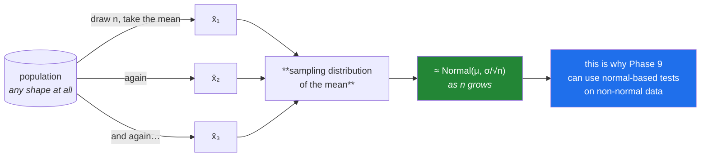

# Day 67 — The Central Limit Theorem

**Phase 8 · Module 8** · ID: **ST-14** (the Central Limit Theorem)

> **Yesterday:** the normal distribution, and the honest account of when it applies.
> **Today:** why it applies so often anyway. This is the theorem that makes the whole of Phase 9
> possible — and you are going to **watch it happen** rather than accept it, including the cases
> where it needs more data than the folklore claims.
> **Tomorrow:** confidence intervals, and Phase 8 closes.

```bash
./m start 67 && ./m scaffold 67
```

**Time:** 110 minutes. **Request budget:** 0 model calls.

---

## §1 The story

Day 66 ended with an uncomfortable pair of facts: almost every statistical method assumes normality,
and almost no real data is normal.

The Central Limit Theorem is the resolution, and it is genuinely surprising:

> **Take samples of size `n`, compute each one's mean, and collect those means. As `n` grows, the
> distribution of the *means* approaches a normal — no matter what shape the original data had.**

Not the data. The **means**. Your citation counts can be violently right-skewed; the distribution of
sample means from them is still, at sufficient `n`, approximately normal.



Three claims, and the third is the one people forget:

1. The sampling distribution is **centred on μ** — the population mean.
2. Its spread is **σ/√n** — the *standard error* from Day 66. Four times the data, half the spread.
3. Its **shape** approaches normal.

The `√n` in claim 2 is why data collection has diminishing returns: to halve your uncertainty you need
**four times** the data. That single fact governs every "should we collect more?" decision you will
face.

**And the honest caveats**, because "n > 30" is repeated far more confidently than it deserves:

- **How fast** convergence happens depends on the population's shape. Symmetric data converges almost
  immediately; heavily skewed data can need hundreds.
- **Infinite-variance distributions never converge at all.** The Cauchy distribution's sample mean is
  no better behaved than a single observation, no matter how much data you collect.
- The theorem is about the **mean** (and sums). It says nothing about the maximum, the variance, or a
  ratio.

You will demonstrate all three today rather than take them on trust.

---

## §2 Setup — run this

```bash
mkdir -p days/day-67/lab
touch days/day-67/lab/clt.py
```

`src/setu/stats.py` grows today. No new packages.

---

## §3 ST-14 — watching it happen

`days/day-67/lab/clt.py`:

```python
"""ST-14: the Central Limit Theorem, simulated - including where it fails."""

from __future__ import annotations

import numpy as np
from scipy import stats as sp

from setu.arrays import make_rng


def sampling_distributions(population, sizes, *, trials=20_000, seed=0):
    """Draw `trials` samples of each size and return their means."""
    rng = make_rng(seed)
    return {n: rng.choice(population, size=(trials, n)).mean(axis=1) for n in sizes}


def watch_it_happen() -> None:
    rng = make_rng(1)
    population = rng.lognormal(mean=1.0, sigma=1.2, size=500_000)

    print(f"\n  POPULATION: heavily right-skewed")
    print(f"    μ = {population.mean():.3f}   σ = {population.std(ddof=0):.3f}   "
          f"skew = {sp.skew(population):.3f}")

    print(f"\n  {'n':>5} {'mean of x̄':>11} {'sd of x̄':>10} {'σ/√n':>9} "
          f"{'skew of x̄':>11} {'KS p':>9}")
    for n, means in sampling_distributions(population, [1, 2, 5, 10, 30, 100, 500]).items():
        standardised = (means - means.mean()) / means.std(ddof=1)
        ks = sp.kstest(standardised, "norm")
        print(f"  {n:>5} {means.mean():>11.3f} {means.std(ddof=1):>10.4f} "
              f"{population.std(ddof=0) / np.sqrt(n):>9.4f} "
              f"{sp.skew(means):>11.3f} {ks.pvalue:>9.4f}")

    print("\n  Read three columns:")
    print("    'mean of x̄' stays at μ at every n — the estimate is UNBIASED throughout")
    print("    'sd of x̄' tracks σ/√n almost exactly — that is claim 2, verified")
    print("    'skew of x̄' marches toward 0 — that is claim 3, the shape converging")
    print("\n  The population has skew ~4. At n=1 the means inherit it exactly. By n=100")
    print("  they are nearly symmetric. Nothing about the population changed.")


def the_root_n_rule() -> None:
    rng = make_rng(2)
    population = rng.normal(100, 15, 500_000)

    print(f"\n  σ = 15. Halving the standard error costs 4x the data:")
    print(f"  {'n':>6} {'sd of x̄':>10} {'σ/√n':>9} {'vs n=25':>9}")
    baseline = None
    for n in (25, 100, 400, 1_600, 6_400):
        means = sampling_distributions(population, [n], trials=5_000, seed=3)[n]
        observed = means.std(ddof=1)
        baseline = baseline or observed
        print(f"  {n:>6} {observed:>10.4f} {15 / np.sqrt(n):>9.4f} "
              f"{observed / baseline:>9.3f}")

    print("\n  Each row has 4x the data of the one above and half the standard error.")
    print("  ⚠️ This is the arithmetic behind every 'should we collect more data?' decision.")
    print("     Going from n=1,000 to n=2,000 buys you a 29% reduction, not 50%.")


def shape_decides_the_speed() -> None:
    rng = make_rng(4)
    populations = {
        "uniform":    rng.uniform(0, 1, 300_000),
        "normal":     rng.normal(0, 1, 300_000),
        "exponential": rng.exponential(1.0, 300_000),
        "lognormal":  rng.lognormal(0, 1.5, 300_000),
        "bimodal":    np.concatenate([rng.normal(-3, 0.5, 150_000),
                                      rng.normal(3, 0.5, 150_000)]),
    }

    print(f"\n  |skew| of the SAMPLE MEANS at each n:")
    print(f"  {'population':<13} {'pop skew':>9} {'n=5':>8} {'n=30':>8} "
          f"{'n=100':>8} {'n=500':>8}")
    for name, population in populations.items():
        means = sampling_distributions(population, [5, 30, 100, 500], trials=8_000, seed=5)
        skews = [abs(sp.skew(means[n])) for n in (5, 30, 100, 500)]
        print(f"  {name:<13} {sp.skew(population):>9.2f} " +
              " ".join(f"{s:>8.3f}" for s in skews))

    print("\n  ⚠️ 'n > 30 is enough' is FOLKLORE. Read the lognormal row: still visibly")
    print("     skewed at n=100. The bimodal population, despite looking nothing like a")
    print("     normal, converges FAST — because it is symmetric.")
    print("\n  What matters is the POPULATION'S SKEW, not how normal it looks.")


def where_it_fails() -> None:
    rng = make_rng(6)

    print(f"\n  Cauchy distribution — infinite variance. Means of increasing n:")
    print(f"  {'n':>6} {'sd of x̄':>14} {'IQR of x̄':>12}")
    for n in (1, 10, 100, 1_000, 10_000):
        means = rng.standard_cauchy(size=(3_000, n)).mean(axis=1)
        print(f"  {n:>6} {means.std(ddof=1):>14.1f} "
              f"{np.percentile(means, 75) - np.percentile(means, 25):>12.4f}")

    print("\n  The IQR does not shrink AT ALL. A mean of 10,000 Cauchy draws is no more")
    print("  informative than a single one — averaging buys you nothing.")
    print("\n  The CLT requires FINITE VARIANCE. Cauchy has none, so it does not apply.")
    print("  Real analogues: some financial returns, network latencies under failure,")
    print("  anything where the tail is heavy enough that σ is not really defined.")


def it_is_only_about_the_mean() -> None:
    rng = make_rng(7)
    population = rng.exponential(1.0, 300_000)

    print(f"\n  Exponential population. Sampling distributions of three statistics at n=100:")
    samples = rng.choice(population, size=(15_000, 100))

    for name, stat in (("mean", samples.mean(axis=1)),
                       ("maximum", samples.max(axis=1)),
                       ("variance", samples.var(axis=1, ddof=1))):
        standardised = (stat - stat.mean()) / stat.std(ddof=1)
        print(f"    {name:<10} skew = {sp.skew(stat):>7.3f}   "
              f"KS p vs normal = {sp.kstest(standardised, 'norm').pvalue:.2e}")

    print("\n  The MEAN is close to normal. The maximum and the variance are not, and")
    print("  more data will not fix them — the CLT makes no claim about either.")
    print("  ⚠️ 'CLT, therefore normal' applied to a maximum or a variance is simply wrong.")


def the_practical_payoff() -> None:
    rng = make_rng(8)
    population = rng.lognormal(1.0, 1.2, 400_000)
    mu = population.mean()

    n, trials = 200, 20_000
    samples = rng.choice(population, size=(trials, n))
    means = samples.mean(axis=1)
    se = samples.std(axis=1, ddof=1) / np.sqrt(n)

    low, high = means - 1.96 * se, means + 1.96 * se
    coverage = ((low <= mu) & (mu <= high)).mean()

    print(f"\n  population skew = {sp.skew(population):.2f} — nothing like a normal")
    print(f"  built 20,000 intervals of x̄ ± 1.96·SE at n={n}")
    print(f"  fraction containing the true μ = {coverage:.4f}   (target 0.95)")

    print("\n  THAT is the payoff. A normal-based interval works on badly skewed data,")
    print("  because the CLT applies to the MEAN, not to the data. Day 68 builds this")
    print("  properly, and compares it against a bootstrap that assumes nothing.")

    for small_n in (5, 20):
        s = rng.choice(population, size=(trials, small_n))
        m, e = s.mean(axis=1), s.std(axis=1, ddof=1) / np.sqrt(small_n)
        cover = ((m - 1.96 * e <= mu) & (mu <= m + 1.96 * e)).mean()
        print(f"  at n={small_n:<3} coverage = {cover:.4f}   <- below target: CLT has not arrived")


def sums_too() -> None:
    rng = make_rng(9)
    population = rng.exponential(1.0, 200_000)
    sums = rng.choice(population, size=(10_000, 50)).sum(axis=1)

    print(f"\n  sums of 50 exponential draws: skew = {sp.skew(sums):.3f}")
    print(f"  (the population's skew is {sp.skew(population):.3f})")
    print("\n  The CLT covers sums as well as means — a mean is just a sum scaled by 1/n.")
    print("  This is why the binomial (a sum of Bernoullis, Day 65) becomes normal-ish.")


if __name__ == "__main__":
    watch_it_happen()
    the_root_n_rule()
    shape_decides_the_speed()
    where_it_fails()
    it_is_only_about_the_mean()
    the_practical_payoff()
    sums_too()
```

**Line by line:**

- `rng.choice(population, size=(trials, n)).mean(axis=1)` — the whole simulation in one line, and it is
  **vectorised**: one `(trials, n)` draw, then a row-wise mean. No Python loop over trials, which is
  the Day 25 bootstrap technique reused.
- `watch_it_happen` — **read the three columns named in the printout.** The mean of `x̄` sits on μ at
  *every* `n` (unbiased throughout), the sd of `x̄` tracks `σ/√n` almost exactly, and the skew of `x̄`
  marches toward zero. Those are the theorem's three claims, verified separately.
- `the_root_n_rule` — each row has **four times** the data and half the standard error. The printed
  warning is the practically important version: going from `n = 1,000` to `n = 2,000` buys a 29%
  reduction, not 50%, and that governs every "collect more data?" decision.
- `shape_decides_the_speed` — **the table that dismantles "n > 30".** The lognormal row is still
  visibly skewed at `n = 100`. Meanwhile the **bimodal** population — which looks nothing like a normal
  — converges fast, because it is *symmetric*. **What matters is the population's skew, not how normal
  it looks.**
- `where_it_fails` — Cauchy. **The IQR does not shrink at all**, at any `n`. A mean of ten thousand
  draws is no more informative than one. The CLT requires **finite variance**, and Cauchy has none.
  The real analogues named in the printout are worth remembering.
- `it_is_only_about_the_mean` — the mean converges; the **maximum** and the **variance** do not, and
  more data will not fix them. "CLT, therefore normal" applied to a maximum is simply wrong, and
  extreme-value statistics exists precisely because maxima have their own limiting distributions.
- `the_practical_payoff` — **the demonstration that justifies Phase 9.** Twenty thousand intervals
  built as `x̄ ± 1.96·SE` on badly skewed data, and about 95% contain the true μ. Then the small-`n`
  rows show coverage falling short — the CLT has not arrived yet, and the interval is over-confident.
  That gap is exactly what Day 68's bootstrap addresses.
- `sums_too` — the theorem covers sums as well as means, which is why the binomial (a sum of
  Bernoullis, Day 65) becomes normal-ish for large `n`.

---

## §4 Build brief

Extend `src/setu/stats.py`:

```python
def sampling_distribution(population, *, n: int, trials: int = 10_000,
                          statistic: str = "mean", seed: int = 42) -> dict:
    """TODO(me): the empirical sampling distribution of a statistic.

    {"n", "trials", "statistic", "values": ndarray, "mean", "sd", "skew"}
    - statistic in {'mean', 'sum', 'median', 'max', 'var'}; else DataError
    - VECTORISED: one (trials, n) draw, then reduce along axis=1. No Python loop.
    - raise DataError if n < 1 or trials < 100
    - use make_rng(seed) for reproducibility
    """
    raise NotImplementedError


def clt_convergence(population, *, sizes=(2, 5, 10, 30, 100, 500), trials: int = 8_000,
                    seed: int = 42) -> dict:
    """TODO(me): §3's first table, as data.

    {"population": {"mean", "sd", "skew"},
     "by_size": {n: {"mean_of_means", "sd_of_means", "predicted_se", "skew_of_means",
                     "abs_skew_ratio"}},
     "converged_at": int | None}
    - predicted_se is population sd / sqrt(n)
    - abs_skew_ratio is |skew of means| / |population skew|, so 1.0 means no progress
    - converged_at is the smallest n where |skew of means| < 0.2, or None
    - raise DataError if the population has fewer than 1000 values (the resampling
      would not represent it)
    """
    raise NotImplementedError


def required_n(*, sigma: float, target_se: float) -> int:
    """TODO(me): how many observations to reach a target standard error.

    n = ceil((sigma / target_se) ** 2)
    - raise DataError if sigma <= 0 or target_se <= 0
    - this is the root-n rule inverted, and it is the number to put in a
      'should we collect more data?' conversation
    """
    raise NotImplementedError


def clt_applies(values, *, n: int) -> dict:
    """TODO(me): an honest verdict on whether a normal-based interval is safe here.

    {"applies": bool, "population_skew", "n", "reasons": [...], "recommendation": str}
    - refuse (applies=False) when: |skew| > 2 and n < 100; or |skew| > 1 and n < 30;
      or n < 15 regardless
    - ALSO refuse when the data shows signs of infinite variance: check whether the
      sample sd roughly doubles when you double the sample (§3's Cauchy case)
    - recommendation is 'normal interval' or 'bootstrap (Day 68)'
    - reasons must be human-readable, naming the skew and the n
    - deliberately conservative: 'n > 30' is folklore (§3)
    """
    raise NotImplementedError


def coverage_check(population, *, n: int, trials: int = 5_000, confidence: float = 0.95,
                   seed: int = 42) -> dict:
    """TODO(me): do normal-based intervals actually contain μ as often as claimed?

    {"n", "nominal": float, "actual": float, "shortfall": float}
    - build trials intervals of x̄ ± z·(s/√n) and count how many contain the true mean
    - actual well below nominal means the interval is OVER-CONFIDENT — the dangerous
      direction, and exactly what §3 showed at small n on skewed data
    - vectorised
    """
    raise NotImplementedError
```

- `clt_applies` being **deliberately conservative** is the day's design decision. The folklore
  threshold is 30; §3 showed lognormal data still skewed at 100. A helper that repeats the folklore
  would be worse than none, because it launders a guess as a check.
- `coverage_check` measures the thing that actually matters — not "is it normal" but **"does the
  interval do what it claims"** — and Day 68 uses it to compare against the bootstrap.
- `required_n` is the root-`n` rule inverted, and it is the number that belongs in a planning
  conversation rather than a vague "more data would help".

---

## §5 The eval that must be able to fail

Add to `tests/test_stats.py`:

```python
from setu.stats import (
    clt_applies,
    clt_convergence,
    coverage_check,
    required_n,
    sampling_distribution,
)


@pytest.fixture(scope="module")
def skewed_population():
    return make_rng(0).lognormal(1.0, 1.2, 200_000)


def test_the_sampling_distribution_is_centred_on_mu(skewed_population):
    result = sampling_distribution(skewed_population, n=50)
    assert result["mean"] == pytest.approx(skewed_population.mean(), rel=0.02)


def test_the_standard_error_follows_root_n(skewed_population):
    """Claim 2, verified."""
    small = sampling_distribution(skewed_population, n=25)["sd"]
    large = sampling_distribution(skewed_population, n=100)["sd"]
    assert large == pytest.approx(small / 2, rel=0.1)


def test_the_shape_converges(skewed_population):
    """Claim 3, verified."""
    from scipy import stats as sp

    population_skew = abs(sp.skew(skewed_population))
    at_5 = abs(sampling_distribution(skewed_population, n=5)["skew"])
    at_200 = abs(sampling_distribution(skewed_population, n=200)["skew"])
    assert at_5 > at_200 * 3
    assert at_200 < population_skew / 5


def test_sampling_distribution_is_vectorised(skewed_population):
    """A Python loop over 20,000 trials would be unusably slow."""
    import time

    start = time.perf_counter()
    sampling_distribution(skewed_population, n=200, trials=20_000)
    assert time.perf_counter() - start < 5.0, "are you looping over trials?"


def test_sampling_distribution_is_reproducible(skewed_population):
    a = sampling_distribution(skewed_population, n=30, trials=500, seed=7)
    b = sampling_distribution(skewed_population, n=30, trials=500, seed=7)
    assert np.array_equal(a["values"], b["values"])


def test_unknown_statistic_raises(skewed_population):
    with pytest.raises(DataError):
        sampling_distribution(skewed_population, n=10, statistic="mode")


def test_too_few_trials_raises(skewed_population):
    with pytest.raises(DataError):
        sampling_distribution(skewed_population, n=10, trials=10)


def test_convergence_report_tracks_the_predicted_se(skewed_population):
    result = clt_convergence(skewed_population)
    for n, row in result["by_size"].items():
        assert row["sd_of_means"] == pytest.approx(row["predicted_se"], rel=0.1), (
            f"observed spread departs from sigma/sqrt(n) at n={n}"
        )


def test_convergence_report_shows_skew_shrinking(skewed_population):
    result = clt_convergence(skewed_population)
    ratios = [result["by_size"][n]["abs_skew_ratio"] for n in sorted(result["by_size"])]
    assert ratios == sorted(ratios, reverse=True), "skew ratio should fall as n grows"


def test_symmetric_populations_converge_faster_than_skewed_ones():
    """'n > 30' is folklore — the population's SKEW decides."""
    rng = make_rng(1)
    symmetric = rng.uniform(0, 1, 100_000)
    skewed = rng.lognormal(0, 1.5, 100_000)

    assert clt_convergence(symmetric)["converged_at"] < clt_convergence(skewed)["converged_at"]


def test_a_bimodal_population_still_converges_fast():
    """It looks nothing like a normal, but it is symmetric."""
    rng = make_rng(2)
    bimodal = np.concatenate([rng.normal(-3, 0.5, 50_000), rng.normal(3, 0.5, 50_000)])
    assert clt_convergence(bimodal)["converged_at"] <= 10


def test_convergence_rejects_a_tiny_population():
    with pytest.raises(DataError):
        clt_convergence(np.array([1.0, 2.0, 3.0]))


def test_required_n_inverts_the_root_n_rule():
    assert required_n(sigma=15.0, target_se=3.0) == 25
    assert required_n(sigma=15.0, target_se=1.5) == 100


def test_halving_the_target_quadruples_n():
    assert required_n(sigma=10.0, target_se=0.5) == 4 * required_n(sigma=10.0, target_se=1.0)


def test_required_n_rejects_impossible_targets():
    with pytest.raises(DataError):
        required_n(sigma=0.0, target_se=1.0)
    with pytest.raises(DataError):
        required_n(sigma=1.0, target_se=0.0)


def test_clt_refuses_small_n_regardless_of_shape():
    values = list(make_rng(3).normal(0, 1, 1_000))
    assert clt_applies(values, n=10)["applies"] is False


def test_clt_refuses_heavy_skew_at_moderate_n():
    """The folklore threshold is not enough for skewed data."""
    values = list(make_rng(4).lognormal(0, 1.5, 5_000))
    result = clt_applies(values, n=40)
    assert result["applies"] is False
    assert "bootstrap" in result["recommendation"].lower()
    assert any("skew" in reason.lower() for reason in result["reasons"])


def test_clt_accepts_symmetric_data_at_moderate_n():
    values = list(make_rng(5).normal(100, 15, 5_000))
    assert clt_applies(values, n=50)["applies"] is True


def test_clt_accepts_skewed_data_at_large_n():
    values = list(make_rng(6).lognormal(0, 1.0, 5_000))
    assert clt_applies(values, n=500)["applies"] is True


def test_clt_refuses_infinite_variance_data():
    """Cauchy: averaging buys nothing, at any n."""
    values = list(make_rng(7).standard_cauchy(20_000))
    result = clt_applies(values, n=1_000)
    assert result["applies"] is False
    assert any("variance" in reason.lower() or "tail" in reason.lower()
               for reason in result["reasons"])


def test_coverage_is_close_to_nominal_at_large_n(skewed_population):
    result = coverage_check(skewed_population, n=300)
    assert result["actual"] == pytest.approx(0.95, abs=0.02)


def test_coverage_falls_short_at_small_n_on_skewed_data(skewed_population):
    """Over-confident intervals — the dangerous direction."""
    result = coverage_check(skewed_population, n=5)
    assert result["actual"] < 0.90
    assert result["shortfall"] > 0.05


def test_coverage_is_fine_at_small_n_on_symmetric_data():
    symmetric = make_rng(8).normal(100, 15, 100_000)
    assert coverage_check(symmetric, n=10)["actual"] == pytest.approx(0.95, abs=0.03)


def test_the_clt_says_nothing_about_the_maximum(skewed_population):
    """More data does not make a maximum normal."""
    small = abs(sampling_distribution(skewed_population, n=20, statistic="max")["skew"])
    large = abs(sampling_distribution(skewed_population, n=500, statistic="max")["skew"])
    assert large > 0.5, "the maximum should NOT converge to a normal"
    assert small > 0.5
```

**Line by line:**

- `test_the_standard_error_follows_root_n` and `test_the_shape_converges` — **claims 2 and 3, tested
  separately.** Splitting them matters: an implementation could get the spread right and the shape
  wrong, and one combined assertion would hide that.
- `test_symmetric_populations_converge_faster_than_skewed_ones` — **the day's real assessment**, and
  it is the test that refuses the folklore. It asserts convergence is a property of the population's
  *shape*, not a universal threshold.
- `test_a_bimodal_population_still_converges_fast` — the counter-intuitive companion. A bimodal
  population looks nothing like a normal and converges by `n = 10`, because it is **symmetric**. A
  helper that judged convergence by "how normal does the population look" would fail this.
- `test_clt_refuses_infinite_variance_data` — Cauchy. Any threshold rule based only on skew and `n`
  will happily approve it, so the implementation needs the variance-growth check from the build brief.
  This test is what forces it.
- `test_coverage_falls_short_at_small_n_on_skewed_data` — coverage below 90% when 95% was claimed.
  **Over-confidence is the dangerous direction**, and this measures the thing that matters rather than
  a proxy for it.
- `test_coverage_is_fine_at_small_n_on_symmetric_data` — the contrast. `n = 10` is fine on symmetric
  data, which again shows the threshold belongs to the shape and not to `n` alone.
- `test_the_clt_says_nothing_about_the_maximum` — asserts a maximum's skew stays high at `n = 500`.
  It is a test that something **does not** converge, which is the only way to pin down the theorem's
  scope.
- `test_sampling_distribution_is_vectorised` — 20,000 trials at `n = 200` in under five seconds. A
  Python loop would take minutes, and the Day 25 technique is what makes the whole lesson runnable.

```bash
uv run python -m pytest tests/test_stats.py -v
```

---

## §6 Request budget

| Resource | Spent today |
|---|---|
| LLM calls | **0** |

---

## §7 Traps

- **"n > 30 is enough."** Folklore. Lognormal data is still skewed at 100.
- **Judging convergence by how normal the population looks.** Bimodal converges fast; skewed does not.
- **Applying the CLT to a maximum or a variance.** It is about means and sums.
- **Applying it to infinite-variance data.** Cauchy never converges.
- **Thinking the CLT makes your data normal.** It makes the *sampling distribution* normal.
- **Expecting linear returns from more data.** It is `√n`; four times the data halves the error.
- **Using `σ` where `σ/√n` belongs.** Day 66's distinction, and it is off by a factor of `√n`.
- **A normal interval at small n on skewed data.** Coverage falls short; you are over-confident.
- **Looping over trials in a simulation.** Vectorise; one `(trials, n)` draw.
- **Assuming coverage without measuring it.** `coverage_check` takes one line.

---

## §8 Verify before you code

Written **2026-08-21**:

- <https://numpy.org/doc/stable/reference/random/generated/numpy.random.Generator.choice.html> — the
  `size=(trials, n)` form that makes the simulation vectorised.
- <https://docs.scipy.org/doc/scipy/reference/generated/scipy.stats.kstest.html> — comparing a sample
  against a distribution.
- <https://docs.scipy.org/doc/scipy/reference/generated/scipy.stats.cauchy.html> — the infinite-variance
  counterexample.
- <https://docs.scipy.org/doc/scipy/reference/generated/scipy.stats.skew.html> — the convergence
  measure used throughout.

---

## §9 Say it in an interview

> "The CLT is why normal-based methods work on data that isn't normal — it's a statement about the
> distribution of the *mean*, not the data. I simulated it rather than asserting it, and the
> interesting part is what the simulation contradicts. 'n greater than thirty' is folklore: lognormal
> data still produces visibly skewed sample means at n equals one hundred, while a bimodal population
> that looks nothing like a normal converges by n equals ten — because it's symmetric. What decides
> the speed is the population's *skew*, not how normal it looks. There are two hard limits too: the
> theorem needs finite variance, so a Cauchy sample mean is no better behaved than a single
> observation at any n, and it says nothing about a maximum or a variance. So my helper is
> deliberately conservative and returns reasons rather than a yes, and the check I actually trust is
> coverage — build twenty thousand intervals and count how many contain the true mean, because
> falling short of your nominal 95% means you're over-confident, which is the dangerous direction."

---

## §10 Done when

Tick [`CHECKLIST.md`](CHECKLIST.md), then `./m check && ./m done 67`.
