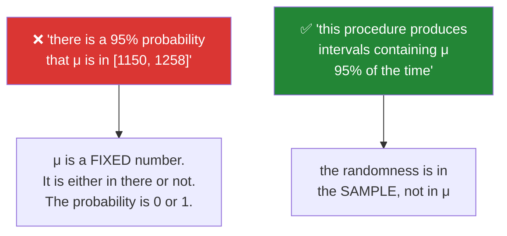

# Day 68 — Estimation, standard error, and a bootstrap CI from scratch

**Phase 8 gate** · ID: **ST-15** (point and interval estimation, confidence intervals) · Artifact: **a coverage report**

> **Yesterday:** the CLT, and the coverage that fell short at small n.
> **Today:** the interval itself — what "95% confident" actually means (it is not what most people
> say), and a **bootstrap** that needs no distributional assumption at all. Then the gate: measure
> whether your intervals do what they claim. **Phase 8 closes.**
> **Tomorrow:** Phase 9, hypothesis testing.

```bash
./m start 68 && ./m scaffold 68
```

**Time:** 2 hours (gate day). **Request budget:** 0 model calls.

---

## §1 The story

A **point estimate** is a single number: `x̄ = 1204`. Day 58 established it is a statistic estimating
a parameter, and Day 67 showed it varies from sample to sample. An **interval estimate** attaches the
size of that variation.

The construction is short: `x̄ ± z · SE`, where `SE = s/√n` (Day 66) and `z` comes from the quantile
function (Day 64). For 95%, `z = 1.96`. That is it — the arithmetic is three days old.

**What it means is the hard part**, and almost everyone states it wrong:



**The confidence is a property of the procedure, not of your one interval.** Run it a hundred times,
about ninety-five of the intervals contain μ. You never learn which. That is a genuinely weaker claim
than people want, and pretending otherwise is the most common misstatement in applied statistics.

Then the **bootstrap**, which is the day's real content. The normal interval assumes the CLT has
arrived — and yesterday showed that at small `n` on skewed data it has not, and the interval is
over-confident. The bootstrap sidesteps the assumption entirely:

> **Resample your data with replacement, recompute the statistic, repeat thousands of times, and take
> the quantiles of what you get.**

It is almost absurd — you are treating your sample as a stand-in for the population — and it works
remarkably well. It also works on statistics where no formula exists: a median, a 90th percentile, a
correlation, a ratio of two medians. **Try deriving a standard error for a 90th percentile
analytically; then do it with eight lines of resampling.**

You already have `bootstrap_mean_ci` from Day 25. Today you write the general version and check it
against that one.

---

## §2 Setup — run this

```bash
mkdir -p days/day-68/lab reports
touch days/day-68/lab/estimation.py
```

`src/setu/stats.py` grows today. No new packages.

---

## §3 ST-15 — intervals

`days/day-68/lab/estimation.py`:

```python
"""ST-15: point and interval estimation, and the bootstrap."""

from __future__ import annotations

import numpy as np
from scipy import stats as sp

from setu.arrays import make_rng


def what_confidence_means() -> None:
    rng = make_rng(0)
    mu, sigma, n = 100.0, 15.0, 30

    print(f"\n  true μ = {mu}. Twenty 95% intervals from twenty samples of {n}:")
    misses = 0
    for i in range(20):
        sample = rng.normal(mu, sigma, n)
        se = sample.std(ddof=1) / np.sqrt(n)
        low, high = sample.mean() - 1.96 * se, sample.mean() + 1.96 * se
        contains = low <= mu <= high
        misses += not contains
        print(f"    [{low:>7.2f}, {high:>7.2f}]  {'✓' if contains else '✗ MISSES μ'}")

    print(f"\n  {misses} of 20 missed. Over many runs it settles near 1 in 20.")
    print("\n  Each individual interval either contains μ or does not — there is no")
    print("  probability about it once drawn. The 95% describes the PROCEDURE.")


def the_construction() -> None:
    rng = make_rng(1)
    sample = rng.normal(100, 15, 40)

    xbar = sample.mean()
    se = sample.std(ddof=1) / np.sqrt(len(sample))

    print(f"\n  x̄  = {xbar:.3f}")
    print(f"  s  = {sample.std(ddof=1):.3f}   <- ddof=1 (Day 60)")
    print(f"  SE = s/√n = {se:.3f}   <- the sd of the MEAN (Day 66)")

    print(f"\n  {'confidence':>11} {'z':>7} {'interval':>26} {'width':>8}")
    for confidence in (0.80, 0.90, 0.95, 0.99, 0.999):
        z = sp.norm.ppf(0.5 + confidence / 2)
        low, high = xbar - z * se, xbar + z * se
        print(f"  {confidence:>11.1%} {z:>7.3f} [{low:>10.3f}, {high:>10.3f}] {high - low:>8.3f}")

    print("\n  More confidence costs width. A 99.9% interval is nearly 2x a 95% one.")
    print("  There is no free certainty — you widen until you are comfortable being wrong.")


def z_versus_t() -> None:
    rng = make_rng(2)
    print(f"\n  When σ is UNKNOWN (always, in practice) the correct multiplier is t, not z:")
    print(f"  {'n':>6} {'z (1.96)':>10} {'t':>10} {'t/z':>8}")
    for n in (3, 5, 10, 30, 100, 1000):
        t = sp.t.ppf(0.975, df=n - 1)
        print(f"  {n:>6} {1.96:>10.3f} {t:>10.3f} {t / 1.96:>8.3f}")

    print("\n  At n=3 the t multiplier is over 2x z — because you estimated s from the")
    print("  data and that estimate is itself uncertain. By n=100 the difference is 1%.")

    for n in (5, 30):
        covers = []
        for _ in range(20_000):
            s = rng.normal(100, 15, n)
            se = s.std(ddof=1) / np.sqrt(n)
            covers.append(abs(s.mean() - 100) <= 1.96 * se)
        print(f"  coverage using z at n={n:<3}: {np.mean(covers):.4f}   (should be 0.95)")

    print("\n  Using z with a small n gives you LESS coverage than you claimed.")
    print("  Day 71's t-test is this multiplier with a hypothesis attached.")


def the_bootstrap_from_scratch() -> None:
    rng = make_rng(3)
    sample = rng.lognormal(3.0, 1.1, 60)

    print(f"\n  sample of 60, skew = {sp.skew(sample):.2f}")
    print(f"  x̄ = {sample.mean():.2f}   median = {np.median(sample):.2f}")

    resamples = rng.choice(sample, size=(10_000, len(sample)), replace=True)
    boot_means = resamples.mean(axis=1)

    low, high = np.percentile(boot_means, [2.5, 97.5])
    se = sample.std(ddof=1) / np.sqrt(len(sample))
    normal_low, normal_high = sample.mean() - 1.96 * se, sample.mean() + 1.96 * se

    print(f"\n  bootstrap 95% : [{low:>8.2f}, {high:>8.2f}]  width {high - low:>7.2f}")
    print(f"  normal    95% : [{normal_low:>8.2f}, {normal_high:>8.2f}]  "
          f"width {normal_high - normal_low:>7.2f}")

    print(f"\n  bootstrap SE  = {boot_means.std(ddof=1):.4f}")
    print(f"  formula SE    = {se:.4f}   <- they agree closely, with no formula used")

    print(f"\n  bootstrap interval is ASYMMETRIC around x̄:")
    print(f"    below x̄: {sample.mean() - low:.2f}   above x̄: {high - sample.mean():.2f}")
    print("  ^ the normal interval cannot do that. On skewed data the truth is asymmetric,")
    print("    and forcing symmetry is exactly how the small-n coverage failed yesterday.")


def bootstrap_anything() -> None:
    rng = make_rng(4)
    sample = rng.lognormal(3.0, 1.0, 200)
    resamples = rng.choice(sample, size=(8_000, len(sample)), replace=True)

    print(f"\n  {'statistic':<22} {'estimate':>10} {'95% CI':>26}")
    for name, fn in (
        ("mean", lambda a: a.mean(axis=1)),
        ("median", lambda a: np.median(a, axis=1)),
        ("90th percentile", lambda a: np.percentile(a, 90, axis=1)),
        ("IQR", lambda a: np.percentile(a, 75, axis=1) - np.percentile(a, 25, axis=1)),
        ("coefficient of variation", lambda a: a.std(axis=1, ddof=1) / a.mean(axis=1)),
    ):
        draws = fn(resamples)
        low, high = np.percentile(draws, [2.5, 97.5])
        point = fn(sample.reshape(1, -1))[0]
        print(f"  {name:<22} {point:>10.3f} [{low:>10.3f}, {high:>10.3f}]")

    print("\n  There is no textbook standard-error formula for a 90th percentile or an IQR.")
    print("  The bootstrap needed no formula for ANY of these — same eight lines each time.")
    print("  THAT is why it earns its place, not the small-n accuracy.")


def where_the_bootstrap_struggles() -> None:
    rng = make_rng(5)

    print(f"\n  the bootstrap is not magic. Three failure modes:")

    tiny = rng.lognormal(0, 1, 8)
    boots = rng.choice(tiny, size=(5_000, 8), replace=True).mean(axis=1)
    print(f"\n  1. TINY n: sample of 8, distinct resamples are limited")
    print(f"     unique bootstrap means: {len(np.unique(boots)):,} of 5,000 draws")
    print("     the sample cannot represent a population it barely sampled")

    sample = rng.normal(0, 1, 200)
    max_boots = rng.choice(sample, size=(5_000, 200), replace=True).max(axis=1)
    print(f"\n  2. EXTREMES: bootstrapping a maximum")
    print(f"     sample max = {sample.max():.3f}, bootstrap max never exceeds it: "
          f"{max_boots.max():.3f}")
    print("     a resample cannot contain a value the sample did not — maxima are stuck")

    print(f"\n  3. DEPENDENCE: resampling assumes exchangeable observations.")
    print("     For time series or clustered data, plain resampling destroys the structure")
    print("     and reports intervals that are far too narrow (block bootstrap exists).")


def coverage_is_the_real_test() -> None:
    rng = make_rng(6)
    population = rng.lognormal(1.0, 1.3, 300_000)
    mu = population.mean()

    print(f"\n  population skew = {sp.skew(population):.2f}")
    print(f"  {'n':>5} {'normal-z':>10} {'normal-t':>10} {'bootstrap':>11}")

    for n in (5, 10, 30, 100):
        trials = 3_000
        samples = rng.choice(population, size=(trials, n))
        means = samples.mean(axis=1)
        ses = samples.std(axis=1, ddof=1) / np.sqrt(n)

        z_cover = ((means - 1.96 * ses <= mu) & (mu <= means + 1.96 * ses)).mean()
        t_mult = sp.t.ppf(0.975, df=n - 1)
        t_cover = ((means - t_mult * ses <= mu) & (mu <= means + t_mult * ses)).mean()

        boot_cover = 0
        for row in samples[:600]:
            boots = rng.choice(row, size=(600, n), replace=True).mean(axis=1)
            low, high = np.percentile(boots, [2.5, 97.5])
            boot_cover += low <= mu <= high
        boot_cover /= 600

        print(f"  {n:>5} {z_cover:>10.3f} {t_cover:>10.3f} {boot_cover:>11.3f}")

    print("\n  All three fall short at n=5 — no method rescues you from too little data")
    print("  on badly skewed data. But t beats z everywhere, and the bootstrap's")
    print("  asymmetry helps as n grows. Measure coverage; do not assume it.")


if __name__ == "__main__":
    what_confidence_means()
    the_construction()
    z_versus_t()
    the_bootstrap_from_scratch()
    bootstrap_anything()
    where_the_bootstrap_struggles()
    coverage_is_the_real_test()
```

**Line by line:**

- `what_confidence_means` — **twenty intervals, about one miss.** Look at the misses: nothing is
  visibly wrong with them. You cannot tell from an interval whether it is one of the 95% or one of the
  5%, which is precisely why the confidence belongs to the procedure.
- `the_construction` — the width column. **More confidence costs width**, and a 99.9% interval is
  nearly twice a 95% one. There is no free certainty; you widen until you are comfortable being wrong.
- `z_versus_t` — **the correction most tutorials skip.** When `σ` is unknown (always, in practice) the
  right multiplier is `t`, because you estimated `s` from the data and that estimate is itself
  uncertain. At `n = 3` the t multiplier is more than twice `z`. The coverage check below it shows the
  cost: using `z` at small `n` gives **less** coverage than claimed. Day 71's t-test is this multiplier
  with a hypothesis attached.
- `the_bootstrap_from_scratch` — `rng.choice(sample, size=(10_000, n), replace=True)` is the whole
  algorithm. Note two things: the bootstrap SE **agrees with the formula** without using it, and the
  interval is **asymmetric** around `x̄`. On skewed data the truth *is* asymmetric, and forcing
  symmetry is exactly how yesterday's small-`n` coverage failed.
- `bootstrap_anything` — **the real argument for the bootstrap.** There is no textbook standard error
  for a 90th percentile, an IQR, or a coefficient of variation. The bootstrap handled all five with
  the same eight lines. Its value is *generality*, not small-sample accuracy.
- `where_the_bootstrap_struggles` — three honest failure modes. **Tiny `n`**: the sample cannot
  represent a population it barely sampled. **Extremes**: a resample can never contain a value the
  sample lacked, so a bootstrapped maximum is stuck below the sample maximum. **Dependence**: plain
  resampling assumes exchangeable observations, so on a time series it destroys the structure and
  reports intervals that are far too narrow.
- `coverage_is_the_real_test` — **the table that ends the phase.** All three methods fall short at
  `n = 5`; no technique rescues you from too little data on badly skewed data. But `t` beats `z`
  everywhere, and the bootstrap's asymmetry helps as `n` grows. **Measure coverage; do not assume it.**

---

## §4 Build brief

Extend `src/setu/stats.py`:

```python
def confidence_interval(values, *, confidence: float = 0.95, method: str = "t") -> dict:
    """TODO(me): a parametric interval for the mean.

    {"estimate", "low", "high", "se", "multiplier", "method", "n", "warnings": [...]}
    - method='t' is the DEFAULT and uses sp.t.ppf(.., df=n-1); 'z' uses the normal
    - 'z' must attach a warning when n < 100 explaining that t is correct here (§3)
    - confidence must be in (0, 1) exclusive; raise DataError otherwise
    - raise DataError on fewer than 2 non-missing values
    - call clt_applies (Day 67) and add its reasons to `warnings` when it says no
    """
    raise NotImplementedError


def bootstrap_ci(values, statistic=None, *, confidence: float = 0.95,
                 resamples: int = 10_000, seed: int = 42) -> dict:
    """TODO(me): the general bootstrap. `statistic` takes a 2-D array and reduces axis=1.

    {"estimate", "low", "high", "se", "resamples", "n", "warnings": [...]}
    - statistic defaults to the mean; it MUST be vectorised over rows, not called
      once per resample (Day 25's rule)
    - build ONE (resamples, n) draw with replace=True, then reduce
    - low/high are the percentiles of the bootstrap distribution
    - se is the sd of the bootstrap distribution — no formula involved
    - warn when n < 30 (§3's tiny-n failure), naming n
    - warn when the number of UNIQUE bootstrap values is under 100 (a discreteness
      signal that the sample is too small to resample meaningfully)
    - raise DataError on fewer than 3 values, or resamples < 100
    - reproducible via make_rng(seed)
    """
    raise NotImplementedError


def compare_intervals(values, *, confidence: float = 0.95) -> dict:
    """TODO(me): t, z and bootstrap side by side, for a report.

    {"t": {...}, "z": {...}, "bootstrap": {...},
     "widest": str, "bootstrap_asymmetry": float}
    - bootstrap_asymmetry is (high − estimate) / (estimate − low); 1.0 means symmetric
    - this is what Day 90's report shows to justify a choice of method
    """
    raise NotImplementedError


def interval_coverage(population, *, n: int, method: str = "t", trials: int = 2_000,
                      confidence: float = 0.95, seed: int = 42) -> dict:
    """TODO(me): the gate measurement — do the intervals contain μ as often as claimed?

    {"method", "n", "nominal", "actual", "shortfall", "mean_width"}
    - method in {'t', 'z', 'bootstrap'}
    - actual below nominal means OVER-CONFIDENT: report shortfall as a positive number
    - the bootstrap path is expensive; cap its inner resamples at 600 and say so
    - vectorised for t and z
    """
    raise NotImplementedError


def describe_interval(result: dict) -> str:
    """TODO(me): one sentence a non-statistician can read, stated CORRECTLY.

    - must NOT say 'there is a 95% probability that the mean is between'
    - must describe the procedure, e.g. 'estimated mean 1204; a method that captures
      the true value 95% of the time gives the range 1150 to 1258'
    - raise DataError if the result dict lacks estimate/low/high
    This exists so Day 90's report cannot state it the wrong way.
    """
    raise NotImplementedError
```

- `confidence_interval` defaulting to **`t`** is the day's design decision. Every tutorial uses `z`;
  `σ` is essentially never known, and §3 measured the coverage cost.
- `describe_interval` **banning the probability phrasing** is the artifact-level version of §1. A
  helper that produces the correct sentence is more reliable than remembering the distinction under
  deadline.
- `bootstrap_ci` requiring a **vectorised** statistic is Day 25's rule carried forward — calling a
  Python function ten thousand times is the difference between a second and a minute.

---

## §5 The eval that must be able to fail

Add to `tests/test_stats.py`:

```python
from setu.stats import (
    bootstrap_ci,
    compare_intervals,
    confidence_interval,
    describe_interval,
    interval_coverage,
)


def test_interval_contains_the_estimate():
    result = confidence_interval(list(make_rng(0).normal(100, 15, 50)))
    assert result["low"] < result["estimate"] < result["high"]


def test_t_is_the_default():
    """sigma is essentially never known."""
    import inspect

    assert inspect.signature(confidence_interval).parameters["method"].default == "t"


def test_t_is_wider_than_z_at_small_n():
    values = list(make_rng(1).normal(100, 15, 8))
    t_result = confidence_interval(values, method="t")
    z_result = confidence_interval(values, method="z")
    assert (t_result["high"] - t_result["low"]) > (z_result["high"] - z_result["low"])


def test_t_and_z_converge_at_large_n():
    values = list(make_rng(2).normal(100, 15, 5_000))
    t_width = confidence_interval(values, method="t")["high"] - confidence_interval(values, method="t")["low"]
    z_width = confidence_interval(values, method="z")["high"] - confidence_interval(values, method="z")["low"]
    assert t_width == pytest.approx(z_width, rel=0.01)


def test_z_at_small_n_carries_a_warning():
    result = confidence_interval(list(make_rng(3).normal(0, 1, 15)), method="z")
    assert any("t" in w.lower() for w in result["warnings"])


def test_higher_confidence_is_wider():
    values = list(make_rng(4).normal(100, 15, 50))
    widths = [
        confidence_interval(values, confidence=c)["high"]
        - confidence_interval(values, confidence=c)["low"]
        for c in (0.80, 0.90, 0.95, 0.99)
    ]
    assert widths == sorted(widths)


def test_interval_narrows_as_root_n():
    """Four times the data, half the width."""
    rng = make_rng(5)
    small = confidence_interval(list(rng.normal(100, 15, 100)))
    large = confidence_interval(list(rng.normal(100, 15, 400)))
    small_width = small["high"] - small["low"]
    large_width = large["high"] - large["low"]
    assert large_width == pytest.approx(small_width / 2, rel=0.2)


@pytest.mark.parametrize("confidence", [0.0, 1.0, -0.1, 1.5])
def test_confidence_must_be_a_valid_fraction(confidence):
    with pytest.raises(DataError):
        confidence_interval([1.0, 2.0, 3.0], confidence=confidence)


def test_skewed_small_sample_gets_a_clt_warning():
    values = list(make_rng(6).lognormal(0, 1.5, 20))
    assert confidence_interval(values)["warnings"], "clt_applies should have objected"


def test_bootstrap_agrees_with_the_formula_on_normal_data():
    """No formula was used, and yet."""
    values = list(make_rng(7).normal(100, 15, 300))
    parametric = confidence_interval(values)
    boot = bootstrap_ci(values)
    assert boot["se"] == pytest.approx(parametric["se"], rel=0.1)
    assert boot["low"] == pytest.approx(parametric["low"], rel=0.02)


def test_bootstrap_matches_day_25_for_the_mean():
    """The general version must agree with the specialised one."""
    from setu.stats import bootstrap_mean_ci

    values = list(make_rng(8).lognormal(1.0, 0.8, 200))
    general = bootstrap_ci(values, seed=42)
    specific = bootstrap_mean_ci(np.array(values), seed=42)
    assert general["low"] == pytest.approx(specific[0], rel=0.05)
    assert general["high"] == pytest.approx(specific[1], rel=0.05)


def test_bootstrap_is_asymmetric_on_skewed_data():
    """The normal interval cannot do this, and that is why it under-covers."""
    values = list(make_rng(9).lognormal(3.0, 1.1, 60))
    result = bootstrap_ci(values)
    below = result["estimate"] - result["low"]
    above = result["high"] - result["estimate"]
    assert above > below * 1.15, "a skewed sample should give an asymmetric interval"


def test_bootstrap_works_on_a_median():
    values = list(make_rng(10).lognormal(1.0, 1.0, 300))
    result = bootstrap_ci(values, statistic=lambda a: np.median(a, axis=1))
    assert result["low"] < np.median(values) < result["high"]


def test_bootstrap_works_on_a_percentile_with_no_formula():
    """There is no textbook SE for a 90th percentile."""
    values = list(make_rng(11).lognormal(1.0, 1.0, 400))
    result = bootstrap_ci(values, statistic=lambda a: np.percentile(a, 90, axis=1))
    assert result["low"] < np.percentile(values, 90) < result["high"]
    assert result["se"] > 0


def test_bootstrap_is_reproducible():
    values = list(make_rng(12).normal(size=100))
    assert bootstrap_ci(values, seed=7)["low"] == bootstrap_ci(values, seed=7)["low"]


def test_bootstrap_statistic_must_be_vectorised():
    """Calling a Python function 10,000 times is the wrong shape (Day 25)."""
    import time

    values = list(make_rng(13).normal(size=500))
    start = time.perf_counter()
    bootstrap_ci(values, resamples=10_000)
    assert time.perf_counter() - start < 5.0, "are you looping over resamples?"


def test_bootstrap_warns_on_a_tiny_sample():
    result = bootstrap_ci(list(make_rng(14).normal(size=8)))
    assert result["warnings"], "n=8 should have warned"


def test_bootstrap_rejects_too_few_values():
    with pytest.raises(DataError):
        bootstrap_ci([1.0, 2.0])


def test_bootstrap_rejects_too_few_resamples():
    with pytest.raises(DataError):
        bootstrap_ci([1.0, 2.0, 3.0, 4.0], resamples=10)


def test_a_bootstrapped_maximum_cannot_exceed_the_sample_maximum():
    """An honest limitation, asserted."""
    values = list(make_rng(15).normal(0, 1, 200))
    result = bootstrap_ci(values, statistic=lambda a: a.max(axis=1))
    assert result["high"] <= max(values) + 1e-9


def test_compare_intervals_reports_asymmetry():
    values = list(make_rng(16).lognormal(3.0, 1.1, 80))
    result = compare_intervals(values)
    assert result["bootstrap_asymmetry"] > 1.1
    assert set(result) >= {"t", "z", "bootstrap"}


def test_coverage_is_near_nominal_for_t_at_moderate_n():
    population = make_rng(17).normal(100, 15, 200_000)
    result = interval_coverage(population, n=30, method="t")
    assert result["actual"] == pytest.approx(0.95, abs=0.02)


def test_z_under_covers_where_t_does_not():
    """§3's measured cost of the wrong multiplier."""
    population = make_rng(18).normal(100, 15, 200_000)
    t_cover = interval_coverage(population, n=5, method="t")["actual"]
    z_cover = interval_coverage(population, n=5, method="z")["actual"]
    assert t_cover > z_cover
    assert z_cover < 0.93, "z at n=5 should visibly under-cover"


def test_all_methods_under_cover_on_skewed_data_at_tiny_n():
    """No method rescues you from too little data."""
    population = make_rng(19).lognormal(1.0, 1.3, 200_000)
    for method in ("t", "z"):
        assert interval_coverage(population, n=5, method=method)["actual"] < 0.92


def test_shortfall_is_positive_when_under_covering():
    population = make_rng(20).lognormal(1.0, 1.3, 200_000)
    result = interval_coverage(population, n=5, method="z")
    assert result["shortfall"] > 0


def test_the_description_does_not_claim_a_probability():
    """The most common misstatement in applied statistics."""
    values = list(make_rng(21).normal(100, 15, 50))
    text = describe_interval(confidence_interval(values)).lower()
    assert "probability" not in text
    assert "chance that" not in text
    assert "95" in text


def test_the_description_mentions_the_procedure():
    values = list(make_rng(22).normal(100, 15, 50))
    text = describe_interval(confidence_interval(values)).lower()
    assert any(word in text for word in ("method", "procedure", "of the time", "captures"))


def test_describe_rejects_a_malformed_result():
    with pytest.raises(DataError):
        describe_interval({"estimate": 1.0})


def test_phase_8_stats_module_is_complete():
    from setu import stats

    expected = [
        "assert_permitted", "describe_by_level", "measurement_schema",       # Day 58
        "central_tendency", "modes", "weighted_mean", "choose_centre",       # Day 59
        "dispersion", "mad", "coefficient_of_variation", "ddof_bias_demo",   # Day 60
        "shape", "suggest_transform", "apply_transform", "skew_stability",   # Day 61
        "association", "leverage_check", "anscombe_frames",                  # Day 62
        "conditional_probability", "are_independent", "diagnostic_probabilities",
        "expectation", "law_of_large_numbers",                               # Day 63
        "ecdf", "ecdf_at", "tail_probability", "critical_values",            # Day 64
        "fit_distribution", "dispersion_ratio", "binomial_interval",         # Day 65
        "z_scores", "z_to_percentile", "normality_report", "standard_error", # Day 66
        "sampling_distribution", "clt_convergence", "required_n", "clt_applies",
        "coverage_check",                                                    # Day 67
        "confidence_interval", "bootstrap_ci", "interval_coverage",
        "describe_interval",                                                 # Day 68
    ]
    missing = [name for name in expected if not hasattr(stats, name)]
    assert not missing, f"Phase 8 is incomplete: {missing}"
```

**Line by line:**

- `test_the_description_does_not_claim_a_probability` — **the day's real assessment**, and it is
  unusual: it tests *English*. §1's misstatement is the most common error in applied statistics, and a
  function that produces the correct sentence is more reliable than remembering the distinction while
  writing a report at speed. Day 90's report calls this.
- `test_bootstrap_matches_day_25_for_the_mean` — the general implementation must agree with the
  specialised one written 43 days ago. Two bootstraps in one codebase that disagree is exactly the
  drift the architecture tests keep catching.
- `test_bootstrap_is_asymmetric_on_skewed_data` — asserts `above > below × 1.15`. **This is the
  bootstrap's advantage made concrete**: the normal interval is symmetric by construction, and on
  skewed data the truth is not.
- `test_a_bootstrapped_maximum_cannot_exceed_the_sample_maximum` — an **honest limitation, asserted.**
  A test that proves your tool *cannot* do something is worth as much as one proving it can, and it
  stops someone bootstrapping an extreme value in Phase 11 and trusting the result.
- `test_z_under_covers_where_t_does_not` — §3's measurement as a test. The wrong multiplier at `n = 5`
  produces visibly less coverage than claimed, which is the concrete cost of the shortcut every
  tutorial takes.
- `test_all_methods_under_cover_on_skewed_data_at_tiny_n` — the humbling one. **No method rescues you
  from too little data.** A day that ended with "use the bootstrap and you're fine" would be teaching
  something false.
- `test_bootstrap_statistic_must_be_vectorised` — a five-second budget for 10,000 resamples. A Python
  loop takes minutes, and Day 25 established the pattern.
- `test_phase_8_stats_module_is_complete` — the phase gate as a test. Forty-two functions across eleven
  days, with the failure message naming exactly what is missing.

```bash
uv run python -m pytest tests/test_stats.py -v
uv run python -m pytest -q
```

---

## §6 The gate artifact — a coverage report

Produce `reports/day68_coverage.md`. Not an ADR — a **measurement**, and the phase's evidence.

Required content:

- **The question.** Do the intervals this project produces contain the true value as often as they
  claim?
- **Method.** Populations tested (at least: normal, lognormal, exponential, bimodal), sample sizes
  (at least: 5, 10, 30, 100, 500), methods (t, z, bootstrap), trials per cell.
- **The table.** Actual coverage against a nominal 95%, with mean interval width.
- **Findings**, in your own words. At minimum, address: where does `z` under-cover, and by how much?
  At what `n` does the bootstrap start beating the parametric interval on skewed data? Is there a
  population where nothing works at small `n`?
- **The recommendation**, as a rule someone could follow: *given this shape and this n, use this
  method.* Reference `clt_applies` (Day 67) and say whether its thresholds match what you measured —
  **and change them if not.**
- **The honest sentence.** One paragraph stating what a confidence interval means, correctly. Check
  it against `describe_interval`.

---

## §7 Request budget

| Resource | Spent today |
|---|---|
| LLM calls | **0** |
| Compute | a few million resamples; seconds if vectorised, minutes if not |

---

## §8 Traps

- **"95% probability that μ is in this interval."** μ is fixed. The procedure has the property.
- **Using `z` when `σ` is unknown.** Which is always. Use `t`.
- **Believing the CLT arrived because `n > 30`.** Day 67. Measure coverage.
- **A symmetric interval on skewed data.** The truth is asymmetric.
- **Bootstrapping a maximum.** A resample cannot contain what the sample lacked.
- **Bootstrapping a time series with plain resampling.** Destroys the dependence; intervals too narrow.
- **Bootstrapping n = 8.** The sample cannot represent what it barely sampled.
- **Calling a Python statistic per resample.** Vectorise over rows.
- **Reporting an interval without `n`.** The reader cannot judge it.
- **Assuming coverage instead of measuring it.** One function call.
- **Thinking the bootstrap rescues too-small samples.** Nothing does.

---

## §9 Verify before you code

Written **2026-08-21**:

- <https://docs.scipy.org/doc/scipy/reference/generated/scipy.stats.bootstrap.html> — SciPy's own
  bootstrap, worth comparing against yours (Principle 2: build it first).
- <https://docs.scipy.org/doc/scipy/reference/generated/scipy.stats.t.html> — the `df` parameter.
- <https://numpy.org/doc/stable/reference/random/generated/numpy.random.Generator.choice.html> —
  `replace=True` and the `size=(resamples, n)` form.
- <https://docs.scipy.org/doc/scipy/reference/generated/scipy.stats.norm.html#scipy.stats.norm.interval> —
  SciPy's convenience wrapper.

---

## §10 Say it in an interview

> "The construction is three lines; what it *means* is the part people get wrong. A 95% interval
> doesn't mean there's a 95% probability the mean is inside it — the mean is a fixed number, it's
> either in there or it isn't. The 95% is a property of the procedure: repeat it and about
> ninety-five per cent of the intervals capture the truth, and you never learn which one you have. I
> have a helper that generates that sentence correctly, with a test asserting the word 'probability'
> never appears, because it's the misstatement everyone makes under deadline. On method: `t` rather
> than `z`, because sigma is never actually known, and at n=5 using z visibly under-covers. And a
> bootstrap for anything without a formula — there's no textbook standard error for a ninetieth
> percentile, but resampling handles it in eight lines. Its real advantage on skewed data is that the
> interval comes out *asymmetric*, which a normal interval can't be. The thing I'd stress is that I
> measured coverage rather than assuming it — and at n=5 on badly skewed data nothing works, which is
> worth knowing before you promise someone a result."

---

## §11 Done when — **Phase 8 gate**

Tick [`CHECKLIST.md`](CHECKLIST.md), then:

```bash
./m check
./m done 68
./m status
```

**Gate criteria:** `reports/day68_coverage.md` written with **your** measured table · the findings
answer all three questions in §6 · the recommendation is a rule someone could follow, and `clt_applies`
was **adjusted if your measurements disagreed with it** · `test_phase_8_stats_module_is_complete` green
(42 functions) · `bootstrap_ci` agrees with Day 25's `bootstrap_mean_ci` · the honest sentence written
and checked against `describe_interval`.

Tomorrow: Phase 9, where every one of these intervals becomes a test.
