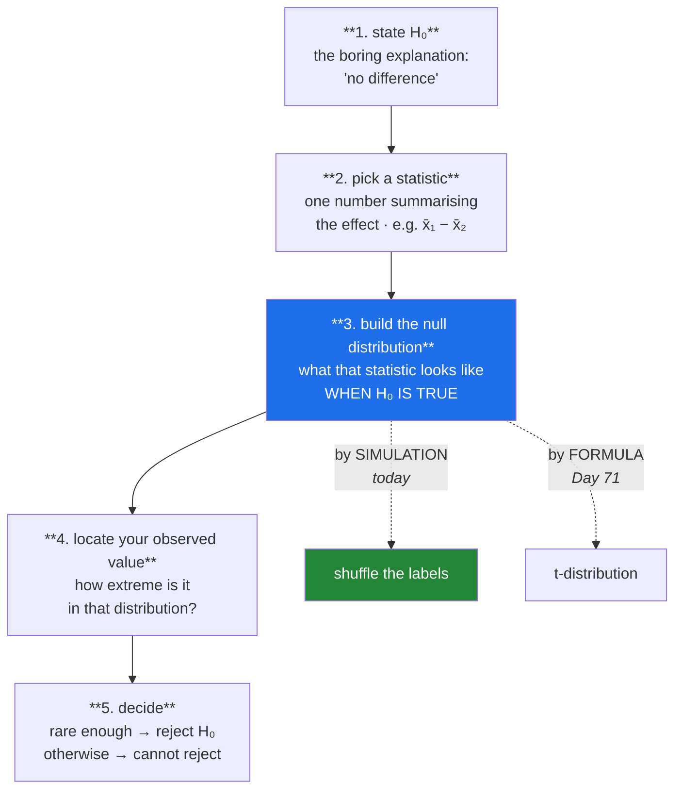

# Day 69 — Hypothesis testing: the mechanism, step by step

**Phase 9 · Module 9 · Inferential statistics** · ID: **ST-16** (hypothesis testing mechanics)

> **Yesterday:** Phase 8 closed with a coverage report and the honest sentence about intervals.
> **Today:** the machine that turns "these groups look different" into a defensible claim. You will
> build it **by simulation first** — a permutation test, which needs no distribution, no formula and
> no table — and only then meet the named tests, which are shortcuts to the same answer.
> **Tomorrow:** what the p-value it produces actually means.

```bash
./m start 69 && ./m scaffold 69
```

**Time:** 110 minutes. **Request budget:** 0 model calls.

---

## §1 The story

Day 58 established the problem: **any two samples differ.** Two draws from an identical population
have different means. So "group A scored higher than group B" is never a finding — it is the
starting point.

The question a hypothesis test answers is narrow and specific:

> **If there were genuinely no difference, how often would chance alone produce a gap at least this
> large?**

That is it. Everything else — null hypotheses, test statistics, p-values, critical regions — is
machinery for answering that one question.

The mechanism has five steps, and it is worth seeing them as a *procedure* rather than a formula:



**Step 3 is the whole thing**, and it is the step textbooks obscure by jumping straight to a formula.
The null distribution is "what would this statistic look like if there were no real effect", and
there are two ways to get it: derive it mathematically, or **generate it**.

Today you generate it, with a **permutation test**:

> If the group labels are meaningless, then shuffling them should not change anything. So shuffle
> them a few thousand times, recompute the statistic each time, and see where your real value sits.

That is a complete, valid hypothesis test in eight lines. It assumes almost nothing, it works for any
statistic you can compute, and it makes step 3 something you can *see* rather than look up.

Two vocabulary points that matter later:

- **You never accept H₀.** Failing to find evidence of a difference is not evidence of no difference —
  it might just be too little data (Day 70's power). The phrasing is *"fail to reject"*, and it is
  pedantic for a good reason.
- **`α` is chosen before you look.** It is the false-positive rate you are willing to tolerate.
  Choosing it after seeing the p-value is Day 74's territory, and it is cheating.

---

## §2 Setup — run this

```bash
mkdir -p days/day-69/lab
touch days/day-69/lab/testing.py
```

`src/setu/stats.py` grows today. No new packages.

---

## §3 ST-16 — the mechanism

`days/day-69/lab/testing.py`:

```python
"""ST-16: hypothesis testing, built from simulation before formula."""

from __future__ import annotations

import numpy as np
from scipy import stats as sp

from setu.arrays import make_rng


def any_two_samples_differ() -> None:
    rng = make_rng(0)
    print("\n  ten pairs of samples from the SAME population (μ=100, n=40 each):")
    gaps = []
    for _ in range(10):
        a, b = rng.normal(100, 15, 40), rng.normal(100, 15, 40)
        gaps.append(a.mean() - b.mean())
        print(f"    x̄₁ − x̄₂ = {gaps[-1]:>+7.3f}")

    print(f"\n  largest gap purely by chance: {max(np.abs(gaps)):.3f}")
    print("  There is NO real difference here. 'The groups differ' is not a finding —")
    print("  the question is whether they differ MORE than chance produces.")


def the_permutation_test() -> None:
    rng = make_rng(1)
    control = rng.normal(100, 15, 50)
    treatment = rng.normal(107, 15, 50)          # a real 7-point effect

    observed = treatment.mean() - control.mean()
    print(f"\n  observed difference = {observed:.3f}")

    pooled = np.concatenate([control, treatment])
    n_control = len(control)

    print("\n  STEP 3 — build the null distribution by shuffling the labels:")
    null = np.empty(10_000)
    for i in range(10_000):
        shuffled = rng.permutation(pooled)
        null[i] = shuffled[n_control:].mean() - shuffled[:n_control].mean()

    print(f"    null mean = {null.mean():>7.4f}   <- centred on 0, as H₀ says")
    print(f"    null sd   = {null.std(ddof=1):>7.4f}")
    print(f"    null range= [{null.min():.2f}, {null.max():.2f}]")

    p = (np.abs(null) >= abs(observed)).mean()
    print(f"\n  STEP 4 — how many shuffles gave a gap at least this large?")
    print(f"    {int((np.abs(null) >= abs(observed)).sum()):,} of 10,000")
    print(f"    p = {p:.4f}")
    print(f"\n  STEP 5 — at α=0.05: {'reject H₀' if p < 0.05 else 'fail to reject H₀'}")

    print("\n  No formula. No table. No distributional assumption. That is a complete")
    print("  hypothesis test, and step 3 was something you WATCHED rather than looked up.")


def when_there_is_no_effect() -> None:
    rng = make_rng(2)
    a, b = rng.normal(100, 15, 50), rng.normal(100, 15, 50)      # identical populations
    observed = b.mean() - a.mean()

    pooled = np.concatenate([a, b])
    null = np.array([
        (lambda s: s[50:].mean() - s[:50].mean())(rng.permutation(pooled))
        for _ in range(10_000)
    ])
    p = (np.abs(null) >= abs(observed)).mean()

    print(f"\n  no real effect. observed = {observed:+.3f}, p = {p:.4f}")
    print(f"  the observed value sits at percentile "
          f"{(null < observed).mean() * 100:.1f} of the null distribution")
    print("\n  Unremarkable — which is the correct answer. Note we 'fail to reject',")
    print("  we do NOT conclude the groups are the same. Day 70 explains why.")


def the_p_value_definition() -> None:
    print("\n  p = P(a statistic at least this extreme | H₀ is true)")
    print("\n  Read the conditioning bar carefully. It is a probability ABOUT THE DATA,")
    print("  computed ASSUMING H₀. It is NOT:")
    print("    ✗ the probability that H₀ is true")
    print("    ✗ the probability that your result was a fluke")
    print("    ✗ one minus the probability the effect is real")
    print("\n  Those are all P(H₀ | data) — the OTHER conditional (Day 63's base-rate")
    print("  fallacy). Getting from p to P(H₀ | data) needs a prior. Day 72 does that.")


def one_sided_versus_two() -> None:
    rng = make_rng(3)
    control = rng.normal(100, 15, 40)
    treatment = rng.normal(105, 15, 40)
    observed = treatment.mean() - control.mean()

    pooled = np.concatenate([control, treatment])
    null = np.array([
        (lambda s: s[40:].mean() - s[:40].mean())(rng.permutation(pooled))
        for _ in range(10_000)
    ])

    two_sided = (np.abs(null) >= abs(observed)).mean()
    one_sided = (null >= observed).mean()

    print(f"\n  observed = {observed:+.3f}")
    print(f"  two-sided p (|gap| at least this big) = {two_sided:.4f}")
    print(f"  one-sided p (gap at least this HIGH)  = {one_sided:.4f}")
    print(f"  ratio ≈ {two_sided / one_sided:.1f}")

    print("\n  A one-sided test is roughly twice as easy to pass. That is legitimate ONLY")
    print("  if you committed to the direction BEFORE seeing the data, and a result in")
    print("  the other direction would have to be reported as a failure.")
    print("  Choosing one-sided after looking is Day 74's p-hacking.")


def the_test_statistic_is_a_choice() -> None:
    rng = make_rng(4)
    a = rng.lognormal(3.0, 0.8, 60)
    b = rng.lognormal(3.2, 0.8, 60)
    pooled = np.concatenate([a, b])

    print(f"\n  same data, three different statistics:")
    for name, fn in (
        ("difference in means", lambda x, y: y.mean() - x.mean()),
        ("difference in medians", lambda x, y: np.median(y) - np.median(x)),
        ("difference in 90th pct", lambda x, y: np.percentile(y, 90) - np.percentile(x, 90)),
    ):
        observed = fn(a, b)
        null = np.array([
            (lambda s: fn(s[:60], s[60:]))(rng.permutation(pooled)) for _ in range(4_000)
        ])
        p = (np.abs(null) >= abs(observed)).mean()
        print(f"    {name:<24} observed={observed:>8.3f}  p={p:.4f}")

    print("\n  The permutation machinery is IDENTICAL — only the statistic changed.")
    print("  That is its advantage over named tests: no formula exists for a difference")
    print("  in 90th percentiles, and it needed none.")
    print("\n  ⚠️ Choose the statistic BEFORE running all three. Picking the smallest p")
    print("     afterwards is Day 74, and it is the most common way this goes wrong.")


def the_named_test_is_a_shortcut() -> None:
    rng = make_rng(5)
    control = rng.normal(100, 15, 50)
    treatment = rng.normal(107, 15, 50)

    pooled = np.concatenate([control, treatment])
    observed = treatment.mean() - control.mean()
    null = np.array([
        (lambda s: s[50:].mean() - s[:50].mean())(rng.permutation(pooled))
        for _ in range(20_000)
    ])
    permutation_p = (np.abs(null) >= abs(observed)).mean()

    t_result = sp.ttest_ind(treatment, control)

    print(f"\n  permutation p = {permutation_p:.4f}")
    print(f"  t-test      p = {t_result.pvalue:.4f}")
    print(f"  t statistic   = {t_result.statistic:.4f}")

    standardised = (null - null.mean()) / null.std(ddof=1)
    print(f"\n  the null distribution you BUILT, standardised:")
    print(f"    skew = {sp.skew(standardised):>7.4f}   kurtosis = {sp.kurtosis(standardised):>7.4f}")
    print("  ^ it is approximately normal — because of the CLT (Day 67).")
    print("\n  THAT is why the t-test works: it assumes the shape you just generated.")
    print("  The named test is a shortcut that skips 20,000 shuffles. When its")
    print("  assumptions hold it is faster and equally right. When they do not (Day 71),")
    print("  the permutation test still works and the shortcut does not.")


def what_a_test_cannot_tell_you() -> None:
    rng = make_rng(6)
    print("\n  the SAME 0.5-point effect, at three sample sizes:")
    for n in (30, 500, 50_000):
        a, b = rng.normal(100, 15, n), rng.normal(100.5, 15, n)
        result = sp.ttest_ind(b, a)
        cohens_d = (b.mean() - a.mean()) / np.sqrt((a.var(ddof=1) + b.var(ddof=1)) / 2)
        print(f"    n={n:>6}  p={result.pvalue:>8.5f}  effect size d={cohens_d:>6.3f}")

    print("\n  At n=50,000 a trivial effect is 'highly significant'. The p-value fell;")
    print("  the effect did not change. p answers 'is it real?', NOT 'is it big?'")
    print("  Always report the effect size and an interval (Day 68) alongside it.")


if __name__ == "__main__":
    any_two_samples_differ()
    the_permutation_test()
    when_there_is_no_effect()
    the_p_value_definition()
    one_sided_versus_two()
    the_test_statistic_is_a_choice()
    the_named_test_is_a_shortcut()
    what_a_test_cannot_tell_you()
```

**Line by line:**

- `any_two_samples_differ` — ten pairs from an **identical** population, and the largest chance gap is
  substantial. This is Day 58's point restated as the motivation: the test exists because differences
  appear for free.
- `the_permutation_test` — **the five steps, executed.** `rng.permutation(pooled)` shuffles the
  combined data, then the first 50 become "control" and the rest "treatment". If the labels carry no
  information, that reassignment is as valid as the original — which is exactly what H₀ claims.
- `null.mean() ≈ 0` — **the null distribution centres on zero automatically.** You did not impose
  that; it fell out of shuffling. Seeing it happen is the point of doing this before the formula.
- `p = (np.abs(null) >= abs(observed)).mean()` — the p-value is a **counting operation**: what
  fraction of the shuffles produced a gap at least this large. No table, no formula.
- `the_p_value_definition` — **read the conditioning bar.** `p = P(data this extreme | H₀)`. It is not
  `P(H₀ | data)`, and those are Day 63's two conditionals. Getting from one to the other requires a
  prior, which is Day 72.
- `one_sided_versus_two` — a one-sided test is roughly **twice as easy to pass**. That is legitimate
  only if you committed to the direction beforehand *and* would report an opposite-direction result as
  a failure. Choosing after looking is Day 74.
- `the_test_statistic_is_a_choice` — **the same machinery for three different statistics.** No formula
  exists for a difference in 90th percentiles, and none was needed. The warning matters as much as the
  demonstration: run all three and pick the smallest p, and you have manufactured a result.
- `the_named_test_is_a_shortcut` — **the day's payoff.** The permutation p and the t-test p agree, and
  then the null distribution you built is shown to be approximately normal — because of the CLT. **That
  is why the t-test works**: it assumes the shape you just generated by brute force. When its
  assumptions hold, the shortcut is faster and equally right; when they fail (Day 71), the permutation
  test still works.
- `what_a_test_cannot_tell_you` — **the same trivial effect at three sample sizes.** At n = 50,000 a
  half-point difference is "highly significant". The p-value fell; the effect did not change. **p
  answers "is it real?", not "is it big?"** — which is why an effect size and an interval must travel
  with it.

---

## §4 Build brief

Extend `src/setu/stats.py`:

```python
def permutation_test(a, b, statistic=None, *, alternative: str = "two-sided",
                     resamples: int = 10_000, seed: int = 42) -> dict:
    """TODO(me): a hypothesis test that assumes nothing.

    {"observed", "p_value", "null_mean", "null_sd", "resamples", "alternative",
     "n_a", "n_b", "warnings": [...]}
    - statistic(x, y) -> float, defaulting to y.mean() - x.mean()
    - pool, shuffle, split at len(a), recompute; repeat `resamples` times
    - alternative in {'two-sided', 'greater', 'less'}; else DataError
    - the p-value MUST use the (count + 1) / (resamples + 1) form: a p-value of
      exactly 0 is not a valid claim, and the +1 counts the observed arrangement
      itself, which IS one of the possible permutations
    - warn when either group has fewer than 8 values (too few distinct permutations)
    - warn when p_value is at the resolution floor (1 / (resamples + 1)) — the answer
      is 'smaller than we can measure', not the number printed
    - reproducible via make_rng(seed)
    - raise DataError on an empty group or resamples < 100
    """
    raise NotImplementedError


def null_distribution(a, b, statistic=None, *, resamples: int = 10_000, seed: int = 42):
    """TODO(me): return the null distribution ITSELF, so it can be plotted and checked.

    Returns an ndarray of length `resamples`.
    Day 75's report plots this beside the observed value — showing the null is far
    more convincing than quoting a p-value.
    """
    raise NotImplementedError


def effect_size(a, b, *, kind: str = "cohens_d") -> dict:
    """TODO(me): how BIG, not whether real.

    {"kind", "value", "magnitude": "negligible"|"small"|"medium"|"large", "n_a", "n_b"}
    - cohens_d = (mean_b - mean_a) / pooled_sd, pooled_sd from both groups with ddof=1
    - kind='hedges_g' applies the small-sample correction; say in the docstring that
      it is preferred below n=20 per group
    - kind='cliffs_delta' is rank-based, for non-normal data
    - magnitude thresholds: |d| < 0.2 negligible, < 0.5 small, < 0.8 medium, else large
    - raise DataError on an unknown kind, or a zero pooled sd (name the problem)
    - the magnitude labels are CONVENTIONS, not laws — say so in the docstring
    """
    raise NotImplementedError


def test_report(a, b, *, alpha: float = 0.05, seed: int = 42) -> dict:
    """TODO(me): everything needed to state a result honestly, in one call.

    {"p_value", "observed", "effect_size", "confidence_interval", "decision",
     "alpha", "n_a", "n_b", "warnings": [...]}
    - decision is 'reject H0' or 'fail to reject H0' — NEVER 'accept H0'
    - confidence_interval on the DIFFERENCE, via bootstrap_ci (Day 68)
    - warn when p < alpha but the effect size is negligible (§3: significant and trivial)
    - warn when p >= alpha and n is small (a null result may just be low power, Day 70)
    - this is the shape Day 75's report consumes
    """
    raise NotImplementedError


def state_result(report: dict) -> str:
    """TODO(me): one sentence, stated correctly. PURE.

    - must NOT contain 'proves', 'accept the null', or 'the probability that'
    - must include the effect size and the interval, not only the p-value
    - Day 68's describe_interval set this precedent; same reason
    """
    raise NotImplementedError
```

- The `(count + 1) / (resamples + 1)` form is the day's correctness detail. A permutation p-value of
  exactly zero claims the observed arrangement is impossible — but it happened, so it is one of the
  permutations, and the `+1` counts it.
- `null_distribution` returning the array is deliberate: **showing the null distribution is far more
  convincing than quoting a p-value**, and Day 75's report plots it.
- `test_report` warning when a significant result has a **negligible effect size** is §3's last
  demonstration turned into something the caller cannot miss.

---

## §5 The eval that must be able to fail

Add to `tests/test_stats.py`:

```python
from setu.stats import effect_size, null_distribution, permutation_test, state_result, test_report


def test_a_real_effect_is_detected():
    rng = make_rng(0)
    result = permutation_test(rng.normal(100, 15, 60), rng.normal(112, 15, 60))
    assert result["p_value"] < 0.01


def test_no_effect_gives_an_unremarkable_p():
    rng = make_rng(1)
    result = permutation_test(rng.normal(100, 15, 60), rng.normal(100, 15, 60))
    assert result["p_value"] > 0.05


def test_the_null_distribution_is_centred_on_zero():
    """You did not impose this — shuffling produced it."""
    rng = make_rng(2)
    result = permutation_test(rng.normal(100, 15, 50), rng.normal(108, 15, 50))
    assert abs(result["null_mean"]) < result["null_sd"] / 4


def test_the_p_value_can_never_be_exactly_zero():
    """The observed arrangement IS one of the permutations."""
    rng = make_rng(3)
    result = permutation_test(rng.normal(0, 1, 60), rng.normal(20, 1, 60), resamples=1_000)
    assert result["p_value"] > 0
    assert result["p_value"] == pytest.approx(1 / 1_001, rel=1e-6)


def test_a_floor_p_value_carries_a_warning():
    rng = make_rng(4)
    result = permutation_test(rng.normal(0, 1, 60), rng.normal(20, 1, 60), resamples=1_000)
    assert any("resolution" in w.lower() or "smaller" in w.lower() for w in result["warnings"])


def test_the_permutation_p_matches_the_t_test():
    """The named test is a shortcut to the same answer."""
    from scipy import stats as sp

    rng = make_rng(5)
    a, b = rng.normal(100, 15, 80), rng.normal(107, 15, 80)
    permutation = permutation_test(a, b, resamples=20_000)["p_value"]
    parametric = sp.ttest_ind(b, a).pvalue
    assert permutation == pytest.approx(parametric, abs=0.02)


def test_one_sided_is_roughly_half_of_two_sided():
    rng = make_rng(6)
    a, b = rng.normal(100, 15, 60), rng.normal(106, 15, 60)
    two = permutation_test(a, b, alternative="two-sided", resamples=20_000)["p_value"]
    one = permutation_test(a, b, alternative="greater", resamples=20_000)["p_value"]
    assert one == pytest.approx(two / 2, rel=0.25)


def test_the_wrong_one_sided_direction_gives_a_large_p():
    rng = make_rng(7)
    a, b = rng.normal(100, 15, 60), rng.normal(112, 15, 60)
    assert permutation_test(a, b, alternative="less", resamples=5_000)["p_value"] > 0.9


def test_unknown_alternative_raises():
    with pytest.raises(DataError):
        permutation_test([1.0, 2.0], [3.0, 4.0], alternative="different")


def test_it_works_on_a_statistic_with_no_formula():
    """No textbook SE exists for a difference in 90th percentiles."""
    rng = make_rng(8)
    a, b = rng.lognormal(3.0, 0.8, 80), rng.lognormal(3.4, 0.8, 80)
    result = permutation_test(
        a, b,
        statistic=lambda x, y: np.percentile(y, 90) - np.percentile(x, 90),
        resamples=5_000,
    )
    assert result["p_value"] < 0.1
    assert result["observed"] > 0


def test_tiny_groups_are_warned_about():
    result = permutation_test([1.0, 2.0, 3.0], [4.0, 5.0, 6.0], resamples=1_000)
    assert result["warnings"]


def test_permutation_is_reproducible():
    rng = make_rng(9)
    a, b = list(rng.normal(size=40)), list(rng.normal(size=40))
    assert permutation_test(a, b, seed=7) == permutation_test(a, b, seed=7)


def test_empty_group_raises():
    with pytest.raises(DataError):
        permutation_test([], [1.0, 2.0])


def test_null_distribution_is_returned_for_plotting():
    rng = make_rng(10)
    null = null_distribution(rng.normal(size=40), rng.normal(size=40), resamples=2_000)
    assert len(null) == 2_000
    assert abs(np.mean(null)) < np.std(null)


def test_cohens_d_matches_a_hand_computation():
    a = [10.0, 12.0, 14.0, 16.0, 18.0]
    b = [14.0, 16.0, 18.0, 20.0, 22.0]
    result = effect_size(a, b)
    assert result["value"] == pytest.approx(4.0 / np.sqrt(10.0), rel=1e-6)


def test_effect_size_is_independent_of_sample_size():
    """The number a p-value cannot give you."""
    rng = make_rng(11)
    small = effect_size(list(rng.normal(100, 15, 40)), list(rng.normal(107, 15, 40)))
    large = effect_size(list(rng.normal(100, 15, 4_000)), list(rng.normal(107, 15, 4_000)))
    assert small["value"] == pytest.approx(large["value"], abs=0.25)


def test_magnitude_labels():
    rng = make_rng(12)
    base = list(rng.normal(0, 1, 3_000))
    assert effect_size(base, list(rng.normal(0.05, 1, 3_000)))["magnitude"] == "negligible"
    assert effect_size(base, list(rng.normal(1.2, 1, 3_000)))["magnitude"] == "large"


def test_hedges_g_is_smaller_than_d_on_tiny_samples():
    rng = make_rng(13)
    a, b = list(rng.normal(0, 1, 8)), list(rng.normal(1, 1, 8))
    assert abs(effect_size(a, b, kind="hedges_g")["value"]) < abs(effect_size(a, b)["value"])


def test_effect_size_rejects_a_zero_pooled_sd():
    with pytest.raises(DataError):
        effect_size([5.0, 5.0, 5.0], [7.0, 7.0, 7.0])


def test_report_never_says_accept():
    """You never accept H0 — it might just be too little data."""
    rng = make_rng(14)
    report = test_report(list(rng.normal(100, 15, 40)), list(rng.normal(100, 15, 40)))
    assert report["decision"] == "fail to reject H0"
    assert "accept" not in report["decision"].lower()


def test_report_warns_when_significant_but_trivial():
    """n=50,000 makes a half-point difference 'highly significant'."""
    rng = make_rng(15)
    report = test_report(list(rng.normal(100, 15, 20_000)), list(rng.normal(100.5, 15, 20_000)))
    assert report["p_value"] < 0.05
    assert any("effect" in w.lower() or "trivial" in w.lower() or "small" in w.lower()
               for w in report["warnings"])


def test_report_warns_when_null_result_may_be_low_power():
    rng = make_rng(16)
    report = test_report(list(rng.normal(100, 15, 8)), list(rng.normal(108, 15, 8)))
    assert report["p_value"] >= 0.05
    assert any("power" in w.lower() or "n" in w.lower() for w in report["warnings"])


def test_report_includes_an_interval_on_the_difference():
    rng = make_rng(17)
    report = test_report(list(rng.normal(100, 15, 60)), list(rng.normal(110, 15, 60)))
    interval = report["confidence_interval"]
    assert interval["low"] < interval["high"]
    assert interval["low"] > 0, "a clear effect should give an interval excluding zero"


def test_the_statement_reports_more_than_a_p_value():
    rng = make_rng(18)
    text = state_result(test_report(list(rng.normal(100, 15, 60)),
                                    list(rng.normal(110, 15, 60))))
    lowered = text.lower()
    assert "proves" not in lowered
    assert "accept the null" not in lowered
    assert "probability that" not in lowered


def test_the_statement_mentions_the_effect_size():
    rng = make_rng(19)
    text = state_result(test_report(list(rng.normal(100, 15, 60)),
                                    list(rng.normal(110, 15, 60))))
    assert any(token in text.lower() for token in ("effect", "d =", "difference of"))
```

**Line by line:**

- `test_the_p_value_can_never_be_exactly_zero` — **the day's real assessment.** With 1,000 resamples
  the floor is exactly `1/1001`, and the test pins that value. A naive `count/resamples` returns `0.0`,
  which claims the observed arrangement is impossible — yet it happened, so it is one of the
  permutations.
- `test_a_floor_p_value_carries_a_warning` — the companion. Reporting `p = 0.000999` as if it were a
  measurement is misleading; the honest statement is "smaller than we can resolve at this resolution".
- `test_the_permutation_p_matches_the_t_test` — the shortcut agreeing with the brute force. This is
  the test that makes Day 71's named tests feel like a convenience rather than a new topic.
- `test_it_works_on_a_statistic_with_no_formula` — a difference in 90th percentiles. No textbook
  standard error exists, and the same machinery handled it, which is the permutation test's real
  advantage.
- `test_effect_size_is_independent_of_sample_size` — n = 40 and n = 4,000 give the **same** effect
  size. That is precisely the number a p-value cannot give you, and it is why both must be reported.
- `test_report_never_says_accept` — asserts an **absence**. "Accept H₀" is the phrasing that turns "we
  did not find evidence" into "there is no effect", which is a different and unsupported claim.
- `test_report_warns_when_significant_but_trivial` — §3's last demonstration made unmissable. A
  p-value below 0.05 with a negligible effect size is the most common way a real analysis misleads.
- `test_the_wrong_one_sided_direction_gives_a_large_p` — a one-sided test in the wrong direction gives
  `p > 0.9` even with a large real effect. That is the cost of committing to a direction, and it is
  why choosing afterwards is cheating.

```bash
uv run python -m pytest tests/test_stats.py -v
```

---

## §6 Request budget

| Resource | Spent today |
|---|---|
| LLM calls | **0** |

---

## §7 Traps

- **"The groups differ" as a finding.** Any two samples do.
- **Reading p as `P(H₀ | data)`.** It is the other conditional (Day 63).
- **"Accept the null."** You fail to reject. It may just be too little data.
- **A p-value of exactly 0.** Use `(count + 1) / (resamples + 1)`.
- **Reporting a floor p-value as a measurement.** Say "below the resolution".
- **Choosing one-sided after seeing the direction.** Day 74.
- **Trying several statistics and reporting the best p.** Same problem.
- **Choosing α after seeing p.** It is set beforehand.
- **A p-value without an effect size.** p says "real", not "big".
- **Significance at huge n.** A trivial effect becomes "highly significant".
- **A null result read as "no effect".** It may be low power (Day 70).

---

## §8 Verify before you code

Written **2026-08-21**:

- <https://docs.scipy.org/doc/scipy/reference/generated/scipy.stats.permutation_test.html> — SciPy's
  own implementation, worth comparing against yours (Principle 2: build it first).
- <https://docs.scipy.org/doc/scipy/reference/generated/scipy.stats.ttest_ind.html> — the shortcut,
  and its assumptions (Day 71).
- <https://numpy.org/doc/stable/reference/random/generated/numpy.random.Generator.permutation.html> —
  note it returns a copy, unlike `shuffle`.

---

## §9 Say it in an interview

> "I'd build the test rather than name one, because the step textbooks skip is the important one:
> constructing the distribution of your statistic *under the null*. A permutation test does it by
> brute force — if the group labels are meaningless, shuffling them shouldn't change anything, so
> shuffle ten thousand times and see where your real value sits. That's a complete hypothesis test in
> eight lines with no distributional assumption, and it works for any statistic, including ones with
> no formula like a difference in ninetieth percentiles. Then when you compare it to a t-test the
> p-values agree, and the null distribution you generated turns out to be approximately normal because
> of the CLT — which is exactly *why* the t-test works. One implementation detail: the p-value has to
> be count-plus-one over resamples-plus-one, because a p-value of exactly zero claims the arrangement
> you observed was impossible, and it demonstrably wasn't."

---

## §10 Done when

Tick [`CHECKLIST.md`](CHECKLIST.md), then `./m check && ./m done 69`.
