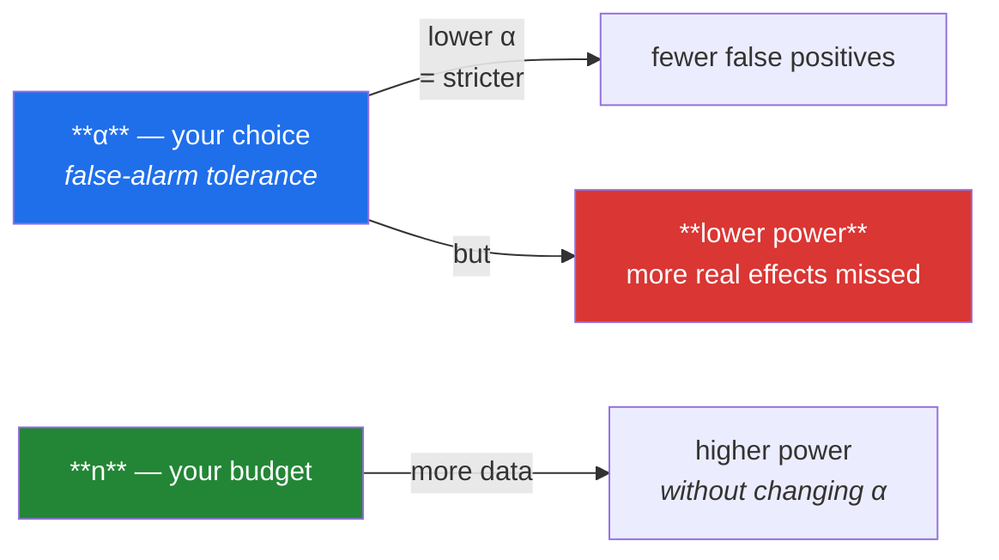

# Day 70 — p-values, significance, Type I/II error, and power

**Phase 9 · Module 9** · ID: **ST-17** (p-values, significance levels, error types, statistical power)

> **Yesterday:** the mechanism, built by shuffling.
> **Today:** the number it produces, and the two ways to be wrong. Day 65 observed that p-values are
> Uniform(0,1) under a true null — today you use that to explain why **5% of honest tests find
> something**, and why an underpowered study is worse than no study.
> **Tomorrow:** t-tests and ANOVA.

```bash
./m start 70 && ./m scaffold 70
```

**Time:** 110 minutes. **Request budget:** 0 model calls.

---

## §1 The story

Every test has two ways to be wrong, and they trade against each other:

|  | **H₀ is true** (no real effect) | **H₀ is false** (real effect) |
|---|---|---|
| **reject H₀** | **Type I error** — false positive. Rate = α | ✅ correct — **power** = 1 − β |
| **fail to reject** | ✅ correct | **Type II error** — false negative. Rate = β |

**α is a choice you make.** Setting it to 0.05 says: *I am willing to raise a false alarm 5% of the
time when nothing is happening.* That is not a discovery about the world; it is a tolerance you
declare.

**β is a consequence**, determined by the effect size, the variability, and the sample size. Its
complement — **power** — is the probability of detecting an effect that is genuinely there.



The trade is genuine: you cannot reduce both error types by adjusting α, because tightening one
loosens the other. **The only thing that improves both is more data** — which is why power is a
planning question, not an analysis one.

Two demonstrations today that change how you read published results.

**First: 5% of honest tests find something.** Day 65 showed p-values are Uniform(0,1) when H₀ is
true. Uniform means `P(p < 0.05) = 0.05` exactly. So if a hundred researchers each test a null effect
honestly, five of them get a "significant" result — and those five are the ones that get published.

**Second: underpowered studies are worse than useless.** If your power is 20%, then among the studies
that *do* reach significance, the effect sizes are systematically **inflated** — because only the
luckiest, most exaggerated samples cleared the bar. A significant result from an underpowered study is
not weak evidence; it is *biased* evidence, and the effect it reports is too big.

That second one has a name — the **winner's curse** — and it is the reason "we found p < 0.05 with
n = 20" should worry you rather than impress you.

---

## §2 Setup — run this

```bash
mkdir -p days/day-70/lab
touch days/day-70/lab/errors.py
```

`src/setu/stats.py` grows today. No new packages.

---

## §3 ST-17 — errors and power

`days/day-70/lab/errors.py`:

```python
"""ST-17: what a p-value is, the two error types, and power."""

from __future__ import annotations

import numpy as np
from scipy import stats as sp

from setu.arrays import make_rng


def p_values_are_uniform_under_the_null() -> None:
    rng = make_rng(0)
    p_values = np.array([
        sp.ttest_ind(rng.normal(100, 15, 40), rng.normal(100, 15, 40)).pvalue
        for _ in range(20_000)
    ])

    print(f"\n  20,000 tests between samples from the SAME population:")
    print(f"  {'threshold':>11} {'fraction below':>16} {'expected':>10}")
    for threshold in (0.01, 0.05, 0.10, 0.25, 0.50, 0.90):
        print(f"  {threshold:>11.2f} {(p_values < threshold).mean():>16.4f} {threshold:>10.2f}")

    print(f"\n  KS test against Uniform(0,1): p = {sp.kstest(p_values, 'uniform').pvalue:.4f}")
    print("\n  Under a true null the p-value is UNIFORM. Every value is equally likely,")
    print("  so P(p < 0.05) is exactly 0.05 — by construction, not by accident.")
    print("\n  ⚠️ 100 honest researchers testing nothing → 5 'significant' results.")
    print("     Those 5 are the ones that get written up. Day 74 is about this.")


def alpha_is_a_choice() -> None:
    print("\n  α is a TOLERANCE you declare, not a fact you discover:")
    print(f"  {'α':>7} {'false alarms per 100 null tests':>34}")
    for alpha in (0.10, 0.05, 0.01, 0.001):
        print(f"  {alpha:>7.3f} {alpha * 100:>34.1f}")

    print("\n  0.05 is a CONVENTION, from Fisher in the 1920s, and he described it as")
    print("  a convenient rule rather than a law. Particle physics uses 5σ (α ≈ 3e-7)")
    print("  because a false discovery there is catastrophically expensive.")
    print("\n  Choose α by asking: how bad is a false alarm HERE, versus a missed effect?")


def the_two_error_types() -> None:
    rng = make_rng(1)
    alpha = 0.05
    trials = 10_000

    null_p = np.array([
        sp.ttest_ind(rng.normal(100, 15, 30), rng.normal(100, 15, 30)).pvalue
        for _ in range(trials)
    ])
    type_one = (null_p < alpha).mean()

    effect_p = np.array([
        sp.ttest_ind(rng.normal(100, 15, 30), rng.normal(108, 15, 30)).pvalue
        for _ in range(trials)
    ])
    type_two = (effect_p >= alpha).mean()

    print(f"\n  α = {alpha}, n = 30 per group, real effect = 8 points (d ≈ 0.53)")
    print(f"\n  {'':<26} {'rate':>8}")
    print(f"  {'Type I  (false alarm)':<26} {type_one:>8.4f}   <- should equal α")
    print(f"  {'Type II (missed effect)':<26} {type_two:>8.4f}")
    print(f"  {'power  (1 − β)':<26} {1 - type_two:>8.4f}")

    print("\n  The Type I rate lands on α because that is what α MEANS — it is the")
    print("  false-positive rate you configured. Type II is a consequence you did not")
    print("  choose, and here you would miss this real effect nearly half the time.")


def the_trade_off_is_real() -> None:
    rng = make_rng(2)
    trials = 8_000

    null_p = np.array([
        sp.ttest_ind(rng.normal(100, 15, 30), rng.normal(100, 15, 30)).pvalue
        for _ in range(trials)
    ])
    effect_p = np.array([
        sp.ttest_ind(rng.normal(100, 15, 30), rng.normal(108, 15, 30)).pvalue
        for _ in range(trials)
    ])

    print(f"\n  {'α':>8} {'Type I':>9} {'Type II':>9} {'power':>8}")
    for alpha in (0.20, 0.10, 0.05, 0.01, 0.001):
        print(f"  {alpha:>8.3f} {(null_p < alpha).mean():>9.4f} "
              f"{(effect_p >= alpha).mean():>9.4f} {(effect_p < alpha).mean():>8.4f}")

    print("\n  Read the two middle columns moving in OPPOSITE directions. Tightening α")
    print("  buys fewer false alarms and costs you real effects. There is no α that")
    print("  fixes both — only more data does that.")


def power_depends_on_four_things() -> None:
    rng = make_rng(3)

    def power_at(*, n, effect, sigma=15.0, alpha=0.05, trials=4_000):
        p = np.array([
            sp.ttest_ind(rng.normal(100, sigma, n), rng.normal(100 + effect, sigma, n)).pvalue
            for _ in range(trials)
        ])
        return (p < alpha).mean()

    print(f"\n  power as each input varies (baseline: n=30, effect=8, σ=15, α=0.05):")
    print(f"\n  {'n':>6} {'power':>8}")
    for n in (10, 20, 30, 60, 120, 300):
        print(f"  {n:>6} {power_at(n=n, effect=8):>8.3f}")

    print(f"\n  {'effect':>6} {'power':>8}")
    for effect in (2, 4, 8, 15, 25):
        print(f"  {effect:>6} {power_at(n=30, effect=effect):>8.3f}")

    print(f"\n  {'σ':>6} {'power':>8}")
    for sigma in (5, 10, 15, 30):
        print(f"  {sigma:>6} {power_at(n=30, effect=8, sigma=sigma):>8.3f}")

    print("\n  Power rises with n and with the effect size; it falls as noise rises.")
    print("  You control n. You cannot control the effect. Reducing σ — better")
    print("  measurement, matched pairs — is the underrated third lever.")


def the_convention_and_what_it_costs() -> None:
    print("\n  the usual target is 80% power. That means:")
    print("    - you accept MISSING a real effect 20% of the time")
    print("    - against a 5% false-alarm rate")
    print("    - i.e. a Type II error is treated as 4x less costly than a Type I")
    print("\n  Is that right for your problem? For a medical screen a missed case may")
    print("  be far worse than a false alarm, and 80% is indefensible. State the ratio")
    print("  you are implicitly choosing rather than inheriting 80% by default.")


def the_winners_curse() -> None:
    rng = make_rng(4)
    true_effect = 5.0

    print(f"\n  true effect = {true_effect}. Among the tests that reach p < 0.05,")
    print(f"  what effect size do they REPORT?")
    print(f"\n  {'n':>6} {'power':>8} {'reported effect | significant':>32} {'inflation':>11}")

    for n in (10, 20, 50, 200, 1_000):
        observed, significant = [], []
        for _ in range(4_000):
            a = rng.normal(100, 15, n)
            b = rng.normal(100 + true_effect, 15, n)
            diff = b.mean() - a.mean()
            observed.append(diff)
            if sp.ttest_ind(b, a).pvalue < 0.05:
                significant.append(diff)

        power = len(significant) / 4_000
        reported = np.mean(significant) if significant else float("nan")
        print(f"  {n:>6} {power:>8.3f} {reported:>32.2f} {reported / true_effect:>11.2f}x")

    print("\n  ⚠️ At n=10 the power is low AND the published effect is inflated several-fold.")
    print("     Only the luckiest, most exaggerated samples cleared the bar.")
    print("\n  An underpowered significant result is not WEAK evidence — it is BIASED")
    print("  evidence, and the effect it reports is systematically too large.")
    print("  This is the winner's curse, and it is why 'p<0.05 with n=20' should worry you.")


def a_null_result_is_not_no_effect() -> None:
    rng = make_rng(5)
    a, b = rng.normal(100, 15, 12), rng.normal(106, 15, 12)
    result = sp.ttest_ind(b, a)

    print(f"\n  n=12 per group, real effect = 6 points")
    print(f"  p = {result.pvalue:.4f} -> fail to reject H₀")

    power = np.mean([
        sp.ttest_ind(rng.normal(100, 15, 12), rng.normal(106, 15, 12)).pvalue < 0.05
        for _ in range(4_000)
    ])
    print(f"  but the power to detect this effect at n=12 is only {power:.3f}")

    print("\n  So the test would MISS this real effect most of the time. 'Not significant'")
    print("  here means 'we could not have seen it anyway', not 'there is nothing there'.")
    print("\n  Report power (or an interval, Day 68) with every null result. A wide")
    print("  interval containing zero AND containing large effects says 'we learned little'.")


def sample_size_planning() -> None:
    from statistics import NormalDist

    print("\n  planning: what n do you need for 80% power at α=0.05?")
    z_alpha = NormalDist().inv_cdf(0.975)
    z_beta = NormalDist().inv_cdf(0.80)

    print(f"\n  {'effect (d)':>11} {'n per group':>13}")
    for d in (0.2, 0.3, 0.5, 0.8, 1.2):
        n = 2 * ((z_alpha + z_beta) / d) ** 2
        print(f"  {d:>11.1f} {int(np.ceil(n)):>13}")

    print("\n  n scales with 1/d². Halving the effect you want to detect QUADRUPLES the")
    print("  sample — Day 67's √n rule, arriving from the other direction.")
    print("\n  Do this BEFORE collecting data. Afterwards it is only useful for")
    print("  explaining a null result, and 'post-hoc power' computed from the observed")
    print("  effect is circular — it is just a restatement of the p-value.")


if __name__ == "__main__":
    p_values_are_uniform_under_the_null()
    alpha_is_a_choice()
    the_two_error_types()
    the_trade_off_is_real()
    power_depends_on_four_things()
    the_convention_and_what_it_costs()
    the_winners_curse()
    a_null_result_is_not_no_effect()
    sample_size_planning()
```

**Line by line:**

- `p_values_are_uniform_under_the_null` — **the table is the proof.** The fraction below every
  threshold equals that threshold, and the KS test confirms uniformity. So `P(p < 0.05) = 0.05` is
  not a coincidence — it is what α *means*, and it is why a hundred honest researchers testing nothing
  produce five publishable results.
- `alpha_is_a_choice` — 0.05 is a **convention** from Fisher in the 1920s, described by him as
  convenient rather than principled. Particle physics uses 5σ because a false discovery is enormously
  expensive there. **Choose α by asking how bad a false alarm is here, versus a missed effect.**
- `the_two_error_types` — the Type I rate lands **on α**, because that is what α means. Type II is not
  chosen; here you would miss a genuine 8-point effect nearly half the time at n = 30.
- `the_trade_off_is_real` — **read the two middle columns moving in opposite directions.** Tightening α
  buys fewer false alarms and costs real effects. No value of α fixes both; only more data does.
- `power_depends_on_four_things` — three tables. Power rises with `n` and with the effect, and falls as
  σ rises. **You control `n`. You cannot control the effect. Reducing σ is the underrated third
  lever** — better measurement, matched pairs, blocking.
- `the_convention_and_what_it_costs` — 80% power against 5% α implies a Type II error is **four times
  less costly** than a Type I. For a medical screen that is often indefensible. State the ratio you
  are implicitly choosing.
- `the_winners_curse` — **the demonstration that changes how you read papers.** At n = 10 the power is
  low *and* the reported effect among significant results is inflated several-fold, because only the
  most exaggerated samples cleared the bar. **An underpowered significant result is biased evidence,
  not weak evidence**, and the effect it reports is systematically too large.
- `a_null_result_is_not_no_effect` — a real 6-point effect, `p > 0.05`, and power around 0.2. "Not
  significant" here means *we could not have seen it anyway*. **Report power or an interval with every
  null result**; a wide interval containing both zero and large effects says "we learned little".
- `sample_size_planning` — `n` scales with `1/d²`, so halving the detectable effect **quadruples** the
  sample. And the warning matters: **post-hoc power computed from the observed effect is circular** —
  it is a monotone function of the p-value and adds nothing.

---

## §4 Build brief

Extend `src/setu/stats.py`:

```python
def error_rates(*, effect: float, sigma: float, n: int, alpha: float = 0.05,
                trials: int = 5_000, seed: int = 42) -> dict:
    """TODO(me): measure both error types by simulation.

    {"alpha", "type_i", "type_ii", "power", "effect", "sigma", "n"}
    - type_i: simulate with NO effect, count p < alpha (should land on alpha)
    - type_ii: simulate WITH the effect, count p >= alpha
    - power = 1 - type_ii
    - vectorised where possible; raise DataError if n < 2, sigma <= 0, or trials < 500
    - reproducible via make_rng(seed)
    """
    raise NotImplementedError


def power_analysis(*, effect_size: float, alpha: float = 0.05, power: float = 0.80,
                   ratio: float = 1.0) -> dict:
    """TODO(me): required n per group, analytically. PURE - no simulation.

    {"n_per_group", "total_n", "effect_size", "alpha", "power", "assumptions": [...]}
    - n = 2 * ((z_{1-alpha/2} + z_{power}) / d) ** 2, rounded UP
    - `ratio` allows unequal groups; document how it enters
    - `assumptions` must list what this formula takes for granted: two independent
      groups, equal variance, a two-sided test, normal-ish sampling distribution
    - raise DataError if effect_size <= 0, or alpha/power outside (0, 1)
    - raise DataError if power <= alpha (an incoherent request)
    """
    raise NotImplementedError


def minimum_detectable_effect(*, n: int, sigma: float, alpha: float = 0.05,
                              power: float = 0.80) -> dict:
    """TODO(me): the inverse question — given the data you HAVE, what could you see?

    {"mdes", "cohens_d", "n", "interpretation"}
    - this is the honest question when n is already fixed: not 'what is my power'
      but 'what is the smallest effect I could reliably detect'
    - interpretation compares mdes to plausible effect sizes in words
    - raise DataError on the usual out-of-range inputs
    """
    raise NotImplementedError


def winners_curse(*, true_effect: float, sigma: float, n: int, alpha: float = 0.05,
                  trials: int = 4_000, seed: int = 42) -> dict:
    """TODO(me): §3's demonstration, as a function.

    {"true_effect", "power", "mean_reported_effect", "inflation_factor", "n"}
    - mean_reported_effect averages the observed difference ONLY over significant runs
    - inflation_factor = mean_reported_effect / true_effect
    - when no run reaches significance, return nan for the effect and 0.0 for power
      rather than raising
    - Day 75's report uses this to argue for sample size before collection
    """
    raise NotImplementedError


def interpret_null_result(*, p_value: float, n: int, sigma: float,
                          smallest_effect_of_interest: float, alpha: float = 0.05) -> dict:
    """TODO(me): distinguish 'no effect' from 'no power'. PURE-ish.

    {"conclusion": "underpowered" | "evidence of no meaningful effect" | "significant",
     "power_for_smallest_effect": float, "recommendation": str}
    - if p < alpha: 'significant', and the rest is not applicable
    - if power for the smallest effect of interest is below 0.8: 'underpowered' —
      the study could not have detected what you care about
    - only when power is adequate may you say 'evidence of no meaningful effect'
    - NEVER return 'no effect' as a conclusion
    - raise DataError if smallest_effect_of_interest <= 0
    """
    raise NotImplementedError
```

- `interpret_null_result` **refusing to ever say "no effect"** is the day's design decision. The
  distinction between *we found nothing* and *we could not have found anything* is the single most
  useful thing this day teaches, and encoding it in the return values means it cannot be skipped.
- `minimum_detectable_effect` reframes the question honestly. Once `n` is fixed, "what is my power?"
  invites the circular post-hoc calculation; "what is the smallest effect I could have seen?" does not.
- `power_analysis` listing its **assumptions** matters because the formula is used far outside the
  conditions it was derived under.

---

## §5 The eval that must be able to fail

Add to `tests/test_stats.py`:

```python
from setu.stats import (
    error_rates,
    interpret_null_result,
    minimum_detectable_effect,
    power_analysis,
    winners_curse,
)


def test_the_type_one_rate_lands_on_alpha():
    """That is what alpha MEANS."""
    result = error_rates(effect=0.0, sigma=15.0, n=30, alpha=0.05, trials=8_000)
    assert result["type_i"] == pytest.approx(0.05, abs=0.012)


@pytest.mark.parametrize("alpha", [0.01, 0.10, 0.20])
def test_the_type_one_rate_follows_whatever_alpha_you_choose(alpha):
    result = error_rates(effect=0.0, sigma=15.0, n=40, alpha=alpha, trials=8_000)
    assert result["type_i"] == pytest.approx(alpha, abs=max(0.015, alpha * 0.25))


def test_power_and_type_two_are_complements():
    result = error_rates(effect=8.0, sigma=15.0, n=30)
    assert result["power"] == pytest.approx(1 - result["type_ii"])


def test_power_rises_with_n():
    small = error_rates(effect=6.0, sigma=15.0, n=15)["power"]
    large = error_rates(effect=6.0, sigma=15.0, n=150)["power"]
    assert large > small + 0.3


def test_power_rises_with_the_effect():
    weak = error_rates(effect=2.0, sigma=15.0, n=50)["power"]
    strong = error_rates(effect=12.0, sigma=15.0, n=50)["power"]
    assert strong > weak + 0.5


def test_power_falls_as_noise_rises():
    """The underrated third lever."""
    quiet = error_rates(effect=8.0, sigma=5.0, n=30)["power"]
    noisy = error_rates(effect=8.0, sigma=30.0, n=30)["power"]
    assert quiet > noisy + 0.4


def test_tightening_alpha_costs_power():
    """The trade-off is real: no alpha fixes both."""
    loose = error_rates(effect=6.0, sigma=15.0, n=40, alpha=0.10)
    strict = error_rates(effect=6.0, sigma=15.0, n=40, alpha=0.001)
    assert strict["type_i"] < loose["type_i"]
    assert strict["power"] < loose["power"]


def test_error_rates_rejects_bad_inputs():
    for kwargs in ({"n": 1}, {"sigma": 0.0}, {"trials": 10}):
        with pytest.raises(DataError):
            error_rates(**{"effect": 5.0, "sigma": 15.0, "n": 30, **kwargs})


def test_required_n_scales_with_one_over_d_squared():
    """Halving the detectable effect quadruples the sample."""
    big = power_analysis(effect_size=0.5)["n_per_group"]
    small = power_analysis(effect_size=0.25)["n_per_group"]
    assert small == pytest.approx(4 * big, rel=0.05)


def test_power_analysis_matches_the_textbook_number():
    """d=0.5, alpha=0.05, power=0.80 is about 63 per group."""
    assert power_analysis(effect_size=0.5)["n_per_group"] == pytest.approx(63, abs=3)


def test_power_analysis_prediction_matches_simulation():
    """The formula and the simulation must agree."""
    required = power_analysis(effect_size=0.5)["n_per_group"]
    measured = error_rates(effect=0.5 * 15.0, sigma=15.0, n=required, trials=8_000)["power"]
    assert measured == pytest.approx(0.80, abs=0.05)


def test_power_analysis_lists_its_assumptions():
    result = power_analysis(effect_size=0.5)
    assert len(result["assumptions"]) >= 3


def test_power_analysis_rejects_incoherent_requests():
    with pytest.raises(DataError):
        power_analysis(effect_size=0.5, alpha=0.10, power=0.05)
    with pytest.raises(DataError):
        power_analysis(effect_size=0.0)


def test_the_minimum_detectable_effect_shrinks_with_n():
    small = minimum_detectable_effect(n=20, sigma=15.0)["mdes"]
    large = minimum_detectable_effect(n=500, sigma=15.0)["mdes"]
    assert large < small / 3


def test_mdes_round_trips_with_power_analysis():
    mdes = minimum_detectable_effect(n=63, sigma=15.0)["mdes"]
    required = power_analysis(effect_size=mdes / 15.0)["n_per_group"]
    assert required == pytest.approx(63, abs=4)


def test_underpowered_studies_inflate_the_effect():
    """The winner's curse — an underpowered significant result is BIASED."""
    result = winners_curse(true_effect=5.0, sigma=15.0, n=10, trials=6_000)
    assert result["power"] < 0.3
    assert result["inflation_factor"] > 1.5


def test_well_powered_studies_report_honest_effects():
    result = winners_curse(true_effect=5.0, sigma=15.0, n=1_000, trials=3_000)
    assert result["power"] > 0.9
    assert result["inflation_factor"] == pytest.approx(1.0, abs=0.1)


def test_inflation_falls_as_power_rises():
    factors = [
        winners_curse(true_effect=5.0, sigma=15.0, n=n, trials=4_000)["inflation_factor"]
        for n in (10, 30, 100, 500)
    ]
    assert factors == sorted(factors, reverse=True)


def test_winners_curse_handles_zero_significant_runs():
    result = winners_curse(true_effect=0.01, sigma=50.0, n=4, trials=500)
    assert result["power"] >= 0.0
    assert np.isnan(result["mean_reported_effect"]) or result["power"] > 0


def test_a_null_result_at_low_power_is_called_underpowered():
    result = interpret_null_result(
        p_value=0.30, n=12, sigma=15.0, smallest_effect_of_interest=6.0
    )
    assert result["conclusion"] == "underpowered"
    assert result["power_for_smallest_effect"] < 0.8


def test_a_null_result_at_high_power_is_evidence_of_no_meaningful_effect():
    result = interpret_null_result(
        p_value=0.60, n=5_000, sigma=15.0, smallest_effect_of_interest=6.0
    )
    assert result["conclusion"] == "evidence of no meaningful effect"


def test_it_never_concludes_no_effect():
    """The distinction this whole day exists to teach."""
    for n in (5, 50, 500, 50_000):
        result = interpret_null_result(
            p_value=0.40, n=n, sigma=15.0, smallest_effect_of_interest=6.0
        )
        assert result["conclusion"] != "no effect"
        assert "no effect" not in result["conclusion"] or "meaningful" in result["conclusion"]


def test_a_significant_p_short_circuits():
    result = interpret_null_result(
        p_value=0.001, n=12, sigma=15.0, smallest_effect_of_interest=6.0
    )
    assert result["conclusion"] == "significant"


def test_interpret_requires_a_smallest_effect_of_interest():
    with pytest.raises(DataError):
        interpret_null_result(p_value=0.3, n=30, sigma=15.0, smallest_effect_of_interest=0.0)


def test_p_values_are_uniform_under_the_null():
    """Day 65's observation, and the reason 5% of honest tests find something."""
    from scipy import stats as sp

    rng = make_rng(99)
    p_values = np.array([
        sp.ttest_ind(rng.normal(100, 15, 30), rng.normal(100, 15, 30)).pvalue
        for _ in range(5_000)
    ])
    assert sp.kstest(p_values, "uniform").pvalue > 0.01
    assert (p_values < 0.05).mean() == pytest.approx(0.05, abs=0.012)
```

**Line by line:**

- `test_the_type_one_rate_follows_whatever_alpha_you_choose` — three values of α, and the measured
  false-positive rate tracks each. **This is what makes α a choice rather than a discovery**, and
  testing it at several values proves the relationship rather than one lucky agreement.
- `test_underpowered_studies_inflate_the_effect` — **the day's real assessment.** At n = 10, power
  under 0.3 *and* an inflation factor above 1.5. Two assertions together are the point: low power and
  biased reporting arrive as a pair.
- `test_inflation_falls_as_power_rises` — asserts the list is **monotonically decreasing** across four
  sample sizes, which is a structural claim rather than a single lucky number.
- `test_it_never_concludes_no_effect` — asserts an **absence**, across four sample sizes including
  n = 50,000. Even with enormous data the honest phrasing is "evidence of no *meaningful* effect",
  because a test cannot rule out an arbitrarily small one.
- `test_power_analysis_prediction_matches_simulation` — the analytic formula and the brute-force
  simulation must agree. **This is the test that validates the formula rather than trusting it**, and
  it is the same instinct as Day 69's permutation-versus-t-test check.
- `test_power_analysis_matches_the_textbook_number` — d = 0.5 at 80% power needs about 63 per group.
  A number worth recognising, and it catches a factor-of-two slip in the formula.
- `test_mdes_round_trips_with_power_analysis` — the two functions are inverses, so composing them must
  return you to where you started.
- `test_tightening_alpha_costs_power` — **two assertions in opposite directions.** A stricter α gives
  fewer false positives *and* less power, which is the trade-off made non-negotiable.

```bash
uv run python -m pytest tests/test_stats.py -v
```

---

## §6 Request budget

| Resource | Spent today |
|---|---|
| LLM calls | **0** |
| Compute | a few hundred thousand simulated tests |

---

## §7 Traps

- **Treating α = 0.05 as a law.** It is a 1920s convention, chosen for convenience.
- **Believing a p-value is the probability H₀ is true.** Day 69, and Day 63.
- **Forgetting p is uniform under the null.** That is why 5% of honest tests "find" something.
- **Reading a null result as "no effect".** It may be "no power".
- **Trusting a significant result from a small study.** The winner's curse inflates it.
- **Post-hoc power from the observed effect.** Circular; it restates the p-value.
- **Inheriting 80% power without thinking.** It implies a 4:1 cost ratio you should state.
- **Thinking a lower α is simply safer.** It costs power.
- **Ignoring σ as a lever.** Better measurement raises power without more data.
- **Planning n after collecting data.** The calculation is for before.
- **Reporting a null result with no interval and no power.** The reader cannot judge it.

---

## §8 Verify before you code

Written **2026-08-21**:

- <https://docs.scipy.org/doc/scipy/reference/generated/scipy.stats.ttest_ind.html> — the test used
  throughout today's simulations.
- <https://docs.scipy.org/doc/scipy/reference/generated/scipy.stats.power.html> — SciPy's power tools;
  check what exists in your pinned version.
- <https://www.statsmodels.org/stable/stats.html#power-and-sample-size-calculations> — statsmodels'
  `TTestIndPower`, worth comparing against your formula.
- <https://docs.scipy.org/doc/scipy/reference/generated/scipy.stats.kstest.html> — the uniformity check.

---

## §9 Say it in an interview

> "Two ways to be wrong, and they trade against each other. Alpha is a choice — it's the false-alarm
> rate you declare — and beta is a consequence of the effect size, the noise and your sample size.
> The demonstration I'd point at is the winner's curse: if you simulate a real five-point effect at
> n=10, the power is under thirty per cent, *and* among the runs that reach significance the average
> reported effect is inflated well over the truth. So an underpowered significant result isn't weak
> evidence, it's biased evidence — only the luckiest, most exaggerated samples cleared the bar. That's
> why 'p under 0.05 with n=20' should worry you rather than impress you. The other thing I built in is
> that my null-result interpreter can never return 'no effect'. It returns 'underpowered' or 'evidence
> of no *meaningful* effect', depending on whether the study could have detected the smallest effect
> you'd care about — because 'we found nothing' and 'we couldn't have found anything' are completely
> different conclusions and they look identical in a p-value."

---

## §10 Done when

Tick [`CHECKLIST.md`](CHECKLIST.md), then `./m check && ./m done 70`.
