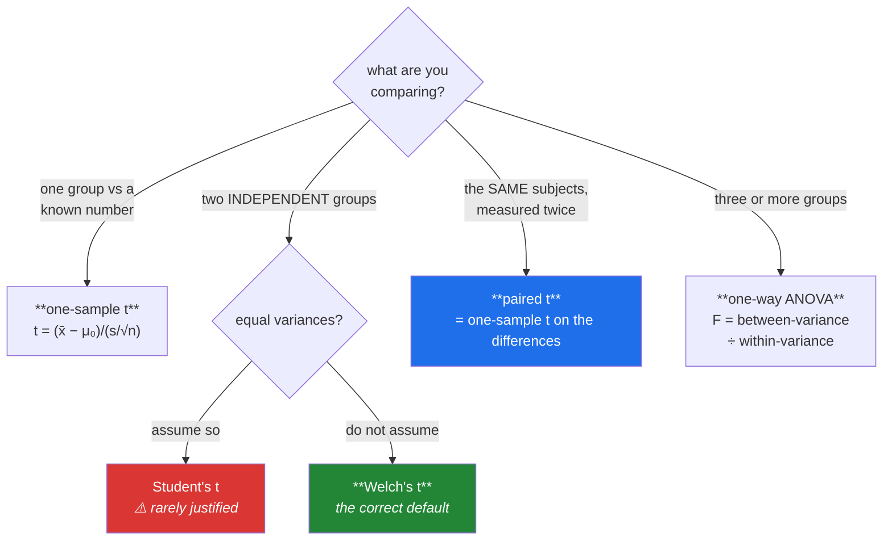

# Day 71 — t-tests and ANOVA

**Phase 9 · Module 9** · ID: **ST-18** (one-sample, two-sample and paired t-tests; one-way ANOVA)

> **Yesterday:** the two error types, and the winner's curse.
> **Today:** the named tests — which are Day 69's machinery with a formula instead of ten thousand
> shuffles. The value here is not the tests; it is knowing **which assumption each one makes and what
> happens when it fails**, measured rather than recited.
> **Tomorrow:** Bayes' theorem.

```bash
./m start 71 && ./m scaffold 71
```

**Time:** 110 minutes. **Request budget:** 0 model calls.

---

## §1 The story

Day 69 built a hypothesis test by shuffling and then showed the t-test gives the same answer. Today
you learn the family properly, because knowing which member to reach for is a real skill.



Three things are worth getting right, and each is a place people go wrong by default.

**Welch's test should be your default, not Student's.** Student's t-test assumes the two groups have
equal variance. That assumption is rarely justified and rarely checked, and when it fails the error
rate is wrong. Welch's version does not assume it, costs almost nothing when variances *are* equal,
and is what `scipy.stats.ttest_ind` gives you **only if you pass `equal_var=False`** — which is not
the default. You will measure the cost of getting this wrong in §3.

**A paired test is not a two-sample test.** If the same subjects are measured twice, the two
measurements are not independent — and pairing removes the between-subject variation entirely, which
can turn an undetectable effect into an obvious one. Running an independent test on paired data
throws away the design and wastes power. The paired test is literally a one-sample test on the
differences, which is worth seeing rather than memorising.

**ANOVA answers a narrow question.** With three or more groups, `F` tests only "are they all the
same?" — a significant result tells you **not all groups are equal** and nothing about which. That is
why post-hoc tests exist, and why running every pairwise t-test instead is Day 74's problem arriving
early.

---

## §2 Setup — run this

```bash
mkdir -p days/day-71/lab
touch days/day-71/lab/ttests.py
```

`src/setu/stats.py` grows today. No new packages.

---

## §3 ST-18 — the family

`days/day-71/lab/ttests.py`:

```python
"""ST-18: t-tests and ANOVA, with their assumptions measured."""

from __future__ import annotations

import numpy as np
from scipy import stats as sp

from setu.arrays import make_rng


def the_one_sample_t_from_scratch() -> None:
    rng = make_rng(0)
    sample = rng.normal(105, 15, 25)
    mu_zero = 100.0

    n = len(sample)
    se = sample.std(ddof=1) / np.sqrt(n)
    t = (sample.mean() - mu_zero) / se
    df = n - 1
    p = 2 * sp.t.sf(abs(t), df=df)

    print(f"\n  x̄ = {sample.mean():.3f}, s = {sample.std(ddof=1):.3f}, n = {n}")
    print(f"  SE = s/√n = {se:.4f}            <- Day 66")
    print(f"  t  = (x̄ − μ₀)/SE = {t:.4f}")
    print(f"  df = n − 1 = {df}               <- one spent estimating x̄ (Day 60)")
    print(f"  p  = 2 × sf(|t|) = {p:.4f}      <- sf, not 1−cdf (Day 64)")
    print(f"\n  scipy: {sp.ttest_1samp(sample, mu_zero).pvalue:.4f}")

    print("\n  Every piece is something you already built. t is a SIGNAL-TO-NOISE ratio:")
    print("  how many standard errors is the observed gap?")


def paired_is_one_sample_on_differences() -> None:
    rng = make_rng(1)
    subject_effect = rng.normal(100, 25, 30)          # large between-subject variation
    before = subject_effect + rng.normal(0, 4, 30)
    after = subject_effect + 6 + rng.normal(0, 4, 30)  # a real 6-point improvement

    independent = sp.ttest_ind(after, before, equal_var=False)
    paired = sp.ttest_rel(after, before)
    manual = sp.ttest_1samp(after - before, 0.0)

    print(f"\n  between-subject sd = {subject_effect.std(ddof=1):.1f}")
    print(f"  within-subject noise sd = 4, real effect = 6")
    print(f"\n  independent t : t={independent.statistic:>7.3f}  p={independent.pvalue:.4f}")
    print(f"  paired t      : t={paired.statistic:>7.3f}  p={paired.pvalue:.6f}")
    print(f"  1-sample on d : t={manual.statistic:>7.3f}  p={manual.pvalue:.6f}   <- IDENTICAL")

    print("\n  The paired test is EXACTLY a one-sample test on the differences.")
    print("  And look at the p-values: pairing removed the huge between-subject")
    print("  variation, turning an invisible effect into an obvious one.")
    print("\n  Running the independent test on paired data throws the design away.")


def student_versus_welch() -> None:
    rng = make_rng(2)
    print("\n  Type I error rate when variances DIFFER (σ₁=5, σ₂=25) and n differs:")
    print(f"  {'n₁':>5} {'n₂':>5} {'Student':>10} {'Welch':>10}")

    for n1, n2 in ((30, 30), (10, 50), (50, 10)):
        student, welch = [], []
        for _ in range(6_000):
            a = rng.normal(100, 5, n1)
            b = rng.normal(100, 25, n2)           # SAME mean — every rejection is an error
            student.append(sp.ttest_ind(a, b, equal_var=True).pvalue < 0.05)
            welch.append(sp.ttest_ind(a, b, equal_var=False).pvalue < 0.05)
        print(f"  {n1:>5} {n2:>5} {np.mean(student):>10.4f} {np.mean(welch):>10.4f}")

    print("\n  With equal n, Student survives. With UNEQUAL n and unequal variances it")
    print("  breaks badly — the false-positive rate is far from the 0.05 you configured.")
    print("  Welch holds its rate in every row.")

    print(f"\n  and the cost of Welch when variances ARE equal:")
    student, welch = [], []
    for _ in range(6_000):
        a, b = rng.normal(100, 15, 30), rng.normal(108, 15, 30)
        student.append(sp.ttest_ind(a, b, equal_var=True).pvalue < 0.05)
        welch.append(sp.ttest_ind(a, b, equal_var=False).pvalue < 0.05)
    print(f"    power — Student {np.mean(student):.4f}, Welch {np.mean(welch):.4f}")
    print("  ^ essentially nothing. Welch is nearly free insurance.")
    print("\n  ⚠️ scipy's ttest_ind defaults to equal_var=True. That default is wrong for")
    print("     almost every real comparison. Pass equal_var=False.")


def what_the_t_test_assumes() -> None:
    rng = make_rng(3)
    print("\n  Type I rate under three assumption violations (α=0.05, n=20 per group):")

    scenarios = {
        "normal (baseline)": lambda: (rng.normal(0, 1, 20), rng.normal(0, 1, 20)),
        "lognormal (skewed)": lambda: (rng.lognormal(0, 1, 20), rng.lognormal(0, 1, 20)),
        "heavy tails (t₃)": lambda: (rng.standard_t(3, 20), rng.standard_t(3, 20)),
        "one outlier added": lambda: (
            np.append(rng.normal(0, 1, 19), 30.0), rng.normal(0, 1, 20)
        ),
    }

    for name, generate in scenarios.items():
        rate = np.mean([sp.ttest_ind(*generate(), equal_var=False).pvalue < 0.05
                        for _ in range(6_000)])
        print(f"    {name:<22} {rate:.4f}")

    print("\n  Skew and heavy tails: the rate stays near 0.05 — the t-test is ROBUST")
    print("  to non-normality at reasonable n, because of the CLT (Day 67).")
    print("  The outlier row is the real risk: a single extreme value distorts both")
    print("  the mean and the sd, and the test has no defence.")
    print("\n  So the assumption people obsess over (normality) matters LESS than the")
    print("  one they ignore (independence — and outliers as a symptom of contamination).")


def independence_is_the_assumption_that_matters() -> None:
    rng = make_rng(4)
    print("\n  Type I rate when observations within a group are CORRELATED:")
    print(f"  {'within-group r':>16} {'Type I rate':>13}")

    for correlation in (0.0, 0.2, 0.5, 0.8):
        rejections = []
        for _ in range(4_000):
            shared_a = rng.normal(0, np.sqrt(correlation), 1)
            shared_b = rng.normal(0, np.sqrt(correlation), 1)
            a = shared_a + rng.normal(0, np.sqrt(1 - correlation), 30)
            b = shared_b + rng.normal(0, np.sqrt(1 - correlation), 30)
            rejections.append(sp.ttest_ind(a, b, equal_var=False).pvalue < 0.05)
        print(f"  {correlation:>16.1f} {np.mean(rejections):>13.4f}")

    print("\n  At r=0.5 the false-positive rate is several times what you asked for.")
    print("  Correlated observations mean your EFFECTIVE n is far smaller than your")
    print("  actual n — repeated measures on the same users, rows from the same session,")
    print("  time-series points. No transformation fixes it; the DESIGN must account for it.")


def anova_from_scratch() -> None:
    rng = make_rng(5)
    groups = [rng.normal(mu, 12, 25) for mu in (100.0, 100.0, 112.0)]
    everything = np.concatenate(groups)
    grand_mean = everything.mean()

    between = sum(len(g) * (g.mean() - grand_mean) ** 2 for g in groups)
    within = sum(((g - g.mean()) ** 2).sum() for g in groups)
    df_between = len(groups) - 1
    df_within = len(everything) - len(groups)

    f = (between / df_between) / (within / df_within)
    p = sp.f.sf(f, df_between, df_within)

    print(f"\n  group means: {[round(g.mean(), 2) for g in groups]}")
    print(f"  between-group SS = {between:>10.2f}  df = {df_between}")
    print(f"  within-group  SS = {within:>10.2f}  df = {df_within}")
    print(f"  F = (SS_b/df_b) / (SS_w/df_w) = {f:.4f}")
    print(f"  p = {p:.6f}")
    print(f"\n  scipy: F={sp.f_oneway(*groups).statistic:.4f}, "
          f"p={sp.f_oneway(*groups).pvalue:.6f}")

    print("\n  F is a RATIO OF VARIANCES: how much the group means differ, against how")
    print("  much the observations vary within groups. F ≈ 1 means the groups are no")
    print("  more different than chance.")
    print("\n  ⚠️ A significant F says 'not all equal'. It does NOT say which. Groups 1")
    print("     and 2 here are identical; only group 3 differs, and F cannot tell you that.")


def anova_versus_pairwise() -> None:
    rng = make_rng(6)
    k_groups = 5
    print(f"\n  {k_groups} groups with NO real differences, 4,000 trials:")

    anova_false, pairwise_false = [], []
    for _ in range(4_000):
        groups = [rng.normal(100, 15, 20) for _ in range(k_groups)]
        anova_false.append(sp.f_oneway(*groups).pvalue < 0.05)

        any_significant = any(
            sp.ttest_ind(groups[i], groups[j], equal_var=False).pvalue < 0.05
            for i in range(k_groups) for j in range(i + 1, k_groups)
        )
        pairwise_false.append(any_significant)

    n_pairs = k_groups * (k_groups - 1) // 2
    print(f"    ANOVA false-positive rate           : {np.mean(anova_false):.4f}")
    print(f"    'any of {n_pairs} pairwise t-tests' rate   : {np.mean(pairwise_false):.4f}")

    print("\n  The ANOVA holds its 5% rate. Running all 10 pairs and reporting any hit")
    print("  gives you a far higher rate — that is Day 74's multiple-comparisons problem,")
    print("  and it is exactly what the ANOVA exists to avoid.")
    print("\n  The right order: ANOVA first; only if significant, a CORRECTED post-hoc test.")


def when_to_use_a_rank_test() -> None:
    rng = make_rng(7)
    print("\n  power comparison, n=15 per group:")
    print(f"  {'data':<20} {'t-test':>9} {'Mann-Whitney':>14}")

    for name, generate in (
        ("normal, effect 8", lambda: (rng.normal(100, 15, 15), rng.normal(108, 15, 15))),
        ("lognormal, shifted", lambda: (rng.lognormal(3, 1, 15), rng.lognormal(3.5, 1, 15))),
        ("normal + outlier", lambda: (
            rng.normal(100, 15, 15), np.append(rng.normal(108, 15, 14), 400.0))),
    ):
        t_power = np.mean([sp.ttest_ind(*generate(), equal_var=False).pvalue < 0.05
                           for _ in range(3_000)])
        u_power = np.mean([sp.mannwhitneyu(*generate()).pvalue < 0.05 for _ in range(3_000)])
        print(f"  {name:<20} {t_power:>9.3f} {u_power:>14.3f}")

    print("\n  On clean normal data the t-test wins slightly. On skewed data and with")
    print("  outliers the rank test wins clearly — a rank cannot run away (Day 62).")
    print("\n  But note: Mann-Whitney tests whether one group tends to be LARGER, not")
    print("  whether the MEANS differ. Those are different questions; say which you asked.")


if __name__ == "__main__":
    the_one_sample_t_from_scratch()
    paired_is_one_sample_on_differences()
    student_versus_welch()
    what_the_t_test_assumes()
    independence_is_the_assumption_that_matters()
    anova_from_scratch()
    anova_versus_pairwise()
    when_to_use_a_rank_test()
```

**Line by line:**

- `the_one_sample_t_from_scratch` — **every piece is something you already built.** `SE` from Day 66,
  `df = n − 1` from Day 60's degrees of freedom, `sf` rather than `1 − cdf` from Day 64. `t` is a
  **signal-to-noise ratio**: how many standard errors is the observed gap.
- `paired_is_one_sample_on_differences` — the paired test and the one-sample test on differences give
  **identical** output, which is worth seeing rather than being told. And the p-values are dramatically
  different from the independent test: pairing removed the between-subject variation, turning an
  invisible effect into an obvious one. **Running an independent test on paired data throws the design
  away.**
- `student_versus_welch` — **the table that should change your default.** With equal `n`, Student's
  test survives unequal variances. With **unequal `n` and unequal variances** it breaks badly and the
  false-positive rate is nowhere near the 0.05 you configured. Welch holds its rate in every row, and
  the power cost when variances *are* equal is essentially nil. **`scipy`'s default is
  `equal_var=True`, which is wrong for almost every real comparison.**
- `what_the_t_test_assumes` — the surprising result. **Skew and heavy tails barely move the error
  rate**, because of the CLT. The outlier row is where it breaks. So the assumption people obsess over
  (normality) matters *less* than the ones they ignore.
- `independence_is_the_assumption_that_matters` — **the one nobody checks.** At within-group
  correlation 0.5 the false-positive rate is several times what you configured. Correlated observations
  mean your **effective n is far smaller** than your actual n — repeated measures, rows from the same
  session, time-series points. No transformation fixes this; the design must.
- `anova_from_scratch` — **`F` is a ratio of variances**: how much the group means differ, against how
  much observations vary within groups. `F ≈ 1` means no more different than chance. And note the
  limitation demonstrated: groups 1 and 2 are identical, only group 3 differs, and `F` cannot tell you
  that.
- `anova_versus_pairwise` — the ANOVA holds 5%; running all ten pairs and reporting any hit does not.
  **That is exactly what the ANOVA exists to avoid**, and it is Day 74 arriving early.
- `when_to_use_a_rank_test` — on clean normal data the t-test wins slightly; with skew and outliers the
  rank test wins clearly, because a rank cannot run away (Day 62). **But Mann-Whitney tests whether one
  group tends to be larger, not whether the means differ** — different questions, and you must say
  which you asked.

---

## §4 Build brief

Extend `src/setu/stats.py`:

```python
def t_test(a, b=None, *, mu: float = 0.0, paired: bool = False,
           equal_var: bool = False, alternative: str = "two-sided") -> dict:
    """TODO(me): the t-test family, with Welch as the DEFAULT.

    {"kind", "statistic", "df", "p_value", "estimate", "confidence_interval",
     "effect_size", "assumptions_checked": {...}, "warnings": [...]}
    - b=None -> one-sample against `mu`
    - paired=True -> requires equal lengths; raise DataError naming both otherwise
    - equal_var defaults to FALSE (Welch); when a caller passes True, run a variance
      ratio check and WARN if the ratio exceeds 2 or the group sizes differ by >20%
    - assumptions_checked must report: variance_ratio, n per group, max |z| outlier,
      and the skew of each group
    - warn when max |z| > 4 in either group (§3: outliers are the real risk)
    - reuse effect_size (Day 69) and confidence_interval (Day 68); do NOT reimplement
    - raise DataError on fewer than 2 values per group
    """
    raise NotImplementedError


def anova(*groups, alternative: str = "two-sided") -> dict:
    """TODO(me): one-way ANOVA, with the limitation stated in the output.

    {"f_statistic", "df_between", "df_within", "p_value", "eta_squared",
     "group_means", "group_ns", "conclusion", "next_step", "warnings": [...]}
    - eta_squared = SS_between / SS_total — the effect size ANOVA needs and rarely gets
    - `conclusion` on rejection must be 'not all group means are equal', NEVER
      'the groups differ' or anything naming a specific group
    - `next_step` must point to a corrected post-hoc test when significant
    - raise DataError with fewer than 3 groups (use t_test) or any group under 2
    - warn when the largest group variance is more than 4x the smallest (ANOVA assumes
      equal variance; Welch's ANOVA is the alternative)
    - warn when group sizes are very unequal
    """
    raise NotImplementedError


def choose_test(*, n_groups: int, paired: bool, level: Level = "ratio",
                equal_variance: bool | None = None, has_outliers: bool = False) -> dict:
    """TODO(me): recommend a test and say why. PURE.

    {"test": str, "reason": str, "alternatives": [...]}
    - ordinal level -> rank-based (Mann-Whitney / Kruskal-Wallis), never a t-test
    - nominal level -> raise DataError pointing at chi-square (Day 73)
    - paired with 2 groups -> paired t (or Wilcoxon signed-rank if outliers/ordinal)
    - 2 independent groups -> Welch's t by default; rank test if has_outliers
    - 3+ groups -> ANOVA (or Kruskal-Wallis)
    - the reason must name the DECIDING factor, not just restate the inputs
    """
    raise NotImplementedError


def effective_n(values, *, correlation: float) -> dict:
    """TODO(me): §3's warning, quantified.

    {"n", "correlation", "effective_n", "inflation_of_error"}
    - effective_n = n / (1 + (n - 1) * correlation)  — the design-effect formula
    - correlation must be in [0, 1); raise DataError otherwise
    - at correlation=0 effective_n equals n
    - this is what to report when observations are clustered, instead of pretending
    """
    raise NotImplementedError


def assumption_report(*groups) -> dict:
    """TODO(me): check what actually matters, in priority order.

    {"n_per_group", "variance_ratio", "max_abs_z", "skews",
     "concerns": [...], "verdict": str}
    - concerns ordered by SEVERITY, not by tradition: outliers and unequal n with
      unequal variance FIRST, non-normality last (§3 measured why)
    - verdict is 'proceed', 'proceed with Welch', or 'consider a rank test'
    - independence CANNOT be checked from the data; the report must say so explicitly
    """
    raise NotImplementedError
```

- `t_test` defaulting to **`equal_var=False`** inverts SciPy's default, and §3 measured why. A library
  that repeats a bad default because the underlying one does is not adding value.
- `assumption_report` ordering concerns **by measured severity rather than tradition** is the day's
  design opinion: normality is checked last because §3 showed it matters least.
- The explicit "independence cannot be checked from the data" line is important — it is the assumption
  that matters most and the only one no function can verify.

---

## §5 The eval that must be able to fail

Add to `tests/test_stats.py`:

```python
from setu.stats import anova, assumption_report, choose_test, effective_n, t_test


def test_one_sample_matches_scipy():
    from scipy import stats as sp

    values = list(make_rng(0).normal(105, 15, 30))
    assert t_test(values, mu=100.0)["p_value"] == pytest.approx(
        sp.ttest_1samp(values, 100.0).pvalue
    )


def test_welch_is_the_default():
    """SciPy's default is equal_var=True. That is wrong for most comparisons."""
    import inspect

    assert inspect.signature(t_test).parameters["equal_var"].default is False


def test_paired_equals_one_sample_on_the_differences():
    rng = make_rng(1)
    before = rng.normal(100, 25, 40)
    after = before + 6 + rng.normal(0, 4, 40)
    paired = t_test(list(before), list(after), paired=True)
    on_differences = t_test(list(after - before), mu=0.0)
    assert paired["p_value"] == pytest.approx(on_differences["p_value"], rel=1e-9)


def test_pairing_beats_independence_on_paired_data():
    """Pairing removes between-subject variation."""
    rng = make_rng(2)
    subject = rng.normal(100, 30, 40)
    before, after = subject + rng.normal(0, 3, 40), subject + 5 + rng.normal(0, 3, 40)
    paired = t_test(list(before), list(after), paired=True)["p_value"]
    independent = t_test(list(before), list(after))["p_value"]
    assert paired < independent / 100


def test_paired_rejects_unequal_lengths():
    with pytest.raises(DataError) as info:
        t_test([1.0, 2.0, 3.0], [1.0, 2.0], paired=True)
    assert "3" in str(info.value) and "2" in str(info.value)


def test_equal_var_true_warns_when_variances_differ():
    rng = make_rng(3)
    result = t_test(list(rng.normal(100, 5, 20)), list(rng.normal(100, 25, 50)),
                    equal_var=True)
    assert result["warnings"], "Student's t with 5:1 variances and unequal n went unwarned"


def test_outliers_are_flagged():
    """The assumption violation that actually breaks the test."""
    rng = make_rng(4)
    contaminated = list(np.append(rng.normal(0, 1, 29), 40.0))
    result = t_test(contaminated, list(rng.normal(0, 1, 30)))
    assert any("outlier" in w.lower() or "extreme" in w.lower() for w in result["warnings"])


def test_skewed_data_alone_does_not_warn():
    """The t-test is robust to skew at reasonable n — do not cry wolf."""
    rng = make_rng(5)
    result = t_test(list(rng.lognormal(0, 0.5, 100)), list(rng.lognormal(0, 0.5, 100)))
    assert not any("normal" in w.lower() for w in result["warnings"])


def test_the_result_carries_an_effect_size_and_an_interval():
    rng = make_rng(6)
    result = t_test(list(rng.normal(100, 15, 60)), list(rng.normal(112, 15, 60)))
    assert result["effect_size"]["value"] > 0.5
    assert result["confidence_interval"]["low"] < result["confidence_interval"]["high"]


def test_assumptions_are_reported():
    rng = make_rng(7)
    checked = t_test(list(rng.normal(0, 1, 30)), list(rng.normal(0, 3, 30)))["assumptions_checked"]
    assert checked["variance_ratio"] > 5
    assert "max_abs_z" in checked


def test_anova_matches_scipy():
    from scipy import stats as sp

    rng = make_rng(8)
    groups = [list(rng.normal(mu, 12, 25)) for mu in (100.0, 100.0, 112.0)]
    assert anova(*groups)["p_value"] == pytest.approx(sp.f_oneway(*groups).pvalue)


def test_f_is_near_one_when_nothing_differs():
    rng = make_rng(9)
    groups = [list(rng.normal(100, 15, 200)) for _ in range(4)]
    assert anova(*groups)["f_statistic"] == pytest.approx(1.0, abs=0.6)


def test_anova_never_names_a_group():
    """A significant F says 'not all equal' and nothing more."""
    rng = make_rng(10)
    groups = [list(rng.normal(mu, 10, 30)) for mu in (100.0, 100.0, 130.0)]
    result = anova(*groups)
    assert result["p_value"] < 0.001
    assert "not all" in result["conclusion"].lower()
    for token in ("group 3", "group3", "third"):
        assert token not in result["conclusion"].lower()


def test_anova_points_at_a_post_hoc_test():
    rng = make_rng(11)
    groups = [list(rng.normal(mu, 10, 30)) for mu in (100.0, 100.0, 130.0)]
    result = anova(*groups)
    assert result["next_step"]
    assert "post" in result["next_step"].lower() or "correct" in result["next_step"].lower()


def test_eta_squared_is_reported_and_bounded():
    rng = make_rng(12)
    groups = [list(rng.normal(mu, 10, 30)) for mu in (100.0, 105.0, 130.0)]
    eta = anova(*groups)["eta_squared"]
    assert 0.0 <= eta <= 1.0
    assert eta > 0.2, "a large real difference should explain a lot of variance"


def test_anova_warns_on_very_unequal_variances():
    rng = make_rng(13)
    groups = [list(rng.normal(100, 2, 30)), list(rng.normal(100, 20, 30)),
              list(rng.normal(100, 2, 30))]
    assert anova(*groups)["warnings"]


def test_anova_needs_three_groups():
    with pytest.raises(DataError) as info:
        anova([1.0, 2.0, 3.0], [2.0, 3.0, 4.0])
    assert "t_test" in str(info.value) or "two" in str(info.value).lower()


def test_effective_n_collapses_under_correlation():
    """Correlated observations are worth far less than they look."""
    result = effective_n(list(range(100)), correlation=0.5)
    assert result["effective_n"] < 3
    assert result["n"] == 100


def test_effective_n_equals_n_when_independent():
    assert effective_n(list(range(50)), correlation=0.0)["effective_n"] == pytest.approx(50)


def test_effective_n_rejects_impossible_correlations():
    for correlation in (-0.1, 1.0, 1.5):
        with pytest.raises(DataError):
            effective_n([1.0, 2.0], correlation=correlation)


def test_choose_test_defaults_to_welch():
    result = choose_test(n_groups=2, paired=False)
    assert "welch" in result["test"].lower()
    assert result["reason"]


def test_choose_test_refuses_a_t_test_on_ordinal_data():
    result = choose_test(n_groups=2, paired=False, level="ordinal")
    assert "t" not in result["test"].lower().replace("test", "")
    assert "mann" in result["test"].lower() or "rank" in result["test"].lower()


def test_choose_test_sends_nominal_to_chi_square():
    with pytest.raises(DataError) as info:
        choose_test(n_groups=2, paired=False, level="nominal")
    assert "chi" in str(info.value).lower()


def test_choose_test_picks_a_rank_test_with_outliers():
    result = choose_test(n_groups=2, paired=False, has_outliers=True)
    assert "rank" in result["test"].lower() or "mann" in result["test"].lower()


def test_choose_test_handles_paired_and_many_groups():
    assert "paired" in choose_test(n_groups=2, paired=True)["test"].lower()
    assert "anova" in choose_test(n_groups=4, paired=False)["test"].lower()


def test_assumption_report_ranks_outliers_above_normality():
    """§3 measured that normality matters least."""
    rng = make_rng(14)
    contaminated = list(np.append(rng.normal(0, 1, 29), 50.0))
    concerns = assumption_report(contaminated, list(rng.normal(0, 1, 30)))["concerns"]
    assert concerns
    assert "outlier" in concerns[0].lower() or "extreme" in concerns[0].lower()


def test_assumption_report_says_independence_cannot_be_checked():
    rng = make_rng(15)
    report = assumption_report(list(rng.normal(size=30)), list(rng.normal(size=30)))
    text = " ".join(report["concerns"]) + report["verdict"]
    assert "independen" in text.lower(), (
        "the assumption that matters most must be named as uncheckable"
    )
```

**Line by line:**

- `test_welch_is_the_default` — **an API-shape test that inverts SciPy's default.** §3 measured the
  cost of `equal_var=True` with unequal group sizes, and a wrapper that inherits the bad default adds
  nothing.
- `test_pairing_beats_independence_on_paired_data` — asserts the paired p-value is **more than a
  hundred times smaller**. That is the cost of ignoring the design, made unmissable.
- `test_paired_equals_one_sample_on_the_differences` — exact agreement to nine digits. It is the
  identity from §3, and it means the paired test needs no separate implementation.
- `test_skewed_data_alone_does_not_warn` — **the day's real assessment**, paired with
  `test_outliers_are_flagged`. Together they force the warning logic to reflect what §3 *measured*
  rather than what tradition says: warn about outliers, stay quiet about mere skew. A checker that
  cries wolf on every non-normal sample gets disabled within a week.
- `test_anova_never_names_a_group` — checks the conclusion text does **not** identify a group, even
  though one obviously differs. `F` genuinely cannot tell you which, and a conclusion that implies
  otherwise is a real overreach.
- `test_effective_n_collapses_under_correlation` — 100 observations at `r = 0.5` are worth **under 3**.
  That number is startling and it is correct, and it is the honest answer when someone reports "n = 100"
  from repeated measures on twenty users.
- `test_f_is_near_one_when_nothing_differs` — `F ≈ 1` is the null expectation, and knowing that makes
  the statistic readable without a table.
- `test_choose_test_sends_nominal_to_chi_square` — Day 58's level-of-measurement table still routing
  decisions thirteen days later, and it hands off cleanly to Day 73.

```bash
uv run python -m pytest tests/test_stats.py -v
```

---

## §6 Request budget

| Resource | Spent today |
|---|---|
| LLM calls | **0** |

---

## §7 Traps

- **`ttest_ind` with the default `equal_var=True`.** Wrong for most real comparisons.
- **An independent test on paired data.** Throws the design away and wastes power.
- **Obsessing over normality.** §3 measured it: skew barely moves the error rate.
- **Ignoring outliers.** They do break the test, and there is no defence in the formula.
- **Ignoring independence.** The assumption that matters most and cannot be checked from data.
- **Reporting `n` when observations are clustered.** Use the effective `n`.
- **Reading a significant `F` as "group 3 is different".** It says "not all equal".
- **All pairwise t-tests instead of an ANOVA.** Day 74's problem, arriving early.
- **An uncorrected post-hoc test after a significant ANOVA.** Same problem.
- **ANOVA with wildly unequal variances.** It assumes equality; Welch's ANOVA exists.
- **Mann-Whitney reported as a test of means.** It tests stochastic dominance.
- **A t-test on ordinal data.** Day 58. Use a rank test.

---

## §8 Verify before you code

Written **2026-08-21**:

- <https://docs.scipy.org/doc/scipy/reference/generated/scipy.stats.ttest_ind.html> — confirm the
  `equal_var` default for your pinned version.
- <https://docs.scipy.org/doc/scipy/reference/generated/scipy.stats.ttest_rel.html> — the paired test.
- <https://docs.scipy.org/doc/scipy/reference/generated/scipy.stats.f_oneway.html> — and check whether
  a Welch ANOVA is available.
- <https://docs.scipy.org/doc/scipy/reference/generated/scipy.stats.mannwhitneyu.html> — note what its
  null hypothesis actually is.

---

## §9 Say it in an interview

> "The tests themselves are the easy part — the value is knowing which assumption matters. I measured
> it rather than reciting it, and the result is counter-intuitive: the t-test is quite robust to skew
> and heavy tails at reasonable n, because of the CLT, so the assumption everyone obsesses over is the
> one that matters least. What actually breaks it is a single outlier, and — much worse — correlated
> observations. At a within-group correlation of 0.5 the false-positive rate is several times what you
> configured, because your effective n is a fraction of your actual n; a hundred repeated measures on
> twenty users is worth about three independent observations. That's the assumption no function can
> check for you. Two defaults I changed: Welch rather than Student, because SciPy defaults to assuming
> equal variances and that breaks badly with unequal group sizes while Welch costs essentially no
> power; and my ANOVA's conclusion string can never name a group, because a significant F says 'not
> all equal' and genuinely cannot tell you which."

---

## §10 Done when

Tick [`CHECKLIST.md`](CHECKLIST.md), then `./m check && ./m done 71`.
