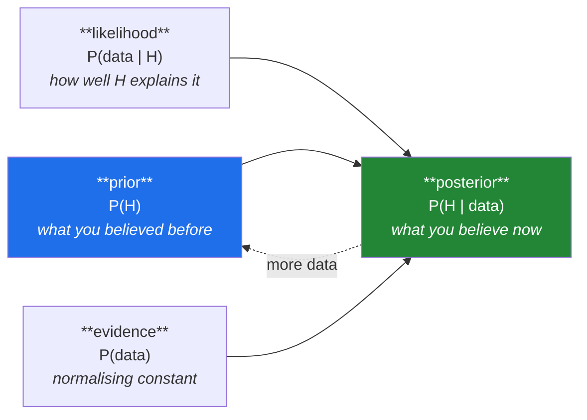

# Day 72 — Bayes' theorem and Bayesian updating

**Phase 9 · Module 9** · ID: **ST-19** (Bayes' theorem, prior/likelihood/posterior, updating)

> **Yesterday:** t-tests, and the assumption that actually matters.
> **Today:** the other conditional. Day 63 counted a million people to get `P(sick | positive)`;
> today that arithmetic gets a name and a general form — and answers the question a p-value
> structurally cannot. Then **Day 74's punchline arrives early**: it is why most published
> significant findings in a low-prior field are false.
> **Tomorrow:** chi-square.

```bash
./m start 72 && ./m scaffold 72
```

**Time:** 110 minutes. **Request budget:** 0 model calls.

---

## §1 The story

Day 69 was careful about this: a p-value is `P(data this extreme | H₀)`. What you actually want is
`P(H₀ | data)` — *given what I saw, how likely is the hypothesis?* Day 63 showed those two are wildly
different numbers, and that getting from one to the other needs something extra.

Bayes' theorem is that something:



`P(H | data) = P(data | H) × P(H) / P(data)`

Read it as a **sentence**: your new belief is your old belief, adjusted by how well the hypothesis
explained what you saw. And read it as a **loop** — today's posterior is tomorrow's prior, which is
what "updating" means and what makes it natural for sequential evidence.

The `P(data)` denominator is just normalisation: sum the numerator over every hypothesis so the
posterior sums to 1. In practice it is often easier to work with **odds**, where it cancels entirely:

> **posterior odds = prior odds × likelihood ratio**

That form is worth memorising because it makes the mechanism obvious. Evidence *multiplies* your odds
by how much better one hypothesis explains it than another. Weak evidence multiplies by ~1 and
changes little. Strong evidence with a strong contrary prior still may not get you far — which is the
formal version of "extraordinary claims require extraordinary evidence".

**The honest tension.** The prior is where Bayesian methods get criticised, and the criticism is fair:
two people with different priors reach different conclusions from identical data. The Bayesian
response is that the prior was always there — a frequentist analysis of a wildly implausible
hypothesis just leaves it implicit. Today you will show priors mattering enormously with little data
and washing out with plenty, which is the honest account of when the objection bites.

---

## §2 Setup — run this

```bash
mkdir -p days/day-72/lab
touch days/day-72/lab/bayes.py
```

`src/setu/stats.py` grows today. No new packages.

---

## §3 ST-19 — updating

`days/day-72/lab/bayes.py`:

```python
"""ST-19: Bayes' theorem, odds form, and sequential updating."""

from __future__ import annotations

import numpy as np
from scipy import stats as sp

from setu.arrays import make_rng


def the_theorem_from_counting() -> None:
    prevalence, sensitivity, specificity = 0.001, 0.99, 0.99

    prior = prevalence
    likelihood_if_sick = sensitivity
    likelihood_if_healthy = 1 - specificity
    evidence = likelihood_if_sick * prior + likelihood_if_healthy * (1 - prior)
    posterior = likelihood_if_sick * prior / evidence

    print(f"\n  Day 63's disease test, now as a formula:")
    print(f"    prior      P(sick)            = {prior:.4f}")
    print(f"    likelihood P(pos | sick)      = {likelihood_if_sick:.4f}")
    print(f"    evidence   P(pos)             = {evidence:.4f}")
    print(f"    posterior  P(sick | pos)      = {posterior:.4f}")
    print(f"\n  Day 63 got this by counting a million people. Same answer, and now")
    print(f"  it generalises to any prior, any test, any hypothesis.")


def the_odds_form() -> None:
    prior_odds = 0.001 / 0.999
    likelihood_ratio = 0.99 / 0.01
    posterior_odds = prior_odds * likelihood_ratio

    print(f"\n  prior odds       = {prior_odds:.6f}   (1 : {1 / prior_odds:.0f})")
    print(f"  likelihood ratio = {likelihood_ratio:.1f}      <- the evidence's STRENGTH")
    print(f"  posterior odds   = {posterior_odds:.4f}")
    print(f"  as a probability = {posterior_odds / (1 + posterior_odds):.4f}")

    print("\n  posterior odds = prior odds × likelihood ratio. The denominator cancelled.")
    print("  Evidence MULTIPLIES your odds. A 99-to-1 test against 999-to-1 prior odds")
    print("  still leaves you unconvinced — that is 'extraordinary claims require")
    print("  extraordinary evidence', stated arithmetically.")


def how_strong_is_the_evidence() -> None:
    print(f"\n  a likelihood ratio is a UNIT of evidence strength:")
    print(f"  {'LR':>8} {'reading':<24} {'odds shift'}")
    for lr, reading in ((1, "no evidence"), (3, "weak"), (10, "moderate"),
                        (30, "strong"), (100, "very strong")):
        print(f"  {lr:>8} {reading:<24} multiplies odds by {lr}")

    print("\n  Note LR = 1 means the data was equally likely under both hypotheses —")
    print("  it is not 'no effect', it is 'this observation told you nothing'.")


def sequential_updating() -> None:
    print(f"\n  a coin you suspect is biased. Prior: 50% fair, 50% biased (p=0.7 heads)")
    belief = {"fair": 0.5, "biased": 0.5}
    p_heads = {"fair": 0.5, "biased": 0.7}

    rng = make_rng(0)
    flips = rng.random(20) < 0.7          # it IS biased

    print(f"\n  {'flip':>5} {'result':>7} {'P(fair)':>9} {'P(biased)':>11}")
    print(f"  {'—':>5} {'—':>7} {belief['fair']:>9.4f} {belief['biased']:>11.4f}")

    for i, heads in enumerate(flips, 1):
        likelihood = {h: (p if heads else 1 - p) for h, p in p_heads.items()}
        unnormalised = {h: likelihood[h] * belief[h] for h in belief}
        total = sum(unnormalised.values())
        belief = {h: v / total for h, v in unnormalised.items()}
        if i <= 5 or i % 5 == 0:
            print(f"  {i:>5} {'H' if heads else 'T':>7} "
                  f"{belief['fair']:>9.4f} {belief['biased']:>11.4f}")

    print("\n  Each flip's posterior became the next flip's prior. That loop IS updating.")
    print("  Note tails push toward 'fair' and heads toward 'biased' — the belief moves")
    print("  in both directions, unlike a p-value which only accumulates against H₀.")


def order_does_not_matter() -> None:
    p_heads = {"fair": 0.5, "biased": 0.7}
    data = [True, True, False, True, True, False, True, True]

    def update(sequence):
        belief = {"fair": 0.5, "biased": 0.5}
        for heads in sequence:
            likelihood = {h: (p if heads else 1 - p) for h, p in p_heads.items()}
            unnormalised = {h: likelihood[h] * belief[h] for h in belief}
            total = sum(unnormalised.values())
            belief = {h: v / total for h, v in unnormalised.items()}
        return belief

    forward = update(data)
    backward = update(list(reversed(data)))
    shuffled = update(sorted(data))

    print(f"\n  same 8 flips, three orderings:")
    print(f"    original : P(biased) = {forward['biased']:.6f}")
    print(f"    reversed : P(biased) = {backward['biased']:.6f}")
    print(f"    sorted   : P(biased) = {shuffled['biased']:.6f}")
    print("\n  Identical. Updating is multiplication, and multiplication commutes.")
    print("  So you can update one observation at a time or all at once — same answer.")


def the_prior_matters_then_it_does_not() -> None:
    rng = make_rng(1)
    true_p = 0.7
    flips = rng.random(500) < true_p

    print(f"\n  estimating a coin's bias. True p = {true_p}.")
    print(f"  Three priors, from confident-wrong to uninformative:")
    print(f"\n  {'n flips':>8} {'Beta(1,1)':>11} {'Beta(2,2)':>11} {'Beta(50,5) wrong':>18}")

    priors = {"flat": (1, 1), "mild": (2, 2), "confident-wrong": (50, 5)}
    for n in (0, 1, 5, 20, 100, 500):
        heads = int(flips[:n].sum())
        row = []
        for a, b in priors.values():
            posterior_mean = (a + heads) / (a + b + n)
            row.append(posterior_mean)
        print(f"  {n:>8} {row[0]:>11.4f} {row[1]:>11.4f} {row[2]:>18.4f}")

    print("\n  At n=0 the priors disagree completely. At n=500 they agree to 2 decimals.")
    print("  ⚠️ The prior objection is REAL at small n and largely dissolves at large n.")
    print("     Say which regime you are in, and report your prior either way.")


def conjugate_updating_is_arithmetic() -> None:
    prior_a, prior_b = 2, 2
    heads, tails = 34, 16

    posterior_a, posterior_b = prior_a + heads, prior_b + tails
    posterior = sp.beta(posterior_a, posterior_b)

    print(f"\n  Beta({prior_a},{prior_b}) prior + {heads} heads, {tails} tails")
    print(f"  -> Beta({posterior_a},{posterior_b})")
    print(f"\n  posterior mean = {posterior.mean():.4f}")
    print(f"  95% credible interval = [{posterior.ppf(0.025):.4f}, {posterior.ppf(0.975):.4f}]")
    print(f"  P(p > 0.5 | data) = {posterior.sf(0.5):.4f}")

    print("\n  A conjugate prior makes updating pure addition — no integration needed.")
    print("  Beta is conjugate to the binomial; you can read a Beta(a,b) prior as")
    print(f"  'I have already seen {prior_a - 1} heads and {prior_b - 1} tails'.")


def credible_is_not_confidence() -> None:
    posterior = sp.beta(36, 18)
    low, high = posterior.ppf(0.025), posterior.ppf(0.975)

    print(f"\n  95% CREDIBLE interval: [{low:.4f}, {high:.4f}]")
    print("    'given the data and my prior, there is a 95% probability p is in here'")
    print("    ^ this IS a probability statement about the parameter")
    print("\n  95% CONFIDENCE interval (Day 68):")
    print("    'this procedure captures the true value 95% of the time'")
    print("    ^ NOT a probability statement about the parameter")
    print("\n  The credible interval says the thing everyone WANTS a confidence interval")
    print("  to say. That is its appeal — and the price is that it depends on your prior.")


def why_significant_findings_are_often_false() -> None:
    print(f"\n  Day 74's punchline, arriving early. Suppose in your field only 10% of")
    print(f"  tested hypotheses are true. You run tests at α=0.05 with 80% power:")

    for prior_true in (0.5, 0.1, 0.01):
        n = 10_000
        true_h = n * prior_true
        false_h = n - true_h
        true_positives = true_h * 0.80
        false_positives = false_h * 0.05
        ppv = true_positives / (true_positives + false_positives)
        print(f"\n    prior P(H true) = {prior_true:.0%}")
        print(f"      true positives  = {true_positives:>8.0f}")
        print(f"      false positives = {false_positives:>8.0f}")
        print(f"      P(H true | significant) = {ppv:.1%}")

    print("\n  ⚠️ At a 1% base rate, a 'significant' result is more likely FALSE than true.")
    print("     α controls the false-positive RATE, not the false-DISCOVERY rate.")
    print("     Those differ by the prior — and it is exactly Day 63's disease test again,")
    print("     with 'hypothesis' in place of 'patient'.")


def what_a_bayes_factor_adds() -> None:
    rng = make_rng(2)
    a, b = rng.normal(100, 15, 30), rng.normal(100, 15, 30)      # no real effect
    p = sp.ttest_ind(a, b, equal_var=False).pvalue

    print(f"\n  two identical populations, n=30: p = {p:.4f}")
    if p > 0.05:
        print("  frequentist: 'fail to reject H₀' — and that is ALL you may say")
    print("\n  A Bayes factor can express the other direction: BF₀₁ > 1 means the data")
    print("  positively FAVOURS the null, not merely 'we could not reject it'.")
    print("  That distinction is what Day 70's 'no effect vs no power' problem needed.")
    print("\n  ⚠️ But a Bayes factor requires specifying H₁ precisely — 'some effect'")
    print("     is not a hypothesis you can compute a likelihood under.")


if __name__ == "__main__":
    the_theorem_from_counting()
    the_odds_form()
    how_strong_is_the_evidence()
    sequential_updating()
    order_does_not_matter()
    the_prior_matters_then_it_does_not()
    conjugate_updating_is_arithmetic()
    credible_is_not_confidence()
    why_significant_findings_are_often_false()
    what_a_bayes_factor_adds()
```

**Line by line:**

- `the_theorem_from_counting` — **Day 63's answer, now as a formula.** Counting a million people gave
  9%; so does the theorem. Starting from the counting version means the formula is a compression of
  something you already believe rather than a new fact to memorise.
- `the_odds_form` — `posterior odds = prior odds × likelihood ratio`, with `P(data)` cancelling
  entirely. **Evidence multiplies your odds**, and 99-to-1 evidence against 999-to-1 prior odds still
  leaves you unconvinced. That is "extraordinary claims require extraordinary evidence" stated
  arithmetically.
- `how_strong_is_the_evidence` — **`LR = 1` means the observation told you nothing**, not that there
  is no effect. It is a useful distinction: data can be uninformative without being evidence of
  absence.
- `sequential_updating` — **each flip's posterior becomes the next flip's prior.** That loop is what
  "updating" means. And note something a p-value cannot do: the belief moves in **both** directions —
  tails push toward "fair", heads toward "biased".
- `order_does_not_matter` — three orderings, identical posteriors, because **updating is
  multiplication and multiplication commutes**. So you can process one observation at a time or the
  whole batch at once, which is why this suits streaming evidence.
- `the_prior_matters_then_it_does_not` — **run this and read the table.** At `n = 0` a flat prior and
  a confidently wrong one disagree completely. At `n = 500` they agree to two decimals. **The prior
  objection is real at small n and largely dissolves at large n** — say which regime you are in.
- `conjugate_updating_is_arithmetic` — Beta is conjugate to the binomial, so updating is **pure
  addition**: `Beta(a + heads, b + tails)`. And a `Beta(a, b)` prior reads as "I have already seen
  `a−1` heads and `b−1` tails", which makes prior strength concrete rather than mystical.
- `credible_is_not_confidence` — **the credible interval says the thing everyone wants a confidence
  interval to say**, and Day 68 was careful to explain why the confidence interval does not. That is
  its appeal, and the price is dependence on your prior.
- `why_significant_findings_are_often_false` — **Day 74's punchline, arriving early.** At a 1% base
  rate of true hypotheses, a significant result is more likely false than true. **α controls the
  false-positive rate, not the false-discovery rate**, and the two differ by the prior. It is Day 63's
  disease test with "hypothesis" substituted for "patient".
- `what_a_bayes_factor_adds` — a Bayes factor can favour the **null**, which frequentist testing
  structurally cannot. That is exactly what Day 70's "no effect versus no power" problem needed. The
  caveat is real: it requires specifying H₁ precisely, and "some effect" is not computable.

---

## §4 Build brief

Extend `src/setu/stats.py`:

```python
def bayes_update(prior: dict, likelihoods: dict) -> dict:
    """TODO(me): one update step over a discrete set of hypotheses. PURE.

    {"posterior": {h: p}, "evidence": float, "most_likely": str, "shift": {h: delta}}
    - posterior[h] = likelihood[h] * prior[h] / evidence
    - raise DataError if the prior does not sum to 1 within 1e-9, naming the total
    - raise DataError if the hypothesis sets differ, naming the mismatch
    - raise DataError on any negative prior or likelihood
    - evidence of zero (data impossible under EVERY hypothesis) raises DataError with
      a message saying the model is wrong, not the data
    - `shift` is posterior minus prior, so a caller can see what moved
    - must not mutate the inputs (ADR-001)
    """
    raise NotImplementedError


def sequential_update(prior: dict, observations: list, likelihood_fn) -> dict:
    """TODO(me): fold bayes_update over a sequence.

    {"posterior", "history": [{...} per step], "n_observations"}
    - likelihood_fn(observation) -> {hypothesis: P(observation | hypothesis)}
    - history lets Day 75's report PLOT belief over time, which is far more
      convincing than a final number
    - raise DataError on an empty observation list
    - the result must be independent of the observation ORDER (§3); note that in
      the docstring as a property a test will check
    """
    raise NotImplementedError


def odds_form(prior_probability: float, likelihood_ratio: float) -> dict:
    """TODO(me): the multiplication form. PURE.

    {"prior_odds", "likelihood_ratio", "posterior_odds", "posterior_probability",
     "strength": str}
    - strength from the LR: <1 'evidence against', 1-3 'weak', 3-10 'moderate',
      10-30 'strong', >30 'very strong'
    - LR exactly 1 must be described as 'uninformative', NOT 'no effect' (§3)
    - raise DataError if prior_probability is not strictly inside (0, 1) — 0 and 1
      are unupdatable, and saying so is more useful than returning a degenerate answer
    - raise DataError if likelihood_ratio <= 0
    """
    raise NotImplementedError


def beta_posterior(*, prior_alpha: float = 1.0, prior_beta: float = 1.0,
                   successes: int, failures: int, confidence: float = 0.95) -> dict:
    """TODO(me): conjugate updating for a proportion.

    {"alpha", "beta", "mean", "mode", "credible_interval": {"low", "high"},
     "prior_strength_in_observations": float, "interpretation": str}
    - posterior is Beta(prior_alpha + successes, prior_beta + failures)
    - prior_strength_in_observations = prior_alpha + prior_beta - 2, i.e. how many
      pseudo-observations the prior is worth (§3)
    - `interpretation` must call it a CREDIBLE interval and state what that means,
      distinguishing it from Day 68's confidence interval
    - raise DataError on negative counts or non-positive prior parameters
    """
    raise NotImplementedError


def false_discovery_rate(*, prior_true: float, alpha: float = 0.05,
                         power: float = 0.80) -> dict:
    """TODO(me): §3's calculation — P(H true | significant).

    {"prior_true", "alpha", "power", "ppv", "fdr", "per_10000": {...}}
    - ppv = P(H true | significant); fdr = 1 - ppv
    - per_10000 gives the counts, because they are what convince a reader (Day 63)
    - raise DataError on out-of-range inputs
    - reuse diagnostic_probabilities (Day 63) if the shape fits — it is the same
      arithmetic with different vocabulary, and NOT reusing it means two implementations
    """
    raise NotImplementedError


def describe_credible_interval(result: dict) -> str:
    """TODO(me): one sentence, correctly. PURE.

    - a credible interval MAY say 'probability that the parameter is in this range' —
      unlike Day 68's confidence interval, which may not
    - the sentence must mention that this depends on the stated prior
    - raise DataError if the result lacks a credible_interval
    """
    raise NotImplementedError
```

- `false_discovery_rate` **reusing Day 63's `diagnostic_probabilities`** is the point of noticing they
  are the same arithmetic. Two implementations of one calculation will drift.
- `odds_form` refusing a prior of exactly 0 or 1 encodes something real: **no amount of evidence can
  move a certainty**, and saying that is more useful than returning a degenerate number.
- `describe_credible_interval` is the counterpart to Day 68's `describe_interval`, and the contrast is
  the lesson — this one *may* make a probability statement about the parameter.

---

## §5 The eval that must be able to fail

Add to `tests/test_stats.py`:

```python
from setu.stats import (
    bayes_update,
    beta_posterior,
    describe_credible_interval,
    false_discovery_rate,
    odds_form,
    sequential_update,
)


def test_the_disease_test_reproduced():
    """Day 63 counted a million people. Same answer."""
    result = bayes_update(
        {"sick": 0.001, "healthy": 0.999},
        {"sick": 0.99, "healthy": 0.01},
    )
    assert result["posterior"]["sick"] == pytest.approx(0.0902, abs=0.001)


def test_the_posterior_sums_to_one():
    result = bayes_update({"a": 0.3, "b": 0.7}, {"a": 0.8, "b": 0.2})
    assert sum(result["posterior"].values()) == pytest.approx(1.0)


def test_equal_likelihoods_leave_the_prior_unchanged():
    """Uninformative data must not move a belief."""
    prior = {"a": 0.3, "b": 0.7}
    result = bayes_update(prior, {"a": 0.5, "b": 0.5})
    assert result["posterior"] == pytest.approx(prior)
    assert all(abs(delta) < 1e-12 for delta in result["shift"].values())


def test_a_prior_that_does_not_sum_to_one_raises():
    with pytest.raises(DataError) as info:
        bayes_update({"a": 0.3, "b": 0.3}, {"a": 0.5, "b": 0.5})
    assert "0.6" in str(info.value)


def test_mismatched_hypothesis_sets_raise():
    with pytest.raises(DataError) as info:
        bayes_update({"a": 0.5, "b": 0.5}, {"a": 0.5, "c": 0.5})
    assert "c" in str(info.value) or "b" in str(info.value)


def test_impossible_data_raises_with_a_useful_message():
    """If nothing explains the data, the model is wrong."""
    with pytest.raises(DataError) as info:
        bayes_update({"a": 0.5, "b": 0.5}, {"a": 0.0, "b": 0.0})
    assert "model" in str(info.value).lower() or "hypothes" in str(info.value).lower()


def test_bayes_update_does_not_mutate():
    prior = {"a": 0.5, "b": 0.5}
    bayes_update(prior, {"a": 0.9, "b": 0.1})
    assert prior == {"a": 0.5, "b": 0.5}


def test_sequential_updating_converges_on_the_truth():
    rng = make_rng(0)
    flips = list(rng.random(200) < 0.7)
    result = sequential_update(
        {"fair": 0.5, "biased": 0.5},
        flips,
        lambda heads: {"fair": 0.5, "biased": 0.7 if heads else 0.3},
    )
    assert result["posterior"]["biased"] > 0.99


def test_order_does_not_change_the_posterior():
    """Updating is multiplication, and multiplication commutes."""
    data = [True, True, False, True, True, False, True, True]
    likelihood = lambda heads: {"fair": 0.5, "biased": 0.7 if heads else 0.3}  # noqa: E731
    prior = {"fair": 0.5, "biased": 0.5}

    forward = sequential_update(prior, data, likelihood)["posterior"]
    backward = sequential_update(prior, list(reversed(data)), likelihood)["posterior"]
    assert forward["biased"] == pytest.approx(backward["biased"], rel=1e-12)


def test_batch_equals_one_at_a_time():
    data = [True, False, True]
    likelihood = lambda heads: {"fair": 0.5, "biased": 0.7 if heads else 0.3}  # noqa: E731

    stepwise = {"fair": 0.5, "biased": 0.5}
    for observation in data:
        stepwise = bayes_update(stepwise, likelihood(observation))["posterior"]

    batch = sequential_update({"fair": 0.5, "biased": 0.5}, data, likelihood)["posterior"]
    assert stepwise["biased"] == pytest.approx(batch["biased"], rel=1e-12)


def test_belief_moves_in_both_directions():
    """Unlike a p-value, which only accumulates against H0."""
    likelihood = lambda heads: {"fair": 0.5, "biased": 0.7 if heads else 0.3}  # noqa: E731
    heads_result = sequential_update({"fair": 0.5, "biased": 0.5}, [True] * 5, likelihood)
    tails_result = sequential_update({"fair": 0.5, "biased": 0.5}, [False] * 5, likelihood)
    assert heads_result["posterior"]["biased"] > 0.5
    assert tails_result["posterior"]["fair"] > 0.5


def test_history_is_returned_for_plotting():
    likelihood = lambda heads: {"fair": 0.5, "biased": 0.7 if heads else 0.3}  # noqa: E731
    result = sequential_update({"fair": 0.5, "biased": 0.5}, [True] * 10, likelihood)
    assert len(result["history"]) == 10


def test_sequential_rejects_no_observations():
    with pytest.raises(DataError):
        sequential_update({"a": 1.0}, [], lambda x: {"a": 1.0})


def test_odds_form_matches_the_probability_form():
    direct = bayes_update({"sick": 0.001, "healthy": 0.999},
                          {"sick": 0.99, "healthy": 0.01})["posterior"]["sick"]
    via_odds = odds_form(0.001, 0.99 / 0.01)["posterior_probability"]
    assert via_odds == pytest.approx(direct)


def test_a_likelihood_ratio_of_one_is_uninformative_not_no_effect():
    result = odds_form(0.3, 1.0)
    assert result["posterior_probability"] == pytest.approx(0.3)
    assert "uninformative" in result["strength"].lower()
    assert "no effect" not in result["strength"].lower()


def test_strong_evidence_against_a_strong_prior_still_leaves_doubt():
    """Extraordinary claims require extraordinary evidence."""
    result = odds_form(0.001, 99.0)
    assert result["posterior_probability"] < 0.15


def test_certainty_cannot_be_updated():
    for prior in (0.0, 1.0):
        with pytest.raises(DataError):
            odds_form(prior, 100.0)


def test_odds_form_rejects_a_non_positive_ratio():
    with pytest.raises(DataError):
        odds_form(0.5, 0.0)


def test_conjugate_update_is_addition():
    result = beta_posterior(prior_alpha=2, prior_beta=2, successes=34, failures=16)
    assert result["alpha"] == 36
    assert result["beta"] == 18
    assert result["mean"] == pytest.approx(36 / 54)


def test_prior_strength_is_expressed_in_observations():
    """A Beta(a,b) prior is worth a+b-2 pseudo-observations."""
    assert beta_posterior(prior_alpha=1, prior_beta=1, successes=0,
                          failures=0)["prior_strength_in_observations"] == 0
    assert beta_posterior(prior_alpha=50, prior_beta=5, successes=0,
                          failures=0)["prior_strength_in_observations"] == 53


def test_priors_disagree_at_small_n_and_agree_at_large_n():
    """The prior objection is real, and then it dissolves."""
    flat_small = beta_posterior(prior_alpha=1, prior_beta=1, successes=7, failures=3)["mean"]
    wrong_small = beta_posterior(prior_alpha=50, prior_beta=5, successes=7, failures=3)["mean"]
    assert abs(flat_small - wrong_small) > 0.15

    flat_large = beta_posterior(prior_alpha=1, prior_beta=1, successes=700, failures=300)["mean"]
    wrong_large = beta_posterior(prior_alpha=50, prior_beta=5, successes=700, failures=300)["mean"]
    assert abs(flat_large - wrong_large) < 0.03


def test_the_credible_interval_narrows_with_data():
    small = beta_posterior(successes=7, failures=3)["credible_interval"]
    large = beta_posterior(successes=700, failures=300)["credible_interval"]
    assert (large["high"] - large["low"]) < (small["high"] - small["low"]) / 5


def test_beta_posterior_rejects_bad_inputs():
    with pytest.raises(DataError):
        beta_posterior(successes=-1, failures=3)
    with pytest.raises(DataError):
        beta_posterior(prior_alpha=0.0, successes=3, failures=3)


def test_a_significant_result_can_be_more_likely_false_than_true():
    """Alpha controls the false-positive rate, NOT the false-discovery rate."""
    result = false_discovery_rate(prior_true=0.01, alpha=0.05, power=0.80)
    assert result["ppv"] < 0.5
    assert result["fdr"] > 0.5


def test_a_high_prior_makes_significance_trustworthy():
    result = false_discovery_rate(prior_true=0.5, alpha=0.05, power=0.80)
    assert result["ppv"] > 0.9


def test_lower_alpha_improves_the_discovery_rate():
    loose = false_discovery_rate(prior_true=0.1, alpha=0.05)["ppv"]
    strict = false_discovery_rate(prior_true=0.1, alpha=0.001)["ppv"]
    assert strict > loose


def test_the_counts_reconstruct_the_rate():
    result = false_discovery_rate(prior_true=0.1, alpha=0.05, power=0.80)
    counts = result["per_10000"]
    reconstructed = counts["true_positive"] / (counts["true_positive"] + counts["false_positive"])
    assert reconstructed == pytest.approx(result["ppv"], abs=0.01)


def test_false_discovery_reuses_day_63(monkeypatch):
    """Same arithmetic, different vocabulary — one implementation."""
    import setu.stats as stats

    calls = []
    original = stats.diagnostic_probabilities
    monkeypatch.setattr(
        stats, "diagnostic_probabilities",
        lambda **kw: calls.append(1) or original(**kw),
    )
    false_discovery_rate(prior_true=0.1)
    assert calls, "false_discovery_rate reimplemented Day 63's calculation"


def test_a_credible_interval_may_state_a_probability():
    """Unlike a confidence interval (Day 68)."""
    text = describe_credible_interval(beta_posterior(successes=36, failures=18)).lower()
    assert "probability" in text
    assert "prior" in text, "the dependence on the prior must be stated"
```

**Line by line:**

- `test_a_significant_result_can_be_more_likely_false_than_true` — **the day's real assessment.** At a
  1% base rate of true hypotheses, `PPV < 0.5`. **α controls the false-positive rate, not the
  false-discovery rate**, and conflating them is the error behind the replication crisis.
- `test_false_discovery_reuses_day_63` — the architecture test. It is the *same arithmetic* as the
  disease screen with different vocabulary, and two implementations would drift.
- `test_order_does_not_change_the_posterior` and `test_batch_equals_one_at_a_time` — together they pin
  the commutativity property. An implementation that accumulates incorrectly (say, averaging rather
  than multiplying) passes a single-update test and fails both of these.
- `test_a_likelihood_ratio_of_one_is_uninformative_not_no_effect` — asserts the **wording**. "No
  effect" and "this observation told you nothing" are different claims, and the second is what
  `LR = 1` supports.
- `test_certainty_cannot_be_updated` — a prior of exactly 0 or 1 is unupdatable, and refusing is more
  useful than a degenerate answer. It is also a genuine epistemological point in two lines.
- `test_priors_disagree_at_small_n_and_agree_at_large_n` — **the honest account of the prior
  objection**, as two assertions in one test. It is real at n = 10 and gone by n = 1,000.
- `test_impossible_data_raises_with_a_useful_message` — when every likelihood is zero the data was
  impossible under all hypotheses, which means **your model is wrong**, not your data. The message must
  say so.
- `test_a_credible_interval_may_state_a_probability` — the deliberate contrast with Day 68, where the
  equivalent test asserted "probability" must **not** appear. Same shape, opposite assertion, and the
  difference is the lesson.

```bash
uv run python -m pytest tests/test_stats.py -v
```

---

## §6 Request budget

| Resource | Spent today |
|---|---|
| LLM calls | **0** |

---

## §7 Traps

- **Reading a p-value as `P(H₀ | data)`.** That is the posterior, and it needs a prior.
- **Confusing α with the false-discovery rate.** They differ by the base rate.
- **Reporting a Bayesian result without its prior.** The prior is part of the answer.
- **Claiming the prior does not matter.** At small n it dominates.
- **Claiming the prior always matters.** At large n it washes out. Say which regime.
- **A prior of 0 or 1.** No evidence can move a certainty.
- **`LR = 1` read as "no effect".** It means the data was uninformative.
- **A credible interval described as a confidence interval.** Different claims (Day 68).
- **A confidence interval described as a credible one.** The more common error.
- **A Bayes factor with a vague H₁.** "Some effect" has no computable likelihood.
- **Forgetting the posterior sums to 1.** The denominator is normalisation.

---

## §8 Verify before you code

Written **2026-08-21**:

- <https://docs.scipy.org/doc/scipy/reference/generated/scipy.stats.beta.html> — the conjugate
  posterior, `ppf` for credible intervals.
- <https://docs.scipy.org/doc/scipy/reference/generated/scipy.stats.binom.html> — the likelihood
  behind the Beta-binomial pair.
- <https://en.wikipedia.org/wiki/Conjugate_prior> — the table of which prior pairs with which
  likelihood.

---

## §9 Say it in an interview

> "A p-value is the probability of the data given the null; what you want is the probability of the
> hypothesis given the data, and Bayes' theorem is what connects them — but it needs a prior, which is
> exactly the extra ingredient a p-value doesn't have. The form I find clearest is the odds version:
> posterior odds equal prior odds times the likelihood ratio, so evidence *multiplies* your odds.
> Ninety-nine-to-one evidence against thousand-to-one prior odds still leaves you unconvinced, which
> is 'extraordinary claims require extraordinary evidence' stated as arithmetic. The consequence I'd
> lead with is that alpha controls the false-*positive* rate, not the false-*discovery* rate: if only
> one per cent of hypotheses in your field are true, then at alpha 0.05 with eighty per cent power, a
> significant result is more likely false than true. That's the same calculation as a screening test
> for a rare disease with 'hypothesis' in place of 'patient', so I made the two share one
> implementation rather than writing it twice."

---

## §10 Done when

Tick [`CHECKLIST.md`](CHECKLIST.md), then `./m check && ./m done 72`.
