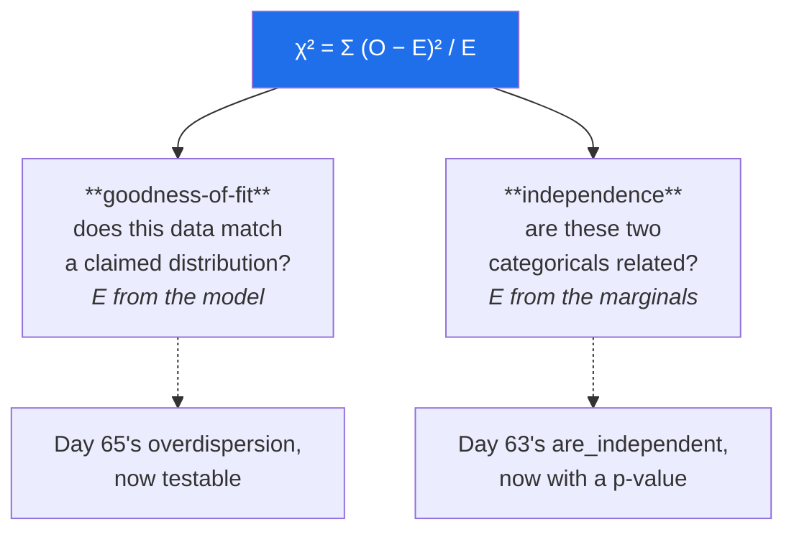

# Day 73 — Chi-square: goodness-of-fit and independence

**Phase 9 · Module 9** · ID: **ST-20** (the chi-square distribution, goodness-of-fit, test of independence)

> **Yesterday:** Bayes, and why α is not the false-discovery rate.
> **Today:** the test for **counts** — the one Day 58's table routed nominal data toward, and the one
> that finally makes Day 65's "this data is overdispersed" a formal claim rather than an eyeball
> check.
> **Tomorrow:** multiple comparisons, demonstrated.

```bash
./m start 73 && ./m scaffold 73
```

**Time:** 110 minutes. **Request budget:** 0 model calls.

---

## §1 The story

Every test so far compared **means**. Chi-square compares **counts**, which is what you have when the
data is nominal (Day 58) — venues, categories, pass/fail, which button was clicked.

The statistic is one idea, applied twice:

> **χ² = Σ (observed − expected)² / expected**

Squared difference, scaled by how many you expected. The scaling is the interesting part: being 10
off when you expected 20 is serious; being 10 off when you expected 10,000 is nothing.



The two uses differ only in **where the expected counts come from**. For goodness-of-fit, a model
supplies them. For independence, you compute them from the row and column totals — which is exactly
Day 63's `P(A)·P(B)` outer product, now with a distribution attached.

Two things matter more than the arithmetic.

**Chi-square needs sufficient expected counts.** The usual rule is that no expected count should be
below 5. Below that, the χ² distribution is a poor approximation to the true sampling distribution of
the statistic, and your p-value is wrong. You will **measure** how wrong in §3, because the rule is
usually stated without evidence.

**A significant χ² tells you the table is not independent, not where.** Same limitation as Day 71's
ANOVA. The residuals tell you where, and reporting them is what turns "these are related" into
something a reader can act on.

And the effect-size point again: with 100,000 rows, a trivially small association is significant.
**Cramér's V** is the effect size for a contingency table, and it belongs beside every χ² you report.

---

## §2 Setup — run this

```bash
mkdir -p days/day-73/lab
touch days/day-73/lab/chisquare.py
```

`src/setu/stats.py` grows today. No new packages.

---

## §3 ST-20 — counts

`days/day-73/lab/chisquare.py`:

```python
"""ST-20: the chi-square statistic, its two uses, and its assumption."""

from __future__ import annotations

import numpy as np
import pandas as pd
from scipy import stats as sp

from setu.arrays import make_rng


def the_statistic_from_scratch() -> None:
    observed = np.array([30.0, 14.0, 34.0, 45.0, 57.0, 20.0])
    expected = np.full(6, observed.sum() / 6)

    contributions = (observed - expected) ** 2 / expected
    chi2 = contributions.sum()
    df = len(observed) - 1

    print(f"\n  a die rolled {int(observed.sum())} times: {observed.astype(int).tolist()}")
    print(f"  expected if fair: {expected[0]:.2f} each")
    print(f"\n  {'face':>5} {'obs':>6} {'exp':>7} {'(O−E)²/E':>10}")
    for i, (o, e, c) in enumerate(zip(observed, expected, contributions, strict=True), 1):
        print(f"  {i:>5} {o:>6.0f} {e:>7.2f} {c:>10.4f}")

    print(f"\n  χ² = {chi2:.4f}   df = {df}   p = {sp.chi2.sf(chi2, df):.4f}")
    print(f"  scipy: {sp.chisquare(observed).pvalue:.4f}")

    print("\n  Note the SCALING by E. Being 10 off when you expected 33 contributes")
    print("  a lot; being 10 off when you expected 10,000 contributes almost nothing.")
    print(f"  df = categories − 1: the counts must sum to {int(observed.sum())}, so the")
    print("  last one is forced (Day 60's degrees of freedom).")


def the_null_distribution_is_generated_not_assumed() -> None:
    rng = make_rng(0)
    n, categories = 120, 6
    expected = np.full(categories, n / categories)

    simulated = np.empty(20_000)
    for i in range(20_000):
        counts = np.bincount(rng.integers(0, categories, n), minlength=categories)
        simulated[i] = (((counts - expected) ** 2) / expected).sum()

    df = categories - 1
    print(f"\n  20,000 fair dice experiments, χ² each time:")
    print(f"  {'quantile':>10} {'simulated':>11} {'chi2(df=5)':>12}")
    for q in (0.50, 0.90, 0.95, 0.99):
        print(f"  {q:>10.2f} {np.quantile(simulated, q):>11.4f} {sp.chi2.ppf(q, df):>12.4f}")

    print(f"\n  mean simulated = {simulated.mean():.3f}, and E[χ²] = df = {df}")
    print("\n  The chi-square DISTRIBUTION is just the null distribution of this statistic,")
    print("  the same thing Day 69 built by shuffling. Here it has a closed form.")


def goodness_of_fit_tests_a_model() -> None:
    rng = make_rng(1)

    print("\n  Day 65's overdispersion, now a formal test:")
    for label, counts in (
        ("true Poisson", rng.poisson(4.0, 3_000)),
        ("overdispersed", rng.poisson(rng.gamma(2, 2, 3_000))),
    ):
        lam = counts.mean()
        max_k = 12
        observed = np.bincount(counts, minlength=max_k + 1)[:max_k].astype(float)
        observed[-1] += (counts >= max_k).sum() - (counts == max_k).sum() * 0
        expected = sp.poisson(lam).pmf(np.arange(max_k)) * len(counts)
        expected[-1] += len(counts) * sp.poisson(lam).sf(max_k - 1)

        keep = expected >= 5
        chi2 = (((observed[keep] - expected[keep]) ** 2) / expected[keep]).sum()
        df = keep.sum() - 1 - 1                      # −1 for lambda, ESTIMATED from data
        p = sp.chi2.sf(chi2, df)

        print(f"\n    {label:<16} λ̂={lam:.3f}  χ²={chi2:>9.2f}  df={df}  p={p:.2e}")

    print("\n  ⚠️ df loses one extra degree for the ESTIMATED λ. Forgetting that inflates")
    print("     your p-value — a real and common error in goodness-of-fit tests.")
    print("  The overdispersed data is rejected decisively. Day 65 eyeballed it; now it")
    print("  is a number you can put in a report.")


def independence_from_the_marginals() -> None:
    table = pd.DataFrame(
        [[120, 80], [60, 140]],
        index=["NeurIPS", "other"], columns=["high-cited", "low-cited"],
    )
    print(f"\n  observed:\n{table}\n")

    row_totals = table.sum(axis=1).to_numpy()
    col_totals = table.sum(axis=0).to_numpy()
    total = table.to_numpy().sum()
    expected = np.outer(row_totals, col_totals) / total

    print(f"  expected under independence (row × col / total):")
    print(pd.DataFrame(expected, index=table.index, columns=table.columns).round(1))

    chi2 = (((table.to_numpy() - expected) ** 2) / expected).sum()
    df = (table.shape[0] - 1) * (table.shape[1] - 1)
    print(f"\n  χ² = {chi2:.4f}   df = (r−1)(c−1) = {df}   p = {sp.chi2.sf(chi2, df):.2e}")

    result = sp.chi2_contingency(table)
    print(f"  scipy: χ²={result.statistic:.4f}, p={result.pvalue:.2e}")
    print(f"  ⚠️ scipy applies Yates' correction by default on 2×2 tables — "
          f"pass correction=False to match the hand calculation.")

    print("\n  The expected table IS Day 63's outer product of the marginals. That is")
    print("  what 'independent' means, and χ² measures how far you are from it.")


def the_residuals_say_where() -> None:
    table = np.array([[120, 80, 40], [60, 140, 60], [30, 30, 90]], dtype=float)
    result = sp.chi2_contingency(table)
    expected = result.expected_freq

    standardised = (table - expected) / np.sqrt(expected)
    adjusted = standardised / np.sqrt(
        np.outer(1 - table.sum(axis=1) / table.sum(), 1 - table.sum(axis=0) / table.sum())
    )

    print(f"\n  χ² = {result.statistic:.2f}, p = {result.pvalue:.2e} -> 'not independent'")
    print(f"\n  adjusted residuals (|value| > 2 is notable):")
    print(np.round(adjusted, 2))

    row, col = np.unravel_index(np.abs(adjusted).argmax(), adjusted.shape)
    print(f"\n  largest deviation at row {row}, column {col}: {adjusted[row, col]:+.2f}")
    print(f"    observed {table[row, col]:.0f} vs expected {expected[row, col]:.1f}")

    print("\n  A significant χ² says 'not independent' and nothing more — same limitation")
    print("  as Day 71's ANOVA. The residuals say WHERE, and that is what a reader needs.")


def the_expected_count_rule_measured() -> None:
    rng = make_rng(2)
    print("\n  Type I error rate when expected counts are small (α=0.05, 6 categories):")
    print(f"  {'n':>6} {'expected each':>15} {'actual Type I':>15}")

    for n in (12, 18, 30, 60, 120, 600):
        expected = np.full(6, n / 6)
        rejections = []
        for _ in range(8_000):
            counts = np.bincount(rng.integers(0, 6, n), minlength=6).astype(float)
            chi2 = (((counts - expected) ** 2) / expected).sum()
            rejections.append(sp.chi2.sf(chi2, 5) < 0.05)
        print(f"  {n:>6} {n / 6:>15.1f} {np.mean(rejections):>15.4f}")

    print("\n  Below ~5 expected per cell the rate departs from 0.05 — the χ² distribution")
    print("  is a poor approximation there. THAT is where the 'expected ≥ 5' rule comes")
    print("  from, and now you have measured it rather than recited it.")
    print("\n  The fix is Fisher's exact test, or a permutation test (Day 69).")


def fisher_when_counts_are_tiny() -> None:
    table = np.array([[8, 2], [1, 9]])
    chi2_p = sp.chi2_contingency(table, correction=False).pvalue
    fisher_p = sp.fisher_exact(table).pvalue

    print(f"\n  a 2×2 table with small counts:\n{table}")
    print(f"\n  chi-square p = {chi2_p:.4f}   <- approximation, expected counts are small")
    print(f"  Fisher exact p = {fisher_p:.4f}   <- exact, no approximation")
    print("\n  Fisher enumerates every table with the same margins. Exact, and it does")
    print("  not scale — but for a 2×2 with small counts it is the right answer.")


def significance_is_not_strength() -> None:
    print("\n  the SAME weak association, at three sample sizes:")
    print(f"  {'n':>8} {'χ²':>10} {'p':>12} {'Cramér V':>10}")

    base = np.array([[0.26, 0.24], [0.24, 0.26]])
    for n in (200, 2_000, 200_000):
        table = base * n
        result = sp.chi2_contingency(table, correction=False)
        v = np.sqrt(result.statistic / (n * (min(table.shape) - 1)))
        print(f"  {n:>8} {result.statistic:>10.2f} {result.pvalue:>12.2e} {v:>10.4f}")

    print("\n  Cramér's V is UNCHANGED — the association never varied. Only n did.")
    print("  V ranges 0 to 1: ~0.1 is weak, ~0.3 moderate, ~0.5 strong (conventions).")
    print("  Report V beside every χ², for the same reason Day 69 demanded an effect size.")


if __name__ == "__main__":
    the_statistic_from_scratch()
    the_null_distribution_is_generated_not_assumed()
    goodness_of_fit_tests_a_model()
    independence_from_the_marginals()
    the_residuals_say_where()
    the_expected_count_rule_measured()
    fisher_when_counts_are_tiny()
    significance_is_not_strength()
```

**Line by line:**

- `the_statistic_from_scratch` — **the contributions column is the lesson.** Dividing by `E` is what
  makes the statistic scale-aware: being 10 off when you expected 33 matters, being 10 off when you
  expected 10,000 does not.
- `df = categories − 1` — the counts must sum to the total, so the last one is forced. Day 60's
  degrees of freedom, in a new place.
- `the_null_distribution_is_generated_not_assumed` — **the chi-square distribution is just the null
  distribution of this statistic**, the same object Day 69 built by shuffling. Here it happens to have
  a closed form. And `E[χ²] = df`, which makes the statistic readable without a table.
- `goodness_of_fit_tests_a_model` — **Day 65's overdispersion, now formal.** And note the trap: `df`
  loses **one extra degree** for the estimated λ, because you fitted it from the data. Forgetting that
  inflates your p-value, and it is a common error.
- `independence_from_the_marginals` — the expected table **is** Day 63's outer product of the
  marginals. That is what "independent" means, and χ² measures the distance from it. The `scipy` note
  matters: **Yates' correction is applied by default on 2×2 tables**, so hand calculations will not
  match unless you pass `correction=False`.
- `the_residuals_say_where` — a significant χ² says "not independent" and nothing more, exactly like
  Day 71's ANOVA. **The adjusted residuals say where**, and `|value| > 2` marks the cells doing the
  work. That is what makes the result actionable.
- `the_expected_count_rule_measured` — **the rule, measured rather than recited.** Below about 5
  expected per cell the Type I rate departs from 0.05, because the χ² distribution approximates the
  true sampling distribution badly there. Run it and read where the departure begins.
- `fisher_when_counts_are_tiny` — Fisher's exact test enumerates every table with the same margins.
  Exact, does not scale, and is the right answer for a small 2×2.
- `significance_is_not_strength` — **Cramér's V is unchanged across three sample sizes** while the
  p-value moves by twenty orders of magnitude. The association never varied; only `n` did. Report V
  beside every χ².

---

## §4 Build brief

Extend `src/setu/stats.py`:

```python
def chi_square_goodness_of_fit(observed, expected=None, *, estimated_parameters: int = 0,
                               min_expected: float = 5.0) -> dict:
    """TODO(me): test whether counts match a claimed distribution.

    {"chi2", "df", "p_value", "observed", "expected", "contributions",
     "cells_below_minimum": int, "warnings": [...]}
    - expected=None means "uniform across the categories"
    - df = categories − 1 − estimated_parameters. That last term is NOT optional:
      raise DataError if it would make df < 1, and say why
    - WARN when any expected count is below min_expected, naming how many cells
      and pointing at an exact test (§3 measured the cost)
    - contributions is the per-cell (O−E)²/E, so a caller can see what drove the result
    - raise DataError on negative counts, a length mismatch (name both), or
      expected values that do not sum to the observed total within 1e-6
    """
    raise NotImplementedError


def chi_square_independence(table, *, correction: bool = False) -> dict:
    """TODO(me): test whether two categoricals are related.

    {"chi2", "df", "p_value", "expected", "cramers_v", "adjusted_residuals",
     "largest_deviation": {"row", "col", "residual", "observed", "expected"},
     "conclusion", "warnings": [...]}
    - correction defaults to FALSE, unlike scipy: Yates' correction is conservative
      and its use is contested; make it an explicit choice (§3)
    - cramers_v = sqrt(chi2 / (n * (min(r, c) - 1)))
    - `conclusion` on rejection must be 'the variables are not independent' and must
      NEVER name a specific cell — the residuals do that separately
    - warn when any expected count < 5, and when cramers_v < 0.1 despite p < 0.05
      (significant but trivial, Day 69's rule for tables)
    - raise DataError on a table smaller than 2×2, any negative entry, or an
      all-zero row or column (the expected count would be zero)
    """
    raise NotImplementedError


def cramers_v(table) -> dict:
    """TODO(me): the effect size for a contingency table. PURE.

    {"v", "magnitude", "n", "min_dimension"}
    - magnitude: <0.1 negligible, <0.3 weak, <0.5 moderate, else strong — and the
      docstring must say these are CONVENTIONS
    - v must be independent of n for a fixed association pattern (§3); note that as
      a property a test will check
    - raise DataError on a degenerate table
    """
    raise NotImplementedError


def expected_counts(table):
    """TODO(me): the outer product of the marginals, divided by the total.

    Return an ndarray of the same shape.
    This IS Day 63's are_independent expectation — reuse that function's logic rather
    than writing the outer product twice.
    """
    raise NotImplementedError


def choose_count_test(table, *, min_expected: float = 5.0) -> dict:
    """TODO(me): chi-square, Fisher, or permutation? PURE.

    {"test", "reason", "min_expected_count"}
    - compute the expected counts and find the smallest
    - all expected >= min_expected -> 'chi-square'
    - 2x2 with a small expected count -> 'fisher exact'
    - larger table with small expected counts -> 'permutation' (Day 69 handles any
      statistic, including chi-square, without the approximation)
    - the reason must name the smallest expected count
    """
    raise NotImplementedError
```

- `chi_square_independence` defaulting `correction=False` **inverts SciPy's default**, same instinct as
  Day 71's Welch decision: Yates' correction is contested and conservative, so it should be a choice
  rather than something that silently happens on 2×2 tables.
- `estimated_parameters` being a **required consideration** in the goodness-of-fit `df` is the §3 trap
  made unavoidable.
- `expected_counts` reusing Day 63's logic keeps one implementation of "what independence predicts".

---

## §5 The eval that must be able to fail

Add to `tests/test_stats.py`:

```python
from setu.stats import (
    chi_square_goodness_of_fit,
    chi_square_independence,
    choose_count_test,
    cramers_v,
    expected_counts,
)


def test_goodness_of_fit_matches_scipy():
    from scipy import stats as sp

    observed = [30, 14, 34, 45, 57, 20]
    assert chi_square_goodness_of_fit(observed)["p_value"] == pytest.approx(
        sp.chisquare(observed).pvalue
    )


def test_a_fair_die_is_not_rejected():
    rng = make_rng(0)
    counts = np.bincount(rng.integers(0, 6, 6_000), minlength=6)
    assert chi_square_goodness_of_fit(list(counts))["p_value"] > 0.05


def test_a_loaded_die_is_rejected():
    rng = make_rng(1)
    counts = np.bincount(rng.choice(6, 6_000, p=[0.3, 0.14, 0.14, 0.14, 0.14, 0.14]),
                         minlength=6)
    assert chi_square_goodness_of_fit(list(counts))["p_value"] < 1e-6


def test_estimated_parameters_reduce_the_degrees_of_freedom():
    """Forgetting this inflates your p-value."""
    observed = [30, 40, 20, 10]
    plain = chi_square_goodness_of_fit(observed, estimated_parameters=0)
    fitted = chi_square_goodness_of_fit(observed, estimated_parameters=1)
    assert fitted["df"] == plain["df"] - 1
    assert fitted["p_value"] < plain["p_value"], "fewer df means a SMALLER p for the same chi2"


def test_too_many_estimated_parameters_raises():
    with pytest.raises(DataError):
        chi_square_goodness_of_fit([10, 20], estimated_parameters=5)


def test_small_expected_counts_are_warned_about():
    result = chi_square_goodness_of_fit([3, 2, 4, 1, 2, 3])
    assert result["cells_below_minimum"] > 0
    assert any("exact" in w.lower() or "expected" in w.lower() for w in result["warnings"])


def test_contributions_identify_the_offending_category():
    observed = [10, 10, 10, 10, 10, 60]
    result = chi_square_goodness_of_fit(observed)
    assert int(np.argmax(result["contributions"])) == 5


def test_goodness_of_fit_rejects_mismatched_totals():
    with pytest.raises(DataError):
        chi_square_goodness_of_fit([10, 10, 10], expected=[5, 5, 5])


def test_goodness_of_fit_rejects_negative_counts():
    with pytest.raises(DataError):
        chi_square_goodness_of_fit([10, -2, 10])


def test_expected_counts_are_the_outer_product():
    table = np.array([[120.0, 80.0], [60.0, 140.0]])
    expected = expected_counts(table)
    assert expected[0, 0] == pytest.approx(200 * 180 / 400)
    assert expected.sum() == pytest.approx(table.sum())


def test_independence_matches_scipy_without_correction():
    from scipy import stats as sp

    table = np.array([[120, 80], [60, 140]])
    assert chi_square_independence(table)["p_value"] == pytest.approx(
        sp.chi2_contingency(table, correction=False).pvalue
    )


def test_correction_defaults_to_false():
    """SciPy applies Yates on 2x2 by default. Make it a choice."""
    import inspect

    assert inspect.signature(chi_square_independence).parameters["correction"].default is False


def test_correction_makes_the_test_more_conservative():
    table = np.array([[12, 8], [6, 14]])
    plain = chi_square_independence(table, correction=False)["p_value"]
    corrected = chi_square_independence(table, correction=True)["p_value"]
    assert corrected > plain


def test_an_independent_table_is_not_rejected():
    rng = make_rng(2)
    row_p, col_p = np.array([0.6, 0.4]), np.array([0.3, 0.7])
    table = rng.multinomial(4_000, np.outer(row_p, col_p).ravel()).reshape(2, 2)
    assert chi_square_independence(table)["p_value"] > 0.05


def test_the_conclusion_never_names_a_cell():
    """Same limitation as ANOVA — chi-square says 'not independent'."""
    table = np.array([[120, 80, 40], [60, 140, 60], [30, 30, 90]])
    result = chi_square_independence(table)
    assert result["p_value"] < 0.001
    assert "not independent" in result["conclusion"].lower()
    for token in ("row 2", "cell", "column 3"):
        assert token not in result["conclusion"].lower()


def test_the_residuals_locate_the_deviation():
    table = np.array([[100, 100], [100, 300]])
    result = chi_square_independence(table)
    largest = result["largest_deviation"]
    assert abs(largest["residual"]) > 2
    assert largest["observed"] != pytest.approx(largest["expected"])


def test_cramers_v_is_independent_of_sample_size():
    """The association never varied; only n did."""
    base = np.array([[0.26, 0.24], [0.24, 0.26]])
    small = cramers_v(base * 200)["v"]
    large = cramers_v(base * 200_000)["v"]
    assert small == pytest.approx(large, rel=0.05)


def test_cramers_v_is_bounded():
    for table in (np.array([[50, 50], [50, 50]]), np.array([[100, 0], [0, 100]])):
        v = cramers_v(table)["v"]
        assert 0.0 <= v <= 1.0


def test_a_perfect_association_gives_v_near_one():
    assert cramers_v(np.array([[100, 0], [0, 100]]))["v"] == pytest.approx(1.0, abs=0.01)


def test_no_association_gives_v_near_zero():
    assert cramers_v(np.array([[50, 50], [50, 50]]))["v"] == pytest.approx(0.0, abs=0.01)


def test_significant_but_trivial_is_warned_about():
    """200,000 rows makes a negligible association 'highly significant'."""
    table = np.array([[0.26, 0.24], [0.24, 0.26]]) * 200_000
    result = chi_square_independence(table)
    assert result["p_value"] < 0.001
    assert result["cramers_v"] < 0.1
    assert any("cram" in w.lower() or "trivial" in w.lower() or "small" in w.lower()
               for w in result["warnings"])


def test_independence_rejects_a_degenerate_table():
    with pytest.raises(DataError):
        chi_square_independence(np.array([[10, 20]]))
    with pytest.raises(DataError):
        chi_square_independence(np.array([[10, 0], [20, 0]]))


def test_choose_recommends_chi_square_with_ample_counts():
    table = np.array([[120, 80], [60, 140]])
    assert "chi" in choose_count_test(table)["test"].lower()


def test_choose_recommends_fisher_for_a_small_two_by_two():
    table = np.array([[8, 2], [1, 9]])
    result = choose_count_test(table)
    assert "fisher" in result["test"].lower()
    assert "expected" in result["reason"].lower()


def test_choose_recommends_permutation_for_a_larger_sparse_table():
    table = np.array([[3, 2, 1], [1, 4, 2], [2, 1, 3]])
    assert "permutation" in choose_count_test(table)["test"].lower()


def test_the_expected_count_rule_is_real():
    """§3 measured it: below ~5 expected, the Type I rate drifts."""
    from scipy import stats as sp

    rng = make_rng(3)
    rates = {}
    for n in (12, 600):
        expected = np.full(6, n / 6)
        rejections = [
            sp.chi2.sf(
                (((np.bincount(rng.integers(0, 6, n), minlength=6) - expected) ** 2)
                 / expected).sum(), 5) < 0.05
            for _ in range(4_000)
        ]
        rates[n] = float(np.mean(rejections))

    assert abs(rates[600] - 0.05) < 0.015, "with ample counts the rate should be near alpha"
    assert abs(rates[12] - 0.05) > abs(rates[600] - 0.05), (
        "small expected counts should visibly distort the error rate"
    )
```

**Line by line:**

- `test_estimated_parameters_reduce_the_degrees_of_freedom` — **the day's real assessment.** Two
  assertions: `df` drops by one, and the p-value gets **smaller** for the same χ². That second one is
  the direction people get wrong — forgetting the estimated parameter makes your test too *lenient*,
  and this pins it.
- `test_the_expected_count_rule_is_real` — §3's measurement as a test. It asserts the rate is near α
  with ample counts and **visibly further** with tiny ones, which validates the rule rather than
  reciting it.
- `test_correction_defaults_to_false` — an API-shape test inverting SciPy's default, the same move as
  Day 71's Welch decision and for the same reason.
- `test_cramers_v_is_independent_of_sample_size` — the same association at n = 200 and n = 200,000
  gives the same V. **That is what makes it an effect size**, and it is the property a p-value lacks.
- `test_the_conclusion_never_names_a_cell` — asserts an absence, matching Day 71's ANOVA test exactly.
  The residuals locate the deviation; the conclusion string must not pretend to.
- `test_contributions_identify_the_offending_category` — `argmax` on the contributions finds the
  category with 60 instead of 10. That is how a reader acts on a goodness-of-fit rejection.
- `test_a_perfect_association_gives_v_near_one` and its companion — the two endpoints of the scale,
  which make V interpretable without a reference table.

```bash
uv run python -m pytest tests/test_stats.py -v
```

---

## §6 Request budget

| Resource | Spent today |
|---|---|
| LLM calls | **0** |

---

## §7 Traps

- **Forgetting the estimated parameter in `df`.** Makes your test too lenient.
- **Expected counts below 5.** The approximation fails; use Fisher or a permutation test.
- **SciPy's Yates correction on 2×2.** Applied by default; your hand calculation will not match.
- **Reading a significant χ² as "these cells differ".** It says "not independent".
- **Reporting χ² without Cramér's V.** At large n everything is significant.
- **Running χ² on proportions or means.** It is a test for **counts**.
- **A table with an all-zero row or column.** The expected count is zero; division fails.
- **Comparing χ² values across tables.** It scales with n; V does not.
- **Using χ² on paired categorical data.** McNemar's test is the paired version.
- **Chi-square on ordinal data ignoring the order.** It throws the ordering away (Day 58).

---

## §8 Verify before you code

Written **2026-08-21**:

- <https://docs.scipy.org/doc/scipy/reference/generated/scipy.stats.chisquare.html> — the
  goodness-of-fit function and its `ddof` parameter, which is the estimated-parameter adjustment.
- <https://docs.scipy.org/doc/scipy/reference/generated/scipy.stats.chi2_contingency.html> — confirm
  the `correction` default for your pinned version.
- <https://docs.scipy.org/doc/scipy/reference/generated/scipy.stats.fisher_exact.html> — and whether
  it supports tables larger than 2×2 in your version.
- <https://docs.scipy.org/doc/scipy/reference/generated/scipy.stats.contingency.association.html> —
  SciPy's own Cramér's V, worth comparing against yours.

---

## §9 Say it in an interview

> "Chi-square compares counts rather than means, and the statistic is one idea used twice — squared
> difference from expected, scaled by expected. The scaling is the point: being ten off when you
> expected twenty is serious, being ten off when you expected ten thousand is nothing. For independence
> the expected table is just the outer product of the marginals, which is literally the definition of
> independence, so the test measures how far you are from it. Two things I'd flag. The 'expected counts
> at least five' rule is usually recited without evidence, so I measured it — below about five per cell
> the actual Type I rate drifts away from your alpha, because the chi-square distribution stops
> approximating the statistic's true sampling distribution. And in a goodness-of-fit test you lose an
> extra degree of freedom for every parameter you estimated from the data; forgetting that makes your
> test too lenient, and there's a test asserting the p-value gets *smaller* when you account for it."

---

## §10 Done when

Tick [`CHECKLIST.md`](CHECKLIST.md), then `./m check && ./m done 73`.
