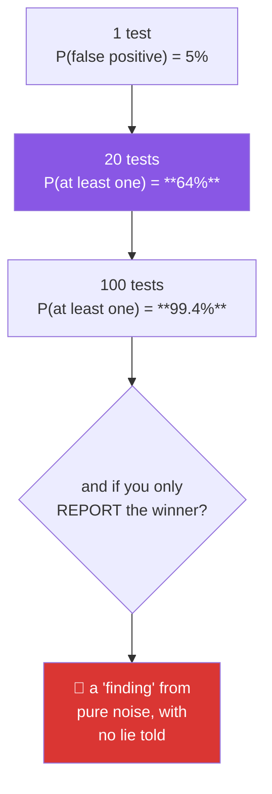

# Day 74 — Multiple comparisons and p-hacking

**Phase 9 · Module 9** · ID: **ST-21** (multiple comparisons, corrections, p-hacking)

> **Yesterday:** chi-square, and the expected-count rule measured.
> **Today:** the day you **do it on purpose.** You will manufacture a significant finding from pure
> noise — four separate ways, none of them involving a lie — and then build the corrections that stop
> it. This is the most important day in Phase 9, because every technique here is one you might
> otherwise use by accident.
> **Tomorrow:** the report, and Phase 9 closes.

```bash
./m start 74 && ./m scaffold 74
```

**Time:** 110 minutes. **Request budget:** 0 model calls.

---

## §1 The story

Day 70 established it: under a true null, p-values are Uniform(0,1), so `P(p < 0.05) = 0.05`. Run one
test on nothing and you have a 5% chance of a false positive.

Run **twenty**:

`P(at least one false positive) = 1 − 0.95²⁰ ≈ 0.64`

Two-thirds of the time, testing twenty null hypotheses produces something "significant". Nobody
cheated. Every individual test was correct.



**p-hacking is not fraud.** It is a set of individually reasonable decisions that, taken together,
guarantee a result. Four of the most common:

1. **Testing many outcomes**, reporting the one that worked.
2. **Testing many subgroups** — "it wasn't significant overall, but it was for users under 30".
3. **Optional stopping** — checking the p-value as data arrives, stopping when it dips below 0.05.
4. **Flexible analysis** — trying a few reasonable exclusions, transforms, or test choices, keeping
   the one that worked.

Every one of those is something a careful analyst might do for good reasons. What makes them
p-hacking is **not declaring how many things you tried**, and today you will measure exactly how much
each one inflates the false-positive rate.

Then the corrections, which trade against each other:

- **Bonferroni** — test each at `α/m`. Controls the probability of *any* false positive
  (family-wise error rate). Simple, correct, and brutally conservative with many tests.
- **Benjamini–Hochberg** — controls the *false discovery rate*: the expected proportion of your
  rejections that are false. Far more powerful when you have many tests, and the right choice for
  screening.

The distinction matters: FWER asks "is any of this wrong?", FDR asks "what fraction of what I report
is wrong?". For 20 planned comparisons the first is right; for 20,000 gene tests the second is the
only usable option.

---

## §2 Setup — run this

```bash
mkdir -p days/day-74/lab
touch days/day-74/lab/phacking.py
```

`src/setu/stats.py` grows today. No new packages.

---

## §3 ST-21 — manufacturing a finding

`days/day-74/lab/phacking.py`:

```python
"""ST-21: four ways to manufacture significance from noise, and the fixes."""

from __future__ import annotations

import numpy as np
import pandas as pd
from scipy import stats as sp

from setu.arrays import make_rng


def the_arithmetic() -> None:
    print(f"\n  P(at least one false positive) with α = 0.05:")
    print(f"  {'tests':>7} {'probability':>13}")
    for m in (1, 2, 5, 10, 20, 50, 100, 1_000):
        print(f"  {m:>7} {1 - 0.95 ** m:>13.4f}")

    print("\n  At 20 tests it is more likely than not. At 100 it is essentially certain.")
    print("  Nobody has cheated. Every individual test was performed correctly.")


def hack_one_many_outcomes() -> None:
    rng = make_rng(0)
    print("\n  HACK 1 — measure 20 outcomes, report the best")

    found = 0
    for _ in range(2_000):
        control = rng.normal(100, 15, (20, 40))       # 20 outcomes, no effect on ANY
        treatment = rng.normal(100, 15, (20, 40))
        p_values = np.array([
            sp.ttest_ind(treatment[i], control[i], equal_var=False).pvalue for i in range(20)
        ])
        found += p_values.min() < 0.05

    print(f"    'we found a significant effect' rate: {found / 2_000:.4f}")
    print(f"    predicted by 1 − 0.95²⁰            : {1 - 0.95 ** 20:.4f}")
    print("\n  Every outcome was pure noise. Two-thirds of studies report a finding.")


def hack_two_subgroups() -> None:
    rng = make_rng(1)
    print("\n  HACK 2 — no overall effect? Try subgroups.")

    found_overall, found_any = 0, 0
    for _ in range(2_000):
        n = 400
        outcome = rng.normal(100, 15, n)
        group = rng.integers(0, 2, n)                  # treatment/control, no real effect
        age = rng.integers(18, 70, n)
        region = rng.integers(0, 4, n)
        gender = rng.integers(0, 2, n)

        overall = sp.ttest_ind(outcome[group == 1], outcome[group == 0], equal_var=False).pvalue
        found_overall += overall < 0.05

        significant = overall < 0.05
        for mask in (age < 30, age >= 50, region == 0, region == 1,
                     region == 2, region == 3, gender == 0, gender == 1):
            sub_a = outcome[mask & (group == 1)]
            sub_b = outcome[mask & (group == 0)]
            if len(sub_a) > 5 and len(sub_b) > 5:
                if sp.ttest_ind(sub_a, sub_b, equal_var=False).pvalue < 0.05:
                    significant = True
        found_any += significant

    print(f"    overall effect found      : {found_overall / 2_000:.4f}   <- correct, ≈ α")
    print(f"    'effect in some subgroup' : {found_any / 2_000:.4f}")
    print("\n  ⚠️ 'It wasn't significant overall, but it WAS for users under 30' is the")
    print("     single most common form this takes, and it sounds like a careful finding.")


def hack_three_optional_stopping() -> None:
    rng = make_rng(2)
    print("\n  HACK 3 — peek at the data as it arrives, stop when p < 0.05")

    for max_n, peek_every in ((200, 10), (500, 10), (1_000, 10)):
        stopped_early = 0
        for _ in range(1_500):
            a = rng.normal(100, 15, max_n)
            b = rng.normal(100, 15, max_n)             # identical populations
            for n in range(20, max_n + 1, peek_every):
                if sp.ttest_ind(b[:n], a[:n], equal_var=False).pvalue < 0.05:
                    stopped_early += 1
                    break
        print(f"    max n={max_n:>5}, peeking every {peek_every}: "
              f"false-positive rate {stopped_early / 1_500:.4f}")

    print("\n  The longer you are willing to keep looking, the closer to 1.0 it goes.")
    print("  With unlimited data and unlimited peeking, you will ALWAYS eventually")
    print("  cross 0.05 — the p-value random-walks and 0.05 is not an absorbing floor.")
    print("\n  This is why A/B tests need a pre-registered sample size, or a sequential")
    print("  method designed for peeking (which spends α across the looks).")


def hack_four_flexible_analysis() -> None:
    rng = make_rng(3)
    print("\n  HACK 4 — try a few reasonable analysis choices, keep what worked")

    found = 0
    for _ in range(2_000):
        a = rng.normal(100, 15, 60)
        b = rng.normal(100, 15, 60)                    # no effect

        candidates = [
            sp.ttest_ind(b, a, equal_var=False).pvalue,
            sp.ttest_ind(b, a, equal_var=True).pvalue,
            sp.mannwhitneyu(b, a).pvalue,
            sp.ttest_ind(np.log(np.abs(b) + 1), np.log(np.abs(a) + 1), equal_var=False).pvalue,
        ]
        # "remove outliers" — a defensible-sounding step
        a_trim = a[np.abs(sp.zscore(a)) < 2]
        b_trim = b[np.abs(sp.zscore(b)) < 2]
        candidates.append(sp.ttest_ind(b_trim, a_trim, equal_var=False).pvalue)

        found += min(candidates) < 0.05

    print(f"    5 defensible analysis choices, report the best: {found / 2_000:.4f}")
    print("\n  Not one of those steps is dishonest in isolation. 'We removed outliers'")
    print("  and 'the data was skewed so we used a rank test' are things people write.")
    print("  The problem is the SELECTION, and it is invisible in the write-up.")


def the_garden_of_forking_paths() -> None:
    print("\n  You do not need to run all of them. Suppose you would HAVE run a rank test")
    print("  if the data had looked skewed, and dropped outliers if any had appeared.")
    print("  Those decisions were data-dependent even though you only performed one test.")
    print("\n  The false-positive rate depends on the analyses you WOULD have run, not")
    print("  only the ones you did. That is why pre-registration exists, and why")
    print("  'I only ran one test' is not by itself a defence.")


def bonferroni_and_bh() -> None:
    rng = make_rng(4)
    print("\n  20 tests: 4 with a real effect, 16 pure noise")

    def one_experiment():
        p_values = []
        for i in range(20):
            effect = 12.0 if i < 4 else 0.0
            a = rng.normal(100, 15, 50)
            b = rng.normal(100 + effect, 15, 50)
            p_values.append(sp.ttest_ind(b, a, equal_var=False).pvalue)
        return np.array(p_values)

    uncorrected = {"tp": 0, "fp": 0, "any_fp": 0}
    bonferroni = {"tp": 0, "fp": 0, "any_fp": 0}
    bh = {"tp": 0, "fp": 0, "any_fp": 0}

    trials = 2_000
    for _ in range(trials):
        p = one_experiment()
        truth = np.arange(20) < 4

        for name, rejected in (
            ("uncorrected", p < 0.05),
            ("bonferroni", p < 0.05 / 20),
            ("bh", _bh_reject(p, 0.05)),
        ):
            target = {"uncorrected": uncorrected, "bonferroni": bonferroni, "bh": bh}[name]
            target["tp"] += (rejected & truth).sum()
            target["fp"] += (rejected & ~truth).sum()
            target["any_fp"] += bool((rejected & ~truth).any())

    print(f"\n  {'method':<14} {'true pos/trial':>15} {'false pos/trial':>17} "
          f"{'P(any false pos)':>18}")
    for name, d in (("uncorrected", uncorrected), ("bonferroni", bonferroni), ("BH", bh)):
        print(f"  {name:<14} {d['tp'] / trials:>15.3f} {d['fp'] / trials:>17.3f} "
              f"{d['any_fp'] / trials:>18.4f}")

    print("\n  Uncorrected: finds everything, and has a false positive most of the time.")
    print("  Bonferroni: P(any false positive) ≈ 0.05 as designed — and it MISSES real")
    print("    effects, because each test now runs at α = 0.0025.")
    print("  BH: more true positives than Bonferroni, at the cost of a few false ones.")
    print("\n  They control DIFFERENT things. Bonferroni: 'is any of this wrong?'")
    print("  BH: 'what fraction of what I report is wrong?' Choose by which you care about.")


def _bh_reject(p_values, alpha):
    m = len(p_values)
    order = np.argsort(p_values)
    sorted_p = p_values[order]
    thresholds = alpha * np.arange(1, m + 1) / m
    passing = np.where(sorted_p <= thresholds)[0]
    rejected = np.zeros(m, dtype=bool)
    if len(passing):
        rejected[order[: passing[-1] + 1]] = True
    return rejected


def bh_is_a_step_up_procedure() -> None:
    p_values = np.array([0.001, 0.008, 0.020, 0.031, 0.049, 0.30, 0.60])
    m, alpha = len(p_values), 0.05

    print(f"\n  {'rank':>5} {'p':>8} {'threshold (i/m)·α':>19} {'≤?':>4}")
    for i, p in enumerate(np.sort(p_values), 1):
        threshold = alpha * i / m
        print(f"  {i:>5} {p:>8.4f} {threshold:>19.4f} {'yes' if p <= threshold else 'no':>4}")

    rejected = _bh_reject(p_values, alpha)
    print(f"\n  BH rejects {rejected.sum()} hypotheses")
    print(f"  Bonferroni (α/m = {alpha / m:.4f}) rejects {(p_values < alpha / m).sum()}")

    print("\n  ⚠️ BH finds the LARGEST rank that passes, then rejects everything below it —")
    print("     including tests that individually failed their own threshold. That step-up")
    print("     rule is what makes it more powerful, and it is easy to implement wrongly.")


def what_honesty_looks_like() -> None:
    print("\n  none of this requires a lie. The fix is DISCLOSURE:")
    print("    - state how many comparisons you made, including the ones you discarded")
    print("    - state your analysis plan BEFORE seeing the data (pre-registration)")
    print("    - report every outcome you measured, not only the significant ones")
    print("    - separate CONFIRMATORY tests from EXPLORATORY ones, and label them")
    print("    - an exploratory finding is a HYPOTHESIS, and needs fresh data to confirm")
    print("\n  That last one is Principle 15 in statistical clothing: the data that")
    print("  GENERATED a hypothesis cannot also be the data that TESTS it.")


if __name__ == "__main__":
    the_arithmetic()
    hack_one_many_outcomes()
    hack_two_subgroups()
    hack_three_optional_stopping()
    hack_four_flexible_analysis()
    the_garden_of_forking_paths()
    bonferroni_and_bh()
    bh_is_a_step_up_procedure()
    what_honesty_looks_like()
```

**Line by line:**

- `the_arithmetic` — `1 − 0.95^m`. At 20 tests it is **more likely than not** that something comes up
  significant on pure noise. This is not a subtle statistical effect; it is compound probability.
- `hack_one_many_outcomes` — the simulated rate matches the predicted `0.64`. **Twenty outcomes, none
  real, and two-thirds of studies report a finding.**
- `hack_two_subgroups` — the overall test behaves correctly at ≈ α, and then eight subgroup tests
  push the "found something" rate far above it. **"It wasn't significant overall, but it was for users
  under 30" is the most common form this takes**, and it reads like careful, thorough analysis.
- `hack_three_optional_stopping` — **run this and watch the rate climb with `max_n`.** The p-value
  random-walks as data accumulates, and 0.05 is not a floor it stays above. With unlimited data and
  unlimited peeking you will *always* eventually cross it. This is why A/B tests need a pre-registered
  sample size or a sequential design that spends α across the looks.
- `hack_four_flexible_analysis` — five *defensible* choices. "We removed outliers" and "the data was
  skewed so we used a rank test" are sentences people write in good faith. **The problem is the
  selection, and it is invisible in the write-up.**
- `the_garden_of_forking_paths` — the subtlest point, and worth reading twice. **You do not need to
  run all the analyses.** If your choice of test depended on what the data looked like, the
  false-positive rate reflects the analyses you *would have* run. "I only ran one test" is not by
  itself a defence.
- `bonferroni_and_bh` — **read all three rows.** Uncorrected finds everything including a false
  positive most of the time. Bonferroni pins `P(any false positive)` at ≈ 0.05 exactly as designed,
  and misses real effects because each test now runs at α = 0.0025. BH recovers many of those true
  positives at the cost of a few false ones. **They control different things**, and neither is simply
  better.
- `bh_is_a_step_up_procedure` — **the implementation detail that gets it wrong.** BH finds the largest
  rank whose p-value passes `(i/m)·α`, then rejects **everything below that rank** — including tests
  that individually failed their own threshold. A naive per-test comparison is not BH.
- `what_honesty_looks_like` — the fix is **disclosure**, not abstinence. And the last line is
  Principle 15 in statistical clothing: **the data that generated a hypothesis cannot also test it.**

---

## §4 Build brief

Extend `src/setu/stats.py`:

```python
def family_wise_error(m: int, *, alpha: float = 0.05) -> dict:
    """TODO(me): P(at least one false positive) across m independent tests. PURE.

    {"m", "alpha", "fwer", "per_test_alpha_for_target": float}
    - fwer = 1 - (1 - alpha) ** m
    - per_test_alpha_for_target is the Bonferroni α/m needed to hold FWER at `alpha`
    - raise DataError if m < 1 or alpha outside (0, 1)
    """
    raise NotImplementedError


def correct_p_values(p_values, *, method: str = "bh", alpha: float = 0.05) -> dict:
    """TODO(me): multiple-comparison correction.

    {"method", "alpha", "p_values", "adjusted", "rejected", "n_rejected", "n_tests"}
    - method 'bonferroni': adjusted = min(p * m, 1.0); rejected = p < alpha / m
    - method 'bh': the STEP-UP procedure (§3) — find the largest rank i where
      p_(i) <= (i/m)·alpha, then reject ALL hypotheses with rank <= i, including
      ones whose own p exceeds their threshold. A naive per-test comparison is NOT BH.
    - method 'none': passthrough, but the result must carry a warning saying so
    - adjusted p-values must be monotone in the original ordering for bh
    - raise DataError on an unknown method, an empty list, or any p outside [0, 1]
    """
    raise NotImplementedError


def analysis_log(planned: list[str]) -> dict:
    """TODO(me): a record of every comparison, including discarded ones.

    Returns a mutable log object (a dict) with:
      {"planned": [...], "performed": [], "n_planned", "n_performed"}
    plus helper semantics the caller uses via record_comparison below.
    - `planned` is declared BEFORE any test runs — that is the point
    - raise DataError on an empty plan
    """
    raise NotImplementedError


def record_comparison(log: dict, *, name: str, p_value: float,
                      exploratory: bool = False) -> dict:
    """TODO(me): append a comparison to the log. Returns a NEW log (ADR-001).

    - warn (in the returned log's 'warnings') when `name` was not in `planned` and
      exploratory is False — an unplanned confirmatory test is the thing to catch
    - p_value must be in [0, 1]; raise DataError otherwise
    """
    raise NotImplementedError


def honest_summary(log: dict, *, alpha: float = 0.05, method: str = "bh") -> dict:
    """TODO(me): the disclosure §3 argues for.

    {"n_comparisons", "n_planned", "n_unplanned", "confirmatory": {...},
     "exploratory": {...}, "uncorrected_significant": int, "corrected_significant": int,
     "statement": str, "warnings": [...]}
    - correct CONFIRMATORY tests as a family; report exploratory ones separately and
      UNCORRECTED but explicitly labelled as hypothesis-generating
    - `statement` must include the total number of comparisons made — that number is
      the disclosure, and omitting it is what turns analysis into p-hacking
    - warn when any unplanned test is reported as confirmatory
    - warn when exploratory results are present, saying they need fresh data (P15)
    """
    raise NotImplementedError


def optional_stopping_risk(*, max_n: int, peek_every: int, alpha: float = 0.05,
                           trials: int = 1_000, seed: int = 42) -> dict:
    """TODO(me): §3's hack 3, quantified.

    {"max_n", "peek_every", "n_peeks", "nominal_alpha", "actual_false_positive_rate"}
    - simulate two identical populations and stop at the first peek where p < alpha
    - the actual rate will exceed the nominal one; that gap is the deliverable
    - raise DataError if peek_every < 1 or max_n < 20
    """
    raise NotImplementedError
```

- `correct_p_values` implementing BH as a genuine **step-up procedure** is the day's correctness
  detail. The naive version — comparing each `p` to its own `(i/m)·α` — rejects fewer hypotheses and is
  a common bug.
- `analysis_log` requiring the plan **up front** is the mechanism that makes disclosure possible.
  Recording comparisons after the fact cannot distinguish planned from unplanned.
- `honest_summary` putting the **comparison count in the statement** is the fix from §3 encoded: that
  number is the disclosure, and omitting it is precisely what separates analysis from p-hacking.

---

## §5 The eval that must be able to fail

Add to `tests/test_stats.py`:

```python
from setu.stats import (
    analysis_log,
    correct_p_values,
    family_wise_error,
    honest_summary,
    optional_stopping_risk,
    record_comparison,
)


def test_the_family_wise_arithmetic():
    assert family_wise_error(20)["fwer"] == pytest.approx(1 - 0.95 ** 20)
    assert family_wise_error(20)["fwer"] > 0.6


def test_one_test_gives_alpha():
    assert family_wise_error(1, alpha=0.05)["fwer"] == pytest.approx(0.05)


def test_bonferroni_alpha_is_reported():
    assert family_wise_error(20, alpha=0.05)["per_test_alpha_for_target"] == pytest.approx(0.0025)


def test_family_wise_rejects_bad_inputs():
    with pytest.raises(DataError):
        family_wise_error(0)
    with pytest.raises(DataError):
        family_wise_error(10, alpha=1.5)


def test_bonferroni_divides_alpha():
    p = [0.001, 0.02, 0.04, 0.30]
    result = correct_p_values(p, method="bonferroni", alpha=0.05)
    assert result["rejected"].tolist() == [True, False, False, False]


def test_bonferroni_adjusted_values_are_capped_at_one():
    result = correct_p_values([0.4, 0.5], method="bonferroni")
    assert max(result["adjusted"]) <= 1.0


def test_bh_is_a_step_up_procedure():
    """The naive per-test comparison is NOT Benjamini-Hochberg."""
    p = np.array([0.001, 0.008, 0.020, 0.031, 0.049, 0.30, 0.60])
    result = correct_p_values(p, method="bh", alpha=0.05)

    naive = p <= 0.05 * (np.argsort(np.argsort(p)) + 1) / len(p)
    assert result["n_rejected"] >= naive.sum()
    assert result["n_rejected"] == 5, "BH should reject all five below the largest passing rank"


def test_bh_rejects_at_least_as_many_as_bonferroni():
    p = [0.001, 0.008, 0.02, 0.031, 0.049, 0.3, 0.6]
    bh = correct_p_values(p, method="bh")["n_rejected"]
    bonferroni = correct_p_values(p, method="bonferroni")["n_rejected"]
    assert bh >= bonferroni


def test_bh_controls_the_false_discovery_rate():
    """Among rejections, the expected false fraction stays near alpha."""
    rng = make_rng(0)
    false_fractions = []
    for _ in range(600):
        real = rng.uniform(0, 0.001, 10)          # 10 true effects
        noise = rng.uniform(0, 1, 90)             # 90 nulls
        p = np.concatenate([real, noise])
        truth = np.arange(100) < 10
        rejected = correct_p_values(p, method="bh", alpha=0.10)["rejected"]
        if rejected.sum():
            false_fractions.append((rejected & ~truth).sum() / rejected.sum())
    assert np.mean(false_fractions) < 0.15


def test_bonferroni_controls_the_family_wise_rate():
    """P(ANY false positive) stays near alpha."""
    rng = make_rng(1)
    any_false = [
        bool(correct_p_values(rng.uniform(0, 1, 20), method="bonferroni",
                              alpha=0.05)["rejected"].any())
        for _ in range(3_000)
    ]
    assert np.mean(any_false) == pytest.approx(0.05, abs=0.02)


def test_uncorrected_fails_to_control_anything():
    rng = make_rng(2)
    any_false = [
        bool(correct_p_values(rng.uniform(0, 1, 20), method="none",
                              alpha=0.05)["rejected"].any())
        for _ in range(2_000)
    ]
    assert np.mean(any_false) > 0.5, "20 uncorrected tests on noise should usually 'find' something"


def test_no_correction_carries_a_warning():
    result = correct_p_values([0.01, 0.2, 0.4], method="none")
    assert result.get("warnings"), "method='none' must say it controls nothing"


def test_correction_rejects_invalid_p_values():
    with pytest.raises(DataError):
        correct_p_values([0.5, 1.5])
    with pytest.raises(DataError):
        correct_p_values([])
    with pytest.raises(DataError):
        correct_p_values([0.1], method="holm-sidak-ish")


def test_optional_stopping_inflates_the_error_rate():
    """The p-value random-walks; 0.05 is not a floor."""
    result = optional_stopping_risk(max_n=400, peek_every=10, trials=800)
    assert result["actual_false_positive_rate"] > 0.15
    assert result["nominal_alpha"] == 0.05


def test_more_peeking_is_worse():
    rare = optional_stopping_risk(max_n=400, peek_every=100, trials=800)
    frequent = optional_stopping_risk(max_n=400, peek_every=10, trials=800)
    assert frequent["actual_false_positive_rate"] > rare["actual_false_positive_rate"]


def test_a_single_look_is_honest():
    result = optional_stopping_risk(max_n=200, peek_every=200, trials=2_000)
    assert result["actual_false_positive_rate"] == pytest.approx(0.05, abs=0.025)


def test_optional_stopping_rejects_bad_inputs():
    with pytest.raises(DataError):
        optional_stopping_risk(max_n=10, peek_every=5)


def test_the_log_records_every_comparison():
    log = analysis_log(["primary outcome"])
    log = record_comparison(log, name="primary outcome", p_value=0.03)
    log = record_comparison(log, name="secondary", p_value=0.01, exploratory=True)
    assert log["n_performed"] == 2


def test_an_unplanned_confirmatory_test_is_flagged():
    log = analysis_log(["primary outcome"])
    log = record_comparison(log, name="subgroup: under 30", p_value=0.02)
    assert log["warnings"], "an unplanned confirmatory test went unflagged"


def test_an_unplanned_exploratory_test_is_fine():
    log = analysis_log(["primary outcome"])
    log = record_comparison(log, name="subgroup: under 30", p_value=0.02, exploratory=True)
    assert not log.get("warnings")


def test_record_does_not_mutate_the_log():
    log = analysis_log(["a"])
    record_comparison(log, name="a", p_value=0.01)
    assert log["n_performed"] == 0


def test_the_summary_states_how_many_comparisons_were_made():
    """That number IS the disclosure."""
    log = analysis_log(["a", "b"])
    for name, p in (("a", 0.01), ("b", 0.30), ("c", 0.02)):
        log = record_comparison(log, name=name, p_value=p, exploratory=name == "c")
    summary = honest_summary(log)
    assert "3" in summary["statement"]
    assert summary["n_comparisons"] == 3


def test_the_summary_separates_confirmatory_from_exploratory():
    log = analysis_log(["a"])
    log = record_comparison(log, name="a", p_value=0.01)
    log = record_comparison(log, name="fishing", p_value=0.001, exploratory=True)
    summary = honest_summary(log)
    assert summary["confirmatory"]["n"] == 1
    assert summary["exploratory"]["n"] == 1


def test_exploratory_findings_are_flagged_as_needing_fresh_data():
    """Principle 15: data that generated a hypothesis cannot test it."""
    log = analysis_log(["a"])
    log = record_comparison(log, name="a", p_value=0.4)
    log = record_comparison(log, name="fishing", p_value=0.001, exploratory=True)
    summary = honest_summary(log)
    assert any("fresh" in w.lower() or "confirm" in w.lower() or "replicat" in w.lower()
               for w in summary["warnings"])


def test_correction_reduces_the_significant_count():
    log = analysis_log([f"outcome {i}" for i in range(20)])
    for i in range(20):
        log = record_comparison(log, name=f"outcome {i}", p_value=0.04)
    summary = honest_summary(log, method="bonferroni")
    assert summary["uncorrected_significant"] == 20
    assert summary["corrected_significant"] == 0


def test_a_genuinely_strong_result_survives_correction():
    log = analysis_log([f"outcome {i}" for i in range(20)])
    log = record_comparison(log, name="outcome 0", p_value=1e-8)
    for i in range(1, 20):
        log = record_comparison(log, name=f"outcome {i}", p_value=0.6)
    summary = honest_summary(log, method="bonferroni")
    assert summary["corrected_significant"] == 1
```

**Line by line:**

- `test_bh_is_a_step_up_procedure` — **the day's real assessment.** It computes the naive per-test
  comparison alongside the real BH and asserts BH rejects **at least as many**, then pins the exact
  count at 5. With those p-values the naive version rejects fewer, so an implementation that skips the
  step-up rule fails here and passes everything else.
- `test_bh_controls_the_false_discovery_rate` and `test_bonferroni_controls_the_family_wise_rate` —
  **the two corrections tested against the two different quantities they control.** BH's rejections
  contain about the right *fraction* of falsehoods; Bonferroni's `P(any false positive)` sits at α.
  Testing each against the other's target would fail, which is the point.
- `test_optional_stopping_inflates_the_error_rate` with `test_a_single_look_is_honest` — the contrast
  is the lesson. Peeking every 10 observations inflates the rate well past 0.05; looking exactly once
  at a pre-registered `n` does not.
- `test_more_peeking_is_worse` — monotonic in the peek frequency, which is a structural claim rather
  than one lucky number.
- `test_an_unplanned_confirmatory_test_is_flagged` paired with `test_an_unplanned_exploratory_test_is_fine`
  — together they force the log to distinguish **why** a test was unplanned. Exploration is legitimate
  and labelled; unplanned confirmation is the thing to catch.
- `test_the_summary_states_how_many_comparisons_were_made` — asserts the count appears **in the
  statement text**. That number is the disclosure, and a summary that omits it is the p-hacked write-up.
- `test_exploratory_findings_are_flagged_as_needing_fresh_data` — Principle 15 as an assertion.
- `test_a_genuinely_strong_result_survives_correction` — the reassurance. Correction does not destroy
  real findings; `p = 1e-8` clears Bonferroni at 20 tests comfortably.

```bash
uv run python -m pytest tests/test_stats.py -v
```

---

## §6 Request budget

| Resource | Spent today |
|---|---|
| LLM calls | **0** |
| Compute | a few hundred thousand simulated tests |

---

## §7 Traps

- **20 tests at α = 0.05.** 64% chance of a false positive. Not subtle.
- **Reporting the significant outcome of many.** The most common form of p-hacking.
- **Subgroup analysis after a null overall result.** Sounds careful; inflates the rate hugely.
- **Peeking at an A/B test.** The p-value random-walks; you will always eventually cross 0.05.
- **Trying several analysis choices and keeping the best.** Each step is defensible; the selection is not.
- **"I only ran one test."** The forking-paths problem — what *would* you have run?
- **Naive per-test BH.** It is a step-up procedure; the naive version rejects too few.
- **Bonferroni with thousands of tests.** So conservative you find nothing. Use FDR.
- **BH when you need FWER.** They control different things.
- **Confirming a hypothesis on the data that generated it.** Principle 15.
- **Omitting the comparison count.** That omission *is* the p-hack.

---

## §8 Verify before you code

Written **2026-08-21**:

- <https://docs.scipy.org/doc/scipy/reference/generated/scipy.stats.false_discovery_control.html> —
  SciPy's BH implementation, worth comparing against yours.
- <https://www.statsmodels.org/stable/generated/statsmodels.stats.multitest.multipletests.html> —
  statsmodels' broader set of corrections, including Holm and Šidák.
- <https://en.wikipedia.org/wiki/Multiple_comparisons_problem> — the canonical framing.

---

## §9 Say it in an interview

> "Twenty independent tests at alpha 0.05 give you a sixty-four per cent chance of at least one false
> positive, so 'we found something significant' in a study with twenty outcomes is close to
> meaningless without disclosure. I simulated four ways to manufacture a finding from pure noise —
> many outcomes, subgroups, optional stopping, and flexible analysis choices — and none of them
> requires a lie. The one people underrate is optional stopping: if you peek at an A/B test as data
> arrives and stop when p dips below 0.05, the false-positive rate climbs toward one, because the
> p-value random-walks and 0.05 isn't a floor. On corrections, the thing worth knowing is that
> Bonferroni and Benjamini-Hochberg control *different* quantities — 'is any of this wrong' versus
> 'what fraction of what I report is wrong' — and BH is a step-up procedure, so you find the largest
> rank that passes and reject everything below it, including tests that individually failed. The naive
> per-test version is a real bug and I have a test that catches it."

---

## §10 Done when

Tick [`CHECKLIST.md`](CHECKLIST.md), then `./m check && ./m done 74`.
