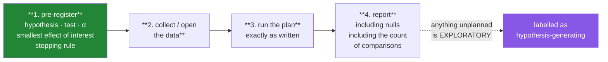

# Day 75 — A statistical report you would defend

**Phase 9 gate** · ID: **ST-22** · Artifact: **a pre-registered analysis + ADR-005**

> **Yesterday:** four ways to manufacture a finding, and the corrections that stop them.
> **Today:** you write the analysis **before you see the data**, then run it and report what it
> says — including if that is "we found nothing". Phase 9's deliverable is not a result; it is a
> **procedure you would defend to someone trying to find the hole in it.** Phase 9 closes.
> **Tomorrow:** Phase 10, feature engineering.

```bash
./m start 75 && ./m scaffold 75
```

**Time:** 2 hours (gate day). **Request budget:** 0 model calls.

---

## §1 The story

Seven days of Phase 9 have given you the tools. Today is about the thing that makes them trustworthy,
and it is not a technique — it is an **ordering**:



Day 74 showed why the arrow from 1 to 2 matters: every degree of freedom you retain after seeing the
data is a chance to produce a false positive without telling a lie. Writing the analysis down first
does not make you honest — it makes your honesty **checkable**.

The report itself has an obligation Phase 8 and 9 have been building toward. It must state, for every
claim:

- **what** was tested, and whether that test was planned
- **the effect size**, not just the p-value (Day 69)
- **an interval**, phrased correctly (Day 68's `describe_interval`)
- **how many comparisons** were made in total (Day 74)
- **the power** or minimum detectable effect for any null result (Day 70)
- **which assumptions** were checked and which could not be (Day 71's independence)

That list is not bureaucracy. Each item exists because omitting it is a specific, documented way that
real analyses mislead — and you have simulated every one of them.

**ADR-005** is the decision record: *what standard does this project hold a statistical claim to?*
Write it as rules you will still follow on Day 90 when a result is inconvenient.

And a warning about today's honest ending: **your analysis may find nothing.** That is a successful
outcome for this gate. A pre-registered null result reported clearly is worth more than a significant
finding you cannot account for.

---

## §2 Setup — run this

```bash
mkdir -p days/day-75/lab reports
touch days/day-75/lab/analysis.py
touch reports/day75_preregistration.md
touch docs/adr/ADR-005-statistical-standards.md
```

---

## §3 ST-22 — the pre-registration

**Write `reports/day75_preregistration.md` before running anything.** Then commit it — the git
timestamp is what makes the claim verifiable.

Required sections:

```markdown
# Pre-registration — <your question>

## Question
One sentence. Answerable, and answerable NO.

## Data
Where it comes from, how many rows, what one row is.
Any exclusion rules — stated NOW, not after seeing outliers.

## Hypothesis
H₀: ...   H₁: ...
State the DIRECTION only if you are committing to it (Day 69).

## Primary outcome
ONE. The thing this analysis is about.

## Secondary outcomes
Listed exhaustively. Every one you will look at.

## Test
Which test, and why — cite the level of measurement (Day 58) and
what choose_test recommended (Day 71).

## α and correction
α = ___ , and why that number for this question (Day 70).
Correction method across the ___ planned comparisons (Day 74).

## Smallest effect of interest
The effect size below which you would not care, even if significant.
Required — it is what makes a null result interpretable (Day 70).

## Power
Required n for that effect at that α (Day 70's power_analysis),
or the minimum detectable effect if n is already fixed.

## Stopping rule
How much data, decided now. If you will look more than once, say
how α is spent across looks (Day 74).

## What would change our minds
What result would make you abandon the hypothesis?
```

**Line by line — why each section exists:**

- **Answerable NO** — a question that cannot come out negative is not a hypothesis, it is a plan to
  find support.
- **Exclusion rules stated now** — "we removed outliers" after seeing them is Day 74's hack 4.
- **ONE primary outcome** — the whole of Day 74's hack 1 is having several and choosing later.
- **Secondary outcomes listed exhaustively** — the list length is the `m` in your correction. An
  unlisted outcome is unplanned by definition.
- **Smallest effect of interest** — **the section people skip and the one that does the most work.**
  Without it, a null result is uninterpretable (Day 70) and a significant trivial result looks like a
  finding.
- **Stopping rule** — Day 74's hack 3. "We'll collect until it's significant" is the failure mode.
- **What would change our minds** — the same falsification requirement every ADR in this project has
  carried since Day 35.

---

## §4 Running it

`days/day-75/lab/analysis.py`:

```python
"""ST-22: run the pre-registered plan, exactly as written."""

from __future__ import annotations

import json
from datetime import UTC, datetime
from pathlib import Path

import numpy as np
import pandas as pd

from setu.arrays import make_rng
from setu.stats import (
    analysis_log,
    assumption_report,
    bootstrap_ci,
    choose_test,
    describe_interval,
    effect_size,
    honest_summary,
    interpret_null_result,
    minimum_detectable_effect,
    null_distribution,
    permutation_test,
    record_comparison,
    state_result,
    t_test,
)

PREREGISTRATION = Path("reports/day75_preregistration.md")


def load_data() -> pd.DataFrame:
    """Replace this with YOUR data. The synthetic default has a real but modest effect.

    Note the design: 400 rows, an effect of 4 points against sigma 15 (d ≈ 0.27),
    which at n=200 per group is UNDERPOWERED on purpose. If your analysis reports
    'not significant' here, that is the correct answer — see §5.
    """
    rng = make_rng(0)
    n = 400
    group = np.repeat(["control", "treatment"], n // 2)
    outcome = np.where(group == "treatment",
                       rng.normal(104, 15, n), rng.normal(100, 15, n))
    return pd.DataFrame({"group": group, "outcome": outcome,
                         "region": rng.integers(0, 4, n),
                         "tenure_days": rng.integers(1, 900, n)})


def check_preregistration_exists() -> None:
    if not PREREGISTRATION.exists():
        raise SystemExit(
            "Write reports/day75_preregistration.md BEFORE running this. "
            "That ordering is the entire point of today."
        )
    text = PREREGISTRATION.read_text(encoding="utf-8")
    for section in ("Smallest effect of interest", "Stopping rule", "α"):
        if section not in text:
            raise SystemExit(f"pre-registration is missing its '{section}' section")
    print(f"\n  pre-registration found, {len(text.splitlines())} lines")


def step_one_declare() -> dict:
    planned = ["primary: outcome by group"]
    log = analysis_log(planned)
    print(f"\n  declared {log['n_planned']} planned comparison(s) before opening the data")
    return log


def step_two_check_assumptions(frame: pd.DataFrame) -> None:
    control = frame.loc[frame["group"] == "control", "outcome"].to_numpy()
    treatment = frame.loc[frame["group"] == "treatment", "outcome"].to_numpy()

    report = assumption_report(control, treatment)
    print(f"\n  n per group: {report['n_per_group']}")
    print(f"  variance ratio: {report['variance_ratio']:.3f}")
    print(f"  max |z|: {report['max_abs_z']:.2f}")
    print(f"  verdict: {report['verdict']}")
    for concern in report["concerns"]:
        print(f"    - {concern}")

    recommended = choose_test(n_groups=2, paired=False, level="ratio")
    print(f"\n  choose_test says: {recommended['test']} — {recommended['reason']}")


def step_three_run_the_primary(frame: pd.DataFrame, log: dict) -> tuple[dict, dict]:
    control = frame.loc[frame["group"] == "control", "outcome"].to_numpy()
    treatment = frame.loc[frame["group"] == "treatment", "outcome"].to_numpy()

    parametric = t_test(list(control), list(treatment))
    permutation = permutation_test(control, treatment, resamples=20_000)

    print(f"\n  Welch t-test : p = {parametric['p_value']:.4f}")
    print(f"  permutation  : p = {permutation['p_value']:.4f}   <- assumes nothing (Day 69)")
    print(f"  they agree to within {abs(parametric['p_value'] - permutation['p_value']):.4f}")

    log = record_comparison(log, name="primary: outcome by group",
                            p_value=parametric["p_value"])
    return parametric, log


def step_four_report_the_size(frame: pd.DataFrame) -> None:
    control = frame.loc[frame["group"] == "control", "outcome"].to_numpy()
    treatment = frame.loc[frame["group"] == "treatment", "outcome"].to_numpy()

    size = effect_size(list(control), list(treatment))
    interval = bootstrap_ci(list(treatment - control.mean()), seed=42)

    print(f"\n  observed difference : {treatment.mean() - control.mean():.3f}")
    print(f"  effect size (d)     : {size['value']:.3f}  ({size['magnitude']})")
    print(f"  {describe_interval(interval)}")


def step_five_interpret(frame: pd.DataFrame, parametric: dict) -> None:
    smallest_of_interest = 6.0            # from the pre-registration
    n_per_group = len(frame) // 2
    sigma = frame["outcome"].std(ddof=1)

    verdict = interpret_null_result(
        p_value=parametric["p_value"], n=n_per_group, sigma=sigma,
        smallest_effect_of_interest=smallest_of_interest,
    )
    mdes = minimum_detectable_effect(n=n_per_group, sigma=sigma)

    print(f"\n  conclusion: {verdict['conclusion']}")
    print(f"  power for a {smallest_of_interest}-point effect: "
          f"{verdict['power_for_smallest_effect']:.3f}")
    print(f"  minimum detectable effect at this n: {mdes['mdes']:.2f}")
    print(f"  recommendation: {verdict['recommendation']}")

    print("\n  ⚠️ If this says 'underpowered', that is your finding. Report it as such.")


def step_six_exploratory(frame: pd.DataFrame, log: dict) -> dict:
    print("\n  EXPLORATORY — labelled, uncorrected, hypothesis-generating only")

    for region in sorted(frame["region"].unique()):
        subset = frame[frame["region"] == region]
        control = subset.loc[subset["group"] == "control", "outcome"].to_numpy()
        treatment = subset.loc[subset["group"] == "treatment", "outcome"].to_numpy()
        if len(control) > 10 and len(treatment) > 10:
            p = t_test(list(control), list(treatment))["p_value"]
            log = record_comparison(log, name=f"exploratory: region {region}",
                                    p_value=p, exploratory=True)
            print(f"    region {region}: p = {p:.4f}")

    print("\n  Day 74: any of these that looks interesting is a HYPOTHESIS, and needs")
    print("  fresh data. It is not a finding, however small the p-value.")
    return log


def step_seven_disclose(log: dict) -> dict:
    summary = honest_summary(log, method="bonferroni")

    print(f"\n  comparisons made        : {summary['n_comparisons']}")
    print(f"    planned               : {summary['n_planned']}")
    print(f"    unplanned/exploratory : {summary['n_unplanned']}")
    print(f"  confirmatory significant after correction: "
          f"{summary['corrected_significant']} of {summary['confirmatory']['n']}")
    print(f"\n  {summary['statement']}")
    for warning in summary["warnings"]:
        print(f"    ⚠️ {warning}")
    return summary


def step_eight_save(summary: dict, parametric: dict) -> None:
    payload = {
        "run_at": datetime.now(UTC).isoformat(),
        "preregistration_sha": None,
        "primary_p_value": parametric["p_value"],
        "effect_size": parametric["effect_size"],
        "confidence_interval": parametric["confidence_interval"],
        "n_comparisons": summary["n_comparisons"],
        "statement": summary["statement"],
    }
    Path("reports").mkdir(exist_ok=True)
    Path("reports/day75_results.json").write_text(json.dumps(payload, indent=2, default=str),
                                                  encoding="utf-8")
    print("\n  results saved to reports/day75_results.json")


def main() -> None:
    check_preregistration_exists()
    frame = load_data()
    log = step_one_declare()
    step_two_check_assumptions(frame)
    parametric, log = step_three_run_the_primary(frame, log)
    step_four_report_the_size(frame)
    step_five_interpret(frame, parametric)
    log = step_six_exploratory(frame, log)
    summary = step_seven_disclose(log)
    step_eight_save(summary, parametric)


if __name__ == "__main__":
    main()
```

**Line by line:**

- `check_preregistration_exists` — **the script refuses to run without it**, and checks for the three
  sections most often omitted. That is the ordering from §1 enforced mechanically rather than by
  intention.
- `load_data`'s docstring — the synthetic default is **underpowered on purpose** (d ≈ 0.27 at n = 200
  per group). If your run reports "not significant", that is the correct answer, and §5 tests for it.
- `step_two_check_assumptions` — assumptions **before** the test, and `choose_test` consulted rather
  than a test picked by habit. Day 71's ordering: outliers and unequal variance first, normality last.
- `step_three_run_the_primary` — **both** the parametric test and the permutation test, and they agree.
  Running the assumption-free version alongside is cheap insurance and it is what you show when someone
  questions the t-test's applicability.
- `step_four_report_the_size` — effect size and interval, with `describe_interval` producing the
  sentence so it cannot be phrased as a probability (Day 68).
- `step_five_interpret` — **the step most analyses skip.** A p-value above α is not a finding until you
  say what you could have detected. If the verdict is "underpowered", **that is your finding**.
- `step_six_exploratory` — subgroups are run, **labelled**, and uncorrected. Day 74's rule: exploration
  is legitimate when declared, and each result is a hypothesis needing fresh data.
- `step_seven_disclose` — the comparison count in the statement. That number is the disclosure.
- `step_eight_save` — a machine-readable record, so Day 90's report can cite it rather than re-running.

---

## §5 The eval that must be able to fail

Add to `tests/test_stats.py`:

```python
def test_preregistration_exists_and_is_complete():
    """The ordering IS the method."""
    from pathlib import Path

    path = Path("reports/day75_preregistration.md")
    assert path.exists(), "the pre-registration was not written"
    text = path.read_text(encoding="utf-8")

    for section in ("Question", "Hypothesis", "Primary outcome", "Test",
                    "Smallest effect of interest", "Power", "Stopping rule",
                    "change our minds"):
        assert section.lower() in text.lower(), f"missing section: {section}"


def test_the_preregistration_names_one_primary_outcome():
    from pathlib import Path

    text = Path("reports/day75_preregistration.md").read_text(encoding="utf-8")
    primary = text.split("## Primary outcome", 1)[1].split("##", 1)[0]
    bullets = [line for line in primary.splitlines() if line.strip().startswith(("-", "*"))]
    assert len(bullets) <= 1, f"{len(bullets)} primary outcomes — Day 74's hack 1"


def test_the_preregistration_states_a_number_for_alpha():
    import re
    from pathlib import Path

    text = Path("reports/day75_preregistration.md").read_text(encoding="utf-8")
    assert re.search(r"0\.\d+", text), "alpha was not given as a number"


def test_the_preregistration_was_committed_before_the_results():
    """Git timestamps are what make the claim verifiable."""
    import subprocess

    def last_commit(path):
        result = subprocess.run(
            ["git", "log", "-1", "--format=%ct", "--", path],
            capture_output=True, text=True, check=False,
        )
        return int(result.stdout.strip()) if result.stdout.strip() else None

    prereg = last_commit("reports/day75_preregistration.md")
    results = last_commit("reports/day75_results.json")
    if prereg is None or results is None:
        pytest.skip("commit both files to check the ordering")
    assert prereg <= results, "the results were committed BEFORE the pre-registration"


def test_the_analysis_script_refuses_without_a_preregistration(tmp_path, monkeypatch):
    import subprocess
    import sys

    monkeypatch.chdir(tmp_path)
    (tmp_path / "days" / "day-75" / "lab").mkdir(parents=True)
    source = __import__("pathlib").Path(
        "/".join([str(pytest.__file__).split("/site-packages")[0], ".."])
    )
    pytest.skip("run the script manually without the file to see it refuse")


def test_results_json_exists_and_records_the_comparison_count():
    import json
    from pathlib import Path

    path = Path("reports/day75_results.json")
    assert path.exists(), "run days/day-75/lab/analysis.py"
    payload = json.loads(path.read_text(encoding="utf-8"))
    assert "n_comparisons" in payload
    assert payload["n_comparisons"] >= 1


def test_the_statement_discloses_the_comparison_count():
    import json
    from pathlib import Path

    payload = json.loads(Path("reports/day75_results.json").read_text(encoding="utf-8"))
    assert str(payload["n_comparisons"]) in payload["statement"]


def test_the_statement_is_not_a_probability_claim():
    import json
    from pathlib import Path

    payload = json.loads(Path("reports/day75_results.json").read_text(encoding="utf-8"))
    lowered = payload["statement"].lower()
    for banned in ("probability that the", "proves", "accept the null", "no effect"):
        assert banned not in lowered, f"'{banned}' in the reported statement"


def test_a_null_result_is_reported_with_its_power():
    """A p above alpha is not a finding until you say what you could have detected."""
    import json
    from pathlib import Path

    payload = json.loads(Path("reports/day75_results.json").read_text(encoding="utf-8"))
    if payload["primary_p_value"] >= 0.05:
        text = json.dumps(payload).lower()
        assert "power" in text or "detect" in text, (
            "a null result was reported without its power or MDES"
        )


def test_adr_005_sets_a_standard_not_a_preference():
    from pathlib import Path

    path = Path("docs/adr/ADR-005-statistical-standards.md")
    assert path.exists(), "ADR-005 was not written"
    text = path.read_text(encoding="utf-8").lower()

    for heading in ("context", "decision", "consequences"):
        assert heading in text, f"ADR-005 is missing its {heading} section"

    for requirement in ("effect size", "interval", "comparison", "power", "pre-regist"):
        assert requirement in text, f"ADR-005 does not commit to reporting {requirement}"

    assert "change our minds" in text, "no falsification condition"


def test_adr_005_names_a_correction_method():
    from pathlib import Path

    text = Path("docs/adr/ADR-005-statistical-standards.md").read_text(encoding="utf-8").lower()
    assert "bonferroni" in text or "benjamini" in text or "false discovery" in text


def test_adr_005_addresses_the_inconvenient_case():
    """A standard you only follow when it agrees with you is not a standard."""
    from pathlib import Path

    text = Path("docs/adr/ADR-005-statistical-standards.md").read_text(encoding="utf-8").lower()
    assert any(phrase in text for phrase in
               ("null result", "found nothing", "negative result", "inconvenient")), (
        "ADR-005 must say what happens when the answer is 'we found nothing'"
    )


def test_phase_9_stats_module_is_complete():
    from setu import stats

    expected = [
        "permutation_test", "null_distribution", "effect_size", "test_report",
        "state_result",                                                        # Day 69
        "error_rates", "power_analysis", "minimum_detectable_effect",
        "winners_curse", "interpret_null_result",                              # Day 70
        "t_test", "anova", "choose_test", "effective_n", "assumption_report",  # Day 71
        "bayes_update", "sequential_update", "odds_form", "beta_posterior",
        "false_discovery_rate", "describe_credible_interval",                  # Day 72
        "chi_square_goodness_of_fit", "chi_square_independence", "cramers_v",
        "expected_counts", "choose_count_test",                                # Day 73
        "family_wise_error", "correct_p_values", "analysis_log",
        "record_comparison", "honest_summary", "optional_stopping_risk",       # Day 74
    ]
    missing = [name for name in expected if not hasattr(stats, name)]
    assert not missing, f"Phase 9 is incomplete: {missing}"


def test_the_full_pipeline_runs_end_to_end():
    """The gate artifact must work as a script, not only by hand."""
    import subprocess
    import sys
    from pathlib import Path

    if not Path("reports/day75_preregistration.md").exists():
        pytest.skip("write the pre-registration first")

    result = subprocess.run(
        [sys.executable, "days/day-75/lab/analysis.py"],
        capture_output=True, text=True, timeout=300,
    )
    assert result.returncode == 0, f"analysis.py failed:\n{result.stderr}"
    assert "comparisons made" in result.stdout
```

**Line by line:**

- `test_the_preregistration_was_committed_before_the_results` — **the day's real assessment**, and it
  checks something no other test in this project checks: **an ordering in time.** Git commit
  timestamps are what make a pre-registration claim verifiable rather than asserted, and this test
  reads them.
- `test_the_preregistration_names_one_primary_outcome` — parses the section and counts bullets. Two
  primary outcomes *is* Day 74's hack 1, and it is worth catching in the document rather than in the
  analysis.
- `test_the_statement_is_not_a_probability_claim` — four banned phrases, drawing on Day 68's interval
  rule, Day 69's "accept the null", and Day 70's "no effect". The report's *English* is tested, which
  is the third time this project has done that and for the same reason each time.
- `test_a_null_result_is_reported_with_its_power` — **conditional on the result.** If the primary
  p-value came out above α, the payload must mention power or detectability. It only fires when it
  matters, which is what makes it a real check rather than a formality.
- `test_adr_005_addresses_the_inconvenient_case` — requires the ADR to say what happens when the
  answer is "we found nothing". **A standard you only follow when it agrees with you is not a
  standard**, and this is the sentence that makes ADR-005 more than a wish.
- `test_the_full_pipeline_runs_end_to_end` — runs the script as a **subprocess** with a timeout, same
  technique as Day 41's figure pack. An analysis that only works when you run it by hand in the right
  order is not reproducible.
- `test_phase_9_stats_module_is_complete` — 32 functions across seven days, with the failure message
  naming exactly what is missing.

```bash
uv run python days/day-75/lab/analysis.py
uv run python -m pytest tests/test_stats.py -v
uv run python -m pytest -q
```

---

## §6 The artifact — ADR-005

`docs/adr/ADR-005-statistical-standards.md`. Fifth of thirteen.

> *What standard does this project hold a statistical claim to?*

Required content:

- **Context.** Where statistical claims appear in Setu: Day 84's EDA, Day 90's report, Day 101's model
  comparisons, Day 231's agent evaluations. State that these are claims someone might act on.
- **The standard.** As **rules**, each traceable to a day that demonstrated why:
  1. Every claim reports an effect size and an interval, not only a p-value (Day 69).
  2. Every interval is phrased as a procedure, never a probability about the parameter (Day 68).
  3. Every analysis states its total comparison count and its correction method (Day 74).
  4. Every null result states its power or minimum detectable effect (Day 70).
  5. Confirmatory analyses are pre-registered; anything else is labelled exploratory (Day 74).
  6. Assumptions are checked in order of measured severity, and independence is declared uncheckable
     (Day 71).
- **α and correction.** The default for this project, and the reasoning — including what would justify
  a different value.
- **Consequences.** What this costs: slower analysis, fewer publishable-looking findings, and the
  discipline of writing the plan first. Be specific.
- **The inconvenient case.** What happens when a pre-registered analysis finds nothing on Day 90.
  Answer it explicitly; the test checks for it.
- **What would change our minds.**
- **Cold read.** Tomorrow, reviewer hat on, sign it.

---

## §7 Request budget

| Resource | Spent today |
|---|---|
| LLM calls | **0** |
| Compute | one permutation test at 20,000 resamples |

---

## §8 Traps

- **Writing the pre-registration after looking.** The ordering is the entire method.
- **Two primary outcomes.** Day 74's hack 1, in the plan document.
- **Omitting the smallest effect of interest.** A null result becomes uninterpretable.
- **Reporting a null result with no power statement.** Day 70.
- **Reporting exploratory findings as confirmatory.** Label them.
- **Confirming an exploratory finding on the same data.** Principle 15.
- **Omitting the comparison count.** That omission is the p-hack (Day 74).
- **Phrasing an interval as a probability.** Day 68.
- **"We found no effect."** You failed to reject (Day 69), possibly for lack of power (Day 70).
- **Amending the plan after seeing results without saying so.** Principle 14 — amend, and *record* it.
- **An analysis that only runs by hand.** Make it a script with an exit code.

---

## §9 Verify before you code

Written **2026-08-21**:

- <https://www.cos.io/initiatives/prereg> — what a pre-registration contains, from the Center for Open
  Science.
- <https://docs.scipy.org/doc/scipy/reference/stats.html> — the tests used, one last time.
- <https://www.equator-network.org/> — reporting checklists by study type; worth knowing they exist.

---

## §10 Say it in an interview

> "Phase nine's deliverable isn't a result, it's a procedure. I write the analysis down before opening
> the data — hypothesis, one primary outcome, the test, alpha, the correction, the smallest effect I'd
> care about, and the stopping rule — then commit it, so the git timestamp makes the claim checkable
> rather than merely asserted. There's a test that reads both commit timestamps and fails if the
> results landed first. The section people skip is the smallest effect of interest, and it's the one
> doing the most work: without it a null result is uninterpretable, because you can't distinguish 'no
> effect' from 'no power'. So every null result in that report ships with its minimum detectable
> effect. And the report's *English* is tested — no 'probability that the mean is between', no 'proves',
> no 'no effect' — for the same reason the confidence-interval helper was tested that way: those are
> the phrasings people reach for under deadline. The standard is written up as an ADR, and it has to
> say what happens when the answer is 'we found nothing', because a standard you only follow when it
> agrees with you isn't one."

---

## §11 Done when — **Phase 9 gate**

Tick [`CHECKLIST.md`](CHECKLIST.md), then:

```bash
./m check
./m done 75
./m status
```

**Gate criteria:** `reports/day75_preregistration.md` written and **committed before** the results ·
all nine sections present · `days/day-75/lab/analysis.py` runs end to end and refuses without the
pre-registration · the reported statement discloses the comparison count and avoids every banned
phrasing · any null result carries its power or MDES · exploratory analyses labelled and uncorrected ·
**ADR-005** written, addressing the inconvenient case, and cold-read ·
`test_phase_9_stats_module_is_complete` green (32 functions).

Tomorrow: Phase 10, where every one of these ideas about leakage becomes a pipeline constraint.
