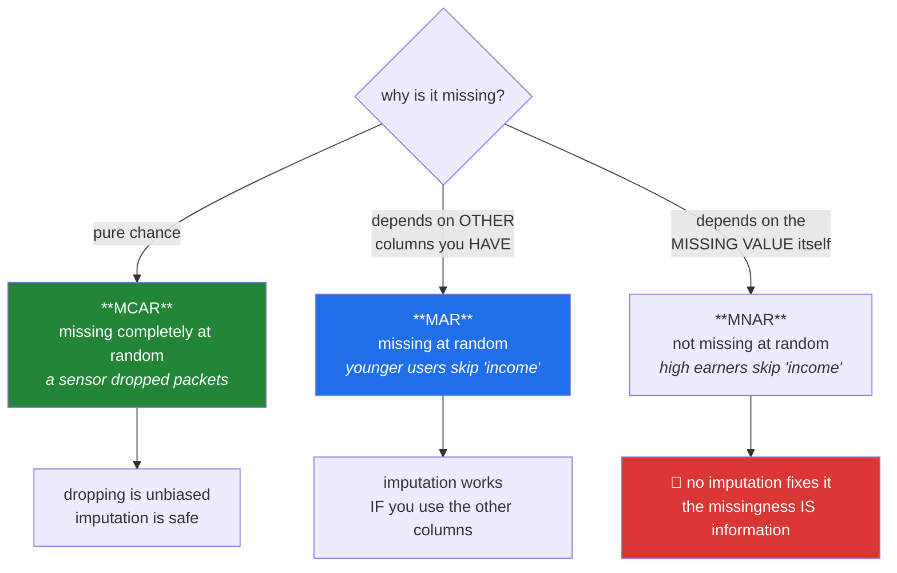

# Day 76 — Missing data: the mechanism decides the fix

**Phase 10 · Module 10 · Feature engineering** · ID: **FE-01** (missing data mechanisms, imputation strategies)

> **Yesterday:** Phase 9 closed with a pre-registered analysis and ADR-005.
> **Today:** Phase 10 begins, and it begins with the question everyone skips. **Why** is this value
> missing? The answer determines whether dropping the row is safe, whether the mean is a defensible
> fill, or whether *no* imputation is honest — and you will simulate all three mechanisms to see the
> difference.
> **Tomorrow:** outliers.

```bash
./m start 76 && ./m scaffold 76
```

**Time:** 110 minutes. **Request budget:** 0 model calls.

---

## §1 The story

Day 30 built `missingness_report` and deliberately stopped short of filling anything. Day 34's
`quality_report` counted missing values without touching them. That restraint was on purpose, because
imputation without understanding the mechanism is how you inject a bias you will never find again.

There are three mechanisms, and they are genuinely different situations:



The names are unhelpfully similar, so hold the examples instead:

- **MCAR** — the sensor dropped packets. Nothing about the row predicts the gap. Dropping those rows
  loses power but introduces no bias.
- **MAR** — younger users skip the income question. The missingness depends on `age`, which **you
  have**. A model that uses `age` can fill sensibly.
- **MNAR** — high earners skip the income question. The missingness depends on the income itself,
  which you do **not** have. **No imputation can recover it**, because the information needed is
  exactly what is absent.

Three consequences that matter more than any technique:

**You cannot test for MNAR.** MCAR is testable (does missingness relate to observed columns?). MAR
versus MNAR is **not** decidable from the data, because the deciding variable is missing. It is a
judgement about how the data was generated — which makes Principle 9 load-bearing, not decorative.

**Mean imputation shrinks variance and distorts correlations.** Filling 30% of a column with its own
mean makes that column artificially certain and drags every correlation it participates in toward
zero. You will measure both in §3.

**The missingness is often a feature.** An indicator column saying "this was missing" frequently
carries more signal than whatever you imputed — and in the MNAR case it is the only honest thing you
can offer the model.

---

## §2 Setup — run this

```bash
uv add "scikit-learn==1.9.0"
mkdir -p days/day-76/lab
touch days/day-76/lab/missing.py
touch src/setu/features.py
touch tests/test_features.py
```

Pin whatever **your** Day-1 verify run reported. `src/setu/features.py` is Phase 10's module and grows
for eight days.

---

## §3 FE-01 — mechanisms

`days/day-76/lab/missing.py`:

```python
"""FE-01: the three missingness mechanisms, and what each permits."""

from __future__ import annotations

import numpy as np
import pandas as pd
from scipy import stats as sp

from setu.arrays import make_rng


def build(n: int = 5_000) -> pd.DataFrame:
    rng = make_rng(0)
    age = rng.integers(18, 70, n)
    income = 20_000 + age * 900 + rng.normal(0, 12_000, n)
    return pd.DataFrame({"age": age, "income": income.clip(5_000)})


def the_three_mechanisms() -> None:
    truth = build()
    rng = make_rng(1)
    n = len(truth)

    mcar = truth.copy()
    mcar.loc[rng.random(n) < 0.3, "income"] = np.nan

    mar = truth.copy()
    p_missing = np.where(truth["age"] < 35, 0.6, 0.05)
    mar.loc[rng.random(n) < p_missing, "income"] = np.nan

    mnar = truth.copy()
    threshold = truth["income"].quantile(0.7)
    p_missing = np.where(truth["income"] > threshold, 0.7, 0.05)
    mnar.loc[rng.random(n) < p_missing, "income"] = np.nan

    print(f"\n  true mean income = {truth['income'].mean():,.0f}")
    print(f"\n  {'mechanism':<8} {'% missing':>10} {'observed mean':>15} {'bias':>12}")
    for name, frame in (("MCAR", mcar), ("MAR", mar), ("MNAR", mnar)):
        observed = frame["income"].mean()
        pct = frame["income"].isna().mean() * 100
        print(f"  {name:<8} {pct:>10.1f} {observed:>15,.0f} "
              f"{observed - truth['income'].mean():>+12,.0f}")

    print("\n  MCAR: the observed mean is unbiased — dropping rows is SAFE.")
    print("  MAR : biased, because young (lower-income) rows went missing more often.")
    print("        But `age` is present, so a model CAN correct for it.")
    print("  MNAR: badly biased, and `income` is exactly what you do not have.")
    return mcar, mar, mnar, truth


def you_can_test_for_mcar(mcar, mar) -> None:
    print("\n  is missingness related to the columns you HAVE?")
    for name, frame in (("MCAR", mcar), ("MAR", mar)):
        missing = frame["income"].isna()
        result = sp.ttest_ind(frame.loc[missing, "age"], frame.loc[~missing, "age"],
                              equal_var=False)
        print(f"    {name}: mean age missing={frame.loc[missing, 'age'].mean():.1f} "
              f"vs present={frame.loc[~missing, 'age'].mean():.1f}  p={result.pvalue:.2e}")

    print("\n  MCAR passes; MAR fails loudly. That test is worth running on every column.")
    print("\n  ⚠️ But it CANNOT distinguish MAR from MNAR. The deciding variable is the")
    print("     missing one. That is a judgement about how the data was made (Principle 9),")
    print("     not something you can compute.")


def mean_imputation_lies(mcar, truth) -> None:
    filled = mcar.copy()
    filled["income"] = filled["income"].fillna(filled["income"].mean())
    complete = mcar.dropna()

    print(f"\n  {'':<16} {'mean':>12} {'sd':>12} {'corr(age,income)':>19}")
    for name, frame in (("truth", truth), ("complete-case", complete), ("mean-filled", filled)):
        print(f"  {name:<16} {frame['income'].mean():>12,.0f} "
              f"{frame['income'].std(ddof=1):>12,.0f} "
              f"{frame['age'].corr(frame['income']):>19.4f}")

    print("\n  Mean imputation kept the mean (that is all it is designed to do) and")
    print("  DESTROYED the standard deviation and the correlation.")
    print(f"\n  30% of the column is now exactly {filled['income'].mean():,.0f} — a spike")
    print("  that did not exist. Every downstream interval is now too narrow, and the")
    print("  model sees a relationship weaker than the real one.")


def the_indicator_carries_signal(mnar, truth) -> None:
    was_missing = mnar["income"].isna()
    print(f"\n  MNAR case: mean TRUE income where the value went missing = "
          f"{truth.loc[was_missing, 'income'].mean():,.0f}")
    print(f"                          where it was present            = "
          f"{truth.loc[~was_missing, 'income'].mean():,.0f}")

    print("\n  The missingness itself predicts the value it hides. An indicator column")
    print("  'income_was_missing' carries real signal — often MORE than any imputation.")
    print("\n  In the MNAR case it is the only honest thing you can give a model:")
    print("  'this person did not answer, and that fact means something'.")


def compare_strategies(mar, truth) -> None:
    from sklearn.impute import KNNImputer, SimpleImputer
    from sklearn.experimental import enable_iterative_imputer  # noqa: F401
    from sklearn.impute import IterativeImputer

    missing = mar["income"].isna()
    actual = truth.loc[missing, "income"].to_numpy()

    strategies = {
        "mean": SimpleImputer(strategy="mean"),
        "median": SimpleImputer(strategy="median"),
        "KNN (k=5)": KNNImputer(n_neighbors=5),
        "iterative": IterativeImputer(random_state=0, max_iter=10),
    }

    print(f"\n  MAR data — how close does each get to the TRUE hidden values?")
    print(f"  {'strategy':<14} {'RMSE':>12} {'sd of filled':>14} {'corr(age,income)':>19}")
    for name, imputer in strategies.items():
        filled = mar.copy()
        filled[["age", "income"]] = imputer.fit_transform(mar[["age", "income"]])
        rmse = np.sqrt(((filled.loc[missing, "income"].to_numpy() - actual) ** 2).mean())
        print(f"  {name:<14} {rmse:>12,.0f} {filled['income'].std(ddof=1):>14,.0f} "
              f"{filled['age'].corr(filled['income']):>19.4f}")

    print(f"\n  truth: sd={truth['income'].std(ddof=1):,.0f}, "
          f"corr={truth['age'].corr(truth['income']):.4f}")
    print("\n  KNN and iterative imputation USE `age`, which is exactly what MAR requires.")
    print("  Mean imputation ignores it and does worst on every measure.")
    print("\n  ⚠️ None of them recovers the true spread — every single-value imputation")
    print("     understates uncertainty. Multiple imputation exists for that; it is out")
    print("     of scope here, but knowing the limitation is not.")


def dropping_is_sometimes_right(mar) -> None:
    complete = mar.dropna()
    print(f"\n  complete-case analysis: {len(complete):,} of {len(mar):,} rows kept "
          f"({len(complete) / len(mar):.1%})")
    print(f"  mean age kept = {complete['age'].mean():.1f} vs {mar['age'].mean():.1f} overall")

    print("\n  Under MCAR: unbiased, just less powerful. Often the right call.")
    print("  Under MAR : biased, because you dropped a non-random subset — see the ages.")
    print("\n  ⚠️ And `dropna()` on a whole frame drops a row if ANY column is missing.")
    print("     With 10 columns at 5% missing each, that is ~40% of your data gone.")


def the_leakage_rule() -> None:
    from sklearn.impute import SimpleImputer

    rng = make_rng(2)
    train = pd.DataFrame({"x": rng.normal(100, 15, 500)})
    test = pd.DataFrame({"x": rng.normal(140, 15, 200)})     # genuinely shifted
    train.loc[rng.random(500) < 0.3, "x"] = np.nan
    test.loc[rng.random(200) < 0.3, "x"] = np.nan

    imputer = SimpleImputer(strategy="mean").fit(train[["x"]])
    correct = imputer.transform(test[["x"]])
    wrong = SimpleImputer(strategy="mean").fit_transform(test[["x"]])

    print(f"\n  train observed mean = {train['x'].mean():.1f}")
    print(f"  test  observed mean = {test['x'].mean():.1f}   (genuinely shifted)")
    print(f"\n  filled with TRAIN mean : test mean becomes {correct.mean():.1f}")
    print(f"  refitted on TEST       : test mean becomes {wrong.mean():.1f}")
    print("\n  Refitting on test used information from the test set to build a feature.")
    print("  Same rule as Day 66's scaler and Day 61's transform. Day 79 makes it")
    print("  structural rather than a thing you remember.")


if __name__ == "__main__":
    mcar, mar, mnar, truth = the_three_mechanisms()
    you_can_test_for_mcar(mcar, mar)
    mean_imputation_lies(mcar, truth)
    the_indicator_carries_signal(mnar, truth)
    compare_strategies(mar, truth)
    dropping_is_sometimes_right(mar)
    the_leakage_rule()
```

**Line by line:**

- `the_three_mechanisms` — **the bias column is the lesson.** MCAR's observed mean is unbiased; MAR's
  is off because low-income young rows went missing more often; MNAR's is badly off. Same 30-ish
  percent missing, three completely different situations.
- `you_can_test_for_mcar` — a t-test on `age` between the missing and present groups. MCAR passes, MAR
  fails loudly, and **this test is worth running on every column with gaps**. But the warning is the
  important half: **it cannot distinguish MAR from MNAR**, because the deciding variable is the one
  you do not have. That is a judgement about provenance, not a computation.
- `mean_imputation_lies` — **read all three columns.** Mean imputation preserves the mean, which is all
  it is designed to do, and destroys the standard deviation and the correlation. Thirty per cent of the
  column becomes one exact value — a spike that did not exist in nature. Every downstream interval is
  now too narrow.
- `the_indicator_carries_signal` — in the MNAR case the *fact* of missingness predicts the hidden
  value. An indicator column often carries more signal than any imputation, and under MNAR **it is the
  only honest thing you can give a model**.
- `compare_strategies` — RMSE against the **true hidden values**, which you only have because this is
  simulated. KNN and iterative imputation use `age` — exactly what MAR requires — and beat the mean on
  every measure. And the caveat: **no single-value imputation recovers the true spread.** Multiple
  imputation exists for that; knowing the limitation is in scope even though the technique is not.
- `dropping_is_sometimes_right` — under MCAR, complete-case analysis is unbiased and simply less
  powerful, which is often the right trade. Under MAR it is biased, visible in the shifted mean age.
  And the practical trap: **`dropna()` drops a row if *any* column is missing** — ten columns at 5%
  each removes about 40% of your data.
- `the_leakage_rule` — the imputer fitted on train and **applied** to test, versus refitted. Same rule
  as Day 66's scaler and Day 61's transform, third appearance. Day 79 makes it structural.

---

## §4 Build brief — `src/setu/features.py`

Layer 2. Phase 10's module.

```python
"""Feature engineering for Setu. Layer 2. Every transform is fit/apply, never both."""

from __future__ import annotations

from setu.errors import DataError

MECHANISMS = ("MCAR", "MAR", "MNAR", "unknown")


def missingness_mechanism_test(frame, column: str, *, alpha: float = 0.05) -> dict:
    """TODO(me): test whether missingness in `column` relates to the OTHER columns.

    {"column", "pct_missing", "related_to": [(other, p_value, direction)], "mcar_plausible",
     "verdict", "warnings": [...]}
    - for each other numeric column, a Welch t-test between the missing and present groups
    - for each categorical, a chi-square (Day 73)
    - correct across the comparisons (Day 74) — this is many tests by construction
    - mcar_plausible is True when nothing survives correction
    - `verdict` may be 'MCAR plausible' or 'not MCAR', and MUST NEVER claim MAR or MNAR:
      that distinction is undecidable from data (§3). Say so in `warnings`.
    - raise DataError if the column has no missing values, or is entirely missing
    """
    raise NotImplementedError


def missingness_impact(frame, column: str, target: str | None = None) -> dict:
    """TODO(me): what does imputing this column cost?

    {"pct_missing", "observed_mean", "observed_sd",
     "sd_after_mean_fill", "sd_shrinkage_pct",
     "correlations_before": {...}, "correlations_after_mean_fill": {...}}
    - quantifies §3's demonstration for THIS column, so a report can show it
    - sd_shrinkage_pct is the percentage reduction; it is the number that persuades
    - must not mutate the frame (ADR-001)
    """
    raise NotImplementedError


def fit_imputer(frame, columns: list[str], *, strategy: str = "median",
                add_indicator: bool = True) -> dict:
    """TODO(me): learn the fill values from TRAIN only. Returns a fitted spec.

    {"strategy", "columns", "values": {col: value}, "add_indicator", "fitted_on_n": int}
    - strategy in {'mean', 'median', 'most_frequent', 'constant'}
    - median is the DEFAULT: it is robust to the skew that Day 61 showed is everywhere
    - `values` is JSON-serialisable so the spec can be stored beside a model
    - raise DataError if a column is entirely missing (nothing to learn from)
    - raise DataError on an unknown strategy, listing the known ones
    """
    raise NotImplementedError


def apply_imputer(frame, spec: dict) -> "pd.DataFrame":
    """TODO(me): APPLY a fitted spec. Never fits. Returns a new frame.

    - add `{col}_was_missing` indicator columns when spec['add_indicator']
    - the indicator must be computed BEFORE filling, obviously — but state it, because
      getting the order wrong produces an all-zero indicator and no error
    - raise DataError if a column in the spec is absent from `frame`, naming it
    - raise DataError if `frame` has a column the spec does not cover but which
      contains missing values — silent passthrough of a gap is how a model gets NaN
    - must not mutate the input
    """
    raise NotImplementedError


def imputation_report(frame, spec: dict) -> dict:
    """TODO(me): what did the imputation actually do?

    {"columns": {col: {"n_filled", "pct_filled", "fill_value", "sd_before", "sd_after"}},
     "total_cells_filled", "warnings": [...]}
    - warn for any column above 40% missing: imputing most of a column is closer to
      inventing it, and an indicator alone may be more honest
    - Day 90's report cites this
    """
    raise NotImplementedError
```

- `missingness_mechanism_test` **refusing to claim MAR or MNAR** is the day's design decision. A
  function that outputs "MAR" would be asserting something undecidable, and someone would believe it.
- `median` as the default fill rather than `mean` follows Day 59: it is robust, and Day 61 showed skew
  is the normal case.
- `apply_imputer` **raising on an uncovered column with gaps** prevents the failure where a NaN slips
  through to a model and surfaces three steps later.

---

## §5 The eval that must be able to fail

`tests/test_features.py`:

```python
import numpy as np
import pandas as pd
import pytest

from setu.arrays import make_rng
from setu.errors import DataError
from setu.features import (
    apply_imputer,
    fit_imputer,
    imputation_report,
    missingness_impact,
    missingness_mechanism_test,
)


@pytest.fixture
def mcar_frame():
    rng = make_rng(0)
    n = 3_000
    frame = pd.DataFrame({"age": rng.integers(18, 70, n),
                          "income": rng.normal(50_000, 12_000, n)})
    frame.loc[rng.random(n) < 0.3, "income"] = np.nan
    return frame


@pytest.fixture
def mar_frame():
    rng = make_rng(1)
    n = 3_000
    age = rng.integers(18, 70, n)
    frame = pd.DataFrame({"age": age, "income": rng.normal(50_000, 12_000, n)})
    frame.loc[rng.random(n) < np.where(age < 35, 0.6, 0.05), "income"] = np.nan
    return frame


def test_mcar_is_recognised_as_plausible(mcar_frame):
    result = missingness_mechanism_test(mcar_frame, "income")
    assert result["mcar_plausible"] is True


def test_mar_is_recognised_as_not_mcar(mar_frame):
    result = missingness_mechanism_test(mar_frame, "income")
    assert result["mcar_plausible"] is False
    assert any(other == "age" for other, _, _ in result["related_to"])


def test_the_verdict_never_claims_mar_or_mnar(mar_frame):
    """That distinction is undecidable from the data."""
    result = missingness_mechanism_test(mar_frame, "income")
    assert "MNAR" not in result["verdict"]
    assert result["verdict"] in ("MCAR plausible", "not MCAR")
    assert any("undecidable" in w.lower() or "cannot" in w.lower()
               for w in result["warnings"])


def test_the_mechanism_test_corrects_for_multiple_comparisons():
    """It runs one test per other column — that is many tests by construction."""
    import inspect

    source = inspect.getsource(missingness_mechanism_test)
    assert "correct_p_values" in source or "bonferroni" in source.lower()


def test_mechanism_test_rejects_a_complete_column():
    frame = pd.DataFrame({"a": [1.0, 2.0], "b": [3.0, 4.0]})
    with pytest.raises(DataError):
        missingness_mechanism_test(frame, "a")


def test_mean_imputation_shrinks_the_standard_deviation(mcar_frame):
    result = missingness_impact(mcar_frame, "income")
    assert result["sd_after_mean_fill"] < result["observed_sd"]
    assert result["sd_shrinkage_pct"] > 10


def test_mean_imputation_weakens_correlations():
    rng = make_rng(2)
    n = 3_000
    age = rng.integers(18, 70, n)
    frame = pd.DataFrame({"age": age, "income": 20_000 + age * 900 + rng.normal(0, 8_000, n)})
    frame.loc[rng.random(n) < 0.4, "income"] = np.nan

    result = missingness_impact(frame, "income")
    assert abs(result["correlations_after_mean_fill"]["age"]) < abs(
        result["correlations_before"]["age"]
    )


def test_impact_does_not_mutate(mcar_frame):
    before = mcar_frame.copy()
    missingness_impact(mcar_frame, "income")
    pd.testing.assert_frame_equal(mcar_frame, before)


def test_median_is_the_default_strategy():
    """Skew is the normal case (Day 61)."""
    import inspect

    assert inspect.signature(fit_imputer).parameters["strategy"].default == "median"


def test_the_fitted_spec_is_json_serialisable(mcar_frame):
    import json

    json.dumps(fit_imputer(mcar_frame, ["income"])["values"])


def test_fit_rejects_an_entirely_missing_column():
    frame = pd.DataFrame({"a": [np.nan, np.nan], "b": [1.0, 2.0]})
    with pytest.raises(DataError):
        fit_imputer(frame, ["a"])


def test_fit_rejects_an_unknown_strategy(mcar_frame):
    with pytest.raises(DataError) as info:
        fit_imputer(mcar_frame, ["income"], strategy="vibes")
    assert "median" in str(info.value)


def test_train_values_are_applied_not_refitted():
    """The leak. Same rule as Days 61, 66 and 79."""
    rng = make_rng(3)
    train = pd.DataFrame({"x": rng.normal(100, 15, 800)})
    test = pd.DataFrame({"x": rng.normal(160, 15, 300)})
    train.loc[rng.random(800) < 0.3, "x"] = np.nan
    test.loc[rng.random(300) < 0.3, "x"] = np.nan

    spec = fit_imputer(train, ["x"])
    applied = apply_imputer(test, spec)
    refitted = apply_imputer(test, fit_imputer(test, ["x"]))

    assert spec["values"]["x"] == pytest.approx(train["x"].median(), rel=1e-9)
    assert applied["x"].mean() != pytest.approx(refitted["x"].mean(), rel=0.01), (
        "refitting on test produced a different feature — that is the leak"
    )


def test_apply_never_fits():
    import inspect

    source = inspect.getsource(apply_imputer)
    for banned in (".median()", ".mean()", ".mode()"):
        assert banned not in source, f"apply_imputer computes {banned} — it must only APPLY"


def test_the_indicator_is_computed_before_filling(mcar_frame):
    """Getting the order wrong gives an all-zero indicator and no error."""
    spec = fit_imputer(mcar_frame, ["income"], add_indicator=True)
    out = apply_imputer(mcar_frame, spec)
    assert "income_was_missing" in out.columns
    assert out["income_was_missing"].sum() == mcar_frame["income"].isna().sum()
    assert out["income_was_missing"].sum() > 0


def test_the_indicator_can_be_switched_off(mcar_frame):
    spec = fit_imputer(mcar_frame, ["income"], add_indicator=False)
    assert "income_was_missing" not in apply_imputer(mcar_frame, spec).columns


def test_apply_leaves_no_missing_values(mcar_frame):
    spec = fit_imputer(mcar_frame, ["income"])
    assert apply_imputer(mcar_frame, spec)["income"].isna().sum() == 0


def test_apply_rejects_an_uncovered_column_with_gaps():
    """A NaN slipping through to a model surfaces three steps later."""
    frame = pd.DataFrame({"a": [1.0, np.nan, 3.0], "b": [1.0, 2.0, np.nan]})
    spec = fit_imputer(frame, ["a"])
    with pytest.raises(DataError) as info:
        apply_imputer(frame, spec)
    assert "b" in str(info.value)


def test_apply_rejects_a_missing_spec_column(mcar_frame):
    spec = fit_imputer(mcar_frame, ["income"])
    with pytest.raises(DataError) as info:
        apply_imputer(mcar_frame.drop(columns=["income"]), spec)
    assert "income" in str(info.value)


def test_apply_does_not_mutate(mcar_frame):
    spec = fit_imputer(mcar_frame, ["income"])
    before = mcar_frame.copy()
    apply_imputer(mcar_frame, spec)
    pd.testing.assert_frame_equal(mcar_frame, before)


def test_heavy_missingness_is_warned_about():
    rng = make_rng(4)
    frame = pd.DataFrame({"x": rng.normal(size=1_000)})
    frame.loc[rng.random(1_000) < 0.7, "x"] = np.nan
    spec = fit_imputer(frame, ["x"])
    report = imputation_report(frame, spec)
    assert any("70" in w or "%" in w for w in report["warnings"])


def test_the_report_counts_what_was_filled(mcar_frame):
    spec = fit_imputer(mcar_frame, ["income"])
    report = imputation_report(mcar_frame, spec)
    assert report["columns"]["income"]["n_filled"] == mcar_frame["income"].isna().sum()
    assert report["columns"]["income"]["sd_after"] < report["columns"]["income"]["sd_before"]


def test_no_bare_fillna_in_src():
    """Every fill goes through a fitted spec."""
    from pathlib import Path

    offenders = [
        f"{p.name}:{i}"
        for p in Path("src/setu").rglob("*.py")
        if p.name != "features.py"
        for i, line in enumerate(p.read_text(encoding="utf-8").splitlines(), 1)
        if ".fillna(" in line and "noqa" not in line
    ]
    assert not offenders, f"unfitted fill found: {offenders}"
```

**Line by line:**

- `test_the_verdict_never_claims_mar_or_mnar` — **the day's real assessment.** The function may say
  "not MCAR" and must never say "MNAR", because that distinction is undecidable from the data. A
  library that outputs a confident mechanism label would be inventing information, and someone would
  build on it.
- `test_apply_never_fits` — greps the function's own source for `.median()`, `.mean()`, `.mode()`. It
  is a blunt check and it catches the exact failure: an `apply` that quietly recomputes is a leak with
  no symptom. Same family as Day 74's step-up check.
- `test_the_indicator_is_computed_before_filling` — asserts the indicator's sum is **non-zero** and
  matches the original count. Computing it after filling produces an all-zero column, no error, and a
  silently useless feature.
- `test_train_values_are_applied_not_refitted` — the leak, with a genuinely shifted test set so the
  two paths visibly diverge. Fourth appearance of this pattern (Days 61, 66, 76), and Day 79 makes it
  structural.
- `test_apply_rejects_an_uncovered_column_with_gaps` — a NaN passing through unnoticed surfaces as a
  confusing error inside a model on Day 91. Catching it at the transform boundary names the column.
- `test_mean_imputation_shrinks_the_standard_deviation` and its correlation twin — §3's demonstration
  as assertions, so the cost is measured rather than asserted in prose.
- `test_median_is_the_default_strategy` — an API-shape test pinning a considered default.

```bash
uv run python -m pytest tests/test_features.py -v
```

---

## §6 Request budget

| Resource | Spent today |
|---|---|
| LLM calls | **0** |
| Network | one `uv add` resolution |

---

## §7 Traps

- **Imputing before asking why it is missing.** The mechanism decides what is legitimate.
- **Claiming a mechanism the data cannot support.** MAR vs MNAR is undecidable.
- **Mean imputation.** Preserves the mean, destroys the spread and the correlations.
- **Any single-value imputation read as certain.** All of them understate uncertainty.
- **Discarding the missingness indicator.** Often more signal than the fill.
- **`dropna()` on a wide frame.** Ten columns at 5% removes ~40% of rows.
- **Complete-case analysis under MAR.** Biased; you dropped a non-random subset.
- **Refitting the imputer on test.** Uses test information to build a feature.
- **Computing the indicator after filling.** All zeros, no error.
- **Letting an uncovered NaN through.** It surfaces far from its cause.
- **Imputing a column that is 70% missing.** That is closer to inventing it.

---

## §8 Verify before you code

Written **2026-08-21**:

- <https://scikit-learn.org/stable/modules/impute.html> — `SimpleImputer`, `KNNImputer`,
  `IterativeImputer`, and the `add_indicator` parameter.
- <https://scikit-learn.org/stable/modules/generated/sklearn.impute.IterativeImputer.html> — note it
  still requires the experimental enable import.
- <https://pandas.pydata.org/docs/user_guide/missing_data.html> — pandas 3.0's `pd.NA` semantics
  (Day 27).

---

## §9 Say it in an interview

> "The first question is why the value is missing, because that decides what you're allowed to do.
> Missing completely at random means dropping rows is unbiased. Missing at random means it depends on
> columns you *have*, so an imputer that uses them can fill sensibly. Not-missing-at-random means it
> depends on the missing value itself — high earners skipping the income question — and no imputation
> recovers that, because the information you'd need is exactly what's absent. The important limitation
> is that you can *test* for MCAR, but MAR versus MNAR is undecidable from the data, so my mechanism
> checker will say 'not MCAR' and will never output 'MNAR'. Two practical things: mean imputation
> preserves the mean and destroys the standard deviation and every correlation the column
> participates in — I measure the shrinkage so a report can show it — and the missingness indicator
> often carries more signal than the fill, which under MNAR is the only honest feature you can offer."

---

## §10 Done when

Tick [`CHECKLIST.md`](CHECKLIST.md), then `./m check && ./m done 76`.
