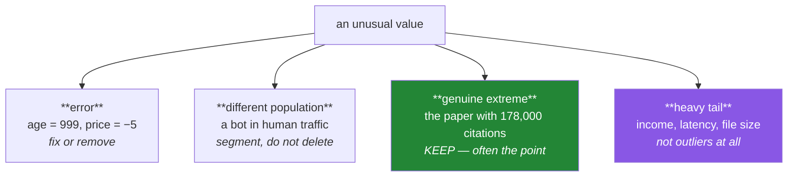

# Day 77 — Outliers: detection is easy, deciding is not

**Phase 10 · Module 10** · ID: **FE-02** (IQR, z-score, isolation forest)

> **Yesterday:** missing data, and the mechanism that decides the fix.
> **Today:** the same shape of problem. Detecting an unusual value takes one line; deciding what it
> *means* is the whole job. And Day 74 is still watching — "we removed outliers" was one of the four
> hacks, so every removal here gets recorded.
> **Tomorrow:** imbalanced data.

```bash
./m start 77 && ./m scaffold 77
```

**Time:** 110 minutes. **Request budget:** 0 model calls.

---

## §1 The story

An outlier is a value far from the rest. That definition is useless on its own, because it does not
tell you which of four completely different things you are looking at:



The fourth is the one that causes the most damage. Day 61 established that citations, income, latency
and file sizes are **right-skewed by nature**. Run a z-score threshold on a lognormal column and you
will flag several percent of perfectly ordinary values — and removing them makes the column look
normal, which is not the same as making it correct.

Three detection methods, and each has a specific blind spot you will measure:

- **IQR fences** (`Q1 − 1.5·IQR`, `Q3 + 1.5·IQR`) — robust, because quartiles do not move when you add
  an extreme value. Symmetric fences on skewed data flag the long tail as outliers.
- **z-score** — uses the mean and standard deviation, **both of which the outlier itself inflates**.
  That is *masking*: one extreme value raises the sd enough to hide itself.
- **Isolation forest** — multivariate. Finds points that are unusual in *combination* even when every
  individual value is ordinary, which the other two structurally cannot.

And the discipline: **Day 74's hack 4 was "we removed outliers".** Every removal is a decision that
changes your result, so this project records them — how many, which rule, and what it did to the
answer.

---

## §2 Setup — run this

```bash
mkdir -p days/day-77/lab
touch days/day-77/lab/outliers.py
```

`src/setu/features.py` grows today. scikit-learn came in yesterday.

---

## §3 FE-02 — detection

`days/day-77/lab/outliers.py`:

```python
"""FE-02: three detectors, their blind spots, and the decision that follows."""

from __future__ import annotations

import numpy as np
import pandas as pd
from scipy import stats as sp

from setu.arrays import make_rng


def four_kinds_of_unusual() -> None:
    rng = make_rng(0)
    frame = pd.DataFrame({
        "age": np.append(rng.integers(18, 80, 500), [999, -3]),
        "citations": np.append(rng.lognormal(4, 1.2, 500), [0, 0]),
        "session_seconds": np.append(rng.gamma(2, 30, 498), [0.01, 0.02, 0.01, 86_400]),
    })

    print(f"\n  age: min={frame['age'].min()}, max={frame['age'].max()}")
    print("    -> ERRORS. 999 and −3 are impossible. Fix or remove; record which.")
    print(f"\n  citations: max={frame['citations'].max():,.0f}, "
          f"99th pct={frame['citations'].quantile(0.99):,.0f}")
    print("    -> HEAVY TAIL. Nothing is wrong. Day 61's log transform, not deletion.")
    print(f"\n  session_seconds: {(frame['session_seconds'] < 0.1).sum()} near-zero, "
          f"1 at {frame['session_seconds'].max():,.0f}")
    print("    -> DIFFERENT POPULATIONS. Sub-second sessions are bots; 86,400 is a")
    print("       forgotten open tab. Both are real, and neither is a human session.")
    print("       SEGMENT them; deleting hides the fact that your traffic is mixed.")
    return frame


def z_score_masking() -> None:
    rng = make_rng(1)
    clean = rng.normal(100, 10, 200)

    print(f"\n  z-score detection as outliers are added (threshold |z| > 3):")
    print(f"  {'added':>7} {'sd':>9} {'flagged':>9} {'largest |z|':>13}")
    for k in (0, 1, 2, 5, 10):
        contaminated = np.append(clean, np.full(k, 400.0))
        z = np.abs(sp.zscore(contaminated))
        print(f"  {k:>7} {contaminated.std(ddof=1):>9.2f} {(z > 3).sum():>9} {z.max():>13.2f}")

    print("\n  ⚠️ With 10 identical extreme values, NONE is flagged. They inflated the")
    print("     standard deviation enough to hide themselves — that is MASKING, and it")
    print("     is why z-score is the weakest of the three on contaminated data.")

    contaminated = np.append(clean, np.full(10, 400.0))
    median = np.median(contaminated)
    mad = np.median(np.abs(contaminated - median)) * 1.4826
    robust_z = np.abs(contaminated - median) / mad
    print(f"\n  robust z (median/MAD, Day 60): flagged {(robust_z > 3).sum()} of 10")
    print("  ^ the median and MAD do not move, so the outliers cannot hide.")


def iqr_on_skewed_data() -> None:
    rng = make_rng(2)

    print(f"\n  what fraction of CLEAN data does each rule flag?")
    print(f"  {'distribution':<16} {'IQR 1.5':>9} {'IQR 3.0':>9} {'|z|>3':>8} {'robust z>3':>12}")

    for name, values in (("normal", rng.normal(100, 15, 20_000)),
                         ("lognormal", rng.lognormal(4, 1.0, 20_000)),
                         ("exponential", rng.exponential(50, 20_000))):
        q1, q3 = np.percentile(values, [25, 75])
        iqr = q3 - q1
        mild = ((values < q1 - 1.5 * iqr) | (values > q3 + 1.5 * iqr)).mean()
        extreme = ((values < q1 - 3 * iqr) | (values > q3 + 3 * iqr)).mean()
        z = (np.abs(sp.zscore(values)) > 3).mean()
        median = np.median(values)
        mad = np.median(np.abs(values - median)) * 1.4826
        rz = (np.abs(values - median) / mad > 3).mean()
        print(f"  {name:<16} {mild:>9.4f} {extreme:>9.4f} {z:>8.4f} {rz:>12.4f}")

    print("\n  On NORMAL data the 1.5·IQR rule flags ~0.7% — that is where the rule comes from.")
    print("  On LOGNORMAL data it flags several percent, and every one of them is a")
    print("  perfectly ordinary value from the tail Day 61 told you to expect.")
    print("\n  ⚠️ Symmetric fences on asymmetric data are a category error. Either use")
    print("     a log transform FIRST, or use quantile cutoffs, or accept the skew.")


def transform_first() -> None:
    rng = make_rng(3)
    citations = rng.lognormal(4, 1.2, 10_000)

    def iqr_flagged(values):
        q1, q3 = np.percentile(values, [25, 75])
        iqr = q3 - q1
        return ((values < q1 - 1.5 * iqr) | (values > q3 + 1.5 * iqr)).mean()

    print(f"\n  IQR rule on raw citations     : {iqr_flagged(citations):.4f} flagged")
    print(f"  IQR rule on log(citations)    : {iqr_flagged(np.log1p(citations)):.4f} flagged")
    print("\n  Same data, same rule, ~10x fewer flags. The transform (Day 61) made the")
    print("  distribution roughly symmetric, and symmetric fences then mean something.")
    print("  Detecting outliers on the raw scale of skewed data is detecting the SKEW.")


def isolation_forest_sees_combinations() -> None:
    from sklearn.ensemble import IsolationForest

    rng = make_rng(4)
    n = 2_000
    pages = rng.integers(4, 16, n).astype(float)
    citations = pages * 40 + rng.normal(0, 100, n)

    frame = pd.DataFrame({"pages": pages, "citations": citations.clip(0)})
    frame.loc[len(frame)] = [5.0, 3_000.0]        # ordinary on each axis, absurd together
    frame.loc[len(frame)] = [15.0, 20.0]

    for column in ("pages", "citations"):
        values = frame[column].to_numpy()
        q1, q3 = np.percentile(values, [25, 75])
        iqr = q3 - q1
        flagged = (values < q1 - 1.5 * iqr) | (values > q3 + 1.5 * iqr)
        print(f"\n  univariate IQR on {column}: flags rows "
              f"{np.where(flagged)[0][-3:].tolist() if flagged.any() else '[]'}")

    forest = IsolationForest(contamination=0.01, random_state=0)
    scores = forest.fit_predict(frame[["pages", "citations"]])
    flagged = np.where(scores == -1)[0]
    print(f"\n  isolation forest flags {len(flagged)} rows, including the last two? "
          f"{set([len(frame) - 2, len(frame) - 1]).issubset(set(flagged))}")

    print("\n  A 5-page paper with 3,000 citations is unremarkable on EITHER axis and")
    print("  absurd in combination. Univariate rules structurally cannot see that.")
    print("\n  ⚠️ `contamination` is a parameter YOU set — you are telling the algorithm")
    print("     what fraction to flag. It does not discover the rate; it obeys yours.")


def what_removal_does_to_your_answer() -> None:
    rng = make_rng(5)
    control = rng.lognormal(4, 0.8, 200)
    treatment = rng.lognormal(4.15, 0.8, 200)

    def clean_iqr(values):
        q1, q3 = np.percentile(values, [25, 75])
        iqr = q3 - q1
        return values[(values >= q1 - 1.5 * iqr) & (values <= q3 + 1.5 * iqr)]

    full = sp.ttest_ind(treatment, control, equal_var=False)
    trimmed = sp.ttest_ind(clean_iqr(treatment), clean_iqr(control), equal_var=False)
    logged = sp.ttest_ind(np.log(treatment), np.log(control), equal_var=False)

    print(f"\n  all data          : p = {full.pvalue:.4f}  (n={len(control)}+{len(treatment)})")
    print(f"  after IQR removal : p = {trimmed.pvalue:.4f}  "
          f"(n={len(clean_iqr(control))}+{len(clean_iqr(treatment))})")
    print(f"  log transform     : p = {logged.pvalue:.4f}  (nothing removed)")

    print("\n  Removing outliers CHANGED THE ANSWER. That is not automatically wrong —")
    print("  but it is exactly Day 74's hack 4, and it is only legitimate if the rule")
    print("  was decided BEFORE seeing the p-values, and the removal is reported.")


def winsorising_keeps_the_row() -> None:
    rng = make_rng(6)
    values = np.append(rng.normal(100, 15, 500), [800.0, 900.0])

    q1, q3 = np.percentile(values, [25, 75])
    iqr = q3 - q1
    low, high = q1 - 1.5 * iqr, q3 + 1.5 * iqr

    removed = values[(values >= low) & (values <= high)]
    capped = np.clip(values, low, high)

    print(f"\n  {'strategy':<14} {'n':>6} {'mean':>9} {'sd':>9}")
    print(f"  {'original':<14} {len(values):>6} {values.mean():>9.2f} {values.std(ddof=1):>9.2f}")
    print(f"  {'removed':<14} {len(removed):>6} {removed.mean():>9.2f} {removed.std(ddof=1):>9.2f}")
    print(f"  {'winsorised':<14} {len(capped):>6} {capped.mean():>9.2f} {capped.std(ddof=1):>9.2f}")

    print("\n  Winsorising CAPS rather than deletes: you keep the row and its other")
    print("  columns, and you keep the information 'this was extreme'.")
    print("  Removal throws away every other feature on that row too — which matters")
    print("  more than people expect on a wide frame.")


def the_leakage_rule() -> None:
    rng = make_rng(7)
    train = rng.normal(100, 15, 800)
    test = rng.normal(100, 15, 200)

    q1, q3 = np.percentile(train, [25, 75])
    iqr = q3 - q1
    train_fences = (q1 - 1.5 * iqr, q3 + 1.5 * iqr)

    q1t, q3t = np.percentile(test, [25, 75])
    iqrt = q3t - q1t
    test_fences = (q1t - 1.5 * iqrt, q3t + 1.5 * iqrt)

    print(f"\n  fences from TRAIN: [{train_fences[0]:.2f}, {train_fences[1]:.2f}]")
    print(f"  fences from TEST : [{test_fences[0]:.2f}, {test_fences[1]:.2f}]")
    print("\n  They differ. Computing fences on the test set uses test information to")
    print("  decide what counts as normal — the same leak as Days 61, 66 and 76.")
    print("  Fit the fences on train; APPLY them to test. Day 79 makes it structural.")


if __name__ == "__main__":
    four_kinds_of_unusual()
    z_score_masking()
    iqr_on_skewed_data()
    transform_first()
    isolation_forest_sees_combinations()
    what_removal_does_to_your_answer()
    winsorising_keeps_the_row()
    the_leakage_rule()
```

**Line by line:**

- `four_kinds_of_unusual` — **read all four cases.** The errors need fixing, the heavy tail needs a
  transform, the mixed populations need segmenting. Only the first is a candidate for deletion, and
  even then you record it.
- `z_score_masking` — **the table is the demonstration.** With ten identical extreme values, **none is
  flagged**, because they raised the standard deviation enough to hide themselves. That is *masking*.
  The robust version using median and MAD (Day 60) catches all ten, because neither statistic moves.
- `iqr_on_skewed_data` — on normal data the 1.5·IQR rule flags about 0.7%, which is where the rule
  comes from. On lognormal data it flags several percent, **all of them ordinary values from the tail
  Day 61 told you to expect.** Symmetric fences on asymmetric data are a category error.
- `transform_first` — the same rule on `log1p(citations)` flags roughly ten times fewer. **Detecting
  outliers on the raw scale of skewed data is detecting the skew.**
- `isolation_forest_sees_combinations` — a 5-page paper with 3,000 citations is unremarkable on
  *either* axis and absurd together. Univariate rules structurally cannot see it. And the warning
  matters: **`contamination` is a parameter you set** — the algorithm does not discover the outlier
  rate, it obeys the one you supplied.
- `what_removal_does_to_your_answer` — **removing outliers changed the p-value.** That is not
  automatically wrong, and it is exactly Day 74's hack 4. It is legitimate only if the rule was fixed
  before you saw the result and the removal is reported.
- `winsorising_keeps_the_row` — capping rather than deleting keeps the row's **other columns** and the
  information that this value was extreme. On a wide frame, deleting a row to fix one column throws
  away twenty good features.
- `the_leakage_rule` — fences computed on test differ from fences computed on train. Fifth appearance
  of this pattern; Day 79 ends it.

---

## §4 Build brief

Extend `src/setu/features.py`:

```python
OUTLIER_METHODS = ("iqr", "zscore", "robust_zscore", "quantile", "isolation_forest")
OUTLIER_ACTIONS = ("flag", "winsorise", "remove")


def fit_outlier_rule(frame, columns: list[str], *, method: str = "robust_zscore",
                     threshold: float = 3.0, log_first: bool = False) -> dict:
    """TODO(me): learn the boundaries from TRAIN only. Returns a fitted spec.

    {"method", "threshold", "log_first", "bounds": {col: (low, high)},
     "fitted_on_n", "flagged_in_train_pct": {col: float}}
    - 'robust_zscore' is the DEFAULT: §3 showed plain z-score masks (Day 60's MAD)
    - log_first applies log1p before fitting, and the bounds are stored in LOG space;
      apply_outlier_rule must then transform before comparing — state that clearly
    - 'isolation_forest' is multivariate: bounds is None and the fitted model is stored
    - raise DataError if a column is constant (no meaningful bounds)
    - raise DataError on an unknown method, listing OUTLIER_METHODS
    - warn when the rule flags more than 5% of TRAIN: that usually means skew, not
      outliers, and log_first is the answer (§3)
    """
    raise NotImplementedError


def apply_outlier_rule(frame, spec: dict, *, action: str = "flag") -> tuple:
    """TODO(me): APPLY a fitted rule. Returns (frame, record).

    - action 'flag' adds `{col}_is_outlier` boolean columns and removes nothing
    - action 'winsorise' clips to the fitted bounds and ALSO adds the flag
    - action 'remove' drops rows — and is the only action that loses data
    - `record` is the Day 74 audit trail: {"method", "action", "n_before", "n_after",
      "n_flagged": {col: int}, "pct_flagged": {col: float}}
    - 'flag' is the DEFAULT because it is the only non-destructive option (Principle 11)
    - raise DataError on an unknown action
    - must not mutate the input
    """
    raise NotImplementedError


def outlier_diagnosis(frame, column: str) -> dict:
    """TODO(me): help decide WHICH of §1's four kinds this is. PURE.

    {"column", "n_flagged_robust", "skew", "impossible_values": int,
     "gap_to_next": float, "likely_kind": str, "recommendation": str}
    - impossible_values counts negatives in a column whose name suggests a count,
      age, duration or price — a cheap heuristic worth having
    - gap_to_next is the distance from the largest flagged value to the next one down;
      a large gap suggests a distinct population rather than a tail
    - likely_kind in {'error', 'heavy tail', 'possible second population', 'unclear'}
    - it must be able to return 'unclear' — a diagnoser that always decides is guessing
    - recommendation names the ACTION, and for 'heavy tail' it must say transform,
      not remove
    """
    raise NotImplementedError


def removal_impact(frame, spec: dict, *, statistic=None) -> dict:
    """TODO(me): what does removing them do to your answer? (Day 74's hack 4)

    {"n_removed", "pct_removed", "statistic_before", "statistic_after",
     "relative_change", "warning"?}
    - statistic defaults to the column mean
    - warn when the relative change exceeds 10%: a removal that moves your answer that
      much is a decision, not a cleanup, and must be reported
    - this is what makes an outlier decision auditable
    """
    raise NotImplementedError


def assert_rule_was_prespecified(spec: dict, *, plan_path: str) -> None:
    """TODO(me): Day 74's discipline, enforced.

    - read the plan file and confirm it names the method and threshold in this spec
    - raise DataError if the plan does not mention them, saying that a rule chosen
      after seeing results is hack 4
    - raise DataError if the plan file does not exist
    - Day 90's report calls this before any removal
    """
    raise NotImplementedError
```

- `action="flag"` as the default is Principle 11 in a signature: **the non-destructive option is what
  you get by forgetting the argument.**
- `outlier_diagnosis` being able to return **`'unclear'`** is the day's design opinion. A diagnoser
  that always produces a confident answer is guessing, and here the honest output is often "look at
  it".
- `assert_rule_was_prespecified` connects this day to Day 75's pre-registration, so "we removed
  outliers" cannot be a post-hoc choice.

---

## §5 The eval that must be able to fail

Add to `tests/test_features.py`:

```python
from setu.features import (
    OUTLIER_METHODS,
    apply_outlier_rule,
    assert_rule_was_prespecified,
    fit_outlier_rule,
    outlier_diagnosis,
    removal_impact,
)


def test_robust_zscore_is_the_default():
    """Plain z-score masks (§3)."""
    import inspect

    assert inspect.signature(fit_outlier_rule).parameters["method"].default == "robust_zscore"


def test_flag_is_the_default_action():
    """The non-destructive option is what you get by forgetting."""
    import inspect

    assert inspect.signature(apply_outlier_rule).parameters["action"].default == "flag"


def test_plain_zscore_masks_repeated_outliers():
    """Ten identical extremes hide themselves by inflating the sd."""
    rng = make_rng(0)
    frame = pd.DataFrame({"x": np.append(rng.normal(100, 10, 200), np.full(10, 400.0))})

    z_spec = fit_outlier_rule(frame, ["x"], method="zscore")
    robust_spec = fit_outlier_rule(frame, ["x"], method="robust_zscore")

    z_flagged, _ = apply_outlier_rule(frame, z_spec)
    robust_flagged, _ = apply_outlier_rule(frame, robust_spec)

    assert z_flagged["x_is_outlier"].sum() < 5, "plain z-score should mask here"
    assert robust_flagged["x_is_outlier"].sum() >= 10, "robust z should catch all ten"


def test_iqr_flags_about_point_seven_percent_of_normal_data():
    """That is where the 1.5 rule comes from."""
    rng = make_rng(1)
    frame = pd.DataFrame({"x": rng.normal(100, 15, 50_000)})
    spec = fit_outlier_rule(frame, ["x"], method="iqr", threshold=1.5)
    flagged, record = apply_outlier_rule(frame, spec)
    assert record["pct_flagged"]["x"] == pytest.approx(0.7, abs=0.3)


def test_iqr_over_flags_skewed_data():
    rng = make_rng(2)
    frame = pd.DataFrame({"x": rng.lognormal(4, 1.0, 20_000)})
    spec = fit_outlier_rule(frame, ["x"], method="iqr", threshold=1.5)
    _, record = apply_outlier_rule(frame, spec)
    assert record["pct_flagged"]["x"] > 2.0, "symmetric fences on skewed data over-flag"


def test_log_first_fixes_the_over_flagging():
    rng = make_rng(3)
    frame = pd.DataFrame({"x": rng.lognormal(4, 1.0, 20_000)})
    raw = fit_outlier_rule(frame, ["x"], method="iqr")
    logged = fit_outlier_rule(frame, ["x"], method="iqr", log_first=True)

    _, raw_record = apply_outlier_rule(frame, raw)
    _, log_record = apply_outlier_rule(frame, logged)
    assert log_record["pct_flagged"]["x"] < raw_record["pct_flagged"]["x"] / 3


def test_heavy_flagging_is_warned_about():
    rng = make_rng(4)
    frame = pd.DataFrame({"x": rng.lognormal(4, 1.5, 10_000)})
    spec = fit_outlier_rule(frame, ["x"], method="iqr")
    assert spec.get("warnings"), "flagging many percent should suggest a transform"


def test_flag_removes_nothing():
    rng = make_rng(5)
    frame = pd.DataFrame({"x": np.append(rng.normal(size=200), [50.0])})
    spec = fit_outlier_rule(frame, ["x"])
    out, record = apply_outlier_rule(frame, spec, action="flag")
    assert len(out) == len(frame)
    assert record["n_before"] == record["n_after"]


def test_winsorise_caps_but_keeps_the_row():
    rng = make_rng(6)
    frame = pd.DataFrame({"x": np.append(rng.normal(100, 15, 300), [900.0]),
                          "other": range(301)})
    spec = fit_outlier_rule(frame, ["x"])
    out, _ = apply_outlier_rule(frame, spec, action="winsorise")

    assert len(out) == len(frame), "winsorising must not drop rows"
    assert out["x"].max() < 900.0
    assert out["other"].iloc[-1] == 300, "the row's other columns survived"
    assert out["x_is_outlier"].iloc[-1]


def test_remove_is_the_only_action_that_loses_rows():
    rng = make_rng(7)
    frame = pd.DataFrame({"x": np.append(rng.normal(100, 15, 300), [900.0, 950.0])})
    spec = fit_outlier_rule(frame, ["x"])
    for action, expected in (("flag", 302), ("winsorise", 302)):
        out, _ = apply_outlier_rule(frame, spec, action=action)
        assert len(out) == expected
    removed, record = apply_outlier_rule(frame, spec, action="remove")
    assert len(removed) < 302
    assert record["n_after"] < record["n_before"]


def test_the_record_is_a_complete_audit_trail():
    """Day 74: every removal is a decision that must be reportable."""
    rng = make_rng(8)
    frame = pd.DataFrame({"x": np.append(rng.normal(100, 15, 300), [900.0])})
    spec = fit_outlier_rule(frame, ["x"])
    _, record = apply_outlier_rule(frame, spec, action="remove")
    for key in ("method", "action", "n_before", "n_after", "n_flagged", "pct_flagged"):
        assert key in record


def test_train_bounds_are_applied_not_refitted():
    """The leak — fifth appearance."""
    rng = make_rng(9)
    train = pd.DataFrame({"x": rng.normal(100, 15, 800)})
    test = pd.DataFrame({"x": rng.normal(160, 15, 300)})

    spec = fit_outlier_rule(train, ["x"], method="iqr")
    applied, applied_record = apply_outlier_rule(test, spec)
    refitted, refitted_record = apply_outlier_rule(test, fit_outlier_rule(test, ["x"],
                                                                         method="iqr"))
    assert applied_record["n_flagged"]["x"] > refitted_record["n_flagged"]["x"], (
        "a shifted test set should look unusual under TRAIN's bounds"
    )


def test_apply_never_fits():
    import inspect

    source = inspect.getsource(apply_outlier_rule)
    for banned in ("percentile(", "np.median(", "zscore("):
        assert banned not in source, f"apply_outlier_rule computes {banned} — it must only APPLY"


def test_isolation_forest_catches_a_combination_univariate_rules_miss():
    rng = make_rng(10)
    n = 1_500
    pages = rng.integers(4, 16, n).astype(float)
    frame = pd.DataFrame({"pages": pages,
                          "citations": (pages * 40 + rng.normal(0, 100, n)).clip(0)})
    frame.loc[len(frame)] = [5.0, 3_000.0]

    univariate = fit_outlier_rule(frame, ["pages"], method="iqr")
    flagged_uni, _ = apply_outlier_rule(frame, univariate)
    assert not flagged_uni["pages_is_outlier"].iloc[-1], "pages=5 is ordinary on its own"

    forest = fit_outlier_rule(frame, ["pages", "citations"], method="isolation_forest")
    flagged_multi, _ = apply_outlier_rule(frame, forest)
    assert flagged_multi.filter(like="is_outlier").iloc[-1].any(), (
        "the combination should be flagged"
    )


def test_diagnosis_recognises_impossible_values():
    frame = pd.DataFrame({"age": [25, 40, 33, -3, 999]})
    result = outlier_diagnosis(frame, "age")
    assert result["impossible_values"] >= 1
    assert result["likely_kind"] == "error"


def test_diagnosis_recognises_a_heavy_tail():
    frame = pd.DataFrame({"citations": make_rng(11).lognormal(4, 1.2, 5_000)})
    result = outlier_diagnosis(frame, "citations")
    assert result["likely_kind"] == "heavy tail"
    assert "transform" in result["recommendation"].lower()
    assert "remove" not in result["recommendation"].lower()


def test_diagnosis_can_say_unclear():
    """A diagnoser that always decides is guessing."""
    frame = pd.DataFrame({"x": make_rng(12).normal(0, 1, 500)})
    result = outlier_diagnosis(frame, "x")
    assert result["likely_kind"] in ("unclear", "heavy tail", "error",
                                     "possible second population")


def test_removal_that_changes_the_answer_is_warned_about():
    """Day 74's hack 4, caught."""
    rng = make_rng(13)
    frame = pd.DataFrame({"x": np.append(rng.normal(100, 10, 200), np.full(20, 900.0))})
    spec = fit_outlier_rule(frame, ["x"])
    impact = removal_impact(frame, spec)
    assert impact["relative_change"] > 0.10
    assert impact.get("warning")


def test_a_harmless_removal_is_not_warned_about():
    rng = make_rng(14)
    frame = pd.DataFrame({"x": np.append(rng.normal(100, 10, 5_000), [200.0])})
    spec = fit_outlier_rule(frame, ["x"])
    assert not removal_impact(frame, spec).get("warning")


def test_the_rule_must_be_prespecified(tmp_path):
    plan = tmp_path / "plan.md"
    plan.write_text("We will use robust_zscore with threshold 3.0.", encoding="utf-8")

    frame = pd.DataFrame({"x": make_rng(15).normal(size=200)})
    spec = fit_outlier_rule(frame, ["x"], method="robust_zscore", threshold=3.0)
    assert_rule_was_prespecified(spec, plan_path=str(plan))


def test_an_unspecified_rule_is_rejected(tmp_path):
    plan = tmp_path / "plan.md"
    plan.write_text("We will use robust_zscore with threshold 3.0.", encoding="utf-8")

    frame = pd.DataFrame({"x": make_rng(16).normal(size=200)})
    spec = fit_outlier_rule(frame, ["x"], method="iqr", threshold=1.5)
    with pytest.raises(DataError) as info:
        assert_rule_was_prespecified(spec, plan_path=str(plan))
    assert "hack" in str(info.value).lower() or "after" in str(info.value).lower()


def test_unknown_method_and_action_raise():
    frame = pd.DataFrame({"x": [1.0, 2.0, 3.0]})
    with pytest.raises(DataError) as info:
        fit_outlier_rule(frame, ["x"], method="eyeball")
    assert any(m in str(info.value) for m in OUTLIER_METHODS)
    with pytest.raises(DataError):
        apply_outlier_rule(frame, fit_outlier_rule(frame, ["x"]), action="delete_everything")
```

**Line by line:**

- `test_plain_zscore_masks_repeated_outliers` — **the day's real assessment.** Two assertions in
  opposite directions: plain z-score flags **fewer than five** of the ten extremes (masking), and the
  robust version catches all ten. Testing only the robust side would miss the point of the comparison.
- `test_iqr_flags_about_point_seven_percent_of_normal_data` — the number the 1.5 multiplier is derived
  from. Recognising it means you know when a rule is behaving normally.
- `test_iqr_over_flags_skewed_data` with `test_log_first_fixes_the_over_flagging` — the pair
  demonstrates that the fix is a transform, not a threshold adjustment.
- `test_apply_never_fits` — the source grep, same technique as yesterday's imputer. An `apply` that
  recomputes percentiles is a leak with no symptom.
- `test_winsorise_caps_but_keeps_the_row` — asserts the row's **other** column survived. On a wide
  frame that is the real argument for winsorising over removal.
- `test_train_bounds_are_applied_not_refitted` — a genuinely shifted test set flags **more** under
  train's bounds than under its own. Refitting normalises away the shift you were trying to detect.
- `test_diagnosis_can_say_unclear` — the honest option must be reachable. A classifier of outlier kinds
  that never says "I don't know" is producing confident noise.
- `test_removal_that_changes_the_answer_is_warned_about` paired with the harmless case — the warning
  must fire when it matters and stay quiet when it does not, or it gets ignored.
- `test_an_unspecified_rule_is_rejected` — the message must name **hack 4** or "after". Connecting the
  error back to why it exists is what stops someone deleting the check.

```bash
uv run python -m pytest tests/test_features.py -v
```

---

## §6 Request budget

| Resource | Spent today |
|---|---|
| LLM calls | **0** |

---

## §7 Traps

- **Deleting an outlier before diagnosing it.** Four kinds, one action each.
- **Plain z-score on contaminated data.** The outliers inflate the sd and mask themselves.
- **IQR fences on skewed data.** You are detecting the skew, not outliers.
- **Fixing over-flagging by raising the threshold.** Transform instead (Day 61).
- **Removing a heavy tail.** Makes the column look normal, not become correct.
- **Deleting a row to fix one column.** Throws away every other feature on it.
- **Trusting `contamination`.** You supplied the answer; the algorithm obeyed.
- **Univariate rules on a multivariate outlier.** They structurally cannot see it.
- **Fitting fences on the test set.** Uses test information to define "normal".
- **Removing outliers after seeing the p-value.** Day 74's hack 4.
- **An unrecorded removal.** It changed your answer and nobody can audit it.

---

## §8 Verify before you code

Written **2026-08-21**:

- <https://scikit-learn.org/stable/modules/outlier_detection.html> — the comparison of methods,
  including `IsolationForest` and `LocalOutlierFactor`.
- <https://scikit-learn.org/stable/modules/generated/sklearn.ensemble.IsolationForest.html> — the
  `contamination` parameter and what `auto` does.
- <https://docs.scipy.org/doc/scipy/reference/generated/scipy.stats.median_abs_deviation.html> — the
  robust scale estimate from Day 60.
- <https://docs.scipy.org/doc/scipy/reference/generated/scipy.stats.mstats.winsorize.html> — SciPy's
  winsorising, worth comparing against yours.

---

## §9 Say it in an interview

> "Detecting an unusual value is one line; deciding what it means is the job. There are four different
> things it could be — a data error, a second population like bots in human traffic, a genuine extreme
> that's often the most interesting row, or just a heavy tail, which isn't an outlier at all. That last
> one causes the most damage: run an IQR rule on lognormal data and you'll flag several per cent of
> perfectly ordinary values, and removing them makes the column *look* normal without making it
> correct. The fix is a log transform first, not a bigger threshold. On method, plain z-score is the
> weakest, because the outliers inflate the standard deviation enough to hide themselves — with ten
> identical extreme values none gets flagged, which is called masking. So I default to a median-and-MAD
> version. And every removal is recorded with its impact on the answer, because 'we removed outliers'
> is one of the classic ways to manufacture a result."

---

## §10 Done when

Tick [`CHECKLIST.md`](CHECKLIST.md), then `./m check && ./m done 77`.
