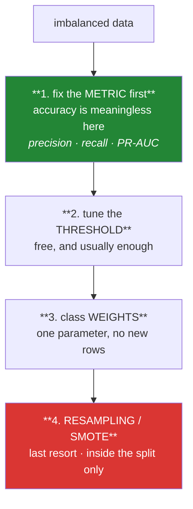

# Day 78 — Imbalanced data

**Phase 10 · Module 10** · ID: **FE-03** (resampling, SMOTE, class weights, threshold tuning)

> **Yesterday:** outliers, and the four kinds of unusual.
> **Today:** the class that barely occurs — and the demonstration that a 99%-accurate model can be
> completely useless. Day 63's base-rate arithmetic returns here as **precision**, and Day 74's
> discipline returns as the rule that SMOTE goes **inside** the split.
> **Tomorrow:** the split itself.

```bash
./m start 78 && ./m scaffold 78
```

**Time:** 110 minutes. **Request budget:** 0 model calls.

---

## §1 The story

Fraud is 0.2% of transactions. Churn is 3% of users. A rare disease is 1 in 1,000. In each case a
model that predicts "no" every single time scores **over 99% accuracy** and has learned nothing.

That is not a modelling problem yet — it is a **metric** problem, and Day 63 already gave you the
arithmetic. With a rare positive class, even excellent recall produces mostly false alarms, because
there are so many more negatives to be wrong about.



**The order matters and it is the opposite of what people reach for.** SMOTE is the famous answer and
it belongs last, because the first three are cheaper, safer, and usually sufficient.

Three things you will demonstrate:

**A classifier outputs a probability; the threshold is yours.** `predict()` uses 0.5 because that is a
default, not a discovery. Moving it costs nothing, requires no retraining, and is the single most
effective lever on imbalanced data. Choosing it by your actual cost of a false positive versus a false
negative is what "tuning for the business" concretely means.

**Resampling changes the base rate, so it changes the calibration.** After oversampling to 50/50, your
model's predicted probabilities no longer mean what they say — a "0.8" is not an 80% chance any more.
If you need calibrated probabilities, resampling is actively harmful.

**SMOTE inside the split, never before.** SMOTE creates synthetic minority points by interpolating
between neighbours. Do it before splitting and a synthetic point built from a training row can land in
your test set — a leak that inflates your score and is invisible unless you look for it. **You will
measure exactly how much it inflates.**

---

## §2 Setup — run this

```bash
uv add "imbalanced-learn==0.14.0"
mkdir -p days/day-78/lab
touch days/day-78/lab/imbalance.py
```

Pin whatever **your** Day-1 verify run reported.

---

## §3 FE-03 — the rare class

`days/day-78/lab/imbalance.py`:

```python
"""FE-03: metrics first, then threshold, then weights, then resampling."""

from __future__ import annotations

import numpy as np
import pandas as pd
from sklearn.ensemble import RandomForestClassifier
from sklearn.linear_model import LogisticRegression
from sklearn.metrics import (
    average_precision_score,
    confusion_matrix,
    precision_recall_curve,
    roc_auc_score,
)
from sklearn.model_selection import train_test_split

from setu.arrays import make_rng


def make_data(*, n: int = 20_000, positive_rate: float = 0.02, seed: int = 0):
    rng = make_rng(seed)
    y = (rng.random(n) < positive_rate).astype(int)
    signal = rng.normal(y * 1.6, 1.0, n)
    noise = rng.normal(0, 1, (n, 4))
    X = np.column_stack([signal, noise])
    return X, y


def accuracy_is_meaningless() -> None:
    X, y = make_data()
    print(f"\n  positive rate = {y.mean():.4f}")

    always_no = np.zeros_like(y)
    print(f"  'always predict no' accuracy = {(always_no == y).mean():.4f}")
    print(f"  ...and it caught {always_no[y == 1].sum()} of {y.sum()} positives.")

    print("\n  99.98% accurate and completely useless. On imbalanced data, accuracy")
    print("  measures the majority class and nothing else.")


def the_metrics_that_work() -> None:
    X, y = make_data()
    X_train, X_test, y_train, y_test = train_test_split(
        X, y, test_size=0.3, stratify=y, random_state=0
    )
    model = LogisticRegression(max_iter=1_000).fit(X_train, y_train)
    scores = model.predict_proba(X_test)[:, 1]
    predicted = (scores >= 0.5).astype(int)

    tn, fp, fn, tp = confusion_matrix(y_test, predicted).ravel()
    print(f"\n  at the default 0.5 threshold:")
    print(f"    true positives  {tp:>6}   false positives {fp:>6}")
    print(f"    false negatives {fn:>6}   true negatives  {tn:>6}")

    precision = tp / (tp + fp) if tp + fp else 0.0
    recall = tp / (tp + fn) if tp + fn else 0.0
    print(f"\n    accuracy  = {(predicted == y_test).mean():.4f}   <- says nothing")
    print(f"    precision = {precision:.4f}   'of my alarms, how many were real?'")
    print(f"    recall    = {recall:.4f}   'of the real cases, how many did I catch?'")
    print(f"    ROC-AUC   = {roc_auc_score(y_test, scores):.4f}")
    print(f"    PR-AUC    = {average_precision_score(y_test, scores):.4f}   <- the honest one")

    print(f"\n  baseline PR-AUC for a random model = the positive rate = {y_test.mean():.4f}")
    print("  ⚠️ ROC-AUC looks flattering on imbalanced data because the huge negative")
    print("     class makes the false-positive RATE tiny even with many false alarms.")
    print("     PR-AUC uses precision, so it feels the imbalance. Prefer it here.")
    return model, X_test, y_test, scores


def precision_is_day_63_again(scores, y_test) -> None:
    print(f"\n  Day 63's disease test, in classifier vocabulary:")
    print(f"    sensitivity   = recall")
    print(f"    specificity   = 1 − false positive rate")
    print(f"    P(sick|+)     = PRECISION")
    print(f"    prevalence    = the positive rate")

    for rate in (0.5, 0.05, 0.005):
        recall_target = 0.80
        specificity = 0.95
        tp = rate * recall_target
        fp = (1 - rate) * (1 - specificity)
        print(f"\n    positive rate {rate:>6.1%}: precision at 80% recall ≈ {tp / (tp + fp):.3f}")

    print("\n  Same model quality. The precision collapses purely because positives")
    print("  got rarer. That is not a modelling failure — it is arithmetic (Day 63).")


def the_threshold_is_yours(scores, y_test) -> None:
    print(f"\n  the model output a PROBABILITY. 0.5 is a default, not a discovery:")
    print(f"  {'threshold':>10} {'precision':>10} {'recall':>8} {'alarms':>8} {'caught':>8}")

    for threshold in (0.5, 0.2, 0.1, 0.05, 0.02, 0.01):
        predicted = (scores >= threshold).astype(int)
        tn, fp, fn, tp = confusion_matrix(y_test, predicted).ravel()
        precision = tp / (tp + fp) if tp + fp else 0.0
        recall = tp / (tp + fn) if tp + fn else 0.0
        print(f"  {threshold:>10.2f} {precision:>10.4f} {recall:>8.4f} "
              f"{tp + fp:>8} {tp:>8}")

    print("\n  No retraining. One number. This is the cheapest and most effective lever")
    print("  on imbalanced data, and it is the one people skip on the way to SMOTE.")


def choosing_a_threshold_by_cost(scores, y_test) -> None:
    cost_fn, cost_fp = 500.0, 10.0        # missing fraud costs 50x a false alarm

    print(f"\n  cost of a miss = {cost_fn}, cost of a false alarm = {cost_fp}")
    print(f"  {'threshold':>10} {'misses':>8} {'alarms':>8} {'total cost':>12}")

    best = (None, float("inf"))
    for threshold in np.arange(0.01, 0.61, 0.05):
        predicted = (scores >= threshold).astype(int)
        tn, fp, fn, tp = confusion_matrix(y_test, predicted).ravel()
        total = fn * cost_fn + fp * cost_fp
        if total < best[1]:
            best = (threshold, total)
        print(f"  {threshold:>10.2f} {fn:>8} {fp:>8} {total:>12,.0f}")

    print(f"\n  cheapest threshold = {best[0]:.2f}, not 0.5")
    print("  ⚠️ Tune the threshold on a VALIDATION set, never on test — it is a fitted")
    print("     parameter like any other (Day 79).")


def class_weights_cost_nothing() -> None:
    X, y = make_data()
    X_train, X_test, y_train, y_test = train_test_split(
        X, y, test_size=0.3, stratify=y, random_state=0
    )

    print(f"\n  {'model':<26} {'PR-AUC':>9} {'recall@0.5':>12}")
    for label, model in (
        ("plain", LogisticRegression(max_iter=1_000)),
        ("class_weight='balanced'", LogisticRegression(max_iter=1_000,
                                                       class_weight="balanced")),
    ):
        fitted = model.fit(X_train, y_train)
        scores = fitted.predict_proba(X_test)[:, 1]
        predicted = fitted.predict(X_test)
        _, _, fn, tp = confusion_matrix(y_test, predicted).ravel()
        recall = tp / (tp + fn) if tp + fn else 0.0
        print(f"  {label:<26} {average_precision_score(y_test, scores):>9.4f} {recall:>12.4f}")

    print("\n  `class_weight='balanced'` re-weights the loss so minority errors cost more.")
    print("  One parameter, no synthetic data, no new rows. Note PR-AUC barely moves —")
    print("  weights mostly shift the effective threshold rather than teaching more.")


def smote_inside_the_split_only() -> None:
    from imblearn.over_sampling import SMOTE

    X, y = make_data(n=8_000, positive_rate=0.03, seed=1)

    # WRONG: resample everything, then split
    X_all, y_all = SMOTE(random_state=0).fit_resample(X, y)
    Xw_train, Xw_test, yw_train, yw_test = train_test_split(
        X_all, y_all, test_size=0.3, stratify=y_all, random_state=0
    )
    wrong = RandomForestClassifier(n_estimators=100, random_state=0).fit(Xw_train, yw_train)
    wrong_score = average_precision_score(yw_test, wrong.predict_proba(Xw_test)[:, 1])

    # RIGHT: split, then resample the training half only
    Xr_train, Xr_test, yr_train, yr_test = train_test_split(
        X, y, test_size=0.3, stratify=y, random_state=0
    )
    Xr_res, yr_res = SMOTE(random_state=0).fit_resample(Xr_train, yr_train)
    right = RandomForestClassifier(n_estimators=100, random_state=0).fit(Xr_res, yr_res)
    right_score = average_precision_score(yr_test, right.predict_proba(Xr_test)[:, 1])

    print(f"\n  SMOTE before the split : PR-AUC = {wrong_score:.4f}   ← inflated")
    print(f"  SMOTE after  the split : PR-AUC = {right_score:.4f}   ← honest")
    print(f"  inflation = {wrong_score / right_score:.2f}x")

    print("\n  SMOTE interpolates between neighbouring minority points. Resample first")
    print("  and a synthetic point built FROM a training row lands in your test set.")
    print("  The model has effectively seen the answer, and nothing in the code looks wrong.")
    print("\n  ⚠️ The same applies to random oversampling: duplicate first and the SAME ROW")
    print("     appears in both halves. Split first. Always. Day 79 makes it structural.")


def resampling_breaks_calibration() -> None:
    from imblearn.over_sampling import RandomOverSampler

    X, y = make_data(n=20_000, positive_rate=0.02, seed=2)
    X_train, X_test, y_train, y_test = train_test_split(
        X, y, test_size=0.3, stratify=y, random_state=0
    )

    plain = LogisticRegression(max_iter=1_000).fit(X_train, y_train)
    X_res, y_res = RandomOverSampler(random_state=0).fit_resample(X_train, y_train)
    resampled = LogisticRegression(max_iter=1_000).fit(X_res, y_res)

    print(f"\n  actual positive rate in test = {y_test.mean():.4f}")
    print(f"  mean predicted probability:")
    print(f"    plain model     = {plain.predict_proba(X_test)[:, 1].mean():.4f}  ← matches")
    print(f"    resampled model = {resampled.predict_proba(X_test)[:, 1].mean():.4f}  ← inflated")

    print("\n  After oversampling to 50/50 the model believes positives are common.")
    print("  A predicted '0.8' no longer means an 80% chance of anything.")
    print("\n  If you need RANKING, that is fine. If you need calibrated probabilities —")
    print("  expected-value decisions, risk scores — resampling is actively harmful.")
    print("  Prefer threshold tuning, which leaves calibration intact.")


def the_order_to_try_things() -> None:
    print("\n  1. FIX THE METRIC. accuracy → precision/recall/PR-AUC. Free, and mandatory.")
    print("  2. TUNE THE THRESHOLD on validation, by your actual costs. Free.")
    print("  3. CLASS WEIGHTS. One parameter, no new data, calibration mostly intact.")
    print("  4. RESAMPLING / SMOTE. Last. Inside the split. Breaks calibration.")
    print("\n  Most imbalance 'problems' are solved by steps 1 and 2. SMOTE is famous")
    print("  because it is interesting, not because it is usually necessary.")


if __name__ == "__main__":
    accuracy_is_meaningless()
    model, X_test, y_test, scores = the_metrics_that_work()
    precision_is_day_63_again(scores, y_test)
    the_threshold_is_yours(scores, y_test)
    choosing_a_threshold_by_cost(scores, y_test)
    class_weights_cost_nothing()
    smote_inside_the_split_only()
    resampling_breaks_calibration()
    the_order_to_try_things()
```

**Line by line:**

- `accuracy_is_meaningless` — 99.98% accurate, **zero positives caught.** On imbalanced data accuracy
  measures the majority class and nothing else, and reporting it is close to misleading.
- `the_metrics_that_work` — note the **PR-AUC baseline is the positive rate**, so 0.02 is what random
  guessing scores. And the warning: **ROC-AUC flatters imbalanced models**, because the enormous
  negative class keeps the false-positive *rate* tiny even when you raise hundreds of false alarms.
  PR-AUC uses precision, so it feels the imbalance.
- `precision_is_day_63_again` — **the vocabulary map is worth memorising.** Sensitivity is recall,
  `P(sick | positive)` is precision, prevalence is the positive rate. Then the same model quality at
  three base rates: precision collapses purely because positives got rarer. **Not a modelling failure —
  arithmetic.**
- `the_threshold_is_yours` — **read the table.** No retraining, one number, and precision and recall
  trade smoothly across it. This is the cheapest lever and the one people skip on the way to SMOTE.
- `choosing_a_threshold_by_cost` — with a 50:1 cost ratio the optimal threshold is far below 0.5.
  **This is what "tuning for the business" concretely means.** And the warning: the threshold is a
  fitted parameter, so it is tuned on **validation**, never test.
- `class_weights_cost_nothing` — one parameter re-weights the loss. Note **PR-AUC barely moves**:
  weights mostly shift the effective threshold rather than teaching the model more, which is a useful
  thing to know before reaching for them.
- `smote_inside_the_split_only` — **the day's demonstration.** SMOTE interpolates between neighbouring
  minority points, so resampling before the split puts synthetic points *derived from training rows*
  into the test set. The score inflates and **nothing in the code looks wrong.** Same for random
  oversampling: duplicate first and the identical row appears in both halves.
- `resampling_breaks_calibration` — after oversampling to 50/50, mean predicted probability is far
  above the true rate. **A "0.8" no longer means 80%.** For ranking that is fine; for expected-value
  decisions it is actively harmful.
- `the_order_to_try_things` — **read it in order.** Most imbalance problems are solved by steps 1 and
  2. SMOTE is famous because it is interesting, not because it is usually necessary.

---

## §4 Build brief

Extend `src/setu/features.py`:

```python
IMBALANCE_STRATEGIES = ("threshold", "class_weight", "oversample", "smote", "undersample")


def imbalance_report(y) -> dict:
    """TODO(me): describe the imbalance and what it implies. PURE.

    {"n", "n_positive", "positive_rate", "ratio", "severity",
     "majority_baseline_accuracy", "pr_auc_baseline", "warnings": [...]}
    - severity: 'balanced' (>40%), 'mild' (10-40%), 'moderate' (1-10%), 'severe' (<1%)
    - majority_baseline_accuracy is what 'always predict the majority' scores — the
      number that shows why accuracy is useless here
    - pr_auc_baseline IS the positive rate (§3)
    - warn when severity is moderate or worse, saying accuracy must not be reported
    - raise DataError if y has other than 2 distinct values, or is empty
    """
    raise NotImplementedError


def threshold_sweep(y_true, scores, *, thresholds=None) -> dict:
    """TODO(me): precision, recall and counts across thresholds. PURE.

    {"thresholds": [...], "precision": [...], "recall": [...], "f1": [...],
     "n_alarms": [...], "n_caught": [...]}
    - default thresholds are the sorted unique scores, capped at 200 points
    - precision at zero alarms is 0.0, not a division error
    - raise DataError if scores are outside [0, 1] (these must be probabilities)
    - raise DataError on a length mismatch, naming both
    """
    raise NotImplementedError


def choose_threshold(y_true, scores, *, cost_false_negative: float,
                     cost_false_positive: float) -> dict:
    """TODO(me): the cheapest threshold by YOUR costs, not by F1.

    {"threshold", "expected_cost", "n_missed", "n_false_alarms",
     "cost_ratio", "precision", "recall"}
    - minimise fn*cost_fn + fp*cost_fp across the sweep
    - both costs must be positive; raise DataError otherwise
    - the docstring must say this is fitted on VALIDATION data, never test —
      it is a parameter like any other (Day 79)
    """
    raise NotImplementedError


def assert_resampling_after_split(*, split_index: int, resample_index: int) -> None:
    """TODO(me): refuse the ordering that leaks.

    - `split_index` and `resample_index` are positions in a recorded pipeline order
    - raise DataError if resample_index < split_index, with a message explaining that
      a synthetic point built from a training row will land in test
    - this is the check Day 83's pipeline calls
    """
    raise NotImplementedError


def resample(X, y, *, strategy: str = "smote", seed: int = 42) -> tuple:
    """TODO(me): resample TRAINING data only. Returns (X, y, record).

    - strategy in IMBALANCE_STRATEGIES minus 'threshold' and 'class_weight' (those
      are not resampling); raise DataError naming the confusion if either is passed
    - `record` = {"strategy", "n_before", "n_after", "positive_rate_before",
      "positive_rate_after", "n_synthetic"}
    - the record MUST carry a calibration warning: after resampling, predicted
      probabilities no longer reflect the true base rate (§3)
    - raise DataError if the minority class has fewer than 6 rows (SMOTE needs
      neighbours, and interpolating from 3 points invents structure)
    """
    raise NotImplementedError


def calibration_check(y_true, scores) -> dict:
    """TODO(me): do the predicted probabilities mean what they say? PURE.

    {"mean_predicted", "actual_rate", "calibration_gap", "is_calibrated", "bins": [...]}
    - bins: deciles of predicted score with the actual rate in each
    - is_calibrated when |mean_predicted − actual_rate| < 0.05
    - this is how you DETECT that resampling broke your probabilities
    """
    raise NotImplementedError
```

- `imbalance_report` returning `majority_baseline_accuracy` puts the useless number **next to** the
  metric it invalidates, which is more persuasive than a warning alone.
- `choose_threshold` optimising **cost rather than F1** is the day's design opinion: F1 assumes a false
  positive and a false negative are equally bad, and they almost never are.
- `resample` **refusing `class_weight` and `threshold`** as strategies catches a real conceptual
  confusion — those change the model, not the data.

---

## §5 The eval that must be able to fail

Add to `tests/test_features.py`:

```python
from setu.features import (
    assert_resampling_after_split,
    calibration_check,
    choose_threshold,
    imbalance_report,
    resample,
    threshold_sweep,
)


def test_severity_is_graded():
    rng = make_rng(0)
    for rate, expected in ((0.45, "balanced"), (0.2, "mild"), (0.03, "moderate"),
                           (0.005, "severe")):
        y = (rng.random(40_000) < rate).astype(int)
        assert imbalance_report(y)["severity"] == expected


def test_the_majority_baseline_shows_why_accuracy_is_useless():
    rng = make_rng(1)
    y = (rng.random(20_000) < 0.002).astype(int)
    report = imbalance_report(y)
    assert report["majority_baseline_accuracy"] > 0.99
    assert report["n_positive"] > 0


def test_the_pr_auc_baseline_is_the_positive_rate():
    rng = make_rng(2)
    y = (rng.random(20_000) < 0.02).astype(int)
    report = imbalance_report(y)
    assert report["pr_auc_baseline"] == pytest.approx(report["positive_rate"])


def test_severe_imbalance_warns_against_accuracy():
    rng = make_rng(3)
    y = (rng.random(20_000) < 0.005).astype(int)
    assert any("accuracy" in w.lower() for w in imbalance_report(y)["warnings"])


def test_a_balanced_target_is_not_warned_about():
    rng = make_rng(4)
    y = (rng.random(5_000) < 0.5).astype(int)
    assert not imbalance_report(y)["warnings"]


def test_imbalance_report_rejects_non_binary():
    with pytest.raises(DataError):
        imbalance_report([0, 1, 2, 1])


def test_lowering_the_threshold_trades_precision_for_recall():
    rng = make_rng(5)
    y = (rng.random(5_000) < 0.1).astype(int)
    scores = np.clip(rng.normal(y * 0.4 + 0.2, 0.15), 0, 1)
    sweep = threshold_sweep(y, scores, thresholds=[0.6, 0.4, 0.2])

    assert sweep["recall"][0] < sweep["recall"][-1], "recall must rise as threshold falls"
    assert sweep["n_alarms"][0] < sweep["n_alarms"][-1]


def test_zero_alarms_gives_precision_zero_not_an_error():
    result = threshold_sweep([0, 1, 0], [0.1, 0.2, 0.1], thresholds=[0.99])
    assert result["precision"][0] == 0.0


def test_sweep_rejects_scores_outside_zero_one():
    with pytest.raises(DataError):
        threshold_sweep([0, 1], [0.5, 1.7])


def test_sweep_rejects_a_length_mismatch():
    with pytest.raises(DataError) as info:
        threshold_sweep([0, 1, 0], [0.5, 0.6])
    assert "3" in str(info.value) and "2" in str(info.value)


def test_an_expensive_miss_lowers_the_threshold():
    """This is what 'tuning for the business' means."""
    rng = make_rng(6)
    y = (rng.random(8_000) < 0.05).astype(int)
    scores = np.clip(rng.normal(y * 0.45 + 0.15, 0.15), 0, 1)

    cheap_miss = choose_threshold(y, scores, cost_false_negative=1.0,
                                  cost_false_positive=1.0)["threshold"]
    costly_miss = choose_threshold(y, scores, cost_false_negative=100.0,
                                   cost_false_positive=1.0)["threshold"]
    assert costly_miss < cheap_miss


def test_an_expensive_false_alarm_raises_the_threshold():
    rng = make_rng(7)
    y = (rng.random(8_000) < 0.05).astype(int)
    scores = np.clip(rng.normal(y * 0.45 + 0.15, 0.15), 0, 1)

    balanced = choose_threshold(y, scores, cost_false_negative=1.0,
                                cost_false_positive=1.0)["threshold"]
    costly_alarm = choose_threshold(y, scores, cost_false_negative=1.0,
                                    cost_false_positive=100.0)["threshold"]
    assert costly_alarm > balanced


def test_the_chosen_threshold_beats_the_default_on_cost():
    rng = make_rng(8)
    y = (rng.random(8_000) < 0.03).astype(int)
    scores = np.clip(rng.normal(y * 0.5 + 0.15, 0.15), 0, 1)

    chosen = choose_threshold(y, scores, cost_false_negative=50.0, cost_false_positive=1.0)
    default = threshold_sweep(y, scores, thresholds=[0.5])
    default_cost = ((y.sum() - default["n_caught"][0]) * 50.0
                    + (default["n_alarms"][0] - default["n_caught"][0]) * 1.0)
    assert chosen["expected_cost"] <= default_cost


def test_costs_must_be_positive():
    with pytest.raises(DataError):
        choose_threshold([0, 1], [0.2, 0.8], cost_false_negative=0.0,
                         cost_false_positive=1.0)


def test_resampling_before_the_split_is_refused():
    """A synthetic point built from a training row lands in test."""
    with pytest.raises(DataError) as info:
        assert_resampling_after_split(split_index=3, resample_index=1)
    message = str(info.value).lower()
    assert "leak" in message or "test" in message


def test_resampling_after_the_split_is_allowed():
    assert_resampling_after_split(split_index=1, resample_index=3)


def test_resample_balances_the_classes():
    rng = make_rng(9)
    y = (rng.random(4_000) < 0.05).astype(int)
    X = rng.normal(y[:, None] * 1.5, 1.0, (4_000, 3))
    _, y_res, record = resample(X, y, strategy="smote")

    assert record["positive_rate_before"] < 0.1
    assert record["positive_rate_after"] == pytest.approx(0.5, abs=0.05)
    assert record["n_after"] > record["n_before"]


def test_the_resample_record_warns_about_calibration():
    rng = make_rng(10)
    y = (rng.random(4_000) < 0.05).astype(int)
    X = rng.normal(y[:, None] * 1.5, 1.0, (4_000, 3))
    _, _, record = resample(X, y, strategy="oversample")
    assert any("calibrat" in w.lower() or "probabilit" in w.lower()
               for w in record.get("warnings", []))


def test_resample_refuses_a_tiny_minority():
    """SMOTE interpolating from 3 points invents structure."""
    rng = make_rng(11)
    y = np.array([0] * 200 + [1] * 3)
    X = rng.normal(size=(203, 3))
    with pytest.raises(DataError):
        resample(X, y, strategy="smote")


def test_class_weight_is_not_a_resampling_strategy():
    rng = make_rng(12)
    y = (rng.random(500) < 0.2).astype(int)
    X = rng.normal(size=(500, 3))
    with pytest.raises(DataError) as info:
        resample(X, y, strategy="class_weight")
    assert "resampl" in str(info.value).lower() or "model" in str(info.value).lower()


def test_a_well_calibrated_model_is_recognised():
    rng = make_rng(13)
    scores = rng.random(20_000)
    y = (rng.random(20_000) < scores).astype(int)
    result = calibration_check(y, scores)
    assert result["is_calibrated"] is True
    assert abs(result["calibration_gap"]) < 0.05


def test_an_over_confident_model_is_caught():
    """This is how you detect that resampling broke your probabilities."""
    rng = make_rng(14)
    y = (rng.random(20_000) < 0.02).astype(int)
    scores = np.clip(rng.normal(0.5, 0.1, 20_000), 0, 1)     # believes positives are common
    result = calibration_check(y, scores)
    assert result["is_calibrated"] is False
    assert result["mean_predicted"] > result["actual_rate"] * 5


def test_calibration_bins_are_returned():
    rng = make_rng(15)
    scores = rng.random(10_000)
    y = (rng.random(10_000) < scores).astype(int)
    assert len(calibration_check(y, scores)["bins"]) >= 5
```

**Line by line:**

- `test_resampling_before_the_split_is_refused` — **the day's real assessment.** The ordering check is
  what makes §3's leak structurally impossible rather than remembered, and the message must name the
  consequence so nobody deletes the guard.
- `test_an_expensive_miss_lowers_the_threshold` with its mirror — **two tests in opposite directions.**
  A chooser that always returns 0.5, or always returns the F1-optimal point, fails both. Together they
  prove the cost ratio actually drives the answer.
- `test_the_chosen_threshold_beats_the_default_on_cost` — the chosen threshold must be **at least as
  cheap** as 0.5 under the stated costs. That is the whole claim, tested directly.
- `test_an_over_confident_model_is_caught` — a model believing positives are common when they are 2%.
  This is exactly what resampling produces, and it is why the calibration check exists.
- `test_resample_refuses_a_tiny_minority` — SMOTE interpolating between three points is not
  augmentation, it is invention. Raising is better than producing confident nonsense.
- `test_class_weight_is_not_a_resampling_strategy` — catches a genuine conceptual confusion. Weights
  change the model; resampling changes the data.
- `test_the_pr_auc_baseline_is_the_positive_rate` — knowing that 0.02 is what random scores makes a
  PR-AUC of 0.15 readable as "meaningfully better than nothing" rather than "terrible".
- `test_a_balanced_target_is_not_warned_about` — the warning must stay quiet when it does not apply, or
  it becomes noise.

```bash
uv run python -m pytest tests/test_features.py -v
```

---

## §6 Request budget

| Resource | Spent today |
|---|---|
| LLM calls | **0** |
| Network | one `uv add` resolution |

---

## §7 Traps

- **Reporting accuracy on imbalanced data.** It measures the majority class.
- **ROC-AUC as the headline.** Flattering; the negative class hides your false alarms.
- **Forgetting the PR-AUC baseline.** It is the positive rate, not 0.5.
- **Leaving the threshold at 0.5.** It is a default, not a discovery.
- **Tuning the threshold on test.** It is a fitted parameter.
- **Optimising F1 by habit.** It assumes both errors cost the same.
- **SMOTE before the split.** Synthetic points derived from training rows land in test.
- **Random oversampling before the split.** The identical row lands in both halves.
- **Resampling when you need calibrated probabilities.** It breaks them.
- **SMOTE with a handful of minority rows.** Interpolation invents structure.
- **Reaching for SMOTE first.** Steps 1 and 2 solve most of these problems.

---

## §8 Verify before you code

Written **2026-08-21**:

- <https://imbalanced-learn.org/stable/references/over_sampling.html> — SMOTE and its variants.
- <https://imbalanced-learn.org/stable/common_pitfalls.html> — the maintainers' own warning about
  resampling before splitting.
- <https://scikit-learn.org/stable/modules/model_evaluation.html#precision-recall-f-measure-metrics> —
  `average_precision_score` versus `roc_auc_score`.
- <https://scikit-learn.org/stable/modules/calibration.html> — what calibration means and how to fix it.

---

## §9 Say it in an interview

> "The first thing is that it's a metric problem before it's a modelling problem — at a 0.2% positive
> rate, predicting 'no' every time scores 99.8% accuracy and catches nothing. And the precision
> collapse isn't a modelling failure, it's the base-rate arithmetic from a screening test: the same
> model quality gives you far worse precision purely because positives got rarer. On fixes, the order
> is the opposite of what people reach for. Fix the metric, then tune the threshold — it's free, needs
> no retraining, and choosing it by your actual cost of a miss versus a false alarm is the single most
> effective lever. Then class weights. SMOTE is last, and the thing to know is that it goes *inside*
> the split: it interpolates between neighbouring minority points, so resampling first puts synthetic
> points derived from training rows into your test set, the score inflates, and nothing in the code
> looks wrong. It also destroys calibration — after oversampling to fifty-fifty a predicted 0.8 doesn't
> mean eighty per cent any more, which matters if anyone downstream is making expected-value decisions."

---

## §10 Done when

Tick [`CHECKLIST.md`](CHECKLIST.md), then `./m check && ./m done 78`.
