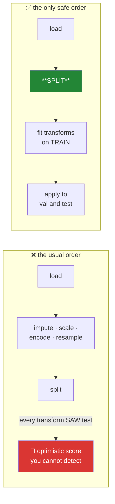

# Day 79 — The split, first

**Phase 10 · Module 10** · ID: **FE-04** (train/validation/test, stratified and grouped splits)

> **Yesterday:** imbalanced data, and SMOTE inside the split.
> **Today:** the day the last four lessons have been pointing at. Days 61, 66, 76, 77 and 78 each
> ended with the same warning — *fit on train, apply to test*. Today that stops being a thing you
> remember and becomes **a thing the code cannot get wrong.**
> **Tomorrow:** scaling, and it will be the first transform to obey the rule structurally.

```bash
./m start 79 && ./m scaffold 79
```

**Time:** 110 minutes. **Request budget:** 0 model calls.

---

## §1 The story

**The split is the first operation on your data, not a step somewhere in the middle.**

Everything you do before splitting sees the whole dataset, and every one of those operations quietly
carries information from the test set into the training process:



The insidious part: **leakage has no symptom.** A leaky pipeline runs clean, produces no warning, and
gives you a *better* score than an honest one. You only discover it in production, when the model
performs worse than every number you reported. That is why Principle 15 is a principle and not a tip,
and why today's deliverable is a guard rather than an instruction.

Three splits, three different questions:

- **Train** — the model learns from this.
- **Validation** — you choose things with this: hyperparameters, thresholds (Day 78), which model.
  Every choice you make here uses it up a little.
- **Test** — you look **once**, at the end, to estimate performance. Look twice and it becomes a
  validation set.

And three ways to split, each fixing a specific failure:

**Random** — the default, and wrong more often than people think.

**Stratified** — preserves the class balance in every split. With Day 78's 2% positive rate and a
small test set, a random split can hand you a test set containing almost no positives, and your
recall estimate becomes noise.

**Grouped** — the one people miss. If the same user appears in 40 rows, a random split puts some of
their rows in train and some in test. The model memorises *that user*, and your score measures
memorisation rather than generalisation. **Anything with a repeated entity needs a grouped split**:
users, patients, sessions, documents, images from the same subject.

Plus **time-based**, where random splitting is simply invalid: predicting the past from the future is
not a task anyone has.

---

## §2 Setup — run this

```bash
mkdir -p days/day-79/lab
touch days/day-79/lab/splitting.py
```

`src/setu/features.py` grows today. No new packages.

---

## §3 FE-04 — splitting

`days/day-79/lab/splitting.py`:

```python
"""FE-04: the split comes first, and which split depends on the data's structure."""

from __future__ import annotations

import numpy as np
import pandas as pd
from sklearn.linear_model import LogisticRegression, Ridge
from sklearn.metrics import accuracy_score, r2_score, recall_score
from sklearn.model_selection import (
    GroupKFold,
    GroupShuffleSplit,
    StratifiedKFold,
    TimeSeriesSplit,
    train_test_split,
)
from sklearn.preprocessing import StandardScaler

from setu.arrays import make_rng


def leakage_has_no_symptom() -> None:
    rng = make_rng(0)
    n, p = 300, 400                      # far more features than rows: pure noise
    X = rng.normal(size=(n, p))
    y = rng.integers(0, 2, n)            # target unrelated to X

    # WRONG: select features using ALL the data, then split
    correlations = np.array([abs(np.corrcoef(X[:, j], y)[0, 1]) for j in range(p)])
    best = np.argsort(correlations)[-20:]
    Xw_train, Xw_test, yw_train, yw_test = train_test_split(
        X[:, best], y, test_size=0.3, random_state=0
    )
    wrong = LogisticRegression(max_iter=1_000).fit(Xw_train, yw_train)
    wrong_score = accuracy_score(yw_test, wrong.predict(Xw_test))

    # RIGHT: split first, select using train only
    Xr_train, Xr_test, yr_train, yr_test = train_test_split(
        X, y, test_size=0.3, random_state=0
    )
    train_corr = np.array([abs(np.corrcoef(Xr_train[:, j], yr_train)[0, 1]) for j in range(p)])
    best_train = np.argsort(train_corr)[-20:]
    right = LogisticRegression(max_iter=1_000).fit(Xr_train[:, best_train], yr_train)
    right_score = accuracy_score(yr_test, right.predict(Xr_test[:, best_train]))

    print(f"\n  the target is RANDOM. There is nothing to learn.")
    print(f"    selected features before splitting : {wrong_score:.3f} accuracy")
    print(f"    selected features after  splitting : {right_score:.3f} accuracy")
    print(f"    honest expectation                 : 0.500")

    print("\n  ⚠️ The leaky version reports well above chance ON PURE NOISE. Nothing")
    print("     errored, nothing warned, and the code reads perfectly sensibly.")
    print("     THAT is why leakage needs a structural guard, not a reminder.")


def the_three_sets() -> None:
    rng = make_rng(1)
    n = 6_000
    X = rng.normal(size=(n, 8))
    y = X @ rng.normal(size=8) + rng.normal(0, 2, n)

    X_temp, X_test, y_temp, y_test = train_test_split(X, y, test_size=0.2, random_state=0)
    X_train, X_val, y_train, y_val = train_test_split(X_temp, y_temp, test_size=0.25,
                                                      random_state=0)

    print(f"\n  train {len(X_train):>6}  ({len(X_train) / n:.0%})  the model learns here")
    print(f"  val   {len(X_val):>6}  ({len(X_val) / n:.0%})  YOU choose here")
    print(f"  test  {len(X_test):>6}  ({len(X_test) / n:.0%})  looked at ONCE, at the end")

    print("\n  Note test_size=0.25 on the SECOND split gives 20% of the original —")
    print("  a classic off-by-one when carving three sets from two calls.")

    best_alpha, best_score = None, -np.inf
    for alpha in (0.01, 0.1, 1.0, 10.0, 100.0):
        model = Ridge(alpha=alpha).fit(X_train, y_train)
        score = r2_score(y_val, model.predict(X_val))
        if score > best_score:
            best_alpha, best_score = alpha, score

    final = Ridge(alpha=best_alpha).fit(np.vstack([X_train, X_val]),
                                        np.concatenate([y_train, y_val]))
    print(f"\n  chose alpha={best_alpha} on validation (R²={best_score:.4f})")
    print(f"  test R² = {r2_score(y_test, final.predict(X_test)):.4f}   <- the ONE look")

    print("\n  Refitting on train+val after choosing is standard: you keep the choice")
    print("  and recover the data. What you must NOT do is choose again on test.")


def stratify_when_the_class_is_rare() -> None:
    rng = make_rng(2)
    n = 2_000
    y = (rng.random(n) < 0.03).astype(int)
    X = rng.normal(y[:, None] * 1.5, 1.0, (n, 4))

    print(f"\n  positive rate = {y.mean():.4f}, {y.sum()} positives in {n} rows")
    print(f"\n  {'split':<14} {'test positives':>16} {'test rate':>11}")
    for seed in range(5):
        _, _, _, y_test = train_test_split(X, y, test_size=0.2, random_state=seed)
        print(f"  random seed={seed:<3} {y_test.sum():>16} {y_test.mean():>11.4f}")

    _, _, _, y_strat = train_test_split(X, y, test_size=0.2, stratify=y, random_state=0)
    print(f"  {'stratified':<14} {y_strat.sum():>16} {y_strat.mean():>11.4f}")

    print("\n  Random splits vary a lot in how many positives land in test. With a handful")
    print("  of positives, your recall estimate is based on almost nothing — and it will")
    print("  swing wildly between seeds, which looks like model instability and is not.")
    print("\n  `stratify=y` costs one argument and removes the whole problem.")


def group_leakage_is_the_one_people_miss() -> None:
    rng = make_rng(3)
    n_users, rows_per_user = 200, 20
    user_effect = rng.normal(0, 3, n_users)

    user = np.repeat(np.arange(n_users), rows_per_user)
    X = rng.normal(size=(n_users * rows_per_user, 3))
    y = user_effect[user] + X[:, 0] * 0.3 + rng.normal(0, 0.5, len(user))

    from sklearn.ensemble import RandomForestRegressor

    Xu = np.column_stack([X, pd.get_dummies(user).to_numpy()])

    Xr_train, Xr_test, yr_train, yr_test = train_test_split(Xu, y, test_size=0.3,
                                                            random_state=0)
    random_model = RandomForestRegressor(n_estimators=60, random_state=0).fit(Xr_train, yr_train)
    random_score = r2_score(yr_test, random_model.predict(Xr_test))

    splitter = GroupShuffleSplit(n_splits=1, test_size=0.3, random_state=0)
    train_idx, test_idx = next(splitter.split(Xu, y, groups=user))
    grouped_model = RandomForestRegressor(n_estimators=60, random_state=0).fit(
        Xu[train_idx], y[train_idx]
    )
    grouped_score = r2_score(y[test_idx], grouped_model.predict(Xu[test_idx]))

    print(f"\n  200 users, 20 rows each. A strong per-user effect.")
    print(f"    random split  R² = {random_score:.4f}   <- memorised the users")
    print(f"    grouped split R² = {grouped_score:.4f}   <- honest")

    overlap = set(user[train_idx]) & set(user[test_idx])
    print(f"\n  users appearing in BOTH halves under a grouped split: {len(overlap)}")
    print("\n  Under a random split every test user was also in train, so the model")
    print("  learned 'user 47 scores high' rather than anything generalisable.")
    print("  Deploy it on a NEW user and it has nothing.")
    print("\n  ⚠️ Anything with a repeated entity needs this: users, patients, sessions,")
    print("     documents, images of the same subject, rows from one experiment.")


def time_makes_random_splitting_invalid() -> None:
    rng = make_rng(4)
    n = 1_000
    trend = np.linspace(0, 10, n)
    y = trend + rng.normal(0, 1, n)
    X = np.column_stack([np.arange(n), rng.normal(size=(n, 2))])

    Xr_train, Xr_test, yr_train, yr_test = train_test_split(X, y, test_size=0.3,
                                                            random_state=0)
    random_model = Ridge().fit(Xr_train, yr_train)

    cut = int(n * 0.7)
    time_model = Ridge().fit(X[:cut], y[:cut])

    print(f"\n  random split R² = {r2_score(yr_test, random_model.predict(Xr_test)):.4f}")
    print(f"  time   split R² = {r2_score(y[cut:], time_model.predict(X[cut:])):.4f}")

    print("\n  A random split trains on future points to predict past ones. That is not")
    print("  a task that exists. The score is meaningless however good it looks.")

    splitter = TimeSeriesSplit(n_splits=4)
    print(f"\n  TimeSeriesSplit folds (train always precedes test):")
    for i, (train_idx, test_idx) in enumerate(splitter.split(X), 1):
        print(f"    fold {i}: train[0:{train_idx[-1] + 1}] test[{test_idx[0]}:{test_idx[-1] + 1}]")

    print("\n  Note the train set GROWS each fold and always ends before test begins.")
    print("  Day 89's stock case study is where this stops being theoretical.")


def cross_validation_and_its_variants() -> None:
    rng = make_rng(5)
    n = 1_200
    y = (rng.random(n) < 0.08).astype(int)
    X = rng.normal(y[:, None] * 1.2, 1.0, (n, 4))
    groups = rng.integers(0, 60, n)

    print(f"\n  {'splitter':<22} {'test positives per fold':>26}")
    for name, splitter, kwargs in (
        ("KFold", StratifiedKFold(n_splits=5, shuffle=True, random_state=0), {}),
        ("GroupKFold", GroupKFold(n_splits=5), {"groups": groups}),
    ):
        counts = [int(y[test].sum()) for _, test in splitter.split(X, y, **kwargs)]
        print(f"  {name:<22} {str(counts):>26}")

    print("\n  StratifiedKFold keeps the positive count stable across folds.")
    print("  GroupKFold keeps whole groups together but CANNOT also stratify —")
    print("  StratifiedGroupKFold exists for when you need both.")
    print("\n  Cross-validation gives you a mean AND a spread. A model whose fold scores")
    print("  range 0.60 to 0.85 is not 'a 0.72 model' — report the variation.")


def the_test_set_is_spent_by_looking() -> None:
    rng = make_rng(6)
    n = 1_000
    X = rng.normal(size=(n, 30))
    y = rng.integers(0, 2, n)                    # nothing to learn

    X_train, X_test, y_train, y_test = train_test_split(X, y, test_size=0.3, random_state=0)

    best = -np.inf
    for trial in range(60):
        subset = rng.choice(30, 8, replace=False)
        model = LogisticRegression(max_iter=1_000).fit(X_train[:, subset], y_train)
        score = accuracy_score(y_test, model.predict(X_test[:, subset]))
        best = max(best, score)

    print(f"\n  60 feature subsets, chosen by TEST accuracy, on a random target:")
    print(f"    best test accuracy = {best:.4f}   (chance = 0.500)")
    print("\n  This is Day 74's multiple comparisons wearing modelling clothes. Every")
    print("  look at the test set spends a little of it, and choosing by test score")
    print("  converts it into a validation set with no honest estimate left.")


def the_only_safe_order() -> None:
    print("\n  1. LOAD")
    print("  2. SPLIT — before anything else touches the data")
    print("  3. EXPLORE train only (Day 84 obeys this too)")
    print("  4. FIT transforms on train: impute, scale, encode, outlier bounds, resample")
    print("  5. APPLY those fitted transforms to val and test")
    print("  6. CHOOSE on validation")
    print("  7. LOOK at test ONCE")
    print("\n  Steps 4 and 5 are why every transform in this project is fit/apply.")
    print("  Day 83's ColumnTransformer makes the whole sequence one object that")
    print("  cannot be executed in the wrong order.")


if __name__ == "__main__":
    leakage_has_no_symptom()
    the_three_sets()
    stratify_when_the_class_is_rare()
    group_leakage_is_the_one_people_miss()
    time_makes_random_splitting_invalid()
    cross_validation_and_its_variants()
    the_test_set_is_spent_by_looking()
    the_only_safe_order()
```

**Line by line:**

- `leakage_has_no_symptom` — **the demonstration that justifies the whole day.** The target is random;
  there is genuinely nothing to learn. Selecting features on all the data before splitting reports
  accuracy well above chance. **Nothing errored, nothing warned, and the code reads perfectly
  sensibly.** That is why leakage needs a structural guard rather than a reminder.
- `the_three_sets` — note `test_size=0.25` on the *second* split yields 20% of the original. Carving
  three sets from two calls is a classic off-by-one, and the printed percentages are how you catch it.
- Refitting on train+val after choosing — **standard and correct**: you keep the choice and recover
  the data. What you must not do is *choose again* on test.
- `stratify_when_the_class_is_rare` — **read the seed-to-seed variation.** With 3% positives, random
  splits deliver wildly different test positive counts, and a recall computed from a handful of
  positives swings between seeds. That looks like model instability and is not. **`stratify=y` is one
  argument.**
- `group_leakage_is_the_one_people_miss` — the random split memorises users and scores far higher. The
  overlap count under the grouped split is **zero**, which is the property that makes it honest.
  Deploy the random-split model on a new user and it has nothing. **Users, patients, sessions,
  documents, images of the same subject** — all need this.
- `time_makes_random_splitting_invalid` — a random split **trains on future points to predict past
  ones.** That task does not exist. `TimeSeriesSplit`'s folds grow and always end before test begins;
  Day 89 is where this stops being theoretical.
- `cross_validation_and_its_variants` — `GroupKFold` keeps groups together but **cannot also
  stratify**; `StratifiedGroupKFold` exists for when you need both. And the reporting point: a model
  whose folds range 0.60 to 0.85 is not "a 0.72 model" — report the spread.
- `the_test_set_is_spent_by_looking` — sixty feature subsets chosen by test accuracy on a **random**
  target, and the best clears chance comfortably. **This is Day 74's multiple comparisons in modelling
  clothes.** Every look spends the test set.
- `the_only_safe_order` — seven steps. Steps 4 and 5 are why every transform in this project is
  fit/apply, and Day 83 makes the sequence one object that cannot run out of order.

---

## §4 Build brief

Extend `src/setu/features.py`:

```python
SPLIT_KINDS = ("random", "stratified", "grouped", "stratified_grouped", "time")


def choose_split(frame, *, target: str | None = None, group: str | None = None,
                 time_column: str | None = None) -> dict:
    """TODO(me): which split does THIS data need? PURE.

    {"kind", "reason", "warnings": [...]}
    - a time_column present -> 'time', and nothing else is acceptable
    - a group column with any repeated value -> 'grouped' (or 'stratified_grouped')
    - a binary target below 20% positive -> stratified
    - otherwise 'random'
    - the `reason` must name the DECIDING evidence, e.g. 'user appears up to 40 times'
    - warn when `group` is None but a column looks like an identifier with repeats
      (Day 58's infer_level heuristics) — that is the split people miss
    """
    raise NotImplementedError


def split_data(frame, *, kind: str = "stratified", target: str | None = None,
               group: str | None = None, time_column: str | None = None,
               test_size: float = 0.2, val_size: float = 0.2, seed: int = 42) -> dict:
    """TODO(me): produce train/val/test with the fractions you actually asked for.

    {"train", "val", "test", "kind", "sizes": {...}, "record": {...}}
    - val_size is a fraction of the ORIGINAL, not of the remainder — compute the
      second split's fraction accordingly (§3's off-by-one)
    - 'time' ignores `seed` and splits by order; assert the time column is sorted,
      raising if not (an unsorted time split is silently wrong)
    - 'grouped' must guarantee ZERO group overlap between any two sets
    - raise DataError if test_size + val_size >= 1.0
    - `record` captures kind, seed, sizes and the group/target columns, so a report
      can state exactly how the split was made
    """
    raise NotImplementedError


def assert_no_overlap(splits: dict, *, group: str | None = None) -> None:
    """TODO(me): the structural guard. Raise DataError on any leak between sets.

    - no shared INDEX values between train, val and test
    - when `group` is given, no shared GROUP values either — this is the check that
      catches Day 79's most-missed failure
    - the message must name the overlapping ids (up to 5) and the two sets involved
    - Day 83's pipeline calls this after every split
    """
    raise NotImplementedError


def assert_fit_before_apply(pipeline_order: list[str]) -> None:
    """TODO(me): refuse any ordering where a fitted transform precedes the split.

    - `pipeline_order` is a list of step names, e.g. ['load', 'split', 'impute', ...]
    - FITTED steps are: impute, scale, encode, outlier_bounds, resample, select
    - raise DataError if any fitted step appears BEFORE 'split', naming the step
    - raise DataError if 'split' is absent entirely
    - the message must say what the leak DOES, not just that it is wrong (§3:
      the score inflates and nothing errors)
    """
    raise NotImplementedError


def split_summary(splits: dict, *, target: str | None = None) -> dict:
    """TODO(me): what a report needs to state about the split.

    {"sizes", "fractions", "target_rate": {set: rate}, "n_groups": {set: int},
     "balanced", "warnings": [...]}
    - warn when the target rate differs by more than 20% relative between sets
    - warn when the test set contains fewer than 30 positives — every metric computed
      on it will be extremely noisy (Day 78)
    """
    raise NotImplementedError
```

- `assert_fit_before_apply` is **the day's artifact.** Every previous lesson ended with "remember to
  fit on train"; this converts five reminders into one check that a pipeline either passes or fails.
- `split_data` computing the validation fraction **relative to the original** removes the off-by-one
  from §3 permanently.
- `choose_split` warning about an **unspecified group column** is aimed squarely at the failure people
  miss, because nobody asks for a grouped split they have not realised they need.

---

## §5 The eval that must be able to fail

Add to `tests/test_features.py`:

```python
from setu.features import (
    assert_fit_before_apply,
    assert_no_overlap,
    choose_split,
    split_data,
    split_summary,
)


@pytest.fixture
def grouped_frame():
    rng = make_rng(0)
    user = np.repeat(np.arange(100), 10)
    return pd.DataFrame({"user": user, "x": rng.normal(size=1_000),
                         "y": rng.integers(0, 2, 1_000)})


def test_a_fitted_step_before_the_split_is_refused():
    """The guard that replaces five lessons' worth of reminders."""
    with pytest.raises(DataError) as info:
        assert_fit_before_apply(["load", "scale", "split", "train"])
    message = str(info.value)
    assert "scale" in message
    assert "inflat" in message.lower() or "leak" in message.lower()


def test_the_correct_order_passes():
    assert_fit_before_apply(["load", "split", "impute", "scale", "encode", "train"])


@pytest.mark.parametrize("step", ["impute", "encode", "outlier_bounds", "resample", "select"])
def test_every_fitted_step_is_caught_before_the_split(step):
    with pytest.raises(DataError):
        assert_fit_before_apply(["load", step, "split", "train"])


def test_a_missing_split_is_refused():
    with pytest.raises(DataError):
        assert_fit_before_apply(["load", "impute", "train"])


def test_unfitted_steps_before_the_split_are_fine():
    """Dropping a column or renaming does not leak."""
    assert_fit_before_apply(["load", "drop_columns", "rename", "split", "scale"])


def test_the_validation_fraction_is_of_the_original(grouped_frame):
    """§3's off-by-one."""
    splits = split_data(grouped_frame, kind="random", test_size=0.2, val_size=0.2)
    n = len(grouped_frame)
    assert len(splits["test"]) == pytest.approx(n * 0.2, abs=n * 0.02)
    assert len(splits["val"]) == pytest.approx(n * 0.2, abs=n * 0.02)
    assert len(splits["train"]) == pytest.approx(n * 0.6, abs=n * 0.02)


def test_the_three_sets_partition_the_data(grouped_frame):
    splits = split_data(grouped_frame, kind="random")
    total = sum(len(splits[name]) for name in ("train", "val", "test"))
    assert total == len(grouped_frame)


def test_no_index_appears_in_two_sets(grouped_frame):
    splits = split_data(grouped_frame, kind="random")
    assert_no_overlap(splits)


def test_overlap_is_detected():
    frame = pd.DataFrame({"x": range(10)})
    splits = {"train": frame.iloc[:6], "val": frame.iloc[4:8], "test": frame.iloc[8:]}
    with pytest.raises(DataError) as info:
        assert_no_overlap(splits)
    assert "train" in str(info.value) and "val" in str(info.value)


def test_a_grouped_split_shares_no_groups(grouped_frame):
    """The failure people miss."""
    splits = split_data(grouped_frame, kind="grouped", group="user")
    train_users = set(splits["train"]["user"])
    test_users = set(splits["test"]["user"])
    val_users = set(splits["val"]["user"])
    assert not (train_users & test_users)
    assert not (train_users & val_users)
    assert not (val_users & test_users)


def test_group_overlap_is_detected(grouped_frame):
    splits = split_data(grouped_frame, kind="random")
    with pytest.raises(DataError) as info:
        assert_no_overlap(splits, group="user")
    assert "user" in str(info.value).lower() or "group" in str(info.value).lower()


def test_a_random_split_does_share_groups(grouped_frame):
    """Confirming the failure exists before checking the fix."""
    splits = split_data(grouped_frame, kind="random")
    shared = set(splits["train"]["user"]) & set(splits["test"]["user"])
    assert len(shared) > 50, "a random split on 100 users should share most of them"


def test_stratification_preserves_the_rare_class():
    rng = make_rng(1)
    frame = pd.DataFrame({"x": rng.normal(size=2_000),
                          "y": (rng.random(2_000) < 0.03).astype(int)})
    splits = split_data(frame, kind="stratified", target="y", seed=7)
    rates = [splits[name]["y"].mean() for name in ("train", "val", "test")]
    assert max(rates) - min(rates) < 0.01


def test_a_random_split_does_not_preserve_it():
    rng = make_rng(2)
    frame = pd.DataFrame({"x": rng.normal(size=1_000),
                          "y": (rng.random(1_000) < 0.03).astype(int)})
    spreads = []
    for seed in range(8):
        splits = split_data(frame, kind="random", seed=seed)
        rates = [splits[name]["y"].mean() for name in ("train", "val", "test")]
        spreads.append(max(rates) - min(rates))
    assert max(spreads) > 0.01, "random splits should vary in class balance"


def test_a_time_split_never_trains_on_the_future():
    frame = pd.DataFrame({
        "t": pd.date_range("2024-01-01", periods=1_000, freq="D"),
        "x": make_rng(3).normal(size=1_000),
    })
    splits = split_data(frame, kind="time", time_column="t")
    assert splits["train"]["t"].max() <= splits["val"]["t"].min()
    assert splits["val"]["t"].max() <= splits["test"]["t"].min()


def test_an_unsorted_time_column_is_refused():
    """An unsorted time split is silently wrong."""
    frame = pd.DataFrame({
        "t": pd.to_datetime(["2024-03-01", "2024-01-01", "2024-02-01"]),
        "x": [1.0, 2.0, 3.0],
    })
    with pytest.raises(DataError) as info:
        split_data(frame, kind="time", time_column="t")
    assert "sort" in str(info.value).lower() or "order" in str(info.value).lower()


def test_a_time_split_ignores_the_seed():
    frame = pd.DataFrame({
        "t": pd.date_range("2024-01-01", periods=500, freq="D"),
        "x": make_rng(4).normal(size=500),
    })
    a = split_data(frame, kind="time", time_column="t", seed=1)
    b = split_data(frame, kind="time", time_column="t", seed=99)
    pd.testing.assert_frame_equal(a["test"], b["test"])


def test_splits_are_reproducible(grouped_frame):
    a = split_data(grouped_frame, kind="random", seed=11)
    b = split_data(grouped_frame, kind="random", seed=11)
    pd.testing.assert_frame_equal(a["test"], b["test"])


def test_impossible_fractions_are_refused(grouped_frame):
    with pytest.raises(DataError):
        split_data(grouped_frame, test_size=0.6, val_size=0.5)


def test_choose_split_demands_time_when_a_time_column_exists():
    frame = pd.DataFrame({"t": pd.date_range("2024-01-01", periods=100),
                          "y": [0, 1] * 50})
    result = choose_split(frame, target="y", time_column="t")
    assert result["kind"] == "time"


def test_choose_split_detects_a_repeated_group(grouped_frame):
    result = choose_split(grouped_frame, target="y", group="user")
    assert "group" in result["kind"]
    assert "user" in result["reason"]


def test_choose_split_warns_about_an_unnoticed_group_column(grouped_frame):
    """Nobody asks for a split they haven't realised they need."""
    result = choose_split(grouped_frame, target="y")
    assert result["warnings"], "a repeated identifier column went unflagged"


def test_choose_split_stratifies_a_rare_target():
    rng = make_rng(5)
    frame = pd.DataFrame({"x": rng.normal(size=1_000),
                          "y": (rng.random(1_000) < 0.04).astype(int)})
    assert choose_split(frame, target="y")["kind"] == "stratified"


def test_the_reason_names_the_evidence(grouped_frame):
    result = choose_split(grouped_frame, target="y", group="user")
    assert any(char.isdigit() for char in result["reason"]), (
        "the reason should cite the repeat count, not just restate the input"
    )


def test_a_tiny_positive_count_in_test_is_warned_about():
    rng = make_rng(6)
    frame = pd.DataFrame({"x": rng.normal(size=600),
                          "y": (rng.random(600) < 0.02).astype(int)})
    splits = split_data(frame, kind="stratified", target="y")
    summary = split_summary(splits, target="y")
    assert any("noisy" in w.lower() or "positive" in w.lower() for w in summary["warnings"])


def test_a_healthy_split_is_not_warned_about():
    rng = make_rng(7)
    frame = pd.DataFrame({"x": rng.normal(size=10_000),
                          "y": (rng.random(10_000) < 0.4).astype(int)})
    splits = split_data(frame, kind="stratified", target="y")
    assert not split_summary(splits, target="y")["warnings"]


def test_the_record_states_how_the_split_was_made(grouped_frame):
    import json

    splits = split_data(grouped_frame, kind="grouped", group="user", seed=3)
    record = splits["record"]
    assert record["kind"] == "grouped" and record["seed"] == 3
    json.dumps(record)
```

**Line by line:**

- `test_a_fitted_step_before_the_split_is_refused` — **the day's real assessment**, and the message
  must explain what the leak *does*. "Scaling before the split is wrong" gets deleted; "the score
  inflates and nothing errors" does not.
- `test_every_fitted_step_is_caught_before_the_split` — five parametrised cases, one per fitted
  transform from Days 61, 66, 76, 77 and 78. **This single test retires all five reminders.**
- `test_unfitted_steps_before_the_split_are_fine` — the guard must not be over-broad. Dropping a
  column or renaming does not leak, and a check that blocks them gets turned off.
- `test_a_random_split_does_share_groups` paired with `test_a_grouped_split_shares_no_groups` —
  **confirming the failure exists before checking the fix.** Without the first test, the second proves
  nothing about whether grouping was necessary.
- `test_an_unsorted_time_column_is_refused` — an unsorted time split silently produces a random split
  wearing a time split's name, with no error. Raising is the only safe behaviour.
- `test_a_time_split_ignores_the_seed` — two very different seeds must give identical output. A time
  split that responds to a seed is shuffling somewhere it should not.
- `test_choose_split_warns_about_an_unnoticed_group_column` — the failure people miss, caught **before**
  they know to ask.
- `test_the_reason_names_the_evidence` — asserts a digit appears, forcing the reason to cite the repeat
  count rather than restating the input.

```bash
uv run python -m pytest tests/test_features.py -v
```

---

## §6 Request budget

| Resource | Spent today |
|---|---|
| LLM calls | **0** |

---

## §7 Traps

- **Splitting after transforming.** Every transform saw test. No symptom, better score.
- **Selecting features on the full dataset.** §3 got above chance on pure noise.
- **`test_size` on the second split read as a fraction of the original.** It is not.
- **A random split on a rare class.** Test positive counts swing wildly by seed.
- **A random split with repeated entities.** The model memorises the entity.
- **Forgetting groups exist.** Users, patients, sessions, documents, subjects.
- **A random split on time-ordered data.** Predicting the past from the future.
- **An unsorted time split.** Silently a random split with a different name.
- **`GroupKFold` expected to stratify.** It cannot; use `StratifiedGroupKFold`.
- **Choosing anything on test.** It becomes a validation set.
- **Reporting a CV mean without its spread.** 0.60–0.85 is not "a 0.72 model".

---

## §8 Verify before you code

Written **2026-08-21**:

- <https://scikit-learn.org/stable/modules/cross_validation.html> — the full splitter family,
  including `StratifiedGroupKFold`.
- <https://scikit-learn.org/stable/common_pitfalls.html#data-leakage> — scikit-learn's own leakage
  guide, worth reading once in full.
- <https://scikit-learn.org/stable/modules/generated/sklearn.model_selection.TimeSeriesSplit.html> —
  the growing-window behaviour.
- <https://scikit-learn.org/stable/modules/generated/sklearn.model_selection.GroupShuffleSplit.html>.

---

## §9 Say it in an interview

> "The split is the first operation, not a step in the middle, and the reason is that leakage has no
> symptom — a leaky pipeline runs clean, warns about nothing, and gives you a *better* score than an
> honest one. I demonstrate it with a random target and four hundred noise features: select the best
> twenty before splitting and you report well above chance on data with nothing in it. The one people
> miss is grouped splitting. If the same user has forty rows, a random split puts some in train and
> some in test, and the model learns 'user 47 scores high' rather than anything generalisable — so it
> looks excellent and has nothing when a new user arrives. Anything with a repeated entity needs it:
> users, patients, sessions, documents. The deliverable from that day isn't advice, it's a check: a
> function that takes the pipeline's step order and refuses any ordering where a fitted transform —
> imputer, scaler, encoder, outlier bounds, resampler — appears before the split. That one guard
> retires five separate lessons' worth of 'remember to fit on train'."

---

## §10 Done when

Tick [`CHECKLIST.md`](CHECKLIST.md), then `./m check && ./m done 79`.
