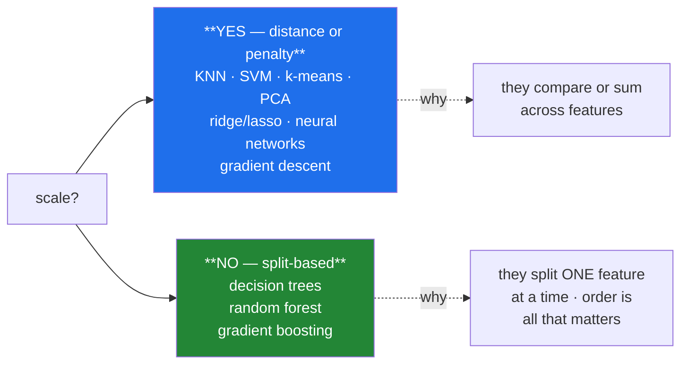

# Day 80 — Scaling

**Phase 10 · Module 10** · ID: **FE-05** (standard, min-max and robust scaling)

> **Yesterday:** the split, first — and `assert_fit_before_apply`.
> **Today:** the first transform to live under that rule. Scaling is simple arithmetic, so the lesson
> is elsewhere: **which models care and which do not**, and what a single outlier does to each scaler.
> Day 66's `z_scores` gets its production form.
> **Tomorrow:** encoding, and a leak worse than any so far.

```bash
./m start 80 && ./m scaffold 80
```

**Time:** 100 minutes. **Request budget:** 0 model calls.

---

## §1 The story

Scaling puts features on a comparable footing. Whether that matters depends entirely on the model:



The rule underneath: **if the algorithm compares or combines features, scale. If it examines one
feature at a time, do not bother.** A tree asking "is `pages > 8`?" gets the same answer whatever the
units, because a monotone transform preserves the ordering. KNN computing a Euclidean distance across
`pages` (4–16) and `citations` (0–200,000) is measuring citations and nothing else.

Three scalers, and the choice is about **outliers**:

- **StandardScaler** — subtract the mean, divide by the sd. Day 66's z-score. Both statistics are
  outlier-sensitive (Day 59, Day 60), so one extreme value distorts the whole column.
- **MinMaxScaler** — map to `[0, 1]` using the min and max. **Defined entirely by the two most extreme
  values**, which makes it the most outlier-fragile of the three.
- **RobustScaler** — subtract the median, divide by the IQR. Both robust (Day 60), so it barely moves.

And two facts worth stating plainly, because both are commonly misremembered:

**Scaling does not change the shape.** Day 66 measured this: skew is unchanged by any linear transform.
Scaling makes features comparable; **Day 61's log transform** changes the distribution. Reaching for a
scaler to fix skew does nothing.

**Test values can escape the range.** A MinMaxScaler fitted on train maps train to `[0, 1]` exactly.
Test values beyond the training range land outside it — which is **correct behaviour**, and a model
that assumed `[0, 1]` will misbehave. That is a real deployment failure and you will measure it.

---

## §2 Setup — run this

```bash
mkdir -p days/day-80/lab
touch days/day-80/lab/scaling.py
```

`src/setu/features.py` grows today. No new packages.

---

## §3 FE-05 — scaling

`days/day-80/lab/scaling.py`:

```python
"""FE-05: three scalers, which models care, and what escapes the range."""

from __future__ import annotations

import numpy as np
import pandas as pd
from scipy import stats as sp
from sklearn.ensemble import RandomForestClassifier
from sklearn.linear_model import LogisticRegression, Ridge
from sklearn.metrics import accuracy_score
from sklearn.model_selection import train_test_split
from sklearn.neighbors import KNeighborsClassifier
from sklearn.preprocessing import MinMaxScaler, RobustScaler, StandardScaler

from setu.arrays import make_rng


def units_dominate_distance() -> None:
    rng = make_rng(0)
    n = 3_000
    pages = rng.integers(4, 16, n).astype(float)
    citations = rng.lognormal(6, 1.5, n)
    y = ((pages > 10).astype(int) + (citations > np.median(citations)).astype(int) > 1).astype(int)

    X = np.column_stack([pages, citations])
    X_train, X_test, y_train, y_test = train_test_split(X, y, test_size=0.3,
                                                        stratify=y, random_state=0)

    scaler = StandardScaler().fit(X_train)

    print(f"\n  raw ranges: pages [{pages.min():.0f}, {pages.max():.0f}], "
          f"citations [{citations.min():.0f}, {citations.max():,.0f}]")

    unscaled = KNeighborsClassifier(15).fit(X_train, y_train)
    scaled = KNeighborsClassifier(15).fit(scaler.transform(X_train), y_train)

    print(f"\n  KNN unscaled : {accuracy_score(y_test, unscaled.predict(X_test)):.4f}")
    print(f"  KNN scaled   : "
          f"{accuracy_score(y_test, scaled.predict(scaler.transform(X_test))):.4f}")

    distance = np.abs(X_train[0] - X_train[1])
    print(f"\n  a single distance component: pages {distance[0]:.1f}, "
          f"citations {distance[1]:,.0f}")
    print("  ^ citations is thousands of times larger, so the Euclidean distance IS")
    print("    citations. `pages` might as well not be in the dataset.")


def which_models_care() -> None:
    rng = make_rng(1)
    n = 4_000
    X = np.column_stack([rng.normal(0, 1, n), rng.normal(0, 1, n) * 1_000])
    y = ((X[:, 0] + X[:, 1] / 1_000) > 0).astype(int)

    X_train, X_test, y_train, y_test = train_test_split(X, y, test_size=0.3, random_state=0)
    scaler = StandardScaler().fit(X_train)

    print(f"\n  {'model':<24} {'unscaled':>10} {'scaled':>9} {'difference':>12}")
    for name, model in (
        ("KNN", KNeighborsClassifier(15)),
        ("logistic regression", LogisticRegression(max_iter=200)),
        ("random forest", RandomForestClassifier(n_estimators=60, random_state=0)),
    ):
        from sklearn.base import clone

        plain = clone(model).fit(X_train, y_train)
        fitted = clone(model).fit(scaler.transform(X_train), y_train)
        a = accuracy_score(y_test, plain.predict(X_test))
        b = accuracy_score(y_test, fitted.predict(scaler.transform(X_test)))
        print(f"  {name:<24} {a:>10.4f} {b:>9.4f} {b - a:>+12.4f}")

    print("\n  The forest is unchanged — it asks 'is feature 1 above some value?', and")
    print("  the answer does not depend on the units. Trees are invariant to any")
    print("  MONOTONE transform, which includes every scaler here.")
    print("\n  KNN and logistic regression both improve, for different reasons: distance")
    print("  in one case, and gradient-descent convergence plus a shared penalty in the other.")


def regularisation_needs_scaling() -> None:
    rng = make_rng(2)
    n = 2_000
    X = np.column_stack([rng.normal(0, 1, n), rng.normal(0, 1, n) * 100])
    y = X[:, 0] * 2 + X[:, 1] * 0.02 + rng.normal(0, 0.5, n)

    plain = Ridge(alpha=10.0).fit(X, y)
    scaler = StandardScaler().fit(X)
    scaled = Ridge(alpha=10.0).fit(scaler.transform(X), y)

    print(f"\n  both features contribute EQUALLY to y by construction.")
    print(f"    unscaled coefficients: {np.round(plain.coef_, 4)}")
    print(f"    scaled coefficients  : {np.round(scaled.coef_, 4)}")

    print("\n  Ridge penalises the SUM OF SQUARED COEFFICIENTS. A feature on a large")
    print("  scale needs a tiny coefficient, so it is barely penalised; a small-scale")
    print("  feature needs a large one and gets crushed.")
    print("\n  ⚠️ Unscaled regularisation penalises your features by their UNITS. That is")
    print("     not a modelling choice anyone made — it is an accident of measurement.")


def the_three_scalers() -> None:
    rng = make_rng(3)
    clean = rng.normal(100, 15, 1_000)
    contaminated = np.append(clean, [5_000.0])

    print(f"\n  {'scaler':<18} {'clean: mean':>13} {'clean: sd':>11} "
          f"{'+outlier: mean':>16} {'+outlier: sd':>14}")
    for name, scaler in (("StandardScaler", StandardScaler()),
                         ("MinMaxScaler", MinMaxScaler()),
                         ("RobustScaler", RobustScaler())):
        a = scaler.fit_transform(clean.reshape(-1, 1)).ravel()
        b = scaler.fit_transform(contaminated.reshape(-1, 1)).ravel()
        print(f"  {name:<18} {a.mean():>13.4f} {a.std(ddof=1):>11.4f} "
              f"{b[:-1].mean():>16.4f} {b[:-1].std(ddof=1):>14.4f}")

    print("\n  With one outlier in 1,001 values:")
    print("    MinMax collapses the real data into a tiny sliver near 0 — the outlier")
    print("      defines the maximum, so everything else is squeezed against the floor.")
    print("    Standard shifts noticeably: the mean and sd both moved (Days 59, 60).")
    print("    Robust barely moves: the median and IQR are unaffected.")


def scaling_does_not_change_the_shape() -> None:
    rng = make_rng(4)
    values = rng.lognormal(0, 1.2, 10_000).reshape(-1, 1)

    print(f"\n  {'transform':<18} {'skew':>8} {'kurtosis':>10}")
    print(f"  {'raw':<18} {sp.skew(values.ravel()):>8.3f} "
          f"{sp.kurtosis(values.ravel()):>10.3f}")
    for name, scaler in (("standard", StandardScaler()), ("min-max", MinMaxScaler()),
                         ("robust", RobustScaler())):
        scaled = scaler.fit_transform(values).ravel()
        print(f"  {name:<18} {sp.skew(scaled):>8.3f} {sp.kurtosis(scaled):>10.3f}")

    logged = np.log1p(values.ravel())
    print(f"  {'log1p (Day 61)':<18} {sp.skew(logged):>8.3f} {sp.kurtosis(logged):>10.3f}")

    print("\n  Every scaler leaves skew and kurtosis IDENTICAL — they are linear")
    print("  transforms, and Day 66 measured exactly this.")
    print("  Only the log changes the shape. Scaling makes features COMPARABLE;")
    print("  it does not make them normal, and reaching for a scaler to fix skew does nothing.")


def test_values_escape_the_range() -> None:
    rng = make_rng(5)
    train = rng.normal(100, 15, 800).reshape(-1, 1)
    test = rng.normal(140, 15, 200).reshape(-1, 1)      # genuinely shifted

    scaler = MinMaxScaler().fit(train)
    train_scaled = scaler.transform(train).ravel()
    test_scaled = scaler.transform(test).ravel()

    print(f"\n  train scaled range: [{train_scaled.min():.3f}, {train_scaled.max():.3f}]")
    print(f"  test  scaled range: [{test_scaled.min():.3f}, {test_scaled.max():.3f}]")
    print(f"  test values above 1.0: {(test_scaled > 1.0).sum()} of {len(test_scaled)}")

    print("\n  This is CORRECT. The scaler learned train's range; test genuinely exceeds it.")
    print("  But a model that assumed [0,1] — a neural network with a bounded activation,")
    print("  or code with an explicit assertion — will now misbehave in production.")
    print("\n  Options: RobustScaler (unbounded by design, so no false promise), clipping")
    print("  (which HIDES the shift — log it if you do), or monitoring for out-of-range")
    print("  values as a drift signal. Day 237's dashboard does the third.")


def the_leak_now_has_a_guard() -> None:
    rng = make_rng(6)
    train = rng.normal(100, 15, 800).reshape(-1, 1)
    test = rng.normal(150, 15, 300).reshape(-1, 1)

    scaler = StandardScaler().fit(train)
    correct = scaler.transform(test).ravel()
    wrong = StandardScaler().fit_transform(test).ravel()

    print(f"\n  test mean under TRAIN's scaler : {correct.mean():>7.3f}  <- the shift SHOWS")
    print(f"  test mean refitted on itself   : {wrong.mean():>7.3f}  <- the shift VANISHED")

    print("\n  Day 66 showed this with z-scores; Day 76 with imputation; Day 77 with")
    print("  outlier bounds. Yesterday's `assert_fit_before_apply` is what makes it")
    print("  impossible to get wrong, instead of something you have to remember.")


def sparse_data_needs_care() -> None:
    from scipy import sparse

    rng = make_rng(7)
    dense = (rng.random((500, 20)) < 0.05) * rng.normal(5, 1, (500, 20))
    matrix = sparse.csr_matrix(dense)

    print(f"\n  sparse matrix: {matrix.nnz} non-zero of {np.prod(dense.shape)} "
          f"({matrix.nnz / np.prod(dense.shape):.1%} dense)")

    try:
        StandardScaler().fit_transform(matrix)
    except (TypeError, ValueError) as exc:
        print(f"  StandardScaler with centring: {type(exc).__name__}")
        print("  ^ subtracting the mean makes every zero non-zero, destroying sparsity.")

    scaled = StandardScaler(with_mean=False).fit_transform(matrix)
    print(f"  with_mean=False: still sparse, {scaled.nnz} non-zero")
    print("\n  Day 81's one-hot encoding produces exactly this shape. `MaxAbsScaler`")
    print("  is the sparse-safe default; it divides by the largest absolute value only.")


if __name__ == "__main__":
    units_dominate_distance()
    which_models_care()
    regularisation_needs_scaling()
    the_three_scalers()
    scaling_does_not_change_the_shape()
    test_values_escape_the_range()
    the_leak_now_has_a_guard()
    sparse_data_needs_care()
```

**Line by line:**

- `units_dominate_distance` — **look at the printed distance components.** Citations differ by
  thousands while pages differ by a handful, so the Euclidean distance *is* citations. `pages` might as
  well not be in the dataset.
- `which_models_care` — **the forest row is the point.** Its accuracy is unchanged, because a tree asks
  "is feature 1 above some value?" and the answer does not depend on units. **Trees are invariant to
  any monotone transform**, which includes every scaler here.
- `regularisation_needs_scaling` — the two features contribute equally by construction, and the
  unscaled coefficients are wildly different in magnitude. Ridge penalises the **sum of squared
  coefficients**, so a large-scale feature needs a tiny coefficient and escapes the penalty. **Unscaled
  regularisation penalises features by their units** — an accident of measurement, not a decision.
- `the_three_scalers` — **read the outlier columns.** MinMax collapses the real data into a sliver near
  zero, because the outlier defines the maximum. Standard shifts noticeably (mean and sd both moved,
  Days 59–60). Robust barely moves.
- `scaling_does_not_change_the_shape` — **skew and kurtosis identical across all three scalers.** They
  are linear transforms; Day 66 measured this. Only `log1p` changes the shape. Reaching for a scaler to
  fix skew does nothing at all.
- `test_values_escape_the_range` — test values land above 1.0, and **this is correct.** The scaler
  learned train's range and test genuinely exceeds it. But a model assuming `[0, 1]` misbehaves. Three
  options, and note that clipping **hides** the shift — log it if you use it.
- `the_leak_now_has_a_guard` — the same demonstration as Days 66, 76 and 77, and this is the last time
  it needs stating, because yesterday's guard makes it structural.
- `sparse_data_needs_care` — centring makes every zero non-zero and **destroys sparsity**, which on a
  wide one-hot matrix is the difference between megabytes and gigabytes. Day 81 produces exactly this
  shape; `MaxAbsScaler` is the sparse-safe default.

---

## §4 Build brief

Extend `src/setu/features.py`:

```python
SCALERS = ("standard", "minmax", "robust", "maxabs", "none")

SCALE_SENSITIVE = ("knn", "svm", "kmeans", "pca", "ridge", "lasso", "elasticnet",
                   "logistic", "neural_network")
SCALE_INVARIANT = ("decision_tree", "random_forest", "gradient_boosting", "xgboost",
                   "lightgbm")


def needs_scaling(model_kind: str) -> dict:
    """TODO(me): does this model care? PURE.

    {"model", "needs_scaling", "reason", "recommended_scaler"}
    - the reason must say WHY: 'compares features by distance' or
      'splits one feature at a time, so any monotone transform is irrelevant'
    - raise DataError on an unknown model kind, listing the known ones — guessing
      here would be worse than refusing
    """
    raise NotImplementedError


def fit_scaler(frame, columns: list[str], *, method: str = "robust",
               sparse_safe: bool = False) -> dict:
    """TODO(me): learn the scaling parameters from TRAIN only.

    {"method", "columns", "params": {col: {...}}, "fitted_on_n", "warnings": [...]}
    - 'robust' is the DEFAULT: §3 showed standard and minmax are outlier-sensitive,
      and Day 61 showed skew is the normal case
    - sparse_safe=True forces 'maxabs' and raises if `method` would centre the data
    - params are JSON-serialisable (centre and scale per column), so a spec can be
      stored beside a model
    - raise DataError if a column is constant — the scale would be zero; say which
      column and suggest dropping it
    - warn when a column's outlier fraction (Day 77's robust rule) exceeds 1% and
      the method is 'standard' or 'minmax'
    """
    raise NotImplementedError


def apply_scaler(frame, spec: dict, *, clip: bool = False) -> tuple:
    """TODO(me): APPLY a fitted spec. Returns (frame, record). Never fits.

    - `record` = {"n_out_of_range": {col: int}, "max_scaled": {col: float},
      "min_scaled": {col: float}, "clipped": bool}
    - out-of-range counting is only meaningful for 'minmax'; report it there
    - clip=False by DEFAULT: clipping hides a genuine distribution shift (§3).
      When clip=True the record must say so, and the count must still be reported.
    - raise DataError if a spec column is absent, naming it
    - must not mutate the input
    """
    raise NotImplementedError


def scaling_drift(record: dict, *, threshold: float = 0.01) -> dict:
    """TODO(me): are the incoming values still in the range the scaler learned?

    {"drifted_columns": [...], "worst": {"column", "pct_out_of_range"}, "is_drifting"}
    - is_drifting when any column exceeds `threshold` out-of-range
    - this turns §3's deployment failure into a MONITORING signal (Day 237)
    - a fraction slightly above zero is normal; a sudden jump is not
    """
    raise NotImplementedError


def assert_shape_unchanged(before, after, *, tolerance: float = 1e-6) -> None:
    """TODO(me): confirm a scaler did not alter the distribution's shape.

    - skew and kurtosis (Day 61's shape) must match within `tolerance`
    - raise DataError if they differ, because that means a NON-LINEAR transform
      was applied where a scaler was expected
    - this catches the confusion between scaling and transforming, in code
    """
    raise NotImplementedError
```

- `robust` as the default inverts the common habit of reaching for `StandardScaler`, and §3 measured
  why: standard and min-max are both outlier-sensitive, and Day 61 established that skew and extremes
  are the normal case rather than the exception.
- `clip=False` by default is the honest choice — **clipping hides a real distribution shift**, and
  hiding it is how a drifting model goes unnoticed.
- `assert_shape_unchanged` encodes §3's most-misremembered fact **as a check**: if skew changed, what
  ran was not a scaler.

---

## §5 The eval that must be able to fail

Add to `tests/test_features.py`:

```python
from setu.features import (
    apply_scaler,
    assert_shape_unchanged,
    fit_scaler,
    needs_scaling,
    scaling_drift,
)


def test_distance_models_need_scaling():
    for kind in ("knn", "svm", "kmeans", "pca"):
        result = needs_scaling(kind)
        assert result["needs_scaling"] is True
        assert result["reason"]


def test_trees_do_not_need_scaling():
    """A tree splits one feature at a time; units are irrelevant."""
    for kind in ("decision_tree", "random_forest", "gradient_boosting"):
        result = needs_scaling(kind)
        assert result["needs_scaling"] is False
        assert "monotone" in result["reason"].lower() or "split" in result["reason"].lower()


def test_regularised_linear_models_need_scaling():
    """Unscaled regularisation penalises features by their units."""
    for kind in ("ridge", "lasso", "elasticnet"):
        assert needs_scaling(kind)["needs_scaling"] is True


def test_an_unknown_model_raises_rather_than_guessing():
    with pytest.raises(DataError) as info:
        needs_scaling("some_new_thing")
    assert "knn" in str(info.value) or "random_forest" in str(info.value)


def test_robust_is_the_default():
    import inspect

    assert inspect.signature(fit_scaler).parameters["method"].default == "robust"


def test_standard_scaling_centres_and_normalises():
    rng = make_rng(0)
    frame = pd.DataFrame({"x": rng.normal(100, 15, 5_000)})
    spec = fit_scaler(frame, ["x"], method="standard")
    out, _ = apply_scaler(frame, spec)
    assert out["x"].mean() == pytest.approx(0.0, abs=1e-9)
    assert out["x"].std(ddof=0) == pytest.approx(1.0, abs=1e-6)


def test_minmax_maps_train_to_zero_one():
    rng = make_rng(1)
    frame = pd.DataFrame({"x": rng.normal(100, 15, 1_000)})
    spec = fit_scaler(frame, ["x"], method="minmax")
    out, _ = apply_scaler(frame, spec)
    assert out["x"].min() == pytest.approx(0.0)
    assert out["x"].max() == pytest.approx(1.0)


def test_minmax_is_the_most_outlier_fragile():
    """One extreme value defines the maximum and squashes everything else."""
    rng = make_rng(2)
    clean = rng.normal(100, 15, 1_000)
    frame = pd.DataFrame({"x": np.append(clean, 10_000.0)})

    spreads = {}
    for method in ("minmax", "standard", "robust"):
        spec = fit_scaler(frame, ["x"], method=method)
        out, _ = apply_scaler(frame, spec)
        spreads[method] = out["x"].iloc[:-1].std(ddof=1)

    assert spreads["minmax"] < spreads["standard"] < spreads["robust"]


def test_robust_barely_moves_with_an_outlier():
    rng = make_rng(3)
    clean = pd.DataFrame({"x": rng.normal(100, 15, 1_000)})
    dirty = pd.DataFrame({"x": np.append(clean["x"].to_numpy(), 10_000.0)})

    clean_out, _ = apply_scaler(clean, fit_scaler(clean, ["x"], method="robust"))
    dirty_out, _ = apply_scaler(dirty, fit_scaler(dirty, ["x"], method="robust"))

    assert dirty_out["x"].iloc[:-1].std(ddof=1) == pytest.approx(
        clean_out["x"].std(ddof=1), rel=0.05
    )


def test_scaling_never_changes_the_shape():
    """Day 66 measured this; here it is enforced."""
    rng = make_rng(4)
    frame = pd.DataFrame({"x": rng.lognormal(0, 1.2, 10_000)})
    for method in ("standard", "minmax", "robust", "maxabs"):
        spec = fit_scaler(frame, ["x"], method=method)
        out, _ = apply_scaler(frame, spec)
        assert_shape_unchanged(frame["x"], out["x"])


def test_a_log_transform_is_caught_as_shape_changing():
    rng = make_rng(5)
    values = pd.Series(rng.lognormal(0, 1.2, 5_000))
    with pytest.raises(DataError) as info:
        assert_shape_unchanged(values, np.log1p(values))
    assert "shape" in str(info.value).lower() or "skew" in str(info.value).lower()


def test_a_constant_column_is_refused():
    frame = pd.DataFrame({"x": [5.0] * 100})
    with pytest.raises(DataError) as info:
        fit_scaler(frame, ["x"], method="standard")
    assert "x" in str(info.value)


def test_outlier_prone_columns_warn_against_standard():
    rng = make_rng(6)
    frame = pd.DataFrame({"x": np.append(rng.normal(100, 10, 1_000),
                                         rng.normal(5_000, 100, 30))})
    assert fit_scaler(frame, ["x"], method="standard")["warnings"]


def test_robust_on_the_same_column_does_not_warn():
    rng = make_rng(7)
    frame = pd.DataFrame({"x": np.append(rng.normal(100, 10, 1_000),
                                         rng.normal(5_000, 100, 30))})
    assert not fit_scaler(frame, ["x"], method="robust")["warnings"]


def test_train_params_are_applied_not_refitted():
    """The last time this needs a test — Day 79's guard makes it structural."""
    rng = make_rng(8)
    train = pd.DataFrame({"x": rng.normal(100, 15, 800)})
    test = pd.DataFrame({"x": rng.normal(160, 15, 300)})

    spec = fit_scaler(train, ["x"], method="standard")
    applied, _ = apply_scaler(test, spec)
    refitted, _ = apply_scaler(test, fit_scaler(test, ["x"], method="standard"))

    assert applied["x"].mean() > 3.0, "a 4-sigma shift should be visible"
    assert refitted["x"].mean() == pytest.approx(0.0, abs=1e-9), (
        "refitting erased the shift — that is the leak"
    )


def test_apply_never_fits():
    import inspect

    source = inspect.getsource(apply_scaler)
    for banned in (".mean()", ".std(", ".median(", ".min()", ".max()"):
        assert banned not in source, f"apply_scaler computes {banned} — it must only APPLY"


def test_test_values_may_escape_the_minmax_range():
    """Correct behaviour, and a real deployment hazard."""
    rng = make_rng(9)
    train = pd.DataFrame({"x": rng.normal(100, 15, 800)})
    test = pd.DataFrame({"x": rng.normal(160, 15, 300)})

    spec = fit_scaler(train, ["x"], method="minmax")
    out, record = apply_scaler(test, spec)
    assert out["x"].max() > 1.0
    assert record["n_out_of_range"]["x"] > 0


def test_clipping_is_off_by_default():
    """Clipping hides a genuine distribution shift."""
    import inspect

    assert inspect.signature(apply_scaler).parameters["clip"].default is False


def test_clipping_still_reports_the_count():
    rng = make_rng(10)
    train = pd.DataFrame({"x": rng.normal(100, 15, 800)})
    test = pd.DataFrame({"x": rng.normal(160, 15, 300)})

    spec = fit_scaler(train, ["x"], method="minmax")
    out, record = apply_scaler(test, spec, clip=True)
    assert out["x"].max() <= 1.0
    assert record["clipped"] is True
    assert record["n_out_of_range"]["x"] > 0, "clipping must not hide the count"


def test_drift_is_detected():
    rng = make_rng(11)
    train = pd.DataFrame({"x": rng.normal(100, 15, 800)})
    shifted = pd.DataFrame({"x": rng.normal(200, 15, 300)})

    spec = fit_scaler(train, ["x"], method="minmax")
    _, record = apply_scaler(shifted, spec)
    result = scaling_drift(record)
    assert result["is_drifting"] is True
    assert result["worst"]["column"] == "x"


def test_no_drift_on_similar_data():
    rng = make_rng(12)
    train = pd.DataFrame({"x": rng.normal(100, 15, 5_000)})
    similar = pd.DataFrame({"x": rng.normal(100, 15, 2_000)})

    spec = fit_scaler(train, ["x"], method="minmax")
    _, record = apply_scaler(similar, spec)
    assert scaling_drift(record)["is_drifting"] is False


def test_sparse_safe_refuses_a_centring_method():
    frame = pd.DataFrame({"x": [0.0, 1.0, 0.0, 5.0]})
    with pytest.raises(DataError) as info:
        fit_scaler(frame, ["x"], method="standard", sparse_safe=True)
    assert "sparse" in str(info.value).lower() or "centre" in str(info.value).lower()


def test_the_spec_is_json_serialisable():
    import json

    rng = make_rng(13)
    frame = pd.DataFrame({"x": rng.normal(size=100)})
    json.dumps(fit_scaler(frame, ["x"])["params"])


def test_apply_rejects_a_missing_column():
    rng = make_rng(14)
    frame = pd.DataFrame({"x": rng.normal(size=100)})
    spec = fit_scaler(frame, ["x"])
    with pytest.raises(DataError) as info:
        apply_scaler(pd.DataFrame({"y": [1.0]}), spec)
    assert "x" in str(info.value)


def test_apply_does_not_mutate():
    rng = make_rng(15)
    frame = pd.DataFrame({"x": rng.normal(size=100)})
    before = frame.copy()
    apply_scaler(frame, fit_scaler(frame, ["x"]))
    pd.testing.assert_frame_equal(frame, before)
```

**Line by line:**

- `test_minmax_is_the_most_outlier_fragile` — **the day's real assessment**, and it asserts a strict
  ordering across all three scalers on the *same* contaminated column: min-max squashes hardest,
  robust least. One assertion capturing the whole §3 comparison.
- `test_scaling_never_changes_the_shape` paired with `test_a_log_transform_is_caught_as_shape_changing`
  — the fact and its violation. A "scaler" that changes skew is not a scaler, and the check catches
  the confusion in code rather than in someone's memory.
- `test_trees_do_not_need_scaling` — asserts the reason mentions **monotone** or **split**. A
  recommender that says "no" without saying why teaches nothing.
- `test_an_unknown_model_raises_rather_than_guessing` — guessing here is worse than refusing, because
  a wrong "no" silently costs you a model's performance.
- `test_apply_never_fits` — the source grep, third appearance (imputer, outlier rule, scaler). By now
  the pattern is the point: every `apply` in this project is verified to be free of statistics.
- `test_clipping_still_reports_the_count` — clipping is allowed, but the count must survive. **Hiding
  the shift is how a drifting model goes unnoticed**, and this keeps the evidence.
- `test_test_values_may_escape_the_minmax_range` — asserts the escape **happens**, because it is
  correct behaviour and the record is what turns it into a monitoring signal.
- `test_robust_on_the_same_column_does_not_warn` — the warning must be specific to the method, or it is
  noise on every column.

```bash
uv run python -m pytest tests/test_features.py -v
```

---

## §6 Request budget

| Resource | Spent today |
|---|---|
| LLM calls | **0** |

---

## §7 Traps

- **Scaling for a tree model.** No effect; it is wasted work and a wasted fitted object.
- **Not scaling for KNN, SVM or k-means.** The largest-unit feature becomes the only feature.
- **Not scaling before ridge or lasso.** The penalty is applied by units, not importance.
- **`StandardScaler` by habit.** Mean and sd are both outlier-sensitive.
- **`MinMaxScaler` with any outlier.** It defines the range; everything else collapses.
- **Expecting a scaler to fix skew.** Linear transform; skew is unchanged (Day 66).
- **Assuming scaled test data stays in `[0, 1]`.** It will not, and that is correct.
- **Clipping silently.** Hides a distribution shift you needed to know about.
- **Centring a sparse matrix.** Destroys sparsity; use `MaxAbsScaler`.
- **Scaling a constant column.** Division by zero.
- **Refitting the scaler on test.** Day 79's guard exists for this.

---

## §8 Verify before you code

Written **2026-08-21**:

- <https://scikit-learn.org/stable/modules/preprocessing.html> — all scalers compared, including the
  sparse-safe options.
- <https://scikit-learn.org/stable/auto_examples/preprocessing/plot_all_scaling.html> — the visual
  comparison on data with outliers; worth looking at once.
- <https://scikit-learn.org/stable/modules/generated/sklearn.preprocessing.RobustScaler.html> — the
  `quantile_range` parameter.
- <https://scikit-learn.org/stable/modules/generated/sklearn.preprocessing.MaxAbsScaler.html>.

---

## §9 Say it in an interview

> "Whether to scale depends on the model, and the rule is whether the algorithm compares or combines
> features. KNN, SVM, k-means and PCA all work in distance, so an unscaled feature measured in
> thousands becomes the only feature that exists. Ridge and lasso need it for a subtler reason — the
> penalty is on the sum of squared coefficients, so a large-scale feature needs a tiny coefficient and
> escapes the penalty entirely, which means unscaled regularisation is penalising your features by
> their units. Trees don't care at all, because they split one feature at a time and any monotone
> transform preserves the ordering. On which scaler: I default to robust rather than standard, because
> the mean and standard deviation are both outlier-sensitive and min-max is worse — one extreme value
> defines the range and squashes everything else into a sliver. And the thing people misremember is
> that scaling doesn't change the distribution's shape at all; skew and kurtosis are identical
> afterwards. There's a check that asserts exactly that, which catches someone applying a log where a
> scaler was expected."

---

## §10 Done when

Tick [`CHECKLIST.md`](CHECKLIST.md), then `./m check && ./m done 80`.
