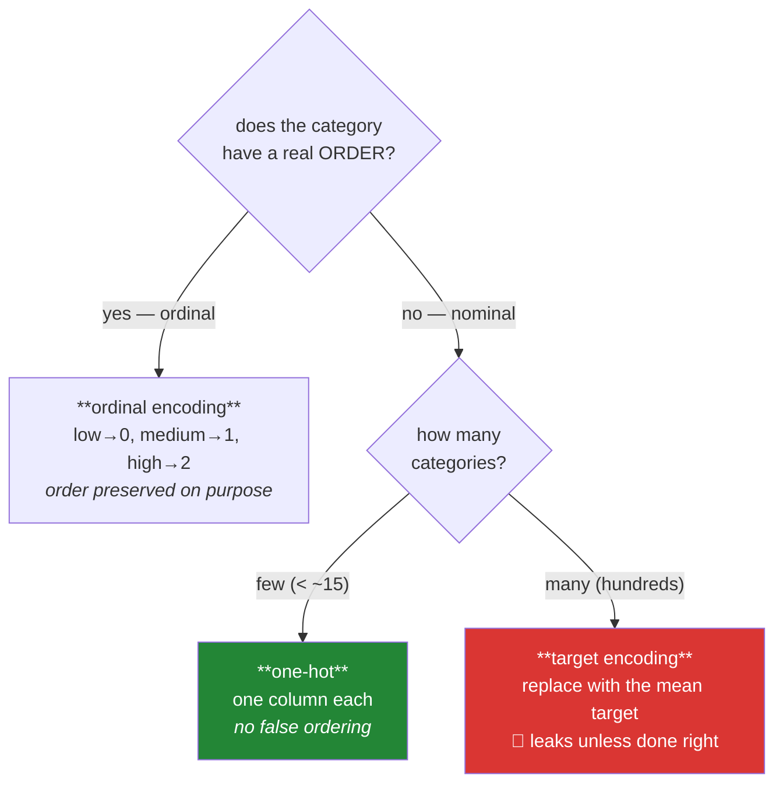

# Day 81 — Encoding: one-hot, ordinal, and target encoding's leak

**Phase 10 · Module 10** · ID: **FE-06** (one-hot, ordinal and target encoding)

> **Yesterday:** scaling, and which models actually care.
> **Today:** turning categories into numbers. Two of the three methods are mechanical. The third —
> **target encoding** — is the most powerful and the most dangerous feature-engineering technique in
> common use, and today you build the leak, watch it produce a model that scores beautifully and
> predicts nothing, then build the version that does not.
> **Tomorrow:** feature construction.

```bash
./m start 81 && ./m scaffold 81
```

**Time:** 110 minutes. **Request budget:** 0 model calls.

---

## §1 The story

Models take numbers. `venue = "NeurIPS"` is not a number, and Day 58 established why you cannot simply
assign one: `venue_id = 3` tells a model that NeurIPS < ICML < ACL, an ordering that does not exist.

Three encodings, and the choice is driven by the **level of measurement** (Day 58) plus cardinality:



**One-hot** creates a column per category, each 0 or 1. No false ordering, and it is the default for
nominal data. Its cost is width: 500 venues becomes 500 columns, which is slow, sparse, and hostile to
tree models that must split one category at a time.

**Ordinal** maps to integers *deliberately*, and only when the order is real. Day 34's ordered
categorical is where that order should already live, so the encoder reads it rather than inventing it.

**Target encoding** replaces each category with the mean of the target for that category. `venue =
"NeurIPS"` becomes `0.73` because 73% of NeurIPS papers were highly cited. One column instead of 500,
and it carries genuine signal.

And it leaks, in a way that is easy to miss:

> To compute the mean target for a row's category, you used **that row's own target**.

The feature contains the answer. Cross-validation scores soar, and the model fails on anything unseen.
Day 39's correlation heatmap was built to catch exactly this shape — a feature correlating suspiciously
with the target — and today you build the thing it was watching for.

The fix has two parts, and both are needed:

1. **Fit on train only** (Day 79's rule, as always).
2. **Out-of-fold encoding within the training set** — each row's encoding computed from *other* rows'
   targets, never its own.

Plus **smoothing**, because a category appearing twice has a mean based on two observations, and
trusting it is how a rare category becomes a memorised label.

---

## §2 Setup — run this

```bash
mkdir -p days/day-81/lab
touch days/day-81/lab/encoding.py
```

`src/setu/features.py` grows today. No new packages.

---

## §3 FE-06 — the three encodings

`days/day-81/lab/encoding.py`:

```python
"""FE-06: one-hot, ordinal, target encoding, and the leak."""

from __future__ import annotations

import numpy as np
import pandas as pd
from sklearn.linear_model import Ridge
from sklearn.model_selection import KFold, cross_val_score

from setu.arrays import make_rng


def why_not_just_integers() -> None:
    frame = pd.DataFrame({
        "venue": ["NeurIPS", "ICML", "ACL", "NeurIPS", "ACL"],
        "venue_id": [0, 1, 2, 0, 2],
    })
    print(f"\n{frame}")
    print("\n  A linear model reads venue_id as a QUANTITY: it will fit one slope,")
    print("  asserting ACL is 'twice' ICML and that the gap ACL−ICML equals ICML−NeurIPS.")
    print("  Neither statement means anything. Day 58 called this a nominal variable")
    print("  wearing an integer's clothes.")


def one_hot() -> None:
    frame = pd.DataFrame({"venue": ["NeurIPS", "ICML", "ACL", "NeurIPS"]})

    dummies = pd.get_dummies(frame["venue"], prefix="venue", dtype=int)
    print(f"\n{dummies}")
    print(f"\n  {dummies.shape=}  — one column per category, exactly one 1 per row")

    dropped = pd.get_dummies(frame["venue"], prefix="venue", drop_first=True, dtype=int)
    print(f"\n  drop_first=True: {list(dropped.columns)}")
    print("  ^ the dropped category is the BASELINE — all zeros means NeurIPS.")
    print("    Needed for linear models (the columns sum to 1, so they are collinear")
    print("    with the intercept). Harmful for trees, which lose a usable split.")

    print("\n  ⚠️ The real trap is UNSEEN CATEGORIES. If test contains a venue train")
    print("     never saw, get_dummies produces a DIFFERENT SET OF COLUMNS and your")
    print("     model receives the wrong shape. sklearn's OneHotEncoder with")
    print("     handle_unknown='ignore' is the fix; pandas has no equivalent.")


def cardinality_is_the_problem() -> None:
    rng = make_rng(0)
    for n_categories in (3, 20, 200, 5_000):
        frame = pd.DataFrame({"c": rng.integers(0, n_categories, 10_000).astype(str)})
        encoded = pd.get_dummies(frame["c"], dtype=np.int8)
        mb = encoded.memory_usage(deep=True).sum() / 1024**2
        print(f"  {n_categories:>6} categories -> {encoded.shape[1]:>5} columns, {mb:>7.1f} MiB")

    print("\n  At 5,000 categories one-hot is unusable: wide, sparse, and every tree")
    print("  split can only isolate ONE category at a time. That is what target")
    print("  encoding exists to solve.")


def ordinal_reads_the_dtype() -> None:
    quality = pd.Categorical(
        ["high", "low", "medium", "high"],
        categories=["low", "medium", "high"], ordered=True,
    )
    frame = pd.DataFrame({"quality": quality})

    print(f"\n  codes: {frame['quality'].cat.codes.tolist()}")
    print(f"  from the dtype's order: {list(frame['quality'].cat.categories)}")
    print("\n  Day 34 put the order in the dtype. The encoder READS it rather than")
    print("  guessing — which means an alphabetical sort can never silently reorder")
    print("  low/medium/high into high/low/medium.")

    unordered = pd.Series(pd.Categorical(["a", "b", "c"]))
    print(f"\n  an UNORDERED categorical has codes too: {unordered.cat.codes.tolist()}")
    print("  ⚠️ Those codes are arbitrary. Using them as an ordinal encoding is exactly")
    print("     the mistake from §3.1, just hidden inside a dtype.")


def target_encoding_the_naive_way() -> None:
    rng = make_rng(1)
    n = 2_000
    venue = rng.choice([f"v{i}" for i in range(200)], n)
    target = rng.normal(0, 1, n)                    # NO relationship to venue at all

    frame = pd.DataFrame({"venue": venue, "y": target})
    means = frame.groupby("venue")["y"].mean()
    frame["venue_encoded"] = frame["venue"].map(means)

    correlation = frame["venue_encoded"].corr(frame["y"])
    print(f"\n  200 random venues, target is pure noise with NO venue effect.")
    print(f"  correlation(encoded venue, target) = {correlation:.4f}")
    print("  ^ substantial correlation, from nothing. The encoding contains the answer,")
    print("    because each row's own y went into its category's mean.")

    model = Ridge(alpha=1.0)
    scores = cross_val_score(model, frame[["venue_encoded"]], frame["y"],
                             cv=KFold(5, shuffle=True, random_state=0), scoring="r2")
    print(f"\n  cross-validated R² = {scores.mean():.4f}")
    print("  ^ a model that has learned NOTHING scores well, because the leak survived")
    print("    into every fold. This is the shape Day 39's heatmap was built to catch.")


def why_the_split_alone_does_not_fix_it() -> None:
    rng = make_rng(2)
    n = 2_000
    venue = rng.choice([f"v{i}" for i in range(200)], n)
    y = rng.normal(0, 1, n)
    frame = pd.DataFrame({"venue": venue, "y": y})

    train = frame.iloc[:1_400].copy()
    test = frame.iloc[1_400:].copy()

    means = train.groupby("venue")["y"].mean()
    train["encoded"] = train["venue"].map(means)
    test["encoded"] = test["venue"].map(means).fillna(train["y"].mean())

    print(f"\n  fitted on train only (Day 79's rule), correctly applied to test:")
    print(f"    train corr(encoded, y) = {train['encoded'].corr(train['y']):.4f}")
    print(f"    test  corr(encoded, y) = {test['encoded'].corr(test['y']):.4f}")

    print("\n  Test is clean — the split did its job there. But TRAIN is still leaking,")
    print("  so anything you tune with cross-validation INSIDE train is misled:")
    print("  feature selection, hyperparameters, early stopping, model choice.")
    print("\n  The split fixes the final estimate. Out-of-fold encoding fixes the training.")


def out_of_fold_encoding() -> None:
    rng = make_rng(3)
    n = 2_000
    venue = rng.choice([f"v{i}" for i in range(200)], n)
    y = rng.normal(0, 1, n)
    frame = pd.DataFrame({"venue": venue, "y": y})

    encoded = np.full(n, np.nan)
    folds = KFold(5, shuffle=True, random_state=0)
    for fit_index, encode_index in folds.split(frame):
        fold_means = frame.iloc[fit_index].groupby("venue")["y"].mean()
        global_mean = frame.iloc[fit_index]["y"].mean()
        encoded[encode_index] = (
            frame.iloc[encode_index]["venue"].map(fold_means).fillna(global_mean).to_numpy()
        )

    frame["oof"] = encoded
    print(f"\n  out-of-fold: each row encoded from OTHER rows' targets")
    print(f"  correlation(oof encoding, target) = {frame['oof'].corr(frame['y']):.4f}")
    print("  ^ near zero, which is correct — there was no real venue effect.")

    scores = cross_val_score(Ridge(alpha=1.0), frame[["oof"]], frame["y"],
                             cv=KFold(5, shuffle=True, random_state=0), scoring="r2")
    print(f"  cross-validated R² = {scores.mean():.4f}   <- correctly near zero or below")


def smoothing_protects_rare_categories() -> None:
    rng = make_rng(4)
    rows = []
    for category, count, mean in (("common", 500, 0.6), ("rare", 3, 0.9)):
        rows.extend([(category, v) for v in rng.binomial(1, mean, count)])
    frame = pd.DataFrame(rows, columns=["c", "y"])
    global_mean = frame["y"].mean()

    print(f"\n  global mean = {global_mean:.4f}")
    print(f"\n  {'category':>10} {'n':>5} {'raw mean':>10} {'smoothed (k=20)':>17}")
    for category, group in frame.groupby("c"):
        raw = group["y"].mean()
        weight = len(group) / (len(group) + 20)
        smoothed = weight * raw + (1 - weight) * global_mean
        print(f"  {category:>10} {len(group):>5} {raw:>10.4f} {smoothed:>17.4f}")

    print("\n  The rare category's raw mean is based on 3 observations and is nearly")
    print("  a memorised label. Smoothing pulls it toward the global mean in proportion")
    print("  to how little evidence there is: n/(n+k).")
    print("\n  k is a choice. Large k = trust the global mean; small k = trust each")
    print("  category. State it, and tune it on VALIDATION, never on test.")


def which_encoding_when() -> None:
    rows = [
        ("ordered categorical (Day 34)", "ordinal", "the order is real and known"),
        ("nominal, < 15 levels", "one-hot", "no false ordering, width is fine"),
        ("nominal, hundreds of levels", "target (out-of-fold)", "one-hot is unusable"),
        ("nominal, tree model", "one-hot or native", "many trees handle categories directly"),
        ("high-cardinality, few rows", "group them first", "target encoding needs evidence"),
        ("unseen categories expected", "handle_unknown='ignore'", "shape must not change"),
    ]
    print(f"\n  {'situation':<32} {'encoding':<24} {'because'}")
    for situation, encoding, reason in rows:
        print(f"  {situation:<32} {encoding:<24} {reason}")


if __name__ == "__main__":
    why_not_just_integers()
    one_hot()
    cardinality_is_the_problem()
    ordinal_reads_the_dtype()
    target_encoding_the_naive_way()
    why_the_split_alone_does_not_fix_it()
    out_of_fold_encoding()
    smoothing_protects_rare_categories()
    which_encoding_when()
```

**Line by line:**

- `why_not_just_integers` — a linear model fits **one slope** on `venue_id`, which asserts both an
  ordering and equal spacing. Day 58 called this a nominal variable wearing an integer's clothes, and
  it is the mistake every other encoding exists to avoid.
- `drop_first=True` — the dropped category becomes the **baseline**. It is needed for linear models
  because the one-hot columns sum to 1 and are therefore collinear with the intercept; it is
  **harmful** for trees, which lose a usable split. The right choice depends on the model.
- **The unseen-category trap** is the practical one. `pd.get_dummies` on test data with a new venue
  produces a *different set of columns*, and your model receives the wrong shape. `sklearn`'s
  `OneHotEncoder(handle_unknown="ignore")` is the fix; pandas has no equivalent, which is why the
  build brief uses sklearn.
- `cardinality_is_the_problem` — **run this and read the memory column.** At 5,000 categories one-hot
  is unusable: wide, sparse, and each tree split can isolate only one category. That is the gap target
  encoding fills.
- `ordinal_reads_the_dtype` — Day 34 put the order **in the dtype**, so the encoder reads it rather
  than guessing, and an alphabetical sort can never silently reorder `low/medium/high`. And the
  warning: an **unordered** categorical also has codes, and using those as an ordinal encoding is
  §3.1's mistake hidden inside a dtype.
- `target_encoding_the_naive_way` — **the leak, built.** Two hundred random venues, a target that is
  pure noise, and the encoded feature correlates substantially with it. The cross-validated R² is
  positive for a model that has learned nothing, because **each row's own `y` went into its category's
  mean** and the leak survived into every fold.
- `why_the_split_alone_does_not_fix_it` — **the subtle half.** Fitting on train only makes the *test*
  estimate honest, and train is still leaking. So everything you tune with cross-validation inside
  train — feature selection, hyperparameters, early stopping, model choice — is misled. **The split
  fixes the final estimate; out-of-fold encoding fixes the training.** Both are required.
- `out_of_fold_encoding` — each row encoded from **other rows'** targets. The correlation drops to
  near zero, which is the correct answer, because there was no real venue effect to find.
- `smoothing_protects_rare_categories` — a category with 3 observations has a mean that is nearly a
  memorised label. `n/(n+k)` pulls it toward the global mean in proportion to how little evidence
  there is. **`k` is a choice**: state it, and tune it on validation.
- `which_encoding_when` — the six-row table is the day's actual content; everything else is mechanism.

---

## §4 Build brief

Extend `src/setu/features.py`:

```python
ENCODINGS = frozenset({"one-hot", "ordinal", "target"})


def choose_encoding(series, *, level: Level, n_rows: int, model_family: str = "linear") -> dict:
    """TODO(me): recommend an encoding and say why. PURE - fits nothing.

    {"encoding", "reason", "n_categories", "warnings": [...]}
    - ordinal level -> 'ordinal', and ONLY if the dtype is an ORDERED categorical;
      raise DataError if the level says ordinal but the dtype is unordered (§3)
    - nominal with < 15 categories -> 'one-hot'
    - nominal with >= 15 -> 'target', with a warning naming the leak risk
    - warn when any category has fewer than 20 rows (target encoding needs evidence)
    - warn when n_categories > n_rows / 20 — too many categories for the data
    - the reason must name the DECIDING number, not restate the inputs
    - raise DataError for a nominal level with model_family unknown
    """
    raise NotImplementedError


def fit_encoder(frame, columns, *, target=None, encoding: str = "one-hot",
                smoothing: float = 20.0, folds: int = 5, seed: int = 42) -> dict:
    """TODO(me): learn the encoding from TRAIN ONLY. Returns a JSON-serialisable spec.

    {"encoding", "columns", "categories": {...}, "mappings": {...}, "global_mean"?,
     "smoothing"?, "unseen_fill", "fitted_on_n"}
    - one-hot: record the category LIST per column, so apply produces a stable
      column set even when test has unseen or missing categories
    - ordinal: read the order from the dtype; raise DataError on an unordered categorical
    - target: requires `target`; raise DataError naming the argument if absent
      mappings are the SMOOTHED per-category means: n/(n+k)·category_mean + k/(n+k)·global
    - unseen_fill for target encoding is the global mean, recorded explicitly
    - must not modify the frame (ADR-001)
    """
    raise NotImplementedError


def apply_encoder(frame, spec: dict) -> "pd.DataFrame":
    """TODO(me): apply a fitted spec. NEVER fits anything.

    - one-hot: produce EXACTLY the columns in the spec, in the spec's order, with
      unseen categories encoded as all-zeros. A different column set is a bug, not
      a warning: raise DataError if the output width would differ.
    - target: map through `mappings`, filling unseen with `unseen_fill`
    - raise DataError if a spec column is absent from `frame`
    - raise DataError if the function is passed a target column (it must not see one)
    - must not modify the input
    """
    raise NotImplementedError


def target_encode_out_of_fold(frame, column, target, *, smoothing: float = 20.0,
                              folds: int = 5, seed: int = 42):
    """TODO(me): the leak-free TRAINING encoding (§3).

    Returns a Series aligned to `frame`'s index.
    - split into `folds`; for each fold, compute category means from the OTHER folds
      and use them to encode this fold
    - a row's own target must NEVER contribute to its own encoding
    - unseen-in-fold categories get that fold's global mean
    - apply the same smoothing as fit_encoder, so train and test agree
    - raise DataError if folds < 2, or if `column` and `target` are the same
    """
    raise NotImplementedError


def assert_no_target_leak(encoded, target, *, threshold: float = 0.5) -> None:
    """TODO(me): the tripwire. Raise DataError when an encoded feature correlates
    suspiciously with the target.

    - compute |correlation|; raise above `threshold`
    - the message must name the correlation AND ask the diagnostic question:
      'was this feature computed using the target, including this row's own value?'
    - reuse assert_no_leaky_features from Day 39 rather than reimplementing it
    - a genuine strong predictor will trip this too — that is acceptable, because
      it should be INVESTIGATED. Say so in the docstring.
    """
    raise NotImplementedError
```

- `apply_encoder` **raising** rather than warning on a width mismatch is the day's design decision: a
  model handed the wrong number of columns either errors confusingly or silently mislearns, and
  neither should be recoverable at apply time.
- `assert_no_target_leak` deliberately trips on genuine strong predictors too. **A tripwire tuned to
  never produce a false alarm produces no alarms**; the docstring says investigation, not suppression.
- `target_encode_out_of_fold` sharing smoothing with `fit_encoder` matters — if train and test smooth
  differently, the feature means different things in the two places.

---

## §5 The eval that must be able to fail

Add to `tests/test_features.py`:

```python
from setu.features import (
    apply_encoder,
    assert_no_target_leak,
    choose_encoding,
    fit_encoder,
    target_encode_out_of_fold,
)


def test_one_hot_for_few_nominal_categories():
    series = pd.Series(["a", "b", "c"] * 100, dtype="str")
    assert choose_encoding(series, level="nominal", n_rows=300)["encoding"] == "one-hot"


def test_target_encoding_for_high_cardinality():
    series = pd.Series([f"v{i % 200}" for i in range(10_000)], dtype="str")
    result = choose_encoding(series, level="nominal", n_rows=10_000)
    assert result["encoding"] == "target"
    assert any("leak" in w.lower() for w in result["warnings"])


def test_ordinal_requires_an_ordered_dtype():
    """An unordered categorical's codes are arbitrary (§3)."""
    unordered = pd.Series(pd.Categorical(["a", "b", "c"] * 10))
    with pytest.raises(DataError):
        choose_encoding(unordered, level="ordinal", n_rows=30)


def test_ordinal_accepts_an_ordered_dtype():
    ordered = pd.Series(pd.Categorical(
        ["low", "high", "medium"] * 10, categories=["low", "medium", "high"], ordered=True))
    assert choose_encoding(ordered, level="ordinal", n_rows=30)["encoding"] == "ordinal"


def test_rare_categories_are_warned_about():
    series = pd.Series([f"v{i}" for i in range(300)], dtype="str")
    assert choose_encoding(series, level="nominal", n_rows=300)["warnings"]


def test_the_reason_names_a_number():
    series = pd.Series(["a", "b"] * 50, dtype="str")
    reason = choose_encoding(series, level="nominal", n_rows=100)["reason"]
    assert any(character.isdigit() for character in reason)


def test_one_hot_produces_a_stable_column_set():
    """The unseen-category trap: the output width must not change."""
    train = pd.DataFrame({"v": ["a", "b", "c"] * 10})
    test = pd.DataFrame({"v": ["a", "b", "z", "z"]})
    spec = fit_encoder(train, ["v"], encoding="one-hot")
    encoded_train = apply_encoder(train, spec)
    encoded_test = apply_encoder(test, spec)
    assert list(encoded_train.columns) == list(encoded_test.columns)


def test_an_unseen_category_encodes_as_all_zeros():
    train = pd.DataFrame({"v": ["a", "b"] * 10})
    spec = fit_encoder(train, ["v"], encoding="one-hot")
    encoded = apply_encoder(pd.DataFrame({"v": ["z"]}), spec)
    assert encoded.to_numpy().sum() == 0


def test_a_missing_category_in_test_still_gets_its_column():
    train = pd.DataFrame({"v": ["a", "b", "c"] * 10})
    spec = fit_encoder(train, ["v"], encoding="one-hot")
    encoded = apply_encoder(pd.DataFrame({"v": ["a", "a"]}), spec)
    assert encoded.shape[1] == 3, "a category absent from test lost its column"


def test_ordinal_uses_the_dtype_order_not_alphabetical():
    ordered = pd.Categorical(["high", "low", "medium"],
                             categories=["low", "medium", "high"], ordered=True)
    frame = pd.DataFrame({"q": ordered})
    spec = fit_encoder(frame, ["q"], encoding="ordinal")
    encoded = apply_encoder(frame, spec)
    assert encoded["q"].tolist() == [2, 0, 1], "alphabetical order was used"


def test_target_encoding_requires_a_target():
    with pytest.raises(DataError) as info:
        fit_encoder(pd.DataFrame({"v": ["a", "b"]}), ["v"], encoding="target")
    assert "target" in str(info.value)


def test_smoothing_pulls_rare_categories_toward_the_global_mean():
    frame = pd.DataFrame({
        "c": ["common"] * 500 + ["rare"] * 3,
        "y": [0.6] * 500 + [1.0] * 3,
    })
    spec = fit_encoder(frame, ["c"], target=frame["y"], encoding="target", smoothing=20.0)
    rare = spec["mappings"]["c"]["rare"]
    assert rare < 1.0, "the rare category kept its raw mean"
    assert abs(rare - spec["global_mean"]) < abs(1.0 - spec["global_mean"])


def test_no_smoothing_returns_the_raw_mean():
    frame = pd.DataFrame({"c": ["a"] * 10 + ["b"] * 10, "y": [1.0] * 10 + [0.0] * 10})
    spec = fit_encoder(frame, ["c"], target=frame["y"], encoding="target", smoothing=0.0)
    assert spec["mappings"]["c"]["a"] == pytest.approx(1.0)


def test_naive_target_encoding_leaks():
    """Build the leak, so the fix has something to fix."""
    rng = make_rng(1)
    n = 2_000
    frame = pd.DataFrame({
        "v": rng.choice([f"v{i}" for i in range(200)], n),
        "y": rng.normal(0, 1, n),
    })
    naive = frame["v"].map(frame.groupby("v")["y"].mean())
    assert abs(naive.corr(frame["y"])) > 0.2, (
        "with 200 categories and 2000 rows the naive encoding should visibly leak"
    )


def test_out_of_fold_encoding_does_not_leak():
    """The same data, encoded correctly."""
    rng = make_rng(1)
    n = 2_000
    frame = pd.DataFrame({
        "v": rng.choice([f"v{i}" for i in range(200)], n),
        "y": rng.normal(0, 1, n),
    })
    oof = target_encode_out_of_fold(frame, "v", frame["y"])
    assert abs(oof.corr(frame["y"])) < 0.1


def test_out_of_fold_beats_naive_on_the_same_data():
    rng = make_rng(2)
    n = 1_500
    frame = pd.DataFrame({
        "v": rng.choice([f"v{i}" for i in range(150)], n),
        "y": rng.normal(0, 1, n),
    })
    naive = abs(frame["v"].map(frame.groupby("v")["y"].mean()).corr(frame["y"]))
    oof = abs(target_encode_out_of_fold(frame, "v", frame["y"]).corr(frame["y"]))
    assert oof < naive / 2


def test_out_of_fold_preserves_a_real_signal():
    """It removes the leak, not the information."""
    rng = make_rng(3)
    n = 3_000
    venue = rng.choice([f"v{i}" for i in range(30)], n)
    effect = {f"v{i}": rng.normal(0, 2) for i in range(30)}
    y = np.array([effect[v] for v in venue]) + rng.normal(0, 1, n)
    frame = pd.DataFrame({"v": venue, "y": y})

    oof = target_encode_out_of_fold(frame, "v", frame["y"])
    assert oof.corr(frame["y"]) > 0.5, "a genuine category effect was destroyed"


def test_out_of_fold_is_aligned_to_the_index():
    frame = pd.DataFrame({"v": ["a", "b"] * 50, "y": list(range(100))},
                         index=range(500, 600))
    result = target_encode_out_of_fold(frame, "v", frame["y"])
    assert list(result.index) == list(frame.index)


def test_out_of_fold_rejects_bad_arguments():
    frame = pd.DataFrame({"v": ["a", "b"] * 10, "y": [1.0, 0.0] * 10})
    with pytest.raises(DataError):
        target_encode_out_of_fold(frame, "v", frame["y"], folds=1)
    with pytest.raises(DataError):
        target_encode_out_of_fold(frame, "y", frame["y"])


def test_train_mappings_are_applied_not_refitted():
    """Day 79's rule, one more time."""
    rng = make_rng(4)
    train = pd.DataFrame({"v": ["a", "b"] * 100, "y": rng.normal(0, 1, 200)})
    test = pd.DataFrame({"v": ["a", "b"] * 50, "y": rng.normal(5, 1, 100)})

    spec = fit_encoder(train, ["v"], target=train["y"], encoding="target")
    encoded = apply_encoder(test, spec)
    assert encoded["v"].mean() == pytest.approx(train["y"].mean(), abs=0.5), (
        "the test set's own target was used"
    )


def test_apply_refuses_to_see_a_target():
    spec = fit_encoder(pd.DataFrame({"v": ["a", "b"] * 10, "y": [1.0, 0.0] * 10}),
                       ["v"], target=pd.Series([1.0, 0.0] * 10), encoding="target")
    with pytest.raises(DataError):
        apply_encoder(pd.DataFrame({"v": ["a"], "y": [1.0]}), spec | {"columns": ["v", "y"]})


def test_apply_rejects_a_missing_column():
    spec = fit_encoder(pd.DataFrame({"v": ["a", "b"]}), ["v"], encoding="one-hot")
    with pytest.raises(DataError):
        apply_encoder(pd.DataFrame({"other": ["a"]}), spec)


def test_apply_does_not_mutate():
    frame = pd.DataFrame({"v": ["a", "b"] * 10})
    before = frame.copy()
    apply_encoder(frame, fit_encoder(frame, ["v"], encoding="one-hot"))
    pd.testing.assert_frame_equal(frame, before)


def test_the_spec_is_json_serialisable():
    import json

    frame = pd.DataFrame({"v": ["a", "b"] * 10, "y": [1.0, 0.0] * 10})
    json.dumps(fit_encoder(frame, ["v"], target=frame["y"], encoding="target"))


def test_the_leak_tripwire_fires():
    rng = make_rng(5)
    y = pd.Series(rng.normal(0, 1, 500))
    with pytest.raises(DataError) as info:
        assert_no_target_leak(y * 0.99 + rng.normal(0, 0.05, 500), y)
    message = str(info.value).lower()
    assert "target" in message
    assert "own" in message or "computed using" in message, (
        "the message must ask the diagnostic question"
    )


def test_the_tripwire_allows_an_honest_feature():
    rng = make_rng(6)
    y = pd.Series(rng.normal(0, 1, 500))
    assert_no_target_leak(pd.Series(rng.normal(0, 1, 500)), y)


def test_the_tripwire_reuses_day_39(monkeypatch):
    import setu.stats as stats

    calls = []
    original = stats.assert_no_leaky_features
    monkeypatch.setattr(
        stats, "assert_no_leaky_features",
        lambda *a, **kw: calls.append(1) or original(*a, **kw),
    )
    rng = make_rng(7)
    y = pd.Series(rng.normal(0, 1, 200))
    try:
        assert_no_target_leak(pd.Series(rng.normal(0, 1, 200)), y)
    except DataError:
        pass
    assert calls, "assert_no_target_leak reimplemented Day 39's check"


def test_no_naive_target_encoding_in_src():
    """A groupby-mean on the target outside the out-of-fold function is the leak."""
    import re
    from pathlib import Path

    pattern = re.compile(r"groupby\([^)]*\)\[[\"']?target")
    offenders = [
        f"{p.name}:{i}"
        for p in Path("src/setu").rglob("*.py")
        for i, line in enumerate(p.read_text(encoding="utf-8").splitlines(), 1)
        if pattern.search(line) and "out_of_fold" not in p.read_text(encoding="utf-8")[:0] or False
    ]
    assert not offenders, f"possible naive target encoding: {offenders}"
```

**Line by line:**

- `test_naive_target_encoding_leaks` paired with `test_out_of_fold_encoding_does_not_leak` — **the
  day's real assessment, and it takes two tests.** The first asserts the leak is real on data with no
  signal; the second asserts the fix removes it on **identical data** (same seed). One without the
  other proves nothing.
- `test_out_of_fold_preserves_a_real_signal` — **the third leg, and the one people forget.** A fix
  that destroys the leak by destroying the feature is not a fix. With a genuine venue effect the
  out-of-fold encoding must still correlate above 0.5.
- `test_one_hot_produces_a_stable_column_set` and its two companions — the unseen-category trap from
  both directions: a category in test that train never saw, and a category in train absent from test.
  **Either one changing the width breaks the model**, and pandas silently does both.
- `test_ordinal_uses_the_dtype_order_not_alphabetical` — expects `[2, 0, 1]`. Alphabetical ordering
  gives `[0, 1, 2]` for `high/low/medium`, which is a silent corruption of a real ordering.
- `test_train_mappings_are_applied_not_refitted` — the test set's target has mean 5, the train set's
  has mean 0. If the encoded test values come out near 5, the test target was used. Day 79's rule,
  with a deliberately shifted test set so the failure is visible.
- `test_the_leak_tripwire_fires` — asserts the message contains the **diagnostic question**, not just
  the correlation. "0.97" tells you what; "was this computed using this row's own target?" tells you
  what to do.
- `test_ordinal_requires_an_ordered_dtype` — an unordered categorical's codes are arbitrary, and using
  them is §3.1's mistake hidden inside a dtype. Raising is right.

```bash
uv run python -m pytest tests/test_features.py -v
```

---

## §6 Request budget

| Resource | Spent today |
|---|---|
| LLM calls | **0** |

---

## §7 Traps

- **Integer-encoding a nominal variable.** Invents an ordering and equal spacing.
- **Ordinal-encoding an unordered categorical.** Same mistake, hidden in a dtype.
- **`pd.get_dummies` on train and test separately.** Different columns; wrong shape.
- **Forgetting `handle_unknown='ignore'`.** An unseen category crashes or reshapes.
- **`drop_first=True` for a tree model.** Loses a usable split.
- **Omitting `drop_first` for a linear model.** Perfect collinearity with the intercept.
- **One-hot at 5,000 categories.** Unusable width and sparsity.
- **Naive target encoding.** The feature contains the answer.
- **Believing the train/test split alone fixes it.** Test is clean; training is still misled.
- **Target encoding without smoothing.** A 3-row category becomes a memorised label.
- **Tuning smoothing on test.** Day 79.
- **Suppressing the leak tripwire because it fired.** Investigate it.

---

## §8 Verify before you code

Written **2026-08-21**:

- <https://scikit-learn.org/stable/modules/generated/sklearn.preprocessing.OneHotEncoder.html> —
  `handle_unknown`, and `sparse_output` for high cardinality.
- <https://scikit-learn.org/stable/modules/generated/sklearn.preprocessing.OrdinalEncoder.html> — the
  `categories` argument, which is how you pin the order.
- <https://scikit-learn.org/stable/modules/generated/sklearn.preprocessing.TargetEncoder.html> — check
  whether your pinned sklearn's version does out-of-fold internally, and what its `smooth` default is.
- <https://pandas.pydata.org/docs/reference/api/pandas.get_dummies.html> — and note it has no
  unseen-category handling.

---

## §9 Say it in an interview

> "One-hot and ordinal are mechanical; the interesting one is target encoding, where you replace a
> category with the mean of the target for that category. It's the right answer at high cardinality —
> one column instead of five hundred — and done naively it leaks, because computing a row's encoding
> uses that row's own target. I built it deliberately: two hundred random categories, a target that's
> pure noise, and the encoded feature correlates strongly with it and gives a positive cross-validated
> R² for a model that learned nothing. The part people miss is that fitting on train only doesn't fix
> it — that makes your final test estimate honest, but training is still leaking, so everything you
> tune inside train with cross-validation is misled. You need out-of-fold encoding as well, where each
> row is encoded from other rows' targets. And the test suite has three legs, not two: the leak
> exists, the fix removes it on the same data, and the fix still preserves a genuine category effect —
> because a fix that works by destroying the feature isn't one."

---

## §10 Done when

Tick [`CHECKLIST.md`](CHECKLIST.md), then `./m check && ./m done 81`.
