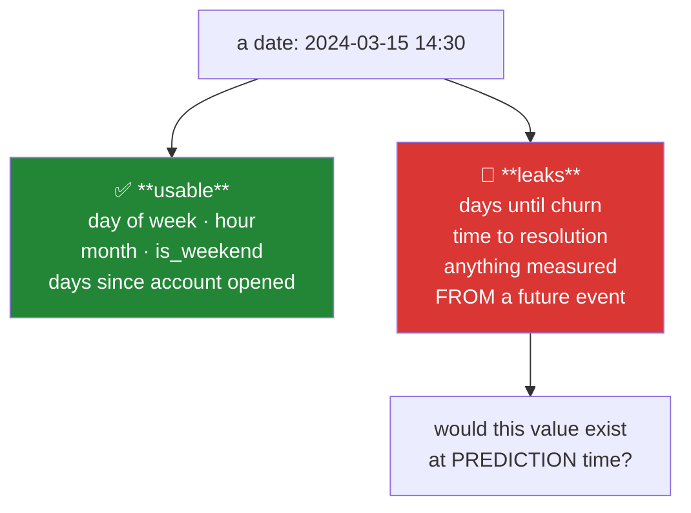

# Day 82 — Feature construction

**Phase 10 · Module 10** · ID: **FE-07** (interactions, polynomials, binning, date features, transforms)

> **Yesterday:** encoding, and target encoding's leak.
> **Today:** making features that did not exist. This is where domain knowledge enters a model — and
> where the two most common accidents happen: **constructing a feature from information that would not
> exist at prediction time**, and **generating so many features that one correlates with the target by
> chance**.
> **Tomorrow:** selection, the pipeline, and Phase 10 closes.

```bash
./m start 82 && ./m scaffold 82
```

**Time:** 110 minutes. **Request budget:** 0 model calls.

---

## §1 The story

A model can only use relationships it can express. A linear model cannot represent "the effect of
page count depends on the venue" — unless you hand it `pages × venue` as a column. That is feature
construction: **encoding a relationship you believe exists into a form the model can read.**

Four families:

- **Interactions** — products of features. `pages × is_neurips` lets the effect of one vary with the
  other.
- **Polynomials** — powers. `pages²` lets a linear model bend.
- **Binning** — continuous into categories. `age` into decades, which buys robustness to outliers and
  costs resolution.
- **Dates and transforms** — the richest source, and the one with the sharpest trap.



**The prediction-time test** is the single most useful question in feature engineering:

> **At the moment I need a prediction, would this feature's value be known?**

`days_since_signup` — yes, computable from today's date. `days_until_churn` — no, it requires knowing
when they churned, which is the thing you are predicting. Both are date arithmetic. One is a feature
and one is the answer.

Day 39's heatmap catches this *after* the fact, by noticing a suspicious correlation. The
prediction-time test catches it *before*, which is cheaper and does not depend on the leak being large
enough to notice.

**The second accident is volume.** Ten features with all pairwise interactions is 55 columns; with
degree-3 polynomials it is hundreds. Day 74 established what happens when you test many things: some
correlate with the target by chance. Feature generation is multiple comparisons wearing a different
hat, and the defence is the same — generate deliberately, and validate honestly.

**Cyclical features** deserve a mention because the naive encoding is wrong in a specific way. Hour
23 and hour 0 are adjacent in time and maximally distant as integers. Encoding as `sin`/`cos` of the
angle fixes it, and it is one of the few places where a small trick genuinely matters.

---

## §2 Setup — run this

```bash
mkdir -p days/day-82/lab
touch days/day-82/lab/construction.py
```

`src/setu/features.py` grows today. No new packages.

---

## §3 FE-07 — construction

`days/day-82/lab/construction.py`:

```python
"""FE-07: interactions, polynomials, binning, dates, and the prediction-time test."""

from __future__ import annotations

import numpy as np
import pandas as pd
from sklearn.linear_model import LinearRegression
from sklearn.metrics import r2_score

from setu.arrays import make_rng


def an_interaction_is_a_relationship_the_model_cannot_otherwise_see() -> None:
    rng = make_rng(0)
    n = 2_000
    pages = rng.uniform(4, 20, n)
    is_neurips = rng.integers(0, 2, n)
    # the effect of pages DEPENDS on venue — that is an interaction
    y = 10 * pages * is_neurips + 2 * pages + rng.normal(0, 20, n)

    plain = pd.DataFrame({"pages": pages, "is_neurips": is_neurips})
    with_interaction = plain.assign(pages_x_neurips=pages * is_neurips)

    for name, frame in (("without interaction", plain), ("with interaction", with_interaction)):
        model = LinearRegression().fit(frame, y)
        print(f"  {name:<22} R² = {r2_score(y, model.predict(frame)):.4f}")

    print("\n  The relationship was always in the data. A linear model simply cannot")
    print("  EXPRESS it without the product column — that is what construction is for.")
    print("\n  ⚠️ Trees find interactions themselves by splitting twice. Constructing them")
    print("     manually helps linear models and mostly wastes columns on trees.")


def polynomials_let_a_line_bend() -> None:
    rng = make_rng(1)
    x = rng.uniform(-3, 3, 1_000)
    y = 2 * x**2 - x + rng.normal(0, 1, 1_000)

    print(f"\n  {'features':<24} {'R²':>8}")
    for name, frame in (
        ("x", pd.DataFrame({"x": x})),
        ("x, x²", pd.DataFrame({"x": x, "x2": x**2})),
        ("x, x², x³", pd.DataFrame({"x": x, "x2": x**2, "x3": x**3})),
    ):
        model = LinearRegression().fit(frame, y)
        print(f"  {name:<24} {r2_score(y, model.predict(frame)):>8.4f}")

    print("\n  x³ adds nothing — the true relationship was quadratic. Adding degrees")
    print("  until the fit stops improving is how you overfit; Day 92 covers the")
    print("  bias-variance trade properly.")
    print("\n  ⚠️ Polynomial features REQUIRE scaling (Day 80): x³ on a variable ranging")
    print("     to 1000 produces values near 1e9, which wrecks a regularised model.")


def the_combinatorial_explosion() -> None:
    print(f"\n  {'base features':>14} {'pairwise':>10} {'degree 2':>10} {'degree 3':>10}")
    for k in (5, 10, 20, 50):
        pairwise = k * (k - 1) // 2
        from math import comb

        degree2 = comb(k + 2, 2) - 1
        degree3 = comb(k + 3, 3) - 1
        print(f"  {k:>14} {pairwise:>10,} {degree2:>10,} {degree3:>10,}")

    print("\n  50 features at degree 3 is over 23,000 columns. Day 74's arithmetic applies:")
    print("  generate enough features and one WILL correlate with the target by chance.")
    print("  Feature generation is multiple comparisons wearing a different hat.")


def binning_trades_resolution_for_robustness() -> None:
    rng = make_rng(2)
    age = np.append(rng.uniform(18, 70, 500), [200.0, -5.0])          # two impossible values

    equal_width = pd.cut(age, bins=5)
    equal_count = pd.qcut(age, q=5, duplicates="drop")

    print(f"\n  equal-WIDTH bins (cut):")
    print(f"    {equal_width.value_counts().sort_index().to_dict()}")
    print(f"\n  equal-COUNT bins (qcut):")
    print(f"    {equal_count.value_counts().sort_index().to_dict()}")

    print("\n  The two impossible values dragged cut's boundaries so that four bins are")
    print("  nearly empty. qcut is robust to that — it splits by rank, not by value.")
    print("\n  ⚠️ Bin EDGES are fitted parameters. Computing them on the full dataset is")
    print("     leakage; they belong in the fit/apply split like everything else (Day 79).")
    print("  ⚠️ And a test value outside the fitted range becomes NaN. Decide now whether")
    print("     that means 'clip to the edge bin' or 'this row is unscorable'.")


def dates_are_the_richest_source() -> None:
    frame = pd.DataFrame({
        "signup": pd.to_datetime(["2023-01-15 09:30", "2023-06-20 22:15", "2023-11-03 14:00"]),
        "churned_at": pd.to_datetime(["2024-03-01", "2024-01-10", pd.NaT]),
    })
    as_of = pd.Timestamp("2024-06-01")

    frame["days_since_signup"] = (as_of - frame["signup"]).dt.days
    frame["signup_dow"] = frame["signup"].dt.dayofweek
    frame["signup_hour"] = frame["signup"].dt.hour
    frame["signup_is_weekend"] = frame["signup"].dt.dayofweek >= 5
    frame["signup_month"] = frame["signup"].dt.month

    frame["days_until_churn"] = (frame["churned_at"] - frame["signup"]).dt.days   # 🚨

    print(f"\n{frame[['days_since_signup', 'signup_dow', 'signup_hour', 'days_until_churn']]}")

    print("\n  Every column is date arithmetic. Apply the PREDICTION-TIME TEST:")
    print("    days_since_signup  — known today? YES. A feature.")
    print("    signup_dow/hour    — known today? YES. Features.")
    print("    days_until_churn   — needs the churn date, which is what you PREDICT. 🚨")
    print("\n  And note the NaT: the customer who has not churned has no value, so the")
    print("  column is missing exactly for the class you care about. That pattern —")
    print("  missingness correlated with the target — is itself the tell (Day 76).")


def cyclical_features() -> None:
    hours = np.array([22, 23, 0, 1])

    print(f"\n  hours: {hours.tolist()}")
    print(f"  naive integer distance 23→0 : {abs(23 - 0)}")
    print(f"  naive integer distance 22→23: {abs(22 - 23)}")
    print("  ^ 23 and 0 are one hour apart and 23 units apart. Any distance-based")
    print("    model (Day 103's KNN, k-means) reads midnight as maximally far from 11pm.")

    angle = 2 * np.pi * hours / 24
    sin_h, cos_h = np.sin(angle), np.cos(angle)

    def distance(i, j):
        return np.hypot(sin_h[i] - sin_h[j], cos_h[i] - cos_h[j])

    print(f"\n  sin/cos distance 23→0 : {distance(1, 2):.4f}")
    print(f"  sin/cos distance 22→23: {distance(0, 1):.4f}")
    print("  ^ equal, correctly. Two columns instead of one, and the circle closes.")
    print("\n  Same applies to day-of-week, month, and compass bearing.")


def ratios_and_domain_features() -> None:
    frame = pd.DataFrame({
        "citations": [100.0, 2_000.0, 50.0],
        "pages": [8.0, 40.0, 4.0],
        "years_since": [2.0, 10.0, 1.0],
    })
    frame["citations_per_page"] = frame["citations"] / frame["pages"]
    frame["citations_per_year"] = frame["citations"] / frame["years_since"]

    print(f"\n{frame.round(2)}")
    print("\n  Ratios often carry more signal than either component — 'per page' and")
    print("  'per year' normalise away size and age. This is where domain knowledge earns")
    print("  its keep, and no automated method will invent them for you.")

    print("\n  ⚠️ Two hazards. Division by zero (use a guarded denominator, and RECORD it),")
    print("     and — Day 39 — if the denominator is derived from the target, the ratio")
    print("     leaks. `citations_per_page` is fine as a FEATURE and a leak as a")
    print("     predictor OF citations.")


def the_prediction_time_test() -> None:
    candidates = [
        ("days_since_signup", True, "computable from today's date"),
        ("account_age_days", True, "same"),
        ("days_until_churn", False, "requires the churn date — the target"),
        ("total_lifetime_spend", False, "includes spend AFTER the prediction point"),
        ("spend_in_first_30_days", True, "bounded window, entirely in the past"),
        ("support_tickets_to_date", True, "as of the prediction moment"),
        ("support_tickets_total", False, "'total' usually means including the future"),
        ("final_grade", False, "the outcome, renamed"),
    ]
    print(f"\n  {'candidate feature':<28} {'usable':>8}  why")
    for name, usable, reason in candidates:
        print(f"  {name:<28} {'YES' if usable else 'NO':>8}  {reason}")

    print("\n  Note the pairs: to_date vs total, first-30-days vs lifetime. The DIFFERENCE")
    print("  is whether a window closes before the prediction moment. That is the whole test.")
    print("\n  ⚠️ In a dataset you did not build, you cannot always tell from the name.")
    print("     Ask. 'total' and 'final' and 'until' are the words to interrogate.")


if __name__ == "__main__":
    an_interaction_is_a_relationship_the_model_cannot_otherwise_see()
    polynomials_let_a_line_bend()
    the_combinatorial_explosion()
    binning_trades_resolution_for_robustness()
    dates_are_the_richest_source()
    cyclical_features()
    ratios_and_domain_features()
    the_prediction_time_test()
```

**Line by line:**

- `an_interaction_is_a_relationship_the_model_cannot_otherwise_see` — **run it and compare the two
  R² values.** The relationship was in the data all along; the linear model simply could not
  *express* it. That is what construction is for. And the note matters: **trees find interactions
  themselves** by splitting twice, so manual interactions help linear models and mostly waste columns
  on trees.
- `polynomials_let_a_line_bend` — `x³` adds nothing because the truth was quadratic. Adding degrees
  until the fit stops improving is how you overfit, and **polynomial features require scaling** (Day
  80): `x³` on a variable ranging to 1000 gives values near 1e9, which destroys a regularised model.
- `the_combinatorial_explosion` — **read the degree-3 column.** Fifty features becomes over 23,000.
  Day 74's arithmetic applies directly: generate enough features and one will correlate with the
  target by chance. **Feature generation is multiple comparisons wearing a different hat.**
- `binning_trades_resolution_for_robustness` — two impossible values drag `cut`'s boundaries so four
  bins are nearly empty; `qcut` splits by **rank** and is unaffected. Two warnings follow: **bin edges
  are fitted parameters** and belong in the fit/apply split, and a test value outside the fitted range
  becomes `NaN` — decide now whether that means clip or unscorable.
- `dates_are_the_richest_source` — every column is date arithmetic, and the prediction-time test
  separates them. Note the second tell: the customer who has not churned has `NaT`, so **the column is
  missing exactly for the class you care about**. Missingness correlated with the target is itself the
  signature (Day 76).
- `cyclical_features` — 23 and 0 are one hour apart and 23 units apart. Any distance-based model reads
  midnight as maximally far from 11pm. `sin`/`cos` of the angle makes the two distances **equal**,
  correctly, at the cost of one extra column.
- `ratios_and_domain_features` — ratios normalise away size and age, and **no automated method will
  invent them for you.** Two hazards: guarded division, and the Day 39 point that
  `citations_per_page` is a fine feature and a leak if you are predicting citations.
- `the_prediction_time_test` — **read the pairs.** `to_date` versus `total`, `first_30_days` versus
  `lifetime`. The difference is whether a window closes before the prediction moment. And the honest
  caveat: in a dataset you did not build you often cannot tell from the name, so **`total`, `final`
  and `until` are the words to interrogate.**

---

## §4 Build brief

Extend `src/setu/features.py`:

```python
SUSPECT_TOKENS = ("total", "final", "until", "lifetime", "ever", "eventual", "outcome")


def prediction_time_check(columns, *, target: str, as_of_description: str) -> dict:
    """TODO(me): flag features that may not exist at prediction time. PURE.

    {"as_of", "target", "flagged": [{"column", "token", "question"}], "clean": [...]}
    - flag any column containing a SUSPECT_TOKENS substring, or the target's name
    - `question` is the human prompt: 'would <column> be known at <as_of_description>?'
    - this is a PROMPT, not a verdict — the docstring must say a human decides
    - raise DataError if `target` is not in `columns`
    - deliberately over-flags: a false alarm costs one question, a miss costs a model
    """
    raise NotImplementedError


def add_interactions(frame, pairs, *, sep: str = "_x_"):
    """TODO(me): add pairwise products for the NAMED pairs only. Returns a new frame.

    - `pairs` is an explicit list of (a, b) — there is deliberately NO 'all pairs'
      option, because §3 showed where that leads
    - raise DataError if a column is missing, non-numeric, or a pair is duplicated
    - raise DataError if a and b are the same column (that is a polynomial, not an
      interaction — point at add_polynomials)
    - must not mutate the caller's frame (ADR-001)
    """
    raise NotImplementedError


def add_polynomials(frame, columns, *, degree: int = 2, max_new_columns: int = 50):
    """TODO(me): add powers 2..degree for the named columns.

    - raise DataError if degree < 2 or > 4
    - raise DataError if the resulting new-column count exceeds max_new_columns,
      naming the count — §3's explosion, refused rather than produced
    - WARN when any input column's absolute maximum exceeds 100, because degree-3
      values will then be large enough to destabilise a regularised model (Day 80)
    """
    raise NotImplementedError


def fit_binner(frame, columns, *, bins: int = 5, strategy: str = "quantile") -> dict:
    """TODO(me): learn bin EDGES from train only.

    {"columns", "edges": {column: [...]}, "strategy", "bins", "out_of_range"}
    - strategy 'quantile' (qcut, rank-based) or 'uniform' (cut, value-based)
    - 'quantile' is the DEFAULT: §3 showed uniform edges collapsing under outliers
    - out_of_range is 'clip' or 'nan'; record the choice in the spec
    - raise DataError if a column has fewer distinct values than `bins`
    - edges must be JSON-serialisable floats, not pandas Interval objects
    """
    raise NotImplementedError


def apply_binner(frame, spec: dict):
    """TODO(me): apply fitted edges. Never fits.

    - values outside the fitted range follow spec['out_of_range']
    - the result must carry the SAME bin labels for every call, so a test-set bin
      means the same thing as a train-set bin
    - report how many values fell outside the fitted range (return it via .attrs)
    - raise DataError on a missing column
    """
    raise NotImplementedError


def add_date_features(frame, column, *, as_of=None, parts=("dayofweek", "hour", "month"),
                      cyclical=("hour", "dayofweek", "month")):
    """TODO(me): expand a datetime column into usable features.

    - `as_of` (a timestamp) enables 'days_since'; when None, that feature is NOT
      produced — computing it from `now()` makes the feature non-reproducible
    - every part in `cyclical` gets sin/cos columns instead of a raw integer (§3)
    - raise DataError if `column` is not a datetime dtype (do NOT silently parse)
    - raise DataError on an unknown part
    - NEVER produce a feature from a second date column — that is where 'days_until'
      comes from, and this function must not be able to express it
    """
    raise NotImplementedError


def safe_ratio(frame, numerator: str, denominator: str, *, name=None, fill: float | None = None):
    """TODO(me): a guarded division.

    - zero (or near-zero) denominators produce `fill`, or NaN when fill is None
    - record how many rows were guarded, in .attrs
    - raise DataError if either column is non-numeric
    - raise DataError if the denominator has ANY negative values and the numerator
      does not — a sign flip mid-column makes the ratio uninterpretable
    """
    raise NotImplementedError
```

- `add_interactions` having **no "all pairs" option** is the day's design decision. §3 measured the
  explosion; a convenience that makes it one keyword away would be used.
- `add_date_features` **refusing to take a second date column** is the structural version of the
  prediction-time test: `days_until_churn` cannot be expressed by a function that only sees one date.
- `prediction_time_check` deliberately over-flagging is right: **a false alarm costs one question, a
  miss costs a model.**

---

## §5 The eval that must be able to fail

Add to `tests/test_features.py`:

```python
from setu.features import (
    add_date_features,
    add_interactions,
    add_polynomials,
    apply_binner,
    fit_binner,
    prediction_time_check,
    safe_ratio,
)


def test_suspicious_column_names_are_flagged():
    result = prediction_time_check(
        ["days_since_signup", "days_until_churn", "total_spend", "churned"],
        target="churned", as_of_description="signup time",
    )
    flagged = {entry["column"] for entry in result["flagged"]}
    assert "days_until_churn" in flagged
    assert "total_spend" in flagged
    assert "days_since_signup" not in flagged


def test_the_flag_is_a_question_not_a_verdict():
    result = prediction_time_check(["total_spend", "y"], target="y",
                                   as_of_description="account creation")
    entry = next(e for e in result["flagged"] if e["column"] == "total_spend")
    assert "?" in entry["question"]
    assert "account creation" in entry["question"]


def test_the_target_itself_is_flagged():
    result = prediction_time_check(["y", "x"], target="y", as_of_description="now")
    assert any(entry["column"] == "y" for entry in result["flagged"])


def test_prediction_check_requires_the_target_to_be_present():
    with pytest.raises(DataError):
        prediction_time_check(["a", "b"], target="y", as_of_description="now")


def test_an_interaction_lets_a_linear_model_fit_what_it_could_not():
    from sklearn.linear_model import LinearRegression
    from sklearn.metrics import r2_score

    rng = make_rng(0)
    n = 2_000
    frame = pd.DataFrame({"pages": rng.uniform(4, 20, n), "flag": rng.integers(0, 2, n)})
    y = 10 * frame["pages"] * frame["flag"] + 2 * frame["pages"] + rng.normal(0, 20, n)

    plain = r2_score(y, LinearRegression().fit(frame, y).predict(frame))
    widened = add_interactions(frame, [("pages", "flag")])
    improved = r2_score(y, LinearRegression().fit(widened, y).predict(widened))
    assert improved > plain + 0.2


def test_there_is_no_all_pairs_option():
    """Section 3 measured where that leads."""
    import inspect

    signature = inspect.signature(add_interactions)
    assert "all_pairs" not in signature.parameters
    assert "pairs" in signature.parameters


def test_a_self_pair_is_refused():
    frame = pd.DataFrame({"a": [1.0, 2.0]})
    with pytest.raises(DataError) as info:
        add_interactions(frame, [("a", "a")])
    assert "polynomial" in str(info.value).lower()


def test_interactions_reject_non_numeric_and_missing_columns():
    frame = pd.DataFrame({"a": [1.0, 2.0], "s": ["x", "y"]})
    with pytest.raises(DataError):
        add_interactions(frame, [("a", "s")])
    with pytest.raises(DataError):
        add_interactions(frame, [("a", "nope")])


def test_interactions_do_not_mutate():
    frame = pd.DataFrame({"a": [1.0, 2.0], "b": [3.0, 4.0]})
    before = frame.copy()
    add_interactions(frame, [("a", "b")])
    pd.testing.assert_frame_equal(frame, before)


def test_polynomials_refuse_an_explosion():
    """50 features at degree 3 is over 23,000 columns."""
    frame = pd.DataFrame({f"c{i}": [1.0, 2.0] for i in range(40)})
    with pytest.raises(DataError) as info:
        add_polynomials(frame, list(frame.columns), degree=3, max_new_columns=50)
    assert any(character.isdigit() for character in str(info.value))


def test_polynomials_warn_on_large_values():
    frame = pd.DataFrame({"big": [1.0, 500.0, 1_000.0]})
    result = add_polynomials(frame, ["big"], degree=3)
    assert result.attrs.get("warnings"), "degree-3 on values near 1000 went unwarned"


def test_polynomial_degree_is_bounded():
    frame = pd.DataFrame({"x": [1.0, 2.0]})
    for degree in (1, 5, 10):
        with pytest.raises(DataError):
            add_polynomials(frame, ["x"], degree=degree)


def test_quantile_binning_is_the_default():
    """Uniform edges collapse under outliers (§3)."""
    import inspect

    assert inspect.signature(fit_binner).parameters["strategy"].default == "quantile"


def test_quantile_bins_are_robust_to_impossible_values():
    rng = make_rng(1)
    values = np.append(rng.uniform(18, 70, 500), [200.0, -5.0])
    frame = pd.DataFrame({"age": values})

    quantile = apply_binner(frame, fit_binner(frame, ["age"], bins=5, strategy="quantile"))
    uniform = apply_binner(frame, fit_binner(frame, ["age"], bins=5, strategy="uniform"))

    quantile_counts = quantile["age"].value_counts()
    uniform_counts = uniform["age"].value_counts()
    assert quantile_counts.min() > uniform_counts.min() * 5, (
        "uniform bins should collapse; quantile bins should not"
    )


def test_bin_edges_come_from_train_only():
    """Edges are fitted parameters (Day 79)."""
    rng = make_rng(2)
    train = pd.DataFrame({"x": rng.uniform(0, 10, 500)})
    test = pd.DataFrame({"x": rng.uniform(50, 60, 200)})

    spec = fit_binner(train, ["x"], bins=4)
    binned = apply_binner(test, spec)
    assert binned["x"].nunique() <= 2, "the test set was re-binned on its own range"


def test_out_of_range_values_are_counted():
    train = pd.DataFrame({"x": [1.0, 2.0, 3.0, 4.0, 5.0, 6.0]})
    spec = fit_binner(train, ["x"], bins=3, strategy="uniform")
    binned = apply_binner(pd.DataFrame({"x": [100.0, 200.0]}), spec)
    assert binned.attrs.get("out_of_range_count", 0) == 2


def test_bin_labels_are_stable_across_calls():
    train = pd.DataFrame({"x": list(range(100))})
    spec = fit_binner(train, ["x"], bins=4)
    first = apply_binner(pd.DataFrame({"x": [10.0]}), spec)["x"].iloc[0]
    second = apply_binner(pd.DataFrame({"x": [10.0, 90.0]}), spec)["x"].iloc[0]
    assert first == second, "a bin label changed depending on what else was in the frame"


def test_the_binner_spec_is_json_serialisable():
    import json

    json.dumps(fit_binner(pd.DataFrame({"x": list(range(50))}), ["x"]))


def test_binner_rejects_too_few_distinct_values():
    with pytest.raises(DataError):
        fit_binner(pd.DataFrame({"x": [1.0, 1.0, 2.0]}), ["x"], bins=5)


def test_date_features_are_produced():
    frame = pd.DataFrame({"d": pd.to_datetime(["2023-01-15 09:30", "2023-06-20 22:15"])})
    result = add_date_features(frame, "d", parts=("dayofweek", "hour", "month"), cyclical=())
    for suffix in ("dayofweek", "hour", "month"):
        assert f"d_{suffix}" in result.columns


def test_cyclical_hours_make_midnight_adjacent_to_eleven_pm():
    """23 and 0 are one hour apart, not 23 units apart."""
    frame = pd.DataFrame({"d": pd.to_datetime(
        ["2023-01-01 22:00", "2023-01-01 23:00", "2023-01-02 00:00"])})
    result = add_date_features(frame, "d", parts=("hour",), cyclical=("hour",))
    points = result[["d_hour_sin", "d_hour_cos"]].to_numpy()
    across_midnight = np.linalg.norm(points[1] - points[2])
    within_evening = np.linalg.norm(points[0] - points[1])
    assert across_midnight == pytest.approx(within_evening, rel=1e-6)


def test_days_since_requires_an_explicit_as_of():
    """Computing it from now() makes the feature non-reproducible."""
    frame = pd.DataFrame({"d": pd.to_datetime(["2023-01-15"])})
    without = add_date_features(frame, "d")
    assert not any("days_since" in column for column in without.columns)

    with_as_of = add_date_features(frame, "d", as_of=pd.Timestamp("2024-01-15"))
    assert any("days_since" in column for column in with_as_of.columns)


def test_date_features_cannot_reference_a_second_date():
    """'days_until_churn' must be inexpressible, not merely discouraged."""
    import inspect

    parameters = inspect.signature(add_date_features).parameters
    date_like = [
        name for name in parameters
        if name not in {"frame", "column", "as_of", "parts", "cyclical"}
    ]
    assert not date_like, f"a second date argument would allow days_until: {date_like}"


def test_date_features_reject_a_non_datetime_column():
    with pytest.raises(DataError):
        add_date_features(pd.DataFrame({"d": ["2023-01-15"]}), "d")


def test_safe_ratio_guards_zero_denominators():
    frame = pd.DataFrame({"a": [10.0, 20.0, 30.0], "b": [2.0, 0.0, 5.0]})
    result = safe_ratio(frame, "a", "b", fill=0.0)
    assert np.isfinite(result).all()
    assert result.attrs.get("guarded_count") == 1


def test_safe_ratio_defaults_to_nan_not_a_number():
    """Silently substituting 0 for an undefined ratio is a decision, not a default."""
    frame = pd.DataFrame({"a": [10.0], "b": [0.0]})
    assert np.isnan(safe_ratio(frame, "a", "b").iloc[0])


def test_safe_ratio_rejects_a_sign_flipping_denominator():
    frame = pd.DataFrame({"a": [10.0, 20.0], "b": [5.0, -5.0]})
    with pytest.raises(DataError):
        safe_ratio(frame, "a", "b")


def test_constructed_features_pass_the_leak_tripwire():
    """Day 39 and Day 81's check, applied to what you just built."""
    from setu.features import assert_no_target_leak

    rng = make_rng(3)
    n = 500
    frame = pd.DataFrame({"pages": rng.uniform(4, 20, n), "flag": rng.integers(0, 2, n)})
    y = pd.Series(rng.normal(0, 1, n))
    widened = add_interactions(frame, [("pages", "flag")])
    for column in widened.columns:
        assert_no_target_leak(widened[column], y)
```

**Line by line:**

- `test_date_features_cannot_reference_a_second_date` — **the day's real assessment**, and it is an
  API-shape test in the tradition of Day 33's `causal_rolling` and Day 50's `dry_run`. It inspects the
  signature and asserts there is **no way to pass a second date column**, which makes `days_until_churn`
  *inexpressible* rather than merely discouraged. A guard you cannot bypass beats a warning you can.
- `test_cyclical_hours_make_midnight_adjacent_to_eleven_pm` — computes both distances in `sin`/`cos`
  space and asserts they are **equal**. That is the entire justification for two columns instead of
  one, verified rather than described.
- `test_days_since_requires_an_explicit_as_of` — two assertions in opposite directions. Without
  `as_of` the feature must **not** appear, because computing it from `now()` makes the feature
  non-reproducible: re-run the pipeline next week and every value changes.
- `test_bin_edges_come_from_train_only` — the test set's range is entirely above the train set's, so
  correct behaviour collapses it into at most two bins. An implementation that re-bins on the test
  range would spread it across four and look fine.
- `test_bin_labels_are_stable_across_calls` — the same value binned in two different frames must get
  the same label. `pd.qcut` recomputed per call does **not** guarantee this, and a bin that means
  different things in train and test is a silent corruption.
- `test_there_is_no_all_pairs_option` — asserts the absence of a convenience. §3 measured the
  explosion; making it one keyword away guarantees someone reaches for it.
- `test_polynomials_refuse_an_explosion` — refuses rather than produces, and names the count so the
  caller knows how far over they are.
- `test_safe_ratio_defaults_to_nan_not_a_number` — silently substituting `0` for an undefined ratio is
  a **decision**, and defaults should not make decisions.

```bash
uv run python -m pytest tests/test_features.py -v
```

---

## §6 Request budget

| Resource | Spent today |
|---|---|
| LLM calls | **0** |

---

## §7 Traps

- **A feature that would not exist at prediction time.** The most expensive mistake here.
- **`total`, `final`, `until`, `lifetime` in a column name.** Interrogate every one.
- **Missingness that correlates with the target.** Often the tell for a leaked column.
- **All pairwise interactions "to see what sticks".** Day 74, wearing a different hat.
- **Polynomials without scaling.** `x³` at 1000 is 1e9 (Day 80).
- **Adding degrees until the fit stops improving.** That is overfitting, not selection.
- **Equal-width bins on data with outliers.** Bins collapse; use quantiles.
- **Fitting bin edges on the full dataset.** Edges are parameters (Day 79).
- **Unstable bin labels across calls.** A bin must mean one thing.
- **Integer hour or day-of-week in a distance-based model.** The circle does not close.
- **`days_since` computed from `now()`.** The feature changes every run.
- **Unguarded division.** And a guarded one that silently fills zero.
- **Manual interactions for a tree model.** Trees find them by splitting twice.

---

## §8 Verify before you code

Written **2026-08-21**:

- <https://scikit-learn.org/stable/modules/generated/sklearn.preprocessing.PolynomialFeatures.html> —
  `interaction_only`, and how quickly the column count grows.
- <https://scikit-learn.org/stable/modules/generated/sklearn.preprocessing.KBinsDiscretizer.html> —
  the `strategy` options and how it handles out-of-range values.
- <https://pandas.pydata.org/docs/reference/api/pandas.qcut.html> — `duplicates='drop'`, needed when
  quantiles tie.
- <https://pandas.pydata.org/docs/user_guide/timeseries.html#time-date-components> — the full `.dt`
  surface (Day 33).

---

## §9 Say it in an interview

> "Feature construction is where domain knowledge enters the model, and the single most useful question
> is the prediction-time test: at the moment I need a prediction, would this value be known?
> `days_since_signup` passes, `days_until_churn` doesn't — both are date arithmetic, but one requires
> the churn date, which is the thing you're predicting. So my date helper physically cannot take a
> second date column; there's a test that inspects the signature and asserts that, because making the
> leak inexpressible beats warning about it. The other accident is volume — fifty features at degree
> three is over twenty-three thousand columns, and that's Day 74's multiple-comparisons problem wearing
> a different hat, so my interaction function takes an explicit list of pairs and deliberately has no
> 'all pairs' option. And the small thing that genuinely matters is cyclical encoding: hour 23 and hour
> 0 are one hour apart and twenty-three units apart, so any distance-based model reads midnight as
> maximally far from 11pm. Sin and cos of the angle fixes it, and there's a test asserting the two
> distances come out equal."

---

## §10 Done when

Tick [`CHECKLIST.md`](CHECKLIST.md), then `./m check && ./m done 82`.
