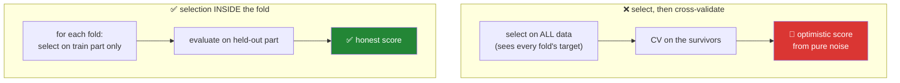

# Day 83 — Feature selection and the `ColumnTransformer` pipeline

**Phase 10 gate** · IDs: **FE-08** (feature selection), **FE-09** (`ColumnTransformer` and `Pipeline`) · Artifact: **a leak-proof pipeline**

> **Yesterday:** feature construction, and the prediction-time test.
> **Today:** two things that look separate and are the same idea. **Selection done on the full dataset
> is a leak** — and it is the one that survives cross-validation most convincingly. Then the fix:
> a `Pipeline` that makes every fit/apply rule from Days 76–82 **structural rather than remembered.**
> **Phase 10 closes.**
> **Tomorrow:** Phase 11, EDA.

```bash
./m start 83 && ./m scaffold 83
```

**Time:** 2 hours (gate day). **Request budget:** 0 model calls.

---

## §1 The story

Seven days of Phase 10 have each ended the same way: **fit on train, apply to test.** Imputation
values (Day 76), outlier bounds (Day 77), the split itself (Day 79), scaler parameters (Day 80),
encoder mappings (Day 81), bin edges (Day 82).

That is seven separate things to remember, in the right order, every time. **Remembering is not a
control.** Today it becomes structure.

**First, selection — the leak that hides best.**

Suppose you have 10,000 random features and 100 rows, and the target is pure noise. Pick the 10
features most correlated with the target, then cross-validate a model on those 10. It will score
well. Not because the features are real — because **the selection saw the whole dataset, including
every validation fold.**



This is the most convincing leak in the phase, because the cross-validation *looks* correct — folds,
held-out data, the whole apparatus. The leak happened before it started.

**Second, the pipeline.** `Pipeline` and `ColumnTransformer` do one thing that matters: they make
`fit` and `transform` **separate operations that cannot be confused**. When a pipeline is inside
`cross_val_score`, every step refits on each training fold automatically. There is nothing to
remember, which is the point.

The gate for Phase 10 is a pipeline that takes raw data and produces model-ready features with
**every step fitted only on training data**, verified by a test that would catch it if not.

---

## §2 Setup — run this

```bash
mkdir -p days/day-83/lab
touch days/day-83/lab/pipeline.py
touch scripts/build_features.py
```

`src/setu/features.py` grows today. No new packages — sklearn came in on Day 79.

---

## §3 FE-08 — selection

`days/day-83/lab/pipeline.py`:

```python
"""FE-08 / FE-09: selection done wrong, then a pipeline where it cannot be."""

from __future__ import annotations

import numpy as np
import pandas as pd
from sklearn.compose import ColumnTransformer
from sklearn.ensemble import RandomForestClassifier
from sklearn.feature_selection import SelectKBest, VarianceThreshold, f_classif
from sklearn.impute import SimpleImputer
from sklearn.linear_model import LogisticRegression
from sklearn.model_selection import StratifiedKFold, cross_val_score
from sklearn.pipeline import Pipeline
from sklearn.preprocessing import OneHotEncoder, RobustScaler

from setu.arrays import make_rng


def the_selection_leak() -> None:
    rng = make_rng(0)
    n, p = 100, 10_000
    x = pd.DataFrame(rng.normal(0, 1, (n, p)), columns=[f"f{i}" for i in range(p)])
    y = rng.integers(0, 2, n)                       # PURE NOISE. No feature relates to it.

    correlations = np.abs(np.array([np.corrcoef(x[c], y)[0, 1] for c in x.columns]))
    best = x.columns[np.argsort(correlations)[-10:]]

    folds = StratifiedKFold(5, shuffle=True, random_state=0)
    leaked = cross_val_score(LogisticRegression(max_iter=1_000), x[best], y,
                             cv=folds, scoring="accuracy").mean()

    print(f"\n  {n} rows, {p:,} random features, target is a coin flip.")
    print(f"  selected the 10 most correlated features on the FULL dataset")
    print(f"  cross-validated accuracy = {leaked:.4f}   <- should be 0.50")
    print(f"  best single correlation  = {correlations.max():.4f}")

    print("\n  The cross-validation LOOKS correct — folds, held-out data, all of it.")
    print("  The leak happened before it started: selection saw every fold's target.")
    print("  With 10,000 noise features, some WILL correlate by chance (Day 74).")


def selection_inside_the_fold() -> None:
    rng = make_rng(0)
    n, p = 100, 10_000
    x = pd.DataFrame(rng.normal(0, 1, (n, p)), columns=[f"f{i}" for i in range(p)])
    y = rng.integers(0, 2, n)

    pipeline = Pipeline([
        ("select", SelectKBest(f_classif, k=10)),
        ("model", LogisticRegression(max_iter=1_000)),
    ])
    honest = cross_val_score(pipeline, x, y,
                             cv=StratifiedKFold(5, shuffle=True, random_state=0),
                             scoring="accuracy").mean()

    print(f"\n  identical data, selection INSIDE the pipeline")
    print(f"  cross-validated accuracy = {honest:.4f}   <- correctly near chance")
    print("\n  Nothing changed but WHERE the selection happened. Inside the pipeline it")
    print("  refits on each training fold and never sees the held-out targets.")
    print("\n  This is the whole argument for pipelines, in two numbers.")


def selection_methods() -> None:
    rng = make_rng(1)
    n = 1_000
    frame = pd.DataFrame({
        "signal_a": rng.normal(0, 1, n),
        "signal_b": rng.normal(0, 1, n),
        "constant": np.ones(n),
        "near_constant": np.where(rng.random(n) < 0.999, 1.0, 2.0),
        "noise": rng.normal(0, 1, n),
    })
    frame["duplicate_a"] = frame["signal_a"] + rng.normal(0, 0.001, n)
    y = (frame["signal_a"] + frame["signal_b"] > 0).astype(int)

    print(f"\n  starting columns: {list(frame.columns)}")

    variance = VarianceThreshold(threshold=0.01).fit(frame)
    kept = frame.columns[variance.get_support()]
    print(f"\n  after VarianceThreshold: {list(kept)}")
    print("    ^ removes constants and near-constants. Cheap, unsupervised, and it")
    print("      NEVER LOOKS AT THE TARGET — so it is safe outside the fold.")

    correlated = frame[["signal_a", "duplicate_a"]].corr().iloc[0, 1]
    print(f"\n  corr(signal_a, duplicate_a) = {correlated:.4f}")
    print("    ^ a near-duplicate. Day 39's collinearity finding: keep ONE. Also")
    print("      target-blind, so also safe outside the fold.")

    scores = f_classif(frame[kept], y)[0]
    print(f"\n  univariate F-scores: "
          f"{dict(zip(kept, np.round(scores, 1), strict=True))}")
    print("    ^ this one USES THE TARGET, so it belongs inside the pipeline. Always.")


def univariate_selection_misses_interactions() -> None:
    rng = make_rng(2)
    n = 3_000
    a, b = rng.normal(0, 1, n), rng.normal(0, 1, n)
    y = ((a > 0) ^ (b > 0)).astype(int)              # XOR: neither alone predicts

    frame = pd.DataFrame({"a": a, "b": b, "noise": rng.normal(0, 1, n)})
    scores = f_classif(frame, y)[0]
    print(f"\n  XOR target. univariate F-scores: "
          f"{dict(zip(frame.columns, np.round(scores, 2), strict=True))}")
    print("    ^ a and b score no better than noise — individually they are useless.")

    together = cross_val_score(RandomForestClassifier(n_estimators=100, random_state=0),
                               frame[["a", "b"]], y, cv=5).mean()
    print(f"  but a Random Forest on a and b: accuracy = {together:.4f}")

    print("\n  ⚠️ Univariate selection would DISCARD both. It scores features one at a")
    print("     time and cannot see a relationship that only exists jointly.")
    print("     Use it as a cheap first pass, never as the final word.")


def model_based_selection() -> None:
    rng = make_rng(3)
    n = 2_000
    frame = pd.DataFrame(rng.normal(0, 1, (n, 20)), columns=[f"f{i}" for i in range(20)])
    y = (frame["f0"] * 2 + frame["f1"] - frame["f2"] + rng.normal(0, 0.5, n) > 0).astype(int)

    forest = RandomForestClassifier(n_estimators=200, random_state=0).fit(frame, y)
    importances = pd.Series(forest.feature_importances_, index=frame.columns)
    print(f"\n  top 5 by forest importance:")
    print(importances.nlargest(5).round(4).to_string())

    print("\n  The three real features surface. But importances are computed FROM the")
    print("  fitted model, so this is a supervised step and belongs inside the pipeline.")
    print("\n  ⚠️ Tree importances are biased toward high-cardinality and continuous")
    print("     features. Permutation importance (Day 100) is fairer, and slower.")


def the_column_transformer() -> None:
    frame = pd.DataFrame({
        "pages": [8.0, 40.0, np.nan, 12.0],
        "citations": [100.0, 2_000.0, 50.0, np.nan],
        "venue": ["NeurIPS", "ICML", "NeurIPS", "ACL"],
        "quality": pd.Categorical(["high", "low", "medium", "high"],
                                  categories=["low", "medium", "high"], ordered=True),
    })

    numeric = ["pages", "citations"]
    categorical = ["venue"]

    preprocessor = ColumnTransformer([
        ("num", Pipeline([
            ("impute", SimpleImputer(strategy="median")),
            ("scale", RobustScaler()),
        ]), numeric),
        ("cat", OneHotEncoder(handle_unknown="ignore", sparse_output=False), categorical),
    ], remainder="drop")

    result = preprocessor.fit_transform(frame)
    print(f"\n  input  : {frame.shape}")
    print(f"  output : {result.shape}")
    print(f"  columns: {list(preprocessor.get_feature_names_out())}")

    print("\n  Different columns, different treatment, one object. Note three things:")
    print("    - the median came from THIS data and is stored in the fitted imputer")
    print("    - handle_unknown='ignore' (Day 81) so test cannot change the width")
    print("    - remainder='drop' — 'quality' silently VANISHED. Always state remainder;")
    print("      the default is 'drop', and a silently dropped column is a real bug.")


def the_pipeline_makes_the_rule_structural() -> None:
    rng = make_rng(4)
    n = 600
    frame = pd.DataFrame({
        "x1": rng.normal(100, 15, n),
        "x2": rng.lognormal(0, 1, n),
        "cat": rng.choice(["a", "b", "c"], n),
    })
    frame.loc[frame.sample(60, random_state=0).index, "x1"] = np.nan
    y = (frame["x1"].fillna(100) / 100 + np.log1p(frame["x2"]) + rng.normal(0, 1, n) > 1.5).astype(int)

    pipeline = Pipeline([
        ("prep", ColumnTransformer([
            ("num", Pipeline([("impute", SimpleImputer(strategy="median")),
                              ("scale", RobustScaler())]), ["x1", "x2"]),
            ("cat", OneHotEncoder(handle_unknown="ignore", sparse_output=False), ["cat"]),
        ], remainder="drop")),
        ("select", SelectKBest(f_classif, k=4)),
        ("model", LogisticRegression(max_iter=1_000)),
    ])

    scores = cross_val_score(pipeline, frame, y, cv=StratifiedKFold(5, shuffle=True,
                                                                   random_state=0))
    print(f"\n  5-fold accuracy = {scores.mean():.4f} (±{scores.std():.4f})")

    print("\n  On EVERY fold, automatically and in order:")
    print("    the median is recomputed from that fold's training rows")
    print("    the scaler's centre and IQR are recomputed")
    print("    the encoder's category list is recomputed")
    print("    the selection is recomputed")
    print("  ...and the held-out rows only ever see .transform().")
    print("\n  Seven fit/apply rules from Days 76-82, and NOTHING to remember.")


def what_a_pipeline_does_not_fix() -> None:
    print("\n  a pipeline is not a leak-proof vest. It cannot save you from:")
    print("    - a feature that would not exist at prediction time (Day 82)")
    print("    - a grouped or time-ordered split done wrong (Day 79)")
    print("    - target encoding computed before the pipeline was built (Day 81)")
    print("    - resampling applied before the split (Day 78)")
    print("    - a target column left in the feature frame")
    print("\n  It enforces the fit/apply ORDER. Everything upstream is still yours.")


if __name__ == "__main__":
    the_selection_leak()
    selection_inside_the_fold()
    selection_methods()
    univariate_selection_misses_interactions()
    model_based_selection()
    the_column_transformer()
    the_pipeline_makes_the_rule_structural()
    what_a_pipeline_does_not_fix()
```

**Line by line:**

- `the_selection_leak` — **run it and read the accuracy.** One hundred rows, ten thousand pure-noise
  features, a coin-flip target, and cross-validated accuracy well above 0.50. The apparatus is
  correct; the leak happened before it started, because selection saw every fold's target. With ten
  thousand noise features some **will** correlate by chance — Day 74's arithmetic, again.
- `selection_inside_the_fold` — **identical data, identical seed**, selection moved inside the
  pipeline, and the accuracy falls to chance. Nothing changed but *where* the selection happened.
  **This is the whole argument for pipelines, in two numbers.**
- `selection_methods` — the crucial distinction is **whether a method looks at the target.**
  `VarianceThreshold` and correlation-based deduplication are target-blind and safe outside the fold;
  `f_classif` uses the target and must be inside. That single question decides where a step goes.
- `univariate_selection_misses_interactions` — **XOR.** Neither `a` nor `b` scores better than noise
  individually, and a forest on both reaches high accuracy. Univariate selection would discard both,
  because it scores features one at a time and cannot see a joint relationship. Use it as a cheap
  first pass, never as the final word.
- `model_based_selection` — importances surface the three real features, and they come *from a fitted
  model*, which makes this supervised and pipeline-internal. The caveat is real: **tree importances
  are biased toward high-cardinality and continuous features**, and Day 100's permutation importance
  is the fairer, slower alternative.
- `the_column_transformer` — different columns, different treatment, one object. **`remainder='drop'`
  made `quality` silently vanish**, and that is the default. Always state `remainder`; a silently
  dropped column is a real bug and an easy one to ship.
- `the_pipeline_makes_the_rule_structural` — **read the printed list.** On every fold the median, the
  scaler parameters, the category list and the selection are all recomputed from that fold's training
  rows, and the held-out rows only ever see `.transform()`. Seven rules from Days 76–82, and nothing
  to remember.
- `what_a_pipeline_does_not_fix` — the honest limit. A pipeline enforces the fit/apply **order**. It
  cannot save you from a prediction-time leak, a wrong split, encoding done before the pipeline was
  built, or a target column left in the features.

---

## §4 Build brief

Extend `src/setu/features.py`:

```python
TARGET_BLIND = frozenset({"variance", "correlation", "missingness"})
TARGET_AWARE = frozenset({"univariate", "model", "rfe"})


def classify_selection_step(method: str) -> dict:
    """TODO(me): does this method look at the target? PURE.

    {"method", "target_aware": bool, "placement": "outside fold" | "inside pipeline",
     "reason"}
    - raise DataError on an unknown method, listing both sets
    - this single question decides where a step is allowed to live (§3)
    """
    raise NotImplementedError


def drop_low_variance(frame, *, threshold: float = 0.0, exclude=()) -> dict:
    """TODO(me): remove constant and near-constant columns. TARGET-BLIND.

    {"kept": [...], "dropped": [{"column", "variance"}], "threshold"}
    - variance computed on the frame given; safe outside the fold because no target
      is involved — say so in the docstring
    - `exclude` columns are never dropped (an id you need downstream)
    - raise DataError if it would drop EVERY column
    """
    raise NotImplementedError


def drop_correlated(frame, *, threshold: float = 0.95, keep: str = "first") -> dict:
    """TODO(me): remove near-duplicate columns. TARGET-BLIND.

    {"kept": [...], "dropped": [{"column", "correlated_with", "r"}], "threshold"}
    - reuse Day 62's association / Day 25's correlation_matrix; do NOT reimplement
    - when a pair exceeds the threshold, drop one and RECORD which it was correlated
      with — 'dropped f7' is useless, 'dropped f7 (r=0.99 with f2)' is auditable
    - keep='first' or 'most_complete' (fewest missing values)
    - raise DataError on a non-numeric column
    """
    raise NotImplementedError


def build_preprocessor(*, numeric, categorical, ordinal=(), impute: str = "median",
                       scale: str = "robust", remainder: str = "drop"):
    """TODO(me): assemble a ColumnTransformer with the Phase 10 defaults.

    - numeric: impute -> scale, in that order
    - categorical: OneHotEncoder(handle_unknown='ignore') — Day 81's rule, not optional
    - ordinal: OrdinalEncoder with categories read from the dtype (Day 81)
    - `remainder` must be passed EXPLICITLY by the caller; raise DataError if it is
      not one of {'drop', 'passthrough'} — §3 showed a silent drop
    - raise DataError if any column name appears in more than one group, naming it
    - raise DataError if the three groups are all empty
    - return the ColumnTransformer, unfitted
    """
    raise NotImplementedError


def build_pipeline(preprocessor, model, *, select_k: int | None = None,
                   score_func=None):
    """TODO(me): preprocessor -> optional selection -> model.

    - when select_k is given, the selection step goes INSIDE the pipeline (§3)
    - raise DataError if `model` has no fit/predict — fail at build time, not fit time
    - the returned object must be a sklearn Pipeline, so cross_val_score refits
      every step on every fold
    """
    raise NotImplementedError


def assert_pipeline_is_leak_proof(pipeline) -> None:
    """TODO(me): the gate check. Raise DataError if a supervised step is outside.

    - walk the pipeline's steps (and any ColumnTransformer's inner steps)
    - every step must expose fit and transform/predict — a bare function or a
      pre-computed array smuggled in as a step is the failure mode
    - raise DataError if any step is already FITTED (has attributes ending in '_'
      before the pipeline has been fit), because that means it was fitted elsewhere,
      on data the pipeline cannot see
    - the message must name the offending step
    """
    raise NotImplementedError


def selection_leak_demo(*, n: int = 100, p: int = 2_000, seed: int = 42) -> dict:
    """TODO(me): §3's demonstration, as a function a test can assert on.

    {"n", "p", "leaked_score", "honest_score", "chance_level", "inflation"}
    - leaked: select top-k on the full data, then cross-validate
    - honest: the same selection inside a Pipeline
    - the target must be pure noise, so chance_level is 0.5
    - vectorised where possible; this is the phase's headline number
    """
    raise NotImplementedError
```

- `build_preprocessor` **requiring `remainder` explicitly** is the day's design decision. sklearn's
  default silently drops columns, and a column that vanishes without a message is a bug that survives
  to production.
- `assert_pipeline_is_leak_proof` checking for **already-fitted steps** catches the specific smuggling
  route: fitting a scaler outside, then dropping it into a pipeline. It looks correct and is not.
- `drop_correlated` recording **what each column was correlated with** turns a drop list into an audit
  trail (Principle 9).

---

## §5 The gate artifact — `scripts/build_features.py`

**This is the Phase 10 deliverable.** One command, raw data in, model-ready matrix out, every step
fitted only on training data.

```python
"""Build the Phase 10 feature pipeline. Run: uv run python scripts/build_features.py

Raw frame -> split -> fitted pipeline -> transformed train/val/test, saved.
"""

# TODO(me): assemble this from Days 76-82. Requirements:
#
#  1. Load raw data via setu.tabular.read_table (Day 27) — typed at read time
#  2. Run prediction_time_check (Day 82) and PRINT the flagged columns.
#     Exit non-zero if any flagged column is still in the feature list.
#  3. Split FIRST (Day 79), using choose_split to pick the strategy
#  4. Target-blind cleaning outside the pipeline: drop_low_variance, drop_correlated
#  5. Build the preprocessor with an EXPLICIT remainder
#  6. Build the pipeline with selection inside it
#  7. assert_pipeline_is_leak_proof BEFORE fitting
#  8. Fit on TRAIN only; transform train, validation and test
#  9. assert_no_overlap (Day 79) on the three index sets
# 10. assert_no_target_leak (Day 81) on every output column
# 11. Save the fitted pipeline AND a JSON manifest recording: every step, every
#     fitted parameter that is JSON-safe, the split sizes, the dropped columns
#     with reasons, and the run timestamp
# 12. Print a summary and exit 0
#
# The whole script must run in under 60 seconds.


def main() -> int:
    raise NotImplementedError


if __name__ == "__main__":
    import sys

    sys.exit(main())
```

**If a step needs new code, something in Phase 10 was left incomplete** — go back and finish it. That
is what makes this a gate.

---

## §6 The eval that must be able to fail

Add to `tests/test_features.py`:

```python
from setu.features import (
    assert_pipeline_is_leak_proof,
    build_pipeline,
    build_preprocessor,
    classify_selection_step,
    drop_correlated,
    drop_low_variance,
    selection_leak_demo,
)


@pytest.mark.parametrize("method", ["variance", "correlation", "missingness"])
def test_target_blind_methods_may_live_outside_the_fold(method):
    result = classify_selection_step(method)
    assert result["target_aware"] is False
    assert "outside" in result["placement"]


@pytest.mark.parametrize("method", ["univariate", "model", "rfe"])
def test_target_aware_methods_must_be_inside_the_pipeline(method):
    result = classify_selection_step(method)
    assert result["target_aware"] is True
    assert "pipeline" in result["placement"]


def test_unknown_selection_method_raises():
    with pytest.raises(DataError) as info:
        classify_selection_step("vibes")
    assert "variance" in str(info.value) or "univariate" in str(info.value)


def test_constant_columns_are_dropped():
    frame = pd.DataFrame({"good": [1.0, 2.0, 3.0], "constant": [5.0, 5.0, 5.0]})
    result = drop_low_variance(frame)
    assert result["kept"] == ["good"]
    assert result["dropped"][0]["column"] == "constant"


def test_excluded_columns_survive():
    frame = pd.DataFrame({"id": [1.0, 1.0, 1.0], "x": [1.0, 2.0, 3.0]})
    assert "id" in drop_low_variance(frame, exclude=("id",))["kept"]


def test_dropping_everything_raises():
    with pytest.raises(DataError):
        drop_low_variance(pd.DataFrame({"a": [1.0, 1.0], "b": [2.0, 2.0]}))


def test_near_duplicates_are_dropped_with_a_reason():
    """'dropped f7' is useless; 'dropped f7 (r=0.99 with f2)' is auditable."""
    rng = make_rng(0)
    base = rng.normal(0, 1, 500)
    frame = pd.DataFrame({"a": base, "b": base + rng.normal(0, 0.001, 500),
                          "c": rng.normal(0, 1, 500)})
    result = drop_correlated(frame, threshold=0.95)
    assert len(result["kept"]) == 2
    dropped = result["dropped"][0]
    assert dropped["correlated_with"] in ("a", "b")
    assert dropped["r"] > 0.95


def test_uncorrelated_columns_all_survive():
    rng = make_rng(1)
    frame = pd.DataFrame(rng.normal(0, 1, (500, 4)), columns=list("abcd"))
    assert len(drop_correlated(frame)["kept"]) == 4


def test_drop_correlated_reuses_the_shared_correlation(monkeypatch):
    import setu.stats as stats

    calls = []
    original = stats.correlation_matrix
    monkeypatch.setattr(stats, "correlation_matrix",
                        lambda m: calls.append(1) or original(m))
    rng = make_rng(2)
    drop_correlated(pd.DataFrame(rng.normal(0, 1, (100, 3)), columns=list("abc")))
    assert calls, "drop_correlated reimplemented the correlation"


def test_remainder_must_be_stated_explicitly():
    """sklearn's default silently drops columns (§3)."""
    with pytest.raises(DataError):
        build_preprocessor(numeric=["a"], categorical=["b"], remainder="ignore")


def test_a_column_in_two_groups_is_refused():
    with pytest.raises(DataError) as info:
        build_preprocessor(numeric=["a", "b"], categorical=["b"], remainder="drop")
    assert "b" in str(info.value)


def test_all_empty_groups_are_refused():
    with pytest.raises(DataError):
        build_preprocessor(numeric=[], categorical=[], remainder="drop")


def test_the_encoder_handles_unknown_categories():
    """Day 81's rule, not optional."""
    preprocessor = build_preprocessor(numeric=["x"], categorical=["c"], remainder="drop")
    train = pd.DataFrame({"x": [1.0, 2.0], "c": ["a", "b"]})
    preprocessor.fit(train)
    result = preprocessor.transform(pd.DataFrame({"x": [1.5], "c": ["zzz"]}))
    assert result.shape[1] == 3, "an unseen category changed the output width"


def test_build_pipeline_rejects_a_non_model():
    preprocessor = build_preprocessor(numeric=["x"], categorical=[], remainder="drop")
    with pytest.raises(DataError):
        build_pipeline(preprocessor, model="not a model")


def test_selection_goes_inside_the_pipeline():
    from sklearn.linear_model import LogisticRegression

    preprocessor = build_preprocessor(numeric=["x"], categorical=[], remainder="drop")
    pipeline = build_pipeline(preprocessor, LogisticRegression(), select_k=1)
    assert any("select" in name for name, _ in pipeline.steps)


def test_selection_on_the_full_dataset_inflates_the_score():
    """The most convincing leak in the phase."""
    result = selection_leak_demo(n=100, p=2_000, seed=0)
    assert result["chance_level"] == pytest.approx(0.5)
    assert result["leaked_score"] > 0.65, "the leak should be large and obvious"


def test_selection_inside_the_pipeline_is_honest():
    result = selection_leak_demo(n=100, p=2_000, seed=0)
    assert result["honest_score"] == pytest.approx(0.5, abs=0.12)


def test_the_leak_and_the_fix_use_identical_data():
    """Otherwise the comparison proves nothing."""
    first = selection_leak_demo(n=100, p=1_000, seed=7)
    second = selection_leak_demo(n=100, p=1_000, seed=7)
    assert first == second
    assert first["inflation"] > 1.2


def test_an_already_fitted_step_is_caught():
    """Fitting a scaler outside and dropping it in looks correct and is not."""
    from sklearn.linear_model import LogisticRegression
    from sklearn.pipeline import Pipeline
    from sklearn.preprocessing import StandardScaler

    scaler = StandardScaler().fit(np.array([[1.0], [2.0], [3.0]]))
    pipeline = Pipeline([("scale", scaler), ("model", LogisticRegression())])
    with pytest.raises(DataError) as info:
        assert_pipeline_is_leak_proof(pipeline)
    assert "scale" in str(info.value)


def test_a_clean_pipeline_passes():
    from sklearn.linear_model import LogisticRegression
    from sklearn.pipeline import Pipeline
    from sklearn.preprocessing import StandardScaler

    assert_pipeline_is_leak_proof(
        Pipeline([("scale", StandardScaler()), ("model", LogisticRegression())])
    )


def test_a_bare_function_as_a_step_is_caught():
    from sklearn.pipeline import Pipeline

    with pytest.raises(DataError):
        assert_pipeline_is_leak_proof(Pipeline([("weird", np.log), ("model", np.exp)]))


def test_the_pipeline_refits_every_step_on_every_fold():
    """The property that makes all of this work."""
    from sklearn.base import BaseEstimator, TransformerMixin
    from sklearn.linear_model import LogisticRegression
    from sklearn.model_selection import cross_val_score
    from sklearn.pipeline import Pipeline

    fits = []

    class Counter(BaseEstimator, TransformerMixin):
        def fit(self, X, y=None):
            fits.append(len(X))
            return self

        def transform(self, X):
            return X

    rng = make_rng(3)
    x = rng.normal(0, 1, (200, 3))
    y = rng.integers(0, 2, 200)
    cross_val_score(Pipeline([("count", Counter()), ("model", LogisticRegression())]),
                    x, y, cv=5)
    assert len(fits) == 5, "the step did not refit on each fold"
    assert all(size < 200 for size in fits), "a fold fitted on the full dataset"


def test_the_build_script_exists_and_runs():
    """The gate artifact must work as a script."""
    import subprocess
    import sys
    from pathlib import Path

    script = Path("scripts/build_features.py")
    assert script.exists(), "the feature pipeline script was not written"
    result = subprocess.run([sys.executable, str(script)],
                            capture_output=True, text=True, timeout=120)
    assert result.returncode == 0, f"build_features.py failed:\n{result.stderr}"


def test_the_manifest_records_every_step():
    import json
    from pathlib import Path

    path = Path("reports/feature_manifest.json")
    assert path.exists(), "run scripts/build_features.py"
    manifest = json.loads(path.read_text(encoding="utf-8"))
    for key in ("steps", "split_sizes", "dropped_columns", "run_at"):
        assert key in manifest, f"the manifest does not record {key}"


def test_the_manifest_records_why_columns_were_dropped():
    import json
    from pathlib import Path

    manifest = json.loads(Path("reports/feature_manifest.json").read_text(encoding="utf-8"))
    for entry in manifest["dropped_columns"]:
        assert entry.get("reason"), f"{entry} was dropped with no reason recorded"


def test_phase_10_features_module_is_complete():
    from setu import features

    expected = [
        "missingness_mechanism_test", "fit_imputer", "apply_imputer",          # Day 76
        "fit_outlier_rule", "apply_outlier_rule", "outlier_diagnosis",         # Day 77
        "imbalance_report", "threshold_sweep", "choose_threshold", "resample", # Day 78
        "choose_split", "split_data", "assert_no_overlap", "assert_fit_before_apply",  # Day 79
        "needs_scaling", "fit_scaler", "apply_scaler", "scaling_drift",        # Day 80
        "choose_encoding", "fit_encoder", "apply_encoder",
        "target_encode_out_of_fold", "assert_no_target_leak",                  # Day 81
        "prediction_time_check", "add_interactions", "add_polynomials",
        "fit_binner", "apply_binner", "add_date_features", "safe_ratio",       # Day 82
        "classify_selection_step", "drop_low_variance", "drop_correlated",
        "build_preprocessor", "build_pipeline", "assert_pipeline_is_leak_proof",  # Day 83
    ]
    missing = [name for name in expected if not hasattr(features, name)]
    assert not missing, f"Phase 10 is incomplete: {missing}"
```

**Line by line:**

- `test_selection_on_the_full_dataset_inflates_the_score` with
  `test_selection_inside_the_pipeline_is_honest` — **the day's real assessment, and it takes both.**
  The first asserts the leak is large and obvious; the second asserts the fix returns the score to
  chance. And `test_the_leak_and_the_fix_use_identical_data` asserts reproducibility, because a
  comparison on different data proves nothing.
- `test_an_already_fitted_step_is_caught` — **the smuggling route.** Fitting a scaler outside and
  dropping it into a pipeline looks completely correct: the pipeline exists, the steps are named, the
  API is right. The scaler's parameters came from data the pipeline never saw. Checking for
  trailing-underscore attributes before fitting is what catches it.
- `test_the_pipeline_refits_every_step_on_every_fold` — a custom transformer that **counts its own
  fits**. Five folds means five fits, each on fewer rows than the full dataset. This is the property
  everything else depends on, verified directly rather than assumed.
- `test_remainder_must_be_stated_explicitly` — sklearn's default is `'drop'`, and a column that
  vanishes without a message is a bug that reaches production. Requiring the argument makes the drop
  a decision.
- `test_the_encoder_handles_unknown_categories` — Day 81's rule enforced at the pipeline level: an
  unseen category must not change the output width.
- `test_near_duplicates_are_dropped_with_a_reason` — asserts the `correlated_with` field. Principle 9:
  a drop list without reasons is not an audit trail.
- `test_the_manifest_records_why_columns_were_dropped` — the same requirement at the artifact level.
- `test_phase_10_features_module_is_complete` — 36 functions across eight days.

```bash
uv run python scripts/build_features.py
uv run python -m pytest tests/test_features.py -v
uv run python -m pytest -q
```

---

## §7 Request budget

| Resource | Spent today |
|---|---|
| LLM calls | **0** |
| Compute | the selection demo fits ~10,000 features; seconds |

---

## §8 Traps

- **Selecting features on the full dataset.** The leak that survives cross-validation best.
- **Believing cross-validation protects you.** It protects the *model*, not the *selection*.
- **A target-aware step outside the pipeline.** The one question that decides placement.
- **Univariate selection as the final word.** It cannot see XOR.
- **Trusting tree importances.** Biased toward high-cardinality features.
- **`remainder` left at its default.** Columns vanish silently.
- **A pre-fitted step dropped into a pipeline.** Looks correct; is not.
- **`OneHotEncoder` without `handle_unknown='ignore'`.** Day 81.
- **A target column left in the feature frame.** No pipeline catches this.
- **Assuming a pipeline fixes everything.** It enforces order, nothing more.
- **A build script that only runs by hand.** Make it exit 0 or non-zero.

---

## §9 Verify before you code

Written **2026-08-21**:

- <https://scikit-learn.org/stable/modules/compose.html#columntransformer-for-heterogeneous-data> —
  `remainder`, and `get_feature_names_out`.
- <https://scikit-learn.org/stable/modules/cross_validation.html#data-transformation-with-held-out-data> —
  sklearn's own account of exactly this leak.
- <https://scikit-learn.org/stable/modules/feature_selection.html> — the selection methods and which
  are supervised.
- <https://scikit-learn.org/stable/common_pitfalls.html> — the maintainers' list; worth reading whole.

---

## §10 Say it in an interview

> "The leak I'd demonstrate is feature selection, because it survives cross-validation more
> convincingly than any other. Take a hundred rows, ten thousand random features and a coin-flip
> target, pick the ten most correlated features on the full dataset, then cross-validate — and you get
> well above chance. The cross-validation looks completely correct: folds, held-out data, all of it.
> The leak happened before it started, because the selection saw every fold's target. Move the same
> selection inside a Pipeline and the score falls back to chance on identical data. Nothing changed but
> where it happened. The rule that generalises is one question: does this step look at the target? If
> yes it goes inside the pipeline, always. And the subtle failure a pipeline doesn't catch is a
> pre-fitted step dropped into it — the object is right, the API is right, but its parameters came from
> data the pipeline never saw. I check for that by looking for fitted attributes before the pipeline
> has been fit."

---

## §11 Done when — **Phase 10 gate**

Tick [`CHECKLIST.md`](CHECKLIST.md), then:

```bash
./m check
./m done 83
./m status
```

**Gate criteria:** `scripts/build_features.py` runs in one command and exits 0 · it splits **before**
any fitted step · every supervised step is inside the pipeline · `assert_pipeline_is_leak_proof`
passes before fitting · `assert_no_overlap` and `assert_no_target_leak` both run · the manifest
records every step, every dropped column **with a reason**, and the split sizes · no new plotting or
feature code was needed inside the script · `test_phase_10_features_module_is_complete` green (36
functions).

Tomorrow: Phase 11, where this pipeline meets real data for the first time.
