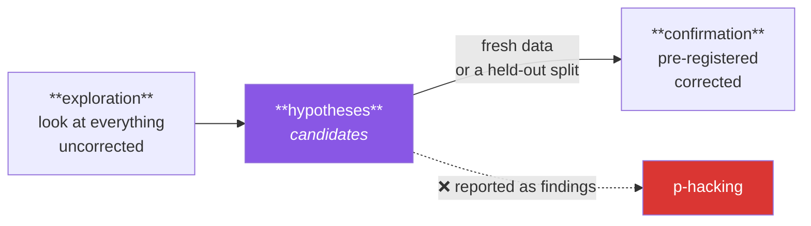

# Day 85 — Univariate and bivariate exploration

**Phase 11 · Module 11 · EDA** · ID: **EDA-03** (univariate and bivariate analysis)

> **Yesterday:** the EDA loop, and `audit(df)` catching what a schema cannot.
> **Today:** looking at one variable at a time, then two — with the discipline that makes it
> exploration rather than fishing. Everything Phase 8 measured and Phase 5 drew converges here, and
> Day 74's warning applies at full force: **you are about to look at a lot of things.**
> **Tomorrow:** multivariate structure and PCA.

```bash
./m start 85 && ./m scaffold 85
```

**Time:** 110 minutes. **Request budget:** 0 model calls.

---

## §1 The story

EDA has a bad reputation among people who care about statistics, and the reason is Day 74. Looking at
forty variables against a target *is* forty comparisons. If you then report the interesting ones as
findings, you have p-hacked — thoroughly, and without intending to.

The resolution is not to look less. It is to be clear about what looking produces:



**Exploration on the training split generates hypotheses. Nothing more.** That is Day 84's rule and
Day 79's split working together, and it is what makes unlimited looking legitimate: you never looked
at the test set, so it remains available to confirm anything you found.

Within that discipline, the mechanics are two questions.

**Univariate — what is this one variable?** Shape, spread, missingness, impossible values, and the
question people skip: *does its distribution match what the domain says it should?* A page-load time
of 0 ms is not an outlier, it is a bug.

**Bivariate — how does it relate to the target?** And here the technique depends entirely on the pair
of types, which is Day 58's table finally doing practical work:

| feature ↓ / target → | **numeric** | **categorical** |
|---|---|---|
| **numeric** | scatter + correlation (Day 62) | grouped distributions, effect size (Day 69) |
| **categorical** | grouped distributions, effect size | contingency table, Cramér's V (Day 73) |

Two traps specific to bivariate EDA. **A relationship that holds overall can reverse within
subgroups** — Simpson's paradox, and Day 59's weighted-mean warning was its shadow. And **a feature
that predicts the target suspiciously well is usually leakage**, which Day 39's heatmap screened for
and today you check per-feature.

---

## §2 Setup — run this

```bash
mkdir -p days/day-85/lab
touch days/day-85/lab/exploring.py
```

`src/setu/eda.py` grows today. No new packages.

---

## §3 EDA-03 — one variable, then two

`days/day-85/lab/exploring.py`:

```python
"""EDA-03: univariate and bivariate exploration, on the TRAINING split only."""

from __future__ import annotations

import numpy as np
import pandas as pd
from scipy import stats as sp

from setu.arrays import make_rng


def training_data() -> pd.DataFrame:
    """A frame with deliberate problems. Note: this is the TRAIN split (Day 79)."""
    rng = make_rng(0)
    n = 3_000
    quality = rng.normal(0, 1, n)
    venue = rng.choice(["NeurIPS", "ICML", "ACL", "EMNLP"], n, p=[0.4, 0.3, 0.2, 0.1])
    pages = np.clip(rng.normal(9, 3, n) + quality, 2, None).round()
    citations = np.clip(rng.lognormal(3.5 + quality * 0.6, 0.9, n), 0, None).round()

    frame = pd.DataFrame({
        "venue": pd.Series(venue, dtype="str"),
        "year": rng.integers(2015, 2026, n),
        "pages": pages,
        "review_days": rng.exponential(45, n).round(),
        "citations": citations,
        "accepted": (quality + rng.normal(0, 0.5, n) > 0.2).astype(int),
    })
    frame.loc[rng.random(n) < 0.06, "review_days"] = np.nan
    frame.loc[rng.random(n) < 0.01, "pages"] = 0.0          # impossible
    frame["citations_per_page"] = frame["citations"] / frame["pages"].replace(0, np.nan)
    return frame


def one_variable_at_a_time(frame: pd.DataFrame) -> None:
    from setu.stats import central_tendency, dispersion, shape

    print(f"\n  {'column':<20} {'n':>6} {'miss%':>7} {'mean':>10} {'median':>10} "
          f"{'skew':>7} {'note'}")
    for column in ("pages", "review_days", "citations", "citations_per_page"):
        values = frame[column]
        centre = central_tendency(values.dropna())
        spread = dispersion(values.dropna())
        form = shape(values.dropna())
        note = ""
        if abs(form["skew"]) > 1:
            note = "skewed -> log? (Day 61)"
        if (values.dropna() <= 0).any():
            note = "⚠️ non-positive values present"
        print(f"  {column:<20} {len(values.dropna()):>6} "
              f"{values.isna().mean() * 100:>6.1f}% {centre['mean']:>10.2f} "
              f"{centre['median']:>10.2f} {form['skew']:>7.2f}  {note}")

    print("\n  Read the mean-vs-median gap (Day 59) and the skew column together.")
    print("  citations is heavily skewed — every summary of it needs the median too.")


def the_domain_question(frame: pd.DataFrame) -> None:
    print("\n  the check a summary cannot make for you:")
    for column, rule, why in (
        ("pages", frame["pages"] > 0, "a paper cannot have zero pages"),
        ("year", frame["year"].between(1900, 2026), "publication year must be plausible"),
        ("review_days", frame["review_days"].dropna() >= 0, "a duration cannot be negative"),
    ):
        violations = (~rule).sum()
        flag = "🚨" if violations else "  "
        print(f"  {flag} {column:<14} {violations:>4} violations — {why}")

    print("\n  ⚠️ Zero pages is NOT an outlier to be winsorised (Day 77). It is a BUG,")
    print("     and the right response is to find out how it got there, not to clip it.")
    print("  Only domain knowledge distinguishes those two cases. A statistic cannot.")


def numeric_against_numeric(frame: pd.DataFrame) -> None:
    from setu.stats import association, leverage_check

    print(f"\n  {'pair':<28} {'pearson':>9} {'spearman':>10} {'r²':>7} {'fragile?':>9}")
    for a, b in (("pages", "citations"), ("year", "citations"), ("review_days", "citations")):
        result = association(frame[a].dropna(), frame.loc[frame[a].notna(), b], method="both")
        fragile = leverage_check(frame[a].dropna().head(400),
                                 frame.loc[frame[a].notna(), b].head(400))
        print(f"  {a} ~ {b:<18} {result['r']:>9.3f} {result['spearman']:>10.3f} "
              f"{result['r_squared']:>7.3f} {str(fragile['is_fragile']):>9}")

    print("\n  Day 62's rules still apply: a Pearson-Spearman gap means curvature, and")
    print("  the leverage check tells you whether one point is doing the work.")
    print("  A correlation you have not plotted is a number you have not understood.")


def numeric_against_categorical(frame: pd.DataFrame) -> None:
    from setu.stats import anova, effect_size

    groups = [frame.loc[frame["venue"] == v, "citations"].to_numpy()
              for v in sorted(frame["venue"].unique())]
    result = anova(*groups)

    print(f"\n  citations by venue:")
    print(f"  {'venue':<10} {'n':>6} {'median':>9} {'IQR':>9}")
    for venue in sorted(frame["venue"].unique()):
        values = frame.loc[frame["venue"] == venue, "citations"]
        iqr = values.quantile(0.75) - values.quantile(0.25)
        print(f"  {venue:<10} {len(values):>6} {values.median():>9.1f} {iqr:>9.1f}")

    print(f"\n  ANOVA F = {result['f_statistic']:.3f}, p = {result['p_value']:.2e}")
    print(f"  eta² = {result['eta_squared']:.4f}   <- the effect size (Day 71)")
    print(f"  conclusion: {result['conclusion']}")

    print("\n  ⚠️ Report the MEDIAN and IQR here, not the mean: citations is skewed (§3.1).")
    print("     And eta² matters more than p — at n=3,000 almost anything is significant.")


def categorical_against_categorical(frame: pd.DataFrame) -> None:
    from setu.stats import chi_square_independence

    table = pd.crosstab(frame["venue"], frame["accepted"])
    result = chi_square_independence(table.to_numpy())

    print(f"\n  venue × accepted:\n{table}")
    print(f"\n  χ² = {result['chi2']:.2f}, p = {result['p_value']:.2e}")
    print(f"  Cramér's V = {result['cramers_v']:.4f}   <- the effect size (Day 73)")
    largest = result["largest_deviation"]
    print(f"  largest deviation: row {largest['row']}, col {largest['col']} "
          f"(observed {largest['observed']:.0f} vs expected {largest['expected']:.1f})")

    print("\n  The residual says WHERE. The χ² only said 'not independent'.")


def the_leak_check(frame: pd.DataFrame) -> None:
    from setu.stats import association

    print(f"\n  every numeric feature against the target — looking for the TOO-good one:")
    print(f"  {'feature':<22} {'|r| with citations':>20} {'verdict'}")
    for column in ("pages", "year", "review_days", "citations_per_page"):
        values = frame[[column, "citations"]].dropna()
        r = abs(association(values[column], values["citations"])["r"])
        verdict = "🚨 LEAK — check how it is built" if r > 0.9 else ""
        print(f"  {column:<22} {r:>20.4f}  {verdict}")

    print("\n  citations_per_page = citations / pages. It is the target divided by a")
    print("  feature, so of course it predicts. Day 39 screened for this in a heatmap;")
    print("  here it is per-feature, and the fix is to READ THE DEFINITION, not the number.")


def simpsons_paradox(frame: pd.DataFrame) -> None:
    rng = make_rng(1)
    n = 2_000
    department = rng.choice(["easy", "hard"], n, p=[0.5, 0.5])
    applied_hard = department == "hard"
    is_female = rng.random(n) < np.where(applied_hard, 0.8, 0.2)
    admitted = rng.random(n) < np.where(applied_hard, 0.25, 0.75)

    data = pd.DataFrame({"dept": department, "female": is_female, "admitted": admitted})

    overall = data.groupby("female", observed=True)["admitted"].mean()
    print(f"\n  overall admission rate:")
    print(f"    male   {overall[False]:.3f}")
    print(f"    female {overall[True]:.3f}   <- looks like bias")

    print(f"\n  within each department:")
    for dept in ("easy", "hard"):
        subset = data[data["dept"] == dept]
        rates = subset.groupby("female", observed=True)["admitted"].mean()
        print(f"    {dept:<5}: male {rates[False]:.3f}, female {rates[True]:.3f}")

    print("\n  The gap vanishes — or reverses — within departments. Women applied more")
    print("  to the harder department, which admits fewer of EVERYONE.")
    print("\n  ⚠️ A bivariate relationship is not a fact about the world; it is a fact")
    print("     about the data AND everything you did not condition on. Day 62's")
    print("     confounder, and Day 59's weighted-mean warning, arriving together.")


def what_exploration_produces(frame: pd.DataFrame) -> None:
    print("\n  after all of the above, what do you actually have?")
    print("\n  ✅ hypotheses worth confirming:")
    print("     - venue may relate to acceptance (V = small; confirm on held-out data)")
    print("     - citations is right-skewed; a log transform may help a linear model")
    print("  ✅ data problems to fix:")
    print("     - pages == 0 in ~1% of rows (a bug, not an outlier)")
    print("     - review_days missing in ~6% (mechanism? Day 76)")
    print("  ✅ features to DROP:")
    print("     - citations_per_page (leak)")
    print("\n  ❌ NOT findings. Nothing above has been confirmed on data you did not look at.")
    print(f"\n  comparisons made while exploring: roughly {4 + 3 + 1 + 1 + 4} — uncorrected,")
    print("  and that is fine PROVIDED you call them hypotheses (Day 74).")


if __name__ == "__main__":
    frame = training_data()
    one_variable_at_a_time(frame)
    the_domain_question(frame)
    numeric_against_numeric(frame)
    numeric_against_categorical(frame)
    categorical_against_categorical(frame)
    the_leak_check(frame)
    simpsons_paradox(frame)
    what_exploration_produces(frame)
```

**Line by line:**

- `training_data`'s docstring — **this is the train split.** Every function below looks only at it, so
  the test set survives to confirm anything found. That is what makes the uncorrected looking in §3
  legitimate rather than reckless.
- `one_variable_at_a_time` — reuses Day 59's `central_tendency`, Day 60's `dispersion` and Day 61's
  `shape` rather than recomputing. **Read the mean-median gap and the skew column together**; they are
  the same information twice, and citations shows both.
- `the_domain_question` — **the check a statistic cannot make.** Zero pages is not an outlier to be
  winsorised (Day 77); it is a **bug**, and the correct response is to find out how it got there. Only
  domain knowledge separates "extreme but real" from "impossible".
- `numeric_against_numeric` — Day 62's rules still apply: a **Pearson–Spearman gap means curvature**,
  and the leverage check says whether one point is doing the work. A correlation you have not plotted
  is a number you have not understood.
- `numeric_against_categorical` — **median and IQR, not mean and sd**, because §3.1 established the
  skew. And `eta²` matters more than `p`: at n = 3,000 almost anything is significant (Day 69).
- `categorical_against_categorical` — `pd.crosstab` into Day 73's test, with **Cramér's V** as the
  effect size and the residual saying *where*. The χ² alone only says "not independent".
- `the_leak_check` — every numeric feature against the target, looking for the suspiciously good one.
  `citations_per_page` is the target divided by a feature, so of course it predicts. **The fix is to
  read the definition, not the number** — Day 39's heatmap screen, applied per feature.
- `simpsons_paradox` — **run this and read both blocks.** The overall gap looks like bias; within each
  department it vanishes. Women applied more to the department that admits fewer of *everyone*. **A
  bivariate relationship is a fact about the data and everything you did not condition on**, which is
  Day 62's confounder and Day 59's weighted-mean warning arriving together.
- `what_exploration_produces` — **the honest inventory.** Hypotheses, data problems, features to drop.
  Not findings. And the comparison count is stated, which is Day 74's disclosure applied to EDA.

---

## §4 Build brief

Extend `src/setu/eda.py`:

```python
def univariate(frame, column: str, *, level: Level | None = None,
               domain_rule=None) -> dict:
    """TODO(me): everything worth knowing about ONE column.

    {"column", "level", "n", "n_missing", "pct_missing", "centre": {...},
     "spread": {...}, "shape": {...}, "domain_violations": int, "flags": [...]}
    - level from measurement_schema (Day 58) when not given; record whether it was GUESSED
    - reuse central_tendency (59), dispersion (60), shape (61) — do NOT reimplement
    - respect the level: no mean for nominal/ordinal, no skew below interval
    - domain_rule is a callable returning a boolean mask of VALID rows; count the rest
    - flags must distinguish 'impossible value' (a bug) from 'extreme value' (an outlier);
      the first cites the domain rule, the second cites Day 77
    - raise DataError if the column is missing, naming the columns that exist
    """
    raise NotImplementedError


def bivariate(frame, feature: str, target: str, *, levels: dict | None = None) -> dict:
    """TODO(me): dispatch on the TYPE PAIR (§1's table).

    {"feature", "target", "pair": "numeric~numeric"|..., "method", "statistic",
     "effect_size", "p_value", "n_used", "warnings": [...]}
    - numeric~numeric   -> association (Day 62), effect size = r_squared
    - numeric~categorical -> anova or t_test (Day 71), effect size = eta_squared or d
    - categorical~categorical -> chi_square_independence (Day 73), effect size = cramers_v
    - categorical~numeric -> same as numeric~categorical, with the roles swapped
    - ordinal on either side forces a RANK method (Day 58's table)
    - drop rows missing either variable and report n_used
    - warn when the effect size is negligible despite p < 0.05 (Day 69)
    - raise DataError on a pair the table does not cover, naming both levels
    """
    raise NotImplementedError


def screen_features(frame, target: str, *, levels: dict | None = None,
                    leak_threshold: float = 0.9) -> dict:
    """TODO(me): every feature against the target, in one pass.

    {"results": [bivariate(...) per feature], "ranked": [...], "suspected_leaks": [...],
     "n_comparisons": int, "statement": str}
    - `ranked` is sorted by effect size, NOT by p-value (Day 69: p answers 'real', not 'big')
    - suspected_leaks are features whose effect size exceeds leak_threshold
    - `statement` MUST include n_comparisons and the word 'hypotheses' or 'exploratory' —
      this is Day 74's disclosure, and screening 40 features is 40 comparisons
    - the results must NOT be corrected; screening is exploration (§1)
    - raise DataError if the target is not a column
    """
    raise NotImplementedError


def check_subgroup_stability(frame, feature: str, target: str, by: str,
                             *, min_group: int = 30) -> dict:
    """TODO(me): does the relationship survive conditioning? (§3's Simpson's paradox)

    {"overall": float, "by_group": {group: float}, "reverses": bool,
     "weakens": bool, "groups_used": int, "warning": str | None}
    - `overall` and each group value are the same effect-size measure
    - reverses=True when any group's effect has the OPPOSITE SIGN to the overall one
    - weakens=True when every group's |effect| is below half the overall |effect|
    - skip groups below min_group and report how many were used
    - the warning must name the confounder candidate (`by`) when reverses or weakens
    - raise DataError if fewer than 2 groups survive the size filter
    """
    raise NotImplementedError


def exploration_report(screen: dict, univariates: list[dict]) -> dict:
    """TODO(me): the honest inventory from §3's last function.

    {"hypotheses": [...], "data_problems": [...], "features_to_drop": [...],
     "n_comparisons": int, "statement": str, "warnings": [...]}
    - `data_problems` come from domain violations and missingness, NOT from effect sizes
    - `features_to_drop` are the suspected leaks, each with its reason
    - the statement must say these are HYPOTHESES and name the comparison count
    - it must NEVER contain the word 'finding' or 'shows that' — those require
      confirmation on data you have not looked at (Day 74, Principle 15)
    """
    raise NotImplementedError
```

- `bivariate` dispatching on the **type pair** is Day 58's table becoming executable. Picking a test by
  habit rather than by level is how a t-test ends up on ordinal data.
- `ranked` sorting by **effect size rather than p-value** is Day 69's rule applied where it bites: at
  n = 3,000 a p-value ranking is essentially a ranking by sample size.
- `exploration_report` **banning the word "finding"** is the third time this project has tested
  English, and for the same reason: it is the word people reach for when the discipline is
  inconvenient.

---

## §5 The eval that must be able to fail

Add to `tests/test_eda.py`:

```python
from setu.eda import (
    bivariate,
    check_subgroup_stability,
    exploration_report,
    screen_features,
    univariate,
)


@pytest.fixture
def frame():
    rng = make_rng(0)
    n = 1_500
    quality = rng.normal(0, 1, n)
    return pd.DataFrame({
        "venue": pd.Series(rng.choice(["A", "B", "C"], n), dtype="str"),
        "pages": np.clip(rng.normal(9, 3, n) + quality, 1, None).round(),
        "citations": np.clip(rng.lognormal(3.5 + quality * 0.6, 0.9, n), 0, None).round(),
        "noise": rng.normal(0, 1, n),
        "accepted": (quality > 0).astype(int),
    })


def test_univariate_reuses_the_phase_8_helpers(monkeypatch, frame):
    """Do not reimplement Days 59, 60 and 61."""
    import setu.stats as stats

    calls = []
    for name in ("central_tendency", "dispersion", "shape"):
        original = getattr(stats, name)
        monkeypatch.setattr(
            stats, name,
            lambda *a, _o=original, _n=name, **k: calls.append(_n) or _o(*a, **k),
        )
    univariate(frame, "citations")
    assert set(calls) >= {"central_tendency", "dispersion", "shape"}


def test_univariate_respects_the_level(frame):
    result = univariate(frame, "venue", level="nominal")
    assert "mean" not in result["centre"]
    assert result["shape"] == {} or "skew" not in result["shape"]


def test_a_domain_violation_is_a_bug_not_an_outlier(frame):
    """Zero pages is impossible, not extreme."""
    dirty = frame.copy()
    dirty.loc[:9, "pages"] = 0.0
    result = univariate(dirty, "pages", domain_rule=lambda s: s > 0)
    assert result["domain_violations"] == 10
    flags = " ".join(result["flags"]).lower()
    assert "impossible" in flags or "bug" in flags
    assert "outlier" not in flags, "an impossible value was described as an outlier"


def test_an_extreme_value_is_flagged_as_an_outlier_not_a_bug(frame):
    dirty = frame.copy()
    dirty.loc[0, "pages"] = 500.0
    result = univariate(dirty, "pages", domain_rule=lambda s: s > 0)
    assert result["domain_violations"] == 0
    assert any("outlier" in f.lower() or "extreme" in f.lower() for f in result["flags"])


def test_univariate_reports_missingness(frame):
    dirty = frame.copy()
    dirty.loc[:149, "pages"] = np.nan
    assert univariate(dirty, "pages")["pct_missing"] == pytest.approx(10.0, abs=0.1)


def test_univariate_names_existing_columns_when_missing(frame):
    with pytest.raises(DataError) as info:
        univariate(frame, "nope")
    assert "citations" in str(info.value)


def test_bivariate_dispatches_on_the_type_pair(frame):
    numeric = bivariate(frame, "pages", "citations",
                        levels={"pages": "ratio", "citations": "ratio"})
    assert numeric["pair"] == "numeric~numeric"

    mixed = bivariate(frame, "venue", "citations",
                      levels={"venue": "nominal", "citations": "ratio"})
    assert "categorical" in mixed["pair"] and "numeric" in mixed["pair"]

    both = bivariate(frame, "venue", "accepted",
                     levels={"venue": "nominal", "accepted": "nominal"})
    assert both["pair"] == "categorical~categorical"
    assert "cram" in both["method"].lower() or "chi" in both["method"].lower()


def test_ordinal_forces_a_rank_method(frame):
    result = bivariate(frame, "pages", "citations",
                       levels={"pages": "ordinal", "citations": "ratio"})
    assert "rank" in result["method"].lower() or "spearman" in result["method"].lower()


def test_bivariate_always_reports_an_effect_size(frame):
    for feature in ("pages", "venue", "noise"):
        result = bivariate(frame, feature, "citations")
        assert result["effect_size"] is not None


def test_significant_but_negligible_is_warned_about():
    rng = make_rng(1)
    big = pd.DataFrame({"x": rng.normal(size=50_000)})
    big["y"] = big["x"] * 0.02 + rng.normal(size=50_000)
    result = bivariate(big, "x", "y")
    assert result["p_value"] < 0.05
    assert result["warnings"], "a trivial effect at huge n went unwarned"


def test_bivariate_reports_rows_used(frame):
    dirty = frame.copy()
    dirty.loc[:99, "pages"] = np.nan
    assert bivariate(dirty, "pages", "citations")["n_used"] == len(frame) - 100


def test_screening_ranks_by_effect_size_not_p_value(frame):
    """At large n, ranking by p is ranking by sample size."""
    result = screen_features(frame, "citations")
    effects = [abs(r["effect_size"]) for r in result["ranked"]]
    assert effects == sorted(effects, reverse=True)


def test_screening_finds_the_planted_leak(frame):
    leaky = frame.copy()
    leaky["citations_per_page"] = leaky["citations"] / leaky["pages"]
    result = screen_features(leaky, "citations")
    assert "citations_per_page" in result["suspected_leaks"]
    assert "noise" not in result["suspected_leaks"]


def test_screening_counts_its_comparisons(frame):
    result = screen_features(frame, "citations")
    assert result["n_comparisons"] == len(frame.columns) - 1
    assert str(result["n_comparisons"]) in result["statement"]


def test_screening_calls_itself_exploratory(frame):
    """Day 74: 40 features is 40 comparisons."""
    statement = screen_features(frame, "citations")["statement"].lower()
    assert "hypothes" in statement or "explorat" in statement


def test_screening_does_not_correct_its_p_values(frame):
    """Screening is exploration; correction belongs to confirmation."""
    result = screen_features(frame, "citations")
    assert all("adjusted" not in r for r in result["results"])


def test_simpsons_paradox_is_detected():
    """The overall relationship reverses within groups."""
    rng = make_rng(2)
    n = 4_000
    hard = rng.random(n) < 0.5
    female = rng.random(n) < np.where(hard, 0.8, 0.2)
    admitted = rng.random(n) < np.where(hard, 0.25, 0.75)
    data = pd.DataFrame({"dept": np.where(hard, "hard", "easy"),
                         "female": female.astype(int),
                         "admitted": admitted.astype(int)})

    result = check_subgroup_stability(data, "female", "admitted", by="dept")
    assert result["reverses"] or result["weakens"]
    assert result["warning"] and "dept" in result["warning"]


def test_a_stable_relationship_is_not_flagged():
    """A check that flags everything is as useless as one that flags nothing."""
    rng = make_rng(3)
    n = 3_000
    group = rng.choice(["a", "b", "c"], n)
    x = rng.normal(size=n)
    data = pd.DataFrame({"group": group, "x": x, "y": x * 2 + rng.normal(size=n)})

    result = check_subgroup_stability(data, "x", "y", by="group")
    assert result["reverses"] is False
    assert result["weakens"] is False
    assert result["warning"] is None


def test_small_groups_are_skipped():
    rng = make_rng(4)
    n = 300
    group = np.where(np.arange(n) < 5, "tiny", np.where(np.arange(n) < 150, "a", "b"))
    x = rng.normal(size=n)
    data = pd.DataFrame({"group": group, "x": x, "y": x + rng.normal(size=n)})
    result = check_subgroup_stability(data, "x", "y", by="group", min_group=30)
    assert result["groups_used"] == 2


def test_too_few_groups_raises():
    data = pd.DataFrame({"g": ["a"] * 100, "x": range(100), "y": range(100)})
    with pytest.raises(DataError):
        check_subgroup_stability(data, "x", "y", by="g")


def test_the_report_never_calls_anything_a_finding(frame):
    """Confirmation requires data you have not looked at."""
    screen = screen_features(frame, "citations")
    report = exploration_report(screen, [univariate(frame, "pages")])
    text = (report["statement"] + " ".join(report["hypotheses"])).lower()
    assert "finding" not in text
    assert "shows that" not in text
    assert "proves" not in text


def test_the_report_separates_problems_from_hypotheses(frame):
    dirty = frame.copy()
    dirty.loc[:19, "pages"] = 0.0
    screen = screen_features(dirty, "citations")
    report = exploration_report(
        screen, [univariate(dirty, "pages", domain_rule=lambda s: s > 0)]
    )
    assert report["data_problems"], "a domain violation should be a data problem"
    assert not any("pages == 0" in h for h in report["hypotheses"])


def test_the_report_lists_leaks_with_reasons(frame):
    leaky = frame.copy()
    leaky["citations_per_page"] = leaky["citations"] / leaky["pages"]
    report = exploration_report(screen_features(leaky, "citations"), [])
    assert report["features_to_drop"]
    assert all(len(str(entry)) > 20 for entry in report["features_to_drop"]), (
        "each dropped feature needs a reason, not just a name"
    )


def test_the_report_discloses_the_comparison_count(frame):
    report = exploration_report(screen_features(frame, "citations"), [])
    assert str(report["n_comparisons"]) in report["statement"]
```

**Line by line:**

- `test_the_report_never_calls_anything_a_finding` — **the day's real assessment.** Three banned words,
  and it is the discipline from §1 enforced in the output rather than in someone's memory. Exploration
  produces hypotheses; calling one a finding is the p-hack.
- `test_screening_ranks_by_effect_size_not_p_value` — at n = 1,500 a p-value ranking is close to a
  ranking by how much data each feature has. **Sorting by effect size is what makes the ranking
  useful**, and Day 69 established why.
- `test_a_domain_violation_is_a_bug_not_an_outlier` paired with
  `test_an_extreme_value_is_flagged_as_an_outlier_not_a_bug` — together they force the flag vocabulary
  to distinguish the two, because the **responses differ completely**: investigate the first, decide
  about the second (Day 77).
- `test_simpsons_paradox_is_detected` with `test_a_stable_relationship_is_not_flagged` — the positive
  and negative case. A stability check that flags everything is as useless as one that flags nothing,
  and the second test is the one that forces real logic.
- `test_screening_does_not_correct_its_p_values` — asserts an **absence**, and it is deliberate:
  screening is exploration (§1), so correcting here would be applying a confirmation-stage tool at the
  wrong stage and would hide candidates worth following up.
- `test_univariate_reuses_the_phase_8_helpers` — the architecture test, now checking **three**
  functions at once. Reimplementing skew in a fourth place is how two parts of Day 90's report end up
  disagreeing.
- `test_the_report_lists_leaks_with_reasons` — asserts each dropped feature carries more than a name.
  "Dropped: citations_per_page" is not actionable; "it is the target divided by pages" is.

```bash
uv run python -m pytest tests/test_eda.py -v
```

---

## §6 Request budget

| Resource | Spent today |
|---|---|
| LLM calls | **0** |

---

## §7 Traps

- **Exploring the test set.** Then nothing is left to confirm on (Day 79).
- **Reporting an exploratory result as a finding.** Day 74.
- **Omitting the comparison count from an EDA summary.** Same.
- **Ranking features by p-value.** At large n that ranks by sample size.
- **Winsorising an impossible value.** It is a bug; find out how it got there.
- **A mean and sd for a skewed variable.** Median and IQR (Day 59).
- **Picking a bivariate method by habit.** The type pair decides (Day 58).
- **A t-test on ordinal data.** Still illegal, eighteen days later.
- **Trusting a bivariate relationship unconditionally.** Simpson's paradox.
- **A feature that predicts too well.** Read its definition before celebrating.
- **A correlation you have not plotted.** Anscombe (Day 62).

---

## §8 Verify before you code

Written **2026-08-21**:

- <https://pandas.pydata.org/docs/reference/api/pandas.crosstab.html> — contingency tables, with
  `normalize` for conditional proportions.
- <https://pandas.pydata.org/docs/reference/api/pandas.DataFrame.groupby.html> — `observed=` still
  matters (Day 34).
- <https://seaborn.pydata.org/tutorial/distributions.html> — the plots that go beside these numbers
  (Days 38–39).
- <https://en.wikipedia.org/wiki/Simpson%27s_paradox> — the canonical admissions example.

---

## §9 Say it in an interview

> "EDA has a p-hacking problem by construction — looking at forty features against a target is forty
> comparisons. The resolution isn't to look less, it's to be precise about what looking produces:
> exploration on the training split generates *hypotheses*, and the test set stays untouched so
> there's something left to confirm them on. So my screening function states its comparison count and
> calls itself exploratory, and there's a test asserting the report never uses the word 'finding'. Two
> mechanics worth mentioning: the bivariate method is dispatched on the *type pair* rather than picked
> by habit — numeric-numeric gets a correlation, categorical-categorical gets Cramér's V, and ordinal
> on either side forces a rank method — and features are ranked by effect size, not p-value, because at
> a few thousand rows a p-value ranking is basically a ranking by sample size. The check I'd flag as
> underrated is subgroup stability: a relationship that holds overall can reverse within groups, and a
> bivariate number is a fact about the data *and everything you didn't condition on*."

---

## §10 Done when

Tick [`CHECKLIST.md`](CHECKLIST.md), then `./m check && ./m done 85`.
