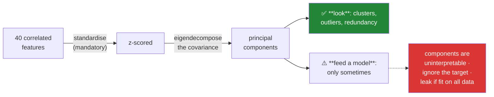

# Day 86 — Multivariate structure: PCA for looking, not modelling

**Phase 11 · Module 11** · ID: **EDA-04** (multivariate analysis, dimensionality reduction for exploration)

> **Yesterday:** one variable, then two.
> **Today:** all of them at once. PCA is the tool, and the title is the argument — it is superb for
> **seeing** structure and a poor default for **feeding** a model. You will build it from an
> eigendecomposition (Principle 2), then meet the three ways it misleads.
> **Tomorrow:** the first case study.

```bash
./m start 86 && ./m scaffold 86
```

**Time:** 110 minutes. **Request budget:** 0 model calls.

---

## §1 The story

Day 85 looked at pairs. With forty features there are 780 pairs, and no amount of pairwise looking
tells you that six of them are measuring the same underlying thing.

**PCA finds directions.** It rotates your feature space so the first axis captures as much variance as
possible, the second captures as much of what remains, and so on. Then you plot the first two and see
the structure that no pair of original axes showed.



**Why it is superb for looking.** Redundant features collapse onto one component, so "we have forty
features" becomes "we have about six independent things". Clusters that are invisible in any single
pair become obvious. Multivariate outliers — rows that are unremarkable in every individual column but
impossible in combination — show up immediately.

**Why it is a poor default for modelling.** Three reasons, and each is a real cost:

1. **Components are uninterpretable.** "PC1 increases by 1" is not something you can explain to
   anyone, and Day 93's coefficient discussion depends on being able to.
2. **PCA is unsupervised.** It maximises variance, which has no reason to align with what predicts
   your target. A low-variance direction can be the one that matters.
3. **It is a fitted transform**, so fitting it on all your data before splitting is leakage — Day 80's
   rule, and it is easy to violate because PCA feels like a preprocessing step rather than a fitted
   one.

The standardisation point is not optional. **PCA on unstandardised data is dominated by whichever
feature has the largest units** — a column in milliseconds will crush one in seconds, and the
"principal component" will just be that column. You will measure it in §3.

---

## §2 Setup — run this

```bash
mkdir -p days/day-86/lab
touch days/day-86/lab/multivariate.py
```

`src/setu/eda.py` grows today. `scikit-learn` came in on Day 79. No new packages.

---

## §3 EDA-04 — structure

`days/day-86/lab/multivariate.py`:

```python
"""EDA-04: PCA from scratch, what it reveals, and the three ways it misleads."""

from __future__ import annotations

import numpy as np
import pandas as pd
from sklearn.decomposition import PCA

from setu.arrays import make_rng


def correlated_features(n: int = 2_000) -> pd.DataFrame:
    """Six observed columns generated from THREE latent factors."""
    rng = make_rng(0)
    size = rng.normal(0, 1, n)
    effort = rng.normal(0, 1, n)
    luck = rng.normal(0, 1, n)

    return pd.DataFrame({
        "pages": 9 + size * 3 + rng.normal(0, 0.4, n),
        "figures": 5 + size * 2 + rng.normal(0, 0.4, n),
        "references": 30 + size * 8 + rng.normal(0, 2, n),
        "review_days": 45 + effort * 12 + rng.normal(0, 3, n),
        "revisions": 2 + effort * 0.8 + rng.normal(0, 0.2, n),
        "downloads": 500 + luck * 200 + rng.normal(0, 40, n),
    })


def from_scratch(frame: pd.DataFrame) -> None:
    values = frame.to_numpy()
    z = (values - values.mean(axis=0)) / values.std(axis=0, ddof=1)

    covariance = np.cov(z, rowvar=False, ddof=1)
    eigenvalues, eigenvectors = np.linalg.eigh(covariance)

    order = np.argsort(eigenvalues)[::-1]
    eigenvalues, eigenvectors = eigenvalues[order], eigenvectors[:, order]
    explained = eigenvalues / eigenvalues.sum()

    print(f"\n  {'PC':>4} {'eigenvalue':>12} {'explained':>11} {'cumulative':>12}")
    for i, (value, share) in enumerate(zip(eigenvalues, explained, strict=True), 1):
        print(f"  {i:>4} {value:>12.4f} {share:>10.1%} {explained[:i].sum():>11.1%}")

    print(f"\n  Σ eigenvalues = {eigenvalues.sum():.4f} = number of features "
          f"({frame.shape[1]}), because each z-scored column has variance 1.")

    library = PCA().fit(z)
    print(f"  sklearn explained ratios: {np.round(library.explained_variance_ratio_, 4)}")
    print("\n  Identical. PCA IS the eigendecomposition of the correlation matrix.")


def what_it_reveals(frame: pd.DataFrame) -> None:
    values = frame.to_numpy()
    z = (values - values.mean(axis=0)) / values.std(axis=0, ddof=1)
    model = PCA().fit(z)

    print(f"\n  6 observed columns, generated from 3 latent factors:")
    cumulative = np.cumsum(model.explained_variance_ratio_)
    for k, share in enumerate(cumulative, 1):
        marker = "  <- 3 components capture nearly everything" if k == 3 else ""
        print(f"    {k} component(s): {share:>6.1%}{marker}")

    print(f"\n  loadings (how each column contributes to each component):")
    loadings = pd.DataFrame(
        model.components_[:3].T, index=frame.columns, columns=["PC1", "PC2", "PC3"]
    )
    print(loadings.round(3))

    print("\n  Read the loadings COLUMN-wise: PC1 loads on pages/figures/references —")
    print("  that is the 'size' factor. PC2 on review_days/revisions — 'effort'.")
    print("  Nobody told PCA about the factors; it found them from the correlations.")
    print("\n  That is what 'we have 6 features but about 3 independent things' looks like.")


def standardising_is_not_optional(frame: pd.DataFrame) -> None:
    values = frame.to_numpy()

    raw = PCA().fit(values)
    z = (values - values.mean(axis=0)) / values.std(axis=0, ddof=1)
    scaled = PCA().fit(z)

    print(f"\n  {'':<12} {'PC1 explains':>14} {'dominant column':>18}")
    for label, model, matrix in (("raw", raw, values), ("standardised", scaled, z)):
        dominant = frame.columns[np.abs(model.components_[0]).argmax()]
        print(f"  {label:<12} {model.explained_variance_ratio_[0]:>13.1%} {dominant:>18}")

    print(f"\n  column standard deviations: "
          f"{dict(zip(frame.columns, frame.std(ddof=1).round(1), strict=True))}")
    print("\n  On raw data PC1 is essentially just `downloads` — the column with the")
    print("  largest units. That is not structure, it is a unit choice.")
    print("  ⚠️ PCA on unstandardised data answers 'which column has the biggest numbers'.")


def choosing_how_many(frame: pd.DataFrame) -> None:
    z = (frame.to_numpy() - frame.to_numpy().mean(axis=0)) / frame.to_numpy().std(axis=0, ddof=1)
    model = PCA().fit(z)
    eigenvalues = model.explained_variance_

    print(f"\n  three common rules, and they disagree:")
    kaiser = int((eigenvalues > 1).sum())
    variance_90 = int(np.searchsorted(np.cumsum(model.explained_variance_ratio_), 0.90) + 1)

    print(f"    Kaiser (eigenvalue > 1)      : {kaiser}")
    print(f"    90% cumulative variance      : {variance_90}")
    print(f"    scree elbow (look at it)     : judgement")

    print(f"\n  scree: {np.round(eigenvalues, 3)}")
    drops = np.diff(eigenvalues)
    print(f"  drops: {np.round(drops, 3)}   <- the elbow is the biggest drop: "
          f"after PC{int(np.argmin(drops)) + 1}")

    print("\n  ⚠️ 'Eigenvalue > 1' means 'explains more than one original column would',")
    print("     which only makes sense on STANDARDISED data. It is a rule of thumb, and")
    print("     for LOOKING the answer is almost always 2 — because you are plotting it.")


def multivariate_outliers(frame: pd.DataFrame) -> None:
    contaminated = frame.copy()
    contaminated.loc[0, ["pages", "figures", "references"]] = [9.0, 5.0, 30.0]
    contaminated.loc[0, "review_days"] = 45.0
    contaminated.loc[1, "pages"] = 20.0
    contaminated.loc[1, "figures"] = 1.0            # many pages, almost no figures

    print(f"\n  row 1: pages=20 (high), figures=1 (low). Univariately, neither is extreme:")
    for column in ("pages", "figures"):
        values = contaminated[column]
        z = abs((values.iloc[1] - values.mean()) / values.std(ddof=1))
        print(f"    {column:<10} value={values.iloc[1]:>6.1f}  |z| = {z:.2f}")

    values = contaminated.to_numpy()
    z = (values - values.mean(axis=0)) / values.std(axis=0, ddof=1)
    scores = PCA(n_components=3).fit_transform(z)
    distance = np.sqrt((scores**2).sum(axis=1))

    print(f"\n  distance in PCA space: row 1 = {distance[1]:.2f}, "
          f"median = {np.median(distance):.2f}, "
          f"percentile = {(distance < distance[1]).mean() * 100:.1f}")
    print("\n  The COMBINATION is impossible even though each value is ordinary.")
    print("  Day 77's per-column z-scores cannot see this. That is what multivariate means.")


def pca_ignores_the_target() -> None:
    rng = make_rng(1)
    n = 3_000
    noise_big = rng.normal(0, 10, n)               # huge variance, irrelevant
    signal_small = rng.normal(0, 0.3, n)           # tiny variance, IS the target
    target = (signal_small + rng.normal(0, 0.05, n) > 0).astype(int)

    frame = pd.DataFrame({
        "loud_noise_a": noise_big + rng.normal(0, 1, n),
        "loud_noise_b": noise_big + rng.normal(0, 1, n),
        "quiet_signal": signal_small,
    })

    values = frame.to_numpy()
    z = (values - values.mean(axis=0)) / values.std(axis=0, ddof=1)
    model = PCA().fit(z)
    scores = model.transform(z)

    print(f"\n  explained variance: {np.round(model.explained_variance_ratio_, 3)}")
    print(f"\n  correlation with the target:")
    for i in range(3):
        r = abs(np.corrcoef(scores[:, i], target)[0, 1])
        print(f"    PC{i + 1} (explains {model.explained_variance_ratio_[i]:.1%}): |r| = {r:.4f}")

    print(f"\n  raw quiet_signal: |r| = {abs(np.corrcoef(frame['quiet_signal'], target)[0, 1]):.4f}")

    print("\n  ⚠️ PC1 explains the most variance and predicts NOTHING. The component that")
    print("     matters is the one you would have discarded by a variance rule.")
    print("  PCA is UNSUPERVISED — it never saw the target. Dropping low-variance")
    print("  components can throw away exactly the signal you needed.")


def pca_is_a_fitted_transform() -> None:
    rng = make_rng(2)
    n = 1_000
    train = pd.DataFrame(rng.normal(0, 1, (n, 4)), columns=list("abcd"))
    test = pd.DataFrame(rng.normal(2, 3, (300, 4)), columns=list("abcd"))   # shifted

    correct = PCA(n_components=2).fit(train)
    train_scores = correct.transform(train)
    test_scores = correct.transform(test)

    wrong = PCA(n_components=2).fit(pd.concat([train, test]))

    print(f"\n  fit on TRAIN only:")
    print(f"    train PC1 mean = {train_scores[:, 0].mean():>7.3f}")
    print(f"    test  PC1 mean = {test_scores[:, 0].mean():>7.3f}   <- the shift SHOWS")

    print(f"\n  fit on train+test together:")
    both = wrong.transform(pd.concat([train, test]))
    print(f"    combined PC1 mean = {both[:, 0].mean():>7.3f}   <- centred by construction")

    print(f"\n  component angle between the two fits: "
          f"{np.degrees(np.arccos(abs(np.dot(correct.components_[0], wrong.components_[0])))):.1f}°")

    print("\n  ⚠️ PCA is FITTED. Fitting it on all your data before splitting means the")
    print("     test set influenced the rotation — Day 80's rule, in a step that feels")
    print("     like preprocessing rather than fitting. It belongs INSIDE the pipeline.")


def when_pca_is_the_right_feature_step() -> None:
    print("\n  PCA as a modelling step is defensible when:")
    print("    - the features are genuinely redundant and you have measured it")
    print("    - p is large relative to n and you need the dimensions gone")
    print("    - the model is distance-based (Day 103's KNN) and redundancy distorts it")
    print("    - interpretability is genuinely not required")
    print("\n  and it is the WRONG choice when:")
    print("    - you will need to explain a coefficient (Day 93)")
    print("    - the signal may live in a low-variance direction (§3)")
    print("    - a simpler answer exists: drop one of each correlated pair")
    print("\n  For EDA none of this applies. You are plotting two components and looking.")


if __name__ == "__main__":
    frame = correlated_features()
    from_scratch(frame)
    what_it_reveals(frame)
    standardising_is_not_optional(frame)
    choosing_how_many(frame)
    multivariate_outliers(frame)
    pca_ignores_the_target()
    pca_is_a_fitted_transform()
    when_pca_is_the_right_feature_step()
```

**Line by line:**

- `from_scratch` — **PCA is the eigendecomposition of the correlation matrix**, and building it that
  way (Principle 2) removes the mystery. `np.linalg.eigh` is used rather than `eig` because a
  covariance matrix is symmetric, which guarantees real eigenvalues and is faster.
- `eigenvalues.sum() = n_features` — because each z-scored column has variance 1. That identity is
  what makes "eigenvalue > 1" mean "explains more than one original column would".
- `what_it_reveals` — six columns from three latent factors, and three components capture nearly
  everything. **Read the loadings column-wise**: PC1 loads on pages/figures/references (a "size"
  factor), PC2 on review_days/revisions ("effort"). Nobody told PCA about the factors; it found them
  from the correlations.
- `standardising_is_not_optional` — **on raw data PC1 is essentially just `downloads`**, the column
  with the largest units. That is not structure, it is a unit choice. Run it and compare the dominant
  column in each row.
- `choosing_how_many` — **three rules that disagree.** Kaiser's "eigenvalue > 1" only makes sense on
  standardised data, and the scree elbow is judgement. For *looking* the answer is almost always 2,
  because you are plotting it.
- `multivariate_outliers` — **the row is unremarkable in every column and impossible in combination.**
  20 pages is high but not extreme; 1 figure is low but not extreme; together they are absurd. Day 77's
  per-column z-scores cannot see this, and that is what "multivariate" buys you.
- `pca_ignores_the_target` — **the most important demonstration today.** PC1 explains the most variance
  and predicts nothing; the signal lives in the component a variance rule would discard. **PCA is
  unsupervised** and has no reason to align with your target.
- `pca_is_a_fitted_transform` — fitting on train only shows the test set's shift; fitting on both
  centres it away by construction. The component angle quantifies how much the rotation itself
  changed. **This is Day 80's rule in a step that feels like preprocessing**, which is why it belongs
  inside the pipeline (Day 83).
- `when_pca_is_the_right_feature_step` — the honest both-sides list. And the closing line matters: for
  EDA none of it applies, because you are plotting two components and looking.

---

## §4 Build brief

Extend `src/setu/eda.py`:

```python
def pca_explore(frame, *, n_components: int = 2, standardise: bool = True,
                columns: list[str] | None = None) -> dict:
    """TODO(me): PCA for LOOKING. Fitted on whatever you pass — caller's responsibility.

    {"scores": ndarray, "loadings": DataFrame, "explained": [...], "cumulative": [...],
     "n_components", "columns_used", "standardised": bool, "warnings": [...]}
    - numeric columns only; raise DataError if fewer than 2 remain, naming what was dropped
    - drop rows with any missing value and report how many (PCA cannot handle NaN)
    - standardise=False must attach a WARNING naming the dominant column's units (§3)
    - loadings indexed by column name, columns named PC1..PCk — a bare matrix is unreadable
    - raise DataError if n_components exceeds the number of usable columns
    - the docstring must state that this is for exploration and that a MODELLING use
      belongs inside a pipeline (Day 83)
    """
    raise NotImplementedError


def scree(frame, *, columns: list[str] | None = None) -> dict:
    """TODO(me): how many components, by every rule, with their disagreement visible.

    {"eigenvalues": [...], "explained": [...], "cumulative": [...],
     "kaiser": int, "variance_90": int, "elbow": int, "rules_agree": bool,
     "recommendation": str}
    - kaiser counts eigenvalues > 1 (only valid standardised — say so if not)
    - elbow is the index of the largest drop between consecutive eigenvalues
    - rules_agree is False when the three differ, and the recommendation must then
      say to LOOK at the scree rather than trust a rule
    """
    raise NotImplementedError


def redundancy_report(frame, *, threshold: float = 0.95, columns=None) -> dict:
    """TODO(me): how many independent things are in here, really?

    {"n_features", "effective_dimensions", "redundancy_ratio",
     "component_groups": [[col, ...], ...], "suggested_drops": [...]}
    - effective_dimensions is the components needed to reach `threshold` variance
    - component_groups clusters columns by which component they load most strongly on
    - suggested_drops keeps ONE column per group and lists the rest, each with the
      group it duplicates — a name alone is not actionable (Day 85's rule)
    - reuse pca_explore rather than re-fitting
    """
    raise NotImplementedError


def multivariate_outliers(frame, *, n_components: int = 3, quantile: float = 0.999,
                          columns=None) -> dict:
    """TODO(me): rows that are ordinary in every column and impossible in combination.

    {"distances": ndarray, "threshold": float, "outlier_indices": [...],
     "explanations": [{"index", "distance", "columns_involved": [...]}]}
    - distance is the Euclidean norm in the first n_components of standardised PCA space
    - explanations must name WHICH columns drove each row's distance, via the loadings —
      "row 7 is an outlier" is not actionable; "row 7: high pages, low figures" is
    - a row flagged here that is ALSO a univariate outlier is not interesting; mark it
    - raise DataError if quantile is not in (0, 1)
    """
    raise NotImplementedError


def assert_pca_is_exploratory(context: str) -> None:
    """TODO(me): raise DataError if PCA is being used outside exploration without a pipeline.

    - context in {'exploration', 'pipeline'}; anything else raises
    - context='exploration' passes
    - context='pipeline' passes
    - the message for anything else must explain the leak (§3) and point at Day 83
    This exists so a modelling use of PCA has to be a deliberate, named decision.
    """
    raise NotImplementedError
```

- `pca_explore` **warning by name** when `standardise=False` is the §3 lesson made unmissable — the
  message says which column will dominate and why.
- `redundancy_report` giving each suggested drop **the group it duplicates** follows Day 85's rule: a
  bare name is not actionable.
- `assert_pca_is_exploratory` is small and deliberate: it forces a modelling use of PCA to be a named
  decision rather than a habit that quietly leaks.

---

## §5 The eval that must be able to fail

Add to `tests/test_eda.py`:

```python
from setu.eda import (
    assert_pca_is_exploratory,
    multivariate_outliers,
    pca_explore,
    redundancy_report,
    scree,
)


@pytest.fixture
def latent():
    """Six columns from three latent factors."""
    rng = make_rng(0)
    n = 2_000
    size, effort, luck = (rng.normal(0, 1, n) for _ in range(3))
    return pd.DataFrame({
        "pages": 9 + size * 3 + rng.normal(0, 0.4, n),
        "figures": 5 + size * 2 + rng.normal(0, 0.4, n),
        "references": 30 + size * 8 + rng.normal(0, 2, n),
        "review_days": 45 + effort * 12 + rng.normal(0, 3, n),
        "revisions": 2 + effort * 0.8 + rng.normal(0, 0.2, n),
        "downloads": 500 + luck * 200 + rng.normal(0, 40, n),
    })


def test_pca_matches_the_eigendecomposition(latent):
    """PCA IS the eigendecomposition of the correlation matrix."""
    result = pca_explore(latent, n_components=6)
    values = latent.to_numpy()
    z = (values - values.mean(axis=0)) / values.std(axis=0, ddof=1)
    eigenvalues = np.sort(np.linalg.eigvalsh(np.cov(z, rowvar=False, ddof=1)))[::-1]
    manual = eigenvalues / eigenvalues.sum()
    assert np.allclose(result["explained"], manual, atol=1e-6)


def test_three_components_recover_three_latent_factors(latent):
    result = pca_explore(latent, n_components=3)
    assert result["cumulative"][-1] > 0.95


def test_explained_variance_is_decreasing(latent):
    explained = pca_explore(latent, n_components=6)["explained"]
    assert list(explained) == sorted(explained, reverse=True)


def test_loadings_are_labelled(latent):
    """A bare matrix is unreadable."""
    loadings = pca_explore(latent, n_components=3)["loadings"]
    assert list(loadings.index) == list(latent.columns)
    assert list(loadings.columns) == ["PC1", "PC2", "PC3"]


def test_the_loadings_group_the_latent_factors(latent):
    """PC1 should load on the three 'size' columns together."""
    loadings = pca_explore(latent, n_components=3)["loadings"]
    pc1 = loadings["PC1"].abs()
    size_columns = {"pages", "figures", "references"}
    top_three = set(pc1.nlargest(3).index)
    assert top_three == size_columns


def test_unstandardised_pca_warns_and_names_the_dominant_column(latent):
    """On raw data PC1 is just the column with the biggest units."""
    result = pca_explore(latent, standardise=False, n_components=2)
    assert result["warnings"], "unstandardised PCA went unwarned"
    assert any("downloads" in w for w in result["warnings"])


def test_standardising_changes_which_column_dominates(latent):
    raw = pca_explore(latent, standardise=False, n_components=1)
    scaled = pca_explore(latent, standardise=True, n_components=1)
    raw_top = raw["loadings"]["PC1"].abs().idxmax()
    scaled_top = scaled["loadings"]["PC1"].abs().idxmax()
    assert raw_top == "downloads"
    assert scaled_top != raw_top


def test_missing_rows_are_dropped_and_counted(latent):
    dirty = latent.copy()
    dirty.loc[:99, "pages"] = np.nan
    result = pca_explore(dirty, n_components=2)
    assert result["scores"].shape[0] == len(latent) - 100


def test_non_numeric_columns_are_dropped_with_a_note(latent):
    mixed = latent.assign(venue=pd.Series(["a"] * len(latent), dtype="str"))
    result = pca_explore(mixed, n_components=2)
    assert "venue" not in result["columns_used"]


def test_too_few_numeric_columns_raises():
    frame = pd.DataFrame({"a": [1.0, 2.0, 3.0], "b": ["x", "y", "z"]})
    with pytest.raises(DataError) as info:
        pca_explore(frame)
    assert "b" in str(info.value) or "numeric" in str(info.value).lower()


def test_too_many_components_raises(latent):
    with pytest.raises(DataError):
        pca_explore(latent, n_components=99)


def test_scree_reports_every_rule(latent):
    result = scree(latent)
    for key in ("kaiser", "variance_90", "elbow"):
        assert isinstance(result[key], int) and result[key] >= 1


def test_scree_flags_disagreement_between_rules(latent):
    result = scree(latent)
    distinct = {result["kaiser"], result["variance_90"], result["elbow"]}
    assert result["rules_agree"] is (len(distinct) == 1)


def test_disagreeing_rules_recommend_looking(latent):
    result = scree(latent)
    if not result["rules_agree"]:
        assert "look" in result["recommendation"].lower() or "scree" in result["recommendation"].lower()


def test_kaiser_finds_the_latent_dimension(latent):
    """Six standardised columns from three factors: about three eigenvalues exceed 1."""
    assert scree(latent)["kaiser"] == 3


def test_redundancy_finds_the_effective_dimension(latent):
    result = redundancy_report(latent)
    assert result["n_features"] == 6
    assert result["effective_dimensions"] <= 4
    assert result["redundancy_ratio"] < 1.0


def test_redundancy_groups_the_correlated_columns(latent):
    groups = redundancy_report(latent)["component_groups"]
    flattened = [set(g) for g in groups]
    assert any({"pages", "figures", "references"} <= g for g in flattened)


def test_suggested_drops_carry_their_reason(latent):
    drops = redundancy_report(latent)["suggested_drops"]
    assert drops
    assert all(len(str(d)) > 15 for d in drops), "a bare column name is not actionable"


def test_independent_columns_are_not_flagged_as_redundant():
    """A check that flags everything is useless."""
    rng = make_rng(1)
    frame = pd.DataFrame(rng.normal(0, 1, (2_000, 5)), columns=list("abcde"))
    result = redundancy_report(frame)
    assert result["effective_dimensions"] >= 4
    assert result["redundancy_ratio"] > 0.7


def test_a_multivariate_outlier_is_found(latent):
    """Ordinary in every column, impossible in combination."""
    contaminated = latent.copy()
    contaminated.loc[0, "pages"] = latent["pages"].quantile(0.97)
    contaminated.loc[0, "figures"] = latent["figures"].quantile(0.03)

    for column in ("pages", "figures"):
        values = contaminated[column]
        z = abs((values.iloc[0] - values.mean()) / values.std(ddof=1))
        assert z < 3, f"{column} should be univariately unremarkable"

    result = multivariate_outliers(contaminated, quantile=0.99)
    assert 0 in result["outlier_indices"]


def test_outlier_explanations_name_the_columns(latent):
    contaminated = latent.copy()
    contaminated.loc[0, "pages"] = latent["pages"].quantile(0.99)
    contaminated.loc[0, "figures"] = latent["figures"].quantile(0.01)
    result = multivariate_outliers(contaminated, quantile=0.99)
    explanation = next(e for e in result["explanations"] if e["index"] == 0)
    assert explanation["columns_involved"], "'row 0 is an outlier' is not actionable"


def test_clean_data_yields_few_outliers(latent):
    result = multivariate_outliers(latent, quantile=0.999)
    assert len(result["outlier_indices"]) <= len(latent) * 0.01


def test_outliers_reject_a_bad_quantile(latent):
    with pytest.raises(DataError):
        multivariate_outliers(latent, quantile=1.5)


def test_pca_can_miss_the_signal_entirely():
    """PCA is unsupervised — the top component may predict nothing."""
    rng = make_rng(2)
    n = 3_000
    loud = rng.normal(0, 10, n)
    quiet = rng.normal(0, 0.3, n)
    target = (quiet + rng.normal(0, 0.05, n) > 0).astype(int)
    frame = pd.DataFrame({
        "loud_a": loud + rng.normal(0, 1, n),
        "loud_b": loud + rng.normal(0, 1, n),
        "quiet": quiet,
    })

    result = pca_explore(frame, n_components=3)
    correlations = [
        abs(np.corrcoef(result["scores"][:, i], target)[0, 1]) for i in range(3)
    ]
    assert result["explained"][0] > 0.5, "PC1 should dominate the variance"
    assert correlations[0] < 0.2, "and still predict almost nothing"
    assert max(correlations[1:]) > 0.5, "the signal lives in a later component"


def test_exploration_context_is_allowed():
    assert_pca_is_exploratory("exploration")
    assert_pca_is_exploratory("pipeline")


def test_an_unnamed_modelling_context_is_refused():
    with pytest.raises(DataError) as info:
        assert_pca_is_exploratory("just preprocessing")
    message = str(info.value).lower()
    assert "leak" in message or "pipeline" in message


def test_pca_is_not_fitted_outside_a_pipeline_in_src():
    """A fitted transform outside the pipeline is Day 80's leak."""
    from pathlib import Path

    offenders = []
    for path in Path("src/setu").rglob("*.py"):
        if path.name == "eda.py":
            continue
        for i, line in enumerate(path.read_text(encoding="utf-8").splitlines(), 1):
            if "PCA(" in line and "Pipeline" not in line and "noqa" not in line:
                offenders.append(f"{path.name}:{i}")
    assert not offenders, f"PCA fitted outside a pipeline: {offenders}"
```

**Line by line:**

- `test_pca_can_miss_the_signal_entirely` — **the day's real assessment**, and the three assertions do
  separate jobs. PC1 must dominate the variance, must predict almost nothing, and the signal must
  appear in a later component. Together they prove the unsupervised point rather than asserting it.
- `test_the_loadings_group_the_latent_factors` — the top three loadings on PC1 must be exactly the
  three "size" columns. **PCA recovered a structure nobody told it about**, and this test checks that
  rather than just checking a variance number.
- `test_unstandardised_pca_warns_and_names_the_dominant_column` — asserts the warning **names
  `downloads`**. A generic "consider standardising" gets ignored; naming the column that will dominate
  does not.
- `test_a_multivariate_outlier_is_found` — the test **first asserts both columns are univariately
  unremarkable** (`|z| < 3`), then asserts the row is caught. Without that first half, the test would
  pass on an implementation that just found a large univariate outlier.
- `test_independent_columns_are_not_flagged_as_redundant` — the negative case. Five independent columns
  must come back with a high effective dimension, which is what forces real logic rather than a
  function that always reports redundancy.
- `test_pca_matches_the_eigendecomposition` — Principle 2's payoff, verified against `np.linalg.eigvalsh`.
- `test_pca_is_not_fitted_outside_a_pipeline_in_src` — the repo-wide guard. PCA feels like
  preprocessing and is a **fitted transform**, which is exactly the combination that produces a leak
  nobody notices.

```bash
uv run python -m pytest tests/test_eda.py -v
```

---

## §6 Request budget

| Resource | Spent today |
|---|---|
| LLM calls | **0** |

---

## §7 Traps

- **PCA without standardising.** PC1 becomes whichever column has the biggest units.
- **Fitting PCA before splitting.** It is a fitted transform; that is leakage (Day 80).
- **Dropping low-variance components.** The signal may live there.
- **Expecting PCA to help prediction.** It never saw the target.
- **Interpreting a component as a real thing.** It is a rotation, not a discovered entity.
- **Trusting one component-count rule.** They disagree; look at the scree.
- **"Eigenvalue > 1" on unstandardised data.** The rule assumes variance 1 per column.
- **Reporting "row 7 is an outlier".** Say which columns made it one.
- **PCA on data with NaN.** It cannot; decide how to handle them first (Day 76).
- **Using PCA when dropping a redundant column would do.** Simpler and interpretable.

---

## §8 Verify before you code

Written **2026-08-21**:

- <https://scikit-learn.org/stable/modules/generated/sklearn.decomposition.PCA.html> — `n_components`,
  `explained_variance_ratio_`, and note it centres but does **not** scale.
- <https://numpy.org/doc/stable/reference/generated/numpy.linalg.eigh.html> — why `eigh` rather than
  `eig` for a symmetric matrix.
- <https://scikit-learn.org/stable/modules/preprocessing.html> — the scaler that must precede it.
- <https://scikit-learn.org/stable/modules/generated/sklearn.pipeline.Pipeline.html> — where a
  modelling PCA belongs (Day 83).

---

## §9 Say it in an interview

> "PCA is excellent for looking and a poor default for modelling, and I'd separate those clearly.
> For looking, it collapses redundant features onto shared components — six columns generated from
> three latent factors come back as three components, with the loadings grouping the original columns
> correctly, which nobody told it to do. It also catches multivariate outliers: a row that's
> unremarkable in every single column and impossible in combination, which per-column z-scores can't
> see by construction. For modelling, three problems. The components are uninterpretable. It's a
> fitted transform, so fitting before the split leaks — and it feels like preprocessing, which is why
> that leak is easy to miss. And it's unsupervised: I have a test where the first component explains
> most of the variance and predicts essentially nothing, because the signal lives in a low-variance
> direction that a variance-threshold rule would have discarded. Also, standardise first — otherwise
> the first principal component is just whichever column has the largest units."

---

## §10 Done when

Tick [`CHECKLIST.md`](CHECKLIST.md), then `./m check && ./m done 86`.
