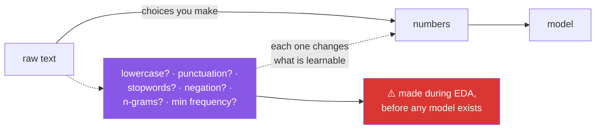

# Day 87 — Case study: sentiment of movie reviews

**Phase 11 · Module 11** · ID: **EDA-05** (case study: text data)

> **Yesterday:** PCA for looking.
> **Today:** the first case study, and the first **text** data in this plan. Everything you built for
> numbers needs rethinking — "the mean of a review" is meaningless — and the day's real lesson is
> that the most predictive feature you find will probably be an **artifact of how the data was
> collected**.
> **Tomorrow:** wine quality.

```bash
./m start 87 && ./m scaffold 87
```

**Time:** 2 hours (project day). **Request budget:** 0 model calls.

---

## §1 The story

Text breaks the toolkit. A review has no mean, no standard deviation, no correlation with anything
until you turn it into numbers — and **every choice about how to do that is a modelling decision made
before any model exists.**



Two decisions today that look like cleaning and are not.

**Removing stopwords deletes "not".** Standard English stopword lists contain *not*, *no*, *never*.
On a sentiment task that is catastrophic — "not good" and "good" become the same document. You will
measure it.

**Lowercasing deletes emphasis.** "TERRIBLE" and "terrible" carry different intensity, and collapsing
them is a choice, not a neutral step.

Then the day's real content: **the leak you find will not look like a leak.** In review corpora
collected by scraping, artifacts of collection correlate with the label far better than the sentiment
does — review length, the presence of certain markup, even where the review sits in the file. Day 85
screened for features that predict too well; today one of them will be entirely legitimate-looking.

And the honest framing for a case study: **you are exploring the training split to generate
hypotheses.** Nothing today is a finding.

---

## §2 Setup — run this

```bash
uv add "scikit-learn==1.9.0"     # already present from Day 79; confirms the pin
mkdir -p days/day-87/lab data/raw
touch days/day-87/lab/reviews.py
touch src/setu/text_features.py
touch tests/test_text_features.py
```

**Provenance (Principle 9).** Add a row to `data/raw/SOURCE.md` for whatever corpus you use — name,
URL, licence, date pulled, and one sentence on how it was collected. That last field is what makes
§3's leak findable.

---

## §3 EDA-05 — text

`days/day-87/lab/reviews.py`:

```python
"""EDA-05: exploring text, and the collection artifact that predicts better than sentiment."""

from __future__ import annotations

import re

import numpy as np
import pandas as pd
from sklearn.feature_extraction.text import CountVectorizer, TfidfVectorizer

from setu.arrays import make_rng

POSITIVE = ["excellent", "brilliant", "moving", "beautiful", "sharp", "warm"]
NEGATIVE = ["dull", "tedious", "clumsy", "shallow", "flat", "predictable"]


def training_reviews(n: int = 4_000) -> pd.DataFrame:
    """Synthetic, with a REAL sentiment signal and a planted collection artifact.

    The artifact: positive reviews were scraped from a site with a 500-character
    minimum, negative ones from a site without. Length therefore predicts the label
    and has nothing to do with sentiment. This is not exotic — it is typical.
    """
    rng = make_rng(0)
    rows = []
    for _ in range(n):
        positive = rng.random() < 0.5
        words = POSITIVE if positive else NEGATIVE
        body = " ".join(rng.choice(words, rng.integers(3, 9)))
        filler = " ".join(rng.choice(["the", "film", "a", "scene", "of", "and"],
                                     rng.integers(20, 60)))
        text = f"{body} {filler}"
        if positive:
            text += " " + " ".join(rng.choice(["really", "quite", "very"],
                                              rng.integers(30, 60)))   # the artifact
        if rng.random() < 0.12:
            text = f"not {rng.choice(POSITIVE if not positive else NEGATIVE)} " + text
        rows.append({"text": text, "label": int(positive)})
    return pd.DataFrame(rows)


def text_has_no_mean(frame: pd.DataFrame) -> None:
    print(f"\n  {len(frame):,} reviews. What can you compute directly?")
    print(f"    mean of a review        : undefined")
    print(f"    correlation with label  : undefined")
    print(f"\n  So the FIRST thing you must do is choose a representation — and every")
    print("  choice below changes what a model can possibly learn.")

    lengths = frame["text"].str.split().str.len()
    print(f"\n  the only things computable without a choice:")
    print(f"    length in words: median {lengths.median():.0f}, "
          f"IQR {lengths.quantile(0.25):.0f}–{lengths.quantile(0.75):.0f}")
    print(f"    vocabulary size: {len(set(' '.join(frame['text']).split())):,}")


def basic_shape(frame: pd.DataFrame) -> None:
    lengths = frame["text"].str.split().str.len()
    print(f"\n  class balance: {frame['label'].value_counts().to_dict()}")
    print(f"  duplicates: {frame['text'].duplicated().sum()}")
    print(f"  empty: {(frame['text'].str.strip() == '').sum()}")

    print(f"\n  length by class:")
    for label in (0, 1):
        subset = lengths[frame["label"] == label]
        print(f"    label={label}: median {subset.median():>5.0f}  "
              f"IQR {subset.quantile(.25):>4.0f}–{subset.quantile(.75):>4.0f}")

    print("\n  ⚠️ Look at that gap before doing anything else. §3.6 is about it.")


def stopwords_delete_negation(frame: pd.DataFrame) -> None:
    from sklearn.feature_extraction.text import ENGLISH_STOP_WORDS

    print(f"\n  sklearn's English stopword list contains:")
    for word in ("not", "no", "never", "nothing", "cannot"):
        print(f"    {word!r:<10} {word in ENGLISH_STOP_WORDS}")

    sample = "not good at all"
    kept = [w for w in sample.split() if w not in ENGLISH_STOP_WORDS]
    print(f"\n  {sample!r} -> {' '.join(kept)!r}")
    print("  ⚠️ The sentiment inverted. 'not good' and 'good' are now the same document.")

    negated = frame["text"].str.contains(r"\bnot\b", regex=True)
    print(f"\n  {negated.sum():,} of {len(frame):,} reviews contain 'not' "
          f"({negated.mean():.1%})")
    print("  Removing stopwords is a MODELLING decision here, not cleaning.")
    print("  If you must remove them, use a list with the negations taken out.")


def representation_choices(frame: pd.DataFrame) -> None:
    text = frame["text"].tolist()

    print(f"\n  {'representation':<34} {'features':>10} {'sparsity':>10}")
    for label, vectorizer in (
        ("bag of words", CountVectorizer()),
        ("bag of words, min_df=5", CountVectorizer(min_df=5)),
        ("binary presence", CountVectorizer(binary=True, min_df=5)),
        ("tf-idf", TfidfVectorizer(min_df=5)),
        ("tf-idf + bigrams", TfidfVectorizer(min_df=5, ngram_range=(1, 2))),
        ("tf-idf, no lowercasing", TfidfVectorizer(min_df=5, lowercase=False)),
    ):
        matrix = vectorizer.fit_transform(text)
        density = matrix.nnz / (matrix.shape[0] * matrix.shape[1])
        print(f"  {label:<34} {matrix.shape[1]:>10,} {1 - density:>9.2%}")

    print("\n  min_df=5 drops rare words — including typos, which is usually good, and")
    print("  rare sentiment words, which is not. Bigrams capture 'not good' as one")
    print("  feature, which is the principled fix for the §3.3 problem.")
    print("\n  ⚠️ Every row above is a different dataset. Choose deliberately, and record it.")


def which_words_separate(frame: pd.DataFrame) -> None:
    vectorizer = CountVectorizer(min_df=10, binary=True)
    matrix = vectorizer.fit_transform(frame["text"])
    vocabulary = np.array(vectorizer.get_feature_names_out())
    labels = frame["label"].to_numpy()

    positive_rate = np.asarray(matrix[labels == 1].mean(axis=0)).ravel()
    negative_rate = np.asarray(matrix[labels == 0].mean(axis=0)).ravel()
    difference = positive_rate - negative_rate

    order = np.argsort(difference)
    print(f"\n  most negative-leaning words:")
    for i in order[:6]:
        print(f"    {vocabulary[i]:<14} pos {positive_rate[i]:>5.1%}  neg {negative_rate[i]:>5.1%}")
    print(f"\n  most positive-leaning words:")
    for i in order[::-1][:6]:
        print(f"    {vocabulary[i]:<14} pos {positive_rate[i]:>5.1%}  neg {negative_rate[i]:>5.1%}")

    print("\n  This is Day 85's bivariate screening, on 500-odd binary features.")
    print("  It is exploration: 500 comparisons, uncorrected, producing hypotheses.")


def the_collection_artifact(frame: pd.DataFrame) -> None:
    from setu.stats import effect_size

    lengths = frame["text"].str.split().str.len()
    short = lengths[frame["label"] == 0]
    long_ = lengths[frame["label"] == 1]
    size = effect_size(list(short), list(long_))

    print(f"\n  LENGTH alone, as a predictor:")
    print(f"    effect size d = {size['value']:.3f} ({size['magnitude']})")

    threshold = lengths.median()
    accuracy = ((lengths > threshold) == (frame["label"] == 1)).mean()
    print(f"    'longer than the median -> positive' is {accuracy:.1%} accurate")

    print(f"\n  now compare a genuine sentiment feature:")
    has_positive = frame["text"].str.contains("|".join(POSITIVE))
    print(f"    'contains a positive word' is "
          f"{((has_positive) == (frame['label'] == 1)).mean():.1%} accurate")

    print("\n  🚨 Length beats sentiment. Read the docstring of training_reviews():")
    print("     positive reviews came from a site with a 500-character minimum.")
    print("\n  This is NOT a feature. It is a fact about the scrape, and a model trained")
    print("  on it will collapse the moment the collection method changes.")
    print("\n  Day 85's screen would have flagged it as 'predicts suspiciously well'.")
    print("  What it could NOT do is tell you why — that came from the PROVENANCE note")
    print("  (Principle 9). A leak you cannot explain is a leak you cannot rule out.")


def near_duplicates(frame: pd.DataFrame) -> None:
    exact = frame["text"].duplicated().sum()

    normalised = (frame["text"].str.lower()
                  .str.replace(r"[^a-z\s]", "", regex=True)
                  .str.replace(r"\s+", " ", regex=True).str.strip())
    near = normalised.duplicated().sum()

    print(f"\n  exact duplicates      : {exact}")
    print(f"  after normalisation   : {near}")
    print("\n  ⚠️ Near-duplicates that straddle a train/test split are leakage (Day 79).")
    print("     Deduplicate BEFORE splitting, and prefer a GROUPED split when reviews")
    print("     share a source, an author, or a film.")


def what_to_carry_forward(frame: pd.DataFrame) -> None:
    print("\n  hypotheses (need confirmation on held-out data):")
    print("    - a bag-of-words model should separate these classes")
    print("    - bigrams should help, because 12% of reviews contain 'not'")
    print("\n  decisions, with reasons:")
    print("    - DROP length as a feature — it is a collection artifact, not sentiment")
    print("    - do NOT remove stopwords, or remove a list with negations excluded")
    print("    - deduplicate on normalised text before splitting")
    print("\n  open questions for whoever collected this:")
    print("    - were positive and negative reviews sourced differently?")
    print("    - can several reviews share an author or a film? (grouped split)")
    print("\n  ❌ not findings. The test set has not been touched.")


if __name__ == "__main__":
    frame = training_reviews()
    text_has_no_mean(frame)
    basic_shape(frame)
    stopwords_delete_negation(frame)
    representation_choices(frame)
    which_words_separate(frame)
    the_collection_artifact(frame)
    near_duplicates(frame)
    what_to_carry_forward(frame)
```

**Line by line:**

- `training_reviews`'s docstring — **read it before running anything.** The artifact is stated openly
  so you can verify §3.6 rather than be surprised by it, and the last sentence matters: this is not
  exotic, it is typical of scraped corpora.
- `text_has_no_mean` — **the reframing.** A review has no mean and no correlation until you choose a
  representation, and that choice is made during EDA, before any model exists.
- `basic_shape` — balance, duplicates, empties, and **length by class**. The gap is visible here, six
  functions before it is explained, which is how it happens in real work.
- `stopwords_delete_negation` — `"not good at all"` becomes `"good"`. **The sentiment inverted.** On
  this task removing stopwords is a modelling decision, not cleaning, and if you must do it, use a list
  with the negations taken out.
- `representation_choices` — **every row is a different dataset.** `min_df=5` drops typos (good) and
  rare sentiment words (bad). Bigrams capture `"not good"` as one feature, which is the principled fix
  for the negation problem.
- `which_words_separate` — Day 85's bivariate screening applied to 500 binary features. **500
  uncorrected comparisons, producing hypotheses**, which is legitimate because the test set is
  untouched.
- `the_collection_artifact` — **the day's centre.** Length beats sentiment as a predictor. Then the
  explanation: positive reviews came from a site with a character minimum. **This is a fact about the
  scrape**, and a model trained on it collapses when the collection method changes.
- The three-line coda in that function is the real lesson: Day 85's screen would flag it as
  "predicts suspiciously well", but **it could not tell you why** — that came from the provenance note.
  A leak you cannot explain is a leak you cannot rule out.
- `near_duplicates` — normalising reveals more than exact matching does. **Near-duplicates straddling a
  split are leakage** (Day 79), so deduplicate before splitting and prefer a grouped split when reviews
  share an author or a film.
- `what_to_carry_forward` — hypotheses, decisions with reasons, and **open questions for whoever
  collected the data**. That last category is Day 84's domain questions, and it is where the artifact
  was actually resolvable.

---

## §4 Build brief — `src/setu/text_features.py`

Layer 2. Text representation as an explicit, recorded set of choices.

```python
"""Text representation for Setu. Every choice is named and recorded. Layer 2."""

from __future__ import annotations

from dataclasses import dataclass

from setu.errors import DataError

NEGATIONS = frozenset({"not", "no", "never", "none", "nor", "neither",
                       "cannot", "without", "hardly", "barely"})


@dataclass(frozen=True)
class TextSpec:
    """The representation decisions, as a value that can be stored beside a model."""
    lowercase: bool = True
    strip_accents: bool = False
    remove_stopwords: bool = False
    keep_negations: bool = True
    ngram_range: tuple[int, int] = (1, 2)
    min_df: int = 5
    max_features: int | None = 50_000
    weighting: str = "tfidf"


def safe_stopwords(*, keep_negations: bool = True) -> frozenset[str]:
    """TODO(me): sklearn's English list, with the negations REMOVED by default.

    - raise DataError if keep_negations is False and the caller has not passed an
      explicit acknowledgement — deleting 'not' from a sentiment task should be hard
    - the returned set must never contain a NEGATIONS member when keep_negations
    - assert the base list actually contained them, so a library change is caught
    """
    raise NotImplementedError


def validate_spec(spec: TextSpec) -> TextSpec:
    """TODO(me): validate and normalise. PURE.

    - ngram_range must be (a, b) with 1 <= a <= b <= 4; raise DataError otherwise
    - min_df >= 1; max_features None or >= 100
    - weighting in {'count', 'binary', 'tfidf'}
    - raise DataError if remove_stopwords and not keep_negations, unless the spec
      was built by an explicit override — name the risk in the message
    """
    raise NotImplementedError


def text_profile(texts, labels=None) -> dict:
    """TODO(me): what you can know WITHOUT choosing a representation.

    {"n", "n_empty", "n_exact_duplicates", "n_near_duplicates", "vocabulary_size",
     "length_words": {...}, "negation_rate", "by_label": {...} | None, "warnings": [...]}
    - near-duplicates on lowercased, punctuation-stripped, whitespace-collapsed text
    - length_words reuses central_tendency and dispersion (Days 59, 60)
    - when labels are given, report length by label AND its effect size (Day 69)
    - WARN when the length effect size exceeds 0.5 — that is §3's collection artifact,
      and the message must say to check the provenance, not to drop the feature
    - warn when near-duplicates exceed 1% (split leakage risk, Day 79)
    - raise DataError on an empty corpus
    """
    raise NotImplementedError


def top_discriminating_terms(texts, labels, *, top: int = 20, min_df: int = 10) -> dict:
    """TODO(me): Day 85's screening, for text.

    {"positive": [(term, pos_rate, neg_rate, difference)], "negative": [...],
     "n_terms_compared": int, "statement": str}
    - binary presence per document, rate per class, ranked by the difference
    - `statement` must name n_terms_compared and call these HYPOTHESES (Day 74) —
      screening 500 terms is 500 comparisons
    - raise DataError unless labels are binary, naming what was found
    """
    raise NotImplementedError


def assert_no_length_leak(texts, labels, *, max_effect: float = 0.5) -> None:
    """TODO(me): raise DataError if document length predicts the label too well.

    - compute the effect size of length between classes (Day 69)
    - the message must state the effect size AND ask the provenance question:
      'were the classes collected differently?' — §3's point is that the number
      alone does not tell you it is a leak
    - this is a SCREEN, not a verdict: a real length difference is possible
      (angry reviews really are shorter), so the message must say to check, not to drop
    """
    raise NotImplementedError


def build_vectorizer(spec: TextSpec):
    """TODO(me): return an UNFITTED sklearn vectorizer configured from the spec.

    - unfitted is the point: it goes inside the Day 83 pipeline and is fitted on
      train only (Day 80)
    - stop_words comes from safe_stopwords, never sklearn's raw list
    - raise DataError if called with an unvalidated spec (call validate_spec first)
    """
    raise NotImplementedError
```

- `safe_stopwords` **removing negations by default** is the day's design decision. §3 showed the cost,
  and making the dangerous version require an explicit acknowledgement is Principle 11 applied to a
  preprocessing step.
- `assert_no_length_leak` being **a screen rather than a verdict** matters: angry reviews genuinely are
  shorter sometimes. The message asks the provenance question rather than instructing a drop.
- `build_vectorizer` returning an **unfitted** object is what lets it live inside Day 83's pipeline and
  be fitted on train only.

---

## §5 The eval that must be able to fail

`tests/test_text_features.py`:

```python
import numpy as np
import pandas as pd
import pytest

from setu.arrays import make_rng
from setu.errors import DataError
from setu.text_features import (
    NEGATIONS,
    TextSpec,
    assert_no_length_leak,
    build_vectorizer,
    safe_stopwords,
    text_profile,
    top_discriminating_terms,
    validate_spec,
)


@pytest.fixture
def corpus():
    rng = make_rng(0)
    texts, labels = [], []
    for _ in range(600):
        positive = rng.random() < 0.5
        words = ["excellent", "brilliant"] if positive else ["dull", "tedious"]
        texts.append(" ".join(rng.choice(words, 5).tolist()
                              + rng.choice(["the", "film", "a"], 20).tolist()))
        labels.append(int(positive))
    return texts, labels


def test_negations_are_kept_by_default():
    """'not good' and 'good' must not become the same document."""
    words = safe_stopwords()
    for negation in ("not", "no", "never"):
        assert negation not in words, f"{negation!r} was left in the stopword list"


def test_the_base_list_actually_contained_them():
    """If sklearn changes its list, this test tells us rather than silently passing."""
    from sklearn.feature_extraction.text import ENGLISH_STOP_WORDS

    assert NEGATIONS & set(ENGLISH_STOP_WORDS), (
        "the base stopword list no longer contains negations — revisit safe_stopwords"
    )


def test_dropping_negations_requires_an_explicit_acknowledgement():
    with pytest.raises(DataError) as info:
        safe_stopwords(keep_negations=False)
    assert "not" in str(info.value).lower() or "negation" in str(info.value).lower()


def test_the_spec_validates_ngram_range():
    for bad in ((0, 2), (3, 1), (1, 9)):
        with pytest.raises(DataError):
            validate_spec(TextSpec(ngram_range=bad))


def test_the_spec_rejects_an_unknown_weighting():
    with pytest.raises(DataError):
        validate_spec(TextSpec(weighting="word2vec"))


def test_removing_stopwords_without_negations_is_refused():
    with pytest.raises(DataError) as info:
        validate_spec(TextSpec(remove_stopwords=True, keep_negations=False))
    assert "negation" in str(info.value).lower()


def test_the_spec_is_frozen():
    spec = validate_spec(TextSpec())
    with pytest.raises(Exception):
        spec.min_df = 99


def test_profile_needs_no_representation_choice(corpus):
    texts, _ = corpus
    profile = text_profile(texts)
    assert profile["n"] == len(texts)
    assert profile["vocabulary_size"] > 0
    assert "median" in profile["length_words"] or "mean" in profile["length_words"]


def test_profile_finds_near_duplicates():
    texts = ["A great film!", "a great film", "something else", "totally different"]
    profile = text_profile(texts)
    assert profile["n_exact_duplicates"] == 0
    assert profile["n_near_duplicates"] >= 1, "normalisation should reveal the duplicate"


def test_near_duplicates_warn_about_split_leakage():
    texts = ["Same text here"] * 30 + [f"unique {i}" for i in range(70)]
    profile = text_profile(texts)
    assert any("split" in w.lower() or "leak" in w.lower() for w in profile["warnings"])


def test_profile_measures_the_negation_rate():
    texts = ["not good"] * 20 + ["fine"] * 80
    assert text_profile(texts)["negation_rate"] == pytest.approx(0.20, abs=0.01)


def test_profile_rejects_an_empty_corpus():
    with pytest.raises(DataError):
        text_profile([])


def test_the_length_artifact_is_caught():
    """§3: positive reviews were scraped from a site with a minimum length."""
    rng = make_rng(1)
    texts, labels = [], []
    for _ in range(600):
        positive = rng.random() < 0.5
        length = rng.integers(80, 120) if positive else rng.integers(20, 40)
        texts.append(" ".join(["word"] * length))
        labels.append(int(positive))

    profile = text_profile(texts, labels)
    assert profile["warnings"], "a large length difference between classes went unwarned"
    assert any("provenance" in w.lower() or "collect" in w.lower()
               for w in profile["warnings"]), (
        "the warning must ask the provenance question, not just report a number"
    )


def test_a_genuine_length_difference_is_not_treated_as_a_verdict():
    """The warning must say CHECK, never DROP — angry reviews really are shorter."""
    rng = make_rng(2)
    texts, labels = [], []
    for _ in range(400):
        positive = rng.random() < 0.5
        length = rng.integers(60, 100) if positive else rng.integers(20, 50)
        texts.append(" ".join(["word"] * length))
        labels.append(int(positive))

    warnings = " ".join(text_profile(texts, labels)["warnings"]).lower()
    assert "drop" not in warnings, "a screen must not issue a verdict"


def test_similar_lengths_produce_no_warning(corpus):
    texts, labels = corpus
    warnings = text_profile(texts, labels)["warnings"]
    assert not any("length" in w.lower() for w in warnings)


def test_assert_no_length_leak_raises_and_asks_why():
    rng = make_rng(3)
    texts = [" ".join(["w"] * (100 if i % 2 else 20)) for i in range(400)]
    labels = [i % 2 for i in range(400)]
    with pytest.raises(DataError) as info:
        assert_no_length_leak(texts, labels)
    message = str(info.value).lower()
    assert "collect" in message or "provenance" in message or "differently" in message


def test_assert_no_length_leak_passes_on_balanced_lengths(corpus):
    texts, labels = corpus
    assert_no_length_leak(texts, labels)


def test_discriminating_terms_find_the_signal(corpus):
    texts, labels = corpus
    result = top_discriminating_terms(texts, labels, min_df=5)
    positive_terms = {term for term, *_ in result["positive"]}
    assert positive_terms & {"excellent", "brilliant"}


def test_discriminating_terms_declare_their_comparison_count(corpus):
    """Screening 500 terms is 500 comparisons (Day 74)."""
    texts, labels = corpus
    result = top_discriminating_terms(texts, labels, min_df=5)
    assert result["n_terms_compared"] > 5
    assert str(result["n_terms_compared"]) in result["statement"]


def test_discriminating_terms_call_themselves_hypotheses(corpus):
    texts, labels = corpus
    statement = top_discriminating_terms(texts, labels, min_df=5)["statement"].lower()
    assert "hypothes" in statement or "explorat" in statement
    assert "finding" not in statement


def test_discriminating_terms_reject_a_multiclass_label(corpus):
    texts, _ = corpus
    with pytest.raises(DataError):
        top_discriminating_terms(texts, [i % 3 for i in range(len(texts))])


def test_the_vectorizer_comes_back_unfitted():
    """It belongs inside the pipeline, fitted on train only (Days 80, 83)."""
    vectorizer = build_vectorizer(validate_spec(TextSpec()))
    assert not hasattr(vectorizer, "vocabulary_"), "the vectorizer was already fitted"


def test_the_vectorizer_uses_the_safe_stopword_list():
    spec = validate_spec(TextSpec(remove_stopwords=True, keep_negations=True))
    vectorizer = build_vectorizer(spec)
    words = vectorizer.get_params().get("stop_words")
    assert words is not None
    assert "not" not in set(words)


def test_bigrams_capture_negation():
    """The principled fix for the stopword problem."""
    spec = validate_spec(TextSpec(ngram_range=(1, 2), min_df=1))
    vectorizer = build_vectorizer(spec)
    vectorizer.fit(["not good film", "good film"])
    assert "not good" in set(vectorizer.get_feature_names_out())


def test_unigrams_alone_cannot_distinguish_negation():
    spec = validate_spec(TextSpec(ngram_range=(1, 1), min_df=1))
    vectorizer = build_vectorizer(spec)
    matrix = vectorizer.fit_transform(["not good", "good"]).toarray()
    good = list(vectorizer.get_feature_names_out()).index("good")
    assert matrix[0][good] == matrix[1][good], (
        "with unigrams only, 'not good' and 'good' agree on the word that matters"
    )


def test_building_from_an_unvalidated_spec_raises():
    with pytest.raises(DataError):
        build_vectorizer(TextSpec(ngram_range=(9, 9)))


def test_source_md_records_the_corpus():
    """Principle 9 — and §3 showed the provenance note is what explains the leak."""
    from pathlib import Path

    path = Path("data/raw/SOURCE.md")
    assert path.exists(), "no provenance ledger"
    text = path.read_text(encoding="utf-8").lower()
    assert "review" in text or "sentiment" in text, "this corpus is not recorded"
```

**Line by line:**

- `test_the_length_artifact_is_caught` — **the day's real assessment**, and the second assertion is the
  point. It is not enough to report a number; the warning must ask **the provenance question**, because
  §3 showed the number alone cannot tell you whether it is a leak.
- `test_a_genuine_length_difference_is_not_treated_as_a_verdict` — asserts the word "drop" does **not**
  appear. Angry reviews really are shorter sometimes, so this is a screen, and a screen that issues
  verdicts will delete real signal.
- `test_unigrams_alone_cannot_distinguish_negation` paired with `test_bigrams_capture_negation` —
  together they demonstrate the problem and the fix as executable assertions rather than prose.
- `test_the_base_list_actually_contained_them` — a **dependency-drift test.** If sklearn removes
  negations from its stopword list, `safe_stopwords` becomes a no-op and every other test still passes.
  This one fails loudly instead.
- `test_dropping_negations_requires_an_explicit_acknowledgement` — the dangerous path is available and
  **hard to take by accident**, which is Principle 11 applied to preprocessing.
- `test_the_vectorizer_comes_back_unfitted` — checks for the absence of `vocabulary_`. A pre-fitted
  vectorizer handed to a pipeline is Day 80's leak wearing a different hat.
- `test_discriminating_terms_call_themselves_hypotheses` — Day 85's rule, carried into text. Screening
  500 terms is 500 comparisons, and the statement must say so.

```bash
uv run python -m pytest tests/test_text_features.py -v
```

---

## §6 Request budget

| Resource | Spent today |
|---|---|
| LLM calls | **0** |
| Storage | one corpus in gitignored `data/raw/`, with a `SOURCE.md` row |

---

## §7 Traps

- **Removing stopwords on a sentiment task.** Standard lists contain "not".
- **Lowercasing without deciding.** "TERRIBLE" carries intensity.
- **Unigrams only.** "not good" and "good" become indistinguishable.
- **`min_df` too high.** Drops rare sentiment words along with typos.
- **Treating a representation choice as cleaning.** Each one is a different dataset.
- **Length as a feature without checking provenance.** It may be a scrape artifact.
- **Trusting a screen's number without an explanation.** A leak you cannot explain is not ruled out.
- **Exact-match deduplication only.** Normalise first.
- **Splitting before deduplicating.** Near-duplicates straddle the split (Day 79).
- **Ignoring shared authors or films.** Use a grouped split.
- **Fitting a vectorizer before splitting.** Day 80.
- **Reporting discriminating terms as findings.** 500 uncorrected comparisons (Day 74).

---

## §8 Verify before you code

Written **2026-08-21**:

- <https://scikit-learn.org/stable/modules/generated/sklearn.feature_extraction.text.TfidfVectorizer.html> —
  `ngram_range`, `min_df`, `lowercase`, `stop_words`.
- <https://scikit-learn.org/stable/modules/feature_extraction.html#text-feature-extraction> — including
  sklearn's own warning about its English stopword list.
- <https://scikit-learn.org/stable/modules/generated/sklearn.model_selection.GroupShuffleSplit.html> —
  the grouped split for shared authors or films (Day 79).

---

## §9 Say it in an interview

> "Text breaks the numeric toolkit — a review has no mean — so the first thing you do is choose a
> representation, and every one of those choices is a modelling decision made during EDA. The one I'd
> highlight is stopword removal: standard English lists contain 'not', so on a sentiment task removing
> them turns 'not good' into 'good'. That's not cleaning, it's inverting your labels, and bigrams are
> the principled fix. But the real lesson from that case study was a leak: document length predicted
> the sentiment label better than the sentiment words did, because the positive reviews had been
> scraped from a site with a character minimum. A screen can tell you a feature predicts suspiciously
> well; it cannot tell you *why*, and that came from the provenance note. So my length check raises an
> error that asks 'were the classes collected differently?' rather than instructing a drop — because
> angry reviews genuinely are shorter sometimes, and a screen that issues verdicts deletes real
> signal."

---

## §10 Done when

Tick [`CHECKLIST.md`](CHECKLIST.md), then `./m check && ./m done 87`.
